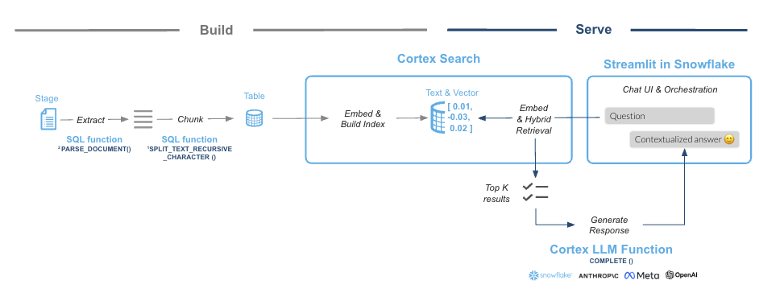
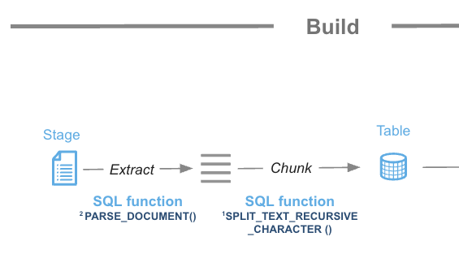
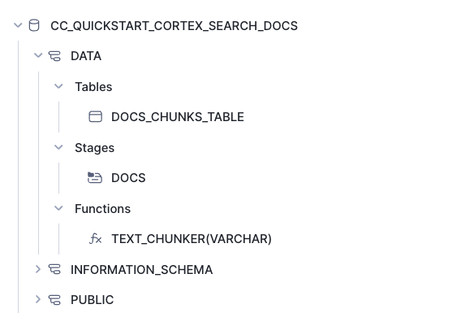
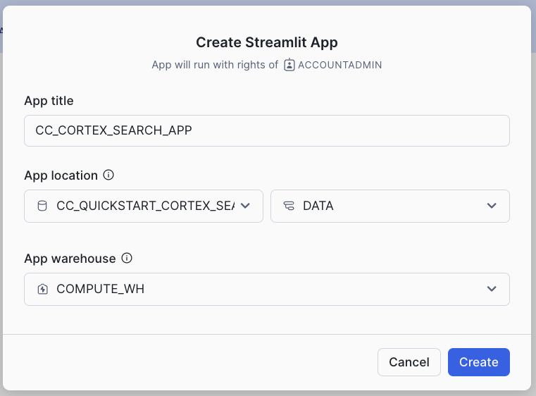
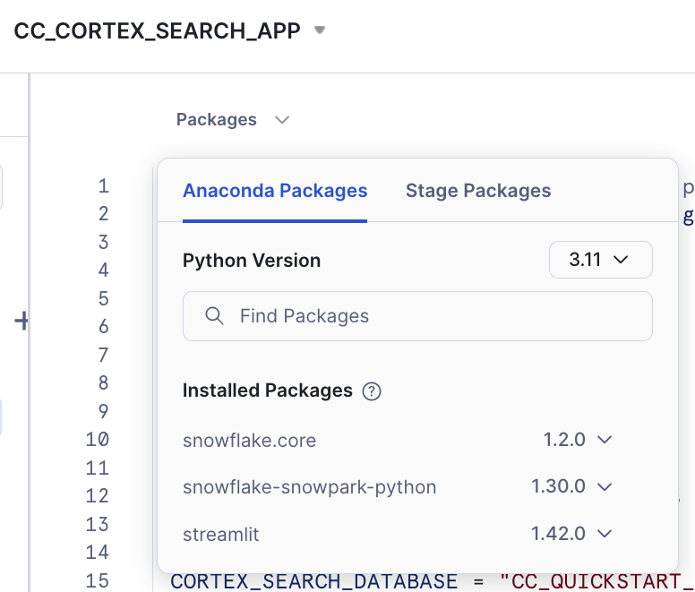
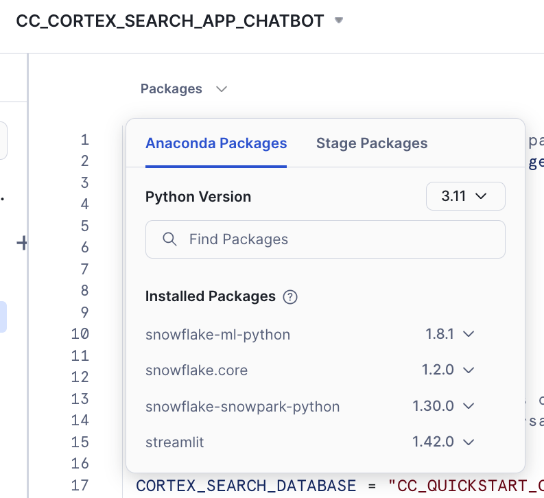

author: Carlos Carrero
id: ask-questions-to-your-documents-using-rag-with-snowflake-cortex-search
summary: Step-by-step guide on how to create a RAG app using Snowflake Cortex Search and Streamlit. 
categories: featured,getting-started,data-science, gen-ai 
environments: web 
tags: Snowpark Python, Streamlit, Generative AI, Snowflake Cortex, Vectors, Embeddings, Getting Started
status: Hidden
feedback link: https://github.com/Snowflake-Labs/sfguides/issues


# Build a Retrieval Augmented Generation (RAG) based LLM assistant using Streamlit and Snowflake Cortex Search

<!-- ------------------------ -->
## Overview 
Duration: 5

To reduce hallucinations (i.e. incorrect responses), LLMs can be combined with private datasets. Today, the most common approach for reducing hallucinations without having to change the model (e.g. fine-tuning) is the Retrieval Augmented Generation (RAG) framework. RAG allows you to “ground” the model’s responses by making a set of relevant documents available to the LLM as context in the response. 

In this quickstart we will show you how to quickly and securely build a full-stack RAG application in Snowflake without having to build integrations, manage any infrastructure or deal with security concerns with data moving outside of the Snowflake governance framework. 

This guide will leverage Cortex Search, a fully managed service that automatically creates embeddings for your data and perform retrievals using a hybrid search engine, using embeddings for semantic similarity plus keyword search for lexical similarity, achieving state-of-the-art retrieval quality.

We will show you how easy it is to implement RAG via a chat assistant that knows everything about products. To make the assistant an expert in your bikes and snow gears, we are going to give it access to a few User Manuals. This template can easily be adapted to other documents that may be more interesting to you whether its financial reports, research documents or anything else! 

### What You Will Build
The final product includes an application that lets users test how the LLM responds with and without the context document(s) to show how RAG can address hallucinations.  


### RAG Overview

In a typical RAG application, there ia a process to chunk and embeed the content into a Vector store that is used later to retrieve the similar chunks of content, who are passed into a LLM to provide an answer:


Snowflake Cortex is a fully managed indexing and retrieval service that simplifies and empower RAG applications. The service automatically creates embeddings and indexes and provides an enterprise search service that can be acessed via APIs:



### What You Will Learn 
- How to create functions that use Python libraries using [Snowpark](https://snowflake.com/snowpark)
- How to use power search experiences using [Snowflake Cortex Search](https://docs.snowflake.com/LIMITEDACCESS/cortex-search/cortex-search-overview)
- How to use LLMs using serverless functions in [Snowflake Cortex AI](https://snowflake.com/cortex)
- How to build a front-end with Python using [Streamlit in Snowflake](https://www.snowflake.com/en/data-cloud/overview/streamlit-in-snowflake/)


### Prerequisites
- Snowflake account in a cloud region where Snowflake Cortex LLM functions are supported
- Check [LLM availability](https://docs.snowflake.com/en/user-guide/snowflake-cortex/llm-functions?_ga=2.5151286.405859672.1709568467-277021311.1701887324&_gac=1.124754680.1707955750.Cj0KCQiA5rGuBhCnARIsAN11vgRLWfK6RIoIEqcZ7cFas8qwN4yCoL0q9nttp5UEmSocnPmhdBG57fgaAjqNEALw_wcB&_fsi=j2b82Wl3#availability) to help you decide where you want to create your snowflake account
- A Snowflake account with [Anaconda Packages](https://docs.snowflake.com/en/developer-guide/udf/python/udf-python-packages.html#using-third-party-packages-from-anaconda) enabled by ORGADMIN.

<!-- ------------------------ -->
## Organize Documents and Create Pre-Processing Functions
Duration: 15

In Snowflake, databases and schemas are used to organize and govern access to data and logic. Let´s start by getting a few documents locally and then create a database that will hold the PDFs, the functions that will process (extract and chunk) those PDFs and the table that will hold the text and that will be used to create the Cortex Search service. 

**Step 1**. Download example documents

Let's download a few documents we have created about bikes and skis. In those documents we have added some very specific information about those ficticious models. You can always add more or use a different type of documents that you want to try asking questions against. At the end we are going to test how the LLM responds with and without access to the information in the documents. 

- [Mondracer Infant Bike](https://github.com/Snowflake-Labs/sfquickstarts/blob/master/site/sfguides/src/ask-questions-to-your-documents-using-rag-with-snowflake-cortex/assets/Mondracer_Infant_Bike.pdf)
- [Premium Bycycle User Guide](https://github.com/Snowflake-Labs/sfquickstarts/blob/master/site/sfguides/src/ask-questions-to-your-documents-using-rag-with-snowflake-cortex/assets/Premium_Bicycle_User_Guide.pdf)
- [Ski Boots TDBootz Special](https://github.com/Snowflake-Labs/sfquickstarts/blob/master/site/sfguides/src/ask-questions-to-your-documents-using-rag-with-snowflake-cortex/assets/Ski_Boots_TDBootz_Special.pdf)
- [The Ultimate Downhill Bike](https://github.com/Snowflake-Labs/sfquickstarts/blob/master/site/sfguides/src/ask-questions-to-your-documents-using-rag-with-snowflake-cortex/assets/The_Ultimate_Downhill_Bike.pdf)
- [The Xtreme Road Bike 105 SL](https://github.com/Snowflake-Labs/sfquickstarts/blob/master/site/sfguides/src/ask-questions-to-your-documents-using-rag-with-snowflake-cortex/assets/The_Xtreme_Road_Bike_105_SL.pdf)
- [Carver Skis Specification Guide]
- [OutPiste Skis Specification Guide]
- [RacingFast Skis Specification Guide]

**Step 2**. Open a new Worksheet

Relevant documentation: [Creating Snowflake Worksheets](https://docs.snowflake.com/en/user-guide/ui-snowsight-worksheets-gs#create-worksheets-in-sf-web-interface). 

**Step 3**. Create a database and a schema

Run the following code inside your newly created worksheet

```SQL
CREATE DATABASE CC_QUICKSTART_CORTEX_SEARCH_DOCS;
CREATE SCHEMA DATA;
```
Relevant documentation: [Database and Schema management](https://docs.snowflake.com/en/sql-reference/ddl-database)


**Step 4**. Create a table function that will read the PDF documents and split them in chunks

We will be using the PyPDF2 and Langchain Python libraries to accomplish the necessary document processing tasks. Because as part of Snowpark Python these are available inside the integrated Anaconda repository, there are no manual installs or Python environment and dependency management required. 

Relevant documentation: 
- [Using third-party libraries in Snowflake](https://docs.snowflake.com/en/developer-guide/udf/python/udf-python-packages)
- [Python User Defined Table Function](https://docs.snowflake.com/en/developer-guide/snowpark/python/creating-udtfs)

Create the function by [running the following query](https://docs.snowflake.com/en/user-guide/ui-snowsight-query#executing-and-running-queries) inside your worksheet

```SQL
create or replace function pdf_text_chunker(file_url string)
returns table (chunk varchar)
language python
runtime_version = '3.9'
handler = 'pdf_text_chunker'
packages = ('snowflake-snowpark-python','PyPDF2', 'langchain')
as
$$
from snowflake.snowpark.types import StringType, StructField, StructType
from langchain.text_splitter import RecursiveCharacterTextSplitter
from snowflake.snowpark.files import SnowflakeFile
import PyPDF2, io
import logging
import pandas as pd

class pdf_text_chunker:

    def read_pdf(self, file_url: str) -> str:
    
        logger = logging.getLogger("udf_logger")
        logger.info(f"Opening file {file_url}")
    
        with SnowflakeFile.open(file_url, 'rb') as f:
            buffer = io.BytesIO(f.readall())
            
        reader = PyPDF2.PdfReader(buffer)   
        text = ""
        for page in reader.pages:
            try:
                text += page.extract_text().replace('\n', ' ').replace('\0', ' ')
            except:
                text = "Unable to Extract"
                logger.warn(f"Unable to extract from file {file_url}, page {page}")
        
        return text

    def process(self,file_url: str):

        text = self.read_pdf(file_url)
        
        text_splitter = RecursiveCharacterTextSplitter(
            chunk_size = 1512, #Adjust this as you see fit
            chunk_overlap  = 256, #This let's text have some form of overlap. Useful for keeping chunks contextual
            length_function = len
        )
    
        chunks = text_splitter.split_text(text)
        df = pd.DataFrame(chunks, columns=['chunks'])
        
        yield from df.itertuples(index=False, name=None)
$$;
```

**Step 5**. Create a Stage with Directory Table where you will be uploading your documents

```SQL
create or replace stage docs ENCRYPTION = (TYPE = 'SNOWFLAKE_SSE') DIRECTORY = ( ENABLE = true );
```

**Step 6**. Upload documents to your staging area
- Select **Data** on the left of Snowsight
- Click on your database **CC_QUICKSTART_CORTEX_SEARCH_DOCS**
- Click on your schema **DATA**
- Click on **Stages** and select **DOCS**
- On the top right click on the +Files botton
- Drag and drop the two PDF files you downloaded


**Step 7**. Check files has been successfully uploaded

Run this query to check what documents are in the staging area

```SQL
ls @docs;
```


<!-- ------------------------ -->
## Pre-process and Label Documents
Duration: 15

In this step we are going to leverage our document processing functions to prepare documents before enabling Cortex Search. We are also going to use Cortex LLM serverless capabilities in order to label the type of document being processed so we can use that metadata to filter searches.



**Step 1**. Create the table where we are going to store the chunks for each PDF. 

```SQL
create or replace TABLE DOCS_CHUNKS_TABLE ( 
    RELATIVE_PATH VARCHAR(16777216), -- Relative path to the PDF file
    SIZE NUMBER(38,0), -- Size of the PDF
    FILE_URL VARCHAR(16777216), -- URL for the PDF
    SCOPED_FILE_URL VARCHAR(16777216), -- Scoped url (you can choose which one to keep depending on your use case)
    CHUNK VARCHAR(16777216), -- Piece of text
    CATEGORY VARCHAR(16777216) -- Will hold the document category to enable filtering
);
```

**Step 2**. Use the function previously created to process the PDF files and extract the chunks. There is no need to create embeddings as that will be managed automatically by Cortex Search service later.

```SQL
insert into docs_chunks_table (relative_path, size, file_url,
                            scoped_file_url, chunk)
    select relative_path, 
            size,
            file_url, 
            build_scoped_file_url(@docs, relative_path) as scoped_file_url,
            func.chunk as chunk
    from 
        directory(@docs),
        TABLE(pdf_text_chunker(build_scoped_file_url(@docs, relative_path))) as func;
```

### Label the product category:

We are going to use the power of Large Language Models to easily classify the documents we are ingesting in our RAG application. We are just going to use the file name but you could also use some of the content of the doc itself. Depending on your use case you may want to use different approaches. We are going to use a foundation LLM but you could even fine-tune your own one for your own classification use case as demoed in this [Serverless LLM Fine-tuning using Snowflake Cortex AI](https://quickstarts.snowflake.com/guide/finetuning_llm_using_snowflake_cortex_ai/index.html?index=..%2F..index#0) quickstart

First we will create a temporary table with each unique file name and we will be passing that file name to one LLM using Cortex Complete function with a prompt to classify what that use guide refres too. The prompt will be as simple as this but you can try to customize it depending on your use case and documents. Classification is not mandatory for Cortex Search but we want to use it here to also demo hybrid search.

This will be the prompt where we are adding the file name:

```SQL
      'Given the name of the file between <file> and </file> determine if it is related to bikes or snow. Use only one word <file> ' || relative_path || '</file>'
```
Run this SQL to create that table:

```SQL
CREATE
OR REPLACE TEMPORARY TABLE docs_categories AS WITH unique_documents AS (
  SELECT
    DISTINCT relative_path
  FROM
    docs_chunks_table
),
docs_category_cte AS (
  SELECT
    relative_path,
    TRIM(snowflake.cortex.COMPLETE (
      'llama3-70b',
      'Given the name of the file between <file> and </file> determine if it is related to bikes or snow. Use only one word <file> ' || relative_path || '</file>'
    ), '\n') AS category
  FROM
    unique_documents
)
SELECT
  *
FROM
  docs_category_cte;
```

You can check that table to identify how many categories have been created and if they are correct:

```SQL
select category from docs_categories group by category;
```

Also notice that different LLMs will provide different results. In this specific ase, llama3-70b was providing the best results with the lower cost. You may want to experiment different options.

In this example we got Snow and Bike categories. We will be using those later to filter with Cortex Search:


We can also check that each document category is correct:


Now we can just update the table with the chunks of text that will be used by Cortex Search service to include the category for each document:

```SQL
update docs_chunks_table 
  SET category = docs_categories.category
  from docs_categories
  where  docs_chunks_table.relative_path = docs_categories.relative_path;
```
With the table updated we are now ready to enable the Cortex Search service in that table.

After completing all the steps in this section you should see the following objects in your database:

- The **DOCS_CHUNKS_TABLE** that contains the text and categories for each document
- The **DOCS** Stage with your PDF files
- The **PDF_TEXT_CHUNKER** function that extracts and chunk the text from the PDF files



<!-- ------------------------ -->
## Create Cortex Search Service
Duration: 5

Next step is to create the CORTEX SEARCH SERVICE in the table we have created before. We will execute this SQL command:

```SQL
create or replace CORTEX SEARCH SERVICE CC_SEARCH_SERVICE_CS
ON chunk
ATTRIBUTES category
warehouse = XS_WH
TARGET_LAG = '1 minute'
as (
    select chunk,
        relative_path,
        file_url,
        category
    from docs_chunks_table
);
```

- The name of the service is **CC_SEARCH_SERVICE_CS**
- The service will use the column **chunk** to create embeddings and perform retrieval based on similarity search
- The column **category** could be used as a filter
- To keep this service updated the warehosue **XW_WH** will be used. You may want to type the name of your own warehouse.
- The service will be refreshed every minute
- The data retrieved will contain the **chunk, relative_path, file_url and category**

This is all what we have to do. There is no need here to create embeddings as that is done automatically. We can now use the API to query the service.

<!-- ------------------------ -->
## Build Chat UI and Chat (Retrieval and Generation) Logic
Duration: 15

To make it easy for anyone to ask questions against the Cortex Search service, let's create a fairly simple front-end using Streamlit. As part of the app, we will provide the end-user with a toggle that allows testing of LLM responses with and without access to the context to observe the differences. The app will also show what are the pieces of text that the service is returning and that are used to fill the calls to LLM to create the answers.

Streamlit in Snowflake allows you to run the app and share it with other Snowflake users within the same account. This ensures data remains secure and protected and is only available to users that meet your role-based access policies. 

Relevant documentation: [Introduction to Streamlit in Snowflake](https://docs.snowflake.com/en/developer-guide/streamlit/about-streamlit)

1. Click on the **Streamlit** tab on the left
2. Clickn on **+ Streamlit App** button on the right
3. Give the App a name (CC_CORTEX_SEARCH_APP in my example)
4. Select the warehouse to run the App (a Small WH will be enough)
5. Choose the **CC_QUICKSTART_CORTEX_SEARCH_DOCS** database and **DATA** schema



The Streamlit app comes with a default template you can delete and replace with this code which includes the front-end elements:

- Table with list of available documents
- Toggle to choose to use documents as context
- Question input box
- Filter for a type of product

And also includes the retrieval and generation logic:

- Using the Cortex Search service to retrieve the relevant chunks of text
- Prompt template that instructs LLM how to answer using relevant chunks

```python
import streamlit as st # Import python packages
from snowflake.snowpark.context import get_active_session

from snowflake.core import Root

import pandas as pd
import json

pd.set_option("max_colwidth",None)

### Default Values
NUM_CHUNKS = 3 # Num-chunks provided as context. Play with this to check how it affects your accuracy

# service parameters
CORTEX_SEARCH_DATABASE = "CC_QUICKSTART_CORTEX_SEARCH_DOCS"
CORTEX_SEARCH_SCHEMA = "DATA"
CORTEX_SEARCH_SERVICE = "CC_SEARCH_SERVICE_CS"
######
######

# columns to query in the service
COLUMNS = [
    "chunk",
    "relative_path",
    "category"
]

session = get_active_session()
root = Root(session)                         

svc = root.databases[CORTEX_SEARCH_DATABASE].schemas[CORTEX_SEARCH_SCHEMA].cortex_search_services[CORTEX_SEARCH_SERVICE]
   
### Functions
     
def config_options():

    st.sidebar.selectbox('Select your model:',(
                                    'mixtral-8x7b',
                                    'snowflake-arctic',
                                    'mistral-large',
                                    'llama3-8b',
                                    'llama3-70b',
                                    'reka-flash',
                                     'mistral-7b',
                                     'llama2-70b-chat',
                                     'gemma-7b'), key="model_name")

    categories = session.sql("select category from docs_chunks_table group by category").collect()

    cat_list = ['ALL']
    for cat in categories:
        cat_list.append(cat.CATEGORY)
            
    st.sidebar.selectbox('Select what products you are looking for', cat_list, key = "category_value")

    st.sidebar.expander("Session State").write(st.session_state)

def get_similar_chunks_search_service(query):

    if st.session_state.category_value == "ALL":
        response = svc.search(query, COLUMNS, limit=NUM_CHUNKS)
    else: 
        filter_obj = {"@eq": {"category": st.session_state.category_value} }
        response = svc.search(query, COLUMNS, filter=filter_obj, limit=NUM_CHUNKS)

    st.sidebar.json(response.json())
    
    return response.json()  

def create_prompt (myquestion):

    if st.session_state.rag == 1:
        prompt_context = get_similar_chunks_search_service(myquestion)
  
        prompt = f"""
           You are an expert chat assistance that extracs information from the CONTEXT provided
           between <context> and </context> tags.
           When ansering the question contained between <question> and </question> tags
           be concise and do not hallucinate. 
           If you don´t have the information just say so.
           Only anwer the question if you can extract it from the CONTEXT provideed.
           
           Do not mention the CONTEXT used in your answer.
    
           <context>          
           {prompt_context}
           </context>
           <question>  
           {myquestion}
           </question>
           Answer: 
           """

        json_data = json.loads(prompt_context)

        relative_paths = set(item['relative_path'] for item in json_data['results'])
        
    else:     
        prompt = f"""[0]
         'Question:  
           {myquestion} 
           Answer: '
           """
        relative_paths = "None"
            
    return prompt, relative_paths

def complete(myquestion):

    prompt, relative_paths =create_prompt (myquestion)
    cmd = """
            select snowflake.cortex.complete(?, ?) as response
          """
    
    df_response = session.sql(cmd, params=[st.session_state.model_name, prompt]).collect()
    return df_response, relative_paths

def main():
    
    st.title(f":speech_balloon: Chat Document Assistant with Snowflake Cortex")
    st.write("This is the list of documents you already have and that will be used to answer your questions:")
    docs_available = session.sql("ls @docs").collect()
    list_docs = []
    for doc in docs_available:
        list_docs.append(doc["name"])
    st.dataframe(list_docs)

    config_options()

    st.session_state.rag = st.sidebar.checkbox('Use your own documents as context?')

    question = st.text_input("Enter question", placeholder="Is there any special lubricant to be used with the premium bike?", label_visibility="collapsed")

    if question:
        response, relative_paths = complete(question)
        res_text = response[0].RESPONSE
        st.markdown(res_text)

        if relative_paths != "None":
            with st.sidebar.expander("Related Documents"):
                for path in relative_paths:
                    cmd2 = f"select GET_PRESIGNED_URL(@docs, '{path}', 360) as URL_LINK from directory(@docs)"
                    df_url_link = session.sql(cmd2).to_pandas()
                    url_link = df_url_link._get_value(0,'URL_LINK')
        
                    display_url = f"Doc: [{path}]({url_link})"
                    st.sidebar.markdown(display_url)
                
if __name__ == "__main__":
    main()
```

When you past that code, if it is run, you will get this error:


The reason is that we need to add the package **snowflake.core** in our Streamlit App. 

Click on **Packages** and look for **snowflake.core**


After adding it you should be able to run the app.

### Explanation

Let´s go step by step what that code is doing:

First, we use st.sidebar to place all options on the left. There we include:
- A selectbox for the LLM to be used
- A selectbox to allow filtering for one category. This will be used by Cortex Search
- Check the session state (really for debugging purposes when building the app)
- We will print here the chunks used and the link to the relevant documents

The main() function collect the user question and call a complete() function with the question. This one calls the create_prompt() function that uses get_similar_chunks_search_service() with the question. This is the function that calls Cortex Search service for retrieval with this code:

```python
def get_similar_chunks_search_service(query):

    if st.session_state.category_value == "ALL":
        response = svc.search(query, COLUMNS, limit=NUM_CHUNKS)
    else: 
        filter_obj = {"@eq": {"category": st.session_state.category_value} }
        response = svc.search(query, COLUMNS, filter=filter_obj, limit=NUM_CHUNKS)

    st.sidebar.json(response.json())
    
    return response.json()  
```

Depending if we want to filter for any category, we use the filter object or not. Previously, we have created the **svc** handler that is pointing to the Cortex Search service:

```python
root = Root(session)                         

svc = root.databases[CORTEX_SEARCH_DATABASE].schemas[CORTEX_SEARCH_SCHEMA].cortex_search_services[CORTEX_SEARCH_SERVICE]
```

The complete() function which combines the LLM, the prompt template and whether to use the context or not to generate a response which includes a link to the asset from which the answer was obtained. 

```python
def complete(myquestion):

    prompt, relative_paths =create_prompt (myquestion)
    cmd = """
            select snowflake.cortex.complete(?, ?) as response
          """
    
    df_response = session.sql(cmd, params=[st.session_state.model_name, prompt]).collect()
    return df_response, relative_paths
```

### Deploy and share your AI-powered app

Streamlit in Snowflake provides a side-by-side editor and preview screen that makes it easy and fast to iterate and visalize changes.


In the app, we can see the documents we had uploaded previously and can be used to ask questions while trying multiple options using interactive widgets available on the side.

To test out the RAG framework, here a few questions you can ask and then use the interactive widgets to compare the results when using a different LLM or when choosing to get a response without the context. This is related to very specific information that we have added into the documents and that is very unique to our products.

- Is there any special lubricant to be used with the premium bike?
- What is the warranty for the premium bike?
- Does the mondracer infant bike need any special tool?
- Is there any temperature to be considered with the premium bicycle?
- What is the temperature to store the ski boots?
- Where have the ski boots been tested and who tested them?


### Other things to test

In this example we have just decided a fixed format for chunks and used only the top result in the retrieval process. This [blog](https://medium.com/@thechosentom/rag-made-simple-with-snowflake-cortex-74d1df5143fd) provides some considerations about settings in the chunking function in our Snowpark UDTF. 

This is the recommendation from the [Cortex Search documentation](https://docs.snowflake.com/LIMITEDACCESS/cortex-search/cortex-search-overview):

For optimal search results with Cortex Search, Snowflake recommends splitting the text in your search column into chunks of no more than 512 tokens (about 385 English words). A token is the smallest unit of text processed by a large language model.

When an entry in the search column contains more than 512 tokens, Cortex Search performs keyword-based retrieval on the entire body of text, but only uses the first 512 tokens for semantic (i.e., vector-based) retrieval.


```python
        text_splitter = RecursiveCharacterTextSplitter(
            chunk_size = 1512, #Adjust this as you see fit
            chunk_overlap  = 256, #This let's text have some form of overlap. Useful for keeping chunks contextual
            length_function = len
        )
```

You can also try different instructions in your prompt and see how the responses may vary. Simply replace any of the text and run the app again. The prompt is very important. Make sure you are clear in the ask and the instruction and it may change depending on your own use case.

```python
        prompt = f"""
           You are an expert chat assistance that extracs information from the CONTEXT provided
           between <context> and </context> tags.
           When ansering the question contained between <question> and </question> tags
           be concise and do not hallucinate. 
           If you don´t have the information just say so.
           Only anwer the question if you can extract it from the CONTEXT provideed.
           
           Do not mention the CONTEXT used in your answer.
    
           <context>          
           {prompt_context}
           </context>
           <question>  
           {myquestion}
           </question>
           Answer: 
           """
```

You can also try to change the number of chunks that are provided as context by simply modifying this value:

```python
NUM_CHUNKS = 3 # Num-chunks provided as context. Play with this to check how it affects your accuracy
```

<!-- ------------------------ -->
## Build a ChatBot UI that Remember Previous Conversations
Duration: 15

In the previous section we have created a simple interface where we can ask questions about our documents and select the LLM running within Snowflake Cortex to answer the question. We have seen that when no context from our documents is provided, we just get a general answer, versus a specific answer related to our documents when we use context from the PDFs. But what if we want to have a conversation sytle?

Streamlit makes it very easy to create chat interfaces with its [Chat Elements](https://docs.streamlit.io/library/api-reference/chat). In this section we are going to see how we can write a simple app that can be used to have a conversation, and how it uses the data from our documents to provide answers.

Large Language Models (LLMs) are stateless. That means when we make a call to any of them, it does not remember what  the previous call was about. With Snowflake Cortex, each complete() call we make is independent, even when using the same model. There are several techniques that can be used to keep the conversation flow and do not forget the chat history. In summary, the app needs to keep a memory of the conversation and provide it in each call to the LLM. As we know, calls to LLMs are restricted by the context window length that can be used.

In this lab, we are going to use a slide window concept. This helps to remember just a number of past interactions when calling the LLM. We are also going to summarize the previous conversation in order to find the right chunk in our documents that will help the LLM and provide the right answer. In the previous section, we were embedding the new question to find the right chunk for context. Here, we are going to also include the previous summary to find the chunks that will be used as context.


First let´s create the new Streamlit App and then we will discuss each of the steps. Give it a name and create it within the database and schema that we are using in this lab (CC_QUICKSTART_CORTEX_SEARCH_DOCS.DATA) or whatever name you may have chosen.


In this second app, we are going to demo how to access the Complete function from Snowlfake Cortex via Python API instead of SQL as we did in the previous app. To get access to the API, you need to specify the snowflake-ml-python package in your Streamlit app:




The Streamlit app comes with a default template you can delete and replace with this code which includes the front-end elements:

```python
import streamlit as st # Import python packages
from snowflake.snowpark.context import get_active_session

from snowflake.cortex import Complete
from snowflake.core import Root

import pandas as pd
import json

pd.set_option("max_colwidth",None)

### Default Values
NUM_CHUNKS = 3 # Num-chunks provided as context. Play with this to check how it affects your accuracy
slide_window = 7 # how many last conversations to remember. This is the slide window.

# service parameters
CORTEX_SEARCH_DATABASE = "CC_QUICKSTART_CORTEX_SEARCH_DOCS"
CORTEX_SEARCH_SCHEMA = "DATA"
CORTEX_SEARCH_SERVICE = "CC_SEARCH_SERVICE_CS"
######
######

# columns to query in the service
COLUMNS = [
    "chunk",
    "relative_path",
    "category"
]

session = get_active_session()
root = Root(session)                         

svc = root.databases[CORTEX_SEARCH_DATABASE].schemas[CORTEX_SEARCH_SCHEMA].cortex_search_services[CORTEX_SEARCH_SERVICE]
   
### Functions
     
def config_options():

    st.sidebar.selectbox('Select your model:',(
                                    'mixtral-8x7b',
                                    'snowflake-arctic',
                                    'mistral-large',
                                    'llama3-8b',
                                    'llama3-70b',
                                    'reka-flash',
                                     'mistral-7b',
                                     'llama2-70b-chat',
                                     'gemma-7b'), key="model_name")

    categories = session.table('docs_chunks_table').select('category').distinct().collect()

    cat_list = ['ALL']
    for cat in categories:
        cat_list.append(cat.CATEGORY)
            
    st.sidebar.selectbox('Select what products you are looking for', cat_list, key = "category_value")

    st.sidebar.checkbox('Do you want that I remember the chat history?', key="use_chat_history", value = True)

    st.sidebar.checkbox('Debug: Click to see summary generated of previous conversation', key="debug", value = True)
    st.sidebar.button("Start Over", key="clear_conversation", on_click=init_messages)
    st.sidebar.expander("Session State").write(st.session_state)

def init_messages():

    # Initialize chat history
    if st.session_state.clear_conversation or "messages" not in st.session_state:
        st.session_state.messages = []

def get_similar_chunks_search_service(query):

    if st.session_state.category_value == "ALL":
        response = svc.search(query, COLUMNS, limit=NUM_CHUNKS)
    else: 
        filter_obj = {"@eq": {"category": st.session_state.category_value} }
        response = svc.search(query, COLUMNS, filter=filter_obj, limit=NUM_CHUNKS)

    st.sidebar.json(response.json())
    
    return response.json()  

def get_chat_history():
#Get the history from the st.session_stage.messages according to the slide window parameter
    
    chat_history = []
    
    start_index = max(0, len(st.session_state.messages) - slide_window)
    for i in range (start_index , len(st.session_state.messages) -1):
         chat_history.append(st.session_state.messages[i])

    return chat_history

def summarize_question_with_history(chat_history, question):
# To get the right context, use the LLM to first summarize the previous conversation
# This will be used to get embeddings and find similar chunks in the docs for context

    prompt = f"""
        Based on the chat history below and the question, generate a query that extend the question
        with the chat history provided. The query should be in natual language. 
        Answer with only the query. Do not add any explanation.
        
        <chat_history>
        {chat_history}
        </chat_history>
        <question>
        {question}
        </question>
        """
    
    sumary = Complete(st.session_state.model_name, prompt)   

    if st.session_state.debug:
        st.sidebar.text("Summary to be used to find similar chunks in the docs:")
        st.sidebar.caption(sumary)

    sumary = sumary.replace("'", "")

    return sumary

def create_prompt (myquestion):

    if st.session_state.use_chat_history:
        chat_history = get_chat_history()

        if chat_history != []: #There is chat_history, so not first question
            question_summary = summarize_question_with_history(chat_history, myquestion)
            prompt_context =  get_similar_chunks_search_service(question_summary)
        else:
            prompt_context = get_similar_chunks_search_service(myquestion) #First question when using history
    else:
        prompt_context = get_similar_chunks_search_service(myquestion)
        chat_history = ""
  
    prompt = f"""
           You are an expert chat assistance that extracs information from the CONTEXT provided
           between <context> and </context> tags.
           You offer a chat experience considering the information included in the CHAT HISTORY
           provided between <chat_history> and </chat_history> tags..
           When ansering the question contained between <question> and </question> tags
           be concise and do not hallucinate. 
           If you don´t have the information just say so.
           
           Do not mention the CONTEXT used in your answer.
           Do not mention the CHAT HISTORY used in your asnwer.

           Only anwer the question if you can extract it from the CONTEXT provideed.
           
           <chat_history>
           {chat_history}
           </chat_history>
           <context>          
           {prompt_context}
           </context>
           <question>  
           {myquestion}
           </question>
           Answer: 
           """
    
    json_data = json.loads(prompt_context)

    relative_paths = set(item['relative_path'] for item in json_data['results'])

    return prompt, relative_paths


def answer_question(myquestion):

    prompt, relative_paths =create_prompt (myquestion)

    response = Complete(st.session_state.model_name, prompt)   

    return response, relative_paths

def main():
    
    st.title(f":speech_balloon: Chat Document Assistant with Snowflake Cortex")
    st.write("This is the list of documents you already have and that will be used to answer your questions:")
    docs_available = session.sql("ls @docs").collect()
    list_docs = []
    for doc in docs_available:
        list_docs.append(doc["name"])
    st.dataframe(list_docs)

    config_options()
    init_messages()
     
    # Display chat messages from history on app rerun
    for message in st.session_state.messages:
        with st.chat_message(message["role"]):
            st.markdown(message["content"])
    
    # Accept user input
    if question := st.chat_input("What do you want to know about your products?"):
        # Add user message to chat history
        st.session_state.messages.append({"role": "user", "content": question})
        # Display user message in chat message container
        with st.chat_message("user"):
            st.markdown(question)
        # Display assistant response in chat message container
        with st.chat_message("assistant"):
            message_placeholder = st.empty()
    
            question = question.replace("'","")
    
            with st.spinner(f"{st.session_state.model_name} thinking..."):
                response, relative_paths = answer_question(question)            
                response = response.replace("'", "")
                message_placeholder.markdown(response)

                if relative_paths != "None":
                    with st.sidebar.expander("Related Documents"):
                        for path in relative_paths:
                            cmd2 = f"select GET_PRESIGNED_URL(@docs, '{path}', 360) as URL_LINK from directory(@docs)"
                            df_url_link = session.sql(cmd2).to_pandas()
                            url_link = df_url_link._get_value(0,'URL_LINK')
                
                            display_url = f"Doc: [{path}]({url_link})"
                            st.sidebar.markdown(display_url)

        
        st.session_state.messages.append({"role": "assistant", "content": response})


if __name__ == "__main__":
    main()
```

For educational purposes we have enabled a check "Do you want that I remember the chat history?" that when disabled, the app will not use memory. So each question will be independent from the previous ones. This is what happens when we are not using memory:


Basically, each question is answered individually. The second question loses the context.

Now when asking the same questions but using memory the firs thing to notice is that we have re-created the new question adding the previous context:


The new question that is used to search for similar chunks is "What is the Rincon del Cielo bike made of?"


### Code Explanation

```python
def get_chat_history():
```
This function is going to return the previous conversation in the chat up to a limit defined by the global variable slide_window. We take advantage of:

<code>st.session_state.messages</code>

Everytime a question is asked is stored in the state with this code:

    st.session_state.messages.append({"role": "user", "content": question})

And the responses provided are also stored:

    st.session_state.messages.append({"role": "assistant", "content": res_text})

Therefore <code>st.session_state.messages</code> is used as the chat memory

This next function <code>summarize_question_with_history()</code> takes the chat_history that we have got previously and the new question being asked. Remember that we are using the information from the PDF documents to answer questions. Therefore, we need to identify using Cortex Search what chunk of text will be relevant to answer the question. 

Therefore, if we just use "what is it made of" sentence to look for the similar chunks, probably we will not get the right one. We need to include more information in the call we make to <code>get_similar_chunks()</code>. 

Take a look this <code>summarize_question_with_history()</code> function:

```python
def summarize_question_with_history(chat_history, question):
# To get the right context, use the LLM to first summarize the previous conversation
# This will be used to get embeddings and find similar chunks in the docs for context

    prompt = f"""
        Based on the chat history below and the question, generate a query that extend the question
        with the chat history provided. The query should be in natual language. 
        Answer with only the query. Do not add any explanation.
        
        <chat_history>
        {chat_history}
        </chat_history>
        <question>
        {question}
        </question>
        """
    
    sumary = Complete(st.session_state.model_name, prompt)   

    if st.session_state.debug:
        st.sidebar.text("Summary to be used to find similar chunks in the docs:")
        st.sidebar.caption(sumary)

    sumary = sumary.replace("'", "")

    return sumary
```

In that function we are using the <code>Complete()</code> API  where we have created a specific prompt to provide a chat history and the new question in order to get the query that will be used to find the right context.

In order to experiment with this, we have also created a selection check "Debug: Click to see summary generated of previous conversation" that will allow you to see what is the question being used to look for similar chunks.


Now the function:

```python
def create_prompt (myquestion):
```

Use all those previous functions to get the <b>chat_history</b> and <b>prompt_context</b> and build the prompt. So, this prompt is adding the previous conversation plus the context extracted from the PDFs and the new question.

```python
   prompt = f"""
           You are an expert chat assistance that extracs information from the CONTEXT provided
           between <context> and </context> tags.
           You offer a chat experience considering the information included in the CHAT HISTORY
           provided between <chat_history> and </chat_history> tags..
           When ansering the question contained between <question> and </question> tags
           be concise and do not hallucinate. 
           If you don´t have the information just say so.
           
           Do not mention the CONTEXT used in your answer.
           Do not mention the CHAT HISTORY used in your asnwer.

           Only anwer the question if you can extract it from the CONTEXT provideed.
           
           <chat_history>
           {chat_history}
           </chat_history>
           <context>          
           {prompt_context}
           </context>
           <question>  
           {myquestion}
           </question>
           Answer: 
           """
 ```

What makes this very easy with Streamlit are [st.chat_input](https://docs.streamlit.io/library/api-reference/chat/st.chat_input) and [st.chat_message](https://docs.streamlit.io/library/api-reference/chat/st.chat_message). This is the code that get the question with st.chat_input, add it to st.chat_message and to the memmory with st.session_state.messages.append and call <b>answer_question()</b> function to get the answer that is also printed and stored:

```python
    if question := st.chat_input("What do you want to know about your products?"):
        # Add user message to chat history
        st.session_state.messages.append({"role": "user", "content": question})
        # Display user message in chat message container
        with st.chat_message("user"):
            st.markdown(question)
        # Display assistant response in chat message container
        with st.chat_message("assistant"):
            message_placeholder = st.empty()
    
            question = question.replace("'","")
    
            with st.spinner(f"{st.session_state.model_name} thinking..."):
                response, relative_paths = answer_question(question)            
                response = response.replace("'", "")
                message_placeholder.markdown(response)

                if relative_paths != "None":
                    with st.sidebar.expander("Related Documents"):
                        for path in relative_paths:
                            cmd2 = f"select GET_PRESIGNED_URL(@docs, '{path}', 360) as URL_LINK from directory(@docs)"
                            df_url_link = session.sql(cmd2).to_pandas()
                            url_link = df_url_link._get_value(0,'URL_LINK')
                
                            display_url = f"Doc: [{path}]({url_link})"
                            st.sidebar.markdown(display_url)

        
        st.session_state.messages.append({"role": "assistant", "content": response})
```
We are also printing the link to the documents being used to answer the questions.

Here another suggestion based on specific info from the documents (unique for us):

- What is the name of the ski boots?
- Where have been tested?
- Who tested them?
- Do they include any special component?


You can try with your own documents. You will notice different peformance depending on the LLM you will be using. 

<!-- ------------------------ -->
## Conclusion & Resources
Duration: 5

Congratulations! You've successfully performed RAG using Snowflake Cortex Search and securely built a full-stack RAG application in Snowflake without having to build integrations, manage any infrastructure or deal with security concerns with data moving outside of the Snowflake governance framework. 

### What You Learned
- Creating functions to automatically extract text and chunk PDF files
- Automatically identify document categories using LLMs
- Using Snowflake Cortex Search to use LLMs to answer questions
- Building an application front-end with Streamlit


### Related Resources

- [Docs: Snowflake Cortex LLM functions](https://docs.snowflake.com/en/user-guide/snowflake-cortex/llm-functions)
- [Blog: RAG explainer and how it works in Snowflake](https://www.snowflake.com/blog/easy-secure-llm-inference-retrieval-augmented-generation-rag-cortex)
- [Blog: Customizing RAG framework components using Snowpark Container Services](https://medium.com/@jason.summer/developing-a-product-chatbot-with-airmiles-in-snowflake-6b197d3fc424)
- [Docs: Snowflake Directory Tables](https://docs.snowflake.com/en/user-guide/data-load-dirtables)
- [Docs: Creating User-Defined Table Functions](https://docs.snowflake.com/en/developer-guide/snowpark/python/creating-udtfs)

---

