author: Carlos Carrero
id: asking_questions_to_your_own_documents_with_snowflake_cortex
summary: Step-by-step guide on how to create a RAG app using Snowflake Cortex and Streamlit. 
categories: featured,getting-started,data-science, gen-ai 
environments: web 
tags: Snowpark Python, Streamlit, Generative AI, Snowflake Cortex, Vectors, Embeddings, Getting Started
status: Published
feedback link: https://github.com/Snowflake-Labs/sfguides/issues


# Build a Retrieval Augmented Generation (RAG) based LLM assistant using Streamlit and Snowflake Cortex

<!-- ------------------------ -->
## Overview 
Duration: 5

To reduce hallucinations (i.e. incorrect responses), LLMs can be combined with private datasets. Today, the most common approach for reducing hallucinations without having to change the model (e.g. fine-tuning) is the Retrieval Augmented Generation (RAG) framework. RAG allows you to “ground” the model’s responses by making a set of relevant documents available to the LLM as context in the response. 

In this quickstart we will show you how to quickly and securely build a full-stack RAG application in Snowflake without having to build integrations, manage any infrastructure or deal with security concerns with data moving outside of the Snowflake governance framework. 

We will show you how easy it is to implement RAG via a chat assistant that knows everything about smart devices. This assistant can be really useful for your not so tech-savvy friend or relative that is always asking you questions about their electronics. To make the assistant an expert in a smart devices, we are going to give it access to a few User Manuals. This template can easily be adapted to other documents that may be more interesting to you whether its financial reports, research documents or anything else! 

Along the way, we will also share tips on how you could turn what may seem like a prototype into a production pipeline by showing you how to automatically process new documents as they are uploaded as well as learn about relevant Snowflake functionality to consider for additional enhancements. 

### What You Will Build
The final product includes an application that lets users test how the LLM responds with and without the context document(s) to show how RAG can address hallucinations.  


### RAG Overview

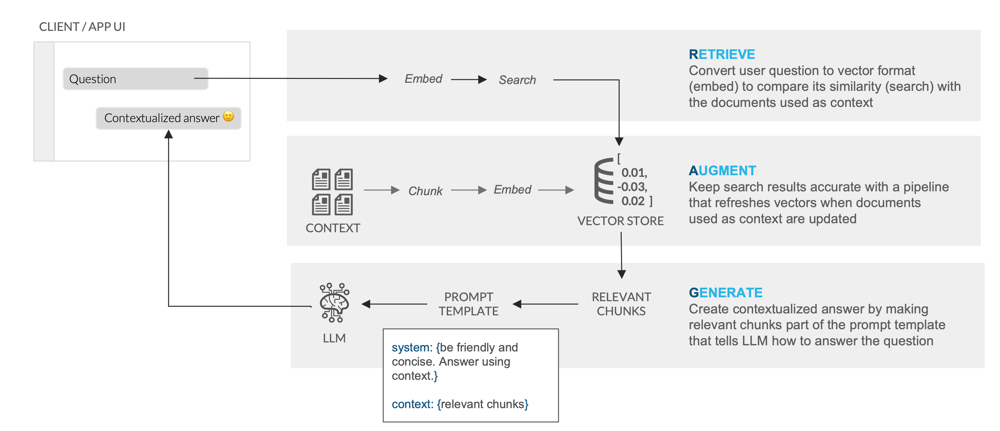

### RAG Overview in Snowflake

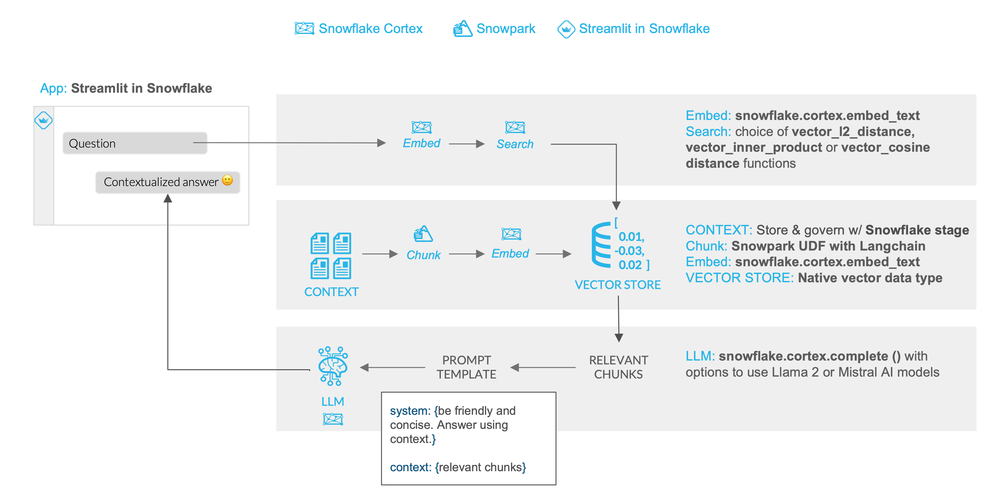

### What You Will Learn 
- How to create functions that use Python libraries using [Snowpark](https://snowflake.com/snowpark)
- How to generate embeddings, run semantic search and use LLMs using serverless functions in [Snowflake Cortex](https://snowflake.com/cortex)
- How to build a front-end with Python using [Streamlit in Snowflake](https://www.snowflake.com/en/data-cloud/overview/streamlit-in-snowflake/)
- Optional: How to automate data processing pipelines using directory tables, [Streams](https://docs.snowflake.com/en/user-guide/streams-intro) and [Task](https://docs.snowflake.com/en/user-guide/tasks-intro)

### Prerequisites
- Snowflake account in a cloud region where Snowflake Cortex LLM functions are supported
- Check [LLM availability](https://docs.snowflake.com/en/user-guide/snowflake-cortex/llm-functions?_ga=2.5151286.405859672.1709568467-277021311.1701887324&_gac=1.124754680.1707955750.Cj0KCQiA5rGuBhCnARIsAN11vgRLWfK6RIoIEqcZ7cFas8qwN4yCoL0q9nttp5UEmSocnPmhdBG57fgaAjqNEALw_wcB&_fsi=j2b82Wl3#availability) to help you decide where you want to create your snowflake account
- A Snowflake account with [Anaconda Packages](https://docs.snowflake.com/en/developer-guide/udf/python/udf-python-packages.html#using-third-party-packages-from-anaconda) enabled by ORGADMIN.
- Snowflake Cortex vector functions for semantic distance calculations along with VECTOR as a data type enabled.

> aside negative
> NOTE: To get access to Snowflake Cortex vector functions and vector datatype (both currently in private preview) reach out to your Snowflake account team.

<!-- ------------------------ -->
## Organize Documents and Create Pre-Processing Functions
Duration: 15

In Snowflake, databases and schemas are used to organize and govern access to data and logic. Let´s start by getting a few documents locally and then create a database that will hold the PDFs, the functions that will process (extract and chunk) those PDFs and the table that will hold the text embeddings. 

**Step 1**. Download example documents

Let's download a few documents we have created about bikes. In those documents we have added some very specific information about those ficticious models. You can always add more or use a different type of documents that you want to try asking questions against. At the end we are going to test how the LLM responds with and without access to the information in the documents. 

- [Mondracer Infant Bike](https://github.com/Snowflake-Labs/sfquickstarts/blob/master/site/sfguides/src/ask-questions-to-your-documents-using-rag-with-snowflake-cortex/assets/Mondracer_Infant_Bike.pdf)
- [Premium Bycycle User Guide](https://github.com/Snowflake-Labs/sfquickstarts/blob/master/site/sfguides/src/ask-questions-to-your-documents-using-rag-with-snowflake-cortex/assets/Premium_Bicycle_User_Guide.pdf)
- [The Xtreme Road Bike 105 SL](https://github.com/Snowflake-Labs/sfquickstarts/blob/master/site/sfguides/src/ask-questions-to-your-documents-using-rag-with-snowflake-cortex/assets/The_Xtreme_Road_Bike_105_SL.pdf)
- [Ski Boots TDBootz Special](https://github.com/Snowflake-Labs/sfquickstarts/blob/master/site/sfguides/src/ask-questions-to-your-documents-using-rag-with-snowflake-cortex/assets/Ski_Boots_TDBootz_Special.pdf)

**Step 2**. Open a new Worksheet

Relevant documentation: [Creating Snowflake Worksheets](https://docs.snowflake.com/en/user-guide/ui-snowsight-worksheets-gs#create-worksheets-in-sf-web-interface). 

**Step 3**. Create a database and a schema

Run the following code inside your newly created worksheet

```SQL
CREATE DATABASE CC_QUICKSTART_CORTEX_DOCS;
CREATE SCHEMA DATA;
```
Relevant documentation: [Database and Schema management](https://docs.snowflake.com/en/sql-reference/ddl-database)


**Step 4**. Create a table function that will read the PDF documents and split them in chunks

We will be using the PyPDF2 and Langchain Python libraries to accomplish the necessary document processing tasks. Because as part of Snowpark Python these are available inside the integrated Anaconda repository, there are no manual installs or Python environment and dependency management required. 

Relevant documentation: 
- [Using third-party libraries in Snowflake](https://docs.snowflake.com/en/developer-guide/udf/python/udf-python-packages)
- [Python User Defined Table Function](https://docs.snowflake.com/en/developer-guide/snowpark/python/creating-udtfs)

Create the function by [running the following query](https://docs.snowflake.com/en/user-guide/ui-snowsight-query#executing-and-running-queries) inside your worksheet

```SQL
create or replace function pdf_text_chunker(file_url string)
returns table (chunk varchar)
language python
runtime_version = '3.9'
handler = 'pdf_text_chunker'
packages = ('snowflake-snowpark-python','PyPDF2', 'langchain')
as
$$
from snowflake.snowpark.types import StringType, StructField, StructType
from langchain.text_splitter import RecursiveCharacterTextSplitter
from snowflake.snowpark.files import SnowflakeFile
import PyPDF2, io
import logging
import pandas as pd

class pdf_text_chunker:

    def read_pdf(self, file_url: str) -> str:
    
        logger = logging.getLogger("udf_logger")
        logger.info(f"Opening file {file_url}")
    
        with SnowflakeFile.open(file_url, 'rb') as f:
            buffer = io.BytesIO(f.readall())
            
        reader = PyPDF2.PdfReader(buffer)   
        text = ""
        for page in reader.pages:
            try:
                text += page.extract_text().replace('\n', ' ').replace('\0', ' ')
            except:
                text = "Unable to Extract"
                logger.warn(f"Unable to extract from file {file_url}, page {page}")
        
        return text

    def process(self,file_url: str):

        text = self.read_pdf(file_url)
        
        text_splitter = RecursiveCharacterTextSplitter(
            chunk_size = 4000, #Adjust this as you see fit
            chunk_overlap  = 400, #This let's text have some form of overlap. Useful for keeping chunks contextual
            length_function = len
        )
    
        chunks = text_splitter.split_text(text)
        df = pd.DataFrame(chunks, columns=['chunks'])
        
        yield from df.itertuples(index=False, name=None)
$$;
```

**Step 5**. Create a Stage with Directory Table where you will be uploading your documents

```SQL
create or replace stage docs ENCRYPTION = (TYPE = 'SNOWFLAKE_SSE') DIRECTORY = ( ENABLE = true );
```

**Step 6**. Upload documents to your staging area
- Select **Data** on the left of Snowsight
- Click on your database **CC_QUICKSTART_CORTEX_DOCS**
- Click on your schema **DATA**
- Click on **Stages** and select **DOCS**
- On the top right click on the +Files botton
- Drag and drop the two PDF files you downloaded

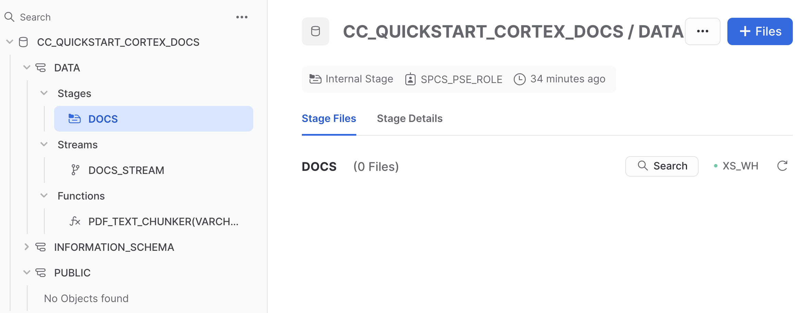

**Step 7**. Check files has been successfully uploaded

Run this query to check what documents are in the staging area

```SQL
ls @docs;
```


<!-- ------------------------ -->
## Build the Vector Store
Duration: 15

In this step we are going to leverage our document processing functions to prepare documents before turning the text into embeddings using Snowflake Cortex. These embeddings will be stored in a Snowflake Table using the new native VECTOR data type. 

> aside negative
> NOTE: To get access to these features (currently in private preview) reach out to your Snowflake account team.

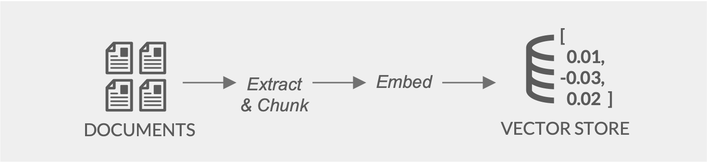

**Step 1**. Create the table where we are going to store the chunks and vectors for each PDF. Note here the usage of the new VECTOR data type:

```SQL
create or replace TABLE DOCS_CHUNKS_TABLE ( 
    RELATIVE_PATH VARCHAR(16777216), -- Relative path to the PDF file
    SIZE NUMBER(38,0), -- Size of the PDF
    FILE_URL VARCHAR(16777216), -- URL for the PDF
    SCOPED_FILE_URL VARCHAR(16777216), -- Scoped url (you can choose which one to keep depending on your use case)
    CHUNK VARCHAR(16777216), -- Piece of text
    CHUNK_VEC VECTOR(FLOAT, 768) );  -- Embedding using the VECTOR data type
```

**Step 2**. Use the function previously created to process the PDF files, extract the chunks and created the embeddings. Insert that info in the table we have just created:

```SQL
insert into docs_chunks_table (relative_path, size, file_url,
                            scoped_file_url, chunk, chunk_vec)
    select relative_path, 
            size,
            file_url, 
            build_scoped_file_url(@docs, relative_path) as scoped_file_url,
            func.chunk as chunk,
            snowflake.cortex.embed_text('e5-base-v2',chunk) as chunk_vec
    from 
        directory(@docs),
        TABLE(pdf_text_chunker(build_scoped_file_url(@docs, relative_path))) as func;
```

### Explanation of the previous code:

The insert statement is reading the records from the docs_stream stream and it is generating a table calling the table function pdf_text_chunker, where we get the **chunk** that is the piece of text from the PDF.

The **chunk** text is passed to Snowflake Cortex to generate the embeddings with this code:

```code
            snowflake.cortex.embed_text('e5-base-v2',chunk) as chunk_vec
````

That code is calling the embed_text function using the e5-base-v2 trnasformer and returning an embedding vector.


If you check the **docs_chunks_table** table, you should see the PDFs has been processed 

```SQL
select relative_path, size, chunk, chunk_vec from docs_chunks_table limit 5;
``` 

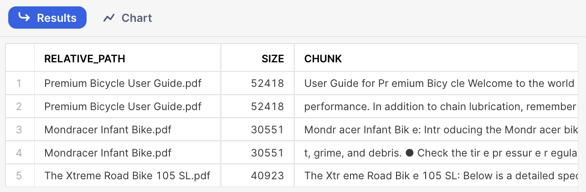

And you can see the CHUNK_VEC columns that contains the embedings using the VECTOR data type.

Your PDF files has been chunked and each chunk has an embedding. We can check how many chunks we got for each file using this query

```SQL
select relative_path, count(*) as num_chunks 
    from docs_chunks_table
    group by relative_path;
``` 
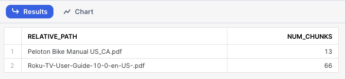

After completing all the steps in this section you should see the following objects in your database:

- The **DOCS_CHUNKS_TABLE** that contains the text and the vectors
- The **DOCS** Stage with your PDF files
- The **PDF_TEXT_CHUNKER** function that extracts and chunk the text from the PDF files

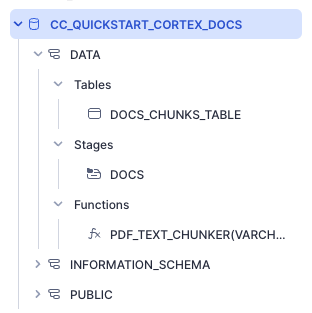

<!-- ------------------------ -->
## Build Chat UI and Chat (Retrieval and Generation) Logic
Duration: 15

To make it easy for anyone to ask questions against the vector store, let's create a fairly simple front-end using Streamlit. As part of the app, we will provide the end-user with a toggle that allows testing of LLM responses with and without access to the context to observe the differences.

Streamlit in Snowflake allows you to run the app and share it with other Snowflake users within the same account. This ensures data remains secure and protected and is only available to users that meet your role-based access policies. 

Relevant documentation: [Introduction to Streamlit in Snowflake](https://docs.snowflake.com/en/developer-guide/streamlit/about-streamlit)

1. Click on the **Streamlit** tab on the left
2. Clickn on **+ Streamlit App** button on the right
3. Give the App a name (CC_CORTEX_APP in my example)
4. Select the warehouse to run the App (a Small WH will be enough)
5. Choose the **CC_QUICKSTART_CORTEX_DOCS** database and **DATA** schema

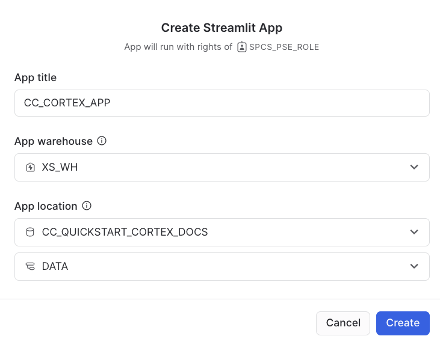

The Streamlit app comes with a default template you can delete and replace with this code which includes the front-end elements:

- Table with list of available documents
- Toggle to choose to use documents as context
- Question input box

And also includes the retrieval and generation logic:

- Function to calculate distance between question and text chunks to retrieve top result
- Prompt template that instructs LLM how to answer using relevant chunks

```python
import streamlit as st # Import python packages
from snowflake.snowpark.context import get_active_session
session = get_active_session() # Get the current credentials

import pandas as pd

pd.set_option("max_colwidth",None)
num_chunks = 3 # Num-chunks provided as context. Play with this to check how it affects your accuracy

def create_prompt (myquestion, rag):

    if rag == 1:    
        createsql = f"""
            create or replace table query_vec (qvec vector(float, 768))
        """
        session.sql(createsql).collect()

        insertsql = f"""
            insert into query_vec 
              select snowflake.cortex.embed_text('e5-base-v2', '{myquestion}')
        """

        session.sql(insertsql).collect()

        cmd = f"""
        with results as
        (SELECT RELATIVE_PATH,
           VECTOR_COSINE_DISTANCE(docs_chunks_table.chunk_vec, query_vec.qvec) as distance,
           chunk
        from docs_chunks_table, query_vec
        order by distance desc
        limit {num_chunks})
        select chunk, relative_path from results 
        """

        df_context = session.sql(cmd).to_pandas()       

        context_lenght = len(df_context) -1

        prompt_context = ""
        for i in range (0, context_lenght):
            prompt_context += df_context._get_value(i, 'CHUNK')
        #st.text(prompt_context)

                                #prompt_context = df_context._get_value(0,'CHUNK')
        prompt_context = prompt_context.replace("'", "")
        relative_path =  df_context._get_value(0,'RELATIVE_PATH')
    
        prompt = f"""
          'You are an expert assistance extracting information from context provided. 
           Answer the question based on the context. Be concise and do not hallucinate. 
           If you don´t have the information just say so.
          Context: {prompt_context}
          Question:  
           {myquestion} 
           Answer: '
           """
        cmd2 = f"select GET_PRESIGNED_URL(@docs, '{relative_path}', 360) as URL_LINK from directory(@docs)"
        df_url_link = session.sql(cmd2).to_pandas()
        url_link = df_url_link._get_value(0,'URL_LINK')

    else:
        prompt = f"""
         'Question:  
           {myquestion} 
           Answer: '
           """
        url_link = "None"
        relative_path = "None"
        
    return prompt, url_link, relative_path

def complete(myquestion, model_name, rag = 1):

    prompt, url_link, relative_path =create_prompt (myquestion, rag)
    cmd = f"""
        select snowflake.cortex.complete(
            '{model_name}',
            {prompt})
            as response
            """
    
    df_response = session.sql(cmd).collect()
    return df_response, url_link, relative_path

def display_response (question, model, rag=0):
    response, url_link, relative_path = complete(question, model, rag)
    res_text = response[0].RESPONSE
    st.markdown(res_text)
    if rag == 1:
        display_url = f"Link to [{relative_path}]({url_link}) that may be useful"
        st.markdown(display_url)

st.title("Asking Questions to Your Own Documents with Snowflake Cortex:")
st.write("""You can ask questions and decide if you want to use your documents for context or allow the model to create their own response.""")
st.write("This is the list of documents you already have. Just upload new documents into your DOCS staging area and they will be automatically processed")
docs_available = session.sql("ls @docs").collect()
list_docs = []
for doc in docs_available:
    list_docs.append(doc["name"])
st.dataframe(list_docs)


model = st.selectbox('Select your model:',('mistral-7b',
                                           'llama2-70b-chat',
                                           'mixtral-8x7b',
                                           'gemma-7b'))

question = st.text_input("Enter question", placeholder="Is there any special lubricant to be used with the premium bike?", label_visibility="collapsed")

rag = st.checkbox('Use your own documents as context?')

print (rag)

if rag:
    use_rag = 1
else:
    use_rag = 0

if question:
    display_response (question, model, use_rag)
```
### Explanation

Let´s go step by step what that code is doing:

create_prompt() receives a question as an argument and whether it has to use the context documents or not. This can be used to compare how the LLM responds when using the RAG framework vs. using existing knowledge gained during pre-training. 

When the box is checked, this code is going embed the question and look for the PDF chunk with the closest similarity to the question being asked. We can limit the number of chunks we want to provide as a context. That text will be added to the prompt as context and a link to download the source of the answer is made available for the user to verify the results. 

```python
        insertsql = f"""
            insert into query_vec 
              select snowflake.cortex.embed_text('e5-base-v2', '{myquestion}')
        """

        session.sql(insertsql).collect()

        cmd = f"""
        with results as
        (SELECT RELATIVE_PATH,
           VECTOR_COSINE_DISTANCE(docs_chunks_table.chunk_vec, query_vec.qvec) as distance,
           chunk
        from docs_chunks_table, query_vec
        order by distance desc
        limit {num_chunks})
        select chunk, relative_path from results 
        """

        df_context = session.sql(cmd).to_pandas()
``` 

So the code is doing a similarity search to look for the closest chunk of text and provide it as context in the prompt:

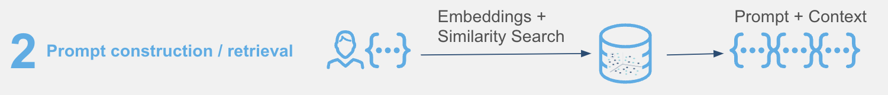

The next section worth calling out is the complete() function which combines the LLM, the prompt template and whether to use the context or not to generate a response which includes a link to the asset from which the answer was obtained. 

```python
def complete(myquestion, model, rag = 1):

    prompt, url_link, relative_path =create_prompt (myquestion, rag)
    cmd = f"""
        select snowflake.cortex.complete(
            '{model}',
            {prompt})
            as response
            """
    
    df_response = session.sql(cmd).collect()
    return df_response, url_link, relative_path
```

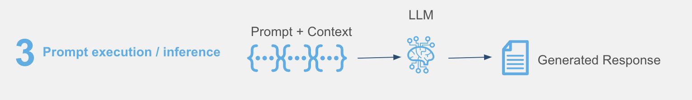

### Deploy and share your AI-powered app

Streamlit in Snowflake provides a side-by-side editor and preview screen that makes it easy and fast to iterate and visalize changes.

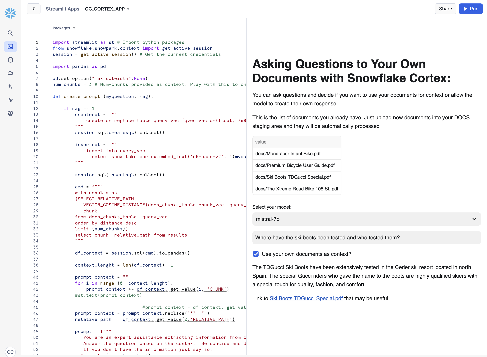

In the app, we can see the two documents we had uploaded previously and can be used to ask questions while trying multiple options using interactive widgets:

- LLM dropdown: Evaluate the response to the same question from different LLMs available in Snowflake Cortex.
- Context toggle: Check the box to receive answer with RAG. Uncheck to see how LLM answers without access to the context.

To test out the RAG framework, here a few questions you can ask and then use the interactive widgets to compare the results when using a different LLM or when choosing to get a response without the context. This is related to very specific information that we have added into the documents and that is very unique to our products.

- Is there any special lubricant to be used with the premium bike?
- What is the warranty for the premium bike?
- What is the max recommended speed for the infant bike?
- Does the mondracer infant bike need any special tool?
- Is there any temperature to be considered with the premium bicycle?
- What is the temperature to store the ski boots?
- What are the tires used for the road bike?
- Is there any discount when buying the road bike?
- Where have the ski boots been tested and who tested them?


### Other things to test

In this example we have just decided a fixed format for chunks and used only the top result in the retrieval process. This [blog](https://medium.com/@thechosentom/rag-made-simple-with-snowflake-cortex-74d1df5143fd) provides some considerations about settings in the chunking function in our Snowpark UDTF. 

```python
        text_splitter = RecursiveCharacterTextSplitter(
            chunk_size = 4000, #Adjust this as you see fit
            chunk_overlap  = 400, #This let's text have some form of overlap. Useful for keeping chunks contextual
            length_function = len
        )
```

You can also try different instructions in your prompt and see how the responses may vary. Simply replace any of the text and run the app again. 

```python
       prompt = f"""
          'You are an expert assistance extracting information from context provided. 
           Answer the question based on the context. Be concise and do not hallucinate. 
           If you don´t have the information just say so.
          Context: {prompt_context}
          Question:  
           {myquestion} 
           Answer: '
           """
```

You can also try to change the number of chunks that are provided as context by simply modifying this value:

```python
num_chunks = 3
```

<!-- ------------------------ -->
## Optional: Automatic Processing of New Documents
Duration: 5

We can use Snowflake features Streams and Task to automatically process new PDF files as they are added into Snowflake. 

- First we are creating a Snowflake Task. That Task will have some conditions to be executed and one action to take:
  - Where: This is going to be executed using warehouse **XS_WH**. Please name to your own Warehouse.
  - When: Check every minute, and execute in the case of new records in the docs_stream stream
  - What to do: Process the files and insert the records in the docs_chunks_table

Execute this code in your Snowflake worksheet:

```SQL
create or replace stream docs_stream on stage docs;

create or replace task task_extract_chunk_vec_from_pdf 
    warehouse = XS_WH
    schedule = '1 minute'
    when system$stream_has_data('docs_stream')
    as

    insert into docs_chunks_table (relative_path, size, file_url,
                            scoped_file_url, chunk, chunk_vec)
    select relative_path, 
            size,
            file_url, 
            build_scoped_file_url(@docs, relative_path) as scoped_file_url,
            func.chunk as chunk,
            snowflake.cortex.embed_text('e5-base-v2',chunk) as chunk_vec
    from 
        docs_stream,
        TABLE(pdf_text_chunker(build_scoped_file_url(@docs, relative_path)))            as func;

alter task task_extract_chunk_vec_from_pdf resume;
```

You can add a new PDF document and check that in around a minute, it will be available to be used within your Streamlit application. You may want to upload your own documents or try with this new bike guide:

- [The Ultimate Downhill Bike](https://github.com/Snowflake-Labs/sfquickstarts/blob/master/site/sfguides/src/ask-questions-to-your-documents-using-rag-with-snowflake-cortex/assets/The_Ultimate_Downhill_Bike.pdf)

Try asking questions that are unique in that new bike guide like:

- What is the name of the ultimate downhill bike?
- What is the suspension used for the downhill bike?
(note: try different models to see different results)
- What is the carbon used for the downhill bike?
- Who are the testers for the downhill bike?

Once you have finish testing uploading new documents and asking questions, you may want to suspend the task:

```SQL
alter task task_extract_chunk_vec_from_pdf suspend;
```

<!-- ------------------------ -->
## Conclusion & Resources
Duration: 5

Congratulations! You've successfully performed RAG using Snowflake Cortex and securely built a full-stack RAG application in Snowflake without having to build integrations, manage any infrastructure or deal with security concerns with data moving outside of the Snowflake governance framework. 

### What You Learned
- Creating functions to automatically extract text and chunk PDF files
- Creating embeddings with Snowflake Cortex
- Use Snowflake VECTOR data type for similarity search
- Using Snowflake Cortex to use LLMs to answer questions
- Building an application front-end with Streamlit
- Using directory tables and streams with task to automatically process files


### Related Resources

- [Docs: Snowflake Cortex LLM functions](https://docs.snowflake.com/en/user-guide/snowflake-cortex/llm-functions)
- [Blog: RAG explainer and how it works in Snowflake](https://www.snowflake.com/blog/easy-secure-llm-inference-retrieval-augmented-generation-rag-cortex)
- [Blog: Customizing RAG framework components using Snowpark Container Services](https://medium.com/@jason.summer/developing-a-product-chatbot-with-airmiles-in-snowflake-6b197d3fc424)
- [Docs: Snowflake Directory Tables](https://docs.snowflake.com/en/user-guide/data-load-dirtables)
- [Docs: Creating User-Defined Table Functions](https://docs.snowflake.com/en/developer-guide/snowpark/python/creating-udtfs)

---

