author: Carlos Carrero
id: ask-questions-to-your-own-documents-with-snowflake-cortex-search
categories: snowflake-site:taxonomy/solution-center/certification/quickstart, snowflake-site:taxonomy/product/ai
language: en
summary: Build document Q&A systems with Snowflake Cortex Search for hybrid semantic and keyword retrieval from enterprise knowledge bases.
environments: web 
status: Published
feedback link: https://github.com/Snowflake-Labs/sfguides/issues

# Build a Retrieval Augmented Generation (RAG) based LLM assistant using Streamlit and Snowflake Cortex Search

<!-- ------------------------ -->
## Overview 

[Large Language Models](https://www.snowflake.com/en/fundamentals/large-language-model/) (LLMs) are incredibly powerful, but they can sometimes guess or provide incorrect responses, which is what we call a “hallucination.” To reduce hallucinations, LLMs can be combined with private datasets. Today, the most common approach for reducing hallucinations without having to change the model (e.g. fine-tuning) is the [Retrieval Augmented Generation](https://www.snowflake.com/en/fundamentals/rag/) (RAG) framework. RAG allows you to “ground” the model’s responses by making a set of relevant documents available to the LLM as context in the response. 

In this quickstart we will show you how to quickly and securely build a full-stack RAG application in Snowflake without having to build integrations, manage any infrastructure or deal with security concerns with data moving outside of the Snowflake governance framework. 

This guide will leverage [Cortex Search](https://docs.snowflake.com/en/user-guide/snowflake-cortex/cortex-search/cortex-search-overview), a fully managed service that automatically creates embeddings for your data and perform retrievals using a hybrid search engine, using embeddings for semantic similarity plus keyword search for lexical similarity, achieving state-of-the-art retrieval quality.

We will show you how easy it is to implement RAG via a chat assistant that knows everything about products. To make the assistant an expert in your bikes and snow gears, we are going to give it access to a few user manuals. This template can be easily adapted to any documents you want your assistant to learn from — whether its financial reports, research documents or anything else! 


### RAG Overview

In a typical RAG application, there is a process to prepare and use your documents. The content is first broken down into chunks and the content is embedded into a vector store. When a user asks a question, the vector store is searched to retrieve the most similar chunks of content. These relevant chunks are passed to the LLM as context to provide an accurate answer:

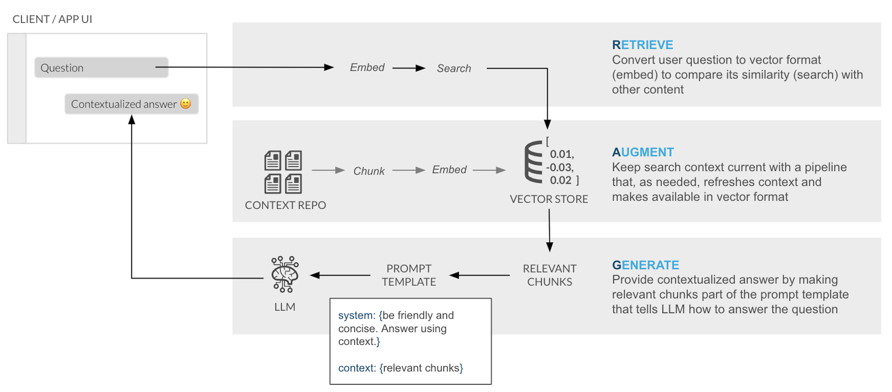

Snowflake Cortex Search is a fully managed indexing and retrieval service that simplifies and empowers RAG applications. The service automatically creates embeddings and indexes your data, providing a robust enterprise search service that can be accessed via APIs:

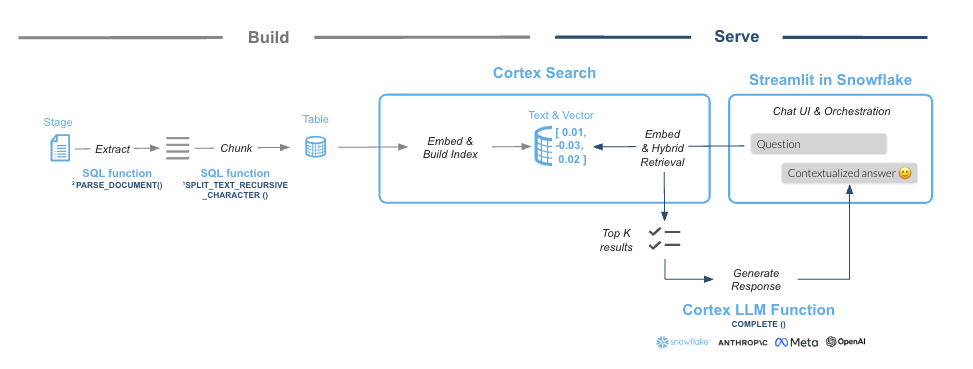

### What You Will Learn 
- How to create functions that use Python libraries using [Snowpark](https://snowflake.com/snowpark)
- How to use power search experiences using [Snowflake Cortex Search](https://docs.snowflake.com/LIMITEDACCESS/cortex-search/cortex-search-overview)
- How to use LLMs using serverless functions in [Snowflake Cortex AI](https://snowflake.com/cortex)
- How to build a front-end with Python using [Streamlit in Snowflake](/en/data-cloud/overview/streamlit-in-snowflake/)

### What You Will Build
You will create a working product chat assistant in Streamlit. The final product includes an application that lets users test how the LLM responds with and without the context document(s) to show how RAG can address hallucinations.  

### Prerequisites
- A Snowflake account in a cloud region that supports Snowflake Cortex [LLM functions](https://docs.snowflake.com/en/user-guide/snowflake-cortex/aisql) are supported
- Check [LLM availability](https://docs.snowflake.com/en/user-guide/snowflake-cortex/llm-functions?_ga=2.5151286.405859672.1709568467-277021311.1701887324&_gac=1.124754680.1707955750.Cj0KCQiA5rGuBhCnARIsAN11vgRLWfK6RIoIEqcZ7cFas8qwN4yCoL0q9nttp5UEmSocnPmhdBG57fgaAjqNEALw_wcB&_fsi=j2b82Wl3#availability) to help you decide where you want to create your Snowflake account
- A Snowflake account with [Anaconda Packages](https://docs.snowflake.com/en/developer-guide/udf/python/udf-python-packages.html#using-third-party-packages-from-anaconda) enabled by ORGADMIN

> NOTE: For an end-to-end setup experience using Snowflake Notebook, download this [.ipynb](https://github.com/Snowflake-Labs/sfguide-ask-questions-to-your-documents-using-rag-with-snowflake-cortex-search/blob/main/RAG_Using_Snowflake_Cortex_Search_Setup_Notebook.ipynb) file from the GitHub repository and [import](https://docs.snowflake.com/en/user-guide/ui-snowsight/notebooks-create#label-notebooks-import) it into a Snowflake Notebook. The Notebook covers setup steps 2, 3, and 4.

<!-- ------------------------ -->
## Organize Documents

Before we can ask our LLM assistant questions about our products, we need to get our product manual PDFs into Snowflake. In Snowflake, databases and schemas are used to organize and govern access to data and logic. Let's start by getting a few documents locally and then create a database that will hold the PDFs.

**Step 1**. Download example documents

We have created a small set of example user manuals for fictitious bikes and skis that contain specific product details. This information is what we will use to test how the LLM responds with and without access to the information in the documents. 

> NOTE: You can substitute these documents with your own product sheets, financial reports, or any other documents you want to try asking questions against.

Download all documents from this [zip file](https://github.com/Snowflake-Labs/sfguide-ask-questions-to-your-documents-using-rag-with-snowflake-cortex-search/blob/main/docs.zip) on the GitHub repository.

The zip file contains these individual documents:

- [Mondracer Infant Bike](https://github.com/Snowflake-Labs/sfguide-ask-questions-to-your-documents-using-rag-with-snowflake-cortex-search/blob/main/Mondracer_Infant_Bike.pdf)
- [Premium Bycycle User Guide](https://github.com/Snowflake-Labs/sfguide-ask-questions-to-your-documents-using-rag-with-snowflake-cortex-search/blob/main/Premium_Bicycle_User_Guide.pdf)
- [Ski Boots TDBootz Special](https://github.com/Snowflake-Labs/sfguide-ask-questions-to-your-documents-using-rag-with-snowflake-cortex-search/blob/main/Ski_Boots_TDBootz_Special.pdf)
- [The Ultimate Downhill Bike](https://github.com/Snowflake-Labs/sfguide-ask-questions-to-your-documents-using-rag-with-snowflake-cortex-search/blob/main/The_Ultimate_Downhill_Bike.pdf)
- [The Xtreme Road Bike 105 SL](https://github.com/Snowflake-Labs/sfguide-ask-questions-to-your-documents-using-rag-with-snowflake-cortex-search/blob/main/The_Xtreme_Road_Bike_105_SL.pdf)
- [Carver Skis Specification Guide](https://github.com/Snowflake-Labs/sfguide-ask-questions-to-your-documents-using-rag-with-snowflake-cortex-search/blob/main/Carver%20Skis%20Specification%20Guide.pdf)
- [OutPiste Skis Specification Guide](https://github.com/Snowflake-Labs/sfguide-ask-questions-to-your-documents-using-rag-with-snowflake-cortex-search/blob/main/OutPiste%20Skis%20Specification%20Guide.pdf)
- [RacingFast Skis Specification Guide](https://github.com/Snowflake-Labs/sfguide-ask-questions-to-your-documents-using-rag-with-snowflake-cortex-search/blob/main/RacingFast%20Skis%20Specification%20Guide.pdf)

**Step 2**. Open a new Worksheet

> NOTE: [Creating Snowflake Worksheets documentation](https://docs.snowflake.com/en/user-guide/ui-snowsight-worksheets-gs#create-worksheets-in-sf-web-interface). 

**Step 3**. Create a database and a schema

Run the following code inside your newly created worksheet

```SQL
CREATE DATABASE CC_QUICKSTART_CORTEX_SEARCH_DOCS;
CREATE SCHEMA DATA;
```
> NOTE: [Database and Schema management documentation](https://docs.snowflake.com/en/sql-reference/ddl-database)


**Step 4**. Create a Stage with Directory Table where you will be uploading your documents

A [Stage](https://docs.snowflake.com/en/sql-reference/sql/create-stage) is used for loading data from files into Snowflake tables and unloading data from tables into files. A [Directory Table](https://docs.snowflake.com/en/user-guide/data-load-dirtables) stores file-level metadata about the data files in the stage. 

Run the following code:
```SQL
create or replace stage docs ENCRYPTION = (TYPE = 'SNOWFLAKE_SSE') DIRECTORY = ( ENABLE = true );
```

**Step 5**. Upload documents to your staging area
- Select **Catalog » Database Explorer** on the left of Snowsight
- Click on your database **CC_QUICKSTART_CORTEX_SEARCH_DOCS**
- Click on your schema **DATA**
- Click on **Stages** and select **DOCS**
- On the top right click on the +Files button
- Drag and drop the two PDF files from the docs folder you downloaded

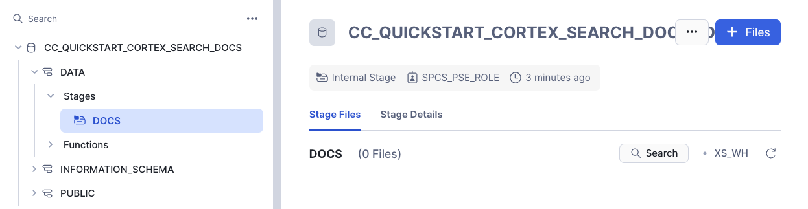

**Step 6**. Check files has been successfully uploaded

Run this query in the Worksheet to check that all your documents are in the staging area

```SQL
ls @docs;
```

You should see a list of all uploaded PDF file names. 

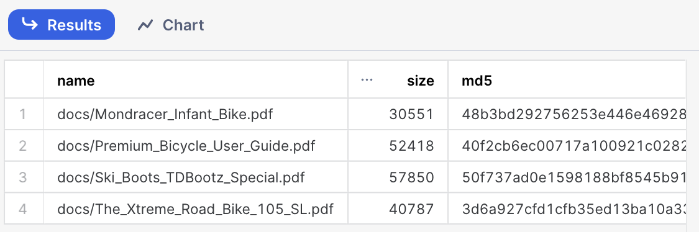

<!-- ------------------------ -->
## Pre-process Documents

In this step we are going to leverage Snowflake native document processing functions to prepare documents before enabling [Cortex Search](https://docs.snowflake.com/en/user-guide/snowflake-cortex/cortex-search/cortex-search-overview). We are also going to use Cortex [CLASSIFY_TEXT](https://docs.snowflake.com/en/sql-reference/functions/classify_text-snowflake-cortex) function in order to label the type of document being processed so that we can use that metadata to filter searches.

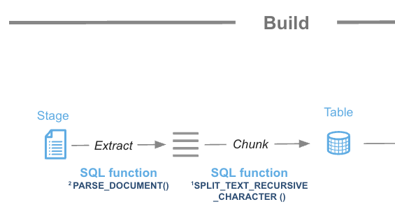

**Step 1**. Use the function [SNOWFLAKE.CORTEX.PARSE_DOCUMENT](https://docs.snowflake.com/en/sql-reference/functions/parse_document-snowflake-cortex) to read the PDF documents directly from the staging area we created. Here, we use the LAYOUT mode to extract the text and maintain the document’s structure:

```SQL
CREATE OR REPLACE TEMPORARY TABLE RAW_TEXT AS
WITH FILE_TABLE as (
  (SELECT 
        RELATIVE_PATH,
        SIZE,
        FILE_URL,
        build_scoped_file_url(@docs, relative_path) as scoped_file_url,
        TO_FILE('@DOCS', RELATIVE_PATH) AS docs 
    FROM 
        DIRECTORY(@DOCS))
)
SELECT 
    RELATIVE_PATH,
    SIZE,
    FILE_URL,
    scoped_file_url,
    TO_VARCHAR (
        SNOWFLAKE.CORTEX.AI_PARSE_DOCUMENT (
            docs,
            {'mode': 'LAYOUT'} ):content
        ) AS EXTRACTED_LAYOUT 
FROM 
    FILE_TABLE;
```


**Step 2**. Create the table where we are going to store the chunks for each PDF from the processed text. 

```SQL
create or replace TABLE DOCS_CHUNKS_TABLE ( 
    RELATIVE_PATH VARCHAR(16777216), -- Relative path to the PDF file
    SIZE NUMBER(38,0), -- Size of the PDF
    FILE_URL VARCHAR(16777216), -- URL for the PDF
    SCOPED_FILE_URL VARCHAR(16777216), -- Scoped url (you can choose which one to keep depending on your use case)
    CHUNK VARCHAR(16777216), -- Piece of text
    CHUNK_INDEX INTEGER, -- Index for the text
    CATEGORY VARCHAR(16777216) -- Will hold the document category to enable filtering
);
```

**Step 3**. The extracted text can sometimes be too large to be an effective piece of context for an LLM. We will use the function [SNOWFLAKE.CORTEX.SPLIT_TEXT_RECURSIVE_CHARACTER](https://docs.snowflake.com/en/sql-reference/functions/split_text_recursive_character-snowflake-cortex) to split the text into shorter strings. We will then insert these smaller chunks into our table: 

```SQL
insert into docs_chunks_table (relative_path, size, file_url,
                            scoped_file_url, chunk, chunk_index)

    select relative_path, 
            size,
            file_url, 
            scoped_file_url,
            c.value::TEXT as chunk,
            c.INDEX::INTEGER as chunk_index
            
    from 
        raw_text,
        LATERAL FLATTEN( input => SNOWFLAKE.CORTEX.SPLIT_TEXT_RECURSIVE_CHARACTER (
              EXTRACTED_LAYOUT,
              'markdown',
              1512,
              256,
              ['\n\n', '\n', ' ', '']
           )) c;

```

### Label the product category

We are going to use the power of Large Language Models and the function [CLASSIFY_TEXT](https://docs.snowflake.com/en/sql-reference/functions/classify_text-snowflake-cortex)  to easily classify the documents we are ingesting in our RAG application. We are going to pass the document name and the first chunk of text into the CLASSIFY_TEXT function to determine categories. In this example, we want to use the LLM to automatically label each document as either ‘Bike’ or ‘Snow.’

First, we will create a temporary table with each unique file name. We will then pass the file name and the first chunk of text to CLASSIFY_TEXT. Classification is not mandatory for Cortex Search but we want to use it here to also use hybrid search.

Run this SQL to create the table containing the classification results:

```SQL
CREATE OR REPLACE TEMPORARY TABLE docs_categories AS WITH unique_documents AS (
  SELECT
    DISTINCT relative_path, chunk
  FROM
    docs_chunks_table
  WHERE 
    chunk_index = 0
  ),
 docs_category_cte AS (
  SELECT
    relative_path,
    TRIM(snowflake.cortex.AI_CLASSIFY (
      'Title:' || relative_path || 'Content:' || chunk, ['Bike', 'Snow']
     )['labels'][0], '"') AS CATEGORY
  FROM
    unique_documents
)
SELECT
  *
FROM
  docs_category_cte;
```

You can check the table to identify how many categories have been created and if the classifications are correct:

```SQL
select * from docs_categories;
```

All documents should be correctly classified now. This data will let users filter their searches later with Cortex Search, making retrieval faster and more accurate:


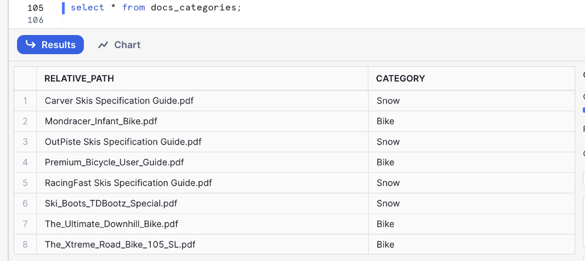

Now we can update the table with the chunks of text that will be used by Cortex Search service to include the category for each document:

```SQL
update docs_chunks_table 
  SET category = docs_categories.category
  from docs_categories
  where  docs_chunks_table.relative_path = docs_categories.relative_path;
```
The table is now fully prepared and ready to enable the Cortex Search service.

After completing all the steps in this section you should see the following objects in your database:

- The **DOCS_CHUNKS_TABLE** that contains the text and categories for each document
- The **DOCS** Stage with your PDF files
- The **PDF_TEXT_CHUNKER** function that extracts and chunk the text from the PDF files

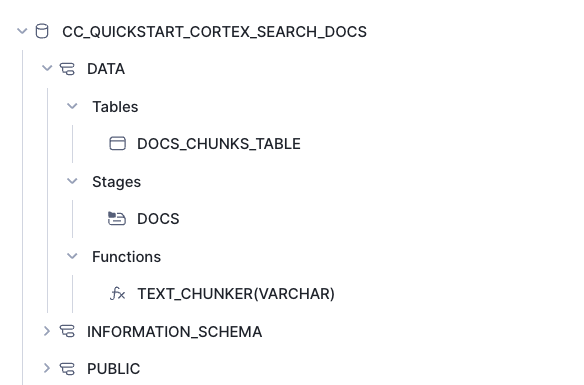

<!-- ------------------------ -->
## Create Cortex Search Service

The next step is to create the Cortex Search Service in the table we have made before. We will execute this SQL command:

```SQL
create or replace CORTEX SEARCH SERVICE CC_SEARCH_SERVICE_CS
ON chunk
ATTRIBUTES category
warehouse = COMPUTE_WH
TARGET_LAG = '1 minute'
as (
    select chunk,
        chunk_index,
        relative_path,
        file_url,
        category
    from docs_chunks_table
);
```

- The name of the service is **CC_SEARCH_SERVICE_CS**
- The service will use the column **chunk** to create embeddings and perform retrieval based on similarity search
- The column **category** could be used as a filter
- To keep this service updated the warehouse **COMPUTE_WH** will be used. If you want to use a different warehouse, replace this with the name of your chosen warehouse
- The service will be refreshed every minute
- The data retrieved will contain the **chunk, relative_path, file_url and category**

That’s it! There is no need to create embeddings as that is done automatically. We can now use the API to query the service.

<!-- ------------------------ -->
## Build Chat UI with Retrieval and Generation Logic

Now that your data is indexed, the next step is to create the user interface (UI) to interact with it. We will use [Streamlit in Snowflake](https://www.snowflake.com/en/product/features/streamlit-in-snowflake/) (SiS) to build a secure, full-stack application entirely within your account.

To make it easy for anyone to ask questions against the Cortex Search service, we will create a fairly simple front-end using Streamlit. As part of the app, we will provide the end-user with a toggle that allows testing of LLM responses with and without access to the context to observe the differences. The app will also show the pieces of text that the service is returning and which are being used to fill the calls to LLM to create the answers.

Streamlit in Snowflake allows you to run the app and share it with other Snowflake users within the same account. This ensures data remains secure and protected and is only available to users that meet your role-based access policies. 

> NOTE: [Introduction to Streamlit in Snowflake documentation](https://docs.snowflake.com/en/developer-guide/streamlit/about-streamlit)

1. Click on the **Catalog » Streamlit** tab on the left-hand navigation pane in Snowsight
2. Click on **+ Streamlit App** button on the right
3. Name the App (Use CC_CORTEX_SEARCH_APP or another name)
4. Select the warehouse to run the App (a Small WH is sufficient)
5. Choose the **CC_QUICKSTART_CORTEX_SEARCH_DOCS** database and **DATA** schema

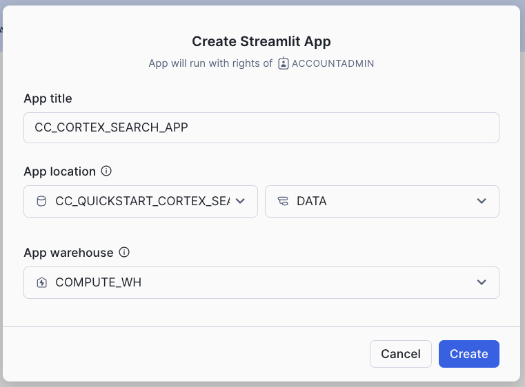

The Streamlit app comes with a default template. Delete the default code and replace it with the code provided below (front-end elements, retrieval, and generation logic are included):

- Table with list of available documents
- Toggle to choose to use documents as context
- Question input box
- Filter for a type of product
- Using the Cortex Search service to retrieve the relevant chunks of text
- Prompt template that instructs LLM how to answer using relevant chunks

```python
import streamlit as st # Import python packages
from snowflake.snowpark.context import get_active_session

from snowflake.core import Root

import pandas as pd
import json

pd.set_option("max_colwidth",None)

### Default Values
NUM_CHUNKS = 3 # Num-chunks provided as context. Play with this to check how it affects your accuracy

# service parameters
CORTEX_SEARCH_DATABASE = "CC_QUICKSTART_CORTEX_SEARCH_DOCS"
CORTEX_SEARCH_SCHEMA = "DATA"
CORTEX_SEARCH_SERVICE = "CC_SEARCH_SERVICE_CS"
######
######

# columns to query in the service
COLUMNS = [
    "chunk",
    "chunk_index",
    "relative_path",
    "category"
]

session = get_active_session()
root = Root(session)                         

svc = root.databases[CORTEX_SEARCH_DATABASE].schemas[CORTEX_SEARCH_SCHEMA].cortex_search_services[CORTEX_SEARCH_SERVICE]
   
### Functions
     
def config_options():

    st.sidebar.selectbox('Select your model:',('mistral-large2', 'llama3.1-70b',
                        'llama3.1-8b', 'snowflake-arctic'), key="model_name")

    categories = session.sql("select category from docs_chunks_table group by category").collect()

    cat_list = ['ALL']
    for cat in categories:
        cat_list.append(cat.CATEGORY)
            
    st.sidebar.selectbox('Select what products you are looking for', cat_list, key = "category_value")

    st.sidebar.expander("Session State").write(st.session_state)

def get_similar_chunks_search_service(query):

    if st.session_state.category_value == "ALL":
        response = svc.search(query, COLUMNS, limit=NUM_CHUNKS)
    else: 
        filter_obj = {"@eq": {"category": st.session_state.category_value} }
        response = svc.search(query, COLUMNS, filter=filter_obj, limit=NUM_CHUNKS)

    st.sidebar.json(response.json())
    
    return response.json()  

def create_prompt (myquestion):

    if st.session_state.rag == 1:
        prompt_context = get_similar_chunks_search_service(myquestion)
  
        prompt = f"""
           You are an expert chat assistance that extracs information from the CONTEXT provided
           between <context> and </context> tags.
           When ansering the question contained between <question> and </question> tags
           be concise and do not hallucinate. 
           If you don´t have the information just say so.
           Only anwer the question if you can extract it from the CONTEXT provideed.
           
           Do not mention the CONTEXT used in your answer.
    
           <context>          
           {prompt_context}
           </context>
           <question>  
           {myquestion}
           </question>
           Answer: 
           """

        json_data = json.loads(prompt_context)

        relative_paths = set(item['relative_path'] for item in json_data['results'])
        
    else:     
        prompt = f"""[0]
         'Question:  
           {myquestion} 
           Answer: '
           """
        relative_paths = "None"
            
    return prompt, relative_paths

def complete(myquestion):

    prompt, relative_paths =create_prompt (myquestion)
    cmd = """
            select snowflake.cortex.complete(?, ?) as response
          """
    
    df_response = session.sql(cmd, params=[st.session_state.model_name, prompt]).collect()
    return df_response, relative_paths

def main():
    
    st.title(f":speech_balloon: Chat Document Assistant with Snowflake Cortex")
    st.write("This is the list of documents you already have and that will be used to answer your questions:")
    docs_available = session.sql("ls @docs").collect()
    list_docs = []
    for doc in docs_available:
        list_docs.append(doc["name"])
    st.dataframe(list_docs)

    config_options()

    st.session_state.rag = st.sidebar.checkbox('Use your own documents as context?')

    question = st.text_input("Enter question", placeholder="Is there any special lubricant to be used with the premium bike?", label_visibility="collapsed")

    if question:
        response, relative_paths = complete(question)
        res_text = response[0].RESPONSE
        st.markdown(res_text)

        if relative_paths != "None":
            with st.sidebar.expander("Related Documents"):
                for path in relative_paths:
                    cmd2 = f"select GET_PRESIGNED_URL(@docs, '{path}', 360) as URL_LINK from directory(@docs)"
                    df_url_link = session.sql(cmd2).to_pandas()
                    url_link = df_url_link._get_value(0,'URL_LINK')
        
                    display_url = f"Doc: [{path}]({url_link})"
                    st.sidebar.markdown(display_url)
                
if __name__ == "__main__":
    main()
```

> NOTE: When you first paste and run the code, you will get an error because we need to add the package **snowflake.core** in our Streamlit App.

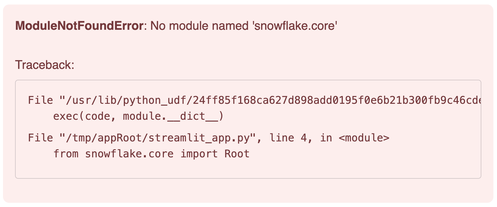

1. Click on **Packages** (found near the top of the code editor) 
2. Search for **snowflake.core**
3. Set the Python Environment. You may want to use the latest versions available. This is the combination that has been tested for this lab:
   * snowflake.core = 1.2.0
   * python = 3.11
   * snowflake-snowpark-python = 1.30.0
   * streamlit = 1.42.0
4. Click Run after adding the package. The app should now load successfully

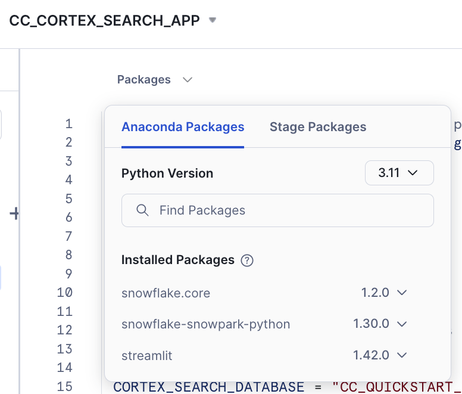

### Code Walkthrough

Let's go step by step to see what the code is doing:

First, we use st.sidebar to place all interactive options on the left-hand sidebar. There we include:
- A selectbox for the LLM to be used
- A selectbox to allow filtering for one category (this will be used by Cortex Search
- Session state (for debugging purposes when building the app)
- Chunks used and the links to the relevant documents

The main() function collects the user's question and calls a complete() function with the question. This one calls the create_prompt() function that uses get_similar_chunks_search_service() with the question. This is the function that calls Cortex Search service for retrieval with this code:

```python
def get_similar_chunks_search_service(query):

    if st.session_state.category_value == "ALL":
        response = svc.search(query, COLUMNS, limit=NUM_CHUNKS)
    else: 
        filter_obj = {"@eq": {"category": st.session_state.category_value} }
        response = svc.search(query, COLUMNS, filter=filter_obj, limit=NUM_CHUNKS)

    st.sidebar.json(response.json())
    
    return response.json()  
```

Depending if we want to filter for any category, we can use the filter object or not. Previously, we have created the **svc** handler that is pointing to the Cortex Search service:

```python
root = Root(session)                         

svc = root.databases[CORTEX_SEARCH_DATABASE].schemas[CORTEX_SEARCH_SCHEMA].cortex_search_services[CORTEX_SEARCH_SERVICE]
```

The complete() function combines the LLM, the prompt template and whether to use the context or not to generate a response that includes a link to the asset from which the answer was obtained. 

```python
def complete(myquestion):

    prompt, relative_paths =create_prompt (myquestion)
    cmd = """
            select snowflake.cortex.complete(?, ?) as response
          """
    
    df_response = session.sql(cmd, params=[st.session_state.model_name, prompt]).collect()
    return df_response, relative_paths
```

### Deploy and share your AI-powered app

Streamlit in Snowflake provides a side-by-side editor and preview screen that makes it easy and fast to iterate and visualize changes.

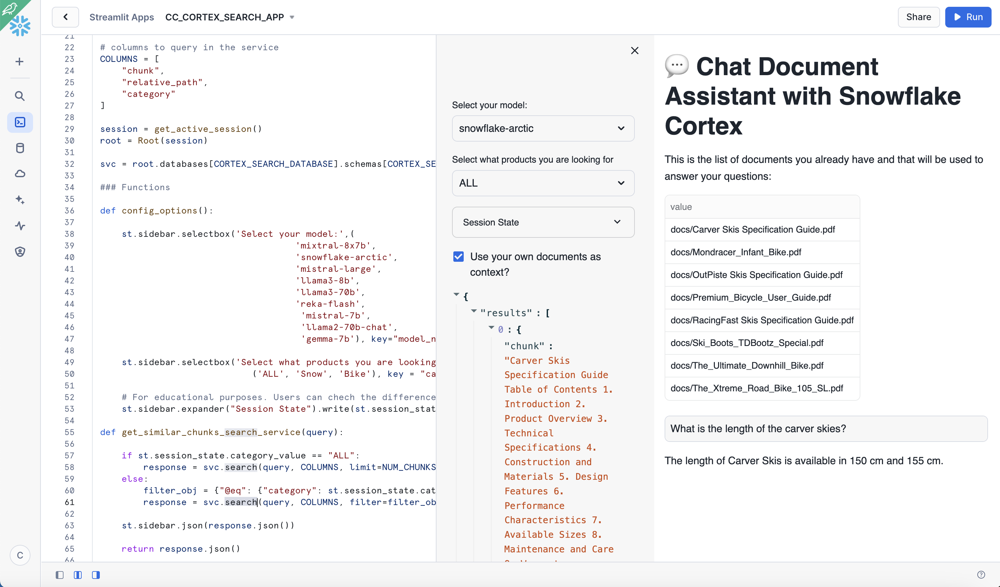

In the app, we can see the documents we had uploaded previously. We can also ask questions while trying multiple options using interactive widgets available on the side.

To test out the RAG framework, here are a few questions you can ask. Use the interactive widgets to compare the results when using a different LLM or when choosing to get a response without the context. This is related to very specific information that we have added into the documents and it is very unique to our products.

- Is there any special lubricant to be used with the premium bike?
- Does the mondracer infant bike need any special tool?
- Is there any temperature to be considered with the premium bicycle?
- What is the temperature to store the ski boots?
- Where have the ski boots been tested and who tested them?


### Other things to test

In this example, we have just decided a fixed format for chunks and used only the top result in the retrieval process. This [blog](https://medium.com/@thechosentom/rag-made-simple-with-snowflake-cortex-74d1df5143fd) provides some considerations about settings in the chunking strategy. 

This is the recommendation from the [Cortex Search documentation](https://docs.snowflake.com/LIMITEDACCESS/cortex-search/cortex-search-overview):

For optimal search results with Cortex Search, Snowflake recommends splitting the text in your search column into chunks of no more than 512 tokens (about 385 English words). A token is the smallest unit of text processed by a large language model.

When an entry in the search column contains more than 512 tokens, Cortex Search performs keyword-based retrieval on the entire body of text, but only uses the first 512 tokens for semantic (i.e., vector-based) retrieval.


```SQL
        LATERAL FLATTEN( input => SNOWFLAKE.CORTEX.SPLIT_TEXT_RECURSIVE_CHARACTER (
              EXTRACTED_LAYOUT,
              'markdown',
              1512,
              256,
              ['\n\n', '\n', ' ', '']
           )) c;
```

You can also try different instructions in your prompt and see how the responses may vary. Simply replace any of the text with another instruction and run the app again. The prompt is a crucial part of LLM generation. Make sure you are clear in your instructions. Results may change depending on your own use case.

```python
        prompt = f"""
           You are an expert chat assistance that extracs information from the CONTEXT provided
           between <context> and </context> tags.
           When ansering the question contained between <question> and </question> tags
           be concise and do not hallucinate. 
           If you don´t have the information just say so.
           Only anwer the question if you can extract it from the CONTEXT provideed.
           
           Do not mention the CONTEXT used in your answer.
    
           <context>          
           {prompt_context}
           </context>
           <question>  
           {myquestion}
           </question>
           Answer: 
           """
```

You can also try to change the number of chunks that are provided as context by simply modifying this value:

```python
NUM_CHUNKS = 3 # Num-chunks provided as context. Play with this to check how it affects your accuracy
```

<!-- ------------------------ -->
## Build a ChatBot UI with Conversation History

In the previous section, we have created a simple interface where we can ask questions about our documents and select the LLM running within Snowflake Cortex to answer the question. We have seen that when no context from our documents is provided, we just get a general answer. However, when we use context from the PDFs, we get a specific answer related to our data. But what happens if we want to have it be a conversation?

Large Language Models (LLMs) are stateless. That means when we make a call to any of them, it does not remember what  the previous call was about. With Snowflake Cortex, each complete() call we make is independent, even when using the same model. There are several techniques that can be used to keep the conversation flow and chat history. To maintain context, the app needs to keep a memory of the chat history and send it along with the new question in every single call to the LLM. Since LLM calls are restricted by a context window length (the total number of tokens the model can process), we need a smart way to manage this history.

Streamlit makes it very easy to create chat interfaces with its [Chat Elements](https://docs.streamlit.io/library/api-reference/chat). In this section we are going to see how we can write a simple app that can be used to have a conversation, and how it uses the data from our documents to provide answers. We are going to use a slide window concept. This helps to remember just a number of past interactions when calling the LLM. We are also going to summarize the previous conversation in order to find the right chunk in our documents that will help the LLM and provide the right answer. In the previous section, we were embedding the new question to find the right chunk for context. Here, we are also going to include the previous summary to find the chunks that will be used as context.


First let's create a new Streamlit App. Give it a name and create it within the database and schema we already made (CC_QUICKSTART_CORTEX_SEARCH_DOCS.DATA or whatever name you may have chosen).


In this second app, we are going to demo how to access the Complete function from Snowflake Cortex via Python API instead of SQL as we did in the previous app. To get access to the API, you need to specify the **snowflake-ml-python** package in your Streamlit app. This combination of packages version is known to work well:

- snowflake-ml-python = 1.8.1
- snowflake.core = 1.2.0
- python = 3.11
- snowflake-snowpark-python = 1.30.0
- streamlit = 1.42.0

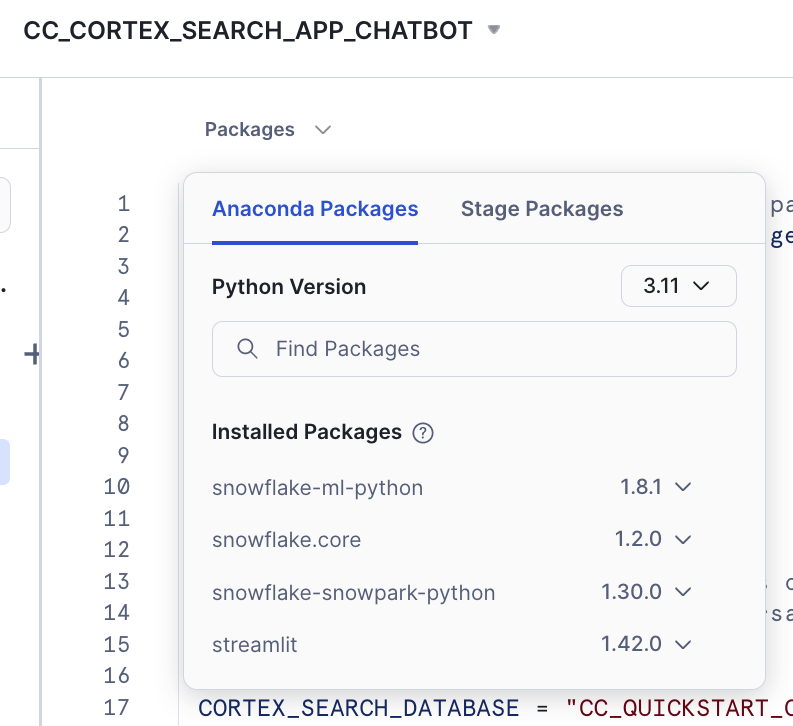


The Streamlit app comes with a default template that you can delete and replace with this code, which includes the front-end elements:

```python
import streamlit as st # Import python packages
from snowflake.snowpark.context import get_active_session

from snowflake.cortex import Complete
from snowflake.core import Root

import pandas as pd
import json

pd.set_option("max_colwidth",None)

### Default Values
NUM_CHUNKS = 3 # Num-chunks provided as context. Play with this to check how it affects your accuracy
slide_window = 7 # how many last conversations to remember. This is the slide window.

# service parameters
CORTEX_SEARCH_DATABASE = "CC_QUICKSTART_CORTEX_SEARCH_DOCS"
CORTEX_SEARCH_SCHEMA = "DATA"
CORTEX_SEARCH_SERVICE = "CC_SEARCH_SERVICE_CS"
######
######

# columns to query in the service
COLUMNS = [
    "chunk",
    "chunk_index",
    "relative_path",
    "category"
]

session = get_active_session()
root = Root(session)                         

svc = root.databases[CORTEX_SEARCH_DATABASE].schemas[CORTEX_SEARCH_SCHEMA].cortex_search_services[CORTEX_SEARCH_SERVICE]
   
### Functions
     
def config_options():

    st.sidebar.selectbox('Select your model:',('mistral-large2', 'llama3.1-70b',
                                    'llama3.1-8b', 'snowflake-arctic'), key="model_name")

    categories = session.table('docs_chunks_table').select('category').distinct().collect()

    cat_list = ['ALL']
    for cat in categories:
        cat_list.append(cat.CATEGORY)
            
    st.sidebar.selectbox('Select what products you are looking for', cat_list, key = "category_value")

    st.sidebar.checkbox('Do you want that I remember the chat history?', key="use_chat_history", value = True)

    st.sidebar.checkbox('Debug: Click to see summary generated of previous conversation', key="debug", value = True)
    st.sidebar.button("Start Over", key="clear_conversation", on_click=init_messages)
    st.sidebar.expander("Session State").write(st.session_state)

def init_messages():

    # Initialize chat history
    if st.session_state.clear_conversation or "messages" not in st.session_state:
        st.session_state.messages = []

def get_similar_chunks_search_service(query):

    if st.session_state.category_value == "ALL":
        response = svc.search(query, COLUMNS, limit=NUM_CHUNKS)
    else: 
        filter_obj = {"@eq": {"category": st.session_state.category_value} }
        response = svc.search(query, COLUMNS, filter=filter_obj, limit=NUM_CHUNKS)

    st.sidebar.json(response.json())
    
    return response.json()  

def get_chat_history():
#Get the history from the st.session_stage.messages according to the slide window parameter
    
    chat_history = []
    
    start_index = max(0, len(st.session_state.messages) - slide_window)
    for i in range (start_index , len(st.session_state.messages) -1):
         chat_history.append(st.session_state.messages[i])

    return chat_history

def summarize_question_with_history(chat_history, question):
# To get the right context, use the LLM to first summarize the previous conversation
# This will be used to get embeddings and find similar chunks in the docs for context

    prompt = f"""
        Based on the chat history below and the question, generate a query that extend the question
        with the chat history provided. The query should be in natual language. 
        Answer with only the query. Do not add any explanation.
        
        <chat_history>
        {chat_history}
        </chat_history>
        <question>
        {question}
        </question>
        """
    
    sumary = Complete(st.session_state.model_name, prompt)   

    if st.session_state.debug:
        st.sidebar.text("Summary to be used to find similar chunks in the docs:")
        st.sidebar.caption(sumary)

    sumary = sumary.replace("'", "")

    return sumary

def create_prompt (myquestion):

    if st.session_state.use_chat_history:
        chat_history = get_chat_history()

        if chat_history != []: #There is chat_history, so not first question
            question_summary = summarize_question_with_history(chat_history, myquestion)
            prompt_context =  get_similar_chunks_search_service(question_summary)
        else:
            prompt_context = get_similar_chunks_search_service(myquestion) #First question when using history
    else:
        prompt_context = get_similar_chunks_search_service(myquestion)
        chat_history = ""
  
    prompt = f"""
           You are an expert chat assistance that extracs information from the CONTEXT provided
           between <context> and </context> tags.
           You offer a chat experience considering the information included in the CHAT HISTORY
           provided between <chat_history> and </chat_history> tags..
           When ansering the question contained between <question> and </question> tags
           be concise and do not hallucinate. 
           If you don´t have the information just say so.
           
           Do not mention the CONTEXT used in your answer.
           Do not mention the CHAT HISTORY used in your asnwer.

           Only anwer the question if you can extract it from the CONTEXT provideed.
           
           <chat_history>
           {chat_history}
           </chat_history>
           <context>          
           {prompt_context}
           </context>
           <question>  
           {myquestion}
           </question>
           Answer: 
           """
    
    json_data = json.loads(prompt_context)

    relative_paths = set(item['relative_path'] for item in json_data['results'])

    return prompt, relative_paths


def answer_question(myquestion):

    prompt, relative_paths =create_prompt (myquestion)

    response = Complete(st.session_state.model_name, prompt)   

    return response, relative_paths

def main():
    
    st.title(f":speech_balloon: Chat Document Assistant with Snowflake Cortex")
    st.write("This is the list of documents you already have and that will be used to answer your questions:")
    docs_available = session.sql("ls @docs").collect()
    list_docs = []
    for doc in docs_available:
        list_docs.append(doc["name"])
    st.dataframe(list_docs)

    config_options()
    init_messages()
     
    # Display chat messages from history on app rerun
    for message in st.session_state.messages:
        with st.chat_message(message["role"]):
            st.markdown(message["content"])
    
    # Accept user input
    if question := st.chat_input("What do you want to know about your products?"):
        # Add user message to chat history
        st.session_state.messages.append({"role": "user", "content": question})
        # Display user message in chat message container
        with st.chat_message("user"):
            st.markdown(question)
        # Display assistant response in chat message container
        with st.chat_message("assistant"):
            message_placeholder = st.empty()
    
            question = question.replace("'","")
    
            with st.spinner(f"{st.session_state.model_name} thinking..."):
                response, relative_paths = answer_question(question)            
                response = response.replace("'", "")
                message_placeholder.markdown(response)

                if relative_paths != "None":
                    with st.sidebar.expander("Related Documents"):
                        for path in relative_paths:
                            cmd2 = f"select GET_PRESIGNED_URL(@docs, '{path}', 360) as URL_LINK from directory(@docs)"
                            df_url_link = session.sql(cmd2).to_pandas()
                            url_link = df_url_link._get_value(0,'URL_LINK')
                
                            display_url = f"Doc: [{path}]({url_link})"
                            st.sidebar.markdown(display_url)

        
        st.session_state.messages.append({"role": "assistant", "content": response})


if __name__ == "__main__":
    main()
```

For educational purposes we have enabled the check for "Do you want that I remember the chat history?" When disabled, the app will not use memory. Each question will be independent from the previous ones. This is what happens when we are not using memory:

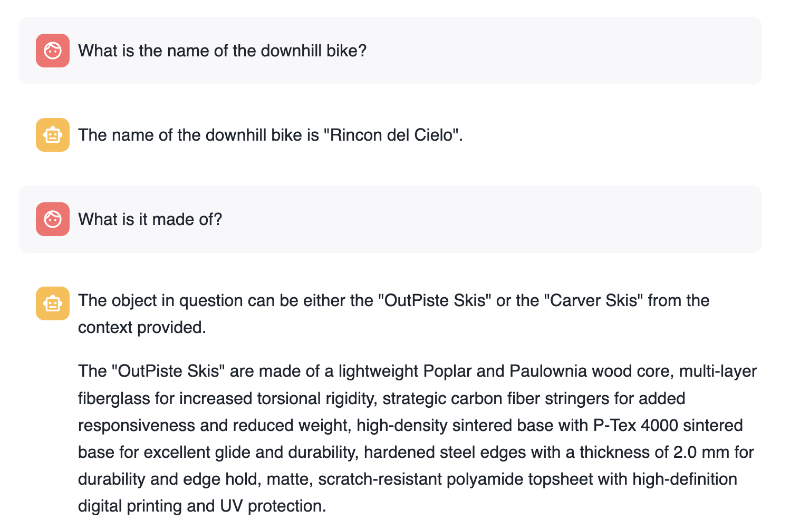

Basically, each question is answered individually. The second question loses the context.

When asking the same questions but using memory the first thing to notice is that we have re-created the new question adding the previous context:

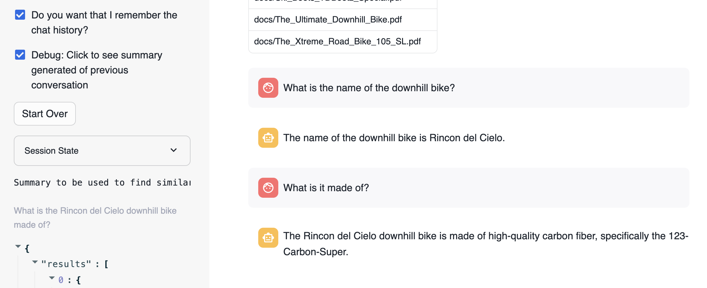

The new question that is used to search for similar chunks is "What is the Rincon del Cielo bike made of?"


### Code Walkthrough

```python
def get_chat_history():
```
This function is going to return the previous conversation in the chat up to a limit defined by the global variable slide_window.

Streamlit stores the conversation history in <code>st.session_state.messages</code>.

Everytime a question is asked, it is stored in the state with this code:

    st.session_state.messages.append({"role": "user", "content": question})

And the responses provided are also stored with this code:

    st.session_state.messages.append({"role": "assistant", "content": res_text})

Therefore <code>st.session_state.messages</code> is used as the chat memory

This next function <code>summarize_question_with_history()</code> takes the chat_history that we have had previously and the new question being asked. Remember that we are using the information from the PDF documents to answer questions. Therefore, we need to identify using Cortex Search what chunk of text will be relevant to answer the question. 

If we just use "what is it made of" sentence to look for similar chunks, we likely will not get the right one. We need to include more information in the call we make to <code>get_similar_chunks()</code>. 

Take a look this <code>summarize_question_with_history()</code> function:

```python
def summarize_question_with_history(chat_history, question):
# To get the right context, use the LLM to first summarize the previous conversation
# This will be used to get embeddings and find similar chunks in the docs for context

    prompt = f"""
        Based on the chat history below and the question, generate a query that extend the question
        with the chat history provided. The query should be in natual language. 
        Answer with only the query. Do not add any explanation.
        
        <chat_history>
        {chat_history}
        </chat_history>
        <question>
        {question}
        </question>
        """
    
    sumary = Complete(st.session_state.model_name, prompt)   

    if st.session_state.debug:
        st.sidebar.text("Summary to be used to find similar chunks in the docs:")
        st.sidebar.caption(sumary)

    sumary = sumary.replace("'", "")

    return sumary
```

In that function we are using the <code>Complete()</code> API. This is where we have created a specific prompt to provide the chat history and the new question in order to get the query that will be used to find the right context.

In order to experiment with this, we have also created a selection check "Debug: Click to see summary generated of previous conversation" that will allow you to see what is the question being used to look for similar chunks.


Now the function:

```python
def create_prompt (myquestion):
```

Use all those previous functions to get the <b>chat_history</b> and <b>prompt_context</b> to build the prompt. This prompt is adding the previous conversation plus the context extracted from the PDFs and the new question.

```python
   prompt = f"""
           You are an expert chat assistance that extracs information from the CONTEXT provided
           between <context> and </context> tags.
           You offer a chat experience considering the information included in the CHAT HISTORY
           provided between <chat_history> and </chat_history> tags..
           When ansering the question contained between <question> and </question> tags
           be concise and do not hallucinate. 
           If you don´t have the information just say so.
           
           Do not mention the CONTEXT used in your answer.
           Do not mention the CHAT HISTORY used in your asnwer.

           Only anwer the question if you can extract it from the CONTEXT provideed.
           
           <chat_history>
           {chat_history}
           </chat_history>
           <context>          
           {prompt_context}
           </context>
           <question>  
           {myquestion}
           </question>
           Answer: 
           """
 ```

What makes this very easy with Streamlit are the [st.chat_input](https://docs.streamlit.io/library/api-reference/chat/st.chat_input) and [st.chat_message](https://docs.streamlit.io/library/api-reference/chat/st.chat_message) functions. This is the code that get the question with st.chat_input, add it to st.chat_message and to the memory with st.session_state.messages.append and call the <b>answer_question()</b> function to get the answer that is also printed and stored:

```python
    if question := st.chat_input("What do you want to know about your products?"):
        # Add user message to chat history
        st.session_state.messages.append({"role": "user", "content": question})
        # Display user message in chat message container
        with st.chat_message("user"):
            st.markdown(question)
        # Display assistant response in chat message container
        with st.chat_message("assistant"):
            message_placeholder = st.empty()
    
            question = question.replace("'","")
    
            with st.spinner(f"{st.session_state.model_name} thinking..."):
                response, relative_paths = answer_question(question)            
                response = response.replace("'", "")
                message_placeholder.markdown(response)

                if relative_paths != "None":
                    with st.sidebar.expander("Related Documents"):
                        for path in relative_paths:
                            cmd2 = f"select GET_PRESIGNED_URL(@docs, '{path}', 360) as URL_LINK from directory(@docs)"
                            df_url_link = session.sql(cmd2).to_pandas()
                            url_link = df_url_link._get_value(0,'URL_LINK')
                
                            display_url = f"Doc: [{path}]({url_link})"
                            st.sidebar.markdown(display_url)

        
        st.session_state.messages.append({"role": "assistant", "content": response})
```
We are also printing the links to the documents being used to answer the questions.

Here are some other suggestions based on specific info from the documents (unique for us):

- What is the name of the ski boots?
- Where have been tested?
- Who tested them?
- Do they include any special component?


You can try this out with your own documents. You will notice different performance depending on the LLM you use. 

<!-- ------------------------ -->
## Automatic Processing of New Documents

The next step in building an enterprise-ready RAG system is ensuring it stays up-to-date. If a new product manual is released or an old one is retired, your search index must update automatically. 

Maintaining your RAG system when new documents are added, deleted or updated can be tedious. Snowflake makes it very easy. Cortex Search is a self-managed service. We only need to add, delete or update rows in the table where Cortex Search Service has been enabled. The service will then automatically update the indexes and create new embeddings based on the frequency defined during service creation.

In addition, we can use Snowflake features like [Streams](https://docs.snowflake.com/en/user-guide/streams-intro), [Tasks](https://docs.snowflake.com/en/user-guide/tasks-intro), and [Stored Procedures](https://docs.snowflake.com/en/developer-guide/stored-procedure/stored-procedures-overview) to automatically process new PDF files as they are added into Snowflake. 

First we create two streams for the DOCS staging area. One is going to be used to process deletes and the other to process inserts. The Streams capture the changes on the Directory Table used for the DOCS staging area. This way, we can track new updates and deletes:

```SQL
create or replace stream insert_docs_stream on stage docs;
create or replace stream delete_docs_stream on stage docs;
```

Second, we are going to define a Stored Procedure. These extend the system with procedural code. With a procedure, you can use branching, looping, and other programmatic constructs. You can reuse a procedure multiple times by calling it from other code. This will process those streams to:

- Delete from the docs_chunk_table the content for files that has been deleted from the stagin area, so they are no longer relevant
- Parse new PDF documents that has been added into the staging area using PARSE_DOCUMENT
- Chunk the new document into pieces using SPLIT_TEXT_RECURSIVE_CHARACTER
- Classify the new documents and update the label (this step is optional just to show the part of the possible)

Create the Stored Procedure:

```SQL
create or replace procedure insert_delete_docs_sp()
RETURNS VARCHAR
LANGUAGE SQL
AS
$$
BEGIN

DELETE FROM docs_chunks_table
    USING delete_docs_stream
    WHERE docs_chunks_table.RELATIVE_PATH = delete_docs_stream.RELATIVE_PATH
    and delete_docs_stream.METADATA$ACTION = 'DELETE';

CREATE OR REPLACE TEMPORARY TABLE RAW_TEXT AS
    WITH FILE_TABLE as 
      (SELECT 
            RELATIVE_PATH,
            SIZE,
            FILE_URL,
            build_scoped_file_url(@docs, relative_path) as scoped_file_url,
            TO_FILE('@DOCS', RELATIVE_PATH) AS docs 
        FROM 
            insert_docs_stream
        WHERE 
            METADATA$ACTION = 'INSERT'        
        )
    SELECT 
        RELATIVE_PATH,
        SIZE,
        FILE_URL,
        scoped_file_url,
        TO_VARCHAR (
            SNOWFLAKE.CORTEX.AI_PARSE_DOCUMENT (
                docs,
                {'mode': 'LAYOUT'} ):content
            ) AS EXTRACTED_LAYOUT 
    FROM 
        FILE_TABLE;
    

    -- Insert new docs chunks
insert into docs_chunks_table (relative_path, size, file_url,
                            scoped_file_url, chunk, chunk_index)

select relative_path, 
            size,
            file_url, 
            scoped_file_url,
            c.value::TEXT as chunk,
            c.INDEX::INTEGER as chunk_index
            
    from 
        RAW_TEXT,
        LATERAL FLATTEN( input => SNOWFLAKE.CORTEX.SPLIT_TEXT_RECURSIVE_CHARACTER (
              EXTRACTED_LAYOUT,
              'markdown',
              1512,
              256,
              ['\n\n', '\n', ' ', '']
           )) c;

    -- Classify the new documents

    CREATE OR REPLACE TEMPORARY TABLE docs_categories AS 
    WITH unique_documents AS (
      SELECT DISTINCT
        d.relative_path, d.chunk
      FROM
        docs_chunks_table d
      INNER JOIN
        RAW_TEXT r
        ON d.relative_path = r.relative_path
      WHERE 
        d.chunk_index = 0
    ),
    docs_category_cte AS (
      SELECT
        relative_path,
        TRIM(snowflake.cortex.AI_CLASSIFY (
            'Title:' || relative_path || 'Content:' || chunk, ['Bike', 'Snow']
            )['labels'][0], '"') AS CATEGORY
      FROM
        unique_documents
    )
    SELECT
      *
    FROM
      docs_category_cte;

    -- Update cathegories

    update docs_chunks_table 
        SET category = docs_categories.category
        from docs_categories
        where  docs_chunks_table.relative_path = docs_categories.relative_path;
END;
$$;

```

Now we can create a Task that every X minutes can check if there is new data in the stream and take an action. We are setting the schedule to 5 minutes so you can follow the execution, but feel free to reduce the time to 1 minute if needed. Consider what would be best for your app and how often new docs are updated.

We define:
  - Where: This is going to be executed using warehouse **COMPUTE_WH**. Please name to your own Warehouse.
  - When: Check every 5 minutes. Execute in the case of new records in the delete_docs_stream stream (we could also use the other stream)
  - What to do: Call the stored procedure insert_delete_docs_sp()

Execute this code in your Snowflake Worksheet to create the task:

```SQL
create or replace task insert_delete_docs_task
    warehouse = COMPUTE_WH
    schedule = '5 minute'
    when system$stream_has_data('delete_docs_stream')
as
    call insert_delete_docs_sp();


alter task  insert_delete_docs_task resume;
```
Now we can prove the RAG system updates automatically when documents change. 

After uploading the document (and if you are fast enough before the doc is automatically processed) you can see the doc in the stream:

Now let's test how it works. 

Run these queries. Your streams will be empty:

```SQL
select * from delete_docs_stream;
select * from insert_docs_stream;
```
We are going to test the modification of a document and the deletion of another.

First you can check what is the response to the question:

"Is there any special lubricant to be used with the premium bike?"

You should get something pointing to Premium Oil 2287:

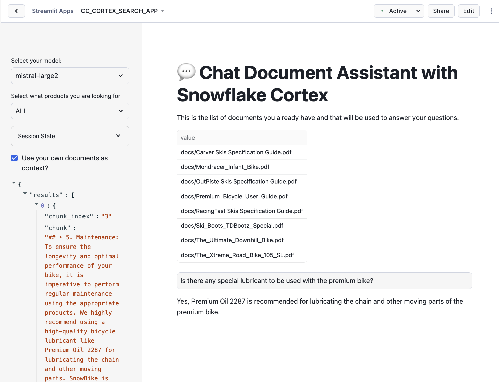

Now, let's update the document for the Premium Bike as we have a new lubricant to be used. Also you can test the deletion of another document.

Go to your database, select the schema DATA and the Stage DOCS. Click on "Premium_Bicycle_User_Guide.pdf" document and select Remove:

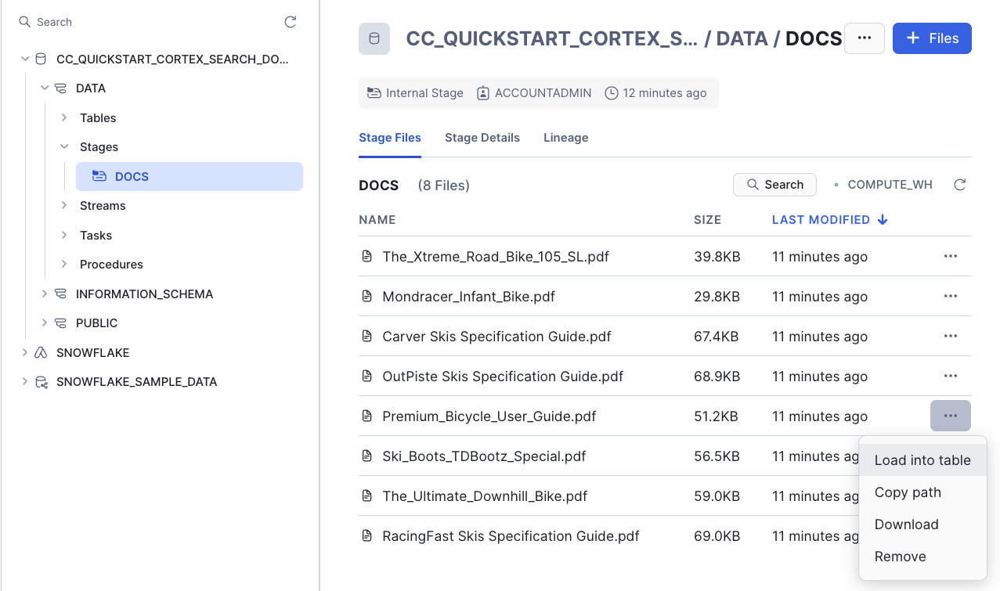

We no longer have Ski boots, so you can also remove the Ski_Boots_TDBootz_Special.pdf document.

Now you can add the new version of the "Premium_Bicycle_User_Guide.pdf" document. Download the new version from:

- [Premium_Bicycle_User_Guide.pdf](https://github.com/Snowflake-Labs/sfguide-ask-questions-to-your-documents-using-rag-with-snowflake-cortex-search/blob/main/NEW_DOCS/Premium_Bicycle_User_Guide.pdf)

If you read the document, you will notice that the new Oil recommended is Premium Oil 5555

On the top right, click on +Files and add this new file:

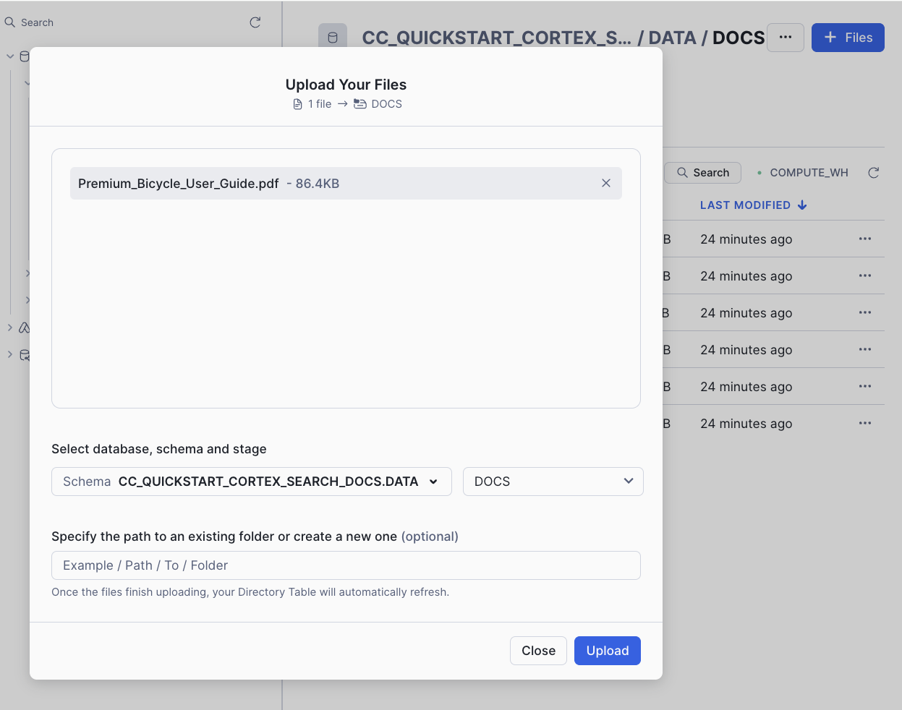

If you have done this fast enough (in less than 5 minutes), you can check that both streams have detected the changes:

```SQL
select * from delete_docs_stream;
select * from insert_docs_stream;
```
The column METADATA$ACTION tells us if this is a DELETE or an INSERT.

Select specific columns so you can see the columns from the Stream:


You can also force the task execution with:

```SQL
execute task insert_delete_docs_task;
```

Note that once the Stream has been processed, it will be empty.

Under Transformation » Tasks, you can find your task and monitor the execution:

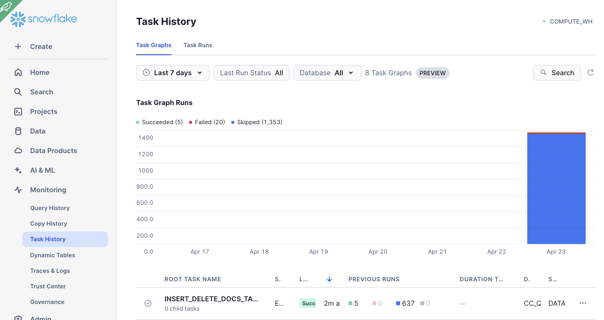

And now you can go back to your Streamlit app to ask the question again:

"Is there any special lubricant to be used with the premium bike?"

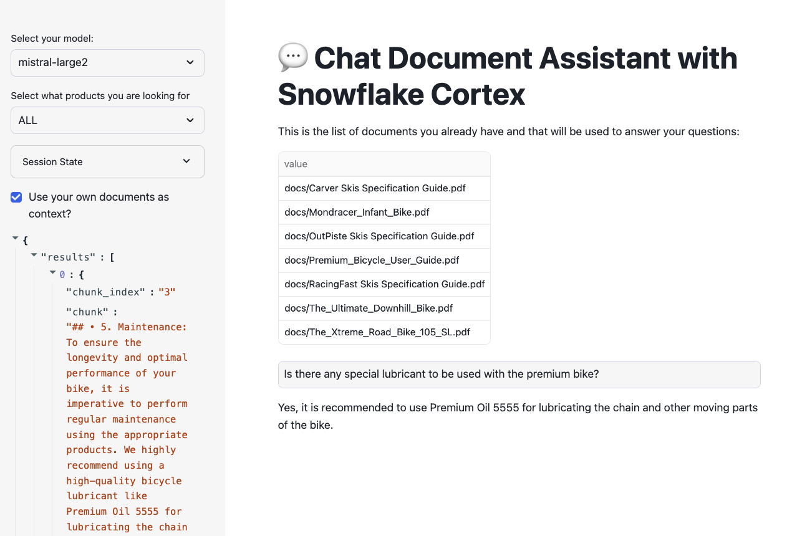

You can check that the new document is being used.

If you ask the question: "Who tested the ski boots?", you should get something like "The context provided does not mention anyone testing ski boots" as the document has been deleted.

Once you have finished testing uploading new documents and asking questions, you may want to suspend the task to ensure it doesn’t try to run and consume resources:

```SQL
alter task insert_delete_docs_task suspend;
```

<!-- ------------------------ -->
## Cleanup

In order to avoid consuming credits, you can also drop the databse used for this guide.

```SQL
drop database CC_QUICKSTART_CORTEX_SEARCH_DOCS;
```

<!-- ------------------------ -->
## Conclusion And Resources

Congratulations! You've successfully performed RAG using Snowflake Cortex Search and securely built a full-stack RAG application in Snowflake without having to build integrations, manage any infrastructure, or deal with security concerns with data moving outside of the Snowflake governance framework. 

### What You Learned
- Creating functions to automatically extract text and chunk PDF files
- Automatically identify document categories using LLMs
- Using Snowflake Cortex Search to use LLMs to answer questions
- Building an application front-end with Streamlit

### Related Resources

- [Docs: Snowflake Cortex LLM functions](https://docs.snowflake.com/en/user-guide/snowflake-cortex/llm-functions)
- [Blog: RAG explainer and how it works in Snowflake](/blog/easy-secure-llm-inference-retrieval-augmented-generation-rag-cortex)
- [Blog: Customizing RAG framework components using Snowpark Container Services](https://medium.com/@jason.summer/developing-a-product-chatbot-with-airmiles-in-snowflake-6b197d3fc424)
- [Docs: Snowflake Directory Tables](https://docs.snowflake.com/en/user-guide/data-load-dirtables)
- [Docs: Creating User-Defined Table Functions](https://docs.snowflake.com/en/developer-guide/snowpark/python/creating-udtfs)

---

