author: David Holes, Nazar Labunets
id: ataccama_snowflake_data_quality
summary: Follow this guide to see how to use Ataccama pushdown capabilities at Snowflake.
categories: Getting-Started, Data-Quality, Data-Engineering
environments: web
status: Published 
feedback link: https://github.com/Snowflake-Labs/sfguides/issues
tags: Getting Started, Data Science, Data Engineering, Data Quality, Data Profiling, Data Observability

# A Data Quality Guide for Snowflake Data with Ataccama
<!-- ------------------------ -->
## Overview 
Duration: 5

This guide explains how to use Ataccama ONE to catalog, profile,  classify, and monitor data quality on Snowflake.

Ataccama ONE lets you:
- Process all data directly on Snowflake with maximum security
- Create data quality rules in a user-friendly UI with Gen AI assistance
- Set up data observability over your Snowflake data to catch unexpected issues like statistical anomalies, unexpected data volume changes, schema changes, and overall data quality drops.
- Automate the cataloging and data quality monitoring on any new Snowflake data you add in the future.

As a member of the Snowflake Horizon Partner Ecosystem, Ataccama has invested heavily in native integration with Snowflake Data Cloud to bring accessible and easy-to-use data quality and data governance capabilities to Snowflake users.
 
### Prerequisites
- Access to an instance of the Snowflake Data Cloud.
- Access to an Ataccama environment. Please reach out to your Ataccama sales representative or contact [Ataccama](https://www.ataccama.com/contact/form).
- Access to Ataccama documentation.

### What You Will Learn 
- How to ingest Snowflake metadata into Ataccama ONE
- How to profile and classify data
- How to set up data observability
- How to set up data quality monitoring

### What You Need 
- A Snowflake Instance and a Snowflake Account. If not, [start a free trial](https://trial.snowflake.com/?owner=SPN-PID-420074).
- A Snowflake database that contains data.
- Login credentials for your Snowflake database.
- An Ataccama environment access.

### What You Will Build 
- Documented and classified Snowflake data of choice.
- Data quality checks either on the data domains of choice or on specific tables.
- Data observability routine over your Snowflake Data Cloud or tables of choice.

<!-- ------------------------ -->
## How It Works
Duration: 5

As a Snowflake partner, the leading [Data Quality platform](https://www.ataccama.com/platform/data-quality) provider Ataccama has invested in native integration for the most efficient and cost-effective data processing on Snowflake, which means your data is processed on Snowflake and won't be moved anywhere.

Dedicated processing engines are typically well-tuned for specific data processing jobs, offering unmatched performance in a given area. However, users should be mindful of the disadvantages and risks data transfer between the source and engine could bring - including the time needed for the transfer (total performance impact) and the data security aspect.

With pushdown, all data quality checks happen natively on Snowflake, allowing you to assess data quality without transferring data between Snowflake and a data processing engine. Ataccama data processing jobs are translated/transformed into Snowflake jobs, utilizing basic SQL, special user-defined functions (UDFs), and the Snowpark library for more complex logic.

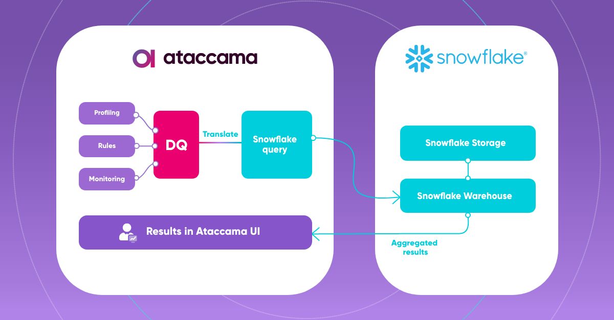

## Connect to a Snowflake Database Instance
Duration: 20

The data quality processing configurations available in Ataccama ONE are translated to Snowflake SQL language, either by utilizing native SQL functions or creating new functions. This is done by the Ataccama Data Processing Engine (DPE) so at least one DPE will still be required to handle the translation of Ataccama data quality processing configurations to Snowflake functions.

### Add a connection to a new source

In **Knowledge Catalog > Sources**, select **Create**. Provide the name and description as required, the owner of the source, and optionally, a deployment tag to help organize the sources (deployment tags can be managed via [Configuring Lists of Values](https://support.ataccama.com/home/docs/aip/latest/development-guides/one-development-guide/configuring-the-one-web-application/configuring-lists-of-values)). 

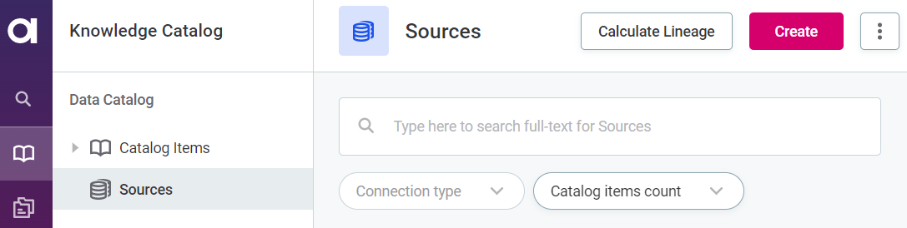

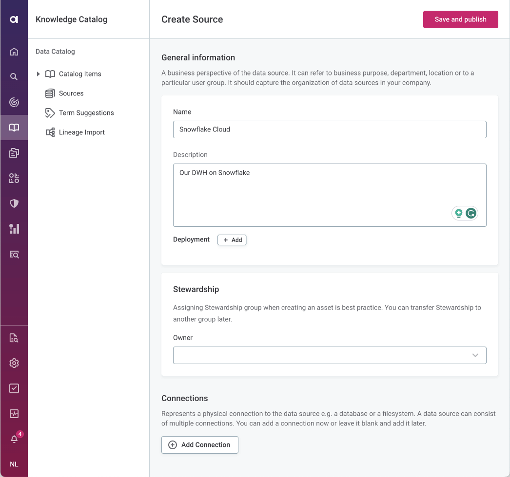

To connect to the source, select Add Connection and follow the instructions found in Configure the connection.

### Configure the connection 
After selecting Add Connection, provide the following details: 

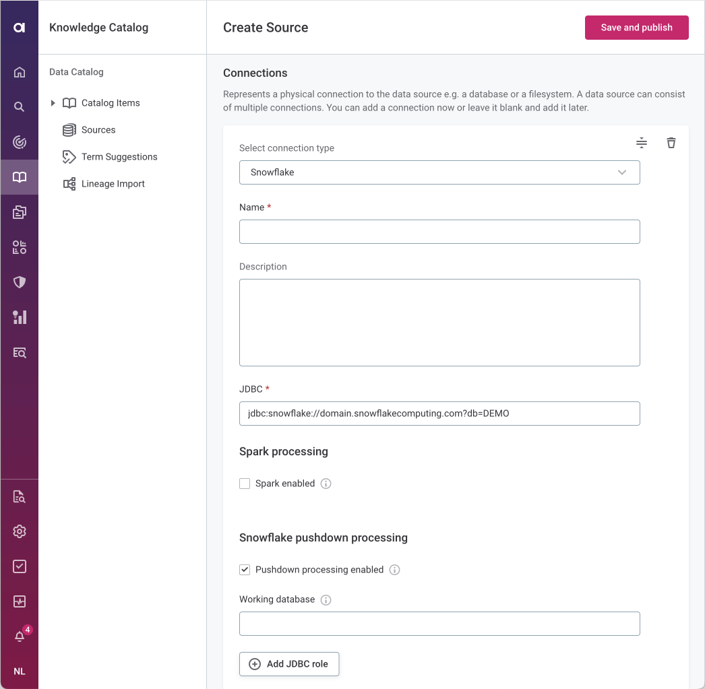

- **Connection type**: Select the connection type from the list provided under the **Relational Database** heading.
- **Name**: Specify a meaningful name for your connection. This name is used to indicate the location of catalog items.
- **Description**: A short description of the data source connection. Optional.
- **Enable analytical queries**: Analytical queries must be enabled in order to create data visualizations in Ataccama ONE .
- **Allow data export**: Allow data export must be enabled to use the Data Export feature. For more information, see [Data Export](https://support.ataccama.com/home/docs/aip/latest/user-guides/one-web-application-user-guide/knowledge-catalog/data-catalog/working-with-data-sources/data-export). Data export is also necessary to create data visualizations.
- **JDBC**: A JDBC connection string pointing to the IP address or the URL of your Snowflake Data Cloud instance.

Depending on the data source and the authentication method used, additional properties may be required for successful connection. Please see [Adding Driver Properties](https://support.ataccama.com/home/docs/aip/latest/user-guides/one-web-application-user-guide/knowledge-catalog/data-catalog/working-with-data-sources/connecting-to-a-relational-database/adding-driver-properties) for more information.

- **Pushdown processing enabled**: Enables query pushdown processing on Snowflake. When enabled, profiling is done entirely using Snowflake data warehouse. AI fingerprints are also computed in Snowflake. During query pushdown, profiling results and data samples are sent to Ataccama ONE. More information about pushdown profiling in Snowflake can be found in [Snowflake Pushdown Processing](https://support.ataccama.com/home/docs/aip/latest/user-guides/one-web-application-user-guide/knowledge-catalog/data-catalog/working-with-data-sources/connecting-to-a-relational-database/snowflake-pushdown-processing). Full profiling does not include domain detection. Domain detection is always executed locally by DPE. 

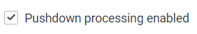 

For pushdown processing to function, the credentials added in Add Credentials need to be for a Snowflake user with write permissions, as pushdown processing involves writing into the working database (including creating tables). 

- **Working database**: When Snowflake pushdown processing is used, Ataccama creates a stage to store functions and temporary tables during profiling. Enter the name of the database you want to use. You have two options:

    - Store the stage, functions, and temporary tables in the database that is being processed (default).
    - Create a custom database (recommended).

    In Ataccama ONE you only need to enter the working database name, but you need to execute a script in Snowflake independently before proceeding, so Snowflake allows Ataccama to transfer functions. The script creates the working database and grants access to defined user roles. In Snowflake, select + **Worksheet**, and follow the instructions below. 

    - Working database name (represented by <working_db> placeholder in example script): this is the name of the temporary database that is created to store Ataccama domain lookups and other temporary data. The database can be deleted after you finish using the Ataccama product. Multiple users can reuse the same database if they have access to it.
    - Roles (represented by <pushdown_role> in example script): specify the Snowflake roles that can access to the Ataccama working database. If no roles are specified here, all users have access to the database.
    - Users (represented by <sample_user> and <another_user> in the example script): assign the created role to users as required.

        ```sql
        -- Create working database and stage
        CREATE DATABASE IF NOT EXISTS <working_db>;
        CREATE STAGE IF NOT EXISTS _ATC_ONE_STAGE;

        -- Create role
        CREATE ROLE IF NOT EXISTS <pushdown_role>;

        -- Assign role to user
        GRANT ROLE <pushdown_role> TO USER <sample_user>;
        GRANT ROLE <pushdown_role> TO USER <another_user>;

        -- Grant access to database
        GRANT USAGE ON DATABASE <working_db> TO ROLE <pushdown_role>;

        -- Grant access to schema
        GRANT USAGE ON SCHEMA public TO ROLE <pushdown_role>;
        GRANT CREATE TABLE ON SCHEMA public TO ROLE <pushdown_role>;
        GRANT CREATE SEQUENCE ON SCHEMA public TO ROLE <pushdown_role>;
        GRANT CREATE FUNCTION ON SCHEMA public TO ROLE <pushdown_role>;

        -- Grant access to stage
        GRANT READ ON STAGE _ATC_ONE_STAGE TO ROLE <pushdown_role>;
        GRANT WRITE ON STAGE _ATC_ONE_STAGE TO ROLE <pushdown_role>;
        ----
        ```

- **Grant to Roles**: this is only required if you need to share the Snowflake pushdown setting across different credentials (e.g. to a common underlying role). If you do not need to share the setting, you can leave this empty.

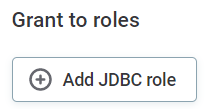 

- Select **Add Credentials**. Select the type from the options available: **Username and password**, **Integrated credentials**, or **OAUth**. Follow the instructions according to your chosen method.

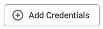 

- Methods:
    - **Username and password**: Basic authentication using your username and a password.
        - **Name**: A meaningful name for this set of credentials.
        - **Description**: A short description of the credentials, for example, in which cases or by whom these credentials are used.
        - **Username**: The username for the data source.
        - **Password**: The password for the data source.

        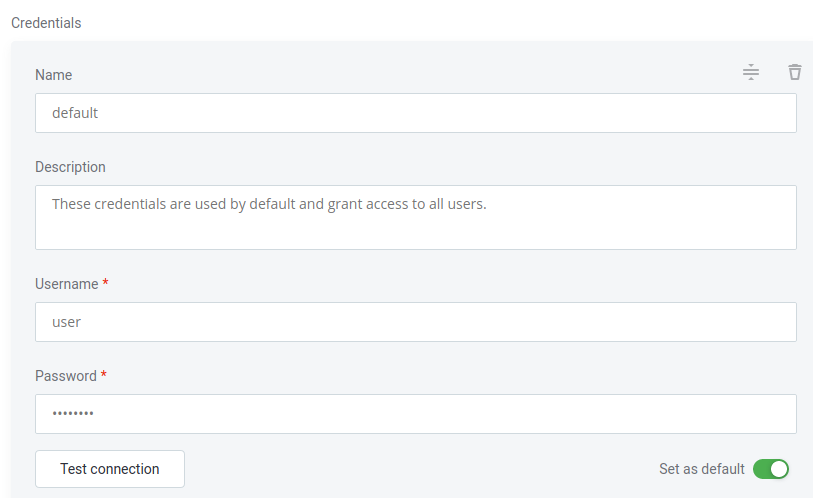 

        - **Test connection**: Test the connection to verify whether the data source has been correctly configured.
        - **Set as default**: Enable this option if you want these credentials to be used by default when connecting to the data source. 

        One set of credentials must be set as default for each connection; otherwise, monitoring and DQ evaluation will fail, and previewing data in the catalog will not be possible. 

    - **Integrated Credentials**: For some data sources you can add additional driver properties that will be used for authentication, e.g. for use with Azure Active Directory and/or Key Vault. Provide the following details: 
        - **Name**: A meaningful name for this set of credentials.
        - **Description**: A short description of the credentials, for example, in which cases or by whom these credentials are used.
        - **Test connection**: Test the connection to verify whether the data source has been correctly configured.
        - **Set as default**: Enable this option if you want these credentials to be used by default when connecting to the data source.

        One set of credentials must be set as default for each connection; otherwise, monitoring and DQ evaluation will fail, and previewing data in the catalog will not be possible. 

        - Proceed to [Adding Driver Properties](https://support.ataccama.com/home/docs/aip/latest/user-guides/one-web-application-user-guide/knowledge-catalog/data-catalog/working-with-data-sources/connecting-to-a-relational-database/adding-driver-properties). 

    - **OAuth Credentials**. You can use OAuth2 tokens to provide secure delegated access. If you select **OAuth credentials**, you will need to also provide a value for the connection in your integration (for example, Snowflake). The value you need to use can be found in the **Redirect URL** field (use the copy icon to copy the URL)

    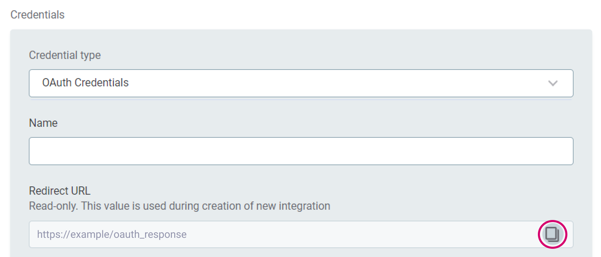 
    
    - Parameters:
        - **Client ID**: OAuth client ID
        - **Client secret**: client secret used to authenticate to the authorization server
        - **Authorization endpoint**: authorization server used to interact with the data source
        - **Token endpoint**: server used by the application to get access to a token or a refresh token
        - **Refresh token**: token that allows the application to obtain access without prompting the user again
        - **Refresh token valid till**: expiration of the refresh token
        - **Test connection**: Test the connection to verify whether the data source has been correctly configured.
        - **Set as default**: Enable this option if you want these credentials to be used by default when connecting to the data source.

        One set of credentials must be set as default for each connection; otherwise, monitoring and DQ evaluation will fail, and previewing data in the catalog will not be possible. 

    - **OAuth User SSO Credentials**: You can also use external identity provider SSO. This involves users logging into ONE through an external OIDC IdP (for example, Okta) and using their identity when accessing a data source. To activate OAuth User SSO credentials, refer to the guide on [Okta OIDC Integration with Impersonation](https://support.ataccama.com/home/display/AOP/.Okta+OIDC+Integration+with+Impersonation+v14.3.0). Provide the following details: 
        - **Name**: A meaningful name for this set of credentials.
        - **Description**: A short description of the credentials, for example, in which cases or by whom these credentials are used.
        - **Test connection**: Test the connection to verify whether the data source has been correctly configured.
        - **Set as default**: Enable this option if you want these credentials to be used by default when connecting to the data source.

- Write credentials are necessary for data export. To be able to export data from this connection, in **Write credentials**, select **Add Credentials**, and repeat step **Grant to Roles**. 

    The credentials added here need to be set as the default credentials to be able to select this connection when exporting data. 

<!-- ------------------------ -->
## Profile selected Snowflake tables
Duration: 10

As a first step to automating data quality management on Snowflake, profile several Snowflake tables containing Critical Data Elements that you know well. After you do that, you’ll start tagging its attributes and assigning some data quality rules to them, and train Ataccama ONE AI by doing so.

1. Go to your newly created Snowflake data source, switch to the **Connection** tab and click **Browse**. You’ll be presented with all schemas available to the user you’ve specified in the connection details.
2. Select the schema of interest, then select the table you want to profile and select **Profile** in the dropdown below.\

	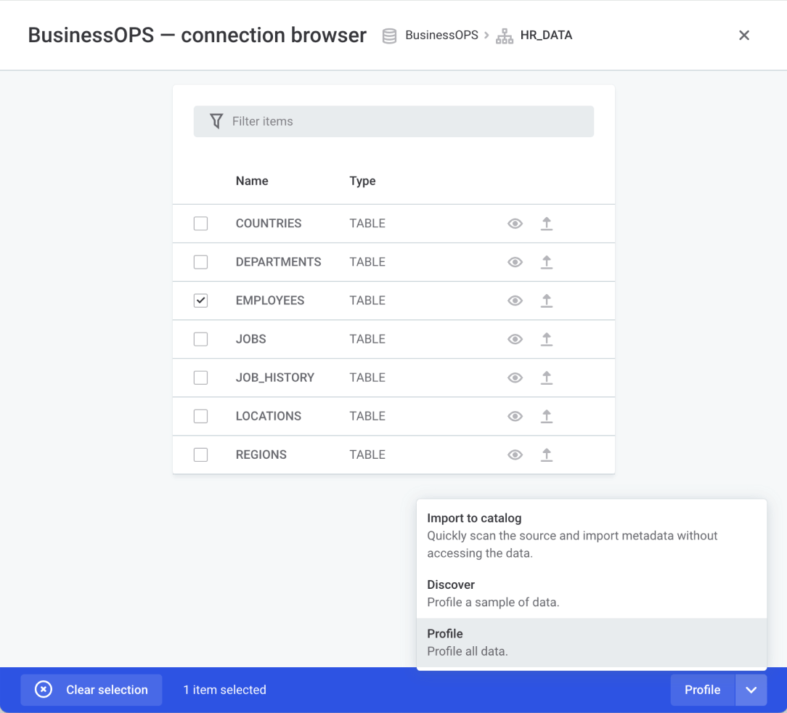

3. After the tables are profiled, find them in the Knowledge Catalog or via the global search bar.\
\
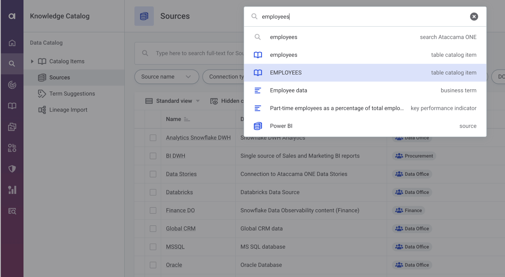
## Tag the profiled tables with business terms
Duration: 10

1. Open one of the tables you profiled. You will see a list of attributes in the top left under the **Overview** tab.\
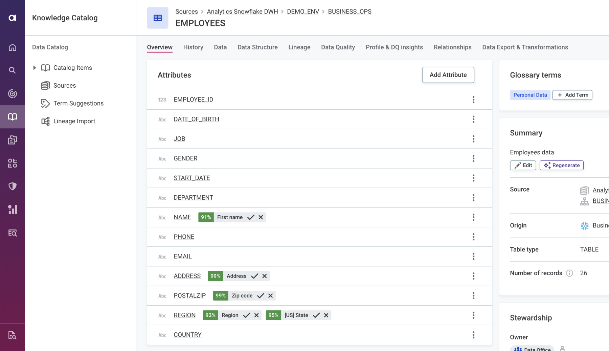
2. Review business term suggestions (if there are any) and accept or reject them as you see fit.
3. Tag one or several Critical Data Elements with a business term representing the semantic meaning of the data inside. These terms could be “email”, “first name”, “last name”, “ZIP code”, “product code”, “transaction amount”, “credit limit” or anything important  that you use within your organization. \
\
To do that, click  the container with the attribute you want to tag. In the sidebar that opens, click **Add term**.\
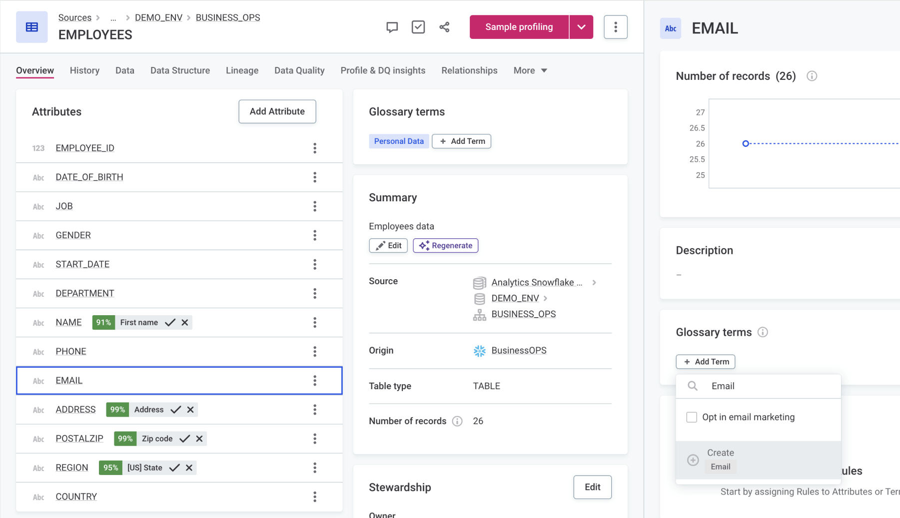
4. Fill in term information and click **Save**. Then Click **Publish** in the bar that appears.\
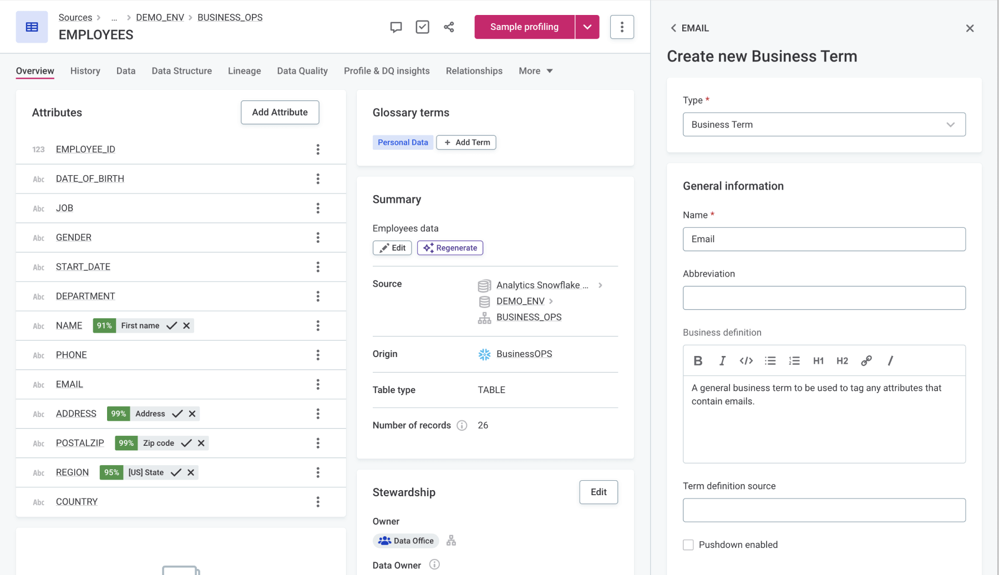
5. Repeat for as many attributes in the tables you’ve profiled as you know.

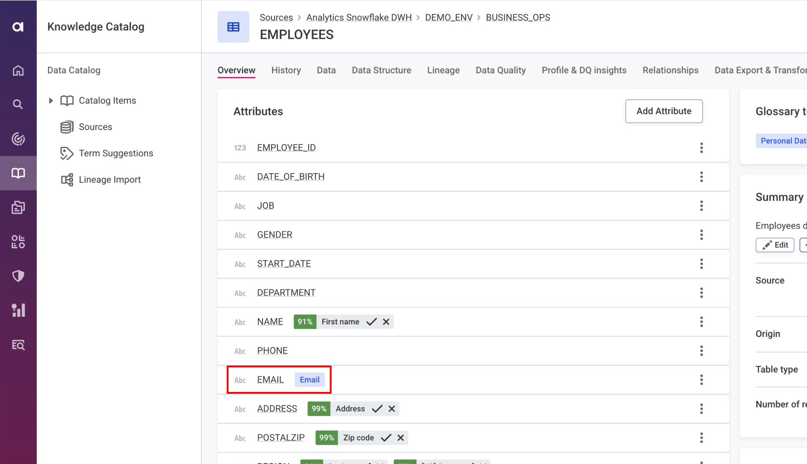

## Configure data quality rules and assign them to business terms
Duration: 15

This a two-part procedure:
1. First configure a data quality rule (or several of them).
2. Then assign the data quality rule to a business term.

> This way, when you add more Snowflake tables to Ataccama ONE Data Catalog, every time a business term is detected (based on data similarity), data quality will be calculated automatically.

### Configure a data quality rule

1. Open one of the tables you profiled, select one of the Critical Data Elements and switch to the **Profile & DQ Insights** tab.
2. Analyze the available profiling information, such Mask Analysis and Frequency Analysis to see how much the data inside corresponds to the business standard.\
\
	In our example, we’re looking at the column containing emails. Looking at the Pattern Analysis pane, we see that all patterns except one - `WD` - represent valid emails.\
\
	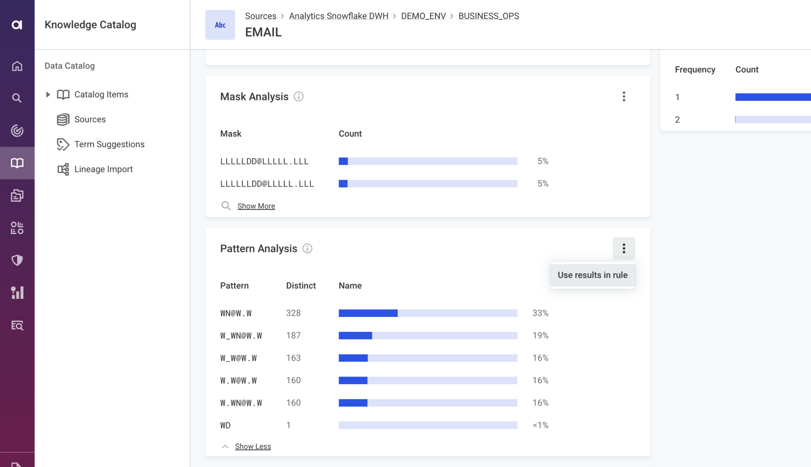
3. Click the context menu icon represented by three dots and click **Use results in rule**. Select the invalid pattern `WD` and click Continue.\
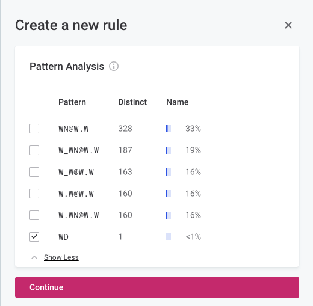
4. Make sure **Type** is set to Data Quality Evaluation. Enter rule **Name**, e.g. “Valid Email” and click **Save**.
5. Check rule logic, then click the context menu icon represented by three dots and select **Publish**.\
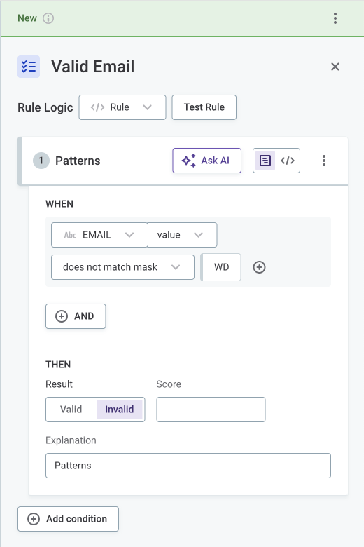

### Assign a data quality rule to a business term
1. Go back to the **Overview** tab
2. Click the business term you assigned to the attribute.
3. In the sidebar that opens, click the title of the business term.
4. When the separate business term page opens, click **Settings**.
5. In the **Data Quality Evaluation** section, under **Validity** click **Add Rule** and the rule you have created.\
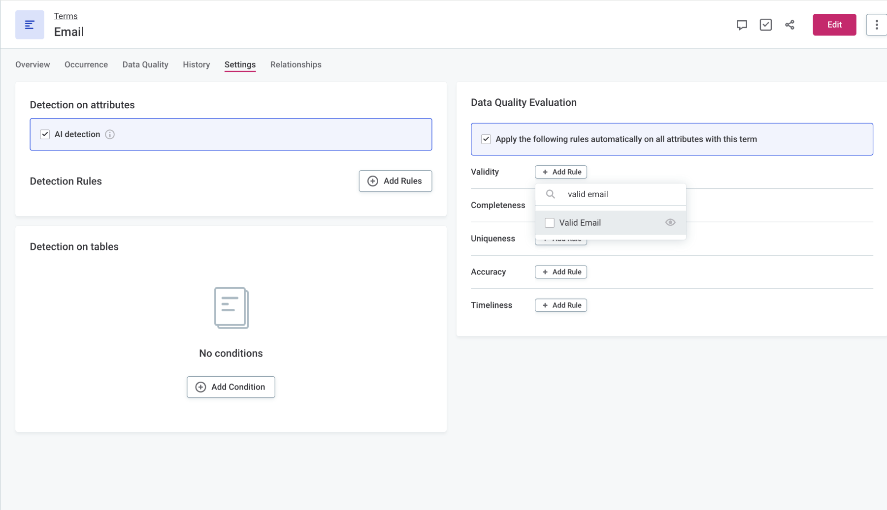\
\
Make sure **Apply the following rules automatically on all attributes with this term** is on.
\
6. Click **Request Review and Publish**.
7. Fill in task information and click **Submit**.
8. Follow the change review workflow and click **Approve**.

### Evaluate data quality
Now, go back to the attribute detail with the assigned business term, and click **Evaluate** in the Data Quality box.\


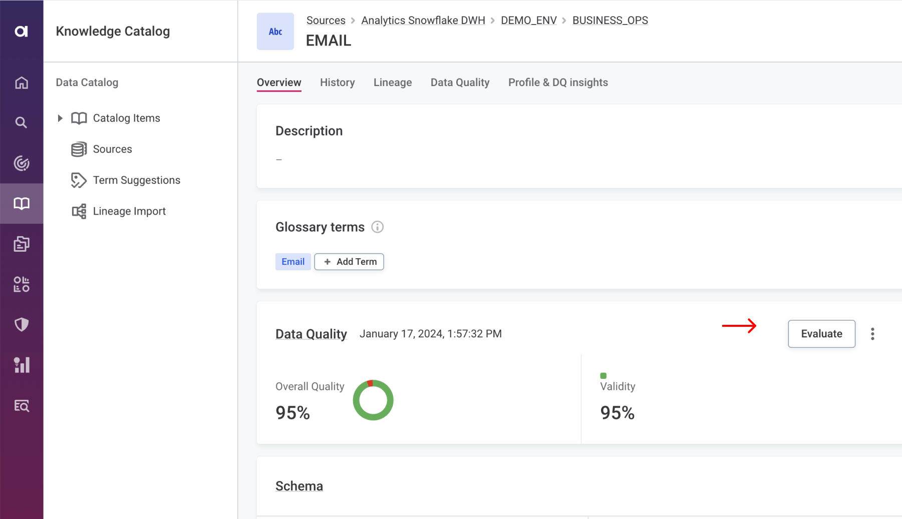\
\
\

This is a manual way to evaluate data quality. However, every time you profile new data and the business term with an assigned data quality rule is detected, data quality will be calculated automatically.

<!-- ------------------------ -->
## Conclusion
Duration: 5

Congratulations on completing this Quickstart Guide on Data Quality.

You have successfully set up data quality evaluation on at least one business term on part of your Snowflake data. You can now scale data quality monitoring across other Snowflake tables without any manual effort.

### What You Have Learned
1. How to connect your Snowflake Data Cloud instance to Ataccama ONE.
2. How to ingest Snowflake metadata and profile data.
3. How to create and assign business terms.
4. How to create data quality rules from data profiling results.
5. How to associate a data quality rule with a business term.
6. How to evaluate data quality manually and in an automated fashion.

You can learn more about Ataccama ONE Data Quality on Snowflake [here](https://www.ataccama.com/partner/snowflake).