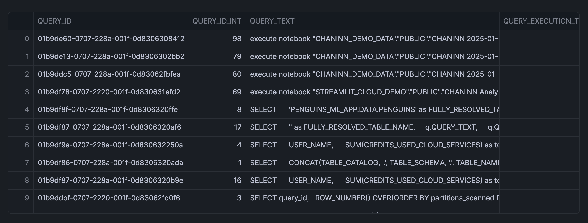
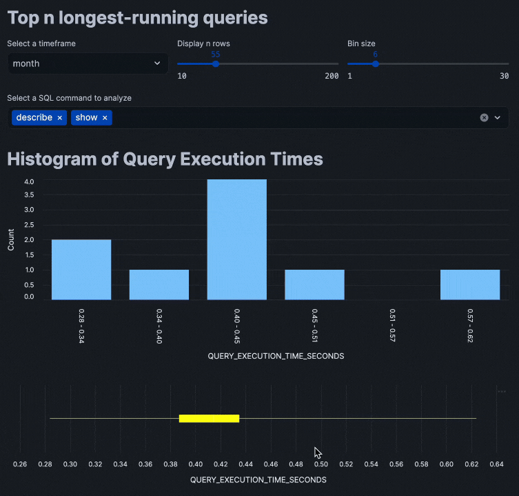

author: Chanin Nantasenamat
id: automated-query-performance-insights-with-streamlit
categories: snowflake-site:taxonomy/solution-center/certification/quickstart, snowflake-site:taxonomy/product/applications-and-collaboration, snowflake-site:taxonomy/snowflake-feature/build
language: en
summary: Build Streamlit apps in Snowflake Notebooks to analyze query performance and identify optimization opportunities.
environments: web
status: Published
feedback link: https://github.com/Snowflake-Labs/sfguides/issues


# Build Interactive Query Performance App in Snowflake Notebooks

<!-- ------------------------ -->
## Overview

Learn how to create an interactive Streamlit application within Snowflake Notebooks that helps analyze query performance. This tool will enable you to identify long-running queries and generate insights for optimization, potentially saving both time and computational resources.

### What You'll Learn
- How to create an interactive Streamlit app in Snowflake Notebooks
- Techniques for visualizing query performance data
- Methods to analyze query execution times
- Ways to implement interactive widgets for data exploration

### What You'll Build
An interactive app that visualizes the query performance metrics.

Here are features that we'll implement in the app:
- Histograms of query execution times
- Box plots for statistical distribution
- Interactive filters for timeframes
- Summary statistics for query performance

### What You'll Need
- Access to a [Snowflake account](https://signup.snowflake.com/?utm_source=snowflake-devrel&utm_medium=developer-guides&utm_cta=developer-guides)
- Basic familiarity with SQL and Python
- Understanding of basic statistical concepts

<!-- ------------------------ -->
## Setup

Firstly, to follow along with this quickstart, you can click on [Build_an_Interactive_Query_Performance_App_with_Streamlit.ipynb](https://github.com/Snowflake-Labs/snowflake-demo-notebooks/blob/main/Query_Performance_Insights_using_Streamlit/Build_an_Interactive_Query_Performance_App_with_Streamlit.ipynb) to download the Notebook from GitHub.

Snowflake Notebooks comes pre-installed with common Python libraries for data science and machine learning. The following libraries will be used in this tutorial:
- Snowflake Snowpark
- Pandas
- Streamlit
- Altair
- NumPy

### Warehouse Configuration
Select a warehouse that will be used for analysis. Here in this tutorial, I'll be using 'CHANIN_XS' (please replace with your own warehouse name).

<!-- ------------------------ -->
## Create the Base Query

### Write the Performance Query
First, we'll create the SQL query to retrieve query performance data:

```sql
SELECT query_id,
  ROW_NUMBER() OVER(ORDER BY partitions_scanned DESC) AS query_id_int,
  query_text,
  total_elapsed_time/1000 AS query_execution_time_seconds,
  partitions_scanned,
  partitions_total,
FROM snowflake.account_usage.query_history Q
WHERE warehouse_name = 'CHANIN_XS' 
  AND TO_DATE(Q.start_time) > DATEADD(day,-1,TO_DATE(CURRENT_TIMESTAMP()))
  AND total_elapsed_time > 0
  AND error_code IS NULL
  AND partitions_scanned IS NOT NULL
ORDER BY total_elapsed_time desc
LIMIT 50;
```




<!-- ------------------------ -->
## Build the Streamlit Interface

### Create Interactive Widgets
Firstly, we'll import the necessary libraries and implement the user interface widgets:

```python
from snowflake.snowpark.context import get_active_session
import pandas as pd
import streamlit as st
import altair as alt
import numpy as np

st.title('Top n longest-running queries')

# Input widgets
col = st.columns(3)

with col[0]:
    timeframe_option = st.selectbox('Select a timeframe', ('day', 'week', 'month'))

with col[1]:
    limit_option = st.slider('Display n rows', 10, 200, 100)

with col[2]:
    bin_option = st.slider('Bin size', 1, 30, 10)
```

### Data retrieval
Next, we'll load in the data via a SQL query into the app:
```python
# Data retrieval
session = get_active_session()
df = session.sql(
    f"""
    SELECT query_id,
      ROW_NUMBER() OVER(ORDER BY partitions_scanned DESC) AS query_id_int,
      query_text,
      total_elapsed_time/1000 AS query_execution_time_seconds,
      partitions_scanned,
      partitions_total,
    FROM snowflake.account_usage.query_history Q
    WHERE warehouse_name = 'CHANIN_XS' AND TO_DATE(Q.start_time) > DATEADD({timeframe_option},-1,TO_DATE(CURRENT_TIMESTAMP()))
      AND total_elapsed_time > 0 --only get queries that actually used compute
      AND error_code IS NULL
      AND partitions_scanned IS NOT NULL
    ORDER BY total_elapsed_time desc
    LIMIT {limit_option};
    """
    ).to_pandas()

df = df[df['QUERY_TEXT'].str.lower().str.startswith(tuple(commands.lower() for commands in sql_command_option))]
```

### Display Data Visualization
Finally, we'll proceed to adding data visualization to the app:

```python
st.title('Histogram of Query Execution Times')

# Create a DataFrame for the histogram data
hist, bin_edges = np.histogram(df['QUERY_EXECUTION_TIME_SECONDS'], bins=bin_option)

histogram_df = pd.DataFrame({
    'bin_start': bin_edges[:-1],
    'bin_end': bin_edges[1:],
    'count': hist
})
histogram_df['bin_label'] = histogram_df.apply(lambda row: f"{row['bin_start']:.2f} - {row['bin_end']:.2f}", axis=1)

# Create plots
histogram_plot = alt.Chart(histogram_df).mark_bar().encode(
    x=alt.X('bin_label:N', sort=histogram_df['bin_label'].tolist(),
            axis=alt.Axis(title='QUERY_EXECUTION_TIME_SECONDS', labelAngle=90)),
    y=alt.Y('count:Q', axis=alt.Axis(title='Count')),
    tooltip=['bin_label', 'count']
)

box_plot = alt.Chart(df).mark_boxplot(
    extent="min-max",
    color='yellow'
).encode(
    alt.X("QUERY_EXECUTION_TIME_SECONDS:Q", scale=alt.Scale(zero=False))
).properties(
    height=200
)

st.altair_chart(histogram_plot, use_container_width=True)
st.altair_chart(box_plot, use_container_width=True)


# Data display
with st.expander('Show data'):
    st.dataframe(df)
with st.expander('Show summary statistics'):
    st.write(df['QUERY_EXECUTION_TIME_SECONDS'].describe())
```

Putting all of these code snippets together, we can build out the interactive query performance insights app that looks like the following:



<!-- ------------------------ -->
## Conclusion And Resources

Congratulations! You've successfully built an interactive query performance analysis application using Streamlit within Snowflake Notebooks. This tool will help you identify optimization opportunities in your SQL queries through interactive data exploration.

### What You Learned
- Create interactive Streamlit widgets
- Visualize query performance data
- Implement real-time data filtering
- Generate statistical insights from the query history

### Related Resources

Articles:
- [Exploring execution times](https://docs.snowflake.com/en/user-guide/performance-query-exploring)

Documentation:
- [Snowflake Documentation](https://docs.snowflake.com/)
- [Streamlit Documentation](https://docs.streamlit.io/)

Happy coding!
