author: miles.adkins@snowflake.com
id: automl_with_snowflake_and_datarobot
summary: This lab will walk you through how to use Snowflake and DataRobot to perform supervised machine learning.
categories: Getting Started
environments: web
status: Published
feedback link: https://github.com/Snowflake-Labs/sfguides/issues
tags: DataRobot, AutoML, Partner Connect, Databases, Tables, Stages, File Formats

# AutoML with Snowflake and DataRobot

<!-- ------------------------ -->
## Use Case Overview
Duration: 5

This guide will take you through the process of performing supervised machine learning by building a binary classification model to help predict whether a customer is likely to churn (that is, no longer be our customer).

Supervised machine learning is the process of taking a historical dataset with KNOWN outcomes of what we would like to predict, to train a model, that can be used to make future predictions.

The historical dataset we will be working with today is taken from a fictitious telecommunications company, and contains details about a customers plan usage, spend patterns, issues logged with customer support, geographical information, and a binary value (hence binary classification) indicating whether that person ended their contract with the company (churned). Here is a snippet of the data:
<br/><br/>

<br/><br/>
Throughout this process, you will discover the ease at which it is possible to build and deploy machine learning models by leveraging the scale and performance of Snowflake and the automation of the DataRobot platform.

To showcase the full lifecycle of a deploying machine learning model, we will first load in Snowflake, our data cloud where all of our data lives. Then, we will leverage the DataRobot auto-pilot process to perform exploratory data analysis, and then train, evaluate, and interpret a slew of potential machine learning models. And finally, use the Snowflake-DataRobot prediction integration to score our model against new data, as if the model was in production.
### Prerequisites
- Basic knowledge of SQL, and database concepts and objects
- Basic understanding of data science and machine learning

### What You'll Learn
- How to create and utilize databases, tables, views, and warehouses
- Load structured data into Snowflake
- Use Snowflake’s “Partner Connect” to seamlessly create a DataRobot trial
- Automatically create, run, and evaluate prediction models in DataRobot
- Write results to Snowflake

### What You’ll Need
- A [Snowflake](https://signup.snowflake.com/) Account (if you are using an enterprise account through your organization, it is unlikely that you will have the privileges to use the `ACCOUNTADMIN` role, which is required for this lab).

### What You’ll Build
- Snowflake objects, including tables and warehouses, to scale and manage your data
- Over 50+ machine learning models automatically to measure their performance and interpret
- A prediction pipeline to automate scoring new data on your deployed model

<!-- ------------------------ -->
## Setting up Snowflake
Duration: 5

The first thing you will need to do is download the following .sql file that contains a series of SQL commands we will execute throughout this lab.

<button>
  [Download .sql File](https://snowflake-workshop-lab.s3.amazonaws.com/Snowflake_Datarobot_VHOL_guides.sql)
</button>
<br/><br/>

At this point, log into your Snowflake account and have a clear screen to start working with. If you have just created a free trial account, feel free to minimize or close any hint boxes that are looking to help guide you. These will not be needed for this lab as most of the hints will be covered throughout the remainder of this exercise.

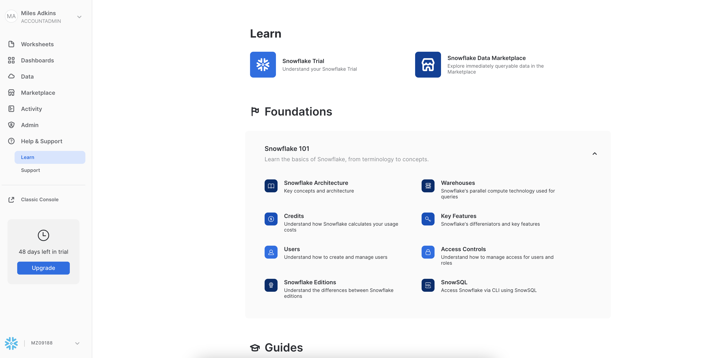
<br/><br/>

To ingest our script in the Snowflake UI, navigate to the ellipsis button on the top right hand side of a “New Worksheet” and load our script.

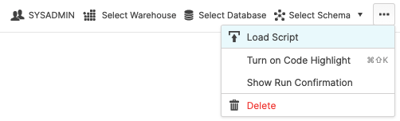
<br/><br/>

Snowflake provides "worksheets" as the spot for you to execute your code. For each worksheet you create, you will need to set the “context” so the worksheet knows how to behave. A “context” in Snowflake is made up of 4 distinctions that must be set before we can perform any work: the “role” we want to act as, the “database” and “schema” we want to work with, and the “warehouse” we want to perform the work. This can be found in the top right hand section of a new worksheet.

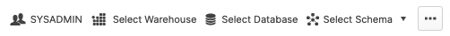

Lets go ahead and set the role we want to act as, which will be `SYSADMIN` to begin with. We can either set this either manually (`SYSADMIN` is the default role for a first time user, so this already may be populated) by hovering over the people icon and choosing SYSADMIN from the “Role” dropdown, or we can run the following line of code in our worksheet. In addition to traditional SQL statements, Snowflake Data Definition ([DDL](https://docs.snowflake.com/en/sql-reference/sql-ddl-summary.html)) commands, such as setting the worksheet context, can also be written and executed within the worksheet.

```sql
USE ROLE sysadmin;
```

To execute this code, all we need to do is place our cursor on the line we wish to run and then either hit the "run" button at the top left of the worksheet or press `Cmd/Ctrl + Enter`.

Each step throughout the guide has an associated SQL command to perform the work we are looking to execute, and so feel free to step through each action running the code line by line as we walk through the lab. For the purposes of this demo, we will not be running multiple statements in a row.

<!-- ------------------------ -->
## Creating a Snowflake Database
Duration 10:

To get started, we are going to create our first Snowflake object and `CREATE` a database called `CUSTOMER_DATA` that will be used for loading the structured data.

At the top of the UI, select the “Databases” tab. Then click on “Create” on the top left hand side and name the database “CUSTOMER_DATA” and click “Finish”.

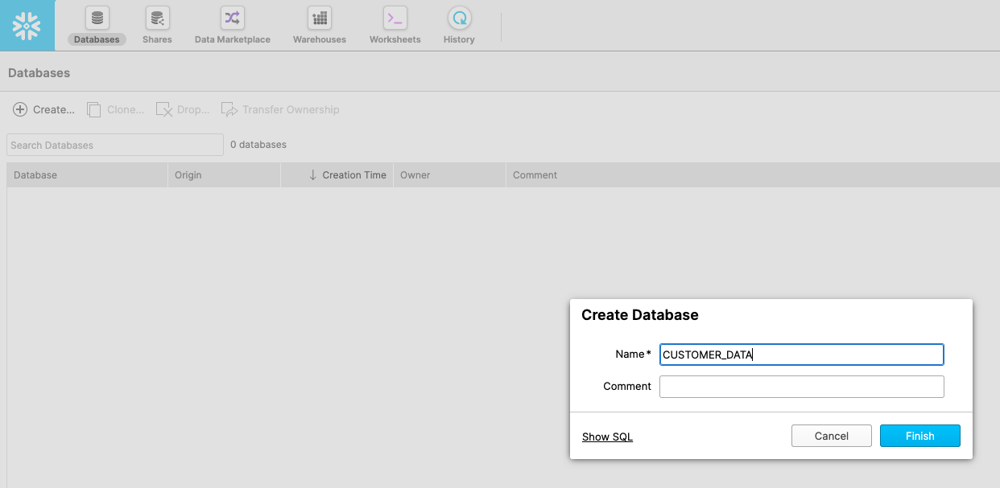
<br/><br/>

Lets navigate back to our worksheets, by clicking on the “Worksheets” icon. You should see our worksheet with all of the SQL we loaded in the prior step.


<br/><br/>

In the future you can skip this step by executing the following line of code.

```sql
CREATE OR REPLACE DATABASE customer_data;
```

We will continue to set the context for our worksheet. The Role: `SYSADMIN`, we already set earlier. Lets navigate back to the top right of the worksheet and select our Database: `CUSTOMER_DATA` and Schema: `PUBLIC`. When you create your trial account, a warehouse is automatically created for you to begin using. We can set the last context requirement, Warehouse: `COMPUTE_WH`. The main thing to note is, you might have already executed some SQL commands without a warehouse attached. So why did they work then? Because the only commands executed so far are DDL commands. These commands are free in Snowflake. Only when you start working with data does a warehouse turn on.

This lab assumes you created a trial account which automatically creates `compute_wh` for you, if you already had an account, you will need to create this warehouse to proceed with the lab. Whether you did or you didn't, feel free to run this command anyways. The `OR REPLACE` part of the command will simply replace the old warehouse object if it already existed.

```sql
CREATE OR REPLACE WAREHOUSE compute_wh WITH
  WAREHOUSE_SIZE = 'XSMALL'
  AUTO_SUSPEND = 60
  AUTO_RESUME = TRUE
  INITIALLY_SUSPENDED = TRUE;
```

Once you have re/created your warehouse, execute the following to set the rest of the worksheet context:

```sql
USE DATABASE customer_data;
USE SCHEMA public;
USE WAREHOUSE compute_wh;
```

Your full context should look as follows:

- Role: `SYSADMIN`
- Warehouse: `COMPUTE_WH(XS)`
- Database: `CUSTOMERDATA`
- Schema: `PUBLIC`


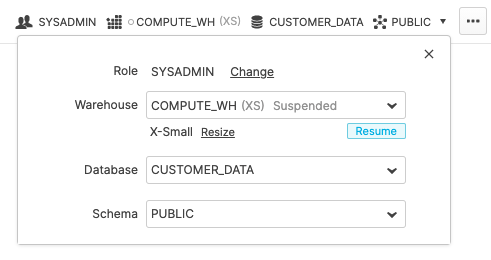

<!-- ------------------------ -->
## Creating a Snowflake Table
Duration: 5

As part of the lab, we are going to create 2 tables:
 - `TRAIN_DATA` -- The dataset that we will use to train our machine learning model
 - `SCORING_DATA` -- Out of sample data that we will use to score and validate our model

We will be using our worksheet in the "Worksheets" tab in the Snowflake UI exclusively to create the table. You should see the following block of code in your worksheet. Execute the code by highlighting or putting your cursor on the following block of code and press `Cmd/Ctrl + Enter`.

```sql
CREATE OR REPLACE TABLE train_data (
    "CUST_ID" NUMBER(38,0),
    "CHURN" BOOLEAN,
    "STATE" VARCHAR(16777216),
    "ACCOUNT_LENGTH" NUMBER(38,0),
    "AREA_CODE" NUMBER(38,0),
    "INTERNATIONAL" VARCHAR(16777216),
    "VOICEMAIL_PLAN" VARCHAR(16777216),
    "NUM_VM_MESSAGES" NUMBER(38,0),
    "TOTAL_DAY_MINS" FLOAT,
    "TOTAL_DAY_CALLS" NUMBER(38,0),
    "TOTAL_DAY_CHARGE" FLOAT,
    "TOTAL_EVE_MINS" FLOAT,
    "TOTAL_EVE_CALLS" NUMBER(38,0),
    "TOTAL_EVE_CHARGE" FLOAT,
    "TOTAL_NIGHT_MINS" FLOAT,
    "TOTAL_NIGHT_CALLS" NUMBER(38,0),
    "TOTAL_NIGHT_CHARGE" FLOAT,
    "TOTAL_INT_MINS" FLOAT,
    "TOTAL_INT_CALLS" NUMBER(38,0),
    "TOTAL_INT_CHARGE" FLOAT,
    "CUSTOMER_SERVICE_CALLS" NUMBER(38,0),
    "TARRIF_PLAN_CONDS" VARCHAR(16777216)
);
```

Verify that your table `TRAIN_DATA` has been created. At the bottom of the worksheet you should see a “Results” section which says “Table TRAIN_DATA successfully created.”

Now let’s do the same to create the `SCORING_DATA` table. Run the following:

```sql
CREATE OR REPLACE TABLE scoring_data (
    "CUST_ID" NUMBER(38,0),
    "CHURN" BOOLEAN,
    "STATE" VARCHAR(16777216),
    "ACCOUNT_LENGTH" NUMBER(38,0),
    "AREA_CODE" NUMBER(38,0),
    "INTERNATIONAL" VARCHAR(16777216),
    "VOICEMAIL_PLAN" VARCHAR(16777216),
    "NUM_VM_MESSAGES" NUMBER(38,0),
    "TOTAL_DAY_MINS" FLOAT,
    "TOTAL_DAY_CALLS" NUMBER(38,0),
    "TOTAL_DAY_CHARGE" FLOAT,
    "TOTAL_EVE_MINS" FLOAT,
    "TOTAL_EVE_CALLS" NUMBER(38,0),
    "TOTAL_EVE_CHARGE" FLOAT,
    "TOTAL_NIGHT_MINS" FLOAT,
    "TOTAL_NIGHT_CALLS" NUMBER(38,0),
    "TOTAL_NIGHT_CHARGE" FLOAT,
    "TOTAL_INT_MINS" FLOAT,
    "TOTAL_INT_CALLS" NUMBER(38,0),
    "TOTAL_INT_CHARGE" FLOAT,
    "CUSTOMER_SERVICE_CALLS" NUMBER(38,0),
    "TARRIF_PLAN_CONDS" VARCHAR(16777216)
);
```
At the top of the page, go to the “Databases” tab and then click on the `CUSTOMER_DATA` database link. You should see your newly created `TRAIN_DATA` and `SCORING_DATA` tables.

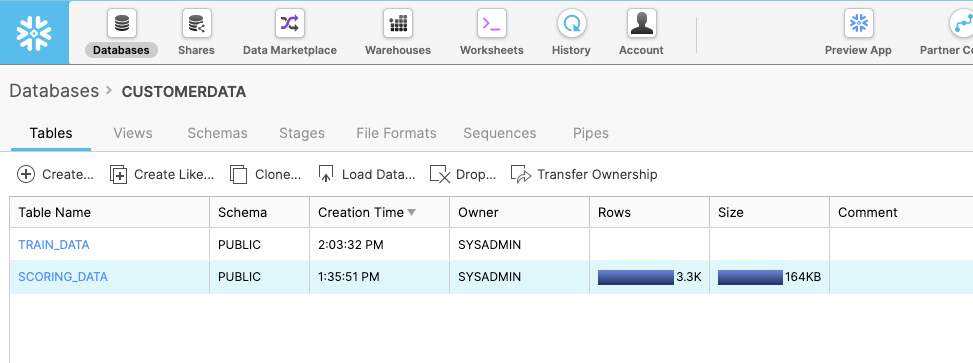
<br/><br/>

You can go one level deeper here and look at the column definitions for each table by clicking on the table names.

<!-- ------------------------ -->
## Creating a Snowflake External Stage
Duration: 5

[Stages](https://docs.snowflake.com/en/user-guide/data-load-local-file-system-create-stage.html) in snowflake are places that you can land your data before it is uploaded to a Snowflake table. You might have a batch of CSV files living on a disk driver somewhere, and, in order to start querying the data via a table, the data must be landed within the Snowflake environment for a data upload to be possible.

In the exercise, we will be working with structured, comma-delimited data that has already been staged in a public, external AWS bucket. Before we can use this data, we first need to create a "Storage Integration" that specifies the location of our external bucket.

Let’s create the storage integration object. Storage integrations are typically created by Storage Administrators, but for the purposes of this lab, YOU will be creating this object.

```sql
CREATE OR REPLACE STAGE sf_dr_stage
  URL = 's3://snowflake-workshop-lab/telecoms';
```

From the Databases tab, click on the `CUSTOMER_DATA` database, then click on “Stages” and click “Create…”

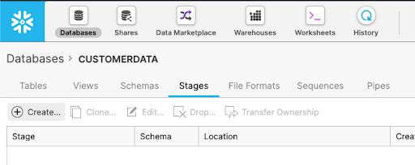
<br/><br/>

Select the option for “Existing Amazon S3 Location” and click “Next”:

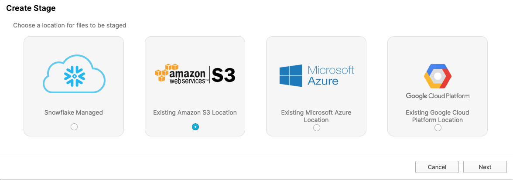
<br/><br/>

On the “Create Stage” box that appears, enter/select the following settings, then click “Finish”.
 - Name: `SF_DR_STAGE`
 - Schema Name:	`PUBLIC`
 - URL: `s3://snowflake-workshop-lab/telecoms`

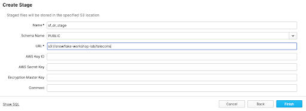
<br/><br/>

Now let’s take a look at the contents of the `sf_dr_stage`. At the top of the page, click on the “Worksheet” tab. Then execute the following statement:

```bash
ls @sf_dr_stage;
```

You should see the output in the “Results” window in the bottom pane:


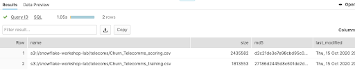

<!-- ------------------------ -->
## Creating a Snowflake File Format
Duration: 5

Before we can load the data into Snowflake, we have to create a "File Format" that matches the data structure.

```sql
CREATE OR REPLACE FILE FORMAT churndata_ff
  TYPE = 'CSV'
  COMPRESSION = 'AUTO'
  FIELD_DELIMITER = ','
  RECORD_DELIMITER = '\n'
  SKIP_HEADER = 1
  FIELD_OPTIONALLY_ENCLOSED_BY = 'NONE'
  TRIM_SPACE = FALSE
  ERROR_ON_COLUMN_COUNT_MISMATCH = TRUE
  ESCAPE = 'NONE'
  ESCAPE_UNENCLOSED_FIELD = '\134'
  DATE_FORMAT = 'AUTO'
  TIMESTAMP_FORMAT = 'AUTO'
  NULL_IF = ('\\N');
```
From the “Databases tab”, click on the `CUSTOMER_DATA` database hyperlink. Then click on “File Formats”. Then click “Create”.

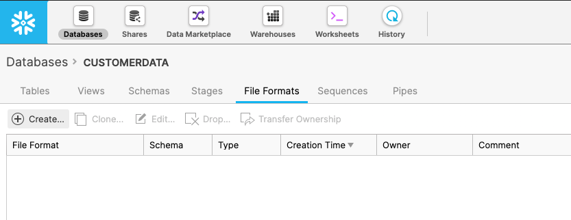
<br/><br/>

On the resulting page, we then create a file format. In the box that appears, leave all the default settings as-is but make the changes below:
 - Name: `ChurnData_ff`
 - Header lines to skip: `1`
 - Field optionally enclosed by: `Double Quote`
 - Null string: `Leave as is`

IMPORTANT: If you do not see the “Error on Column Count Mismatch” box, scroll down in the dialogue box

When you are done, the box should look like this:

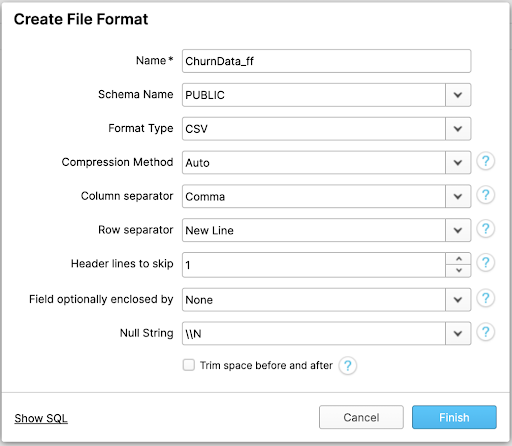
<br/><br/>

Note that you can scroll down the settings to review some more parameters:

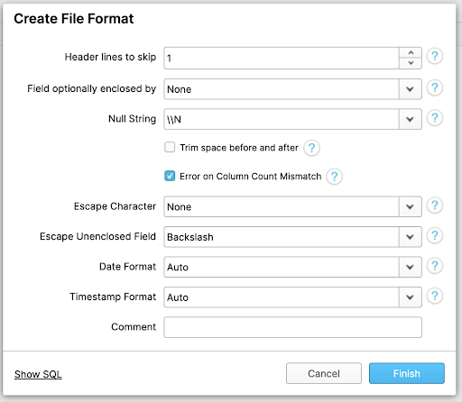
<br/><br/>

Click on the “Finish” button to create the file format.

<!-- ------------------------ -->
## Loading Data into Snowflake
Duration: 15

In this section, we will use a virtual [warehouse](https://docs.snowflake.com/en/user-guide/warehouses-overview.html) and the [COPY command](https://docs.snowflake.com/en/sql-reference/sql/copy-into-table.html) to initiate bulk loading of the CSV file sitting in our AWS external stage, moving it into the Snowflake table we just created.

Snowflake Warehouses are where the innovation of cloud computing comes to life, allowing scale across both workload dimensions. For situations in which your data size has outgrown your infrastructure, Snowflake allows you to scale up (literally make bigger) the warehouse size to meet the computational demands of your query. As the demand for your data grows, Snowflake allows you to scale out (literally add more compute workers) the number of servers to meet the concurrency demands of your increasing influx of users. This is all billed at a per-second level granularity granting you the ability to truly only pay for what you use.


<br/><br/>

Common workloads are data loading, running a query, or performing a Data Manipulation Language ([DML](https://docs.snowflake.com/en/sql-reference/sql-dml.html#general-dml)) operation. Each workload can have its own virtual warehouse so it doesn’t compete for resource with other workloads.

In section 3, when we were setting up our context, we used the default warehouse `COMPUTE_WH(XS)` that came with a trial account (or created it if we were using a different account)

Lets go ahead and instantaneously scale up the size of our warehouse to better match the size of our data. We can go from an `XSMALL` warehouse and double our available compute to a `SMALL` warehouse by running the following command.

```sql
ALTER WAREHOUSE compute_wh SET
  WAREHOUSE_SIZE = "SMALL";
```

Early when we created our warehouse, we gave it some additional parameters to consider. `AUTO_SUSPEND = 60` tells the warehouse that after a query has finished running, stay alive for exactly 1 more minute in case new queries are going to come and take advantage Snowflake's data caching abilities. 60 seconds is the MIN and can be adjusted upwards. `AUTO_RESUME = TRUE` tells the warehouse to turn back on once the user begins submitting queries to the warehouse. And lastly, `INITIALLY_SUSPENDED = TRUE` tells the warehouse to initially not turn on when the warehouse is completed. What these parameters enable is a true pay for what you consume billing pattern. With that, we can be assured that even if we walk away from the computer, we have peace of mind we aren't accruing idle compute costs.

Now we can run a COPY command to load the data into the `CUSTOMER_DATA` table we created earlier. Go ahead and execute the next set of statements in the worksheet to load the staged data into the table.

```sql
COPY INTO train_data FROM @sf_dr_stage/Churn_Telecomms_training.csv
  FILE FORMAT = (FORMAT_NAME = churndata_ff);

COPY INTO scoring_data FROM @sf_dr_stage/Churn_Telecomms_scoring.csv
  FILE FORMAT = (FORMAT_NAME = churndata_ff);
```

In the Results window, you should see the status of the load:

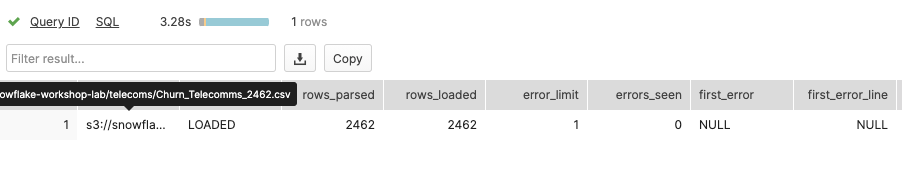
<br/><br/>

We now finally have data inside a Snowflake table that is ready to be queried on demand. We can see a sample of what data lies within our table by execute the following:

```sql
SELECT * FROM train_data LIMIT 10;
```

You should see something like this. Note we have our "CHURN" column. This will be the key column that we will go and build a supervised machine learning model on.

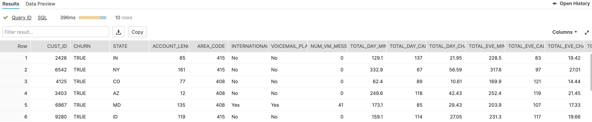

<!-- ------------------------ -->
## Connecting Snowflake with DataRobot
Duration: 10

At this point in time, we have our data sitting in an optimized table within Snowflake that is available for a variety of different downstream functions. Snowflake does not offer machine learning capabilities, and therefore, happily partners with the leading data science and machine learning partners in the industry. We are on a mission to help us figure out which of our customers are most likely to churn and DataRobot can help us build a machine learning model to answer that question.

Snowflake's Partner Connect feature allows you to seamlessly get started with partner tools and manages most of the connection details for you to get up and running as quickly as possible.

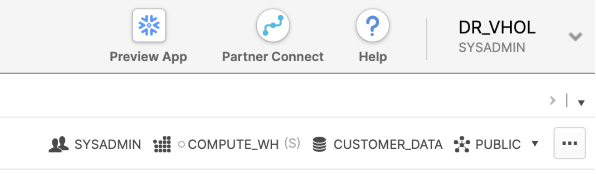
<br/><br/>

Go ahead and click on the "Partner Connect" application. This should take you to the following screen where you will see many of the Snowflake partners, and through a simple method of setting up an account and integration, allow you to quickly move data into a partner tool. You should see DataRobot near the bottom.

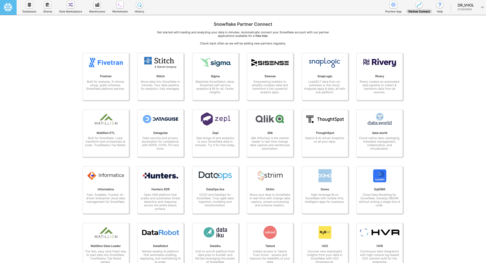
<br/><br/>

To be able to continue test out partner applications, in our case DataRobot, we need to promote ourselves to the `ACCOUNTADMIN` role. This is an out of worksheet process, and therefore isn't a command for us to run. We need to do this one manually.

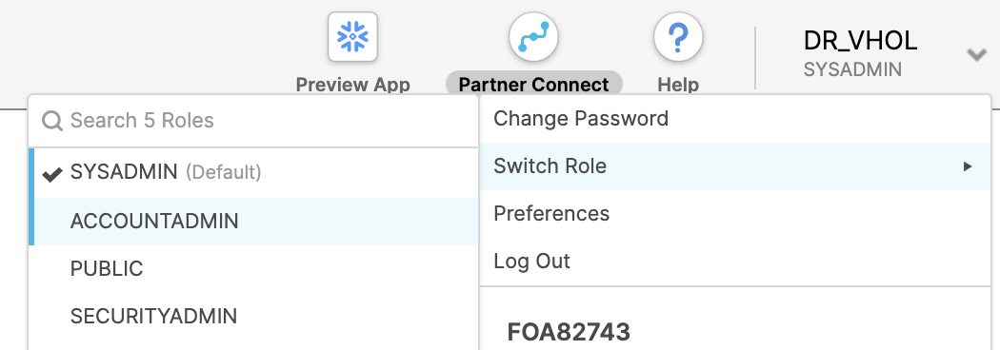
<br/><br/>

Once you have completed this step, go ahead and click on the DataRobot application. This will present you with a screen to connect to DataRobot. It will outline a number of Snowflake objects that will be auto-created. For the purposes of this lab, we have already created the snowflake objects that we will need, so you can press "Connect" .

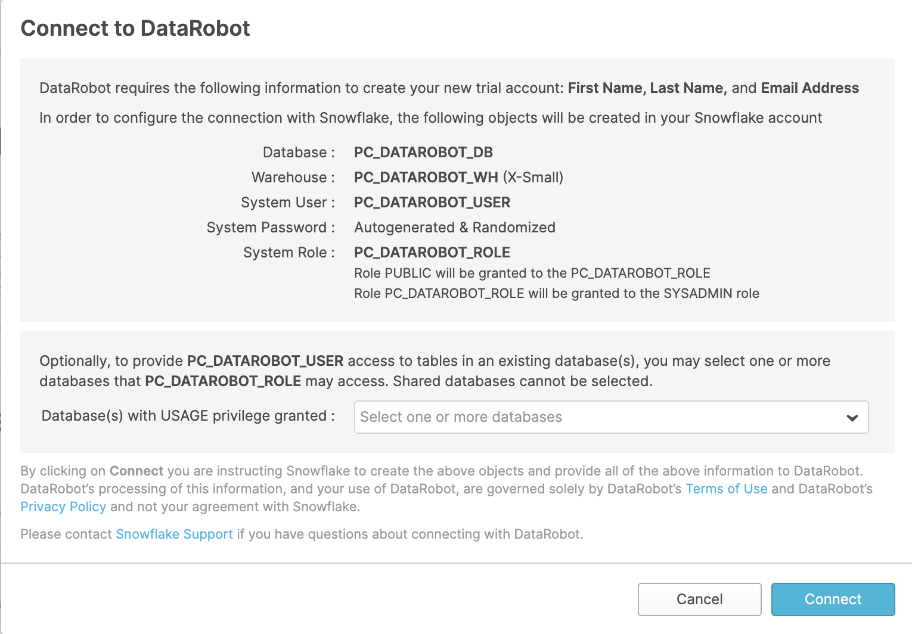
<br/><br/>

You then will be prompted to activate your account now, press the blue "activate" button to do so.

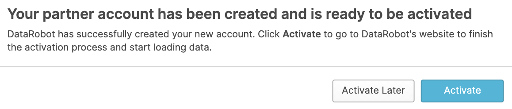

<!-- ------------------------ -->
## Getting Started with DataRobot
Duration: 10

Once you clicked the blue "activate" button, you will be redirected to the DataRobot account registration page. DataRobot is software-as-a-service (SaaS) application deployed on the cloud for your convenience, allowing you to build machine learning models without having to provision and manage any compute infrastructure. Go ahead and enter your name and password, and then click "Sign Up" for us to proceed.


<br/><br/>

The next screen will ask us a few more questions to tailor our onboarding experience. For the purposes of this lab, we are going to stick with the theme that we are a data scientist working in the telecom industry, but feel free to choose the options that you identify with best. Go ahead and choose "Data Scientist" as our role, and "Telecom" as our industry. Then hit "Next."


<br/><br/>

We are interested in developing models, so lets go ahead and choose "Create AI Models." Then hit "Start."


<br/><br/>

We will now land on the DataRobot main home page. Feel free to take a peak around. You can always get back to this screen by clicking on the "DataRobot" icon at the top left of the screen. On the top right of the screen, you will see a bunch of orange icons. On the very right, you should see the "people" icon. It will take us to a bunch of options regarding our account. The item we are interested in is "Data Connections." Go ahead and click.

<!-- ------------------------ -->
## Creating a DataRobot Data Connection
Duration: 15


<br/><br/>

Here we can see that a connection has already been connected that links our Snowflake account to our DataRobot account. We will be pulling data in from Snowflake to DataRobot via a JDBC connector. Snowflake Partner Connect enables a seamless setup, and preloads all of the parameters for data to flow smoothly. We will be creating a second connection that maps to the context we were using when in the Snowflake platform.


<br/><br/>

While we are on this screen, lets go ahead and copy the parameter in the "address" box under "Configuration." This URL should look familiar to you as it is the URL you use to navigate to your Snowflake page.

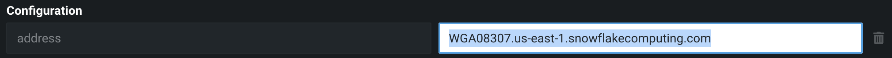
<br/><br/>

Next we can go ahead and click "Add new data connection" on the near top left hand side of the screen. Right above where you see your pre-configured data connection.


<br/><br/>

You'll then be asked to choose what type of connection you want to create. DataRobot supports connections to many types of databases. Lets go ahead and choose Snowflake.


<br/><br/>

We now will have a bunch of fields to fill in. The first is "Data connection name." I just called mine `dr_vhol` given this is a "DataRobot Virtual Hands On Lab." For the driver dropdown, go ahead and choose the latest driver currently available, 3.12.10. Next, paste the url we just copied into the "address" box. Our "db" will be `CUSTOMER_DATA` and the "warehouse" is `COMPUTE_WH`. Finally, lets go ahead and add two more parameters. By clicking the "Add parameter box," let search for the "role" parameter and set it to `SYSADMIN` and then "schema" and set it to `PUBLIC`. Click "Add data connection"


<br/><br/>

From here you will now see your new data connection. We now need to associate our Snowflake login to this connection. If we didnt, anyone with the deployment URL could use the connection string! Navigate to the "Credentials" tab at the top center of the screen.


<br/><br/>

Click "Add Credentials."


<br/><br/>

Click "Create new."


<br/><br/>

Here we will enter the "Username" and "Password" associated with our Snowflake user login that we created when we first logged into the Snowflake platform after creating a trial account. If you navigate back to your welcome email, you should be able to see the username you created in case you forgot.


<br/><br/>


<br/><br/>

<!-- ------------------------ -->
## Registering our tables in DataRobot's AI Catalog
Duration: 15

In this lab, we are going to make use of DataRobot's "AI Catalog" feature. DataRobot gives you a mechanism to keep track of all the different datasets you want to build and score models on. In order to use the Snowflake prediction application later in the walkthrough, we will need to add our data to the "AI Catalog." Found on the top left main bar, click to navigate.


<br/><br/>

We then can click the big "Add to catalog" or smaller "Add new data" button.


<br/><br/>

Given we already created our connection, we then can select "Existing Data Connection."

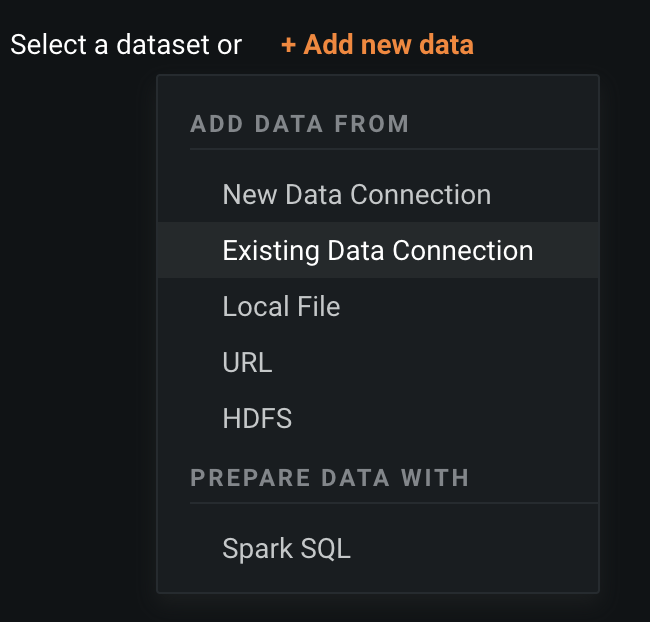
<br/><br/>

From here select our connection we want to use. I named my connection `dr_vhol`.

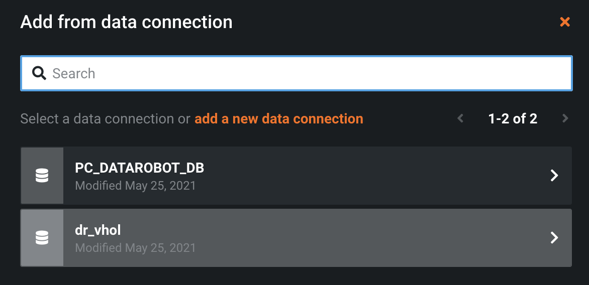
<br/><br/>

We then must choose the credentials associated with our connection, which was `drvhol` for my login.

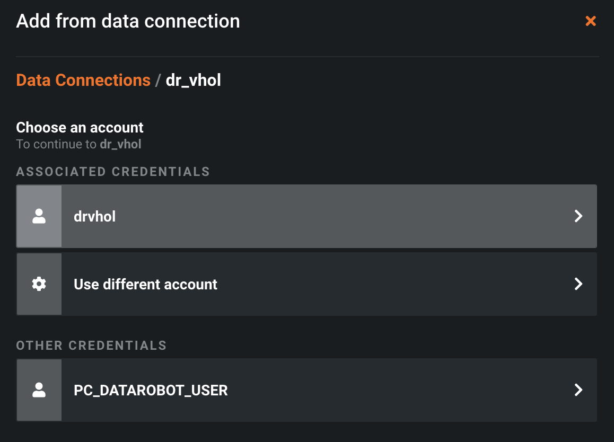
<br/><br/>

This will present use with a screen that allows us to browse our "Schemas." We already defined the schema that our connector is allowed to use: `PUBLIC`. Go ahead and click.

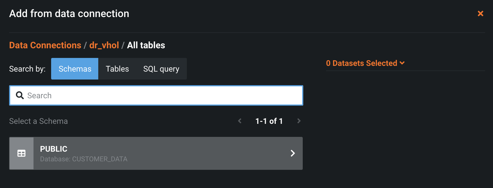
<br/><br/>

Here we will see the two tables that we have in our `CUSTOMER_DATA` database. There they are, our `TRAIN_DATA` and `SCORING_DATA` tables. Go ahead and "Select" both to prepare them for import into our catalog. Then click "Proceed with registration."

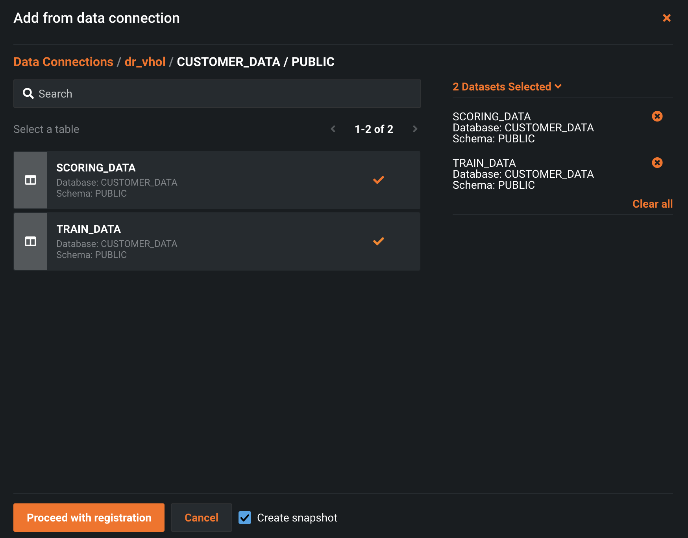
<br/><br/>

On the next page, you will see both datasets are "Registering." This is DataRobot physically retrieving the data in our tables and bringing it over to the DataRobot platform.

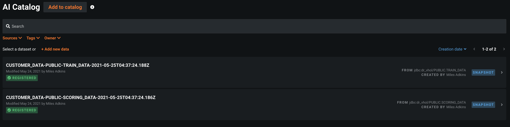
<br/><br/>

The dataset that we will want to use for modeling purposes will be the table that has "TRAIN_DATA" in the title. We can see DataRobot did a quick scan of the dataset identifying 22 features and 2,462 rows. Go ahead and click the orange "Create Project" button.

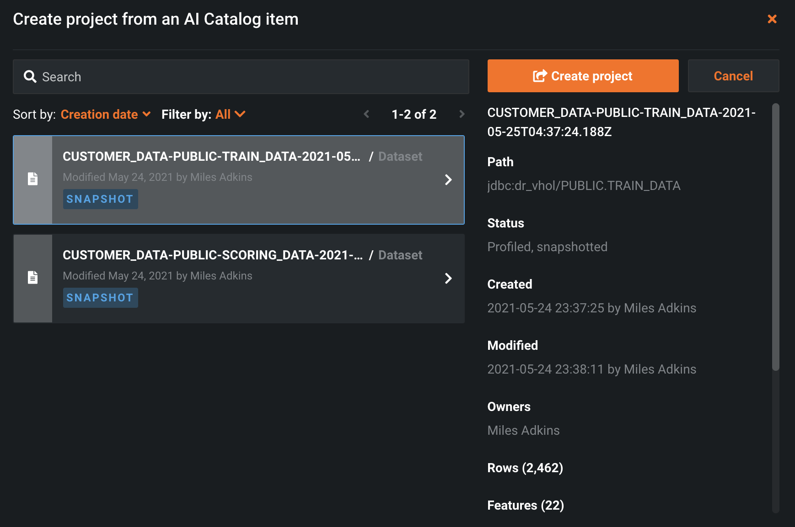
<br/><br/>

<!-- ------------------------ -->
## Setting up a DataRobot Project
Duration: 10

When we want to take some data and leave with a model to deploy, the culmination of all these steps are stored in a DataRobot "project." A new project is kicked off as soon as you load your data into the system, just like we did. When your data is upload, DataRobot then begins performing exploratory data analysis (EDA), the first step in a typical machine learning lifecycle. This is a combination of detecting the data types and showing the number of unique, missing, mean, median, standard deviation, and minimum and maximum values. This information is helpful for getting a sense of the data shape and distribution.

If we scroll down to the bottom, we can see all of the columns that were present in our raw dataset.

Click on the feature called `TOTAL_DAY_MINS` and you will see the following histogram:


<br/><br/>

Here we see user counts by bucket based on how long they talk on the phone during the day. The reason a plot like this is useful is to spot outliers, data that is far away from the main distribution. This can clue you in to whether your dataset is clean of any possible data collection errors.

Next, we can scroll back up and select a target. This is the feature that answers the question: what do you want to predict. In our case, is did customer stay or leave (CHURN), this is the feature you want the model to predict. You can type in the name of the prediction target or click "U​se as target​ next" to the name in the feature list. Upon this selection, DataRobot will analyze your target variable and automatically determine the type of machine learning problem we will be performing today (in this case, binary classification). DataRobot will also choose what optimization it thinks is best based off the distribution of our target variable.

Once you select the name of the target, you should see the following screen:


<br/><br/>

If you want to customize the model building process, you can modify a variety of advanced parameters, optimization metrics, feature lists, transformations, partitioning, and sampling options. The default modeling mode is “Autopilot”, which employs the full breadth of DataRobot’s automation capabilities. For more control over which algorithms DataRobot runs, there are manual and quick-run options.


<!-- ------------------------ -->
## Starting DataRobot Autopilot
Duration: 10

Lets get to building models automatically. Go ahead and click the “Start​” button to kick off DataRobots Autopilot process. DataRobot will continue to compute a variety of different statistics to help aid our machine learning problem. One of these steps is computing a feature's "Alternating Conditional Expectation." This is in essence an “Importance” grade that  tells you how much a given feature helps predict what you are looking to predict in an isolated fashion.


<br/><br/>

You can again drill down on features in our feature list to view distributions, but this time, with the target variable overlaid on the image. In this case, the greater the number of customer service calls, the higher the probability of that customer churning, which intuitively makes sense.


<br/><br/>


Moving over to the "Models" tab, DataRobot supports popular advanced machine learning techniques and open source tools such as Apache Spark, H2O, Scala, Python, R, TensorFlow, and XGBoost. During the automated modeling process, DataRobot analyzes the characteristics of the training data and the selected prediction target, and selects the most appropriate machine learning algorithms to apply, also known as a DataRobot "Blueprint". DataRobot blueprints is a collection of preprocessing steps plus the algorithm, and includes operations like one-hot encoding, missing value imputation, text mining, etc.

DataRobot streamlines model development, in a leaderboard type fashion, by automatically ranking models (or ensembles of models) based on the techniques advanced data scientists use, including boosting, bagging, random forests, kernel-based methods, generalized linear models, deep learning, and many others. By cost-effectively evaluating a near-infinite combination of data transformations, features, algorithms, and tuning parameters in parallel across a large cluster of servers, DataRobot delivers the best predictive model in the shortest amount of time.

And of course, recommends a model for deployment.


<br/><br/>

<!-- ------------------------ -->
## Evaluating the "Recommended For Deployment" Model
Duration: 10

To start evaluating our model that was the most optimal given our chosen optimization metric, we can click on the model which will present use with the following options: Evaluate, Understand, Describe, and Predict (​additional tabs may be present based on extra features that are enabled).

Click on "Evaluate". The “Evaluate” option includes: Lift Chart, ROC Curve (for classification models), Confusion Matrix, Feature Fit, and Advanced Tuning.

The "Lift Chart" depicts quite plaining how well the model is able to predict the target. If the blue "Predicted" line is flat, that means the model doesn't really do a good job of differentiation between people who are likely to stay vs people who are going to leave. If the line has some slope it, this indicates that there is some predictive power in our features you have chosen to model on. In our case, we can see that the blue line pops up as the likelihood of someone leaving pops.


<br/><br/>

The ROC Curve tab helps to explore classification, performance, and statistics related to the selected model at any point on the probability scale. What that means is, at what probability of someone leaving do we raise an alarm? 30% chance? 50% chance? By play with different scenarios, we let get to see the outcomes of different scenarios. This tab contains a set of interactive graphical displays that include an ROC curve, a prediction distribution, cumulative charts, and a confusion matrix. There is also a display of summary statistics that describe model performance at the selected threshold. Each of these components combine to provide an interactive snapshot of the behavior of a model's classification power.


<br/><br/>

DataRobot offers superior transparency, interpretability, and explainability to help you better understand how models were built and give you the confidence to explain to others why a model made the predictions it did. If we go back and click the “D​escribe”​ tab, you can view the end-to-end model blueprint containing details of the specific feature engineering tasks and algorithms DataRobot used to run the model.


<br/><br/>

In the “U​nderstand”​ tab, popular exploratory capabilities include Feature Impact, Feature Effects, Prediction Explanations, and Word Cloud (depending on the features in the dataset). These all help enlighten you on what drives a model’s predictions.

“Feature Impact” measures how much each feature contributes to the overall accuracy of the model. For this example, we can see that the most impactful reason a person is likely to stay as a customer or leave is the number of `CUSTOMER_SERVICE_CALLS`. The real question is, now how do we go reduce that number :) so that less people leave. This is just another way to take information from the machine learning lifecycle to add value to a business.


<br/><br/>

The “Feature Effects” chart displays model details on a per-feature basis (a feature's effect on the overall prediction). This gives you insight into understanding the relationship between each variable and the target. The insight is communicated in terms of partial dependence, which illustrates how a change in a feature's value, while keeping all other features as they were, impacts a model's predictions. Here we can see that once the number of `CUSTOMER_SERVICE_CALLS` goes above 3, the likelihood of the customer leaving rapidly increases.


<br/><br/>

“Prediction Explanations” reveal the reasons why DataRobot generated a particular prediction for a certain data point. This gives you can ammunition to back up decisions with specific details. They provide a quantitative indicator of a variable's effect on an individual prediction.


<br/><br/>

Lastly, DataRobot’s "Insights" tab at the top provides more graphical representations of your model. There are tree-based variable rankings, hotspots, variable effects to illustrate the magnitude and direction of a feature's effect on a model's predictions, text mining charts, anomaly detection, and a word cloud of keyword relevancy.


<br/><br/>


<!-- ------------------------ -->
## Deploying our model and using Job Defintions with Snowflake
Duration: 10		

Every model built in DataRobot is immediately ready for deployment. And there a several methods of scoring new data against this Deployment

You can: upload a new dataset to be scored in batch, create a REST API endpoint to score data directly from applications, export the model for in-place database scoring, or use a partner integration. Today we will use the Job Definitions feature.

If you click the number in the "Prediction Threshold" box, you can see a few different easy options to set your threshold. Again, at what probability do we say, "Yes this person is going to churn." Choose "Maximize F1". Then click on the “Deploy Model” button.


<br/><br/>

Here we are presented with a bunch of options to tweak our deployment. Scroll down to the main section "Association ID." Here we want to type in `CUST_ID`. This is going to allow use to track predictions by customer when we go to monitor our model.

Then go ahead and toggle the "Require association ID in prediction requests" and the 4 other option all under "Data Drift.""


<br/><br/>

Scroll back up. We will see all of our boxes are green. Click "Create Deployment"


<br/><br/>

This will present us with a screen to give a priority setting to this deployment. We can skip and click "Create deployment." This may take a couple of minutes to create the deployment.


<br/><br/>

And now we have one active deployment. Go ahead and click on it again.


<br/><br/>

Go to the "Predictions" tab then "Job Definitions" tab and click on "+Add job definition".


<br/><br/>

We will start setting up our job definition. Click on "Prediction Source" dropdown and select "AI Catalog" under "Other Connections". You should see the two tables we uploaded to the "AI Catalog." Go ahead and choose the dataset that has "SCORING_DATA" in the name. Hit "Use this dataset".


<br/><br/>

The "Prediction Source" is now complete. You can adjust the prediction options if needed, for this walkthrough we're going to stick with the defaults.


<br/><br/>

The last section to complete is the "Prediction Destination". Go ahead and leave the Destination Type as "JDBC", and click "+ Define Connection".


<br/><br/>

You can choose the same connection that we created in [Creating a DataRobot Data Connection](#9) or add a new connection in the modal that appears. Once you've done that, select the Schema that you want to write the predictions to.


<br/><br/>

You can now select an existing table, or you can create a new table. We recommend creating a new table, as this will let DataRobot create the table with the proper features, and assign the correct data type to each feature.


<br/><br/>

Go ahead and click “Create a table” and select the Schema where you want your table, then enter a table name to write your predictions to. 


<br/><br/>

Click “Save Connection”. Your Job Definition should look similar to the image below.

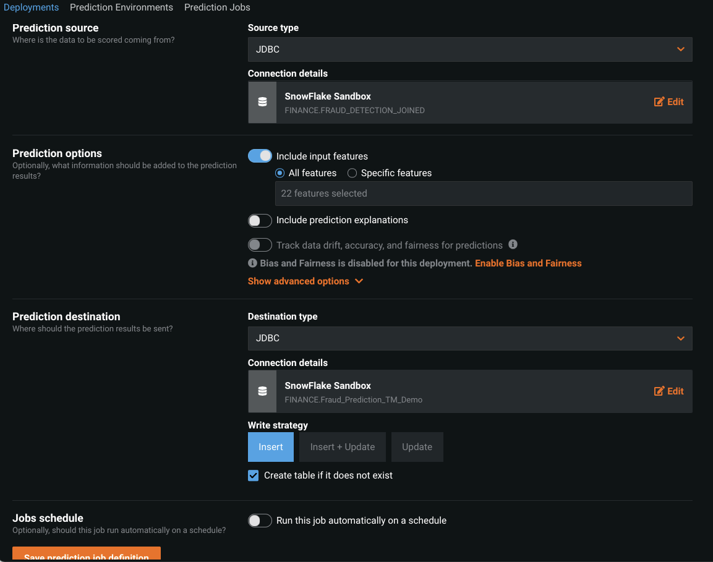
<br/><br/>

At the bottom you can schedule this job to run on a Schedule, or just run it manually. Go ahead and click "Save Prediction job definition" in the bottom left, then click on "View all Job Definitions" in the upper left. Click the hamburger icon on the right side of the job definition you just made, and click "Run now". 


<br/><br/>

If you click the hamburger icon again and go to “View job history” you can see its status. Once it's finished you should see the green “Succeeded” message under status.


<br/><br/>

We can now finally head back to our Snowflake tab. If you hit the refresh icon near the top left of our screen by your databases, you should see the `SCORED_DATA` table that was created once we kicked off our prediction job. If you click "Preview Data," you will see our data with two new columns showing the likelihood that each person is likely to churn or stay.


<br/><br/>

And as they say, that is all folks!
