author: miles.adkins@snowflake.com
id: automl_with_snowflake_and_datarobot
summary: This lab will walk you through how to use Snowflake and DataRobot to perform supervised machine learning.
categories: Getting Started
environments: web
status: Published
feedback link: https://github.com/Snowflake-Labs/sfguides/issues
tags: DataRobot, AutoML, Partner Connect, Databases, Tables, Stages, File Formats

# Accelerating Machine Learning with Snowflake and DataRobot

<!-- ------------------------ -->
## Use Case Overview
Duration: 5

This guide will take you through the process of performing supervised machine learning by building a binary classification model to help predict whether a customer is likely to churn (that is, no longer be our customer).

Supervised machine learning is the process of taking a historical dataset with KNOWN outcomes of what we would like to predict, to train a model, that can be used to make future predictions.

The historical dataset we will be working with today is taken from a fictitious telecommunications company, and contains details about a customers plan usage, spend patterns, issues logged with customer support, geographical information, and a binary value (hence binary classification) indicating whether that person ended their contract with the company (churned). Here is a snippet of the data:
<br/><br/>
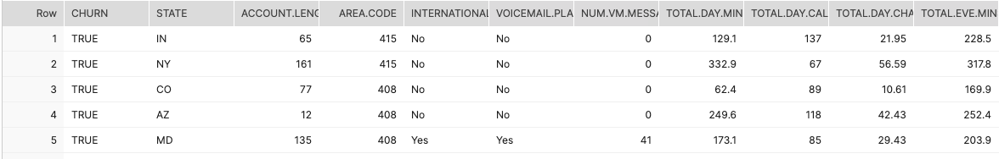
<br/><br/>
Throughout this process, you will discover the ease at which it is possible to build and deploy machine learning models by leveraging the scale and performance of Snowflake and the automation of the DataRobot platform.

To showcase the full lifecycle of a deploying machine learning model, we will first load in Snowflake, our data cloud where all of our data lives. Then, we will leverage the DataRobot auto-pilot process to perform exploratory data analysis, and then train, evaluate, and interpret a slew of potential machine learning models. And finally, use the Snowflake-DataRobot prediction integration to score our model against new data, as if the model was in production.
### Prerequisites
- Basic knowledge of SQL, and database concepts and objects
- Basic understanding of data science and machine learning

### What You'll Learn
- How to create and utilize databases, tables, views, and warehouses
- Load structured data into Snowflake
- Use Snowflake’s “Partner Connect” to seamlessly create a DataRobot trial
- Automatically create, run, and evaluate prediction models in DataRobot
- Write results to Snowflake

### What You’ll Need
- A [Snowflake](https://signup.snowflake.com/) Account (if you are using an enterprise account through your organization, it is unlikely that you will have the privileges to use the `ACCOUNTADMIN` role, which is required for this lab).

### What You’ll Build
- Snowflake objects, including tables and warehouses, to scale and manage your data
- Over 50+ machine learning models automatically to measure their performance and interpret
- A prediction pipeline to automate scoring new data on your deployed model

<!-- ------------------------ -->
## Setting up Snowflake
Duration: 5

The first thing you will need to do is download the following .sql file that contains a series of SQL commands we will execute throughout this lab.

<button>
  [Download .sql File](https://snowflake-workshop-lab.s3.amazonaws.com/Snowflake_Datarobot_VHOL_guides.sql)
</button>
<br/><br/>

At this point, log into your Snowflake account and open a new `Worksheet`. If you have just created a free trial account, you will land in the `Learn` section. Simply navaigate to the `Worksheets` tab on the left and click `+ Worksheet` in the top right hand corner.


<br/><br/>

To ingest our script in the Snowflake UI, click the down arrow next to the time your notebook was created in the top left hand side of your screen and load our `Snowflake_Datarobot_VHOL_guies.sql` script using the `Import SQL from File` button. You can also change the name of this worksheet to "Snowflake-DataRobot VHOL Summit 2022"

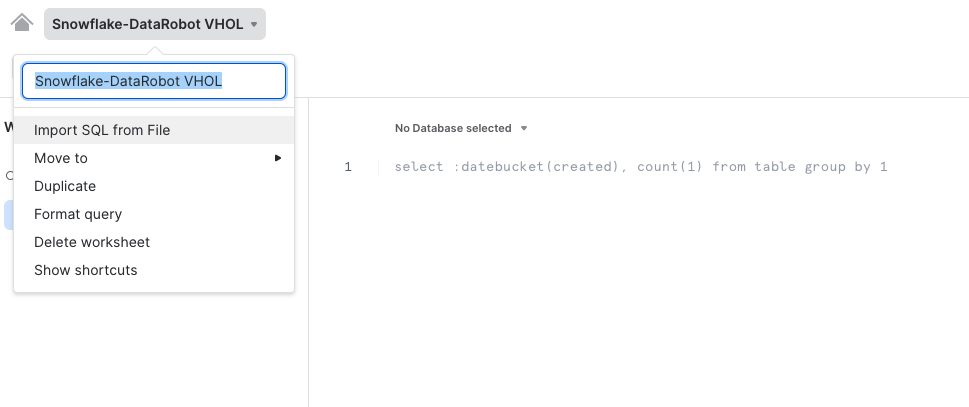
<br/><br/>

Snowflake provides "worksheets" as the spot for you to execute your code. For each worksheet you create, you will need to set the “context” so the worksheet knows how to behave. A “context” in Snowflake is made up of 4 distinctions that must be set before we can perform any work: the “role” we want to act as, the “database” and “schema” we want to work with, and the “warehouse” we want to perform the work.

Lets go ahead and set the role we want to act as, which will be `ACCOUNTADMIN` to begin with. This can either be done manually in the UI or programmatically in a worksheet (`ACCOUNTADMIN` is the default role for a first time user). Lets do so programmatically in our worksheet by executing our first line of code:

```sql
USE ROLE accountadmin;
```

To execute this code, all we need to do is place our cursor on the line we wish to run and then either hit the "run" button at the top left of the worksheet or press `Cmd/Ctrl + Enter`.

 In addition to traditional SQL statements, Snowflake Data Definition ([DDL](https://docs.snowflake.com/en/sql-reference/sql-ddl-summary.html)) commands, such as setting the worksheet context, can also be written and executed within the worksheet.

Each step throughout the guide has an associated SQL command to perform the work we are looking to execute, and so feel free to step through each action running the code line by line as we walk through the lab.

<!-- ------------------------ -->
## Creating a Snowflake Database
Duration 10:

To get started, we are going to create our first Snowflake object and `CREATE` a database called `CUSTOMER_DATA` that will be used for loading the structured data for our current example. To get back to our main navigation menu, simply click on the `HOME` button at the top left hand side of the worksheet.

From here, click on the "Data" tab and click `+ Database`, to create a new database object. Every Snowflake trial provides you with two default databases, which is why you already see database objects on your list.

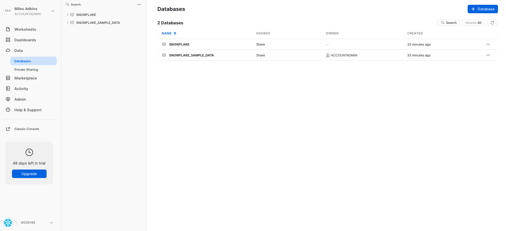
<br/><br/>

Enter `CUSTOMER_DATA` in the "Name" section, and click "Create".

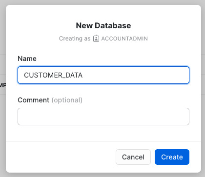
<br/><br/>

You should now see your new databases add to the list. Lets navigate back to our `Snowflake-DataRobot VHOL Summit 2022` worksheet. You should see our worksheet with all of the SQL we loaded in the prior step. In the future you can skip this step by executing the following line of code:

```sql
CREATE OR REPLACE DATABASE customer_data;
```

We will continue to set the context for our worksheet. The "role": `ACCOUNTADMIN`, we already set earlier. To set our "database", "schema", and "warehouse", execute the following code:

```sql
CREATE OR REPLACE WAREHOUSE compute_wh WITH
  WAREHOUSE_SIZE = 'XSMALL'
  AUTO_SUSPEND = 60
  AUTO_RESUME = TRUE
  INITIALLY_SUSPENDED = TRUE;


USE DATABASE customer_data;
USE SCHEMA public;
USE WAREHOUSE compute_wh;
```

One thing to note is, we already have already executed some SQL commands without a warehouse attached. So why did they work then? Because the only commands executed so far are DDL commands. These commands are free in Snowflake. Only when you start working with data does a warehouse turn on.

Continuing, trial accounts automatically come with `COMPUTE_WH` created for you. If you already had an account that you are using for this lab, you probably didn't have this warehouse anymore. Whether you did or you didn't have this warehouse, the `OR REPLACE` part of the `CREATE OR REPLACE WAREHOUSE compute_wh` command will simply replace the old warehouse object if it already existed.

<!-- ------------------------ -->
## Creating a Snowflake Table
Duration: 5

As part of the lab, we are going to create 2 tables:
 - `TRAIN_DATA` -- The dataset that we will use to train our machine learning model
 - `SCORING_DATA` -- Out of sample data that we will use to score and validate our model

We will be using our worksheet exclusively to create the table. You should see the following block of code in your worksheet. Execute the code by highlighting or putting your cursor on the following block of code and press `Cmd/Ctrl + Enter`.

```sql
CREATE OR REPLACE TABLE train_data (
    "CUST_ID" NUMBER(38,0),
    "CHURN" BOOLEAN,
    "STATE" VARCHAR(16777216),
    "ACCOUNT_LENGTH" NUMBER(38,0),
    "AREA_CODE" NUMBER(38,0),
    "INTERNATIONAL" VARCHAR(16777216),
    "VOICEMAIL_PLAN" VARCHAR(16777216),
    "NUM_VM_MESSAGES" NUMBER(38,0),
    "TOTAL_DAY_MINS" FLOAT,
    "TOTAL_DAY_CALLS" NUMBER(38,0),
    "TOTAL_DAY_CHARGE" FLOAT,
    "TOTAL_EVE_MINS" FLOAT,
    "TOTAL_EVE_CALLS" NUMBER(38,0),
    "TOTAL_EVE_CHARGE" FLOAT,
    "TOTAL_NIGHT_MINS" FLOAT,
    "TOTAL_NIGHT_CALLS" NUMBER(38,0),
    "TOTAL_NIGHT_CHARGE" FLOAT,
    "TOTAL_INT_MINS" FLOAT,
    "TOTAL_INT_CALLS" NUMBER(38,0),
    "TOTAL_INT_CHARGE" FLOAT,
    "CUSTOMER_SERVICE_CALLS" NUMBER(38,0),
    "TARRIF_PLAN_CONDS" VARCHAR(16777216)
);
```

Verify that your table `TRAIN_DATA` has been created. At the bottom of the worksheet you should see a “Results” section which says “Table TRAIN_DATA successfully created.”

Now let’s do the same to create the `SCORING_DATA` table. Run the following:

```sql
CREATE OR REPLACE TABLE scoring_data (
    "CUST_ID" NUMBER(38,0),
    "CHURN" BOOLEAN,
    "STATE" VARCHAR(16777216),
    "ACCOUNT_LENGTH" NUMBER(38,0),
    "AREA_CODE" NUMBER(38,0),
    "INTERNATIONAL" VARCHAR(16777216),
    "VOICEMAIL_PLAN" VARCHAR(16777216),
    "NUM_VM_MESSAGES" NUMBER(38,0),
    "TOTAL_DAY_MINS" FLOAT,
    "TOTAL_DAY_CALLS" NUMBER(38,0),
    "TOTAL_DAY_CHARGE" FLOAT,
    "TOTAL_EVE_MINS" FLOAT,
    "TOTAL_EVE_CALLS" NUMBER(38,0),
    "TOTAL_EVE_CHARGE" FLOAT,
    "TOTAL_NIGHT_MINS" FLOAT,
    "TOTAL_NIGHT_CALLS" NUMBER(38,0),
    "TOTAL_NIGHT_CHARGE" FLOAT,
    "TOTAL_INT_MINS" FLOAT,
    "TOTAL_INT_CALLS" NUMBER(38,0),
    "TOTAL_INT_CHARGE" FLOAT,
    "CUSTOMER_SERVICE_CALLS" NUMBER(38,0),
    "TARRIF_PLAN_CONDS" VARCHAR(16777216)
);
```
At the top of the worksheet, go click on the "home" tab, click on the "data" tab, click on the  `CUSTOMER_DATA` database, click on the `PUBLIC` schema, and click on "Tables". You should see your newly created `TRAIN_DATA` and `SCORING_DATA` tables.

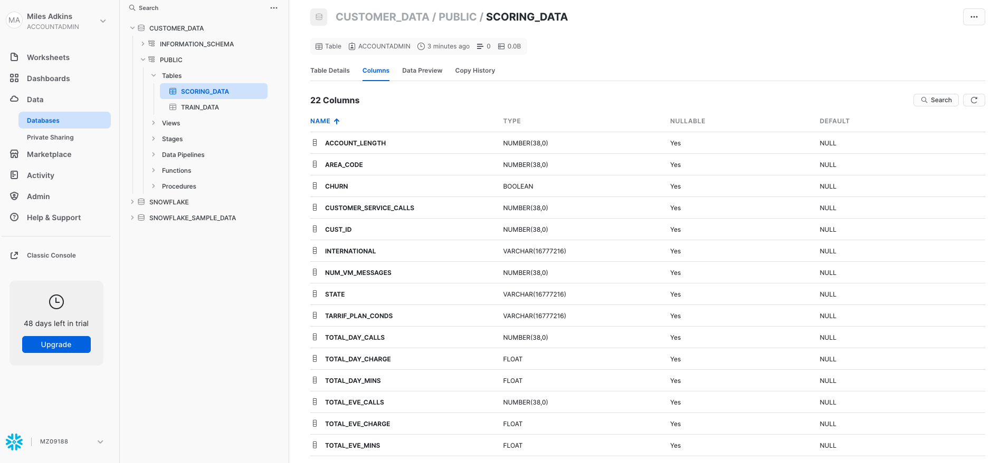
<br/><br/>

You can go one level deeper here and look at the column definitions for each table by clicking on the table name and then "Columns".

<!-- ------------------------ -->
## Creating a Snowflake External Stage
Duration: 5

[Stages](https://docs.snowflake.com/en/user-guide/data-load-local-file-system-create-stage.html) in snowflake are places that you can land your data before it is uploaded to a Snowflake table. You might have a batch of CSV files living on a disk driver somewhere, and, in order to start querying the data via a table, the data must be landed within the Snowflake environment for a data upload to be possible.

In the exercise, we will be working with structured, comma-delimited data that has already been staged in a public, external AWS bucket. Before we can use this data, we first need to create a `Stage` that specifies the location of our external bucket.

Let’s create the "stage" object. "Stages" are typically created by Storage Administrators, but for the purposes of this lab, YOU will be creating this object. Again, lets click back on "Worksheets" tab  on the left hand side and find our way back to our `Snowflake-DataRobot VHOL Summit 2022` worksheet, and excute the next following lines of code:

```sql
CREATE OR REPLACE STAGE sf_dr_stage
  URL = 's3://snowflake-workshop-lab/telecoms';
```

We also can take a look at the contents of the `sf_dr_stage` by executing the follow:

```bash
ls @sf_dr_stage;
```

You should see the output in the “Results” window in the bottom pane:

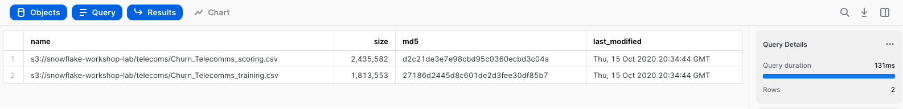

Here is the two csv files we will be using for our example project today.

<!-- ------------------------ -->
## Creating a Snowflake File Format
Duration: 5

[File Formats](https://docs.snowflake.com/en/sql-reference/sql/create-file-format.html) tell Snowflake the structure of the data coming in. The last thing that we need to do before we can load the data into our Snowflake tables is: we have to create a `File Format` that matches the data structure of the local files we want to upload. As smart as Snowflake is, its not THAT smart.

For our example, our data has header columns in the CSV, so we want to skip those. A comma delimiter is the default way to delimit CSV files (hence the name), but sometimes you can choose another character. We need to give Snowflake all the details on how we have organized our data in the files we want to load in. Please execute the following code:

```sql
CREATE OR REPLACE FILE FORMAT churndata_ff
  TYPE = 'CSV'
  COMPRESSION = 'AUTO'
  FIELD_DELIMITER = ','
  RECORD_DELIMITER = '\n'
  SKIP_HEADER = 1
  FIELD_OPTIONALLY_ENCLOSED_BY = 'NONE'
  TRIM_SPACE = FALSE
  ERROR_ON_COLUMN_COUNT_MISMATCH = TRUE
  ESCAPE = 'NONE'
  ESCAPE_UNENCLOSED_FIELD = '\134'
  DATE_FORMAT = 'AUTO'
  TIMESTAMP_FORMAT = 'AUTO'
  NULL_IF = ('\\N');
```

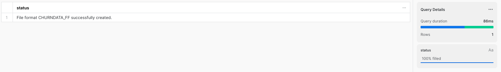

<!-- ------------------------ -->
## Loading Data into Snowflake
Duration: 15

In this section, we will use a virtual [warehouse](https://docs.snowflake.com/en/user-guide/warehouses-overview.html) and the [COPY command](https://docs.snowflake.com/en/sql-reference/sql/copy-into-table.html) to initiate bulk loading of the CSV file sitting in our AWS external stage, moving it into the Snowflake table we just created.

Snowflake Warehouses are where the innovation of cloud computing comes to life, allowing scale across both workload dimensions. For situations in which your data size has outgrown your infrastructure, Snowflake allows you to scale up (literally make bigger) the warehouse size to meet the computational demands of your query. As the demand for your data grows, Snowflake allows you to scale out (literally add more compute workers) the number of servers to meet the concurrency demands of your increasing influx of users. This is all billed at a per-second level granularity granting you the ability to truly only pay for what you use.

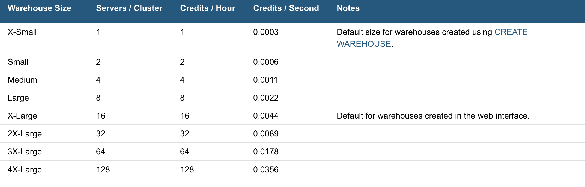
<br/><br/>

Common workloads are data loading, running a query, or performing a Data Manipulation Language ([DML](https://docs.snowflake.com/en/sql-reference/sql-dml.html#general-dml)) operation. Each workload can have its own virtual warehouse so it doesn’t compete for resource with other workloads.

In section 3, when we were setting up our context, we used the default warehouse `COMPUTE_WH(XS)` that came with a trial account (or created it if we were using a different account)

Lets go ahead and instantaneously scale up the size of our warehouse to better match the size of our data. We can go from an `XSMALL` warehouse and double our available compute to a `SMALL` warehouse by running the following command:

```sql
ALTER WAREHOUSE compute_wh SET
  WAREHOUSE_SIZE = "SMALL";
```

Early when we created our warehouse, we gave it some additional parameters to consider. `AUTO_SUSPEND = 60` tells the warehouse that after a query has finished running, stay alive for exactly 1 more minute in case new queries are going to come and take advantage Snowflake's data caching abilities. 60 seconds is the MIN and can be adjusted upwards. `AUTO_RESUME = TRUE` tells the warehouse to turn back on once the user begins submitting queries to the warehouse. And lastly, `INITIALLY_SUSPENDED = TRUE` tells the warehouse to initially not turn on when the warehouse is completed. What these parameters enable is a true pay for what you consume billing pattern. With that, we can be assured that even if we walk away from the computer, we have peace of mind we aren't accruing idle compute costs.

Now we can run a COPY command to load the data into the `CUSTOMER_DATA` table we created earlier. Go ahead and execute the next set of statements in the worksheet to load the staged data into the table:

```sql
COPY INTO train_data FROM @sf_dr_stage/Churn_Telecomms_training.csv
  FILE FORMAT = (FORMAT_NAME = churndata_ff);

COPY INTO scoring_data FROM @sf_dr_stage/Churn_Telecomms_scoring.csv
  FILE FORMAT = (FORMAT_NAME = churndata_ff);
```

In the Results window, you should see the status of the load:

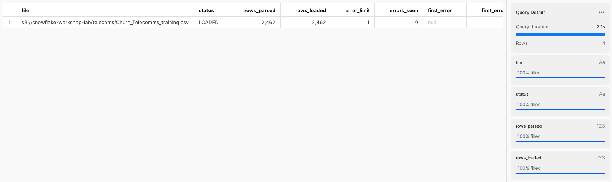
<br/><br/>

We now finally have data inside a Snowflake table that is ready to be queried on demand. We can see a sample of what data lies within our table by execute the following:

```sql
SELECT * FROM train_data LIMIT 10;
```

You should see something like this. Note we have our `HURN` column. This will be the key column that we will go and build a supervised machine learning model on.

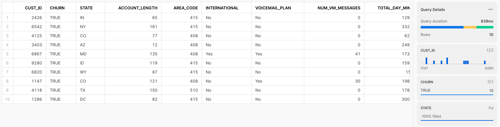

<!-- ------------------------ -->
## Connecting Snowflake with DataRobot
Duration: 10

At this point in time, we have our data sitting in an optimized table within Snowflake that is available for a variety of different downstream functions. Snowflake does not offer machine learning capabilities, and therefore, happily partners with the leading data science and machine learning partners in the industry. We are on a mission to help us figure out which of our customers are most likely to churn and DataRobot can help us build a machine learning model to answer that question.

Snowflake's Partner Connect feature allows you to seamlessly get started with partner tools and manages most of the connection details for you to get up and running as quickly as possible. To get here, click our "Home" button and then navigate to "Admin" and then "Partner Connect". This should take you to the following screen where you will see many of the Snowflake partners, and through a simple method of setting up an account and integration, allow you to quickly move data into a partner tool. Click the "Data Science & ML" category and click "DataRobot".

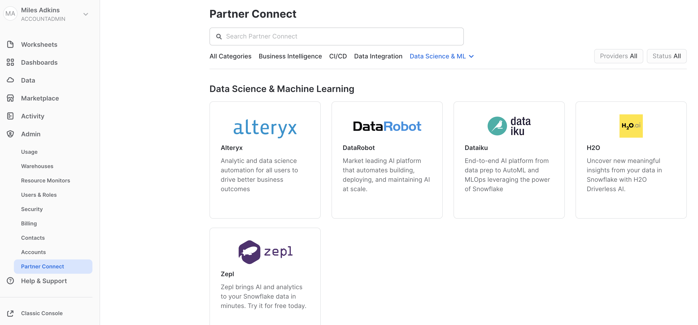
<br/><br/>

We have all the Snowflake objects we need created already, so press "Connect".

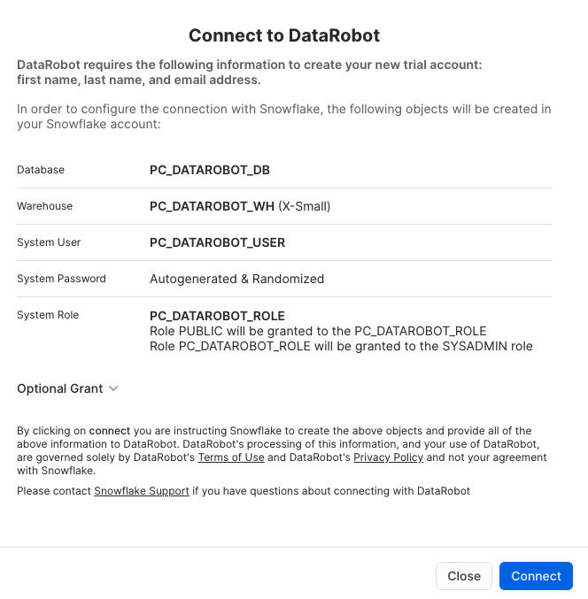

<!-- ------------------------ -->
## Getting Started with DataRobot
Duration: 10

Go to your email, and verify your account, you will be redirected to the DataRobot account registration page.

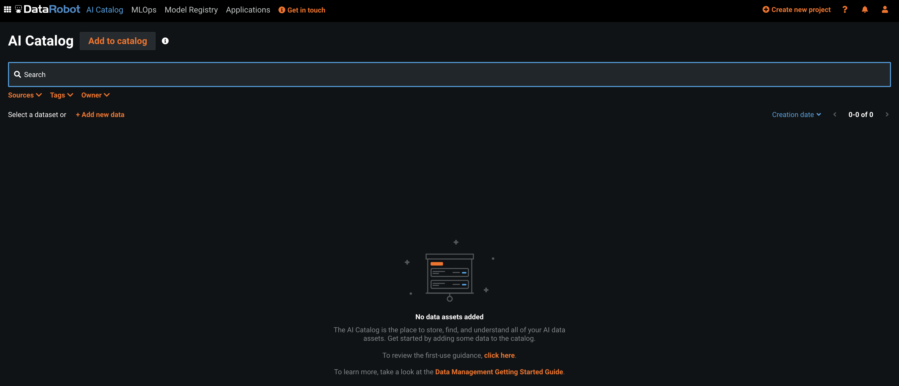

DataRobot is software-as-a-service (SaaS) application deployed on the cloud for your convenience, allowing you to build machine learning models without having to provision and manage any compute infrastructure. Go ahead and enter your name and password, and then click "Sign Up" for us to proceed.

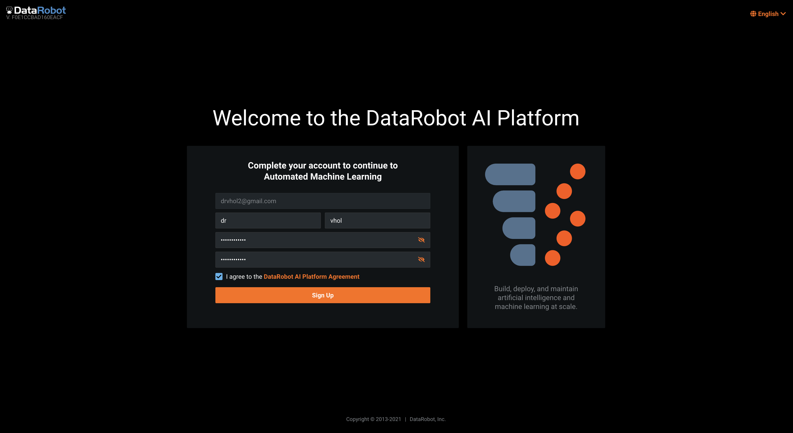
<br/><br/>

The next screen will ask us a few more questions to tailor our onboarding experience. For the purposes of this lab, we are going to stick with the theme that we are a data scientist working in the telecom industry, but feel free to choose the options that you identify with best. Go ahead and choose "Data Scientist" as our role, and "Telecom" as our industry. Then hit "Next."

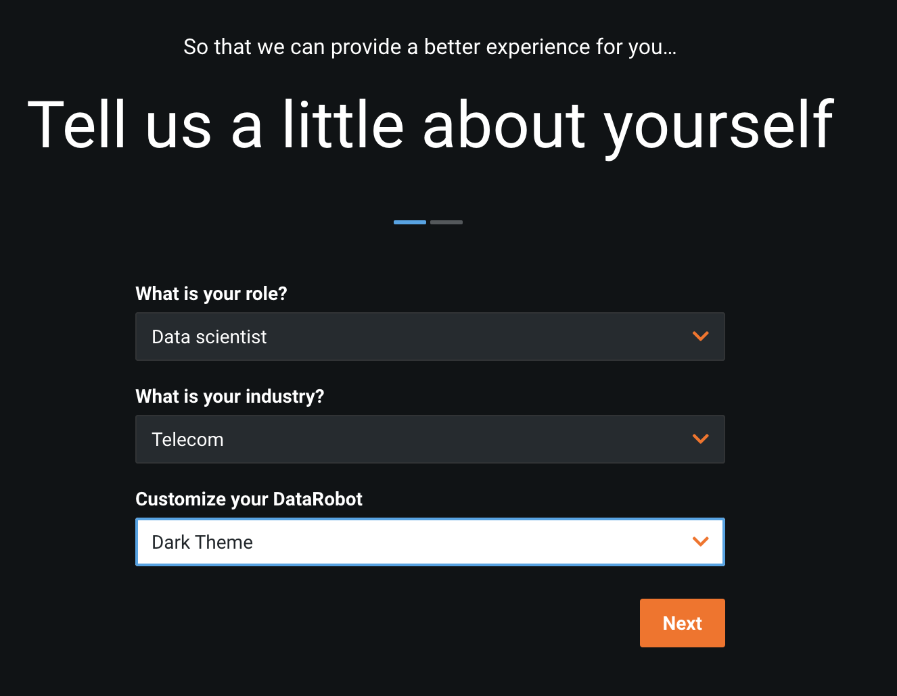
<br/><br/>

We are interested in developing models, so lets go ahead and choose "Create AI Models." Then hit "Start."

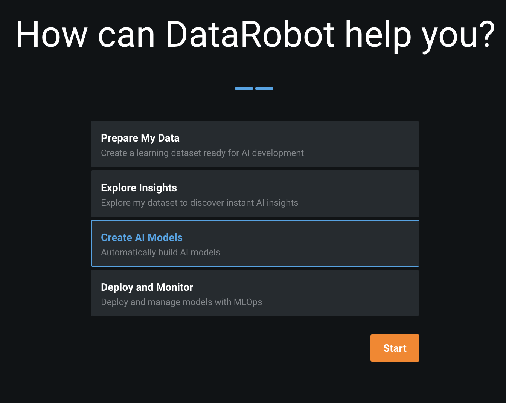
<br/><br/>

We will now land on the DataRobot main home page. Feel free to take a peak around. You can always get back to this screen by clicking on the "DataRobot" icon at the top left of the screen. On the top right of the screen, you will see a bunch of orange icons. On the very right, you should see the "people" icon. It will take us to a bunch of options regarding our account.

<!-- ------------------------ -->
## Creating a DataRobot Data Connection
Duration: 15

To start a new ML project - on the top right click on the button '+ Create new project' 

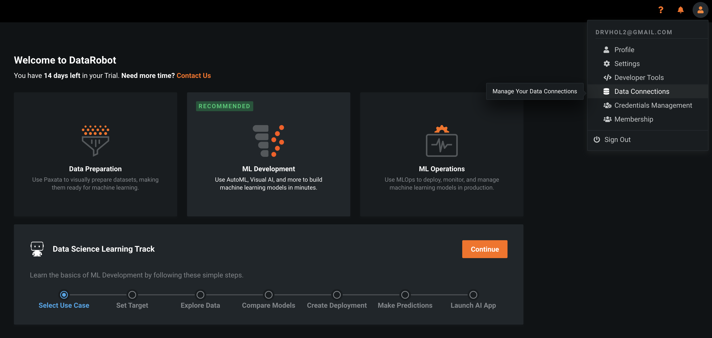
<br/><br/>

To import the data for the ML project click the button 'Data Source' - We will be creating the connection that maps to the context we were using when in the Snowflake platform.

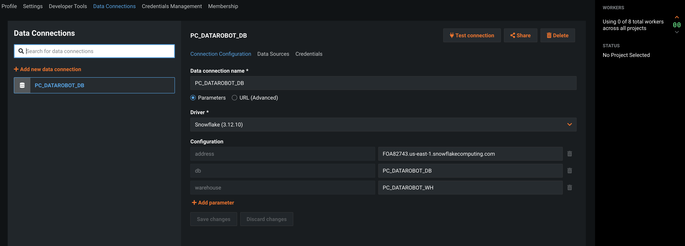
<br/><br/>

Next we can go ahead and click "Add new data connection" on the near top left hand side of the screen. Right above where you see your pre-configured data connection.

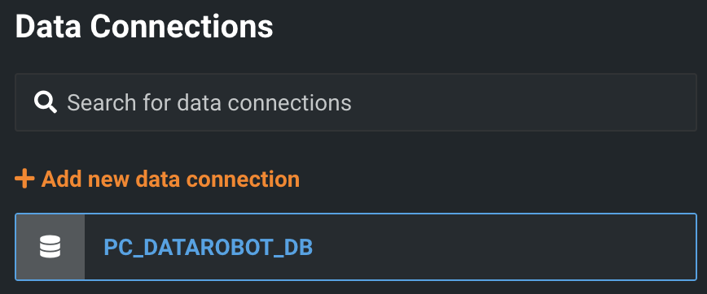
<br/><br/>

You'll then be asked to choose what type of connection you want to create. DataRobot supports connections to many types of databases. Lets go ahead and choose Snowflake.

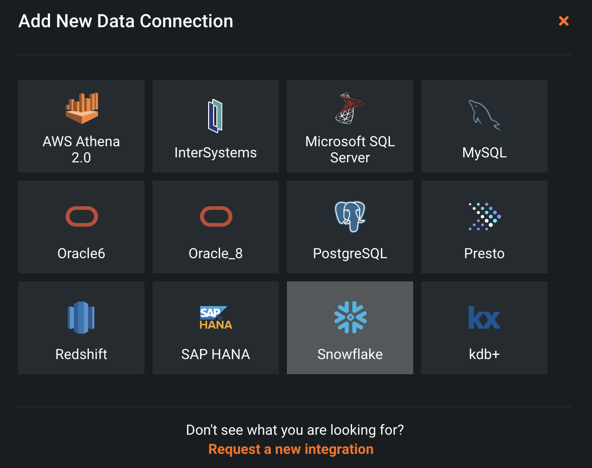
<br/><br/>

We now will have a bunch of fields to fill in. The first is "Data connection name." I just called mine `Snowflake HOL` given this is a "Snowflake DataRobot Hands On Lab." For the driver dropdown, go ahead and choose the recommanded one Next, paste the url we just copied into the "address" box (without the 'http://'). Our "db" will be `CUSTOMER_DATA` and the "warehouse" is `COMPUTE_WH`. Finally, lets go ahead and add two more parameters. By clicking the "Add parameter box," let search for the "role" parameter and set it to `ACCOUNTADMIN` and then "schema" and set it to `PUBLIC`. Click "Add data connection"

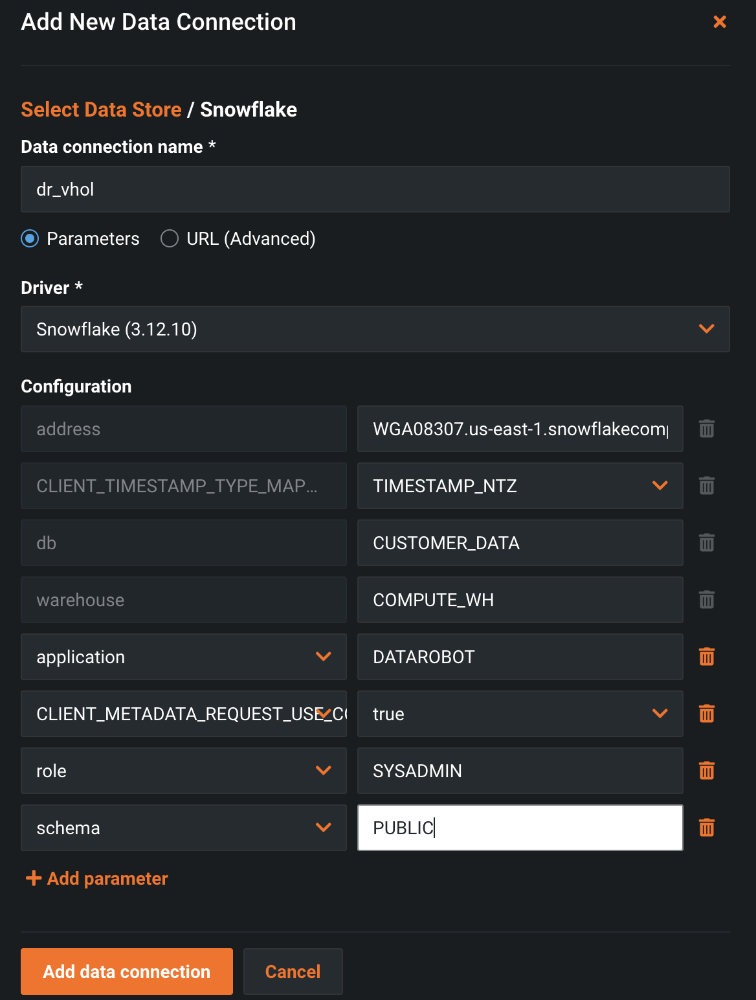
<br/><br/>

From here you will now see your new data connection. We now need to associate our Snowflake login to this connection. If we didnt, anyone with the deployment URL could use the connection string!

Choose 'Basic' and enter your credentials - user name and password and click 'Save and sign in'

Once the connection succeeded click on 'Add new data source'

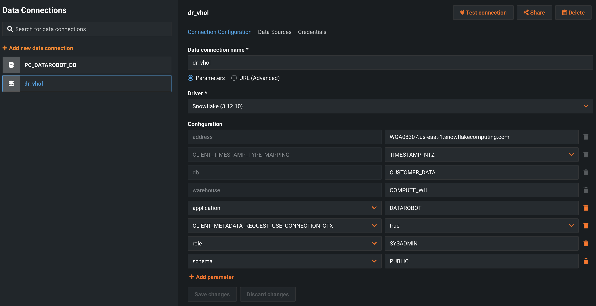
<br/><br/>

Once the connection succeeded click on 'Add new data source'

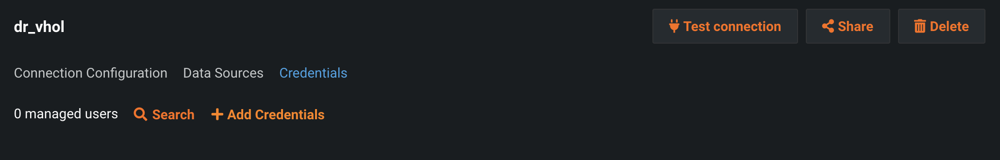
<br/><br/>

On the Search by: choose Tables and type 'train' - you will see the table 'TRAIN_DATA', select this table and click 'Create project'

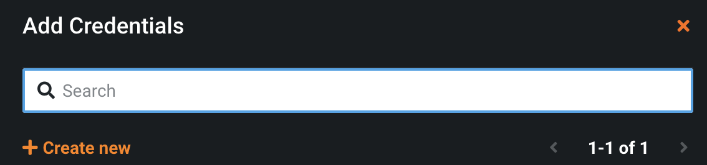
<br/><br/>

<!-- ------------------------ -->
## Setting up a DataRobot Project
Duration: 10

When we want to take some data and leave with a model to deploy, the culmination of all these steps are stored in a DataRobot "project." A new project is kicked off as soon as you load your data into the system, just like we did. When your data is upload, DataRobot then begins performing exploratory data analysis (EDA), the first step in a typical machine learning lifecycle. This is a combination of detecting the data types and showing the number of unique, missing, mean, median, standard deviation, and minimum and maximum values. This information is helpful for getting a sense of the data shape and distribution.


If we scroll down we can see that automated data quality check:

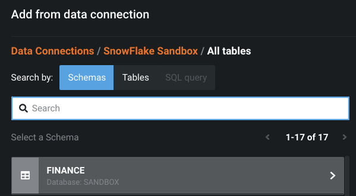
<br/><br/>

And underneath, we can see all of the columns that were present in our raw dataset.

Click on the feature called `TOTAL_DAY_MINS` and you will see the following histogram:

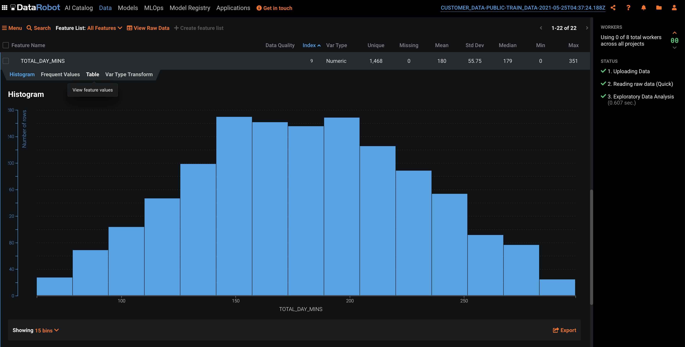
<br/><br/>

Here we see user counts by bucket based on how long they talk on the phone during the day. The reason a plot like this is useful is to spot outliers, data that is far away from the main distribution. This can clue you in to whether your dataset is clean of any possible data collection errors.

Next, we can scroll back up and select a target. This is the feature that answers the question: what do you want to predict. In our case, is did customer stay or leave (CHURN), this is the feature you want the model to predict. You can type in the name of the prediction target or click "U​se as target​ next" to the name in the feature list. Upon this selection, DataRobot will analyze your target variable and automatically determine the type of machine learning problem we will be performing today (in this case, binary classification). DataRobot will also choose what optimization it thinks is best based off the distribution of our target variable.

Once you select the name of the target, you should see the following screen:

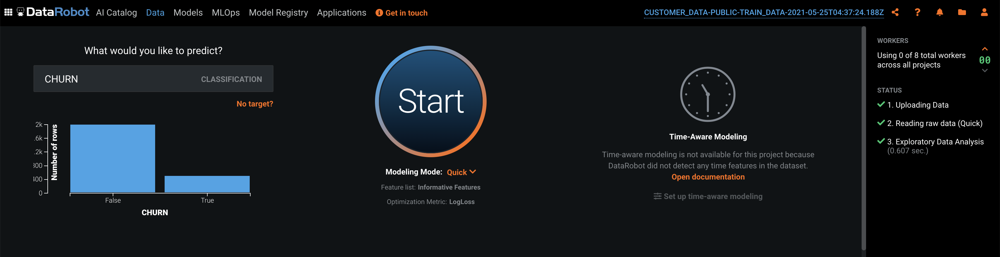
<br/><br/>

If you want to customize the model building process, you can modify a variety of advanced parameters, optimization metrics, feature lists, transformations, partitioning, and sampling options. The default modeling mode is “Quick”. For more control over which algorithms DataRobot runs, there are manual, Autopilot and comprehensive options.


<!-- ------------------------ -->
## Starting DataRobot Quick Autopilot
Duration: 10

Lets get to building models automatically. Go ahead and click the “Start​” button to kick off DataRobots Autopilot process. DataRobot will continue to compute a variety of different statistics to help aid our machine learning problem. One of these steps is computing a feature's "Alternating Conditional Expectation." This is in essence an “Importance” grade that  tells you how much a given feature helps predict what you are looking to predict in an isolated fashion.

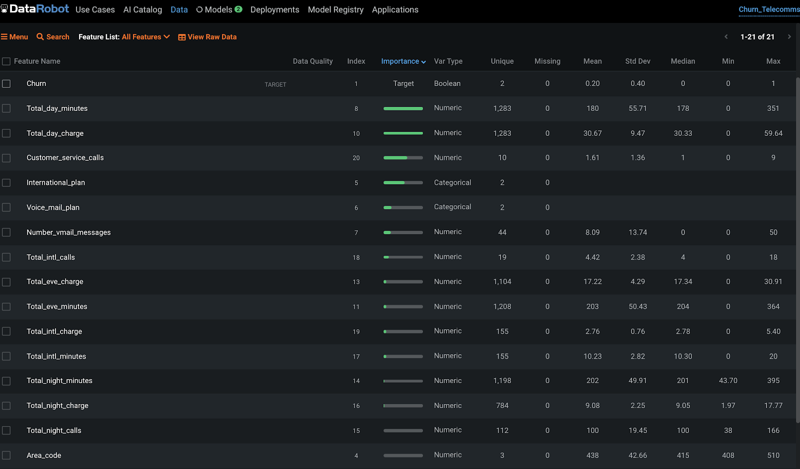
<br/><br/>

You can again drill down on features in our feature list to view distributions, but this time, with the target variable overlaid on the image. In this case, the greater the number of customer service calls, the higher the probability of that customer churning, which intuitively makes sense.

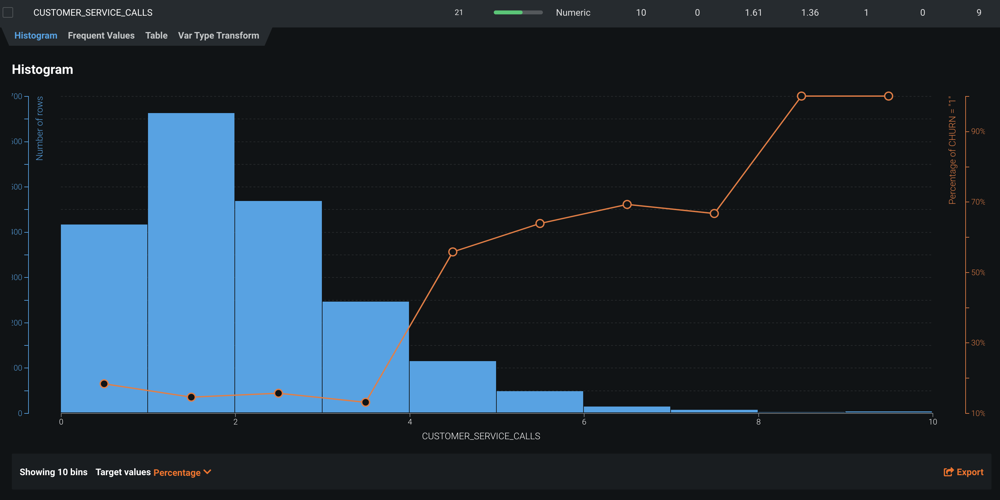
<br/><br/>


Moving over to the "Models" tab, DataRobot supports popular open source software frameworks, including software available in programming languages like Python and R and libraries such as XGBoost and more. During the automated modeling process, DataRobot analyzes the characteristics of the training data and the selected prediction target, and selects the most appropriate machine learning algorithms to apply, also known as a DataRobot "Blueprint". DataRobot blueprints is a collection of preprocessing steps plus the algorithm, and includes operations like one-hot encoding, missing value imputation, text mining, etc.

DataRobot streamlines model development, in a leaderboard type fashion, by automatically ranking models (or ensembles of models) based on the techniques advanced data scientists use, including boosting, bagging, random forests, kernel-based methods, generalized linear models, deep learning, and many others. By cost-effectively evaluating a near-infinite combination of data transformations, features, algorithms, and tuning parameters in parallel across a large cluster of servers, DataRobot delivers the best predictive model in the shortest amount of time.

And of course, recommends a model for deployment.

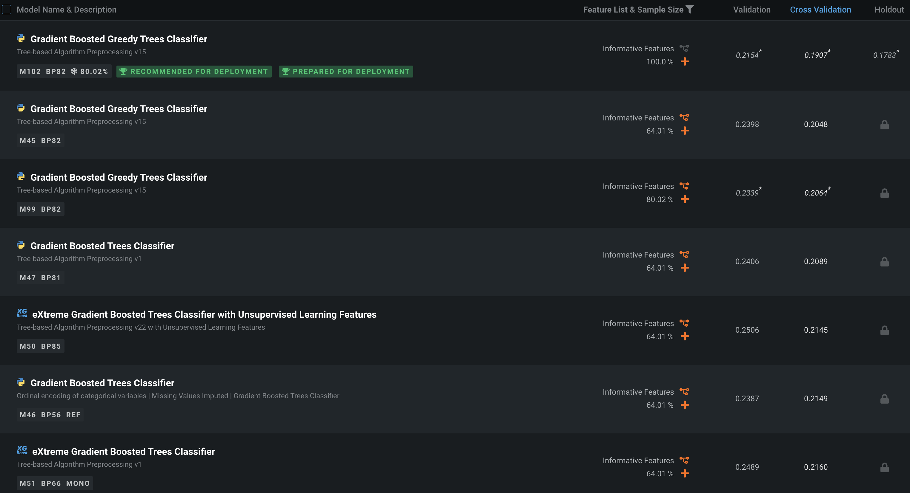
<br/><br/>

Let's take a 7 min break, and when we come back, we will analyze the results.
<!-- ------------------------ -->
## Evaluating the "Recommended For Deployment" Model
Duration: 10

Let's 'star' the first model in the leadeboard. This is the model that was the most optimal given our chosen optimization metric. Let's star it. To start evaluating it, we can click on the model which will present use with the following options: Evaluate, Understand, Describe, and Predict (​additional tabs may be present based on extra features that are enabled).

Before we deep dive on each tab let's go to the Understand tab > Feature Effects and click 'Compute Feature Effects'

DataRobot offers superior transparency, interpretability, and explainability to help you better understand how models were built and give you the confidence to explain to others why a model made the predictions it did. If we go back and click the “D​escribe”​ tab, you can view the end-to-end model blueprint containing details of the specific feature engineering tasks and algorithms DataRobot used to run the model. In addition to an automated compliance report (In non trial accounts)

In non trial accounts this flow can be customized - Composable ML provides a full-flexibility approach to model building, allowing you to direct your data science and subject matter expertise to the models you build. With Composable ML, you build blueprints that best suit your needs using built-in tasks and custom Python/R code.


<br/><br/>

Click on "Evaluate". The “Evaluate” option includes: Lift Chart, ROC Curve (for classification models), Confusion Matrix, Feature Fit, and Advanced Tuning.

The Lift Chart depicts how well a model segments the target population and how capable it is of predicting the target, letting you visualize the model's effectiveness. Looking at the Lift Chart, the left side of the curve indicates where the model predicted a low score on one section of the population while the right side of the curve indicates where the model predicted a high score. In general, the steeper the actual line is, and the more closely the predicted line matches the actual line, the better the model is. A consistently increasing line is another good indicator.

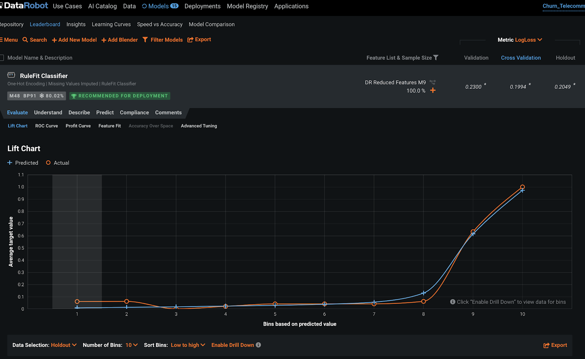
<br/><br/>

The ROC Curve tab helps to explore classification, performance, and statistics related to the selected model at any point on the probability scale. What that means is, at what probability of someone leaving do we raise an alarm? 30% chance? 50% chance? By play with different scenarios, we let get to see the outcomes of different scenarios. This tab contains a set of interactive graphical displays that include an ROC curve, a prediction distribution, cumulative charts, and a confusion matrix. There is also a display of summary statistics that describe model performance at the selected threshold. Each of these components combine to provide an interactive snapshot of the behavior of a model's classification power.

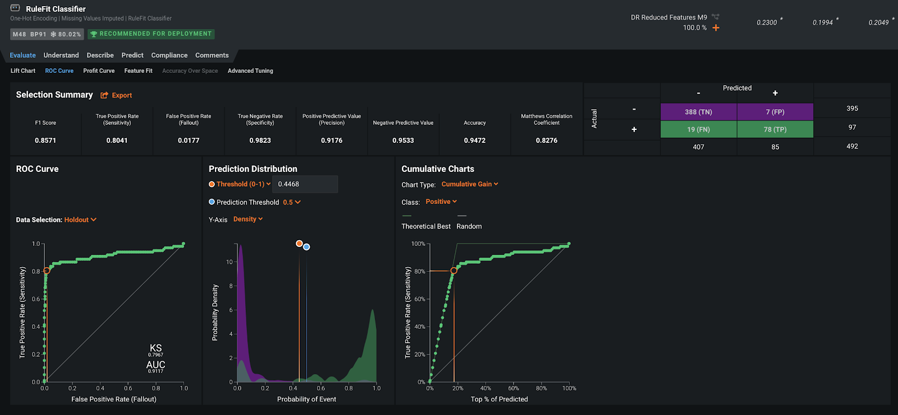
<br/><br/>


In the “U​nderstand”​ tab, popular exploratory capabilities include Feature Impact, Feature Effects, Prediction Explanations, and Word Cloud (depending on the features in the dataset). These all help enlighten you on what drives a model’s predictions.

DataRobot uses permutation importance to estimate feature impact. “Feature Impact” measures how much each feature contributes to the overall accuracy of the model. For this example, we can see that the most impactful reason a person is likely to stay as a customer or leave is the number of `CUSTOMER_SERVICE_CALLS`. The real question is, now how do we go reduce that number :) so that less people leave. This is just another way to take information from the machine learning lifecycle to add value to a business.


<br/><br/>

The “Feature Effects” chart displays model details on a per-feature basis (a feature's effect on the overall prediction). This gives you insight into understanding the relationship between each variable and the target. The insight is communicated in terms of partial dependence, which illustrates how a change in a feature's value, while keeping all other features as they were, impacts a model's predictions. Here we can see that once the number of `CUSTOMER_SERVICE_CALLS` goes above 3, the likelihood of the customer leaving rapidly increases.

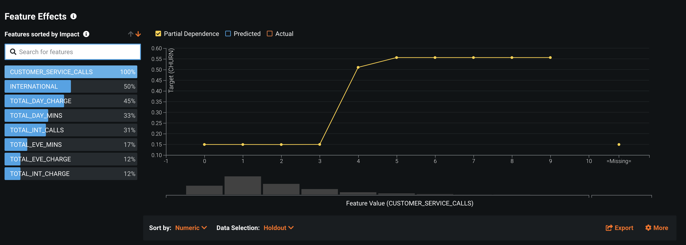
<br/><br/>

“Prediction Explanations” reveal the reasons why DataRobot generated a particular prediction for a certain data point. This gives you can ammunition to back up decisions with specific details. They provide a quantitative indicator of a variable's effect on an individual prediction.

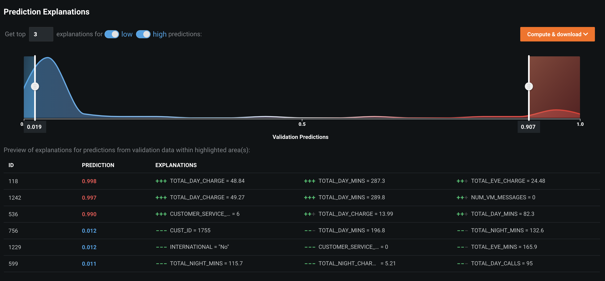
<br/><br/>

Lastly, DataRobot’s "Insights" tab at the top provides more graphical representations of your model. There are tree-based variable rankings, hotspots, variable effects to illustrate the magnitude and direction of a feature's effect on a model's predictions, text mining charts, anomaly detection, and a word cloud of keyword relevancy.

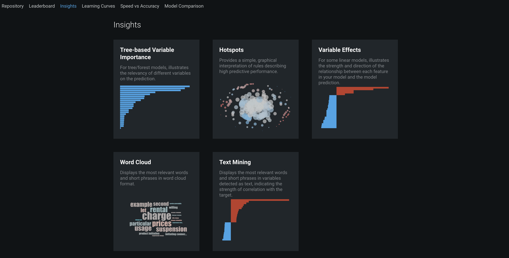
<br/><br/>


<!-- ------------------------ -->
## Deploying our model and using Job Defintions with Snowflake
Duration: 10		

Every model built in DataRobot is immediately ready for deployment. And there a several methods of scoring new data against this Deployment

You can: upload a new dataset to be scored in batch, create a REST API endpoint to score data directly from applications, export the model for in-place database scoring, or use a partner integration. Today we will use the Job Definitions feature.

If you click the number in the "Prediction Threshold" box, you can see a few different easy options to set your threshold. Again, at what probability do we say, "Yes this person is going to churn." Choose "Maximize F1". Then click on the “Deploy Model” button.

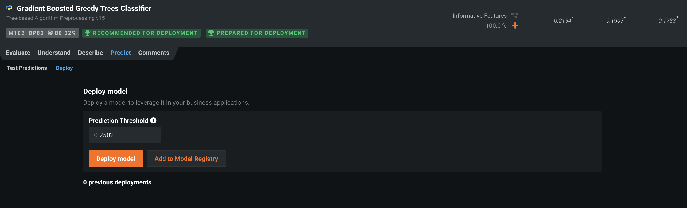
<br/><br/>

Here we are presented with a bunch of options to tweak our deployment.
The model can be deploy to any prediction server - even deploy to Snowflake

Scroll down to the main section "Association ID." Here we want to type in `CUST_ID`. This is going to allow use to track predictions by customer when we go to monitor our model.

Then go ahead and toggle the "Require association ID in prediction requests" and the 4 other option all under "Data Drift.""

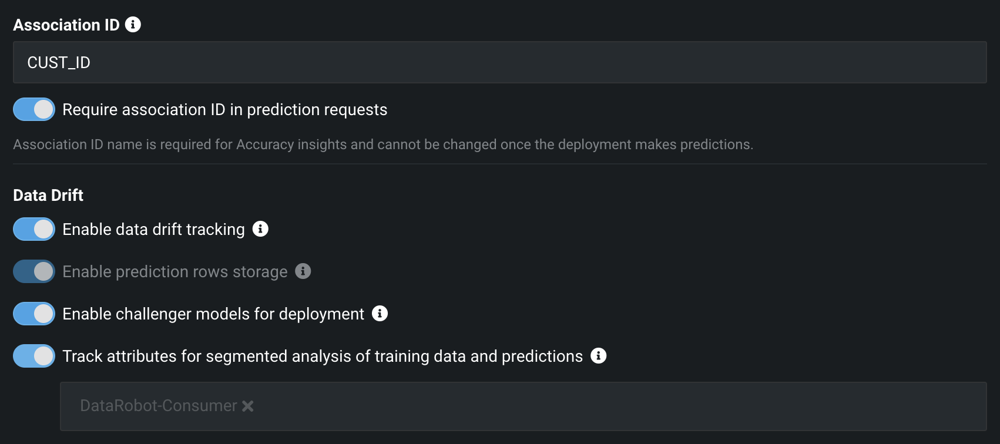
<br/><br/>

Scroll back up. We will see all of our boxes are green except for 'Continuous AI'
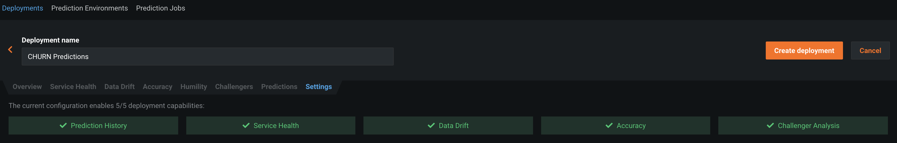
<br/><br/>

To maintain model performance after deployment without extensive manual work, DataRobot provides an automatic retraining capability for deployments. (we won't test it today)

Click "Create Deployment"

This will present us with a screen to give a priority setting to this deployment. We can skip and click "Create deployment." This may take a couple of minutes to create the deployment.

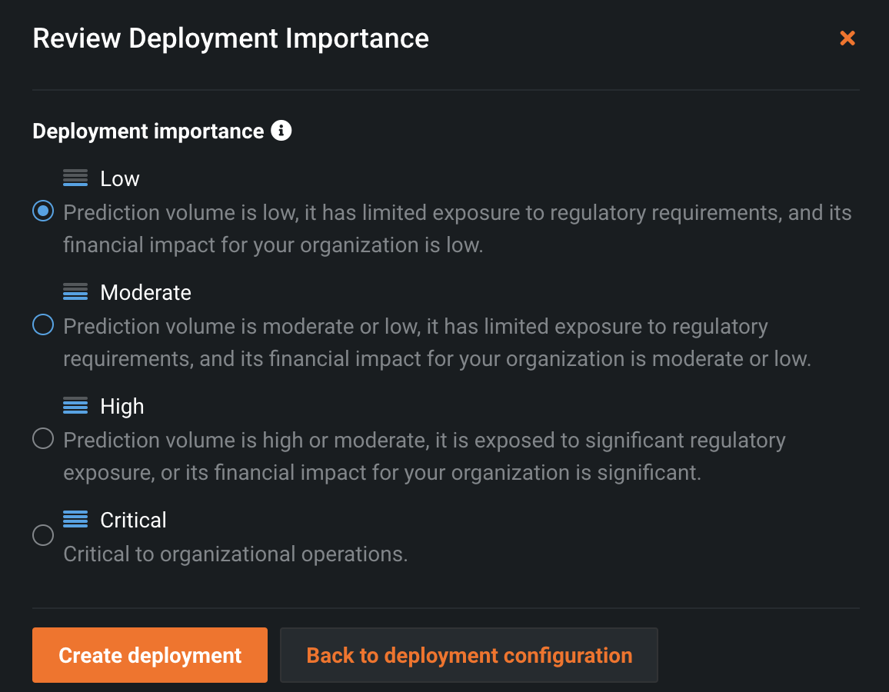
<br/><br/>

After creating the new deployment - click on 'return to deployments'

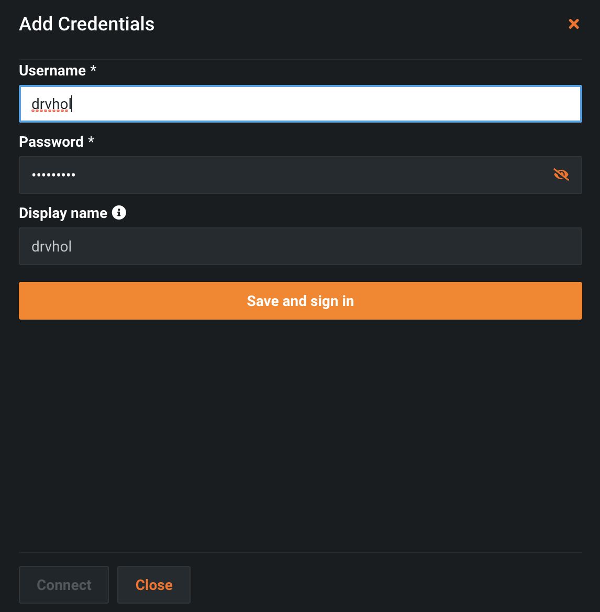
<br/><br/>

The Deployments Inventory shows the real-time status of all deployed models, regardless of how they were created or when and where they were deployed.. Here you can manage, monitor, and govern your deployed models and seeing at a glance which models are stale, preventing risk to your business.

And now we have one active deployment. Go ahead and click on it.

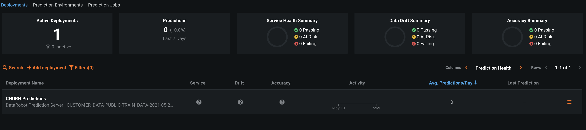
<br/><br/>

We have different capabilities as part of MLOps, including service health, data drift, accuracy, Embedded Governance, Humility, Fairness and more, that we won't cover today.

Go to the "Predictions" tab then "Job Definitions" tab and click on "+Add job definition".

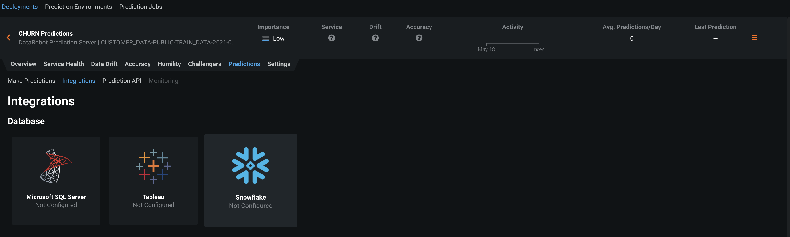
<br/><br/>

We will start setting up our job definition.

click on '+ Define connection' next to the Prediction source and choose the 'Snowflake HOL' connection and your user.
On the Search by: choose Tables and type 'scoring' - you will see the table 'SCORING_DATA', select this table and click 'Save connection'

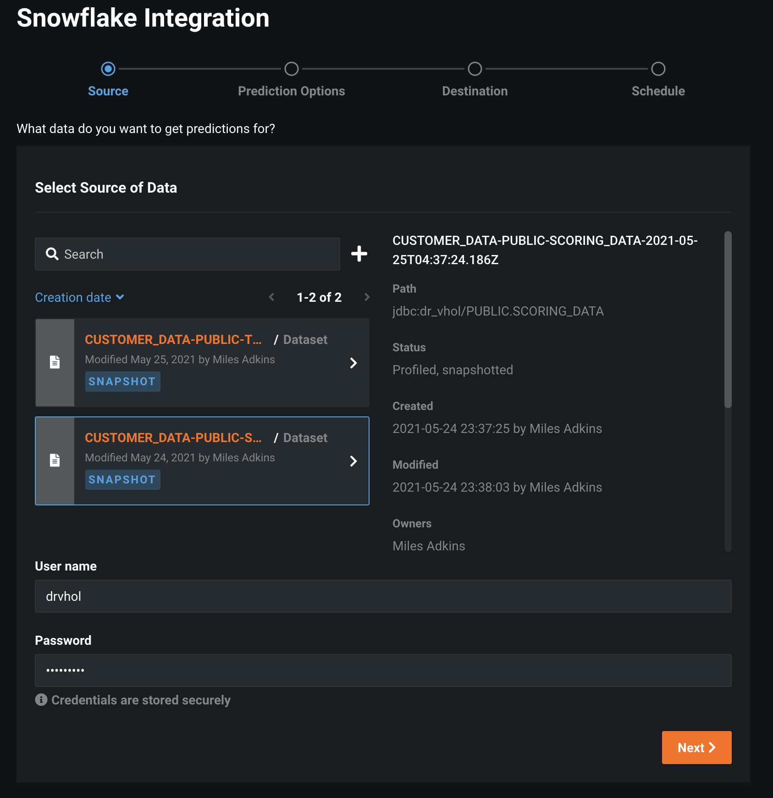
<br/><br/>

The "Prediction Source" is now complete. You can adjust the prediction options if needed, for this walkthrough we're going to stick with the defaults.

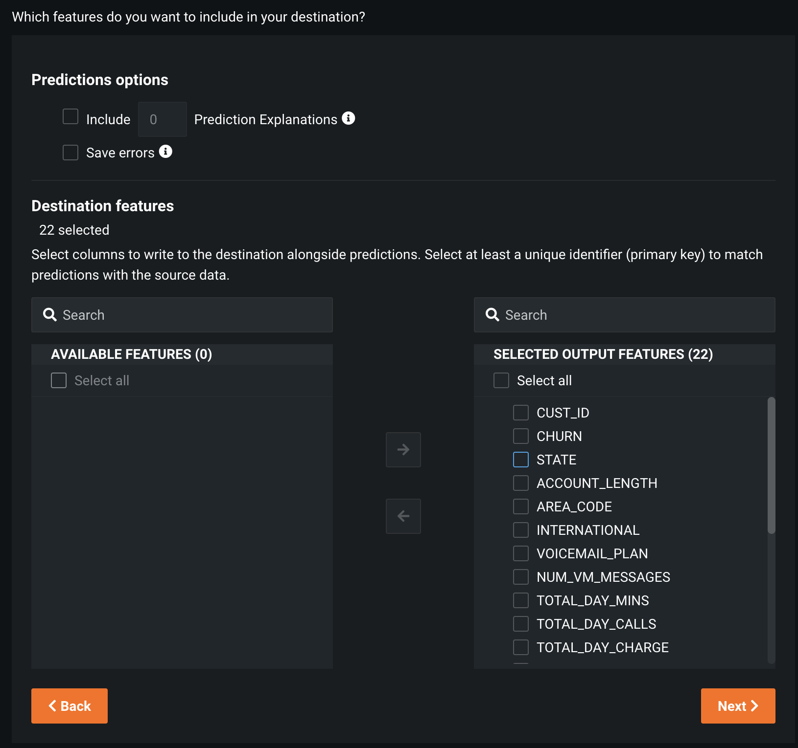
<br/><br/>

The last section to complete is the "Prediction Destination". Go ahead and leave the Destination Type as "JDBC", and click "+ Define Connection".

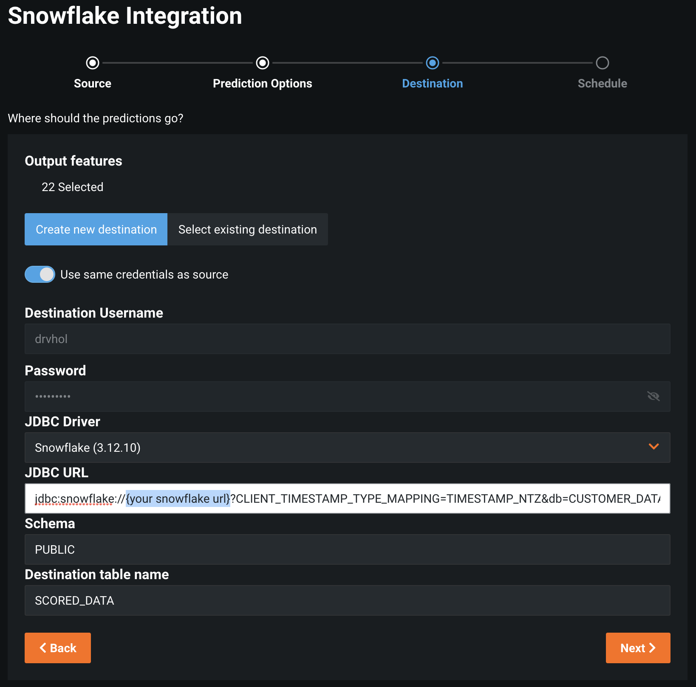
<br/><br/>

Repeat the process as before in the "Prediction Source" (choose the data connection) and on tables create a new table

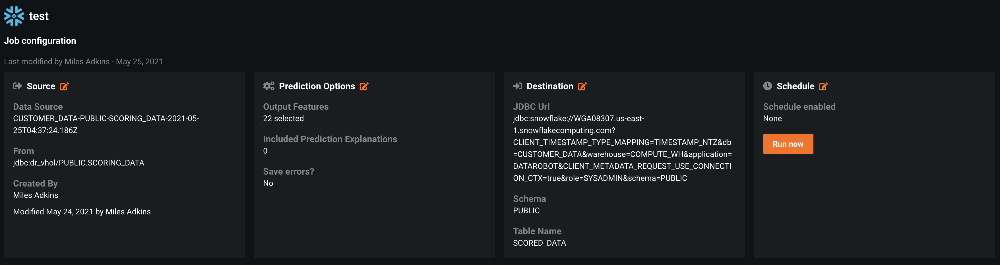
<br/><br/>

Go ahead and click “Create a table”
Schema: 'CUSTOMER_DATA.PUBLIC'
name: SCORED_DATA' and click 'Save connection'

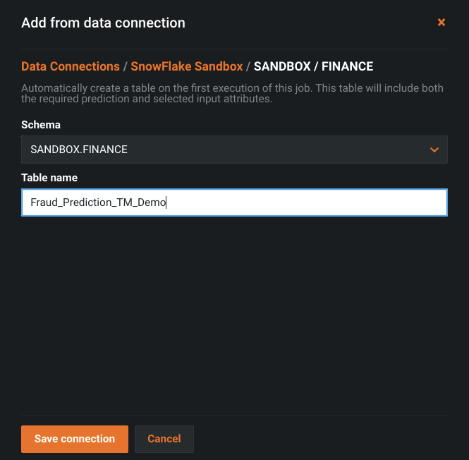
<br/><br/>

Change the write strategy to 'Insert'.

At the bottom you can schedule this job to run on a Schedule, or just run it manually. Go ahead and click "Save Prediction job definition" in the bottom left, then click on "View all Job Definitions" in the upper left. Click the hamburger icon on the right side of the job definition you just made, and click "Run now".

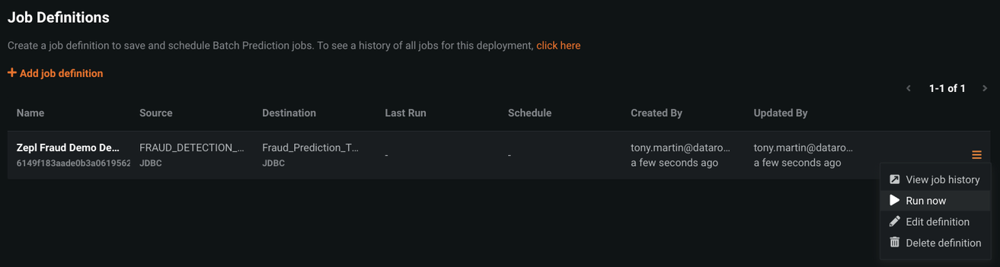
<br/><br/>

If you click the hamburger icon again and go to “View job history” you can see its status. Once it's finished you should see the green “Succeeded” message under status.

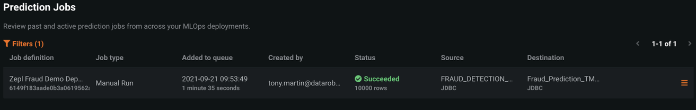
<br/><br/>

We can now finally head back to our Snowflake tab. If you hit the refresh icon near the top left of our screen by your databases, you should see the `SCORED_DATA` table that was created once we kicked off our prediction job. If you excecute the query:

```sql
SELECT
    *
FROM
    customer_data.public.scored_data;
```


You will see our data with three new columns: 'CHURN_True_Prediction', 'CHURN_False_Prediction' showing the likelihood that each person is likely to churn or stay, and the decision in the column 'CHURN_PREDICTION'

Click on the 'CHURN_PREDICTION'column, on the right side, we can see that snowflake snowsight presents statistics - In this case, looks like 430 (which is 17.5%) of the customers for this dataset are likely to churn. It also offers additional charts for further analysis.

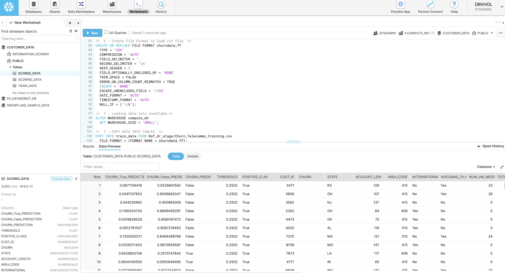
<br/><br/>

And as they say, that is all folks!

For the advanced python users you can keep the lab to see how to use python for snowpark togetehr with DataRobot.

## (Extra) Connecting Snowflake with Zepl - DataRobot notebooks in the cloud

Duration: 2

Go back to the partner connect section in Snowflake and click the "Data Science & ML" category and click "Zepl"


<br/><br/>

This will present you with a screen to connect to Zepl. It will outline a number of Snowflake objects that will be auto-created. For the purposes of this lab, we have already created the snowflake objects that we will need, so you can click "Connect" .

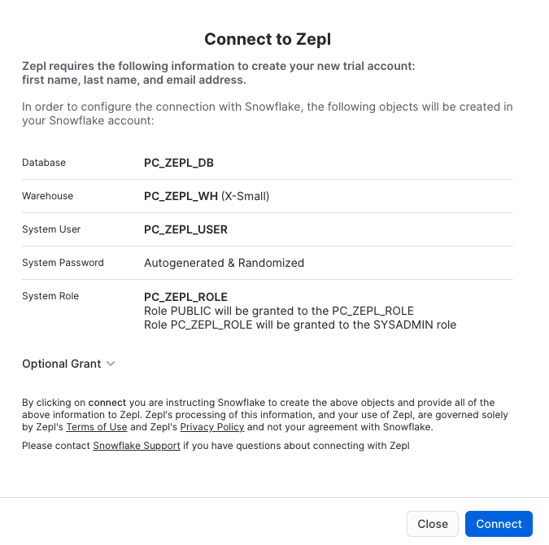
<br/><br/>

You then will be prompted to activate your account now, click the blue "Activate" button to do so.

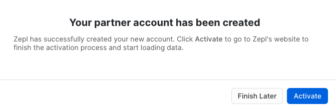

This will launch a new tab to the Zepl platform.
<!-- ------------------------ -->
## Getting Started with Zepl - DataRobot notebooks in the cloud
Duration: 2

DataRobot Zepl the cloud data science notebook solution that enables advanced data scientists to do exploratory, code-centric work in Python, R, and Scala with enterprise features such as collaboration, versioning, and security.

In this exercise, we will use snowpark python and datarobot zepl notebook to do some EDA and visualizatoion

First, let's configure Zepl:
After creating your zepl account through the partner connect download the following notebook:

<button>
  [Download the notebook](https://app.zepl.com/viewer/notebooks/bm90ZTovL2F0YWxpYS5ob3JlbnNodGllbkBkYXRhcm9ib3QuY29tLzAxYjY3NjdiMDk0ZDQwZjE5YmI1Njg1MjJlODI2MDJjL25vdGUuanNvbg)
</button>

Click on my My Notebooks

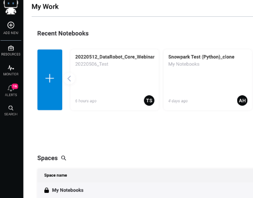
<br/><br/>

Import the notebook: click import on the right side, upload the notebook that was preshared and once the notebook appears in your screen click on the notebook name: Snowflake_HOL


<!-- ------------------------ -->
## Creating a Zepl Data Connection
Duration: 2

To create a data connection from a notebook do the following:
1. Open the data sources sidebar by clicking the data sources icon on the right side of the notebook
2. Click the Add new button at the top of the sidebar and select 'Secret store'

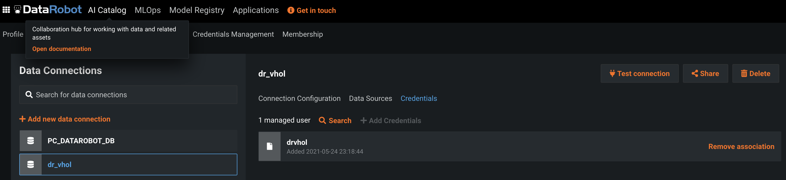
<br/><br/>

3. Fill in the fields:

a. NAME: 'Snowflake_DR_HOL'

b. KEY VALUES:

  Key: 'password'

  Value: your snowflake account password

And click on the button 'Add'

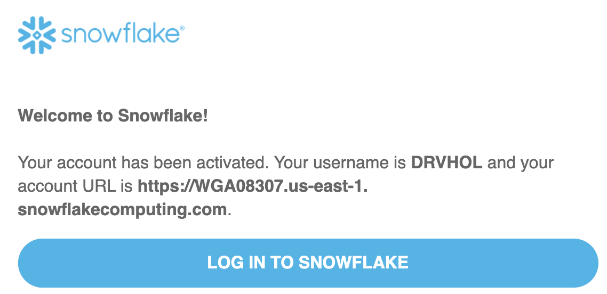
<br/><br/>

You will see the new secret under the 'Attached to this notebook'

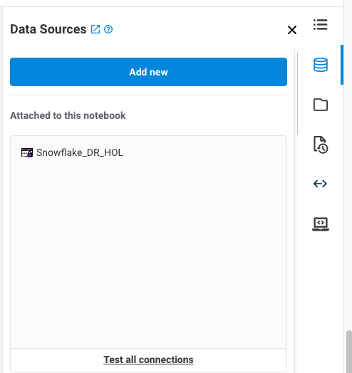
<br/><br/>

<!-- ------------------------ -->
## Connect to Snowflake Snowpark
Duration: 5

Download the Snowpark library:
<button>
  [Download the Snowpark library](https://drive.google.com/file/d/15kVt0XtGIKl7CrN27jpUHwcW4MvdIdiA/view?usp=sharin)
</button>

To import the Snowpark library:
1. Open the folder sidebar by clicking the folder icon on the right side of the notebook
2. Import the Snowpark library that was preshared
3. When you see the file, hover on the file and click the symbol '</>' and copy the path

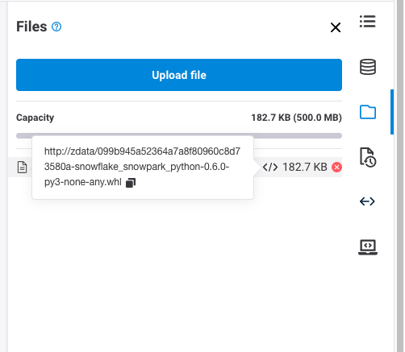
<br/><br/>

4. Modify Section1:

-Replace the path in line1 with the copied path

-Change the id number in line2 - the line id is teh id from the path

Now you can run in the notebook Sections 1-2:

Section 1 will download and install the snowpark python package

Section 2 will import the necessery packages

5. Modify Section3:

account: change to your Snowflake account name (WITHOUT snowflakecomputing.com)

user: change to your user name

Now you can run Sections 3-4:

Section 3 will connect to snowflake where we created the training table

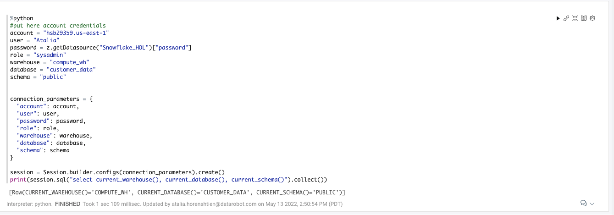
<br/><br/>

Section 4 will present the data in the training table we created in snowflake, query is running in Snowflake

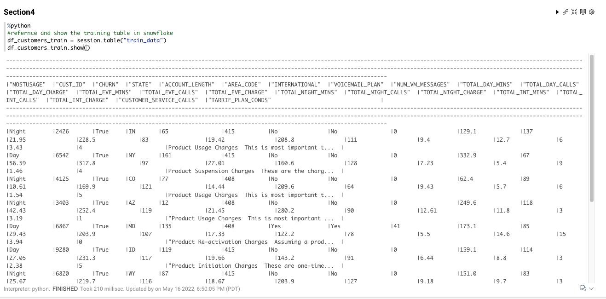
<br/><br/>

<!-- ------------------------ -->
## EDA on Zepl notebook using python for snowpark
Duration: 2

In the notebook, run Section 5
This section will create a new feature to identify if a user is more active at night or day.
That can contribute to our model, yo understand things like - why this user churn, when to send this use promotions, etc.
using python for snowpark, using the snowflake compute.
The results will be overwrtie the train table in Snowflake


Go back to your snowflake account and run again the sql:

```sql
SELECT
    *
FROM
    train_data
LIMIT 10;
```


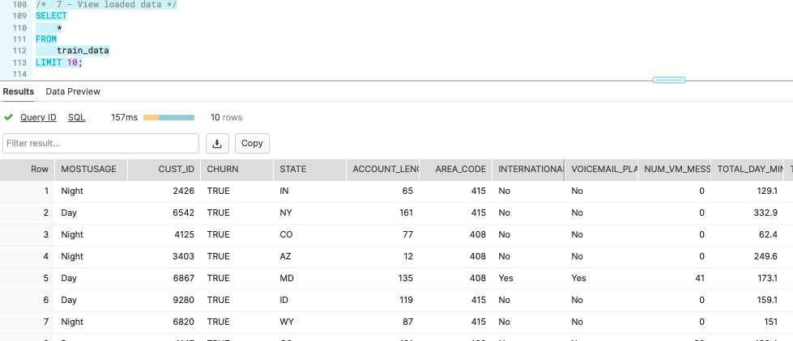
<br/><br/>

<!-- ------------------------ -->
