author: Mats Stellwall
id: automating-document-processing-workflows-with-document-ai
categories: snowflake-site:taxonomy/solution-center/certification/quickstart, snowflake-site:taxonomy/product/ai, snowflake-site:taxonomy/snowflake-feature/ingestion, snowflake-site:taxonomy/snowflake-feature/document-ai
language: en
summary: Automate document processing with Snowflake Document AI for invoice extraction, form digitization, OCR, and data validation workflows.
environments: web
status: Published 
feedback link: https://github.com/Snowflake-Labs/sfguides/issues


# Automating Document Processing Workflows With Document AI
<!-- ------------------------ -->
## Overview 

Through this quickstart guide, you will explore Document AI. You will set up your Snowflake environment, use Document AI to create a model to extract values from documents, create a document extraction pipline using the model and use streamlit to build a application to verify the extracted values.  

### What is Document AI 
Document AI is a Snowflake machine learning feature that uses a large language model (LLM) to extract data from documents. With Document AI, you can prepare pipelines for continuous processing of new documents of a specific type, such as invoice or finance statement documents.

Document AI uses a model that provides both zero-shot extraction and fine-tuning. Zero-shot means that the foundation model is trained on a large volume of various documents, so the model broadly understands the type of document being processed. In this way, it can locate and extract information specific to this document type, even if the model has never seen the document before.

Additionally, you can create your own customized, fine-tuned Document AI model to improve your results by training the model on the documents specific to your use case.

### What You’ll Learn 
* how to create a Document AI model
* how use a published Document AI model to build a data pipeline
* how to build a Streamlit application for verifying documents

### Prerequisites
* [Git](https://git-scm.com/book/en/v2/Getting-Started-Installing-Git) installed
    >
    >Clone or download the [git repo](https://github.com/Snowflake-Labs/sfguide-getting-started-with-document-ai)
* A Snowflake account. If you do not have a Snowflake account, you can register for a [free trial account](https://signup.snowflake.com/?utm_source=snowflake-devrel&utm_medium=developer-guides&utm_cta=developer-guides).
* A Snowflake account login with a role that has the ability to create role, database, schema, tables, stages and assign permissions. If not, you will need to register for a free trial or use a different role.

### What You’ll Build 
You will use documents from the [Contract Understanding Atticus Dataset (CUAD) v1.](https://doi.org/10.5281/zenodo.4595826) in order to extract values and verifying that clauses exists in co-branding agreements. The QuickStart [git repo](https://github.com/Snowflake-Labs/sfguide-getting-started-with-document-ai) includes the documents we are going to use.

> 
>
> **Citation**  
> The Atticus Project. (2021). Contract Understanding Atticus Dataset (CUAD) v1. https://doi.org/10.5281/zenodo.4595826

<!-- ------------------------ -->
## Setup the Snowflake enviroment

### Overview
This section covers cloning of the GitHub repository and creating the needed Snowflake objects (i.e role, warehouse, database, schema, etc..)

### Clone the git repository
The very first step is to clone the [GitHub repository](https://github.com/Snowflake-Labs/sfguide-getting-started-with-document-ai). This repository contains all the code you will need to successfully complete this QuickStart Guide.

Using HTTPS:

```shell
git clone https://github.com/Snowflake-Labs/sfguide-getting-started-with-document-ai.git
```

OR, using SSH:

```shell
git clone git@github.com:Snowflake-Labs/sfguide-getting-started-with-document-ai.git
```

### Creating Objects
Run the following SQL commands, those can also be found in the [setup.sql](https://github.com/Snowflake-Labs/sfguide-getting-started-with-document-ai/blob/main/setup.sql) file, in a SQL worksheet to create the [warehouse](https://docs.snowflake.com/en/sql-reference/sql/create-warehouse), [database](https://docs.snowflake.com/en/sql-reference/sql/create-database), [schema](https://docs.snowflake.com/en/sql-reference/sql/create-schema) and [role](https://docs.snowflake.com/en/sql-reference/sql/create-role).

```SQL
USE ROLE ACCOUNTADMIN;

-- CREATE A DOC AI ROLE TO BE USED FOR THE QUICKSTART
CREATE ROLE doc_ai_qs_role;
GRANT DATABASE ROLE SNOWFLAKE.DOCUMENT_INTELLIGENCE_CREATOR TO ROLE doc_ai_qs_role;

GRANT ROLE doc_ai_qs_role TO USER <YOUR USER>;

-- CREATE A WAREHOUSE TO BE USED
CREATE WAREHOUSE doc_ai_qs_wh;

-- GIVE THE doc_ai_qs_role ROLE ACCESS TO THE WAREHOUSE
GRANT USAGE, OPERATE, MODIFY ON WAREHOUSE doc_ai_qs_wh TO ROLE doc_ai_qs_role;

-- CREATE DATABASE AND SCHEMA TO BE USED, GIVE THE doc_ai_qs_role ACCESS
CREATE DATABASE doc_ai_qs_db;
GRANT CREATE SCHEMA, MODIFY, USAGE ON DATABASE doc_ai_qs_db TO ROLE doc_ai_qs_role;

-- CHANGE TO THE QUICKSTART ROLE
USE ROLE doc_ai_qs_role;

-- CREATE A SCHEMA FOR THE DOCUEMNT AI MODEL, STAGE etc
CREATE SCHEMA doc_ai_qs_db.doc_ai_schema;

-- EXPLICIT GRANT USAGE AND snowflake.ml.document_intelligence on the  SCHEMA
GRANT USAGE ON SCHEMA doc_ai_qs_db.doc_ai_schema to role doc_ai_qs_role;
GRANT CREATE snowflake.ml.document_intelligence on schema doc_ai_qs_db.doc_ai_schema to role doc_ai_qs_role;

-- CREATE A STAGE FOR STORING DOCUMENTS
CREATE STAGE doc_ai_qs_db.doc_ai_schema.doc_ai_stage
  DIRECTORY = (enable = true)
  ENCRYPTION = (type = 'snowflake_sse');

-- SCHEMA FOR THE STREAMLIT APP
CREATE SCHEMA doc_ai_qs_db.streamlit_schema;

-- TABLE FOR THE STREAMLIT APP
CREATE OR REPLACE TABLE doc_ai_qs_db.doc_ai_schema.CO_BRANDING_AGREEMENTS_VERIFIED
(
    file_name string
    , snowflake_file_url string
    , verification_date TIMESTAMP
    , verification_user string
);

```
We are now ready to start.

<!-- ------------------------ -->
## Build a Document AI model

### Overview
In This step we will create a Document AI model by uploading documents and sepcify the questions needed to extarct values. Once done we will publish the models so it can be use for extracting values from documents.

### Step 1: Create a Document AI build
In Snowsight make sure you have changed the role to DOC_AI_QS_ROLE, you can see the active role in under your users name in the bottom left corner.  
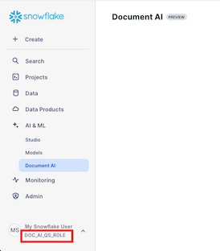

1. Navigate to Document AI by clicking on **AI & ML** and then **Document AI**
2. Select the doc_ai_qs_wh warehouse  
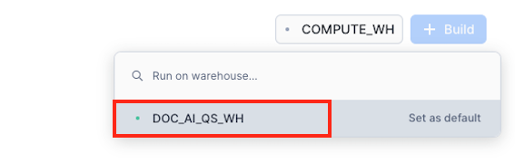
3. Click on **+ Build** and set the name, database and schema as below.
   * Build name: DOC_AI_QS_CO_BRANDING
   * Locations: 
     * DOC_AI_QS_DB
     * DOC_AI_SCHEMA  
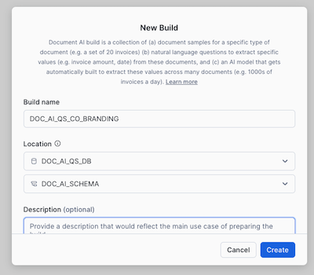  
4. Click on **Create**

### Step 2: Upload documents
In this step we wil upload example documents that we will use to ask value extraction questions against, so we can verify that the questionswork.  
> 
    >
    >The recommendation is to use at least 20 documents, but in this qucikstart we will only use 5 to speed up the review step.  
1. Click on **Upload documents** to start the process of uploading documents  
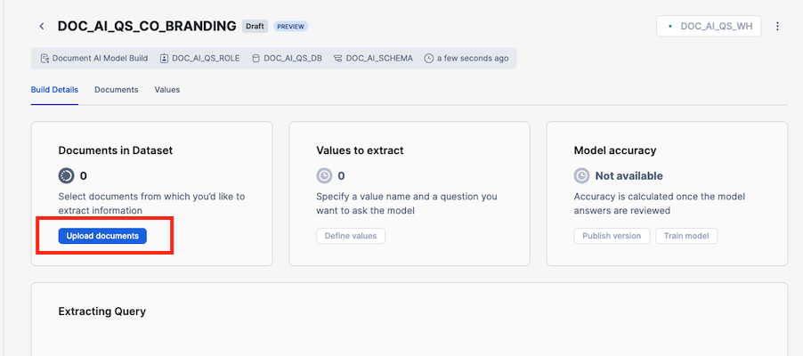  
2. Add the documents in the **training_documents** folder and click **Upload**  
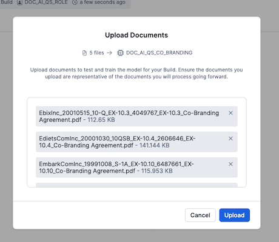  
3. Click on **+ Value** to open the page for define the questions for extracting values  
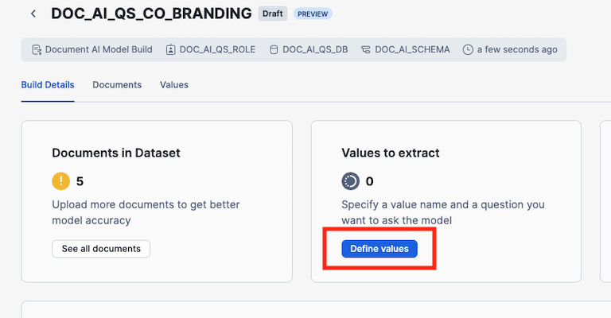  

### Step 3: Specify values
In this step we will define the questions for extracting values and the name of the key the value will be added to.  
1. Click on **Add Value** and enter **effective_date** as the **Vale Name** and  **What is the effective date of the agreement?** as the question.
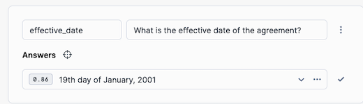  
2. By clicking on the **Locate Answer** button (target looking icon), we can see where in teh document Document AI has found the answer.
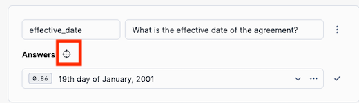  
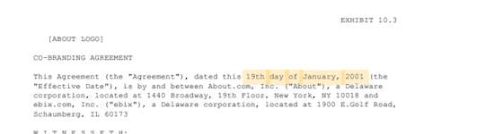  
3. Add the rest of the the value names and questions from the table below   
| VALUE NAME | QUESTION |
|------------|----------|
| parties | Who are the parties involved in the agreement? |
| duration | What is the duration of the agreement? |
| notice_period | What is the notice period for termination? |
| indemnification_clause | Is there an indemnification clause? |
| renewal_options | Are there any renewal options or conditions mentioned? |
| force_majeure | Is there a force majeure clause? |
| payment_terms | What are the payment terms, including amounts, timing, and conditions? |

4. Once all values are defined click on **Accept and review next**
5. If a value is missing or for example it is a **No** for a value, you can verify if it is correct by searching for the term in the document  
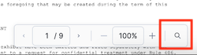  
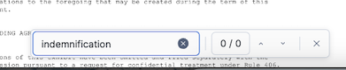  
> 
    >
    >For some of the questions multiple answers might be correct.
6. Step through all documents and verify the values and for the document **EdietsComInc_20001030_10QSB_EX-10.4_2606646_EX-10.4_Co-Branding Agreement.pdf** the **payment_terms** is not correct since it is a schedule, so it should be cleared which is done by clicking on **...** next to the value and choose **Clear answer**  
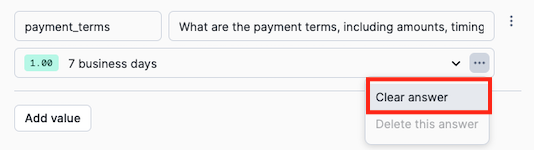  
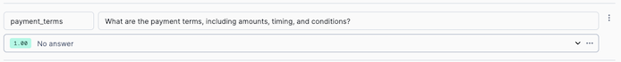  
5. Once done with all documents click **Accept and close** and then click on **Build Details**   
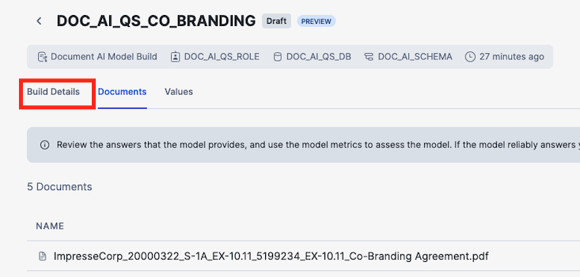  
6. Click on **Publish version**  
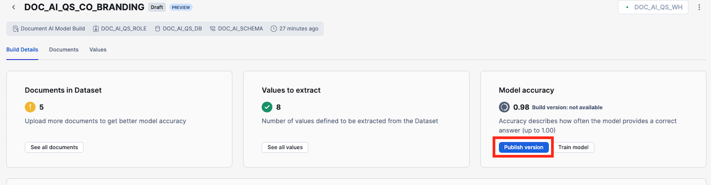  
7. Click on **Publish** in the dialog  
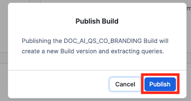  

We are now ready to create a document processing pipeline.

<!-- ------------------------ -->
## Create a document processing pipeline

### Overview
In this step we will use our previously published model to extract values from new documents. This step might be done by a data engineer or someone responsible for setting up piplines.

### Step 1: Get the model instructions 
First we need to get the SQL for calling the model.  
1. In the **Extracting Query** section, make a note of the fully qualified name of the build, in this example **DOC_AI_QS_DB.DOC_AI_SCHEMA.DOC_AI_QS_CO_BRANDING!PREDICT**, and the version, in this case **1**.
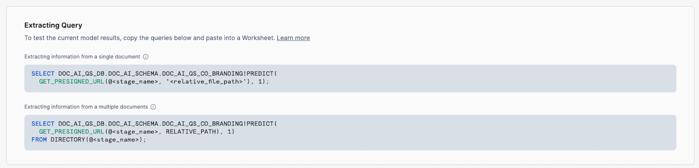  

### Step 2: Upload documents to a stage
Second step is to add the documnets we want to extract values from to a Snowflake stage, created in the Setup the Snowflake enviroment step.
1. Navigate to the stage by going to **Data -> Databases -> DOC_AI_QS_DB -> DOC_AI_SCHEMA -> Stages -> DOC_AI_STAGE**
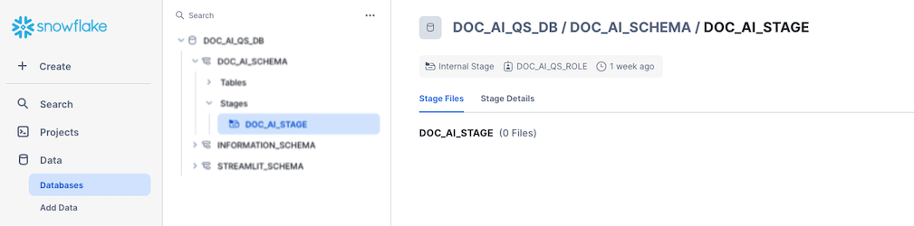  
2. Click on **+ Files** and add all documents in the **extraction_documents** folder to the dialog and click **Upload**  
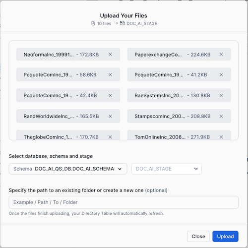  


### Step 3: Exectue the extraction SQL
Third step is to use the published model to extract values from our documents, all SQLs can also be found in the [extraction.sql](https://github.com/Snowflake-Labs/sfguide-getting-started-with-document-ai/blob/main/extraction.sql) file.
1. Create a new SQL Worksheet
2. Check that we have files in the stage by executing the following SQL
```SQL
USE ROLE doc_ai_qs_role;
USE WAREHOUSE doc_ai_qs_wh;
USE DATABASE doc_ai_qs_db;
USE SCHEMA doc_ai_schema;

LS @doc_ai_stage;
```
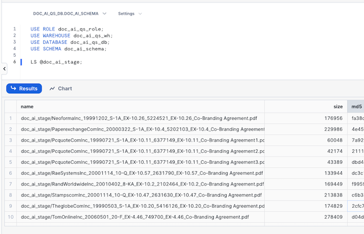  
3. Add the following SQL, this will create a table, **CO_BRANDING_AGREEMENTS**, that will contain the extracted values and the scores of the extractions. Execture the SQL, this wil take a couple of minutes.  
```SQL
-- Create a table with all values and scores
CREATE OR REPLACE TABLE doc_ai_qs_db.doc_ai_schema.CO_BRANDING_AGREEMENTS
AS
WITH 
-- First part gets the result from applying the model on the pdf documents as a JSON with additional metadata
temp as(
    SELECT 
        Relative_path as file_name
        , size as file_size
        , last_modified
        , file_url as snowflake_file_url
        -- VERIFY THAT BELOW IS USING THE SAME NAME AND NUMER AS THE MODEL INSTRUCTIONS YOU COPIED IN THE PREVIOUS STEP!
        ,  DOC_AI_QS_DB.DOC_AI_SCHEMA.DOC_AI_QS_CO_BRANDING!PREDICT(get_presigned_url('@doc_ai_stage', RELATIVE_PATH ), 1) as json
    from directory(@doc_ai_stage)
)
-- Second part extract the values and the scores from the JSON into columns
SELECT
file_name
, file_size
, last_modified
, snowflake_file_url
, json:__documentMetadata.ocrScore::FLOAT AS ocrScore
, json:parties::ARRAY as parties_array
, ARRAY_SIZE(parties_array) AS identified_parties
, json:effective_date[0]:score::FLOAT AS effective_date_score
, json:effective_date[0]:value::STRING AS effective_date_value
, json:duration[0]:score::FLOAT AS agreement_duration_score
, json:duration[0]:value::STRING AS agreement_duration_value
, json:notice_period[0]:score::FLOAT AS notice_period_score
, json:notice_period[0]:value::STRING AS notice_period_value
, json:payment_terms[0]:score::FLOAT AS payment_terms_score
, json:payment_terms[0]:value::STRING AS payment_terms_value
, json:force_majeure[0]:score::FLOAT AS have_force_majeure_score
, json:force_majeure[0]:value::STRING AS have_force_majeure_value
, json:indemnification_clause[0]:score::FLOAT AS have_indemnification_clause_score
, json:indemnification_clause[0]:value::STRING AS have_indemnification_clause_value
, json:renewal_options[0]:score::FLOAT AS have_renewal_options_score
, json:renewal_options[0]:value::STRING AS have_renewal_options_value
FROM temp;
```  
4. Check that there is a result by running the following SQL  
```SQL
select * from doc_ai_qs_db.doc_ai_schema.CO_BRANDING_AGREEMENTS;
```  
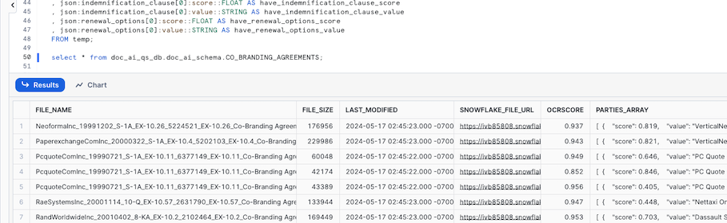  

We have now applied our model on all our documents and stored the extraced values in a table, if we wanted to run this every time we ad a new document to the stage we can use [streams](https://docs.snowflake.com/en/user-guide/streams-intro) and [tasks](https://docs.snowflake.com/en/user-guide/tasks-intro).

Next step is to create the Streamlit application for verifying the extracted values.

<!-- ------------------------ -->
## Create a Streamlit application

### Overview
In this step we will create a Streamlit application in Snowflake to be used for verifying the extracted values.

### Step 1: Create a Streamlit application
The Python code for this step can also be found [streamlit_app.py](https://github.com/Snowflake-Labs/sfguide-getting-started-with-document-ai/blob/main/streamlit_app.py) file.
1. Navigate to Streamlit by click on the **projects** icon to the left and choose **Streamlit**  
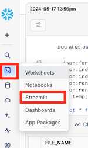  
3. Make sure you are using the **doc_ai_qs_role** role  
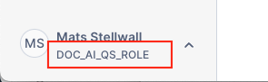  
4. Click on **+ Streamlit App**  
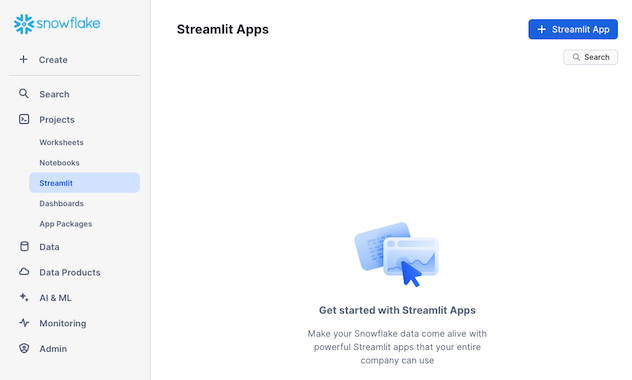  
5. Give it a title and choose the **DOCK_AI_QS_DB** and **STREAMLIT_SCHEMA** for **App location** and **DOC_AI_WH** as **App warehouse** and click **Create**  
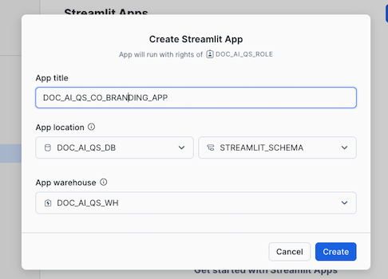  
6. Replace the code in the left pane with the code below  
```python
# Import python packages
import streamlit as st
from snowflake.snowpark.context import get_active_session
from snowflake.snowpark import functions as snow_funcs

import pypdfium2 as pdfium
from datetime import datetime

st.set_page_config(layout="wide")

# Write directly to the app
st.title("Co-Branding Agreement Verification :ledger:")
st.write(
    """A example Streamlit Application that enables users to verify values that is missing or have a extraction score below a threshold.
    """
)

# Get the current credentials
session = get_active_session()

#
#  Parameters
# 
doc_ai_context = "doc_ai_qs_db.doc_ai_schema"
doc_ai_source_table = "CO_BRANDING_AGREEMENTS"
doc_ai_source_verify_table = "CO_BRANDING_AGREEMENTS_VERIFIED"
doc_ai_doc_stage = "doc_ai_stage"

# Dict that has the name of the columns that needs to be verified, it has the column name of the column 
# with value and column with the score
value_dict = {
    "EFFECTIVE_DATE": {
        "VAL_COL": "EFFECTIVE_DATE_VALUE",
        "SCORE_COL": "EFFECTIVE_DATE_SCORE"
    },
    "AGREEMENT_DURATION": {
        "VAL_COL": "AGREEMENT_DURATION_VALUE",
        "SCORE_COL": "AGREEMENT_DURATION_SCORE"
    },
    "NOTICE_PERIOD": {
        "VAL_COL": "NOTICE_PERIOD_VALUE",
        "SCORE_COL": "NOTICE_PERIOD_SCORE"
    },
    "PAYMENT_TERMS": {
        "VAL_COL": "PAYMENT_TERMS_VALUE",
        "SCORE_COL": "PAYMENT_TERMS_SCORE"
    },
    "HAVE_FORCE_MAJEURE": {
        "VAL_COL": "HAVE_FORCE_MAJEURE_VALUE",
        "SCORE_COL": "HAVE_FORCE_MAJEURE_SCORE"
    },
    "HAVE_INDEMNIFICATION_CLAUSE": {
        "VAL_COL": "HAVE_INDEMNIFICATION_CLAUSE_VALUE",
        "SCORE_COL": "HAVE_INDEMNIFICATION_CLAUSE_SCORE"
    },
    "HAVE_RENEWAL_OPTIONS": {
        "VAL_COL": "HAVE_RENEWAL_OPTIONS_VALUE",
        "SCORE_COL": "HAVE_RENEWAL_OPTIONS_SCORE"
    }
}

# The minimum score needed to not be verified
threshold_score = 0.5

# HELPER FUNCTIONS
# Function to generate filter to only get the rows that are missing values or have a score below the threashold
def generate_filter(col_dict:dict,  score_val:float): #score_cols:list, score_val:float, val_cols:list):
    
    filter_exp = ''

    # For each column
    for col in col_dict:
        # Create the filter on score threashold or missing value
        if len(filter_exp) > 0:
                filter_exp += ' OR '
        filter_exp += f'(({col_dict[col]["SCORE_COL"]} <= {score_val} ) OR ({col_dict[col]["VAL_COL"]} IS NULL))'

    if len(filter_exp) > 0:
       filter_exp = f'({filter_exp}) AND ' 
    
    # Filter out documents already verified
    filter_exp  += 'verification_date is null'
    return filter_exp

# Generates a column list for counting the number of documents that is missing values or a score less that the threashold
# by each column
def count_missing_select(col_dict:dict, score_val:float):
    select_list = []

    for col in col_dict:
        col_exp = (snow_funcs.sum(
                          snow_funcs.iff(
                                    (
                                        (snow_funcs.col(col_dict[col]["VAL_COL"]).is_null())
                                        | 
                                        (snow_funcs.col(col_dict[col]["SCORE_COL"]) <= score_val)
                                    ), 1,0
                              )
                      ).as_(col)
                )
        select_list.append(col_exp)
        
    return select_list

# Function to display a pdf page
def display_pdf_page():
    pdf = st.session_state['pdf_doc']
    page = pdf[st.session_state['pdf_page']]
            
    bitmap = page.render(
                    scale = 8, 
                    rotation = 0,
            )
    pil_image = bitmap.to_pil()
    st.image(pil_image)

# Function to move to the next PDF page
def next_pdf_page():
    if st.session_state.pdf_page + 1 >= len(st.session_state['pdf_doc']):
        st.session_state.pdf_page = 0
    else:
        st.session_state.pdf_page += 1

# Function to move to the previous PDF page
def previous_pdf_page():
    if st.session_state.pdf_page > 0:
        st.session_state.pdf_page -= 1

# Function to get the name of all documents that need verification
def get_documents(doc_df):
    
    lst_docs = [dbRow[0] for dbRow in doc_df.collect()]
    # Add a default None value
    lst_docs.insert(0, None)
    return lst_docs

# MAIN

# Get the table with all documents with extracted values
df_agreements = session.table(f"{doc_ai_context}.{doc_ai_source_table}")

# Get the documents we already gave verified
df_validated_docs = session.table(f"{doc_ai_context}.{doc_ai_source_verify_table}")

# Join
df_all_docs = df_agreements.join(df_validated_docs,on='file_name', how='left', lsuffix = '_L', rsuffix = '_R')

# Filter out all document that has missing values of score below the threasholds
validate_filter = generate_filter(value_dict, threshold_score)
df_validate_docs = df_all_docs.filter(validate_filter)
col1, col2 = st.columns(2)
col1.metric(label="Total Documents", value=df_agreements.count())
col2.metric(label="Documents Needing Validation", value=df_validate_docs.count())

# Get the number of documents by value that needs verifying
select_list = count_missing_select(value_dict, threshold_score)
df_verify_counts = df_validate_docs.select(select_list)
verify_cols = df_verify_counts.columns

st.subheader("Number of documents needing validation by extraction value")
st.bar_chart(data=df_verify_counts.unpivot("needs_verify", "check_col", verify_cols), x="CHECK_COL", y="NEEDS_VERIFY")

# Verification section
st.subheader("Documents to review")
with st.container():
    # Get the name of the documents that needs verifying and add them to a listbox
    lst_documents = get_documents(df_validate_docs)
    sel_doc = st.selectbox("Document", lst_documents)

    # If we havse selected a document
    if sel_doc:        
        # Display the extracted values
        df_doc = df_validate_docs.filter(snow_funcs.col("FILE_NAME") == sel_doc)
        col_val, col_doc = st.columns(2)
        with col_val:
            with st.form("doc_form"):
                approve_checkboxes = 0
                for col in value_dict:
                    st.markdown(f"**{col}**:")
                    col_vals = df_doc[[value_dict[col]["SCORE_COL"], value_dict[col]["VAL_COL"]]].collect()[0]
                    # If we are missing a value
                    if not col_vals[1]:
                        st.markdown(f":red[**Value missing!**]")
                        st.checkbox("Approved", key=f"check_{approve_checkboxes}")
                        approve_checkboxes += 1
                    else:
                        # If the extraction is less that the threashold
                        if col_vals[0] <= threshold_score:
                            st.markdown(f":red[{col_vals[1]}]")
                            st.markdown(f":red[**The value score, {col_vals[0]}, is below threshold score!**]")
                            st.checkbox("Approved", key=f"check_{approve_checkboxes}")
                            approve_checkboxes += 1
                        else:
                            st.write(col_vals[1])
                save = st.form_submit_button()
                if save:
                     with st.spinner("Saving document approval..."):
                        for i in range(approve_checkboxes):
                            if not st.session_state[f"check_{i}"]:
                                st.error("Need to apporve all checks before saving")
                                st.stop()
                        # Create a SQL to save that the document is verified
                        insert_sql = f"INSERT INTO {doc_ai_context}.{doc_ai_source_verify_table} (file_name, verification_date) VALUES ('{sel_doc}', '{datetime.now().isoformat()}')"
                        _ = session.sql(insert_sql).collect()
                        st.success("✅ Success!")
                        # Rerun is used to force the application to run from the begining so we can not verify the same document twice
                        st.rerun()
            # Display of PDF section
            with col_doc:
                if 'pdf_page' not in st.session_state:
                    st.session_state['pdf_page'] = 0
    
                if 'pdf_url' not in st.session_state:
                    st.session_state['pdf_url'] = sel_doc
                
                if 'pdf_doc' not in st.session_state or st.session_state['pdf_url'] != sel_doc:
                    pdf_stream = session.file.get_stream(f"@{doc_ai_context}.{doc_ai_doc_stage}/{sel_doc}")
                    pdf = pdfium.PdfDocument(pdf_stream)
                    st.session_state['pdf_doc'] = pdf
                    st.session_state['pdf_url'] = sel_doc
                    st.session_state['pdf_page'] = 0
                
                nav_col1, nav_col2, nav_col3 = st.columns(3)
                with nav_col1:
                    if st.button("⏮️ Previous", on_click=previous_pdf_page):
                        pass    
                with nav_col2:
                    st.write(f"page {st.session_state['pdf_page'] +1} of {len(st.session_state['pdf_doc'])} pages")
                with nav_col3:
                    if st.button("Next ⏭️", on_click=next_pdf_page):
                        pass
                        
                display_pdf_page()

```  
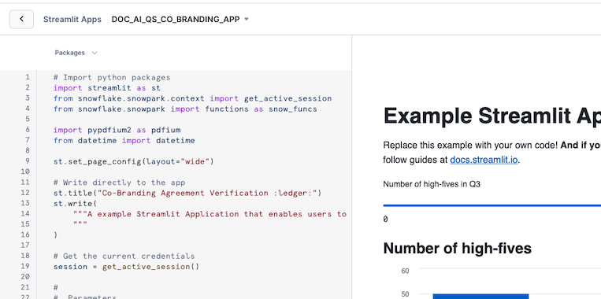  
5. Open the **Packages** menu  
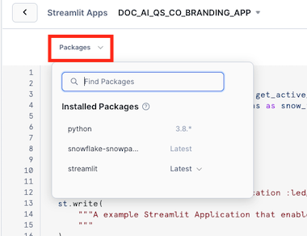  
6. Enter **pypdfium2** in **Find Packages**, and select the first result  
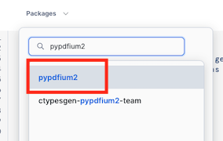  
7. Verify that **pypdfium2** is now in the list of **Installed Packages**  
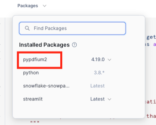  
8. Click **Run** to see the result of the code, in order to hide the code you can click on the **Close editor** icon in the left bottom.  
  

You can now start verifying documents.
<!-- ------------------------ -->
## Conclusion And Resources
Congratulations, you have successfully completed this quickstart! Through this quickstart, we were able to showcase Document AI and how easy it is to use for extracting values from your document.

### What You Learned
* How to create a Document AI model to extract values from documents
* How to create a document extraction pipline
* How to create a Streamlit application in Snowflake to verify extracted values

### Related Resources
* [Extracting Insights from Unstructured Data with Document AI QuickStart](/en/developers/guides/tasty-bytes-extracting-insights-with-docai/)
* [Source Code on GitHub](https://github.com/Snowflake-Labs/sfguide-getting-started-with-document-ai)
* [Document AI Documentation](https://docs.snowflake.com/en/user-guide/snowflake-cortex/document-ai/overview)
