author: Chanin Nantasenamat
id: avalanche-customer-review-data-analytics
categories: snowflake-site:taxonomy/solution-center/certification/quickstart, snowflake-site:taxonomy/product/analytics, snowflake-site:taxonomy/snowflake-feature/business-intelligence, snowflake-site:taxonomy/snowflake-feature/cortex-analyst
language: en
summary: Analyze customer review data with Snowflake for sentiment analysis, feedback insights, and product improvements.
environments: web
status: Published
feedback link: https://github.com/Snowflake-Labs/sfguides/issues


# Build a Customer Review Analytics Dashboard with Snowflake Cortex and Streamlit
<!-- ------------------------ -->
## Overview

In this tutorial, you'll learn how to process and analyze customer review data using an LLM-powered data processing workflow with Snowflake Cortex followed by building a dashboard. Briefly, you'll work with the Avalanche dataset, which contains customer reviews for a hypothetical winter sports gear company, and transform unstructured text data into actionable insights through sentiment analysis and data visualization.

By the end of this guide, you'll have built a complete analytics pipeline that extracts customer review data from DOCX files, processes it using Snowflake's Cortex functions for language translation and sentiment analysis, and visualizes the results using Streamlit.

### What You'll Learn
- How to extract and parse content from DOCX files stored in Snowflake
- How to reshape unstructured data into a structured format via document parsing with Snowflake Cortex
- How to apply Snowflake Cortex for text translation, summarization, and sentiment analysis
- How to create interactive visualizations with Streamlit and Altair
- How to interpret sentiment analysis results for business insights

### What You'll Build
A customer review analytics dashboard that processes unstructured text data and visualizes sentiment trends across products and time periods.

### What You'll Need
- Access to a [Snowflake account](https://signup.snowflake.com/?utm_source=snowflake-devrel&utm_medium=developer-guides&utm_cta=developer-guides)
- Basic knowledge of SQL and Python
- Familiarity with data analysis concepts

<!-- ------------------------ -->
## Setup


### Create the database and schema

Firstly, retrieve [setup.sql](https://github.com/Snowflake-Labs/snowflake-demo-notebooks/blob/main/Avalanche-Customer-Review-Analytics/setup.sql) to follow along our creation of the Avalanche database, schema and table.

Secondly, let's create the Avalanche database and schema by running the following in a SQL worksheet:
```sql
CREATE DATABASE IF NOT EXISTS avalanche_db;
CREATE SCHEMA IF NOT EXISTS avalanche_schema;
```

### Create the stage to store the Avalanche Data

Thirdly, create the stage:
```sql
CREATE STAGE IF NOT EXISTS avalanche_db.avalanche_schema.customer_reviews
  ENCRYPTION = (TYPE = 'SNOWFLAKE_SSE')
  DIRECTORY = (ENABLE = true);
```

You should see a confirmation message after a stage has been created succesfully:
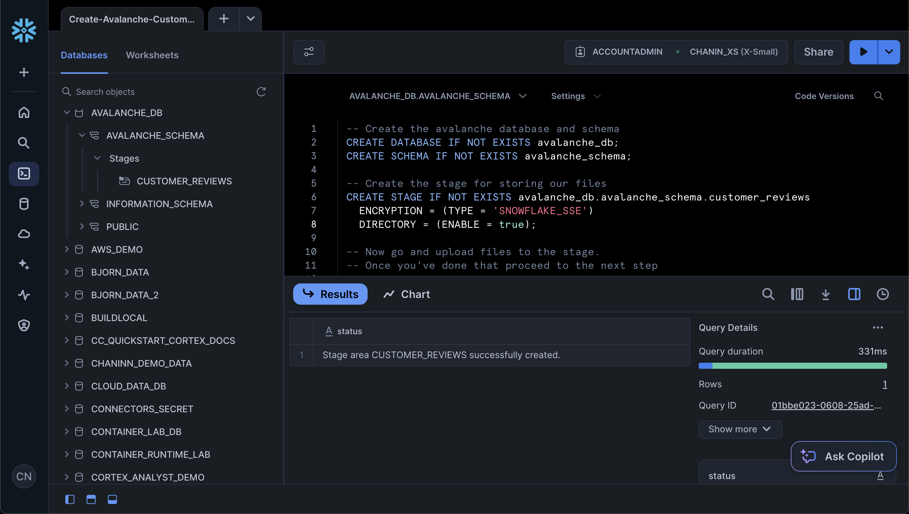

### Upload data to stage
Fourthly, download the Avalanche customer review data, which is comprised of customer reviews for a hypothetical winter sports gear company. The customer review data is in DOCX format and can is available as [customer_reviews_docx.zip](https://github.com/Snowflake-Labs/snowflake-demo-notebooks/blob/main/Avalanche-Customer-Review-Analytics/customer_reviews_docx.zip).

And upload the 100 DOCX files to the stage. Particularly, from Snowsight click on the "Data" icon from the menu bar located in the left panel. Next, click on "Databases" and in the next panel navigate through the database hierarchy as follows:

AVALANCHE_DB > AVALANCHE_SCHEMA > Stages > CUSTOMER_REVIEWS

Then, in the top-right hand corner click on the blue "+ Files" button. Followed by browsing to and selecting the 100 DOCX files of the customer review data that we had unzipped from the `customer_reviews_docx.zip file.

You'll see a modal pop-up where you can upload the 100 DOCX files:

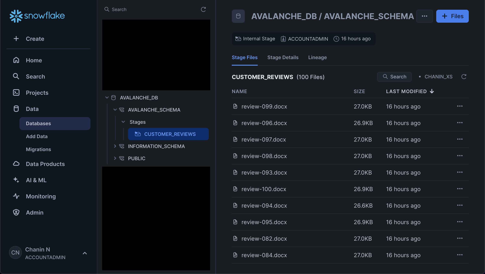

Afterwards, you'll see the files listed in the main panel. Also make note of the previously mentioned hierarchical list of the database, schema and stage that we navigated through:

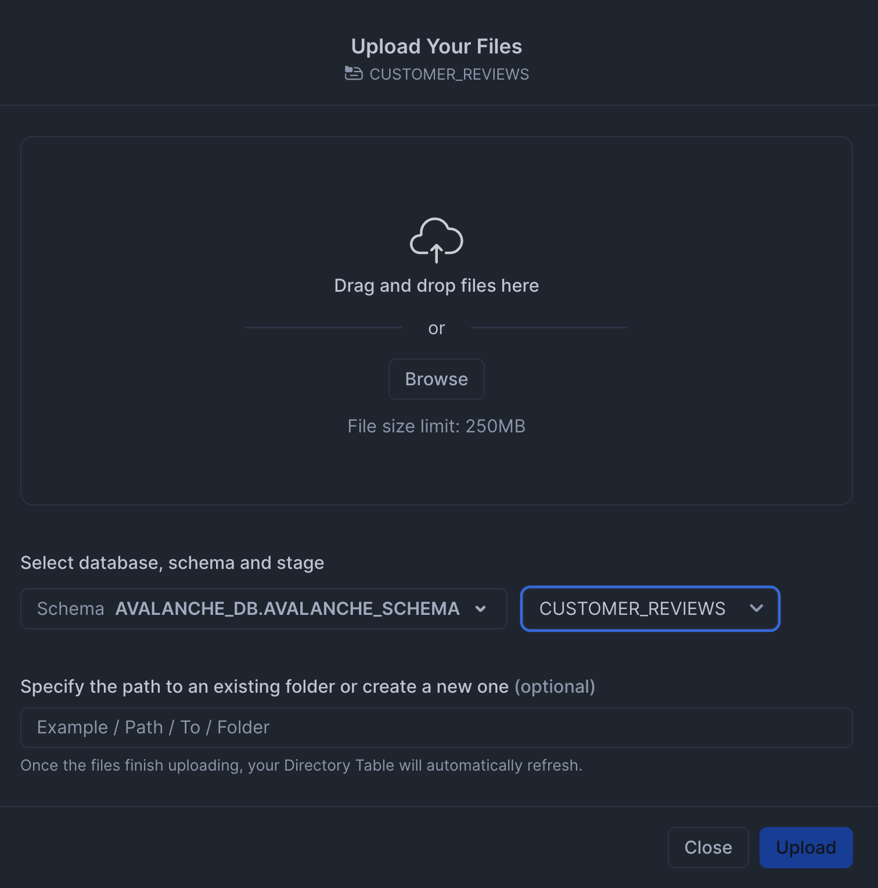


### List contents of a stage
Finally, we can verify that the files have been uploaded successfully to the stage by opening up a SQL worksheet, from the left menu sidebar go to Projects > Worksheets > + (Create SQL Worksheet)

Next, enter the following in a SQL worksheet:

```sql
 ls @avalanche_db.avalanche_schema.customer_reviews
```

This should yield the following results output:

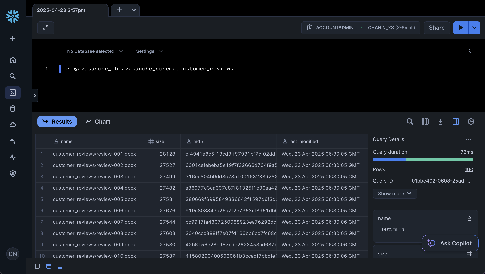

### Download the Notebook

Finally, before proceeding further to the next step, you can click on [Avalanche-Customer-Review-Analytics.ipynb](https://github.com/Snowflake-Labs/snowflake-demo-notebooks/blob/main/Avalanche-Customer-Review-Analytics/Avalanche-Customer-Review-Analytics.ipynb) to download the Notebook from GitHub.

Snowflake Notebooks come pre-installed with common Python libraries for data science and machine learning, such as `numpy`, `pandas`, `matplotlib`, and more! If you are looking to use other packages, click on the Packages dropdown on the top right to add additional packages to your notebook.

<!-- ------------------------ -->
## Retrieving Customer Review Data

Open up the [Avalanche-Customer-Review-Analytics.ipynb](https://github.com/Snowflake-Labs/snowflake-demo-notebooks/blob/main/Avalanche-Customer-Review-Analytics/Avalanche-Customer-Review-Analytics.ipynb) notebook as downloaded in the previous step to follow along this step onwards.

### Extracting Data from DOCX Files

Our first step is to query and parse the content from DOCX files stored in the Snowflake stage. We'll use the `SNOWFLAKE.CORTEX.PARSE_DOCUMENT` function to extract the content from these files.

```sql
-- Parse content from DOCX files
WITH files AS (
  SELECT 
    REPLACE(REGEXP_SUBSTR(file_url, '[^/]+$'), '%2e', '.') as filename
  FROM DIRECTORY('@avalanche_db.avalanche_schema.customer_reviews')
  WHERE filename LIKE '%.docx'
)
SELECT 
  filename,
  SNOWFLAKE.CORTEX.PARSE_DOCUMENT(
    @avalanche_db.avalanche_schema.customer_reviews,
    filename,
    {'mode': 'layout'}
  ):content AS layout
FROM files;
```

This query does the following:
1. Creates a CTE (Common Table Expression) named `files` that extracts the filenames from the file URLs
2. Filters for only DOCX files
3. Uses the `PARSE_DOCUMENT` function to extract the content from each file in "layout" mode
4. Returns the filename and the extracted content as a result set

The `PARSE_DOCUMENT` function is particularly useful for extracting text from various document formats, including DOCX, PDF, and others. The "layout" mode preserves the document's structure, making it easier to extract specific sections.

Running the above query should yield the following table output: 

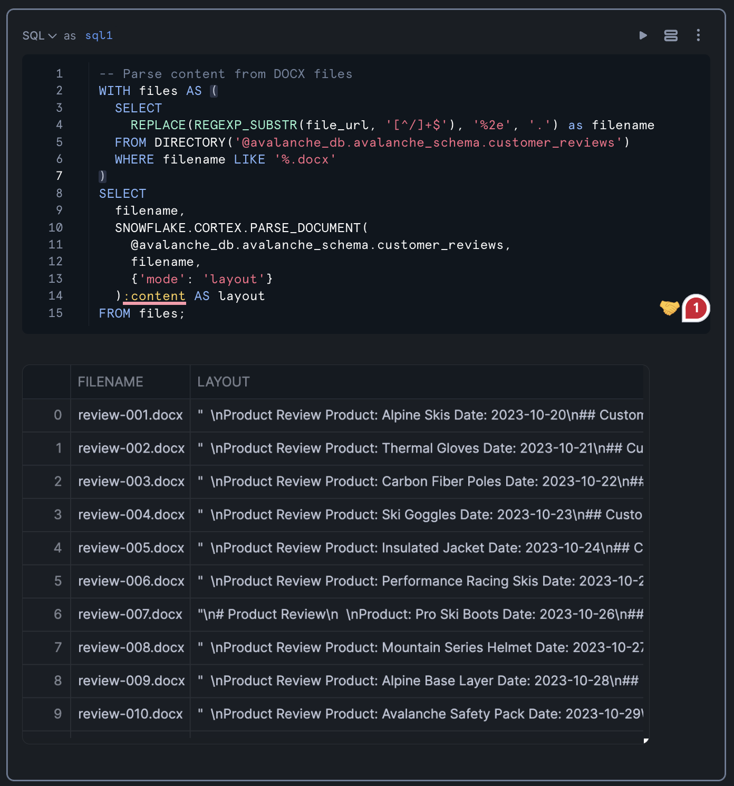

<!-- ------------------------ -->
## Reshaping the Data

### Structuring the Extracted Content

Now that we have the raw content from the .DOCX files, we need to reshape it into a more structured format. We'll use regular expressions to extract specific information such as product name, date, and the customer review text.

👀 NOTE: Depends on the output from [this step](#retrieving-customer-review-data)

```sql
-- Extract PRODUCT name, DATE, and CUSTOMER_REVIEW from the LAYOUT column
SELECT 
  filename,
  REGEXP_SUBSTR(layout, 'Product: (.*)', 1, 1, 'e', 1) as product,
  REGEXP_SUBSTR(layout, 'Date: (202[0-9]-[0-9]{2}-[0-9]{2})', 1, 1, 'e') as date,
  REGEXP_SUBSTR(layout, '## Customer Review\\n\\n(.*)', 1, 1, 'e', 1) as customer_review
FROM table(result_scan(last_query_id())); -- assuming you ran last query from Section 3
```

This query uses `REGEXP_SUBSTR` to extract:
- The product name (between "Product: " and " Date:")
- The date (in the format YYYY-MM-DD)
- The customer review text (everything after "## Customer Review")

The regular expression patterns are designed to match the specific structure of the documents, extracting only the relevant information. This transformation converts unstructured text into a structured format that's easier to analyze.

You can also combine this query into one combined query using [Snowflake's Flow Operator](https://docs.snowflake.com/en/sql-reference/operators-flow)

It should look something like this

**‼️ Please note, this is an alternate implementaiton on above code.**

```sql
WITH files AS (
  SELECT 
    REPLACE(REGEXP_SUBSTR(file_url, '[^/]+$'), '%2e', '.') as filename
  FROM DIRECTORY('@avalanche_db.avalanche_schema.customer_reviews')
  WHERE filename LIKE '%.docx'
)
SELECT 
  filename,
  SNOWFLAKE.CORTEX.PARSE_DOCUMENT(
    @avalanche_db.avalanche_schema.customer_reviews,
    filename,
    {'mode': 'layout'}
  ):content AS layout
FROM files
->> --Flow Operator
SELECT 
  filename,
  REGEXP_SUBSTR(layout, 'Product: (.*)', 1, 1, 'e', 1) as product,
  REGEXP_SUBSTR(layout, 'Date: (202[0-9]-[0-9]{2}-[0-9]{2})', 1, 1, 'e') as date,
  REGEXP_SUBSTR(layout, '## Customer Review\\n\\n(.*)', 1, 1, 'e', 1) as customer_review
FROM $1;
```
The result table should look like the following:

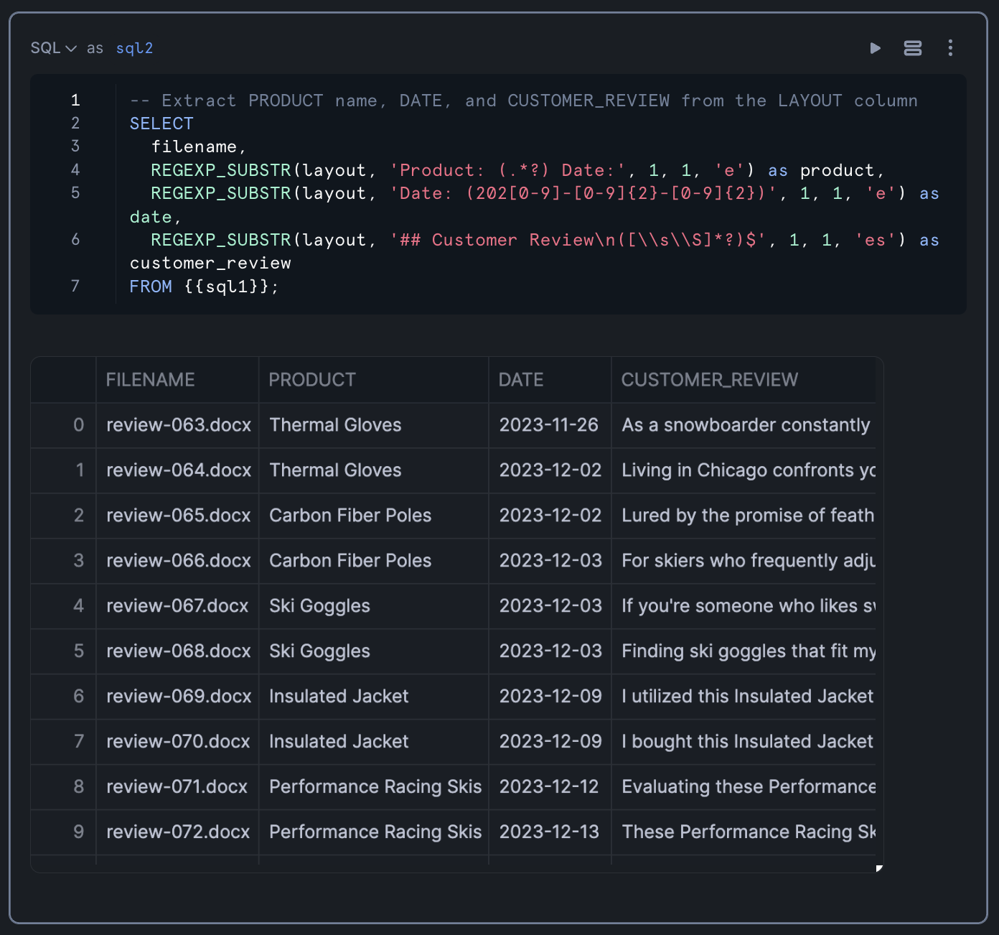

### Applying AI on the Data with Cortex

With our data now in a structured format, we can apply Snowflake's Cortex LLM functions to perform advanced text analysis. We'll use three key functions:

1. `TRANSLATE`: To convert any non-English reviews to English
2. `SUMMARIZE`: To create concise summaries of the reviews
3. `SENTIMENT`: To analyze the sentiment of each review

```sql
-- Perform translation, summarization and sentiment analysis on customer review
SELECT 
    product,
    date,
    SNOWFLAKE.CORTEX.TRANSLATE(customer_review, '', 'en') as translated_review,
    SNOWFLAKE.CORTEX.SUMMARIZE(translated_review) as summary,
    SNOWFLAKE.CORTEX.SENTIMENT(translated_review) as sentiment_score
FROM previous_query_result
ORDER BY date;
```

This query:
- Takes the structured data from our previous step
- Translates any non-English reviews to English (the empty string as the second parameter tells the function to auto-detect the source language)
- Creates a summary of each translated review
- Calculates a sentiment score for each review
- Orders the results by date

The sentiment score is a numerical value that indicates the overall sentiment of the review, with positive values indicating positive sentiment and negative values indicating negative sentiment.

Results from the query is shown below:

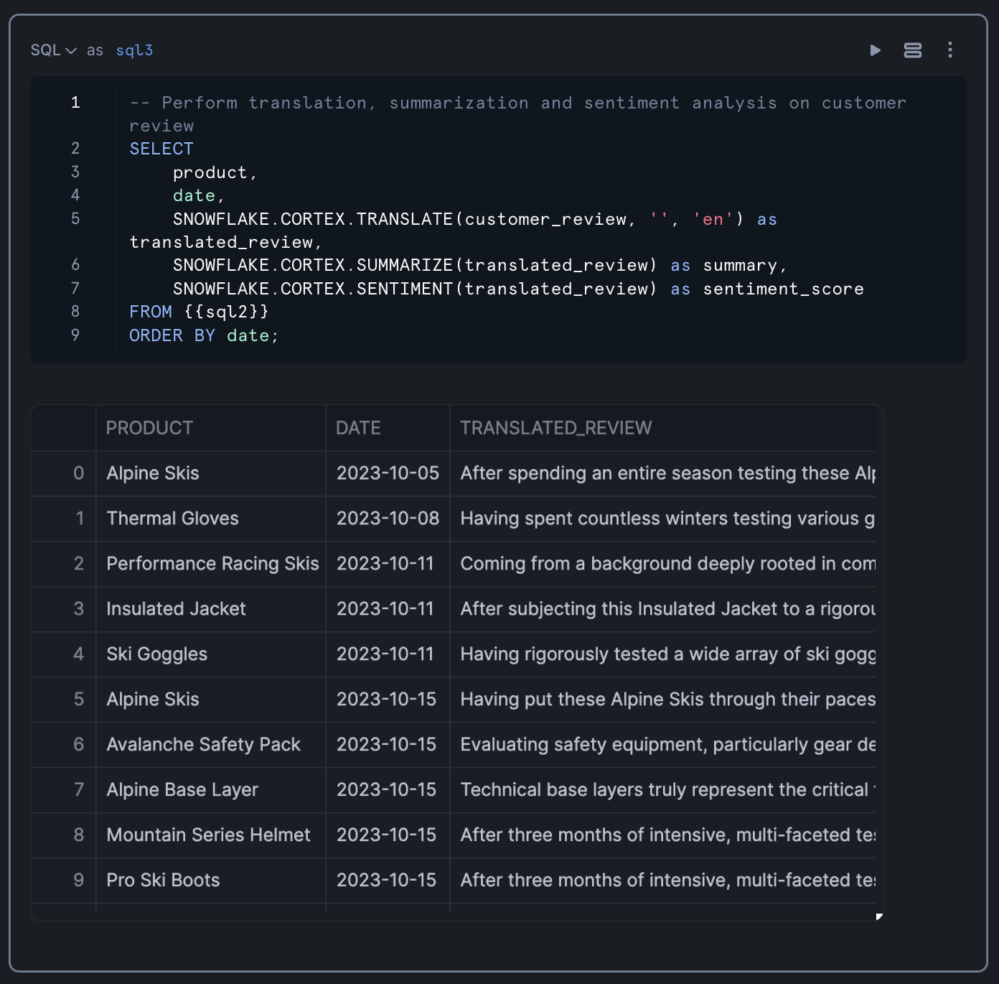

### Converting SQL Results to a Pandas DataFrame

To prepare for visualization, we'll convert the SQL results to a Pandas DataFrame:

```python
df = sql_result.to_pandas()
```

This conversion allows us to use Python's data visualization libraries to create interactive charts and graphs.

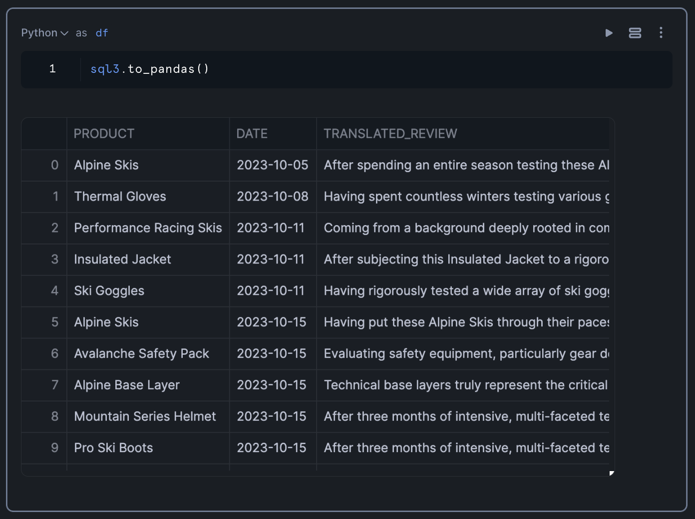

<!-- ------------------------ -->
## Create Visualizations

### Build Interactive Charts with Streamlit and Altair

Now that we have our processed data in a Pandas DataFrame, we can create visualizations to gain insights into the sentiment of customer reviews. We'll use Streamlit for the interactive dashboard and Altair for the charts.

### Calculate Daily Sentiment Scores

First, let's create a bar chart showing sentiment scores by date:

```python
import streamlit as st
import altair as alt
import pandas as pd

# Ensure SENTIMENT_SCORE is numeric
df['SENTIMENT_SCORE'] = pd.to_numeric(df['SENTIMENT_SCORE'])

# Create the base chart with bars
chart = alt.Chart(df).mark_bar(size=15).encode(
    x=alt.X('DATE:T',
            axis=alt.Axis(
                format='%Y-%m-%d',  # YYYY-MM-DD format
                labelAngle=90)  # Rotate labels 90 degrees
            ),
    y=alt.Y('SENTIMENT_SCORE:Q'),
    color=alt.condition(
        alt.datum.SENTIMENT_SCORE >= 0,
        alt.value('#2ecc71'),  # green for positive
        alt.value('#e74c3c')   # red for negative
    ),
    tooltip=['PRODUCT:N', 'DATE:T'] # Add tooltip
).properties(
    height=500
)

# Display the chart
st.altair_chart(chart, use_container_width=True)
```

This chart:
- Shows sentiment scores over time
- Uses green for positive sentiment and red for negative sentiment
- Includes tooltips that show the product name and date when hovering over a bar
- Rotates date labels for better readability

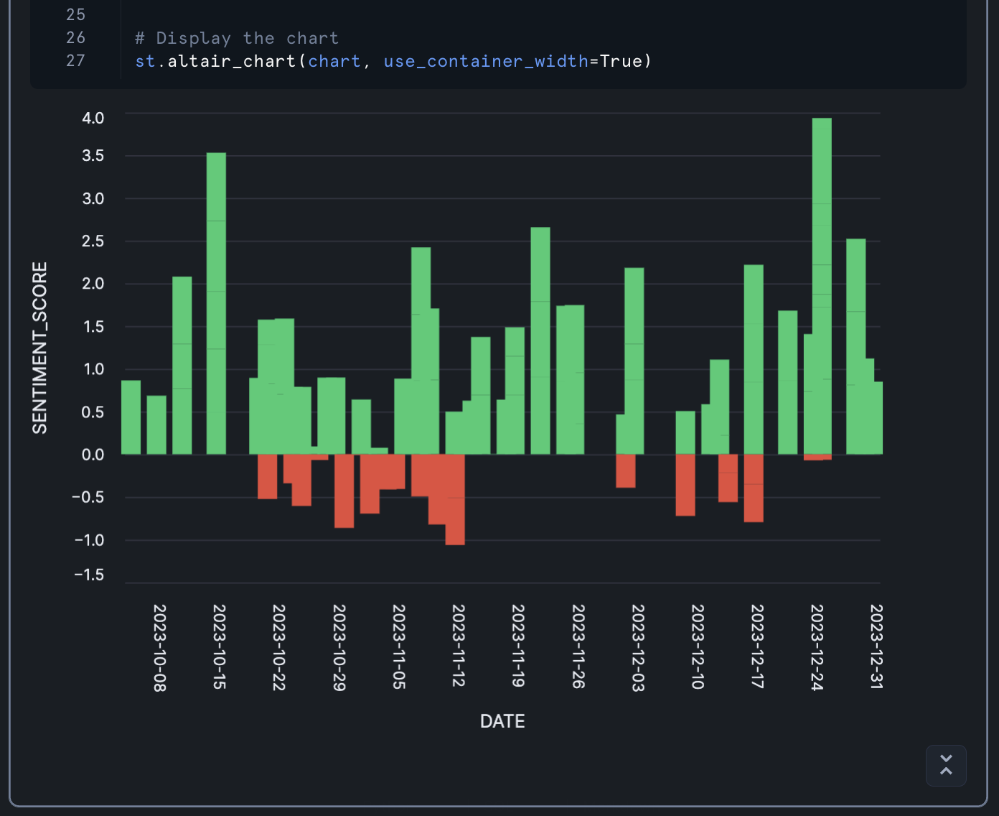

### Calculate Product Sentiment Scores

Next, let's create a bar chart showing average sentiment scores by product:

```python
import streamlit as st
import altair as alt
import pandas as pd

# Create the base chart with aggregation by PRODUCT
bars = alt.Chart(df).mark_bar(size=15).encode(
    y=alt.Y('PRODUCT:N', 
            axis=alt.Axis(
                labelAngle=0,  # Horizontal labels
                labelOverlap=False,  # Prevent label overlap
                labelPadding=10  # Add some padding
            )
    ),
    x=alt.X('mean(SENTIMENT_SCORE):Q',  # Aggregate mean sentiment score
            title='MEAN SENTIMENT_SCORE'),
    color=alt.condition(
        alt.datum.mean_SENTIMENT_SCORE >= 0,
        alt.value('#2ecc71'),  # green for positive
        alt.value('#e74c3c')   # red for negative
    ),
    tooltip=['PRODUCT:N', 'mean(SENTIMENT_SCORE):Q']
).properties(
    height=400
)

# Display the chart
st.altair_chart(bars, use_container_width=True)
```

This chart:
- Shows average sentiment scores for each product
- Uses the same color scheme as the previous chart
- Includes tooltips that show the product name and average sentiment score

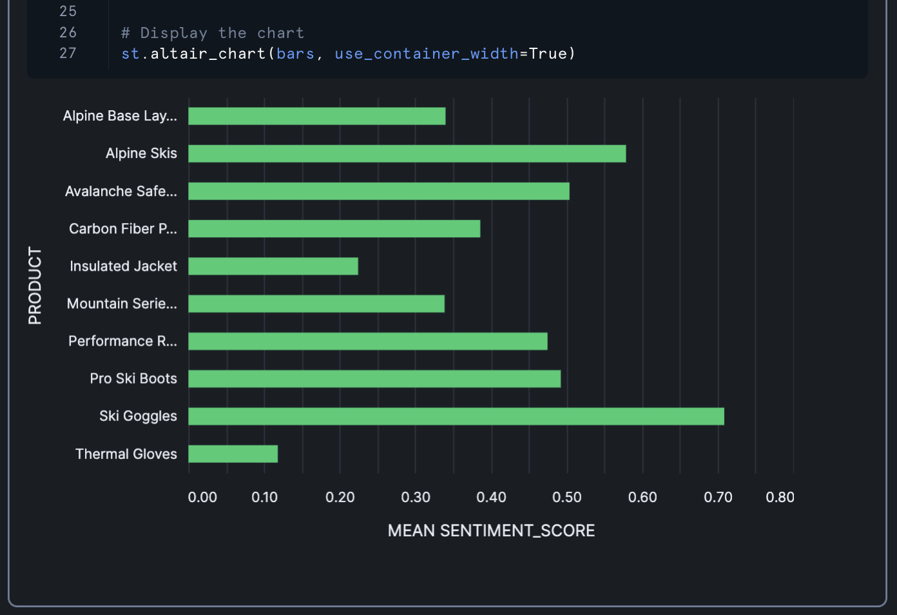

### Add Download Button

Finally, let's add a download button so users can export the processed data:

```python
# Download button for the CSV file
st.subheader('Processed Customer Reviews Data')
st.download_button(
    label="Download CSV",
    data=df[['PRODUCT', 'DATE', 'SUMMARY', 'SENTIMENT_SCORE']].to_csv(index=False).encode('utf-8'),
    mime="text/csv"
)
```

This button allows users to download a CSV file containing the product name, date, summary, and sentiment score for each review.

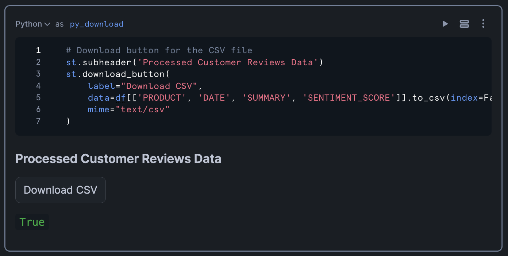


<!-- ------------------------ -->
## Conclusion And Resources

Congratulations! You've successfully built an end-to-end workflow for creation of a customer review analytics dashboard that processes unstructured text data and finally visualizes sentiment trends. This pipeline demonstrates how to leverage Snowflake's data processing capabilities and Cortex LLM functions to process and extract valuable insights from customer feedback.

By analyzing sentiment across products and time periods, businesses can identify trends, address customer concerns, and improve their products and services. The interactive visualizations make it easy to spot patterns and outliers, enabling data-driven decision-making.

### What You Learned
- Extracted and parsed content from DOCX files stored in Snowflake
- Reshaped unstructured data into a structured format using SQL and regular expressions
- Applied Snowflake Cortex LLM functions for text translation, summarization, and sentiment analysis
- Created interactive visualizations with Streamlit and Altair
- Built a complete analytics pipeline for customer review data

### Related Resources

- [Fork Notebook on GitHub](https://github.com/Snowflake-Labs/snowflake-demo-notebooks/blob/main/Avalanche-Customer-Review-Analytics/Avalanche-Customer-Review-Analytics.ipynb?_fsi=QzKQ5lY6&_fsi=QzKQ5lY6&_fsi=9zGgF6Cf)
- [Read Medium Blog](https://medium.com/snowflake/towards-building-a-customer-review-analytics-dashboard-with-snowflake-and-streamlit-3decdde91567)

Documentation:
- [PARSE_DOCUMENT](https://docs.snowflake.com/en/user-guide/snowflake-cortex/parse-document)
- [Snowflake Cortex](https://docs.snowflake.com/en/user-guide/snowflake-cortex/llm-functions)
- [Snowflake Documentation](https://docs.snowflake.com/)
- [Streamlit Documentation](https://docs.streamlit.io/)
- [Altair Documentation](https://altair-viz.github.io/)

Happy coding!
