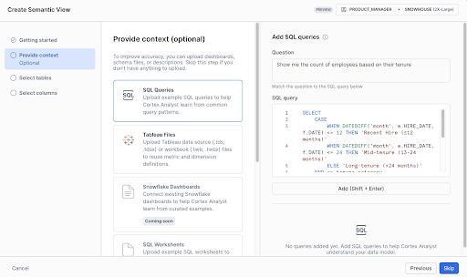

author: Abhinav Vadrevu
id: best-practices-semantic-views-cortex-analyst
language: en
summary: Learn best practices for designing high-quality semantic views for Cortex Analyst using Snowflake’s AI-assisted “autopilot” workflow.
categories: snowflake-site:taxonomy/solution-center/ai-ml/quickstart
environments: web
open in snowflake link: https://app.snowflake.com/_deeplink/#/cortex/analyst?utm_source=snowflake-devrel&utm_medium=developer-guides&utm_content=best-practices-to-building-cortex-agents&utm_cta=developer-guides-deeplink
status: Published

# Best Practices for Creating Semantic Views for Cortex Analyst

## Overview

Creating high-quality semantic views is the foundation for delivering accurate, intuitive, and trustworthy answers in Cortex Analyst.

This guide walks through best practices for designing and building semantic views using [**Autopilot**](https://docs.snowflake.com/en/user-guide/views-semantic/overview), Snowflake’s AI-assisted, UI-based workflow. 

Autopilot is the fastest way to create high-quality semantic views, whether you’re new to the specification or refining a production model. Powered by AI and LLMs, it simplifies setup by auto-generating descriptions, offering smart modeling suggestions, and letting you start from existing dashboards or SQL—so your views are organized, explainable, and optimized for performance and accuracy.



**When to use the SQL API**

If you prefer to build semantic views programmatically using SQL (for example, for CI/CD pipelines), use the [SQL-focused semantic view guide](https://www.snowflake.com/en/developers/guides/snowflake-semantic-view/) instead. 
- It’s ideal for CI/CD or integration pipelines
- It provides flexibility for teams who want to script or automate their semantic view creation

### What You’ll Learn

- Core semantic view design principles
- How to scope, organize, and route semantic views by business domain
- How to improve accuracy with descriptions, metrics, filters, verified queries, and custom instructions
- How to test and iterate using evaluation sets and feedback loops
- Common pitfalls and how to avoid them

### What You’ll Need

- A Snowflake account with access to Snowsight
- One or more tables you want to expose through Cortex Analyst


## Semantic view design principles

**Core philosophy: Think like your end users**

- Design from the end-user perspective, not the database perspective
- Use business terminology, not technical table names
- Ask: “If I were explaining this data to a business stakeholder, how would I describe it?”

### Organization strategy

**Organize by business domain:**

- Structure semantic views by business topic/domain (for example: Sales, Marketing, Customer Support)
- Keep models focused — don’t try to cover everything in one model unless necessary
- Split by use case rather than by data structure

**Good examples:**

- Sales Performance semantic view
- Customer Support Metrics semantic view
- Marketing Campaign Analysis semantic view

**Avoid:**

- “All CRM Tables” semantic view

### Routing vs. single semantic view

Cortex Analyst no longer has hard limitations on semantic view size. However, it may still make sense to break up large semantic views in the following cases:

1. You have distinct business domains that don’t need to be joined
2. Different user groups need different views of the data

### Routing best practices:

- Use clear, distinct semantic view descriptions to improve routing performance
- Split by use case (Sales vs. Legal vs. Marketing), not by similarity
- Having multiple very similar semantic view descriptions will reduce routing accuracy
- Note: routing adds slight latency (~a few seconds for reranking)
- Routing will NOT join across semantic views — each model is independent
- Customers have tested successfully with 50+ semantic views in production, but fewer views generally perform better

**When to use a single larger semantic view instead:**

- You have densely connected tables that frequently need to be joined
- There is a single business domain with many related tables
- You are using frontier models where pruning enables larger semantic views (for example, Claude or GPT)

## Building Your Semantic View

### Tables and columns

**Table limits:**

- Even without strict limits, start with 5–10 tables for an initial POC to make debugging easier
- As the use case grows, consider splitting into multiple semantic views and using routing when it makes sense

**Column selection:**

- Include only business-relevant columns that will be used in SQL generation
- Use the litmus test: “Will my end users ask about this?”

### Descriptions: the most important element

High-quality descriptions are not optional—they are required because they directly determine model accuracy and answer quality. LLMs cannot reliably infer proprietary terms, so explicit, authoritative descriptions are necessary to ensure correct and consistent results.

**Good table description:**

```yaml
description: "Daily sales data by product line, aligned with
'Cost of Goods Sold' (COGS) and forecasted revenue. Use this
table to analyze sales trends and profit by product."
```

**Poor table description:**

```yaml
description: "Sales table" # Too vague
```

**Good column description:**

```yaml
- name: csat_score
  description: "Customer Satisfaction Score (CSAT): measures
  customer satisfaction on a scale of 1-5, where 5 is most
  satisfied. Also referred to as KPI_1 in legacy systems."
```

**Poor column description:**

```yaml
- name: csat_score
  description: "Score" # Assumes knowledge
```

### Synonyms: no longer recommended

Current guidance is to *avoid* synonyms unless you have unique or industry-specific cases that the model is unlikely to know:

- Recent evaluations with frontier models show that adding synonyms doesn’t add significant value
- Synonyms typically consume tokens without meaningful accuracy improvement
- Synonyms remain available in the specification for edge cases

### Relationships

Cortex Analyst will not join tables unless relationships are explicitly defined in the semantic view. Make sure to define all required relationships.

**Many-to-many relationships:**

- Currently, these are not directly supported
- Workaround: create a shared dimension table to bridge the gap
  - This allows two many-to-one relationships to simulate many-to-many behavior

### Metrics and filters

Metrics are pre-defined calculations:

```yaml
metrics:
  - name: total_revenue
    description: "Sum of all order revenue, calculated as unit price × quantity"
    expr: SUM(unit_price * quantity)

  - name: average_order_value
    description: "Average revenue per order"
    expr: SUM(revenue) / COUNT(DISTINCT order_id)
```

Filters describe reusable WHERE-clause logic:

```yaml
filters:
  - name: active_customers
    description: "Customers with purchases in the last year"
    expr: last_purchase_date >= DATEADD(year, -1, CURRENT_DATE())
```

### Best practices:

- Metrics and filters are often underused but are critical for accuracy
- Define metrics and filters wherever possible
- If available in your workflow, use “get more suggestions” (often driven by adding high-quality verified queries)

## After initial setup - increasing accuracy

Once you have your basic semantic view structure, these features are essential for production-quality accuracy. Don’t skip these — they’re what separate a working POC from a trusted production system.

### Verified queries

**Why add verified queries?**

- The model gets access to verified queries only when the user’s question is semantically similar, so they generally don’t meaningfully increase token usage
- Verified queries are essential for improving accuracy
- They also help generate other improvements (filters, metrics, descriptions, and more) from good examples of “gold SQL”

**How many to add:**

- The more the better — there’s no meaningful upper limit
- Start with 10–20, covering your most common questions, and add more based on real user questions over time
- Use suggestion panels (if available) driven by query history and usage data

### Custom instructions

The most common mistake with custom instructions is mixing up the two instruction types.

“SQL generation” custom instructions are applied during SQL generation for all queries.

**Use cases:**

- Business-specific SQL logic
- Default filters or calculations
- Fiscal year definitions
- Data quirks or idiosyncrasies

Example:

```yaml
module_custom_instructions:
  sql_generation: |-
    - "Our fiscal year starts on February 1st, not January 1st"
    - "When calculating revenue, always use net_revenue (revenue minus returns), not gross_revenue"
    - "Always apply the is_paying_customer filter by default unless the user specifically asks about all customers"
    - "The product_id column in orders table maps to id column in products table, even though naming differs"
```

“Question categorization” (classification) custom instructions apply only to question understanding. They tell Cortex Analyst when to reject questions vs. accept them and when to ask clarifying questions.

Example:

```yaml
module_custom_instructions:
  question_categorization: |-
    # Rejection examples
    - "Reject questions about employee salaries or compensation"
    - "Reject questions containing profanity or inappropriate content"

    # Disambiguation examples
    - "When users ask about 'active users', clarify whether they mean users active in last 90 days"
```

### Best practices for custom instructions:

1. Be specific
   - Good: “If no date filter is provided, apply a filter for the last year”
   - Bad: “Filter queries for the last year”
2. Always test after adding instructions
   - The playground is a great way to quickly test changes

### Cortex Search services

Cortex Search services enable fuzzy matching for text columns where user input won’t match your data exactly.

*When you need this:*

- Product names (for example: “iPhone 13” vs “Apple iPhone 13 - 128GB Blue”)
- Customer names (for example: “John Smith” vs “Smith, John A.”)
- Company names (for example: “Microsoft” vs “Microsoft Corporation”)
- Venue names (for example: “Madison Square Garden” vs “MSG - Madison Square Garden Arena”)

*Common mistakes:*

- Using search services with numeric or date columns
- Using them with paragraph-style text fields (notes, descriptions, comments)

## Testing and Iteration

### Create an evaluation set

Build your benchmark questions:

- Start with ~10 representative questions
- Source from business users, existing dashboards, or actual usage
- Cover different complexity levels and use cases

### Measure accuracy

Available tools:

- The best way to measure accuracy is to use the [OSS Streamlit evaluation tool](https://github.com/Snowflake-Labs/semantic-model-generator/)
- A Snowsight native evaluation experience may be available depending on product timing

### Iterative improvement workflow

- Use suggestions panels and feedback loops to add verified queries from real usage data
- As you collect more verified queries, you can improve metrics, filters, custom instructions, and descriptions to align more closely with real user behavior

## Common Pitfalls and How to Avoid Them

### Undefined scope

What happens: stakeholders keep adding “just one more thing” to the POC  
Solution: define crisp success criteria upfront with clear boundaries

### Starting too big

What happens: trying to model an entire enterprise data warehouse from day one  
Solution: start with 5–10 tables, one business domain, and a specific use case

### Choosing not to use verified queries

What happens: accuracy is inconsistent, especially on common questions  
Solution: add 10–20 verified queries covering frequent questions from the start

### Wrong initial use case

What happens: starting with Finance/Legal where near-100% accuracy is required  
Solution: begin with lower-stakes domains like Sales/Marketing

## Your Production-Ready Checklist

### Foundation:

✅ Every table has a clear business description\
✅ Every column has a clear description\
✅ Proprietary terms and abbreviations are explained

### Critical features:

✅ 10–20 verified queries covering common questions\
✅ Custom instructions for business-specific logic\
✅ Cortex Search services for all high-cardinality text columns\
✅ Metrics defined for reusable calculations\
✅ Filters defined for common conditions

### Testing (recommended before deployment):

✅ Evaluation set created\
✅ SQL accuracy measured with an evaluation tool

### Ongoing optimization:

✅ Weekly review of suggestions and feedback data\
✅ Process for adding new verified queries and related suggestions is in place