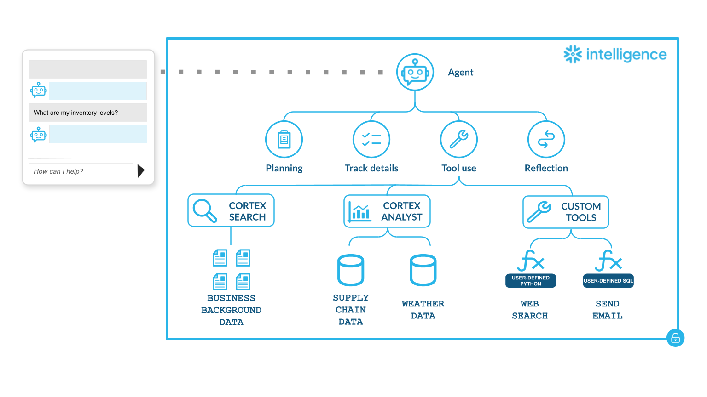
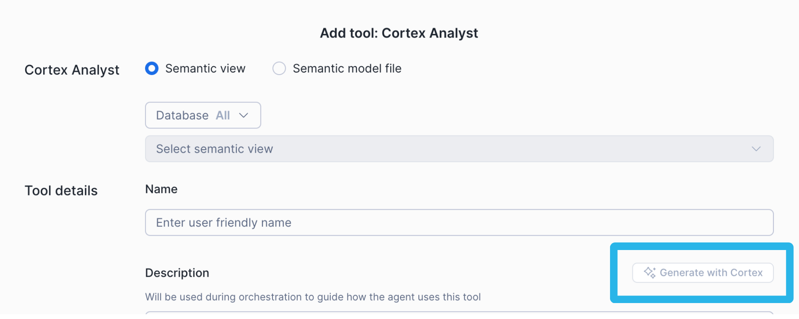
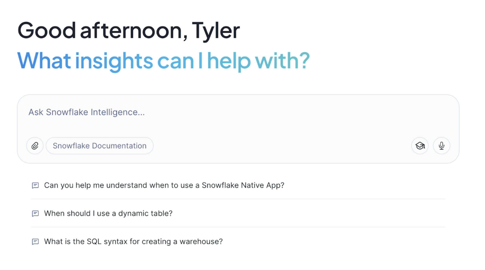
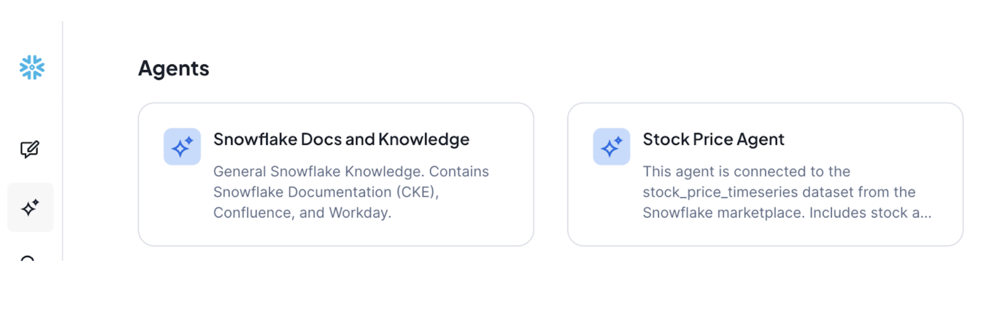
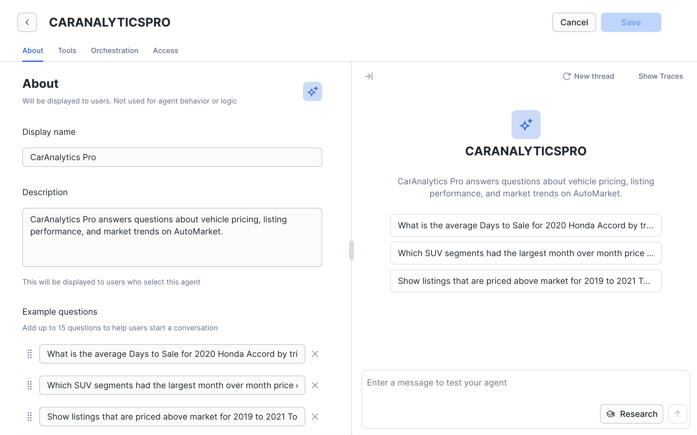

id: best-practices-to-building-cortex-agents
language: en
summary: Learn how to build, deploy, and monitor high-quality Cortex Agents in Snowflake Intelligence, following best practices for orchestration, tooling, and evaluation.
author: ShenWang, Tyler Richards, Krista Muir, Josh Reini, James Cha-Earley
categories: snowflake-site:taxonomy/solution-center/certification/quickstart
environments: web
open in snowflake link: https://app.snowflake.com/_deeplink/#/agents?utm_source=snowflake-devrel&utm_medium=developer-guides&utm_content=best-practices-to-building-cortex-agents&utm_cta=developer-guides-deeplink
status: Published


# Best Practices for Building Cortex Agents

### Overview

Agents represent a new paradigm for how work gets done with data. Instead of pre-defined dashboards or static queries, agents reason through tasks, choose the right tools, and deliver results in natural language or take actions on your behalf.

You can create, update, and deploy these high-quality agents directly inside your Snowflake environment. Snowflake Agents integrate directly with [Snowflake Intelligence](https://ai.snowflake.com/) with governance, observability, and performance built in.

This guide is your map to building agents for use with Snowflake Intelligence, from idea to production, including links to deeper resources, examples, and tutorials along the way.

### What you'll learn
- How Snowflake Intelligence and Cortex Agents work together.
- How to define agent purpose and scope.
- How to configure orchestration and response instructions.
- How to design effective tools for Cortex Agents.
- How to evaluate and monitor agent performance.

**Important:** Before building Cortex Agents, [configure your permissions](https://docs.snowflake.com/en/user-guide/snowflake-cortex/snowflake-intelligence#set-up-sf-intelligence) and make sure that you have [access to the right models](https://docs.snowflake.com/en/user-guide/snowflake-cortex/snowflake-intelligence#supported-models-and-regions).

## How Snowflake Intelligence works

Cortex Agents power the reasoning behind Snowflake Intelligence, turning natural language into governed actions and answers.

Cortex Agents combine reasoning from large language models with Snowflake’s governance, data access, and observability layers to deliver accurate, explainable answers. When a user asks a question in Snowflake Intelligence, it uses [Cortex Agents](https://docs.snowflake.com/en/user-guide/snowflake-cortex/cortex-agents) under the hood with the following stages.

1.  **User input:** A user submits a natural-language question. For example, *“How are Q4 sales trending?”*.
2.  [**Cortex Agent API**](https://docs.snowflake.com/en/user-guide/snowflake-cortex/cortex-agents-rest-api): The question is routed to the **Cortex Agent API**, which powers Snowflake Intelligence.
3.  **Orchestration:** The orchestrator (an LLM) interprets intent, selects the right tools, and plans the sequence of actions. It may use one tool, chain several together, or decide that the question is out of scope.
4.  **Tool execution:**
    -   [Cortex Analyst](https://docs.snowflake.com/en/user-guide/snowflake-cortex/cortex-analyst): Write and run SQL on your semantic views for structured data.
    -   [Cortex Search](https://docs.snowflake.com/en/user-guide/snowflake-cortex/cortex-search/cortex-search-overview): Retrieve relevant document text for unstructured data.
    -   Custom Tools: Execute user-defined functions or stored procedures for actions.
5.  **Reflection & response:** The orchestrator reviews results, refines if needed, and generates the final answer (including summaries, tables, or charts) shown in the Snowflake Intelligence UI.

The following image describes this structure of Snowflake Intelligence.


*👉 Read the blog to learn more about [how Snowflake Intelligence orchestration works](https://www.snowflake.com/en/engineering-blog/inside-snowflake-intelligence-enterprise-agentic-ai/)*


## Building Cortex Agents

[Cortex Agents](https://docs.snowflake.com/en/user-guide/snowflake-cortex/cortex-agents) are configurable reasoning systems that combine Snowflake’s built-in intelligence with your domain context.

You can build and run agents in two ways:

1.  **Agent UI in Snowsight:** An interactive interface that handles identity, access control, and monitoring out of the box.
2.  [**Cortex Agent API**](https://docs.snowflake.com/en/user-guide/snowflake-cortex/cortex-agents-rest-api): A REST API for integrating agents into your own applications (like Streamlit apps or custom apps).

Consider the following when building an agent.

### Define your agent's purpose

Every great agent starts with a clear purpose. Before adding tools or writing instructions, define why the agent exists, who it serves, and what specific questions it should answer. This step shapes everything that follows, from tool selection to performance and trust.

Start with an end user, and think through what they would actually want: *what specific job is this agent meant to do, and for whom? If they had 24/7 access to a data analyst who reads incredibly quickly and has single-digit minute response times, what would they ask of them?*

### Favor narrowly-scoped specialized agents

Don’t boil the ocean with a generalist agent. Start narrow with a specific, high-value use case. After an agent proves reliable in one area, you can replicate the pattern for others.

For example, you could have the following agents:
1.  One agent that analyzes your Shopify store’s recent sales and marketing data.
2.  One agent that sales can use to recommend the best SKUs to pitch to the retailer.

*👉*[*Read more about why single agents yield the best
results*](https://medium.com/@JamesChaEarley/356b8566d114)

### Map key use cases to tools

To get high-value, narrow use cases, partner with business stakeholders to identify the top 20 most important questions that they need answered. Use these questions as the initial scope for your agent.

If you were to answer that question using a set of documents or data, what would you use? Would you use the sales table, read a few Google docs (which ones?), or look up support tickets?

**How many tools should a single agent have?**
An agent should have access to exactly as many tools as it needs to fulfill its predefined, targeted purpose. In the previous guidance, you wrote down exactly what you needed to answer each question. This becomes the list of tools your agent needs access to.

For example, if you needed to write one set of SQL statements about your Shopify data, then read a Google doc, and finally read some support tickets when answering your question, your agent needs at least 3 separate components:
1.  A semantic view for your Shopify data
2.  A Cortex Search service to read your Google docs
3.  A Cortex Search service to read your support tickets

*👉[Lessons learned building agents from our data science
team](https://medium.com/snowflake/how-to-make-useful-data-science-agents-dbacbf1643b8)*

## Importance of Cortex Agent instructions

A well-written agent will run efficiently and reliably: calling the right tools, producing explainable results, and reflecting your business logic. Bad or incomplete instructions lead to missteps in reasoning, incorrect data retrieval, and wasted compute cost.

Every Cortex Agent combines your custom instructions with Snowflake’s built-in base system instructions. These base instructions inform general workflows for tool usage, data analysis patterns, validation, visualization, citation, and safety guardrails.

You **won’t** need to further instruct the agent on this base functionality. For example:

``` 
❌ DON'T include:
"When you receive a question, first analyze it carefully, then
select appropriate tools, call them in sequence, and format results properly..."
```

Your custom agent instructions are configured in 4 key layers, each playing a specific role to define how the agent reasons and responds with domain-specific context, rules, and workflows.
1.  [**Semantic views**](https://docs.snowflake.com/en/user-guide/views-semantic/overview#why-use-semantic-views) are configured inside your data layer. They act as translators, or “cheat sheets” between your raw, structured data and how humans or AI interpret it.
2.  **Orchestration instructions** are configured high-level business logic, rules, and multi-step workflows. These instruct the agent on how to approach answering a question.
3.  **Response instructions** control the final output format, tone, and communication style of the agent.
4.  **Tool descriptions** explain precisely what a tool does, which data it accesses, when to use it, and when *not* to use it. *This is the most critical factor for accurate tool selection.*

We’ll go into more detail for each instruction layer in the following sections.

## Semantic views (data level)

Each [semantic view](https://docs.snowflake.com/en/user-guide/views-semantic/overview) should cover a similar set of tables, and is instructions that tell the agent how to query or interpret the data. This is where you want to set data specific defaults, such as always adding a date filter for the past three months if not specified or always excluding internal accounts.

**Resources for semantic views:**
-   🎥 [Watch the hands-on lab](https://www.snowflake.com/en/webinars/virtual-hands-on-lab/from-sql-to-agentic-analytics-building-a-semantic-layer-with-ai-to-empower-snowflake-intelligence-2025-11-20/)
-   📖 [Get started with semantic views](https://medium.com/snowflake/getting-started-with-snowflake-semantic-view-7eced29abe6f)

## Orchestration instructions (agent level)

Orchestration instructions could include:

-   **Your agent’s identity and narrow scope** prevents scope creep and helps the agent stay focused on its intended purpose.

```
✅ ORCHESTRATION INSTRUCTION

Your Role: You are "SalesBot", a sales intelligence assistant for the Snowflake sales team. Your Scope: You answer questions about customer accounts, pipeline opportunities, deal history, and product usage. You help sales professionals prepare for customer meetings and track account health. 

Your Users: Account Executives (AEs), Solution Engineers (SEs), and Sales Leaders who need quick access to customer data and insights. 
 ```

-   **Domain context** helps the agent interpret questions correctly and use appropriate terminology.

```
✅ ORCHESTRATION INSTRUCTION

Domain Context 
- Snowflake uses a "consumption-based" pricing model where customers pay for compute (measured in credits) and storage separately.
- An "opportunity" represents a potential deal tracked in Salesforce with stages: Prospecting → Qualification → Proof of Value → Negotiation → Closed Won/Lost
- "ARR" (Annual Recurring Revenue) is the key metric for subscription value
- Our fiscal year runs Feb 1 - Jan 31
```

-   **Explicit tool selection logic** to prevent the agent from choosing the wrong tool and improve consistency.

```
✅ ORCHESTRATION INSTRUCTION

Tool Selection Guidelines:
- For questions about CURRENT customer data (accounts, usage, credits): Use the "CustomerData" tool.
    For example: "What's Acme Corp's credit usage?", "Show me active accounts"
- For questions about HISTORICAL trends and analytics: Use the "Analytics" tool.
    For example: "How has consumption grown over time?", "Compare Q1 vs Q2"
- For questions about sales pipeline and opportunities: Use the "SalesforcePipeline" tool.
    For example: "What deals are closing this quarter?", "Show me open opportunities"
```

-   **Boundaries and limitations** prevent hallucinations and inappropriate responses. Users will inevitably ask questions outside your agent's scope.

```
✅ ORCHESTRATION INSTRUCTION

Limitations and Boundaries:
- You do NOT have access to customer contracts or legal agreements.
    If asked, respond: "I don't have access to contract details. Please contact Legal."
- You do NOT have real-time data. Your data is refreshed daily at 2 AM UTC.
    If asked about "right now", clarify: "My data is current as of this morning's refresh."
- Do NOT calculate financial forecasts or make predictions about future revenue.
    You can show historical trends but should not extrapolate future values.
- Do NOT provide customer contact information (emails, phone numbers) for privacy reasons.

```

-   **Business rules and conditional logic** to ensure consistent handling of common scenarios, edge cases, and error conditions.

```
✅ ORCHESTRATION INSTRUCTION

Business Rules:
- When a user asks about a customer by name (not ID), ALWAYS use
CustomerLookup tool first to get the customer_id before calling other tools

- If a query result returns more than 100 rows, ALWAYS aggregate or
filter the data before presenting. Do NOT display all rows.

- For any consumption questions about dates within the last 7 days,
remind users that data has a 24-hour delay and today's data is not yet
available

- When multiple regions match a query, ALWAYS ask for clarification
rather than assuming which region the user meant

- If a tool returns an error code "INSUFFICIENT_PERMISSIONS", respond
with: "You don't have access to this data. Please contact your Snowflake admin to request access."
```

-   **Domain-specific workflows** to deliver consistency and reduce the need for users to ask complex multi-part questions.

```
✅ ORCHESTRATION INSTRUCTION

Account Summary Workflow:

When a user asks to "summarize my accounts" or "give me a book of
business update":

1. Use CustomerData tool to get the user's assigned accounts list
2. Use Analytics tool to show each account's':
    - Last 90-day consumption and growth rate
    - Total ARR and change from last quarter
3. Use SalesforcePipeline tool to show:
    - Top 5 open opportunities by value
    - Any opportunities closing in next 30 days
4. Use SupportTickets tool to flag any critical severity tickets in last 7 days

Present results in tables with clear sections.
```

## Response instructions (agent level)

These instructions control the final output format, tone, and communication style of the agent. Examples include:

-   **Tone and communication style:**

```
✅ RESPONSE INSTRUCTION

Response Style:
    - Be concise and professional - sales teams are busy
    - Lead with the direct answer, then provide supporting details
    - Be direct with data. Avoid hedging language like "it seems" or "it appears"
    - Use active voice and clear statements
```

-   **Data presentation formats**

```
✅ RESPONSE INSTRUCTION

Data Presentation:
    - Use tables for multi-row data (\>3 items)
    - Use charts for comparisons, trends, and rankings
    - For single values, state them directly without tables
    - Always include units (credits, dollars, %) with numbers
    - Include data freshness timestamp in responses
```

-   **Response structure templates**

```
✅ RESPONSE INSTRUCTION

Response Structure:

For "What is X?" questions:
    - Lead with direct answer
    - Follow with supporting context if relevant

    Response example: "Acme Corp used 12,450 credits last month (up 8% from September)."

For "Show me X" questions:
    - Brief summary sentence
    - Table or chart with data
    - Key insights or highlights

    Response example: "You have $2.4M in open Q4 pipeline across 12 opportunities. \[table\]"

For "Compare X and Y" questions:
    - Summary of comparison result
    - Chart showing comparison visually
    - Notable differences highlighted
```

-   **Error and edge case messaging**

```
✅ RESPONSE INSTRUCTION

Error Handling:
- When data is unavailable: "I don't have access to \[data type\]. You can find this information in \[alternative source\] or contact \[team\]."
- When query is ambiguous: "To provide accurate data, I need clarification: \[specific question\]. Did you mean \[option A\] or \[option B\]?"
- When results are empty: "No results found for \[criteria\]. This could mean \[possible reason\]. Would you like to try \[alternative approach\]?"
```


## Best practices between orchestration and response instructions

It’s important to separate orchestration (what to do, which tools) and response (how to format, tone) into distinct instruction settings. Don’t combine tool selection logic with response formatting in the same section.

To help categorize where instructions should live, ask yourself:

| Does this instruction affect... | Put it in... | Example                                          |
|--------------------------------------|------------------|------------------------------------------------------|
| Which tool to select                 | Orchestration    | "Use CustomerData for current metrics"               |
| What data to retrieve                | Orchestration    | "Include last 90 days of usage data"                 |
| How to interpret user intent         | Orchestration    | "When user says 'recent', use last 30 days"          |
| How to sequence tool calls           | Orchestration    | "Always call CustomerLookup before CustomerMetrics"  |
| Conditional logic and rules          | Orchestration    | "If result \> 100 rows, aggregate before displaying" |
| What to do in specific scenarios     | Orchestration    | "When error code X occurs, try alternative tool Y"   |
| How to format the answer             | Response         | "Use tables for multi-row results"                   |
| What tone to use                     | Response         | "Be concise and professional"                        |
| How to structure text                | Response         | "Lead with direct answer, then details"              |
| What to say when errors occur        | Response         | "Explain limitation and suggest alternatives"        |

## Tool descriptions (agent level)

These describe to the agent what types of things the tool (Semantic View, Search Service, or Custom Tool) can do, so it can infer when it would be best to call it.

**Tool descriptions are often the culprit for most agent quality problems.** Agents choose tools based on name and description context, so make them obvious. Bad tool descriptions create cascading failures, and can lead to downstream hallucinations.

While instructions set the agent's identity and scope, tool descriptions directly govern:
1.  **Tool selection accuracy**: Whether the agent picks the right tool for each question.
2.  **Parameter usage**: Whether the agent provides correct inputs to tools.
3.  **Error prevention**: Whether the agent avoids misusing tools or making invalid calls.
4.  **Consistency**: Whether the agent behaves predictably across similar questions.

### Step 1: Start with a clear, specific tool name

Tool names are loaded into the agent's context and influence selection.

Tip: Combine a *domain* (“Customer”, “Sales”) with a *function* (“Analytics”, “Search”) to make each tool unambiguous.

```
✅ GOOD: "CustomerConsumptionAnalytics"
❌ BAD: "DataTool" or "Tool1"

✅ GOOD: "SalesforcePipelineQuery"
❌ BAD: "Query" or "SalesData"

✅ GOOD: "ProductDocumentationSearch"
❌ BAD: "Search" or "Docs"
```

### Step 2: Write a purpose-driven tool description

A strong description tells the agent:

**\[What the tool does\] + \[What data it accesses\] + \[When to use it\] + \[When NOT to use it\]**

- **\[What data it accesses\] refers to what’s in your [semantic view](#semantic-views-data-level).** Include a concise summary of what’s in your semantic view. The agent first chooses tools based on their descriptions, not by inspecting your full data model.

- **"When NOT to Use" is critical.** Without it, agents will try to use tools for everything remotely related. "When NOT to Use" creates clear boundaries and redirects the agent to appropriate alternatives.

```
✅ GOOD EXAMPLE

Name: CustomerConsumptionAnalytics

Description: Analyzes Snowflake consumption metrics for customer accounts including credit usage,compute hours, and storage.

Data Coverage: Daily aggregated consumption data for all commercial
customers, updated nightly. Includes data from the past 2 years.

When to Use:
    - Questions about customer usage patterns, trends, or growth
    - Queries about specific customers' consumption (e.g., "How much did Acme use?")
    - Comparisons between time periods (e.g., "Compare Q1 vs Q2 usage")

When NOT to Use:
    - Do NOT use for real-time/current-hour data (data is daily batch, not real-time)
    - Do NOT use for trial or non-commercial accounts (not included in dataset)
    - Do NOT use for individual query performance (use QueryHistory tool instead)

Key Parameters:
    - customer_name: Exact customer name (case-sensitive).
        Use CustomerList tool first if unsure of exact spelling.
    - date_range: ISO format dates (YYYY-MM-DD). Required.
        Use specific dates, not relative terms like "last month".
    - metric: One of: 'credits', 'compute_hours', 'storage_tb'

```

```
❌ BAD EXAMPLE:
Name: ConsumptionTool
Description: Gets consumption data.
```

### Step 3: Be explicit about tool inputs

**This is where most tool descriptions fail.** Ambiguous inputs to your tools lead to incorrect tool calls and errors, whether Cortex Analyst, Cortex Search, or custom tools.

| **Common pitfalls** | **Recommendation** |
|---------------------|-------------------|
| **Using a generic name**<br>user vs user_id vs username | **Be specific**<br>salesforce_user_id (18-char ID) vs user_email (email string) |
| **Unclear data formats**<br>"date" vs "ISO 8601 date (YYYY-MM-DD)" | **Specify data format**<br>Agents may pass "last month", "Q3", or other invalid formats |
| **Not explaining how to obtain IDs**<br>"Provide customer_id" | **Provide clear data instructions**<br>"Customer ID from CustomerLookup tool, or directly from user if known" |
| **Unclear optionality**<br>"region (optional)" | **Provide default guidance**<br>"region (optional, defaults to 'ALL', returns data for all regions)" |
| **Using inconsistent terminology**<br>Pick one term and use it consistently everywhere.<br>Instructions say "customers" but tool descriptions say "accounts" | **Use consistent terminology**<br>If your domain has multiple terms for the same concept, define them explicitly:<br>"Account (also called 'customer' in billing context): A business entity that..." |

## Using Cortex Tools

The Snowflake Cortex suite includes [Cortex Analyst](https://docs.snowflake.com/en/user-guide/snowflake-cortex/cortex-analyst) and Cortex Search, which together help turn natural-language questions into accurate, efficient SQL-based answers.

👉 [*Get awesome custom tools*](https://github.com/Snowflake-Labs/snowflake-intelligence-awesome-tools)

#### Cortex Analyst (Text-to-SQL)

Cortex Analyst accepts natural language queries and converts them to SQL. Your description must guide the agent on how to phrase queries effectively.

**Start with "Generate with Cortex"** in the Admin UI to automatically generate a tool description based on your semantic model. This provides a solid baseline that already includes key information about your data.



Then, enhance the auto-generated description by following the previously described principles.

#### Cortex Search

[Cortex Search](https://docs.snowflake.com/en/user-guide/snowflake-cortex/cortex-search/cortex-search-overview) services retrieve relevant documents and records using semantic search. The two primary use cases for Cortex Search are retrieval augmented generation (RAG) and enterprise search.

For example, one of the first demo agents built inside of Snowflake used the following Cortex Search Service to answer questions about internal product documentation and architecture.

```
✅ GOOD EXAMPLE

Name: ProductDocumentationSearch

Type: Cortex Search Service

Description:
Searches internal product documentation, feature announcements,
technical guides, and release notes to answer "what" and "how" questions
about Snowflake products. Uses semantic search to find relevant
documents even when exact keywords don't match.

Data Sources:
    - Product documentation (updated weekly)
    - Feature release notes (updated with each release)
    - Technical architecture guides (updated quarterly)
    - Best practice documents (updated monthly)
    - Last indexed: Timestamp included in each search result

When to Use:
    - Questions about product features, capabilities, or specifications
    - "How to" questions and configuration instructions
    - Feature availability and compatibility questions
    - Troubleshooting guidance and best practices

When NOT to Use:
    - Customer-specific data or usage (use CustomerMetrics instead)
    - Sales/pipeline information (use SalesforcePipeline instead)
    - Real-time system status (use HealthMonitor instead)
    - Questions requiring computation or data aggregation (use Cortex Analyst tools)

Search Query Best Practices:
    1. Use specific product names:
        ✅ "Snowflake Streams change data capture"
        ❌ "streams" (too generic)
    
    2. Include multiple related keywords:
        ✅ "security authentication SSO SAML configuration"
        ❌ "security" (too broad)

    3. Use technical terms when appropriate:
        ✅ "materialized view incremental refresh performance"
        ❌ "fast views" (colloquial)

    4. If first search returns low relevance, rephrase: Try synonyms, expand acronyms, add context.
    
Example usage:

Scenario 1: Feature explanation
    - User Question: "How do Snowflake Streams work?"
    - Search Query: "Snowflake Streams change data capture CDC functionality"
    - Expected Results: 3-5 relevant docs about Streams

Scenario 2: Configuration question
    - User Question: "How do I configure SSO with Okta?"
    - Search Query: "SSO single sign-on Okta SAML configuration setup"
    - Expected Results: Step-by-step guides, configuration docs

Scenario 3: Low relevance handling
    - Initial Query: "table optimization"
    - Results: Low relevance scores (\<0.5)
    - Action: Rephrase search: "table clustering performance optimization best practices".
        Then provide results from improved search

Scenario 4: No relevant results
    - User Query: "Snowflake integration with \[obscure system\]"
    - Results: No results with relevance \>0.3
    - Response: "I couldn't find documentation about this integration.
        This feature may not be supported or documented yet.
        Please contact Support for specific integration questions."

```

If you have essential parameters in your Cortex Search service, it is
especially important for you to include:

-   **Type and format** (include examples)
-   **Required vs. optional** (with default values)
-   **Valid values or constraints** (enums, ranges, formats)
-   **Relationship to other parameters** (dependencies, conflicts)
-   **How to obtain the value** (especially for IDs)

One good example is if you have a service where you often need to filter for specific accounts, or start or end dates of contracts, the following description would help your agent in using this search service.

```
✅ GOOD EXAMPLE

Parameters:

account_id:
Type: string
Required: Yes
Description: Unique Salesforce account ID (18-character alphanumeric)
Format: Starts with "001" followed by 15 alphanumeric characters
Example: "001XX000003DHW3QAO"
How to obtain: Use AccountLookup tool first if you only have account
name

start_date:
Type: string (ISO 8601 date)
Required: Yes
Format: "YYYY-MM-DD"
Example: "2024-01-01"
Constraints: Must not be more than 2 years in the past, must be before
end_date

end_date:
Type: string (ISO 8601 date)
Required: No (defaults to today)
Format: "YYYY-MM-DD"
Example: "2024-12-31"
Constraints: Must be after start_date, cannot be in the future

```

### Help users find and use your agent effectively

In addition to a specific, descriptive agent name, add **example questions** where you know your agent already performs well.

These examples help users understand your agent’s purpose and how to engage with it. These example questions should be independent of each other, and connect back to your agent’s predefined purpose.



In Snowflake Intelligence, users can browse the **Agents** tab to view available agents. They’ll see your agent’s description and its example questions. A well-written description makes it easy for users to recognize when to use your agent and what to expect from it.



## Deploying your agent to production

The process of deploying agents is similar to developer cycles, with three key stages. Begin by clearly:
1. Defining a use case and creating a prototype agent.
2. Using systematic tests to drive iteration and improvement.
3. Graduating to a production agent.

### Stage 1: Prototype and use case development

At this stage, you are building the first version of your agent and smoothing out any obvious rough edges. You are also spending a significant amount of time defining the use case. At the end of this stage, it should be clear which use cases your agent targets, and which use cases it does not target.

To make this even more concrete, it’s useful here to create a representative “golden” test set of questions, expected tool use, expected answers, and tasks your agent is expected to perform. This test set is often best created by working directly with trusted stakeholders or end-users of your agent, and will become the baseline to measure agent quality.

After the agent use case has been clearly defined and the first version of your agent is built, you can move on to the iteration and improvement phase.

### Stage 2: Iteration and agent evaluation

Now that you have a representative “golden” set, you can use the Snowflake Monitoring UI to identify which queries the agent is responding to incorrectly (low correctness score) or more slowly than expected (high agent duration). By examining the traces, you can see planning, tool use, and generation steps of the agent. These traces help you pinpoint exactly where the agent went wrong.

#### Setup agent evals

Before you begin evaluating and monitoring your agent, *ensure you have [AI Observability permissions] (https://docs.snowflake.com/en/user-guide/snowflake-cortex/ai-observability/reference#required-privileges) set up properly.*

In addition to manually examining the traces, you can also use agent evaluations with both ground truth and reference-free (in private preview and open sourced via TruLens) to identify agent issues. By identifying precise failure modes of your agent, you can drive improvement and iteration.

👉 Learn more about the [Agent GPA (Goal-Plan-Action) framework for evaluating agent reliability](https://www.snowflake.com/en/engineering-blog/ai-agent-evaluation-gpa-framework/)

These agent evaluations can pinpoint very precise issues with your agent:
-   Are the correct tools used in the correct sequence?
-   Is tool execution taking expected inputs and producing the correct output?
-   Are the agent’s steps coherent and grounded in prior context?

After your agent performs well against your golden set, it's ready for production. To be confident that your agent is production-ready, make sure your test set is representative of production use and provide more data.

### Stage 3: Production-ready agent

It is in this stage that you want to steadily get feedback from your users, and rely on regularly scheduled performance testing using your golden sets of questions and answers.

#### Setup agent monitoring

As more people begin to use your agents, you should monitor (using the Agent Monitoring UI) and evaluate the speed and performance of actual usage.

Start with focusing on queries where users provide negative feedback, and identify the root cause of failure. Use subject matter experts to annotate the correct answer and correct tools to be used, and use these “hard” queries to build a new evaluation set. This new evaluation set can be used to improve your agent further as described in stage 2.

Teams deploying agents in production often run their agent against evaluation sets on a regular cadence to identify regressions. When your agent is first rolled out, you should monitor usage closely. As you become more confident about your agents, you can dial back how much monitoring you do.

## How to improve agent performance

-   **Improve orchestration instructions and tool descriptions:** Heavily use the GPA evaluation results to inform improvement. For issues with tools, focus on improving tool descriptions. For issues with the orchestration and planning, consider updates to the orchestration instructions. Prompting an LLM with the explanation of what went wrong and the existing prompt can help automate creation of your new prompt.

-   **Use agent traces to identify latency bottlenecks:** To diagnose a slow agent, use the agent traces in the monitoring tab. These traces show the logical path the agent took and how long each step lasted, allowing you to pinpoint the exact bottleneck.

-   **Pre-define verified queries:** For common or complex analytics, you can pre-define and verify the queries directly in your semantic views. This ensures the agent uses an optimized, predictable query path for those questions.

-   **Make queries performant:** An ounce of data engineering is worth a pound of prompt engineering. Optimizing your underlying data models, pre-aggregating common metrics, and using clear, consistent column names can have a greater impact on performance than tweaking instructions.


## Example: Complete agent configuration

Here's a comprehensive example bringing it all together in the Snowflake Agent UI. We're building "CarAnalytics Pro", an automotive marketplace analytics agent.

### About the agent

```
Display Name: CarAnalytics Pro

Description:
CarAnalytics Pro answers questions about vehicle pricing, listing
performance, and market trends on AutoMarket.

Example questions:
    - What is the average Days to Sale for 2020 Honda Accord by trim in California last quarter?
    - Which SUV segments had the largest month over month price change this year?
    - Show listings that are priced above market for 2019 to 2021 Toyota RAV4 with mileage under 60,000.
```



### Orchestration instructions

```
\*\*Role:\*\*

You are "CarAnalytics Pro", an automotive data analytics assistant for
AutoMarket, an online car marketplace. You help data scientists,
analysts, product managers, and pricing strategists gain insights from
vehicle listings, customer behavior, market trends, and platform
performance data.

\*\*Users:\*\*

Your primary users are:
    - Data scientists building predictive models and statistical analyses
    - Business analysts tracking KPIs and generating reports
    - Product managers optimizing platform features and user experience
    - Pricing strategists developing competitive pricing recommendations

    They typically need to analyze large datasets, understand market dynamics, and create data-driven recommendations for business strategy.

\*\*Context:\*\*

Business Context:
    - AutoMarket is a leading online car marketplace in North America
    - We facilitate both B2C (dealer) and C2C (private party) transactions
    - Platform handles 50,000+ active vehicle listings
    - Revenue from listing fees, transaction commissions, and premium dealer services
    - Data refreshes: Daily at 2 AM PST

Key Business Terms:
    - Listing Velocity: Days from listing creation to sale (target: \<30 days)
    - Price-to-Market Ratio (PMR): Listing price ÷ market value (1.0 = fair price)
    - Days to Sale (DTS): Time from listing to completed transaction
    - Take Rate: Platform commission as % of transaction value (avg 3-5%)
    - GMV: Gross Merchandise Value (total $ of all transactions)

Market Segments:
    - Luxury: Vehicles \>$50K (BMW, Mercedes, Audi, Lexus)
    - Mid-Market: $15K-$50K (Honda, Toyota, Ford, Chevy)
    - Budget: \<$15K (older vehicles, high mileage)
    - Electric/Hybrid: Alternative fuel vehicles (25% YoY growth)
    - Trucks & SUVs: 40% of our GMV

\*\*Tool Selection:\*\*

- Use "VehicleAnalytics" for vehicle inventory, pricing, and listing performance.
    Examples: "What's the average Days to Sale for 2020 Honda Accords?", "Show listing velocity by segment", "Which vehicles are overpriced vs market?"   
- Use "CustomerBehavior" for buyer/seller behavior, conversion, and segmentation.
    Examples: "What's the customer journey from search to purchase?","Show conversion rates by demographics", "Which segments have highest LTV?"  
- Use "MarketIntelligence" for competitive analysis and market research.
    Examples: "How do our prices compare to Carvana?", "What's our market share by region?", "Which markets have highest growth potential?"
- Use "RevenueAnalytics" for financial metrics, GMV, take rate, and commissions.
    Examples: "What's our take rate by transaction type?", "Show GMV trends and seasonality", "Calculate CAC by acquisition channel"

\*\*Boundaries:\*\*
- You do NOT have access to individual customer PII (names, emails, addresses, phone numbers). Only use aggregated/anonymized data per GDPR/CCPA compliance.
- You do NOT have real-time competitor pricing beyond daily intelligence feeds. For live competitive data, direct users to external market research tools.
- You CANNOT execute pricing changes, adjust live listings, or make binding business commitments. All recommendations are analytical only.
- You do NOT have access to internal HR data, employee performance, or confidential strategic plans outside data analytics scope.
- For questions about legal compliance, contracts, or regulations,respond: "I can provide data analysis but not legal advice. Please consult Legal for compliance questions."

\*\*Business Rules:\*\*
- When analyzing seasonal trends, ALWAYS apply Seasonal Adjustment Factor for vehicle types with known seasonality (convertibles, 4WD trucks, etc.)
- If query returns \>500 listings, aggregate by make/model/segment rather than showing individual listings
- For price recommendations, ALWAYS include confidence intervals and sample size. Do not recommend pricing without statistical validation.
- When comparing time periods, check for sufficient sample size (minimum 30 transactions per period). Flag low-sample warnings.
- If VehicleAnalytics returns PMR outliers (\>1.5 or \<0.5), flag as potential data quality issues and recommend manual review.

\*\*Workflows:\*\*

Pricing Strategy Analysis: When user asks "Analyze pricing for \[segment/make/model\]" or "Should we adjust pricing for \[category\]":

1. Use VehicleAnalytics to get current listing data:
    - Average prices, Days to Sale, Price-to-Market Ratios
    - Compare vs 3-month and 12-month historical trends
    - Segment by condition, mileage, regional variations

2. Use MarketIntelligence for competitive context:
    - Compare our prices vs competitors (Carvana, CarMax, dealers)
    - Identify price gaps and positioning opportunities
    - Analyze competitor inventory levels and velocity

3. Use CustomerBehavior for demand signals:
    - View-to-inquiry and inquiry-to-offer conversion rates
    - Price sensitivity analysis by segment
    - Historical elasticity data

4. Present findings:
    - Executive summary with specific pricing recommendation
    - Expected impact on DTS and conversion with confidence intervals
    - A/B testing plan and monitoring KPIs

```

### Response Instructions

```
\*\*Style:\*\*
    - Be direct and data-driven - analysts value precision over politeness
    - Lead with the answer, then provide supporting analysis
    - Use statistical terminology appropriately (p-values, confidence intervals, correlation vs causation)
    - Flag data limitations, sample size constraints, and seasonality effects
    - Avoid hedging with business metrics - state numbers clearly

\*\*Presentation:\*\*
    - Use tables for comparisons across multiple vehicles/segments (\>4 rows)
    - Use line charts for time-series trends and seasonality
    - Use bar charts for rankings and segment comparisons
    - For single metrics, state directly: "Average DTS is 23 days (±3 days, 95% CI)"
    - Always include data freshness, sample size, and time period in responses

\*\*Response Structure:\*\*

 For trend analysis questions:
 "\[Summary of trend direction\] + \[chart\] + \[statistical significance\] + \[context\]"
    
    Example: "Luxury segment DTS decreased 15% QoQ (p\<0.01). \[chart showing monthly trend\]. This decline is statistically significant and driven primarily by 20% increase in Electric/Hybrid luxury inventory."

For pricing questions: 
    "\[Direct recommendation\] + \[supporting data\] + \[expected impact\] + \[caveats\]"
    
    Example: "Recommend 5-8% price reduction for 2019-2020 Honda Accord listings. Current PMR is 1.12 vs market (overpriced). Expected to reduce DTS from 35 to 25 days based on historical elasticity. Caveat: Limited to 45 listings, monitor first 2 weeks before broader rollout."

```

### Tool: VehicleAnalytics

-   Select a new Cortex Analyst tool
-   Select “Generate with Cortex” then refine further

```
Name: VehicleAnalytics

Description:
Analyzes vehicle inventory, pricing trends, listing performance, and market positioning metrics. Covers all active and sold listings on AutoMarket
platform.

Data Coverage:
    - Historical: Past 3 years of listing and transaction data
    - Active listings: All current platform inventory (\~50K listings)
    - Sold listings: Completed transactions with final sale price
    - Removed listings: Listings removed without sale (expired, withdrawn)
    - Refresh: Daily at 2 AM PST (21-hour lag from current time)

    Data Sources: listings table, transactions table, vehicle_valuations table

When to Use:
    - Questions about vehicle pricing, inventory levels, or listing counts
    - Listing performance metrics (Days to Sale, listing velocity, PMR)
    - Historical price trends and seasonality analysis
    - Vehicle-level or segment-level aggregations
    - "Which vehicles/segments" queries (rankings, comparisons, distributions)

When NOT to Use:
    - Do NOT use for buyer/seller behavior or conversion funnels (use CustomerBehavior)
    - Do NOT use for competitive pricing outside AutoMarket (use MarketIntelligence)
    - Do NOT use for financial metrics like GMV, commissions, revenue (use RevenueAnalytics)
    - Do NOT use for real-time data (21-hour lag, updated daily only)
    - Do NOT use for individual customer purchase history (PII restricted)

```

### Conclusion

By following these best practices, you can confidently build **Cortex Agents** that are reliable, secure, and aligned with Snowflake’s data governance standards. Each agent should have a clearly defined purpose, a focused set of tools, and robust orchestration and response logic.


## Additional resources
- [Snowflake Intelligence Documentation](https://docs.snowflake.com/en/user-guide/snowflake-cortex/snowflake-intelligence)
- Guide: [Getting started with Snowflake Intelligence](https://www.snowflake.com/en/developers/guides/getting-started-with-snowflake-intelligence/)
- Guide: [Getting started with Snowflake Intelligence and Cortex Knowledge Extensions (CKEs)](https://www.snowflake.com/en/developers/guides/getting-started-with-snowflake-intelligence-and-cke/)
- [More Snowflake Guides](https://www.snowflake.com/en/developers/guides/)
