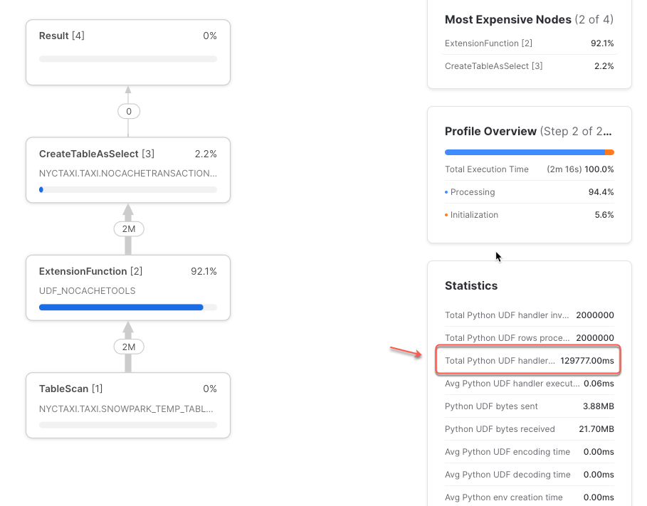
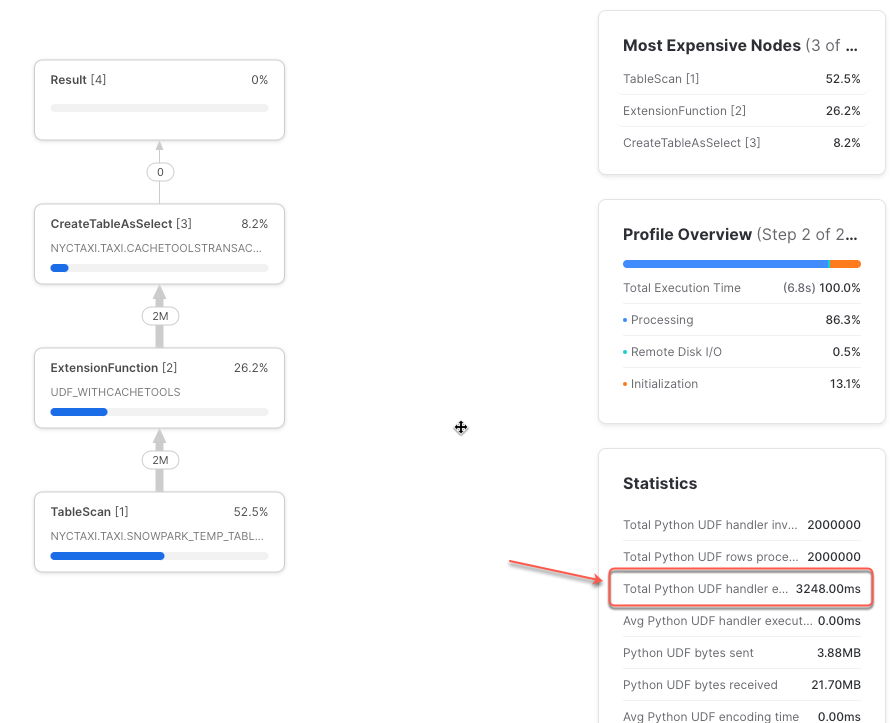
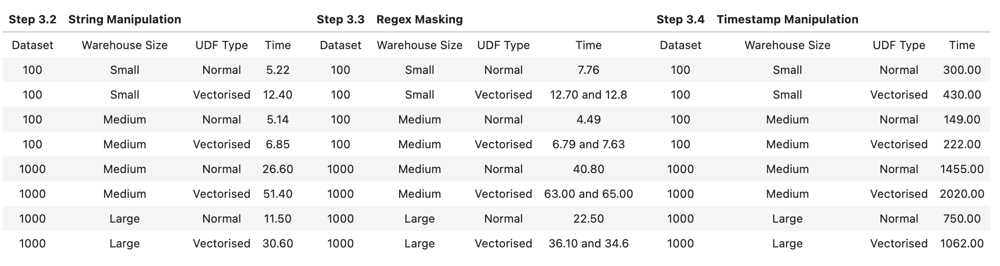
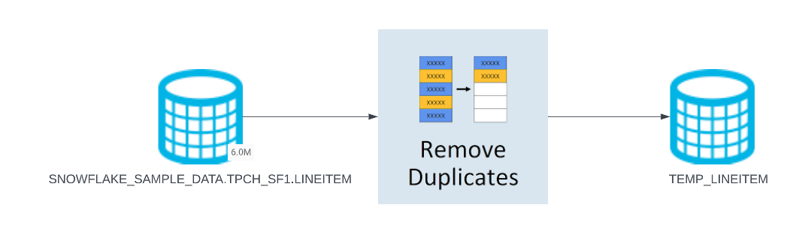
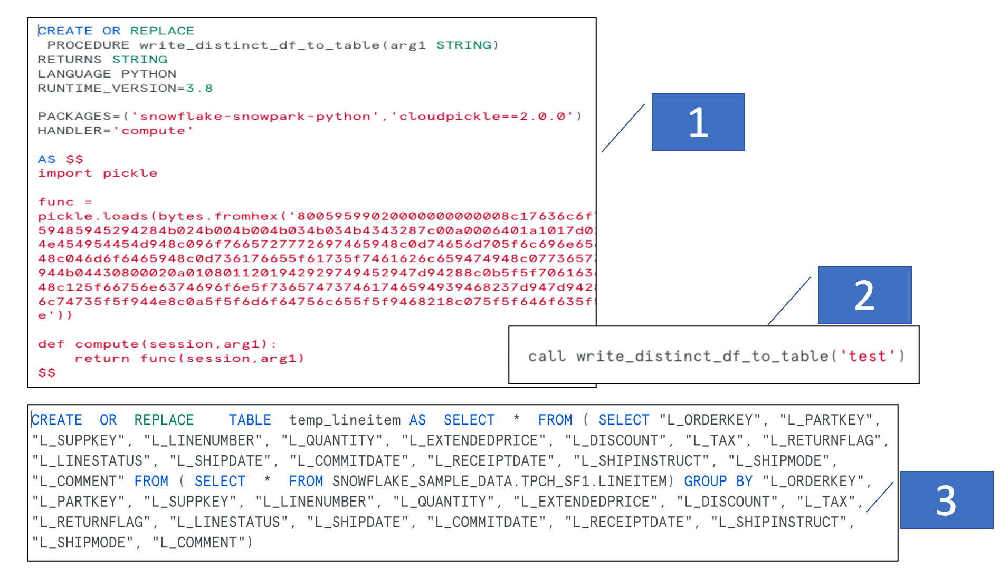
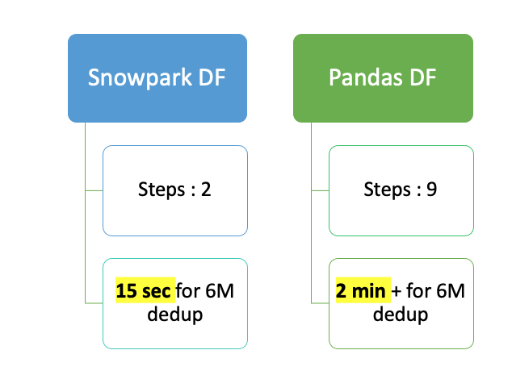

author: Jonathan Tao and Hanbing Yan
id: best_practices_guide_snowpark
summary: This guide is meant to review best practices when using Snowpark for Data Engineering use cases.  It will advise on best practices and show, with sample data, why these choices are the best when using Snowpark.  
categories: Best-Practices
environments: web
status: Published 
feedback link: https://github.com/Snowflake-Labs/sfguides/issues
tags: Getting Started, Data Engineering, Best Practices

# Best Practices Guide for Snowpark
<!-- ------------------------ -->
## Overview and Setup
Duration: 5

This Quickstart guide contains best practices for using Snowpark.  The guide is broken up into multiple labs, each covering a key concept that can improve performance and/or efficiency while running workloads in Snowpark.  

### Prerequisites
- Basic Understanding of Snowpark
- Familarity with using Notebook IDEs
- Snowpark Python API installed locally (see documentation [here](https://docs.snowflake.com/en/developer-guide/snowpark/python/setup) for setup instructions)

#### Create a credentials.json file

Throughout all the following labs, we will need to connect your notebook IDE to Snowflake.  This is done via a credentials file.  Name it `credentials.json` and put it in the same directory where you will be running your notebook (`.ipynb`) from to complete the labs.

Below are the core parameters for the file. You may have to create some objects in your Snowflake account to fulfill the parameters of the credentials file.

```
{
   "account": "",
   "user": "",
   "password": "",
   "database": "",
   "schema": "",
   "warehouse": "",
   "role": ""
}
```

### What You’ll Learn - Snowpark Optimizations
- Lab 1: Using Cachetools library to improve performance up to 20x (~20 mins)
- Lab 2: Using Vectorized UDFs can improve numerical computations by 30-40%
- Lab 3: Using Snowpark dataframes perform ~8X faster compared to Pandas dataframes

### What You’ll Need 
- Snowflake Account
- Notebook IDE (Jupyter, VSCode, Hex, etc.)
- Snowpark Client APIs installed locally

## Lab 1 (Cachetools) - Overview
Duration: 3

### Lab Summary

When using Snowpark, it is common for data engineers and data scientists to create pickle files, upload them to internal/external stage, and use them with Snowflake UDFs and Stored Procedures (SPs).  This lab will show how using the Python library Cachetools can be used to speed up UDF or SP performance by ensuring the logic is cached in memory in cases of repeated reads. For simplicity we will demonstrate this scenario using a pickle file which has the dictionary object serialized.


### Background Information - Cachetools and pickle files

#### Cachetools
[Cachetools](https://pypi.org/project/cachetools/) is a Python library that provides a collection of caching algorithms. It offers simple and efficient caching methods, such as LRU (Least Recently Used) and FIFO (First In First Out), to store a limited number of items for a specified duration. The library is useful in applications where temporarily storing data in memory improves performance. It's easy to use and can be integrated into an application with just a few lines of code.

The Cachetools library with Snowpark UDF can be used for:

- Loading pretrained ML models from the stage for model inference
- Reading data which is stored in pickle file

#### Pickle File
A [pickle](https://docs.python.org/3/library/pickle.html) file is a file format used to store Python objects as binary data. It is used in data engineering to store and retrieve data objects that can be used across different applications or scripts.For example, you might use pickle to store data objects such as pandas dataframes, numpy arrays, or even custom Python classes and functions. By using pickle, you can save these objects to disk and load them later without having to recreate the data from scratch.

### Scenario

There is a ficticious system that generates transactional data along with the day of the week information for each row. To access the names of the weekdays, we are required to use a Python pickle file that is shared by the upstream data teams. This file contains the names of the weekdays, which may change in different scenarios. To ensure compatibility and security, the upstream data teams only provide access to this information through the pickle file.

To analyze this data in Snowflake Snowpark Python, we have created a Python User Defined Function (UDF) to efficiently retrieve the corresponding day name based on the day number which comes as an input. This UDF provides a convenient and reliable way to access the day names from the pickle file, allowing us to perform the necessary DataFrame transformations for our analysis.

Lately as the number of transactions are growing we are seeing performance degradation of our select queries which is using the UDF to fetch the required information from the pickle file. We need to look for ways to improve the performance of the Python UDF that we have created.

## Lab 1 (Cachetools) - Setup
Duration: 5

### Setting up your environment and creating a session

Now open a new worksheet in your notebook that is in the same directory as the connection properties file.
From here on, the code snippets in the guide should be created in code blocks in your notebook and executed.

```
from snowflake.snowpark.session import Session
from snowflake.snowpark.functions import udf, avg, col,lit,call_udf,min,call_builtin,call_function,call_udf
from snowflake.snowpark.types import IntegerType, FloatType, StringType, BooleanType
import pandas as pd
import numpy as np
import json
```

Next, import snowpark and verify by printing the version.

```
from snowflake.snowpark import version
print(version.VERSION)
```

Last, let's open the credentials file and create the session.

```
with open('properties.json') as f:
    connection_parameters = json.load(f)

session = Session.builder.configs(snowflake_udf_conn_prop).create()

print(session.sql('select current_warehouse(), current_database(), current_schema()').collect())
```

Confirm that the the output of the print statement is the following:
`[Row(CURRENT_WAREHOUSE()='CLUSTER1', CURRENT_DATABASE()='NYCTAXI', CURRENT_SCHEMA()='TAXI')]`
## Lab 1 (Cachetools) - Pickle File
Duration: 3

### Create the Pickle File
Run the following code to build the sample pickle file.

```
import pickle

day_dict = {1: 'monday', 2: 'tuesday', 3: 'wednesday', 4: 'thursday', 5: 'friday', 6: 'saturday', 7: 'sunday'}
print(day_dict)

with open('alldays.pkl', 'wb') as file:
    pickle.dump(day_dict, file) 
```
The output of the above should be a dict object of a numerical day of week with its equivalent name.

```
# Sample function to test loading pickle file
def getname():
    with open('alldays.pkl','rb') as fileopen:
        f1=pickle.load(fileopen)               
    return f1

def getday(key):
    dict1=getname()
    return dict1[key]

r=getday(3)
print(r)
```
The output of the above should be `Wednesday`.

### Creating named Stage and Uploading the Pickle File

Next, we will create a stage in Snowflake to upload the pickle file to.

```
session.sql("create or replace stage pythonstage").collect()
session.file.put("alldays.pkl", "pythonstage", auto_compress=False,overwrite=True)
session.sql("ls @pythonstage").collect()
```

With the pickle file successfully loaded, we are now ready to A/B test our UDF with and without Cachetools in the next steps.

## Lab 1 (Cachetools) - UDF without Cachetools
Duration: 5

### Creating Python User Defined Function Without Cachetools

The block of code below creates a Python UDF without any use of the Cachetools library.

```
import sys
import os
import cachetools
from snowflake.snowpark.types import StringType,IntegerType

'''
We are importing the Pickle file in the session.

extract_name() -> deserializes the dictionary from the pickle and returns a dictionary object to the caller

getvalue() -> Takes a day number and return the name.

'''
session.add_import("@pythonstage/alldays.pkl")
def extract_name()->dict:
    IMPORT_DIRECTORY_NAME = "snowflake_import_directory"
    import_dir = sys._xoptions[IMPORT_DIRECTORY_NAME]
    file_path = import_dir + "alldays.pkl"
    
    with open(file_path,'rb') as file:
        dict1=pickle.load(file)

    return dict1

def getvalue(key:int)->str:   
    filedict= extract_name()
    return filedict[key]
    
# Creating a Python UDF
udf_nocache = session.udf.register(
    func=getvalue,
    name="udf_nocachetools",
    stage_location='pythonstage',
    is_permanent=True, 
    replace=True, 
    input_types=[IntegerType()],
    return_type=StringType()
)
```

### Creating Sample data

Next, we will create 2 million rows of sample data for the UDF to run against.

```
arr_random = np.random.randint(low=1, high=7, size=(2000000,3))
df = pd.DataFrame(arr_random, columns=['invoice_num','trx_num','weekday'])

df_transactions=session.createDataFrame(df,schema=['invoice_num','trx_num','weekday'])
```

Once created, confirm that the dataframe is created and has 2 millions records.
```
df_transactions.count() # 2 Million records
```

### Call the UDF

Let's call the UDF and create a new table from the resultset with the below code.  

```
from datetime import datetime

st=datetime.now()
df_transactions.withColumn('weekdayname',call_udf('udf_nocachetools',df_transactions['"weekday"'].astype('int')))\
.write.mode('overwrite').save_as_table("NoCacheTransactionTable")
et=datetime.now()
print(f"Total duration without using Cachetools library ={(et-st).total_seconds()}")
```
Note your runtime.  It will likely be between 130-160 seconds.
For the first run you will likely see better performance, but when you execute it multiple times, you will start seeing query taking more time to complete.


### Analyze performance with the Query Profiler

Let's take a look at the query profile in Snowflake to understand where the time is spent. As you can see clearly from the below screenshot that the Total Python UDF handler execution time is 130 seconds. This is due to for every record the UDF invocation is reading the file from disk.



Lastly, confirm that the UDF ran and successfully created a new table as expected by running the following:

```
session.sql("select * from NoCacheTransactionTable limit 10").show()
```

You should see the output table in your notebook.

## Lab 1 (Cachetools) - UDF with Cachetools
Duration: 5

### Creating Python User Defined Function With Cachetools

In the below cell, we will leverage the Cachetools library which will read the pickle file once and cache it.

```
import sys
import os
import cachetools
from snowflake.snowpark.types import StringType
import zipfile

'''
Using cachetools decorator while creating the function extract_name. Using this decorator the file will be read once and then cached. 
Other UDF execution will use the cached file and avoids reading the file from the storage.
'''

session.add_import("@pythonstage/alldays.pkl")

@cachetools.cached(cache={})
def extract_name()->dict:
    IMPORT_DIRECTORY_NAME = "snowflake_import_directory"
    import_dir = sys._xoptions[IMPORT_DIRECTORY_NAME]
    file_path = import_dir + "alldays.pkl"
    
    with open(file_path,'rb') as file:
        dict1=pickle.load(file)

    return dict1


def getvalue(key:int)->str:   
    filedict= extract_name()
    return filedict[key]
    

session.add_packages("cachetools")
udf_cache = session.udf.register(
    func=getvalue,
    name="udf_withcachetools",
    stage_location='pythonstage',
    is_permanent=True, 
    replace=True, 
    input_types=[IntegerType()],
    return_type=StringType()
)
```

### Creating Sample data

Just like in the previous test, we will create 2 million rows of sample data for the UDF to run against.

```
arr_random = np.random.randint(low=1, high=7, size=(2000000,3))
df = pd.DataFrame(arr_random, columns=['invoice_num','trx_num','weekday'])

df_transactions=session.createDataFrame(df,schema=['invoice_num','trx_num','weekday'])
```

Once created, confirm that the dataframe is created and has 2 millions records.
```
df_transactions.count() # 2 Million records
```
### Call the UDF

Let's call the UDF and create a new table from the resultset with the below code.  

```
from datetime import datetime

st=datetime.now()
df_transactions.withColumn('"weekdayname"',call_udf('udf_withcachetools',df_transactions['"weekday"'].astype('int')))\
.write.mode('overwrite').save_as_table("CacheToolsTransactionTable")
et=datetime.now()
print(f"Total duration ={(et-st).total_seconds()}")
```
Note the runtime - it should be around 8-9 seconds, even if you rerun it multiple times.  

### Analyze performance with the Query Profiler

Lets look at the query profile to understand where the time is spent. As you can see clearly from the below screenshot that the Total Python UDF handler execution time is only 4 seconds seconds as the UDF invocation is reading the the pickle content from the dictionary.



## Lab 1 (Cachetools) - Cleanup and Conclusion
Duration: 2

### Cleanup

Delete the dataframe and drop the tables created by the UDF executions in the A/B testing steps.
```
# Deleting the dataframe
del df_transactions
# Dropping the table
session.sql("drop table CacheToolsTransactionTable").collect()
session.sql("drop table NoCacheTransactionTable").collect()
```

Finally, let's close the session.

```
if session: 
    session.close()
```

### Conclusion 

Based on the our testing, we have identified that the total duration for the query using Cachetools decorator for this use case yields a significant performance increase for the Python UDF execution.

## Lab 2 (Vectorised UDFs) - Overview

### Lab Summary

The Snowpark API provides methods that help to create a User Defined Function. This can be done either using a Lambda or a typical Function in Python. When you create these UDFs, the Snowpark library uploads this code to an internal stage. When you call these UDFs, the Snowpark library executes your function on the server, where the data is. As a result, the data doesn’t need to be transferred to the client in order for the function to process the data.

Naturally, you're wondering then, what is a Vectorised UDF?

The Python UDF batch API enables defining Python functions that receive batches of input rows (aka chunked rows) as Pandas DataFrames and return batches of results as Pandas arrays or Series. The column in the Snowpark dataframe will be vectorized as a Pandas Series inside the UDF.

The goal of this lab is to compare the performance of a UDF Operation with and without using the Python UDF Batch API (or Vectorised UDFs).

In this notebook, we will do the following:
We will work with 4 datasets, namely Customers and Orders from the TPCH Datasets of different sizes (15M to 1.5B records) freely and instantly available in Snowflake through an inbound share.
And use 3 different Virtual Warehouse sizes, i.e., Small, Medium, and Large.
On 4 different use-cases, namely, Numerical Computation, String Manipulation, Regex Masking, and Timestamp Manipulation. Please note, these are hypothetical use-cases.

## Lab 2 (Vectorised UDFs) - Setup
Duration: 3

To begin the lab, open a new sheet in your notebook.  
For the purposes of this lab, you can treat each code block as its own paragraph in your notebook environment.

### Setting up your environment and creating a session
Declare the packages and functions at the top of your notebook.
```
# Importing snowpark libraries
import snowflake.snowpark
from snowflake.snowpark.session import Session
from snowflake.snowpark.functions import avg, stddev, udf
from snowflake.snowpark.types import FloatType, StringType, PandasSeries

# Others
import json
import re
import pandas as pd
from datetime import datetime, timedelta
```

Next, open the credentials file and create a session.
```
# Creating a session into Snowflake. This is the same as in previous sections of this lab
with open('properties.json') as f:
    connection_parameters = json.load(f)

session = Session.builder.configs(snowflake_udf_conn_prop).create()

# Testing the session
session.sql("SELECT current_warehouse(), current_database(), current_schema()").show()
```
- If you haven't already, please setup a new database in Snowflake. Mine is called Batching_Vectorising.
- Also, you do not need to use the AccountAdmin Role, but please ensure your custom role has the appropriate privileges.

Before continuing, we will disable caching to ensure proper performance comparisons.

```
session.sql("CREATE DATABASE IF NOT EXISTS BATCHING_VECTORISING").show()

# Lastly, we will be disabling cache for this section. This will help us compare performance metrics
session.sql("ALTER SESSION SET USE_CACHED_RESULT = FALSE").collect()
```

## Lab 2 (Vectorised UDFs) - Getting Data
Duration: 3

### Create Dataframes

As mentioned earlier, our data (TPCH dataset) is available from Snowflake via an inbound data share.
We are taking 4 datasets into consideration, namely, Customers & Orders with 2 different sizes.

Let's create all of these datasets as dataframes.

```
df_customer_100 = session.table("sfc_samples_sample_data.TPCH_SF100.customer")
df_customer_1000 = session.table("sfc_samples_sample_data.TPCH_SF1000.customer")
df_order_100 = session.table("sfc_samples_sample_data.TPCH_SF100.orders")
df_order_1000 = session.table("sfc_samples_sample_data.TPCH_SF1000.orders")
df_customer_100.limit(2).show()
df_order_100.limit(2).show()
```

Next, let's check on the data volumes we will be working with.

```
print(f"df_customer_100 = {str(df_customer_100.count()/1000000)} M, df_customer_1000 = {str(df_customer_1000.count()/1000000)} M,\ndf_order_100 = {str(df_order_100.count()/1000000)} M, df_order_1000 = {str(df_order_1000.count()/1000000)} M")
```

### Setup Warehouses

As mentioned earlier, we will be using 2 different Warehouse Sizes:
- For *_100 datasets, we will use Small and Medium Warehouse sizes
- For *_1000 datasets, we will use Medium and Large Warehouse sizes

```
# Let's change the warehouse size as required
session.sql("ALTER WAREHOUSE compute_wh SET warehouse_size='Small'").collect()

# Let's check the current size of the warehouse
session.sql("SHOW WAREHOUSES LIKE '%COMPUTE_WH%'").collect()
session.sql('SELECT "name", "size" FROM TABLE(RESULT_SCAN(LAST_QUERY_ID()))').show()
```

## Lab 2 (Vectorised UDFs) - Computational Use Cases
Duration: 15

This step contains all four use cases, each comparing the performance of scalar vs vectorised UDF over different dataset volumes.

### Numeric Computation

For this use case, we will make use of the Customer datasets.  Let's first compute the mean and standard deviation for Account Balance in Customer datasets.

```
## df_customer_100
df_customer_100_mean = float(df_customer_100.agg(avg("C_ACCTBAL")).to_pandas().values[0])
df_customer_100_stddev = float(df_customer_100.agg(stddev("C_ACCTBAL")).to_pandas().values[0])

## df_customer_1000
df_customer_1000_mean = float(df_customer_1000.agg(avg("C_ACCTBAL")).to_pandas().values[0])
df_customer_1000_stddev = float(df_customer_1000.agg(stddev("C_ACCTBAL")).to_pandas().values[0])
```

Let's create 2 sets of UDFs, one for each dataset as the means & stdevs will be different
- As mentioned earlier, these are hypothetical usecases
- In this UDF, we take the Customer Account Balance as Input, subtract with the Mean, add the Standard Deviation, and finally multiple with 10,000
Notice how we are creating a Normal and Vectorised UDF both

```
## df_customer_100
def basic_compute_100(inp):
    return (inp - df_customer_100_mean + df_customer_100_stddev) * 10000.0

# Let's create a UDF on top of that
udf_bc_100 = udf(basic_compute_100, return_type=FloatType(), input_types=[FloatType()])

# Let's vectorise the UDF
@udf()
def vect_udf_bc_100(inp: PandasSeries[float]) -> PandasSeries[float]:
    return (inp - df_customer_100_mean + df_customer_100_stddev) * 10000.0
```

The above is an example of basic_compute_100 function created as a Temporary UDF within Snowflake. It takes a few seconds to create the UDF, the first time. Subsequent runs will take less time
- You'll notice the run time parameters such as `Python version=3.8, Cloudpickle==2.0.0` package, and so on
- More importantly towards the end, you can see the actual function definition

Using @udf with a Pandas Series or Dataframe as input will automatically make use of the Python UDF Batch API or Vectorised UDF.
The UDF definition for a Vectorised UDF looks pretty much the same as for a normal non-vectorised one
However, the key differences apart from our definition for `vect_udf_bc100` is:
- Importing the pandas library: this can be seen towards the end of the Vectorised UDF definition
- The Vectorised input argument: `compute._sf_vectorized_input = pandas.DataFrame`

```
## df_customer_1000
def basic_compute_1000(inp):
    return (inp - df_customer_1000_mean + df_customer_1000_stddev) * 10000.0

# Let's create a UDF on top of that
udf_bc_1000 = udf(basic_compute_1000, return_type=FloatType(), input_types=[FloatType()])

# Let's vectorise the UDF
@udf()
def vect_udf_bc_1000(inp: PandasSeries[float]) -> PandasSeries[float]:
    return (inp - df_customer_1000_mean + df_customer_1000_stddev) * 10000.0
```

Let's quickly execute these UDFs against our datasets 100 & 1000.  In our methodology we had discussed using different Virtual Warehouse sizes:
- Small and Medium for 100 dataset
- Medium and Large for 1000 dataset
We will be re-running this accordingly
```
%%timeit -r 1 -n 1
df_customer_100.select(udf_bc_100("C_ACCTBAL").alias("bal_from_mean")).agg(avg("bal_from_mean")).show()
```
```
%%timeit -r 1 -n 1
df_customer_100.select(vect_udf_bc_100("C_ACCTBAL").alias("bal_from_mean")).agg(avg("bal_from_mean")).show()
```
```
%%timeit -r 1 -n 1
df_customer_1000.select(udf_bc_1000("C_ACCTBAL").alias("bal_from_mean")).agg(avg("bal_from_mean")).show()
```
```
%%timeit -r 1 -n 1
df_customer_1000.select(vect_udf_bc_1000("C_ACCTBAL").alias("bal_from_mean")).agg(avg("bal_from_mean")).show()
```

### String Manipulation

To test a workload based on string manipulation, let's create a single set of UDFs for Customer100 & Customer1000 datasets.  Here, we take the Customer Name as input and split based on the '#' character.  As before, we will create a Normal and Vectorised UDF

```
def str_manipulate(inp):
    return inp.split('#')[1]

# Let's create a UDF on top of that
udf_sm = udf(str_manipulate, return_type=StringType(), input_types=[StringType()])

# Let's vectorise the same UDF
@udf()
def vect_udf_sm(inp: PandasSeries[str]) -> PandasSeries[str]:
    return inp.str.split('#', expand=True)[1]
```
As before, let's quickly execute these UDFs against our datasets 100 & 1000.  We will re-run these UDFs based on our Dataset and VW sizing
```
%%timeit -r 1 -n 1
df_customer_100.select(udf_sm("C_NAME").alias("CustIDs")).write.mode("overwrite").save_as_table("BATCHING_VECTORISING.PUBLIC.CustIDs")
```
```
%%timeit -r 1 -n 1
df_customer_100.select(vect_udf_sm("C_NAME").alias("CustIDs")).write.mode("overwrite").save_as_table("BATCHING_VECTORISING.PUBLIC.CustIDs")
```
```
%%timeit -r 1 -n 1
df_customer_1000.select(udf_sm("C_NAME").alias("CustIDs")).write.mode("overwrite").save_as_table("BATCHING_VECTORISING.PUBLIC.CustIDs")
```
```
%%timeit -r 1 -n 1
df_customer_1000.select(vect_udf_sm("C_NAME").alias("CustIDs")).write.mode("overwrite").save_as_table("BATCHING_VECTORISING.PUBLIC.CustIDs")
```

### Regex Masking

Another common use case is Regex Masking.  To set this up, let's create a single set of UDFs for Customer100 & Customer1000 datasets.  Here, we take the Customer Phone Number as input and masks the last 4 digits.  As before, we will create a Normal and Vectorised UDF.

```
# Let's create a slightly complex function using native python regex for string replacement/masking
def mask_data(inp):
    return re.sub('\d{4}$', '****', inp)

# Let's create a UDF on top of that
udf_md = udf(mask_data, return_type=StringType(), input_types=[StringType()])

# Let's vectorise the same UDF
@udf()
def vect_udf_md(inp: PandasSeries[str]) -> PandasSeries[str]:
    return inp.apply(lambda x: mask_data(x))
```
As before, let's quickly execute these UDFs against our datasets 100 & 1000.  We will re-run these UDFs based on our Dataset and VW sizing

```
%%timeit -r 1 -n 1
df_customer_100.select(udf_md("C_PHONE").alias("masked_phone_nums")).write.mode("overwrite").save_as_table("BATCHING_VECTORISING.PUBLIC.masked_phone_data")
```
```
%%timeit -r 1 -n 1
df_customer_100.select(vect_udf_md("C_PHONE").alias("masked_phone_nums")).write.mode("overwrite").save_as_table("BATCHING_VECTORISING.PUBLIC.masked_phone_data")
```
```
%%timeit -r 1 -n 1
df_customer_1000.select(udf_md("C_PHONE").alias("masked_phone_nums")).write.mode("overwrite").save_as_table("BATCHING_VECTORISING.PUBLIC.masked_phone_data")
```
```
%%timeit -r 1 -n 1
df_customer_1000.select(vect_udf_md("C_PHONE").alias("masked_phone_nums")).write.mode("overwrite").save_as_table("BATCHING_VECTORISING.PUBLIC.masked_phone_data")
```

To try another approach, let's vectorise the original UDF again, this time using the Pandas `replace` code.

```
@udf()
def vect_udf_md(inp: PandasSeries[str]) -> PandasSeries[str]:
    return inp.replace(to_replace ='\d{4}$', value = '****', regex = True)
```
```
%%timeit -r 1 -n 1
df_customer_100.select(vect_udf_md("C_PHONE").alias("masked_phone_nums")).write.mode("overwrite").save_as_table("BATCHING_VECTORISING.PUBLIC.masked_phone_data")
```
```
%%timeit -r 1 -n 1
df_customer_1000.select(vect_udf_md("C_PHONE").alias("masked_phone_nums")).write.mode("overwrite").save_as_table("BATCHING_VECTORISING.PUBLIC.masked_phone_data")
```

### Timestamp Manipulation

The final example is changing a timestamp field.  Let's create a single set of UDFs for Order100 & Order1000 datasets.  Here, we take the Order Data as input and apply some basic Timestamp operations.  As before, we will create a Normal and Vectorised UDF

```
# Let's try some timestamp manipulation
def change_format(inp):
    instantiate = datetime.strptime(inp, '%Y-%m-%d')
    change_format = datetime.strptime(instantiate.strftime('%m/%d/%Y'), '%m/%d/%Y')
    dt_add3_days = change_format + timedelta(days=10)
    return dt_add3_days

# Let's create a UDF on top of that
udf_cf = udf(change_format, return_type=StringType(), input_types=[StringType()])

# Let's vectorise the UDF - still using native python
@udf()
def vect_udf_cf(inp: PandasSeries[str]) -> PandasSeries[str]:
    return inp.apply(lambda x: change_format(x))
```

As before, let's quickly execute these UDFs against our datasets 100 & 1000.  We will re-run these UDFs based on our Dataset and VW sizing

```
%%timeit -r 1 -n 1
df_order_100.select(udf_cf("O_ORDERDATE").alias("NY_OrderDate")).write.mode("overwrite").save_as_table("BATCHING_VECTORISING.PUBLIC.new_order_dates")
```
```
%%timeit -r 1 -n 1
df_order_100.select(vect_udf_cf("O_ORDERDATE").alias("NY_OrderDate")).write.mode("overwrite").save_as_table("BATCHING_VECTORISING.PUBLIC.new_order_dates")
```
```
%%timeit -r 1 -n 1
df_order_1000.select(udf_cf("O_ORDERDATE").alias("NY_OrderDate")).write.mode("overwrite").save_as_table("BATCHING_VECTORISING.PUBLIC.new_order_dates")
```
```
%%timeit -r 1 -n 1
df_order_1000.select(vect_udf_cf("O_ORDERDATE").alias("NY_OrderDate")).write.mode("overwrite").save_as_table("BATCHING_VECTORISING.PUBLIC.new_order_dates")
```

## Lab 2 (Vectorised UDFs) - Cleanup and Conclusion.
Duration: 5

### Analysis

#### Recap

Before we look into the results, let's recap what we have done so far:
- We took 4 different TPCH datasets of varying sizes...
- ...Used 3 different Virtual Warehouse sizes, i.e., Small, Medium, and Large...
- ...On 4 different hypothetical use-cases...
- ...and generated results that will allow us to compare the performance of a UDF Operation with and without using Vectorised UDFs .

#### Numeric Computation Use Cases

For Numerical Computation, keeping the same dataset and warehouse size, Vectorised UDFs outperform Normal UDFs.
- This is also seen when we change the size of the warehouse (to Large) to accommodate the change in dataset size (to Customer 1000)
- This is because Numerical data types (including Boolean [0, 1]) expose their contents as _memoryviews()_. Memoryviews allow direct read & write access to the data without needing to copy it. But if you do require to copy it, they don't need to be read sequentially first. This significantly improves performance.
- What is peculiar is the behavior when working with a Medium warehouse and Customer 100 dataset. Where it performs slightly less efficient than a Small Warehouse. This could have several reasons, but what I noticed in the Query Profile was:
  - It takes the Medium warehouse upto 35% of the time to initialise as compared to ~10% of time for a Smaller warehouse.
  - Another is the time it took to create the python sandbox environment, i.e. ~900ms on a Medium warehouse compared to <400ms for Smaller warehouse.  The last one especially could compound across the UDFs that get created and to cause the slight difference in performance.
  - Of course, this previous point above doesn't carry across the other dataset and warehouse size.
- *Optional Work*: Leverage GET_QUERY_OPERATOR_STATS() table function for a more detailed and thorough analysis.

#### Non-Numeric Computation Use Cases

As expected, it makes sense not to use Vectorised UDFs for Non-numeric operations
- But apart from the obvious, let's check out what the Query Profile looks like for the String Manipulation for Customer 100 Dataset when using a Small warehouse:
  - The Total (and by extention Average) UDF Handler Execution Time was about half for a Normal UDF when compared to the Vectorised UDF
  - The Average UDF encoding/decoding time was less than 1/100th of a millisecond for a Normal UDF when compared to 5 ms for a Vectorised UDF
  - I think we have to appreciate the difference of orders of magnitude here and especially when compounded, really makes the difference in performance between a Normal and Vectorised UDF
  - The Python Sandbox environment creation time was 1/3rd for Normal UDFs when compared to Vectorised UDFs
  - It is also important to note that the Bytes scanned and written were almost the same, and the partitions were the same as no partitioning had been done to this dataset.
- *Optional Work*: Leverage GET_QUERY_OPERATOR_STATS() table function for a more detailed and thorough analysis.



#### Batch Sizes

Additionally, when using Vectorised UDFs, you may want to play around with Batch Sizes.
- This is done with the input argument to the decorator @udf like so:
```
@udf(max_batch_size=1000)
def vect_udf_bc_100(inp: PandasSeries[float]) -> PandasSeries[float]:
    return (inp - df_customer_100_mean + df_customer_100_stddev) * 10000.0
```
It is important to note:
- Setting a batch size doesn't guarantee which records will be present in a particular batch
- It also doesn't guarantee that a batch size will be of the same size. For instance, if the argument `max_batch_size = 50000`, does not mean 50k records are sent per batch
- An increase in batch size doesn't guarantee improvement in performance
- A very very low batch size (e.g. ~50-200) does slow performance depending on the size of the dataset. While a moderately sized batch (e.g. ~2000) does improve performance. This is what I have seen in my tests
- Typically, Snowflake automatically picks a batch size for you which is performance efficient and should suffice in most cases

### Summary

Your Python code must operate efficiently on batch of rows
- For Numerical Computations, you can expect between 30% and 40% improvement in performance using Vectorised UDFs
- For Non-Numeric Computaions/Manipulations, you're more than likekly to see a degrade in performance when comparing between the two UDF types we discussed, and we would recommend to stick with normal non-vectorised UDFs
- If you're working with Numerical Computations, I would also experiment with different Warehouse and Batch Sizes to get more performance as a result. But remember, higher sizes does not always mean or always guarantee higher performance
- Lastly, make sure to dive deep into Query Profiling either through the Snowsight UI or the newly launched GET_QUERY_OPERATOR_STATS() table function to squeeze in that extra bit of performance

### Cleanup

```
# Drop the newly created database
session.sql("DROP DATABASE batching_vectorising")
# Be a good samaritan and close the connection
if session:
    session.close
```

## Lab 3 (Snowpark Dataframes) - Overview 


Snowpark is essentially a wrapper that converts Spark or Pandas APIs into SQL when executing and data engineers don't need to spend excessive time to find out how it works behind scenes. This notebook guides you through why we should use Snowpark Dataframe and avoid using Pandas Data Frame.

Though Pandas has tons of really good APIs in day-to-day DE job, the challenge with Pandas is that it does not scale with your data volume linearly due to single-machine processing. For example, Pandas fails with out-of-memory error if it attempts to read a dataset that is larger than the memory available in a single machine.


Now we will see how Pandas works with Snowpark and how Snowflake has tried to parallelize the processing of Pandas API. Lets use a simple example to remove duplicates from a 6M sample table.


<!-- ------------------------ -->
## Lab 3 (Snowpark Dataframes) - Execution

Duration: 15
**Lab Prerequisite:**
1. Your snowflake user needs to be granted to a role have write access to database SNOWFLAKE_SAMPLE_DATA. For instructions to import SNOWFLAKE_SAMPLE_DATA, please click [here](https://docs.snowflake.com/en/user-guide/sample-data-using).

2. By now, you should have finished setting up credential.json configuration file in the overview section, please ensure this configuration file is in the same folder of the jupyter notebook you will create next.

3. Create a new jupyter notebook and call it snowparkbp_lab3.ipynb, and then follow the below steps to copy and paste the code to the notebook.

**STEP 1: Import required python libraries and create a Snowpark Session.**

Note: when you are dealing with Jupyter notebook at the client side(e.g. your local machine) these packages needs to be installed in your local python environment. Adding these packages to the session from Client side ensures that the corresponding versions are pulled in from Anaconda package when creating a Stored Procedure and UDF within Snowflake.

```python
# Import required libraries
# Snowpark
import snowflake.snowpark
from snowflake.snowpark.functions import sproc
from snowflake.snowpark.session import Session
from snowflake.snowpark import version as v
import json

import pandas as pd
import numpy as np
import datetime
import io

with open('credentials.json') as f:
    connection_parameters = json.load(f)
    
session = Session.builder.configs(connection_parameters).create()
print(session.sql('select current_warehouse(), current_database(), current_schema()').collect())

session.add_packages('snowflake-snowpark-python', 'pandas', 'numpy')
```
**STEP 2: Create a Stored Procedure to remove duplicates using Snowpark dataframes.**
```python
%%time
import snowflake.snowpark
from snowflake.snowpark.functions import sproc

@sproc(name="write_distinct_df_to_table", is_permanent=True, stage_location="@udf", replace=True, packages=["snowflake-snowpark-python"])
def write_distinct_df_to_table(session: snowflake.snowpark.Session, x: str) -> str:
    lineitem_df = session.table('SNOWFLAKE_SAMPLE_DATA.TPCH_SF1.LINEITEM')
    lineitem_df = lineitem_df.dropDuplicates()
    lineitem_df.write.mode("overwrite").save_as_table("temp_lineitem")
    return 'Table Created Sucessfully'
    
session.sql("call write_distinct_df_to_table('test')").collect()
```

**STEP 3: Analyze how SQL is run in your Snowflake account.**

As you can see in the below screenshot, SQL is generated behind the scenes in Snowflake for the UDF created using Snowpark dataframes and a Stored Procedure created as pickle (binary file on disk). When the Stored Procedured is called, the dedup is done using a SQL(as simple as that).


**STEP 4:  Create a Stored Procedure to remove duplicates using Pandas dataframes.**

```python
%%time
import snowflake.snowpark
from snowflake.snowpark.functions import sproc

session.add_packages("snowflake-snowpark-python", "pandas")
@sproc(name="write_distinct_df_to_table", is_permanent=True, stage_location="@udf", replace=True, packages=["snowflake-snowpark-python"])
def write_distinct_df_to_table(session: snowflake.snowpark.Session, x: str) -> str:
    lineitem_df = session.table('SNOWFLAKE_SAMPLE_DATA.TPCH_SF1.LINEITEM')
    lineitem_pandasdf = lineitem_df.to_pandas()
    lineitem_pandasdf = lineitem_pandasdf.drop_duplicates()
    session.write_pandas(lineitem_pandasdf, "temp_lineitem", auto_create_table=True)
    return 'Table Created Sucessfully'
    
session.sql("call write_distinct_df_to_table('test')").collect()
```

**STEP 5: Compare the performance.**

The below image shows you the performance difference between Snowpark Dataframe and Pandas Dataframe, both using the same small warehouse.


**Summary**

As you can see the performance is 8X faster in Snowpark dataframe for the above simple use case. It's always a best practise to leverage Snowpark dataframe as much as you can!


