author: Mary Law (in partnership with AWS Ying Wang)
id: better-together-snowflake-sv-amazon-quicksight
categories: snowflake-site:taxonomy/solution-center/certification/quickstart, snowflake-site:taxonomy/product/ai, snowflake-site:taxonomy/product/analytics, snowflake-site:taxonomy/snowflake-feature/business-intelligence, snowflake-site:taxonomy/snowflake-feature/cortex-analyst
language: en
summary: This is a Quickstart for building Snowflake and Amazon Quicksight highlight Snowflake Semantic View as part of better together enablement
title: Better Together: Unleash AI-Powered BI with Snowflake Semantic View and Amazon Quick Sight 
environments: web
status: Published
feedback link: <https://github.com/Snowflake-Labs/sfguides/issues>
fork repo link: https://github.com/Snowflake-Labs/sfquickstarts/tree/master/site/sfguides/src/better-together-snowflake-sv-amazon-quicksight
open in snowflake: <[Open in Snowflake](https://signup.snowflake.com/)>


# Better Together: Unleash AI-Powered BI with Snowflake and Amazon Quick
<!-- ------------------------ -->
## Overview 

[Snowflake](https://www.snowflake.com/en/) is a fully managed Data & AI platform that is truly easy to use, connected across your entire data estate and trusted by thousands of customers. It integrates tighty with [Amazon Web Services](https://www.snowflake.com/en/blog/snowflake-aws-enterprise-data-ai-adoption/) to accelerate enterprise Data and AI Adoption. This Quickstart demostrates the integration between Snowflake and [Amazon Quick](https://aws.amazon.com/quicksuite/quicksight/) to deliver AI-powered BI capabilities and unified intelligence across all your enterprise data sources, and bridges the critical "last-mile gap" between insights and action.

The integration showcases Snowflake's [semantic view](https://docs.snowflake.com/en/user-guide/views-semantic/overview), a new schema-level object in Snowflake. Semantic view provides the meaning and business context to raw enterprise data - "metrics" (eg. total view, user_rating) and "dimensions" (e.g., movie, genre), acting as a reliable bridge between human language and complex data structures. By embedding organizational context and definitions directly into the data layer, semantic views ensure that both AI and BI systems interpret information uniformly, leading to trustworthy answers and significantly reducing the risk of AI hallucinations. 

You can use semantic views in Cortex Analyst and query these views in a SELECT statement. You can also share semantic views in [private listings](https://docs.snowflake.com/en/collaboration/provider-listings-creating-publishing.html#label-listings-create), in public listings on the [Snowflake Marketplace](https://app.snowflake.com/_deeplink/marketplace), and in organizational listings. By adding business meaning to physical data, the semantic view enhances data-driven decisions and provides consistent business definitions across enterprise applications. Lastly, as native Snowflake schema objects, semantic views have object-level access controls. You can grant or restrict usage and query rights on semantic views just as with tables and views, ensuring authorized, governed usage across SQL, BI and AI endpoints.  You can read more about how to write “Semantic SQL” [here](https://docs.snowflake.com/en/user-guide/views-semantic/querying).

<br>

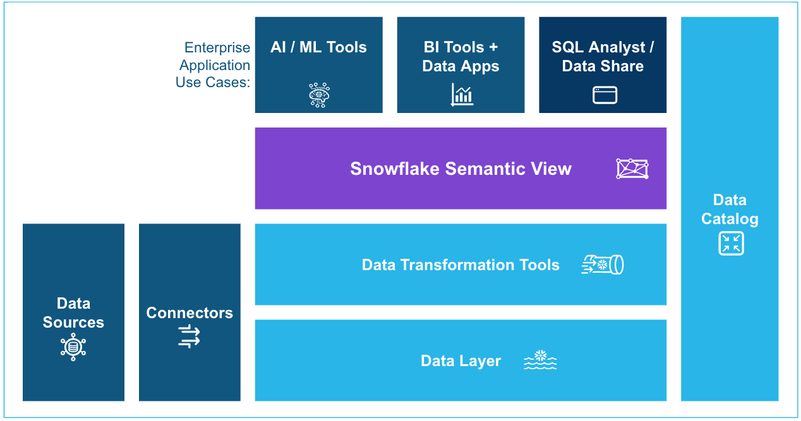

## Use Case

In this tutorial, you'll learn how to process and analyze customer review data for a Media company with Snowflake Cortex Analyst followed by building a dashboard in [Amazon Quick Sight](https://aws.amazon.com/quicksuite/quicksight/), part of the Amazon Quick Suite. Briefly, you'll work with the movies dataset, which contains customer reviews for a movie media company, and transform data into actionable insights.

This integration leverages Snowflake's native capabilities to ingest structured movie review data directly from Amazon S3 into a database schema. Defining a Snowflake semantic view with table relationships, dimensions, and metrics to enhance AI-powered analytics all with SQL. Semantic models are shifted from individual BI tool layers to the core data platform, guaranteeing that all tools utilize the same semantic concepts.  


**🔑 Key Steps and Benefits:**  

**1. Data Ingestion and Semantic View Creation**: Data is loaded from Amazon S3 using Snowflake's native ingestion tools. A semantic view is then established to simplify the database structure for business users all via SQL.  
**2. Self-Serve Analytics with [Cortex Analyst](https://docs.snowflake.com/en/user-guide/snowflake-cortex/cortex-analyst)**: Business teams and non-technical users can perform self-serve analytics using natural language queries via Snowflake Cortex Analyst, gaining instant insights from the structured data in Snowflake.  
**3. Amazon Quick Sight Integration**: Using the provided `QuickSight Dataset Generator` guide in the Notebook to create QuickSight datasets from Snowflake DDL, from setting up credentials to sharing datasets with users. Using the [AWS Cloudshell](https://aws.amazon.com/cloudshell/) to programmatically interact with [Amazon Quick Sight API](https://boto3.amazonaws.com/v1/documentation/api/1.12.0/reference/services/quicksight.html).  
**4. Enhanced AI-powered BI**: This integration empowers the BI team to use natural language for creating interactive charts/dashboards, building calculated fields, developing data stories, and conducting what-if scenarios and significantly reducing the risk of AI hallucinations. The BI team can further incorporate this Snowflake sourced dashboard into the (Amazon Quick) Movies [Space](https://aws.amazon.com/quick/spaces/) and combine other files, dashboards, topics, knowledge bases, and application actions into a unified and customizable enterprise knowledge center. 

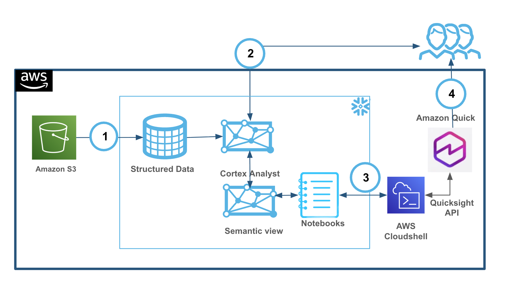

<br>

### What You’ll Learn 

- How to setup a Snowflake warehouse, database and schema
- How to load data into Snowflake from Amazon S3
- The process of defining a Snowflake semantic view with tables, relationships, dimensions, and metrics
- Introduction to Snowflake [Notebook](https://www.snowflake.com/en/developers/guides/getting-started-with-snowflake-notebooks/)
- How semantic views enhance AI-powered analytics (Cortex Analyst) and consistency across BI tools (eg. Amazon Quick Sight) 
  


### What You’ll Build 
You will build a foundational yet practical setup of a Snowflake Cortex Analyst, complete with data views and a defined semantic model, enabling consistent data querying for AI and BI with Amazon Quick Sight.


### What You'll Need
- Familiarity with [Snowflake](/en/developers/guides/getting-started-with-snowflake/). If you do not have an account, sign up for a [trial account here](https://signup.snowflake.com/)
  - Select **`Enterprise`** edition on **`AWS`** Cloud
  - Access to **`ACCOUNTADMIN`** role is required for creating semantic views
- Familiarity with AWS. If you do not have an account, [signup for an AWS Account](https://docs.aws.amazon.com/quicksuite/latest/userguide/setting-up.html#sign-up-for-aws) and [Quick Suite](https://docs.aws.amazon.com/quicksuite/latest/userguide/signing-in.html)

  **Ensure to sign up to both of the above in AWS `US West (Oregon)` or `US East (Virginia)`** 
  At launch, Quick is available in 4 Regions: US East (N. Virginia), US West (Oregon), Asia Pacific (Sydney), and Europe (Ireland).
  Refer to [Amazon Quick documentation](https://docs.aws.amazon.com/quicksuite/latest/userguide/regions.html)
- Basic knowledge of SQL and Python
- Familiarity with data analysis concepts
<br>

<!-- ------------------------ -->

## Setup Our Environment

### Overview

You will use [Snowsight](https://docs.snowflake.com/en/user-guide/ui-snowsight.html#), the Snowflake web interface, to import and run the notebook to create the environment.  

* Download the Notebook **SF_Quick_Quickstart.ipynb** from the `assets` folder
<br>

>Snowflake Notebooks come pre-installed with common Python libraries for data science and machine learning, such as `numpy`, `pandas`, `matplotlib`, and more! 
If you are looking to use other packages, click on the Packages dropdown on the top right to add additional packages to your notebook. 


* Click on the **`+`** **Create button** -> `Notebook` to `Import` the downloaded notebook.


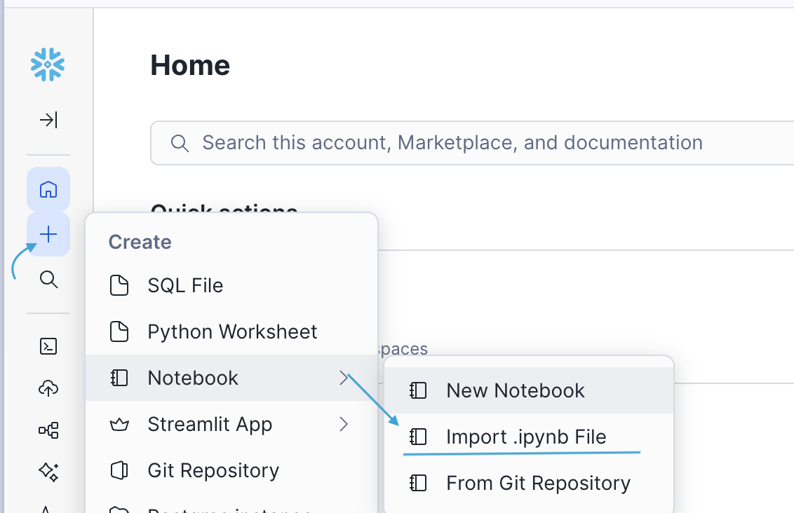


Accept the default and ensure to select the **`Run on Warehouse`**

By default, the notebook warehouse is set to SYSTEM$STREAMLIT_NOTEBOOK_WH. However, you can specify a different warehouse at the time of notebook creation by choosing one from the dropdown list. 

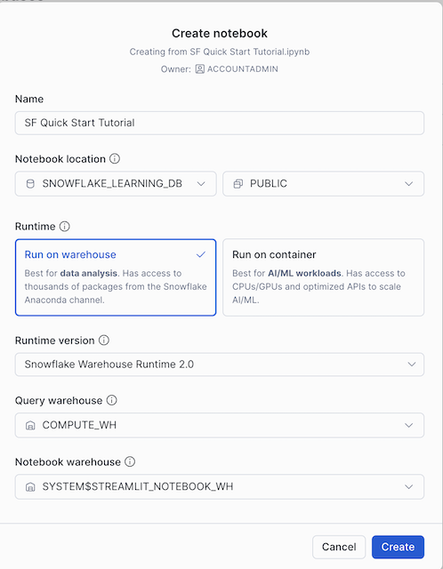 

We will create a new warehouse `WORKSHOPWH` and a database named `movies` to organize our data via this notebook.

>After notebook creation, you can choose a different warehouse from the notebook settings. More details [here](https://docs.snowflake.com/en/release-notes/bcr-bundles/2025_01/bcr-1887)

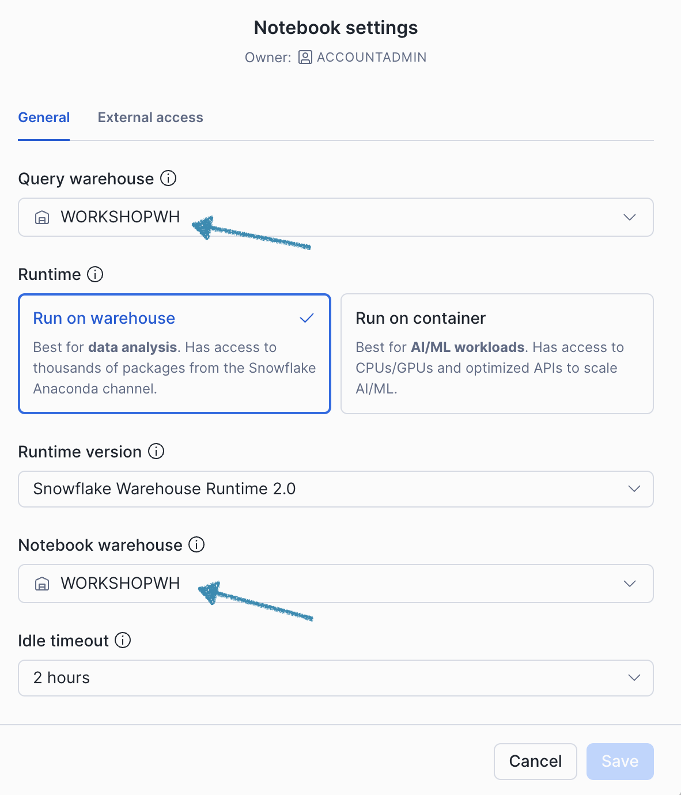  


We will run the cells in notebook to load the data into the database `MOVIES` , proceed with running `Part 1` and `Part 2` and the reminder of the notebook

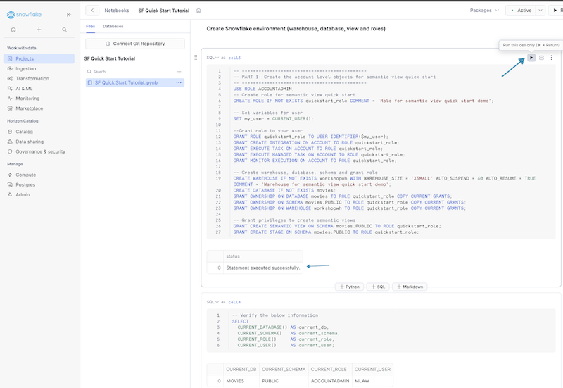  

🚨 Important!!
After running the cell `Get_SV_DDL` with the following SQL:

```sql
SELECT TO_VARCHAR( GET_DDL(
  'SEMANTIC_VIEW',
  'MOVIES.PUBLIC.MOVIE_ANALYTICS_SV'
));
```
<br>

ensure to click on `Download as CSV` and rename this file to **SF_DDL.csv**

<br>
 
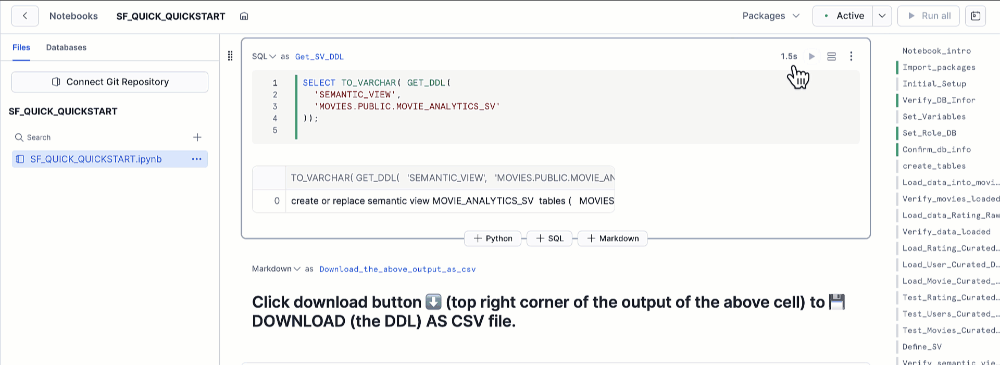  


### ✅✅ This completes the Snowflake side setup

At this stage, you can view the semantic view `MOVIES_ANALYST_SV` in Snowsight and ask question using natural language with Cortex Analyst.

To view the semantic view created in UI:

* From Snowsight, Select **AI & ML** -> **Cortex Analyst**
* Ensure to select the  `SEMANTIC_QUICK_START_ROLE` and `WORKSHOPSH` created earlier
* Select `Movies` database and `Public` Schema 
* View the details of the semantic view `MOVIES_ANALYST_SV`
> To use SQL to view a semantic view, refer to the [example here](https://docs.snowflake.com/en/user-guide/views-semantic/example)

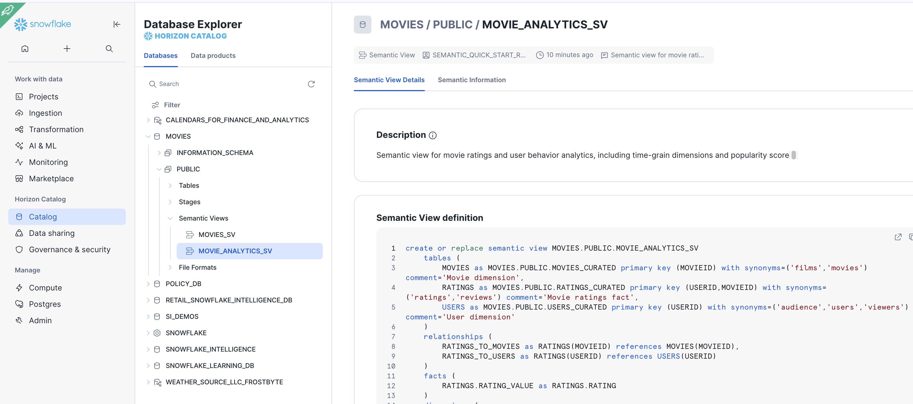 

<br>

* Feel free to explore and `Explain the dataset` in `Playground`
* Ensure to `Save` before exit  


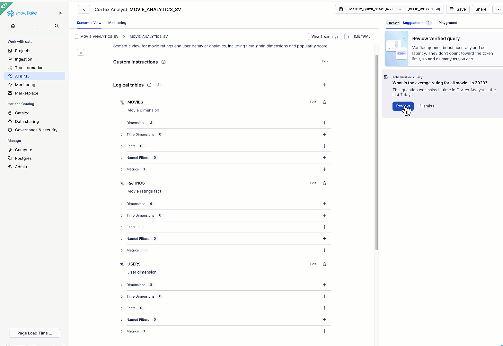

<br>


✏️  ✏️  Feel free to `add more` `➕ verfied queries` 
> Verified queries are example gold questions with correct answers that give the LLM an example of an accurate answer. This improves accuracy, reduce latency, and help generate better suggestions for your semantic view.

Example: verifying `What is the average rating for all movies in 2023?` ensures Cortex Analyst generates the right SQL for all similarly phrased questions. 
> Cortex Analyst only uses verified queries when they are similar to the question that the user asked.  

🎦 Try the following sample questions:-
- `show me the total rating values by movies titles`
- `list the top 10 most popular movies at all times`

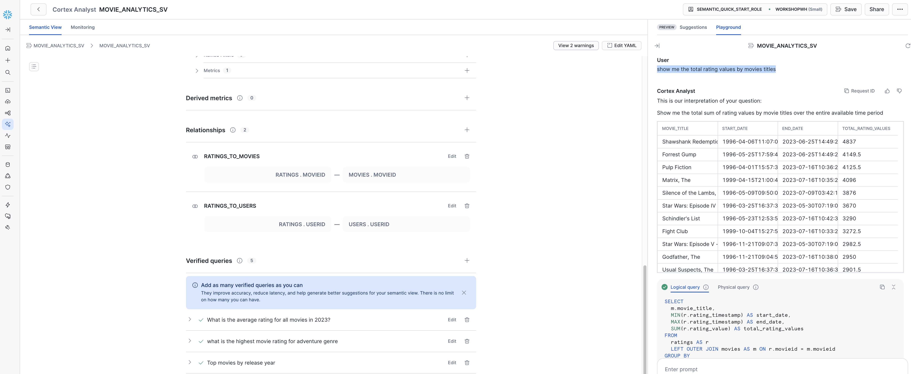

<br>

<!-- ------------------------ -->

## **QuickSight Dataset Generator** with AWS CloudShell to call Quicksight API
Follow the guide in the notebook to complete the process of creating QuickSight datasets from Snowflake DDL, setting up credentials to sharing datasets with users.
Download the `QuickSight Dataset Generator` Solution_Package.zip from the `assets` folder

### Complete Workflow
0. Open AWS console --> cloudshell --> Upload the `Solution_Package.zip` 

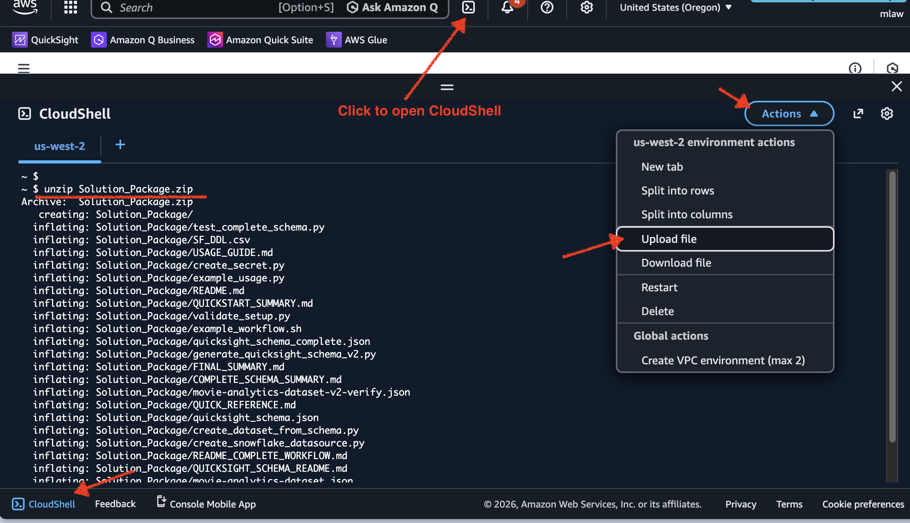  


1. Create AWS Secret (Snowflake credentials)
   
2. Create QuickSight Data Source (using secret)
   
3. Generate QuickSight Schema (from Snowflake DDL saved as SF_DLL.csv earlier)

```
**Expected Output**
Parsing Snowflake DDL from: SF_DDL.csv
Found 3 tables
Found 2 relationships
Found 17 dimensions
Found 1 facts
Found 7 metrics

Generating complete QuickSight dataset schema...
Complete schema saved to: quicksight_schema_complete.json

This schema includes:
  ✓ All 3 physical tables (MOVIES, USERS, RATINGS)
  ✓ Logical tables with joins
  ✓ Column renames based on DDL aliases
  ✓ Type casts (IDs to STRING)
  ✓ Calculated fields (USER_FULL_NAME, DISTINCT_MOVIES)
  ✓ Column descriptions from DDL comments
```

<br>

   
4. Create Dataset (from generated schema)

```
**Expected Output**
✓ Dataset created: movie-analytics-dataset
✓ Status: 201
✓ Ingestion started: ingestion-1769081615
```

5. Start [SPICE:Super-fast, Parallel, In-memory Calculation Engine](https://docs.aws.amazon.com/quicksuite/latest/userguide/spice.html) Ingestion (load data)

```
 "IngestionId": "ingestion-1769082493",
        "IngestionStatus": "COMPLETED",
        "ErrorInfo": {},
        "RowInfo": {
            "RowsIngested": 378436,
            "RowsDropped": 0,
            "TotalRowsInDataset": 378436
```


   
6. Share Dataset (with users) - Optional
   
7. Once the dataset has been created and ingestion completed, you can go into Amazon Quick Console to view the dataset, create [Q topic](https://docs.aws.amazon.com/quicksuite/latest/userguide/topics.html), Dashboard or even generate your `Movies` [Space](https://aws.amazon.com/quick/spaces/) for your team. 

We can ask the same verified queries to generate dashboard  

 `show me the highest rating movies`
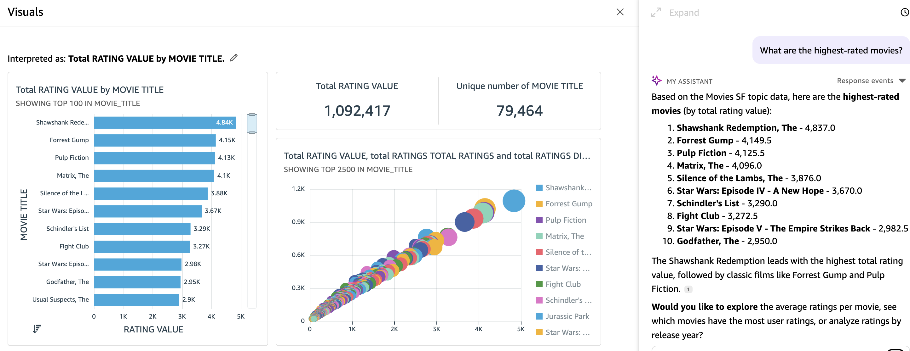  

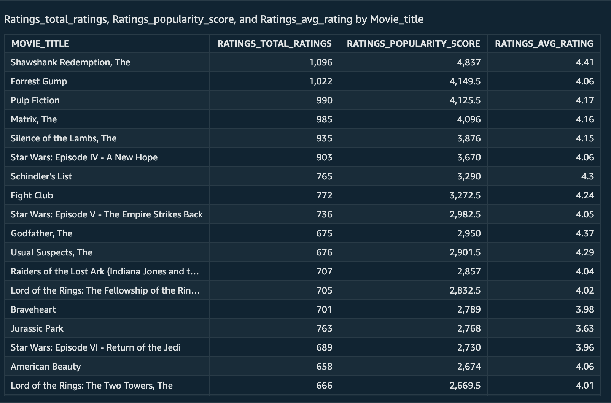  


<br>

<!-- ------------------------ -->

## Appendix

### Appendix 1: for those who want to use SQL worksheet to create warehouse and database before importing the notebook
* Alternatively, paste and run the following SQL in the worksheet to create Snowflake objects (warehouse, database)  
Once our warehouse and database has been created,  you can upload the [notebook](https://notebook) and execute the guided cells.
<br>

```sql

-- =============================================
-- PART 1: Snowflake Setup for semantic view quick start
-- =============================================

USE ROLE ACCOUNTADMIN;

-- Create role for semantic view quick start
CREATE ROLE IF NOT EXISTS semantic_quick_start_role
COMMENT = 'Role for semantic view quick start demo';

-- Set variables
SET my_user = CURRENT_USER();
    
--Grant role to your user 
GRANT ROLE semantic_quick_start_role TO USER IDENTIFIER($my_user);
    
-- create database, schema and warehouse
CREATE WAREHOUSE IF NOT EXISTS WORKSHOPWH WITH WAREHOUSE_SIZE = 'XSMALL' AUTO_SUSPEND = 1800 AUTO_RESUME = TRUE COMMENT = 'Warehouse for semantic view quick start demo';
CREATE DATABASE IF NOT EXISTS movies;
GRANT OWNERSHIP ON DATABASE movies TO ROLE semantic_quick_start_role COPY CURRENT GRANTS;
GRANT OWNERSHIP ON SCHEMA movies.PUBLIC TO ROLE semantic_quick_start_role COPY CURRENT GRANTS;
GRANT OWNERSHIP ON WAREHOUSE workshopwh TO ROLE semantic_quick_start_role COPY CURRENT GRANTS;
-- Grant privileges to create semantic views
GRANT CREATE SEMANTIC VIEW ON SCHEMA movies.PUBLIC TO ROLE semantic_quick_start_role;
GRANT CREATE STAGE ON SCHEMA movies.PUBLIC TO ROLE semantic_quick_start_role;

```

<br>

<br>


## Conclusion And Resources
Congratulations on completing this lab! You’ve successfully leveraged Snowflake to generate insights and how to integrate with Amazon Quick Suite. 


### What You Learned
How to analyze data using Snowflake Cortex Analyst 
The process of defining a Snowflake semantic view with tables, relationships, dimensions, and metrics using Semantic SQL
The integration between Snowflake and Amazon Quick Suite

### Related Resources
- Link to [github code repo](https://github.com/Snowflake-Labs/sfquickstarts/tree/master/site/sfguides/src/better-together-snowflake-sv-amazon-quicksight)
- [Getting started with Semantic views](https://www.snowflake.com/en/developers/guides/snowflake-semantic-view/#0)  
- [Getting Started with Cortex Analyst](https://www.snowflake.com/en/developers/guides/getting-started-with-cortex-analyst/)
