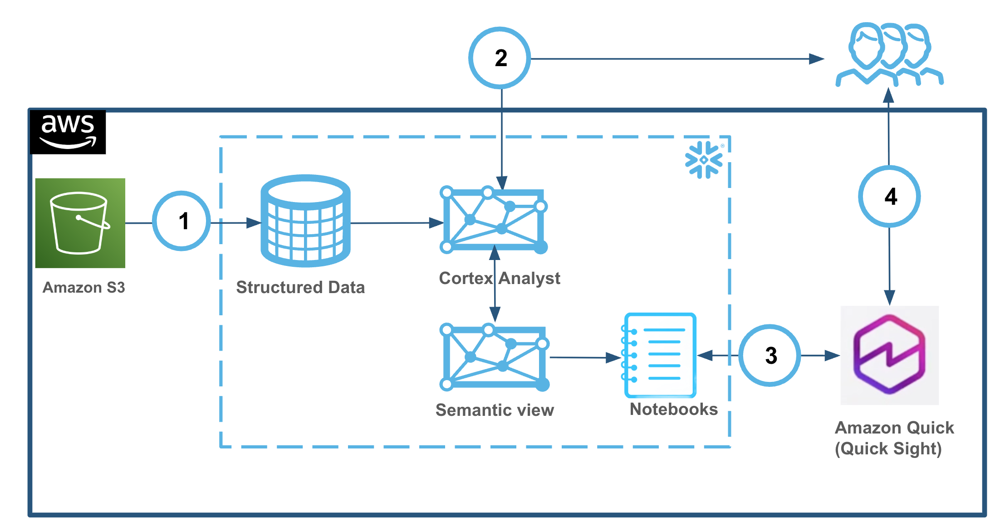
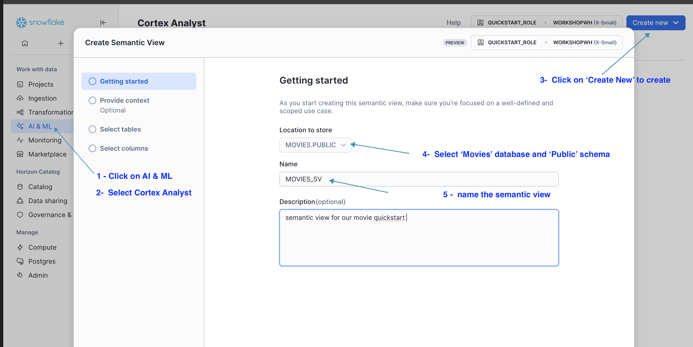
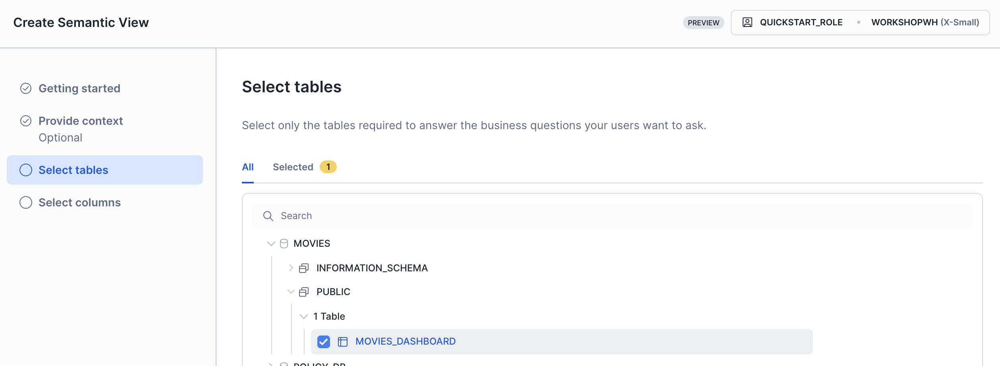
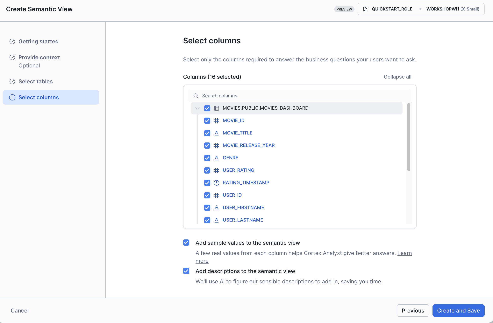
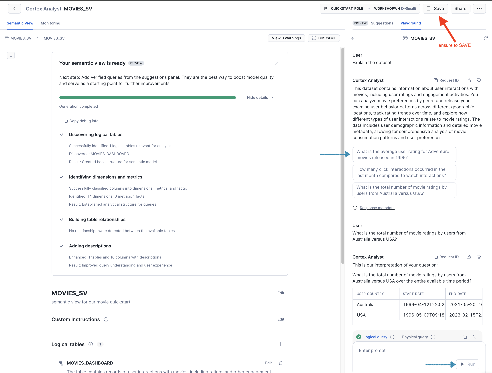

author: Mary Law (in partnership with AWS Ying Wang)
id: better-together-snowflake-sv-amazon-quicksight
categories: snowflake-site:taxonomy/solution-center/certification/quickstart, snowflake-site:taxonomy/product/ai, snowflake-site:taxonomy/product/analytics, snowflake-site:taxonomy/snowflake-feature/business-intelligence, snowflake-site:taxonomy/snowflake-feature/cortex-analyst
language: en
summary: This is a Quickstart for building Snowflake and Amazon Quicksight highlight Snowflake Semantic View as part of better together enablement
title: Better Together: Unleash AI-Powered BI with Snowflake Semantic View and Amazon Quick Sight 
environments: web
status: Published
feedback link: <https://github.com/Snowflake-Labs/sfguides/issues>
fork repo link: <optional but modify to link to your repo>
open in snowflake: <[Open in Snowflake](https://signup.snowflake.com/)>


# Better Together: Unleash AI-Powered BI with Snowflake Semantic View and Amazon Quick Sight 
<!-- ------------------------ -->
## Overview 

Unlock the full potential of your data with the powerhouse combination of [Snowflake](https://www.snowflake.com/en/) and [Amazon Quick](https://aws.amazon.com/quicksuite/). Say goodbye to data silos and hello to seamless, intelligent insights. As a multi-award-winning [AWS Technology Partner](https://www.snowflake.com/en/why-snowflake/partners/all-partners/aws/) (Winner- Global Data & Analytics Partner -2023, 2024, 2025) with multiple AWS accreditations that include AWS ISV Competencies in Generative AI, Machine Learning, Data and Analytics, and Retail. Snowflake powers AI, data engineering, applications, and analytics on a trusted, scalable AI Data Cloud—eliminating silos and accelerating innovation.

This Quickstart demostrates the integration between Snowflake and [Amazon Quick Sight](https://aws.amazon.com/quicksuite/quicksight/) to deliver AI-powered BI capabilities and unified intelligence across all your enterprise data sources, and bridges the critical "last-mile gap" between insights and action.

The integration showcases Snowflake's [semantic view](https://docs.snowflake.com/en/user-guide/views-semantic/overview), a new schema-level object in Snowflake. Semantic view provides the meaning and business context to raw enterprise data - "metrics" (eg. total view, user_rating) and "dimensions" (e.g., movie, genre), acting as a reliable bridge between human language and complex data structures. By embedding organizational context and definitions directly into the data layer, semantic views ensure that both AI and BI systems interpret information uniformly, leading to trustworthy answers and significantly reducing the risk of AI hallucinations. You can use semantic views in Cortex Analyst and query these views in a SELECT statement. You can also share semantic views in [private listings](https://docs.snowflake.com/en/collaboration/provider-listings-creating-publishing.html#label-listings-create), in public listings on the [Snowflake Marketplace](https://app.snowflake.com/_deeplink/marketplace), and in organizational listings. By adding business meaning to physical data, the semantic view enhances data-driven decisions and provides consistent business definitions across enterprise applications. Lastly, as native Snowflake schema objects, semantic views have object-level access controls. You can grant or restrict usage and query rights on semantic views just as with tables and views, ensuring authorized, governed usage across SQL, BI and AI endpoints.  You can read more about how to write “Semantic SQL” [here](https://docs.snowflake.com/en/user-guide/views-semantic/querying).

<br>


## Usecase

This integration leverages Snowflake's native capabilities to ingest structured movie review data directly from Amazon S3 into a database schema. Defining a Snowflake semantic view with table, relationships, dimensions, and metrics to enhance AI-powered analytics. Semantic models are shifted from individual BI tool layers to the core data platform, guaranteeing that all tools utilize the same semantic concepts.  

**🔑 Key Steps and Benefits:**  

**1. Data Ingestion and Semantic View Creation**: Data is loaded from Amazon S3 using Snowflake's native ingestion tools. A semantic view is then established to simplify the database structure for business users.  
**2. Self-Serve Analytics with [Cortex Analyst](https://docs.snowflake.com/en/user-guide/snowflake-cortex/cortex-analyst)**: Business teams and non-technical users can perform self-serve analytics using natural language queries via Snowflake Cortex Analyst, gaining instant insights from the structured data in Snowflake.  
**3. Amazon Quick Sight Integration**: Snowflake Notebook is used to programmatically interact with [Amazon Quick Sight API](https://boto3.amazonaws.com/v1/documentation/api/1.12.0/reference/services/quicksight.html) to set up integration and create a data source and data set.  
**4. Enhanced AI-powered BI**: This integration empowers the BI team to use natural language for creating interactive charts/dashboards, building calculated fields, developing data stories, and conducting what-if scenarios and significantly reducing the risk of AI hallucinations.  



<br>

### What You’ll Learn 

- How to setup a Snowflake warehouse, database and schema
- How to load data into Snowflake from Amazon S3
- The process of defining a Snowflake semantic view with tables, relationships, dimensions, and metrics
- Introduction to Snowflake [Notebook](https://www.snowflake.com/en/developers/guides/getting-started-with-snowflake-notebooks/)
- How semantic views enhance AI-powered analytics (Cortex Analyst) and consistency across BI tools (Amazon Quick Sight via [API call](https://boto3.amazonaws.com/v1/documentation/api/1.12.0/reference/services/quicksight.html))
  


### What You’ll Build 
You will build a foundational yet practical setup of a Snowflake semantic view, complete with data views and a defined semantic model, enabling consistent data querying for AI and BI with Amazon Quick Sight.


### What You'll Need
- Familiarity with [Snowflake](/en/developers/guides/getting-started-with-snowflake/). If you do not have an account, sign up for a [trial account here](https://signup.snowflake.com/)
  - Select `Enterprise` edition
  - Access to `ACCOUNTADMIN` role is required for creating semantic views
- Familiarity with AWS. If you do not have an account, [signup for an AWS Account](https://docs.aws.amazon.com/quicksuite/latest/userguide/setting-up.html#sign-up-for-aws) and [Quick Suite](https://docs.aws.amazon.com/quicksuite/latest/userguide/signing-in.html)

  **Ensure to sign up to both of the above in AWS `US West (Oregon)`** 
  At launch, Quick is available in 4 Regions: US East (N. Virginia), US West (Oregon), Asia Pacific (Sydney), and Europe (Ireland). Refer to See the [Amazon Quick documentation](https://docs.aws.amazon.com/quicksuite/latest/userguide/regions.html)
- Basic knowledge of SQL and Python
- Familiarity with data analysis concepts
<br>

<!-- ------------------------ -->

## Setup Our Environment

### Overview

You will use [Snowsight](https://docs.snowflake.com/en/user-guide/ui-snowsight.html#), the Snowflake web interface, to import and run the notebook to create the environment.  

* Download the Notebook **[update-me-better-together-snowflake-sv-amazon-quicksight.ipynb]** using this [link](https://github.com/Snowflake-Labs/xx/tree/main/notebook)   
<br>

>Snowflake Notebooks come pre-installed with common Python libraries for data science and machine learning, such as `numpy`, `pandas`, `matplotlib`, and more! 
If you are looking to use other packages, click on the Packages dropdown on the top right to add additional packages to your notebook. 


* Click on the **`+`** **Create button** -> `Notebook` to `Import` the downloaded notebook.


Accept the default and ensure to select the **`Run on Warehouse`** 
We will create a new warehouse `WORKSHOPWH` and a database named `movies` to organize our data via this notebook

  

We will run the cells in notebook to load the data into the `movies_dashboard` , procced with running `Part 1` and `Part 2` of the notebook

  


<!------------>
#### Optional: for those who want to use SQL worksheet
* Alternatively, paste and run the following SQL in the worksheet to create Snowflake objects (warehouse, database, raw tables), ingest data from Amazon S3, and create the movies table

```sql

-- =============================================
-- PART 1: Snowflake Setup for semantic view quick start
-- =============================================

USE ROLE ACCOUNTADMIN;

-- Create role for semantic view quick start
CREATE ROLE IF NOT EXISTS quickstart_role 
   COMMENT = 'Role for semantic view quick start demo';

-- Set variables for user
SET my_user = CURRENT_USER();

--Grant role to your user 
GRANT ROLE quickstart_role TO USER IDENTIFIER($my_user);


-- Create warehouse, database, schema and grant role

CREATE WAREHOUSE IF NOT EXISTS WORKSHOPWH WITH
   WAREHOUSE_SIZE = 'XSMALL'
   AUTO_SUSPEND = 60
   AUTO_RESUME = TRUE
   COMMENT = 'Warehouse for semantic view quick start demo';
   
CREATE DATABASE IF NOT EXISTS movies; 

GRANT OWNERSHIP ON DATABASE movies TO ROLE quickstart_role COPY CURRENT GRANTS;
GRANT OWNERSHIP ON SCHEMA movies.PUBLIC TO ROLE quickstart_role COPY CURRENT GRANTS;
GRANT OWNERSHIP ON WAREHOUSE workshopwh TO ROLE quickstart_role COPY CURRENT GRANTS;

-- Grant privileges to create semantic views
GRANT CREATE SEMANTIC VIEW ON SCHEMA movies.PUBLIC TO ROLE quickstart_role;
GRANT CREATE STAGE ON SCHEMA movies.PUBLIC TO ROLE quickstart_role;

-- Verify the below information
SELECT
  CURRENT_DATABASE() AS current_db,
  CURRENT_SCHEMA()   AS current_schema,
  CURRENT_ROLE()     AS current_role,
  CURRENT_USER() AS current_user;

-- Set variables for the specified role, database, and schema
SET my_role = 'quickstart_role';
SET my_db = CURRENT_DATABASE();
SET my_schema = CURRENT_SCHEMA();
SET my_full_schema = $my_db || '.' || $my_schema;


-- ==============================================
-- PART 2: DATA SETUP (as quickstart_role)
-- ==============================================

-- create demo table for our movie data, we will surface this in dashboard
CREATE TABLE if not exists movies_dashboard (
        movie_id NUMBER,
    	movie_title VARCHAR,
   	    movie_release_year INTEGER,
    	genre VARCHAR,
   	    user_rating FLOAT,
   	    rating_timestamp TIMESTAMP_NTZ,
    	user_id NUMBER,
    	user_firstname VARCHAR,
   	    user_lastname VARCHAR,
    	user_city VARCHAR,
    	user_state VARCHAR,
    	user_country VARCHAR,
    	user_email VARCHAR,
    	user_phonenumber VARCHAR,
    	interaction_timestamp NUMBER ,
    	interaction_type VARCHAR
);

CREATE OR REPLACE STAGE MOVIEDASHBOARD
URL='s3://hol-qs-bucket/'
FILE_FORMAT = (TYPE = 'csv');

COPY INTO movies_dashboard FROM @MOVIEDASHBOARD/movies_dashboard.csv
  FILE_FORMAT=(TYPE = 'csv' FIELD_DELIMITER = ',' SKIP_HEADER = 1);

-- Create stage for docs 
CREATE STAGE DOCS
DIRECTORY = ( ENABLE = true )
ENCRYPTION = ( TYPE = 'SNOWFLAKE_SSE' );

-- Create stage for semantic models
CREATE STAGE IF NOT EXISTS MODELS
  DIRECTORY = (ENABLE = TRUE)
  COMMENT = 'Stage for semantic model files';

-- let's verify the data load
select distinct movie_title from movies_dashboard;

-- verify 773 records been loaded
select count(*) from movies_dashboard;

```


### Proceed to create the Semantic view 
Once our warehouse, database and `movies_dashboard` table has been created & loaded (Part 1 and Part 2 of the notebook),  we will create the semantic view.

#### From Snowsight
* Select **AI & ML** 
* Select **Cortex Analyst**
* Click on the `Create new` drop down 
* Ensure to select the  `QUICKSTART_ROLE` and `WORKSHOPSH` created earlier
* In the **Location to  store**: Select `Movies` database and `Public` Schema
* Enter `MOVIES_SV` as the name of the semantic view 
* Click **NEXT** to continue

To use SQL to create a semantic view, refer to the [example here](https://docs.snowflake.com/en/user-guide/views-semantic/example)

<br> 





* In the `Provide context (optional)` page -> Click **SKIP** 

* In the `Select table for Semantic view` page  
   Select `Movies` >> `Public` >> `MOVIES_DASHBOARD` and click **Next**



* Select ✅ **ALL** 16 columns  

  
* Select ✅ `Add sample values to the semantic view`
* Select ✅ `Add descriptions to the semantic view`
* Click **Create and Save**

    > Creation of semantic view may take up to 10 minutes. Please don't close the window.

The semantic view should get created in a few minutes, you can click on the `Explain the dataset` and click on the suggested query to verify the response on the right hand side.
* Click **Save** before continue



<br>

Feel free to experiment and add more `➕ verfied queries`. 
Verified queries are example gold questions with correct answers that give the LLM an example of an accurate answer. This improves accuracy, reduce latency, and help generate better suggestions for your semantic view.  
Example: verifying `What is the average user rating for movies in the Adventure genre over time` ensures Cortex Analyst generates the right SQL for all similarly phrased questions. 
> Cortex Analyst only uses verified queries when they are similar to the question that the user asked.  


  

## Conclusion And Resources

If you want to learn more about Snowflake Guide formatting, checkout the official documentation here: [Snowflake Guide](#)

### What You Learned
- Basics of creating sections
- adding formatting and code snippets
- Adding images and videos with considerations to keep in mind

### Related Resources
- <link to github code repo>
- <link to related documentation>
* [Getting started with Semantic views](https://www.snowflake.com/en/developers/guides/snowflake-semantic-view/#0)  
* [Getting Started with Cortex Analyst](https://www.snowflake.com/en/developers/guides/getting-started-with-cortex-analyst/)
