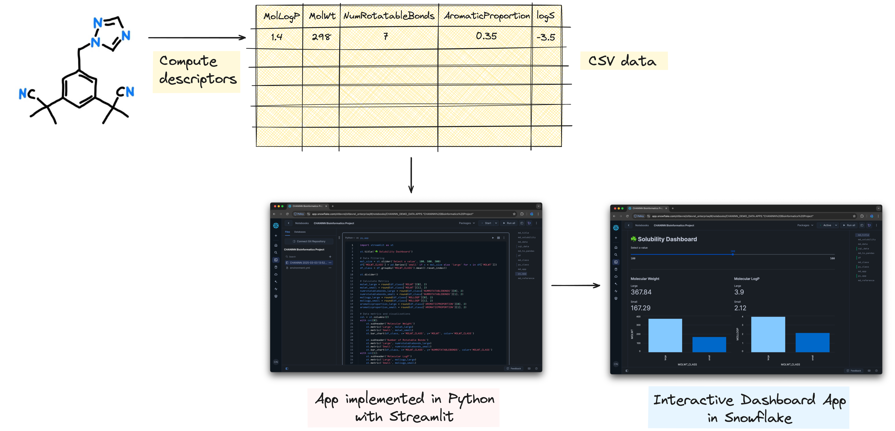
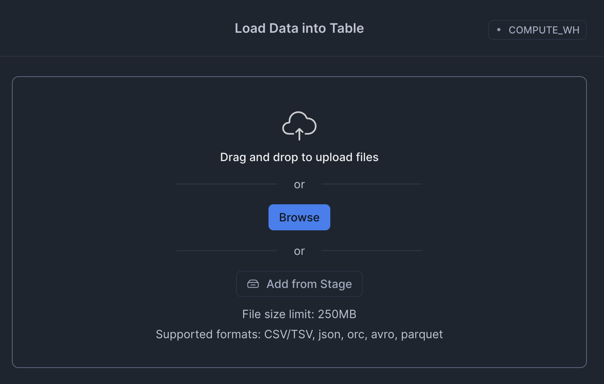
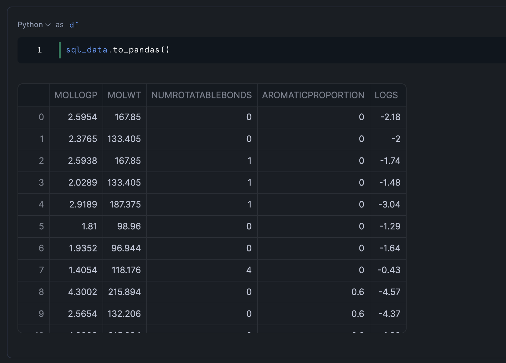
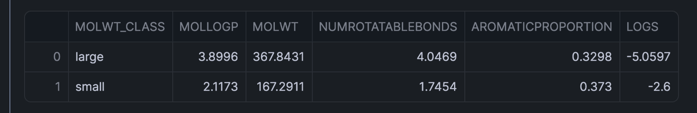
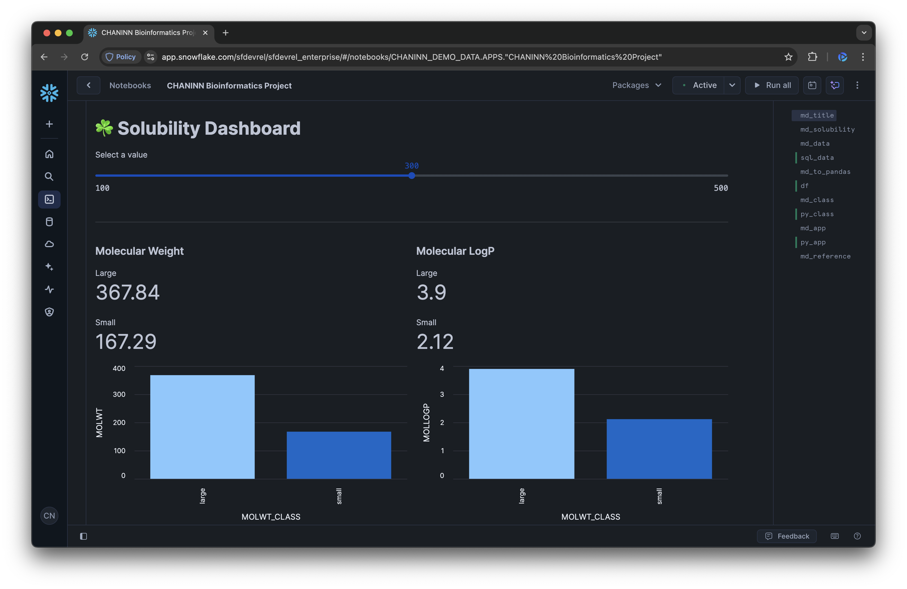

author: Chanin Nantasenamat
id: bioinformatics-dashboard
categories: snowflake-site:taxonomy/solution-center/certification/quickstart, snowflake-site:taxonomy/product/analytics, snowflake-site:taxonomy/snowflake-feature/applied-analytics
language: en
summary: Build bioinformatics dashboards in Snowflake for genomics data analysis, variant tracking, and research visualization.
environments: web
status: Published
feedback link: https://github.com/Snowflake-Labs/sfguides/issues


# Build a Bioinformatics Solubility Dashboard in Snowflake
<!-- ------------------------ -->
## Overview

In this tutorial, you'll build a complete bioinformatics project from scratch in Snowflake. You'll work with the Delaney solubility dataset to analyze molecular properties that are crucial for successful drug discovery efforts.

By the end of this guide, you'll have created an interactive dashboard that visualizes important molecular properties and their relationship to solubility, providing valuable insights for pharmaceutical research.

### What You'll Learn
- How to load and prepare bioinformatics data in Snowflake
- Techniques for data transformation using Pandas
- How to build an interactive dashboard with Streamlit
- Understanding of molecular solubility concepts relevant to drug discovery

### What You'll Build
An interactive bioinformatics dashboard that visualizes molecular properties from the Delaney solubility dataset, allowing researchers to explore relationships between molecular weight, rotatable bonds, LogP values, and aromatic proportions.

Here's an illustration of the overview of this bioinformatics project that you'll build:



### What You'll Need
- Access to a [Snowflake account](https://signup.snowflake.com/?utm_source=snowflake-devrel&utm_medium=developer-guides&utm_cta=developer-guides)
- Basic familiarity with SQL and Python
- Understanding of fundamental data analysis concepts

<!-- ------------------------ -->
## Setup

### Prepare Your Environment

Firstly, to follow along with this quickstart, you can click on [Bioinformatics_Solubility_Dashboard.ipynb](https://github.com/Snowflake-Labs/snowflake-demo-notebooks/blob/main/Bioinformatics_Solubility_Dashboard/Bioinformatics_Solubility_Dashboard.ipynb) to download the Notebook from GitHub.

Snowflake Notebooks come pre-installed with common Python libraries for data science and machine learning, such as NumPy, Pandas, Matplotlib, and more! If you need additional packages for this tutorial, click on the Packages dropdown on the top right to add them to your notebook.

<!-- ------------------------ -->
## Load and Explore the Data

### Create a database

Before we can upload data into Snowflake, we'll need to create a database. In Snowsight, you can create a database in by clicking on Projects → Worksheets in the left sidebar and on the top-right hand corner click on the "+" blue button to spin up a SQL worksheet. 

Enter the following SQL query into the worksheet and run it:

```sql
CREATE DATABASE IF NOT EXISTS CHANINN_DEMO_DATA;
```

Note: Please replace `CHANINN_DEMO_DATA` with a database name of your choice.

### Upload the dataset

Download the Delaney data set as a [delaney_solubility_with_descriptors.csv
](https://github.com/Snowflake-Labs/snowflake-demo-notebooks/blob/main/Bioinformatics_Solubility_Dashboard/delaney_solubility_with_descriptors.csv) file.

In Snowsight, click on Data → Add Data and then click on the "Load data into a Table" button. Drag-and-drop the CSV file or click on Browse to select the CSV file.



Scroll down, under the "Select or create a database and schema" section, select your database and schema which I'll use `CHANINN_DEMO_DATA.PUBLIC` and for the table name I'll use `SOLUBILITY`. Finally, click on the Next button to proceed. After a few moments, your CSV data will be loaded into Snowflake.

The data table is now available at `CHANINN_DEMO_DATA.PUBLIC.SOLUBILITY`.

### Load the Delaney Dataset

First, we'll load the Delaney solubility dataset from Snowflake using a simple SQL query:

```sql
SELECT * FROM CHANINN_DEMO_DATA.PUBLIC.SOLUBILITY
```

This query retrieves all records from the solubility table. The result is stored in a variable called `sql_data`.

### Convert to Pandas DataFrame

Next, we'll convert the SQL result to a Pandas DataFrame for easier manipulation and analysis:

```python
df = sql_data.to_pandas()
```

Let's examine the DataFrame:



This would display the first segments of our dataset, showing columns like `MOLWT` (molecular weight), `NUMROTATABLEBONDS` (number of rotatable bonds), `MOLLOGP` (measure of lipophilicity), and `AROMATICPROPORTION` (proportion of aromatic atoms).

### Basic Data Analysis

We can perform some basic statistical analysis to understand our data better:

```python
df.describe()
```

This provides statistical summaries for each numerical column, including count, mean, standard deviation, minimum, and maximum values.

<!-- ------------------------ -->
## Data Preparation and Aggregation

### Classify Molecules by Size

For our analysis, we'll classify molecules based on their molecular weight:
- "small" if the molecular weight is less than 300
- "large" if the molecular weight is 300 or greater

This classification will help us compare properties between smaller and larger molecules:

```python
df['MOLWT_CLASS'] = pd.Series(['small' if x < 300 else 'large' for x in df['MOLWT']])
```

### Aggregate Data by Molecular Weight Class

Now, let's calculate the average values of various properties for each molecular weight class:

```python
df_class = df.groupby('MOLWT_CLASS').mean().reset_index()
df_class
```



This aggregation gives us a clear comparison between small and large molecules across all measured properties.

### Analyze the Results

The aggregated data reveals interesting patterns:
- Larger molecules typically have more rotatable bonds
- LogP values tend to be higher for larger molecules, indicating greater lipophilicity
- The aromatic proportion may vary between size classes

These insights will form the basis of our visualization dashboard.

<!-- ------------------------ -->
## Build the Interactive Dashboard

### Create a Streamlit Dashboard

Now we'll build an interactive dashboard using Streamlit to visualize our findings. Here's the complete code for our dashboard:

```python
import streamlit as st

st.title('☘️ Solubility Dashboard')

# Data Filtering
mol_size = st.slider('Select a value', 100, 500, 300)
df['MOLWT_CLASS'] = pd.Series(['small' if x < mol_size else 'large' for x in df['MOLWT']])
df_class = df.groupby('MOLWT_CLASS').mean().reset_index()

st.divider()

# Calculate Metrics
molwt_large = round(df_class['MOLWT'][0], 2)
molwt_small = round(df_class['MOLWT'][1], 2)
numrotatablebonds_large = round(df_class['NUMROTATABLEBONDS'][0], 2)
numrotatablebonds_small = round(df_class['NUMROTATABLEBONDS'][1], 2)
mollogp_large = round(df_class['MOLLOGP'][0], 2)
mollogp_small = round(df_class['MOLLOGP'][1], 2)
aromaticproportion_large = round(df_class['AROMATICPROPORTION'][0], 2)
aromaticproportion_small = round(df_class['AROMATICPROPORTION'][1], 2)

# Data metrics and visualizations
col = st.columns(2)
with col[0]:
    st.subheader('Molecular Weight')
    st.metric('Large', molwt_large)
    st.metric('Small', molwt_small)
    st.bar_chart(df_class, x='MOLWT_CLASS', y='MOLWT', color='MOLWT_CLASS')

    st.subheader('Number of Rotatable Bonds')
    st.metric('Large', numrotatablebonds_large)
    st.metric('Small', numrotatablebonds_small)
    st.bar_chart(df_class, x='MOLWT_CLASS', y='NUMROTATABLEBONDS', color='MOLWT_CLASS')
with col[1]:
    st.subheader('Molecular LogP')
    st.metric('Large', mollogp_large)
    st.metric('Small', mollogp_small)
    st.bar_chart(df_class, x='MOLWT_CLASS', y='MOLLOGP', color='MOLWT_CLASS')

    st.subheader('Aromatic Proportion')
    st.metric('Large', mollogp_large)
    st.metric('Small', mollogp_small)
    st.bar_chart(df_class, x='MOLWT_CLASS', y='AROMATICPROPORTION', color='MOLWT_CLASS')

with st.expander('Show Original DataFrame'):
    st.dataframe(df)
with st.expander('Show Aggregated DataFrame'):
    st.dataframe(df_class)
```

Here's the rendered dashboard:




### Dashboard Components

Our dashboard includes several key components:

1. **Interactive Slider**: Allows users to dynamically adjust the threshold for classifying molecules as "small" or "large"

2. **Metrics Display**: Shows the average values for each property by molecular weight class

3. **Bar Charts**: Visualizes the differences between small and large molecules for each property

4. **Expandable Data Views**: Provides access to the raw and aggregated data for deeper analysis

### Interpret the Dashboard

The dashboard makes it easy to observe how molecular properties change with size:

- **Molecular Weight**: Confirms our classification is working correctly
- **Rotatable Bonds**: Shows how molecular flexibility changes with size
- **LogP Values**: Indicates how lipophilicity (fat solubility) varies
- **Aromatic Proportion**: Reveals the relationship between size and aromaticity

Users can adjust the molecular weight threshold to explore different classification schemes and see how that affects the property distributions.

<!-- ------------------------ -->
## Understand the Dataset

Before diving into the code, let's understand what we're working with. The Delaney dataset contains information about various molecules and their properties, including:

- Molecular weight (`MOLWT`)
- Number of rotatable bonds (`NUMROTATABLEBONDS`)
- Molecular LogP (`MOLLOGP`)
- Aromatic proportion (`AROMATICPROPORTION`)
- Experimental solubility (`logS`)

These properties are crucial in determining whether a molecule might make a good drug candidate or "drug-like" according to the Lipinski's Rule of 5.

### Why Solubility Matters in Drug Development

Molecular solubility is a critical property in pharmaceutical research that directly impacts whether a drug can effectively reach its target in the human body.

### Importance of Solubility

Solubility refers to a molecule's ability to dissolve in a liquid - specifically in the human bloodstream. If a drug cannot dissolve properly, it cannot be transported to its target site, rendering it ineffective regardless of its other properties.

Poorly soluble drugs often require:
- Higher doses to achieve therapeutic effects
- Special formulations that can be complex and expensive
- More complicated treatment regimens for patients

All of these factors can lead to increased side effects and reduced patient compliance.

### Lipinski's Rule of 5

In drug development, scientists often refer to Lipinski's Rule of 5 (RO5), a set of guidelines that help predict whether a molecule will be sufficiently soluble to make an effective oral medication. The rule states that an orally active drug generally has:

- No more than 5 hydrogen bond donors
- No more than 10 hydrogen bond acceptors
- A molecular weight under 500 daltons
- A partition coefficient (LogP) less than 5

These parameters help researchers focus their efforts on molecules that are more likely to succeed in clinical trials and eventually become viable medications.

By understanding and optimizing solubility early in the drug discovery process, pharmaceutical companies can develop more effective medicines that can be easily administered and work efficiently in the body.

<!-- ------------------------ -->
## Conclusion And Resources

Congratulations! You've successfully built a bioinformatics dashboard that analyzes molecular properties crucial for drug discovery. Using Snowflake, Python, and Streamlit, you've created an interactive tool that helps visualize and understand the relationships between molecular weight, rotatable bonds, LogP values, and aromatic proportions - all key factors in determining a molecule's solubility and potential as a drug candidate.

### What You Learned
- Loaded and prepared bioinformatics data in Snowflake
- Transformed and aggregated molecular data using Pandas
- Built an interactive dashboard with Streamlit to visualize molecular properties
- Analyzed the relationship between molecular size and properties relevant to drug solubility
- Applied concepts from Lipinski's Rule of 5 to understand drug-like characteristics

### Related Resources

Articles:
- [ESOL: Estimating Aqueous Solubility Directly from Molecular Structure](https://pubs.acs.org/doi/10.1021/ci034243x)

Documentation:
- [Snowflake Notebooks Documentation](https://docs.snowflake.com/en/user-guide/ui-snowsight/notebooks)
- [Snowflake Documentation](https://docs.snowflake.com/)
- [Streamlit Documentation](https://docs.streamlit.io/)
- [Pandas Documentation](https://pandas.pydata.org/docs/)

Happy coding and happy exploration of the fascinating intersection of data science and bioinformatics!
