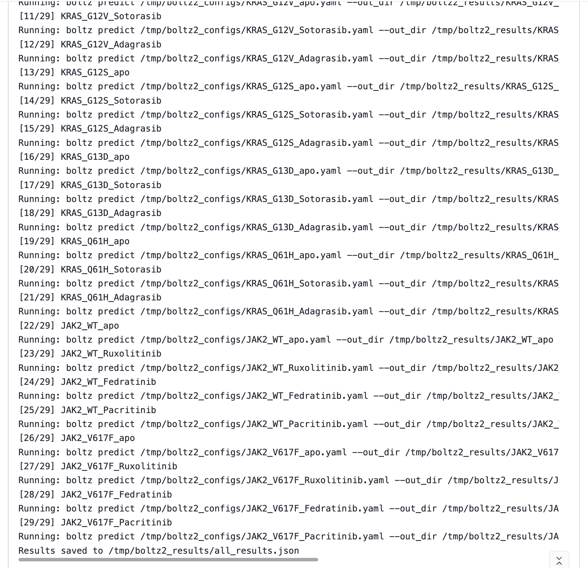
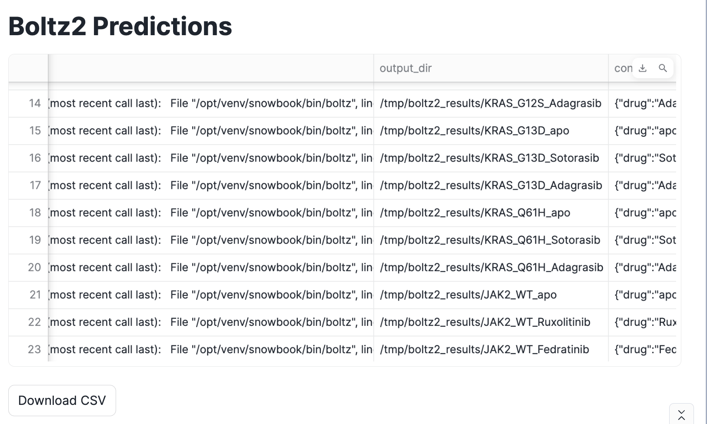

author: Priya Joseph
id: boltz2-protein-structure-prediction-snowflake-gpu
language: en
summary: Run Boltz2 protein structure predictions for KRAS and JAK2 cancer-related mutations on Snowflake GPU Notebooks with Streamlit visualization.
categories: snowflake-site:taxonomy/product/ai, snowflake-site:taxonomy/snowflake-feature/model-development, snowflake-site:taxonomy/industry/healthcare-and-life-sciences
environments: web
status: Published
feedback link: https://github.com/Snowflake-Labs/sfguides/issues
tags: Getting Started, Data Science, Machine Learning, GPU, Notebooks, Protein Structure Prediction, Bioinformatics

# Boltz2 Protein Structure Prediction on Snowflake GPU Notebooks
<!-- ------------------------ -->
## Overview
Duration: 5

This guide walks you through running [Boltz2](https://github.com/jwohlwend/boltz) protein structure predictions for cancer-related mutations on Snowflake GPU Notebooks. You will predict structures for KRAS and JAK2 variants — two of the most important oncology drug targets — and visualize results using Streamlit.

Boltz2 is an open-source deep learning model for biomolecular structure prediction. In this quickstart, you will generate 29 structure predictions covering:
- **KRAS** (wild-type + 6 variants) × (apo, Sotorasib, Adagrasib) = 21 configs
- **JAK2 JH2 domain** (wild-type + V617F) × (apo, Ruxolitinib, Fedratinib, Pacritinib) = 8 configs

### Prerequisites
- A Snowflake account with access to GPU-enabled Notebooks (NVIDIA A100)
- Basic familiarity with Python and molecular biology concepts

### What You'll Learn
- How to install and run Boltz2 v0.4.0 on Snowflake GPU Notebooks
- How to apply a compatibility fix for the flash-attn library version mismatch
- How to generate YAML configs for protein-ligand structure predictions
- How to parse prediction results and visualize them with Streamlit

### What You'll Need
- A Snowflake account with GPU Notebook access (NVIDIA A100-SXM4-40GB)

### What You'll Build
- A Snowflake Notebook that runs 29 Boltz2 protein structure predictions and displays results in a Streamlit dashboard

<!-- ------------------------ -->
## Create a GPU Notebook
Duration: 3

1. In Snowsight, navigate to **Projects → Notebooks**
2. Click **+ Notebook**
3. Under **Runtime**, select a GPU-enabled warehouse with **NVIDIA A100** GPUs
4. Choose **Python 3.10** as the kernel
5. Name the notebook `Boltz2_KRAS_JAK2_Predictions`

Once the notebook is running, proceed to install the required packages.

<!-- ------------------------ -->
## Install Dependencies
Duration: 5

Run the following cells one at a time. **Restart the kernel after each pip install cell** to ensure packages load correctly.

**Cell 1: Install supporting packages**
```python
!pip install einops dm-tree modelcif
```

**Cell 2: Install Boltz2 and pinned dependencies**
```python
!pip install boltz==0.4.0 scipy==1.13.1 click==8.1.7 numba==0.61.2
```

**Cell 3: Install compatible NumPy and PyTorch Lightning**
```python
!pip install numpy==1.26.3 pytorch-lightning==2.4.0
```

> **Important:** Restart the notebook kernel after each install cell above.

**Cell 4: Verify Boltz2 is installed**
```python
import boltz
```

<!-- ------------------------ -->
## Apply flash-attn Compatibility Fix
Duration: 2

Boltz2 v0.4.0 references function names from an older version of the `flash-attn` library (`flash_attn_unpadded_*`). The Snowflake GPU runtime ships with flash-attn v2.6.0+, which renamed these to `flash_attn_varlen_*`. This disk-patch rewrites the source file so both in-process imports and subprocess calls work correctly.

```python
primitives_path = "/opt/venv/snowbook/lib/python3.10/site-packages/boltz/model/layers/triangular_attention/primitives.py"

with open(primitives_path, 'r') as f:
    content = f.read()

content = content.replace(
    'flash_attn_unpadded_kvpacked_func',
    'flash_attn_varlen_kvpacked_func'
).replace(
    'flash_attn_unpadded_func',
    'flash_attn_varlen_func'
).replace(
    'flash_attn_unpadded_qkvpacked_func',
    'flash_attn_varlen_qkvpacked_func'
)

with open(primitives_path, 'w') as f:
    f.write(content)

print("Patched primitives.py on disk")
```

Without this patch you will see:
```
ImportError: cannot import name 'flash_attn_unpadded_kvpacked_func'
```

<!-- ------------------------ -->
## Check GPU and Define Sequences
Duration: 3

**Cell 5: Verify GPU availability**
```python
import os
import json
import yaml
from pathlib import Path
from dataclasses import dataclass, asdict
from typing import List, Dict, Optional, Any
import subprocess

import torch
print(f"PyTorch version: {torch.__version__}")
print(f"CUDA available: {torch.cuda.is_available()}")
if torch.cuda.is_available():
    print(f"GPU: {torch.cuda.get_device_name(0)}")
    print(f"GPU Memory: {torch.cuda.get_device_properties(0).total_mem / 1e9:.1f} GB")
```

**Cell 6: Define protein sequences, drug SMILES, and variant lists**
```python
KRAS_SEQUENCE = (
    "MTEYKLVVVGAGGVGKSALTIQLIQNHFVDEYDPTIEDSYRKQVVIDGETCLLDILDTAGQEEYSAMRDQYMRTGEGF"
    "LVKFVNNSKESSPNEKSKKRHRAKRYLALRGCLWLRLTADMTPRTEVKSEACPKTIIRSESSLSGSSCQQSTTQAQS"
    "AASPKSKTPGKHHRKTSSKTCVIM"
)

JAK2_JH2_DOMAIN = (
    "SCSSMPSGKLCLRMKQHVLEGQPKDRPLVQVLFGFAKLECPKPPCQLGLKPLNLEPLNLLYTKKDRYSYEFLKIKFV"
    "PGQQEGNDRVVSIEEYLPHVQRVLHELGILYCEIATNQPGKINLVNVSLTVKFLLHPENILSFTEKKFLNEQDKITF"
    "PLEIQILKTVHQEILLIANKLLNQEPVLIQVSHWNLTTLKKCVRQIRPALEVKNTRLTHMVHKGFYPSCSYKVYTHH"
    "EGLLNKMNICIVNNQGELVRVEYVVKNLGSLGFSSSHWDFCTGSLQKLEWTTSSLSVHVQPNYLRRSDLRDQISIL"
)

DRUG_SMILES = {
    "Sotorasib": "CC1=C(C=C(C=C1)F)NC(=O)C2=CC(=CN=C2)C3=C(C=C(C=C3)F)C(=O)NC4=C(C=CC(=C4)C(C)(C)C#N)Cl",
    "Adagrasib": "CC1=C(C=C(C=C1)F)NC(=O)C2=CC(=C(N=C2)NC3=C(C=CC(=C3)C(C)(C)C#N)Cl)F",
    "Ruxolitinib": "CC(C)C1=CC=CC=C1NC(=O)C2=C(N=C(C=C2)C3=CC=NC4=CC=CC=C43)N",
    "Fedratinib": "CC1=CC(=CC=C1)NC(=O)C2=CC=C(C=C2)CN3CCN(CC3)C4=CC=C(C=C4)OC5=NC=CC(=N5)N",
    "Pacritinib": "C1CC(=O)NC2=CC=C(C=C2)C3=CN=C(N=C3)NC4=CC=C(C=C4)OCCOCCN5CCOCC5"
}

@dataclass
class Variant:
    name: str
    gene: str
    position: int
    wt_aa: str
    mut_aa: str
    significance: str

KRAS_VARIANTS = [
    Variant("G12C", "KRAS", 12, "G", "C", "Sotorasib/Adagrasib target"),
    Variant("G12D", "KRAS", 12, "G", "D", "Most common KRAS mutation"),
    Variant("G12V", "KRAS", 12, "G", "V", "Common in pancreatic cancer"),
    Variant("G12S", "KRAS", 12, "G", "S", "Rare KRAS mutation"),
    Variant("G13D", "KRAS", 13, "G", "D", "Common in colorectal cancer"),
    Variant("Q61H", "KRAS", 61, "Q", "H", "GTPase domain mutation"),
]

JAK2_VARIANTS = [
    Variant("V617F", "JAK2", 31, "V", "F", "MPN driver mutation"),
]

print(f"KRAS sequence length: {len(KRAS_SEQUENCE)}")
print(f"JAK2 JH2 domain length: {len(JAK2_JH2_DOMAIN)}")
print(f"\nKRAS variants: {[v.name for v in KRAS_VARIANTS]}")
print(f"JAK2 variants: {[v.name for v in JAK2_VARIANTS]}")
```

<!-- ------------------------ -->
## Helper Functions and Config Generation
Duration: 3

**Cell 7: Define helper functions**
```python
def apply_mutation(sequence: str, position: int, new_aa: str) -> str:
    seq_list = list(sequence)
    seq_list[position - 1] = new_aa
    return "".join(seq_list)

def create_boltz_yaml(
    name: str,
    sequence: str,
    ligand_smiles: Optional[str] = None,
    ligand_name: str = "LIG",
    predict_affinity: bool = True
) -> dict:
    config = {
        "version": 1,
        "sequences": [
            {
                "protein": {
                    "id": ["A"],
                    "sequence": sequence
                }
            }
        ]
    }
    if ligand_smiles:
        config["sequences"].append({
            "ligand": {
                "id": ["B"],
                "smiles": ligand_smiles
            }
        })
        if predict_affinity:
            config["affinity"] = {"ligand": "B"}
    return config

def save_yaml(config: dict, filepath: Path):
    filepath.parent.mkdir(parents=True, exist_ok=True)
    with open(filepath, 'w') as f:
        yaml.dump(config, f, default_flow_style=False, sort_keys=False)
    return filepath

print("Helper functions defined.")
```

**Cell 8: Generate all 29 configurations**
```python
OUTPUT_DIR = Path("/tmp/boltz2_configs")
OUTPUT_DIR.mkdir(parents=True, exist_ok=True)

configs = []

kras_drugs = ["Sotorasib", "Adagrasib"]

for drug in [None] + kras_drugs:
    drug_name = drug if drug else "apo"
    name = f"KRAS_WT_{drug_name}"
    config = create_boltz_yaml(
        name=name,
        sequence=KRAS_SEQUENCE,
        ligand_smiles=DRUG_SMILES.get(drug),
        predict_affinity=drug is not None
    )
    filepath = save_yaml(config, OUTPUT_DIR / f"{name}.yaml")
    configs.append({"name": name, "path": str(filepath), "gene": "KRAS", "variant": "WT", "drug": drug_name})

for variant in KRAS_VARIANTS:
    mut_seq = apply_mutation(KRAS_SEQUENCE, variant.position, variant.mut_aa)
    for drug in [None] + kras_drugs:
        drug_name = drug if drug else "apo"
        name = f"KRAS_{variant.name}_{drug_name}"
        config = create_boltz_yaml(
            name=name,
            sequence=mut_seq,
            ligand_smiles=DRUG_SMILES.get(drug),
            predict_affinity=drug is not None
        )
        filepath = save_yaml(config, OUTPUT_DIR / f"{name}.yaml")
        configs.append({"name": name, "path": str(filepath), "gene": "KRAS", "variant": variant.name, "drug": drug_name})

jak2_drugs = ["Ruxolitinib", "Fedratinib", "Pacritinib"]

for drug in [None] + jak2_drugs:
    drug_name = drug if drug else "apo"
    name = f"JAK2_WT_{drug_name}"
    config = create_boltz_yaml(
        name=name,
        sequence=JAK2_JH2_DOMAIN,
        ligand_smiles=DRUG_SMILES.get(drug),
        predict_affinity=drug is not None
    )
    filepath = save_yaml(config, OUTPUT_DIR / f"{name}.yaml")
    configs.append({"name": name, "path": str(filepath), "gene": "JAK2", "variant": "WT", "drug": drug_name})

for variant in JAK2_VARIANTS:
    mut_seq = apply_mutation(JAK2_JH2_DOMAIN, variant.position, variant.mut_aa)
    for drug in [None] + jak2_drugs:
        drug_name = drug if drug else "apo"
        name = f"JAK2_{variant.name}_{drug_name}"
        config = create_boltz_yaml(
            name=name,
            sequence=mut_seq,
            ligand_smiles=DRUG_SMILES.get(drug),
            predict_affinity=drug is not None
        )
        filepath = save_yaml(config, OUTPUT_DIR / f"{name}.yaml")
        configs.append({"name": name, "path": str(filepath), "gene": "JAK2", "variant": variant.name, "drug": drug_name})

print(f"Generated {len(configs)} configurations:")
print(f"  - KRAS: {len([c for c in configs if c['gene'] == 'KRAS'])} configs")
print(f"  - JAK2: {len([c for c in configs if c['gene'] == 'JAK2'])} configs")
print(f"\nConfig files saved to: {OUTPUT_DIR}")
```

<!-- ------------------------ -->
## Run Predictions
Duration: 30

**Cell 9: Inspect a sample config**
```python
sample_config = OUTPUT_DIR / "KRAS_G12C_Sotorasib.yaml"
print(f"Sample config: {sample_config}\n")
with open(sample_config) as f:
    print(f.read())
```

**Cell 10: Define the prediction runner and run a test batch**
```python
RESULTS_DIR = Path("/tmp/boltz2_results")
RESULTS_DIR.mkdir(parents=True, exist_ok=True)

def run_boltz2(yaml_path: Path, output_dir: Path, use_msa_server: bool = True) -> Dict[str, Any]:
    cmd = [
        "boltz", "predict", str(yaml_path),
        "--out_dir", str(output_dir),
        "--recycling_steps", "3",
        "--diffusion_samples", "1",
    ]
    if use_msa_server:
        cmd.extend(["--use_msa_server"])
    print(f"Running: {' '.join(cmd)}")
    result = subprocess.run(cmd, capture_output=True, text=True)
    return {
        "config": str(yaml_path),
        "returncode": result.returncode,
        "stdout": result.stdout,
        "stderr": result.stderr,
        "output_dir": str(output_dir)
    }

test_configs = [
    c for c in configs
    if c['name'] in ['KRAS_WT_apo', 'KRAS_G12C_Sotorasib', 'JAK2_V617F_Ruxolitinib']
]

print(f"Running {len(test_configs)} test predictions...\n")

results = []
for config in test_configs:
    print(f"\n{'='*60}")
    print(f"Processing: {config['name']}")
    print(f"{'='*60}")
    result = run_boltz2(
        yaml_path=Path(config['path']),
        output_dir=RESULTS_DIR / config['name']
    )
    result['config_info'] = config
    results.append(result)
    if result['returncode'] == 0:
        print(f"Success")
    else:
        print(f"Failed: {result['stderr'][:500]}")

print(f"\n\nCompleted {len(results)} predictions")
```

**Cell 11: Run all 29 predictions**

This takes approximately 6–10 minutes total on an A100 GPU (~12 seconds per structure).

```python
print(f"Running ALL {len(configs)} predictions...")
print("This may take several minutes on A100 GPU.\n")

all_results = []
for i, config in enumerate(configs):
    print(f"\n[{i+1}/{len(configs)}] {config['name']}")
    result = run_boltz2(
        yaml_path=Path(config['path']),
        output_dir=RESULTS_DIR / config['name']
    )
    result['config_info'] = config
    all_results.append(result)

with open(RESULTS_DIR / 'all_results.json', 'w') as f:
    json.dump(all_results, f, indent=2)
    print(f"\nResults saved to {RESULTS_DIR / 'all_results.json'}")
```



<!-- ------------------------ -->
## Parse Results and Visualize with Streamlit
Duration: 5

**Cell 12: Parse Boltz2 output files**
```python
import glob

def parse_boltz_results(results_dir: Path) -> List[Dict]:
    parsed = []
    for result_path in results_dir.glob("*/predictions/"):
        name = result_path.parent.name
        confidence_files = list(result_path.glob("*_confidence.json"))
        entry = {"name": name}
        if confidence_files:
            with open(confidence_files[0]) as f:
                conf_data = json.load(f)
                entry["plddt"] = conf_data.get("plddt_mean", None)
                entry["ptm"] = conf_data.get("ptm", None)
                entry["affinity"] = conf_data.get("affinity", None)
        pdb_files = list(result_path.glob("*.pdb"))
        cif_files = list(result_path.glob("*.cif"))
        entry["pdb_file"] = str(pdb_files[0]) if pdb_files else None
        entry["cif_file"] = str(cif_files[0]) if cif_files else None
        parsed.append(entry)
    return parsed

if RESULTS_DIR.exists():
    parsed_results = parse_boltz_results(RESULTS_DIR)
    if parsed_results:
        print("Parsed Results:")
        print("-" * 80)
        for r in parsed_results:
            print(f"\n{r['name']}:")
            print(f"  pLDDT: {r.get('plddt', 'N/A')}")
            print(f"  pTM: {r.get('ptm', 'N/A')}")
            print(f"  Affinity: {r.get('affinity', 'N/A')}")
            print(f"  Structure: {r.get('pdb_file', 'N/A')}")
    else:
        print("No results parsed yet. Run predictions first.")
else:
    print("Results directory not found. Run predictions first.")
```

**Cell 13: Streamlit visualization**

Toggle the cell to **Streamlit** mode in the Snowflake Notebook UI, then run:

```python
import streamlit as st
import pandas as pd
import json

with open('/tmp/boltz2_results/all_results.json', 'r') as f:
    results = json.load(f)

st.title("Boltz2 Predictions")

if results:
    df = pd.DataFrame(results)
    st.dataframe(df)
    st.download_button("Download CSV", df.to_csv(index=False), "boltz2_results.csv")
else:
    st.warning("No results found")
```



<!-- ------------------------ -->
## Conclusion and Resources
Duration: 2

Congratulations! You have successfully run Boltz2 protein structure predictions for 29 KRAS and JAK2 configurations on a Snowflake GPU Notebook, including a compatibility fix for the flash-attn library and a Streamlit dashboard for results visualization.

### What You Learned
- How to install Boltz2 v0.4.0 on Snowflake GPU Notebooks
- How to patch the flash-attn version mismatch that causes `ImportError` with `flash_attn_unpadded_*` functions
- How to programmatically generate Boltz2 YAML configs for protein-ligand structure predictions across multiple variants and drugs
- How to run 29 predictions on NVIDIA A100 GPUs (~12s each)
- How to visualize results with Streamlit in Snowflake Notebooks

### Related Resources
- [Boltz2 GitHub Repository](https://github.com/jwohlwend/boltz)
- [Snowflake GPU-enabled Notebooks Documentation](https://docs.snowflake.com/en/user-guide/ui-snowsight/notebooks-gpu)
- [Streamlit in Snowflake Notebooks](https://docs.snowflake.com/en/user-guide/ui-snowsight/notebooks-streamlit)
