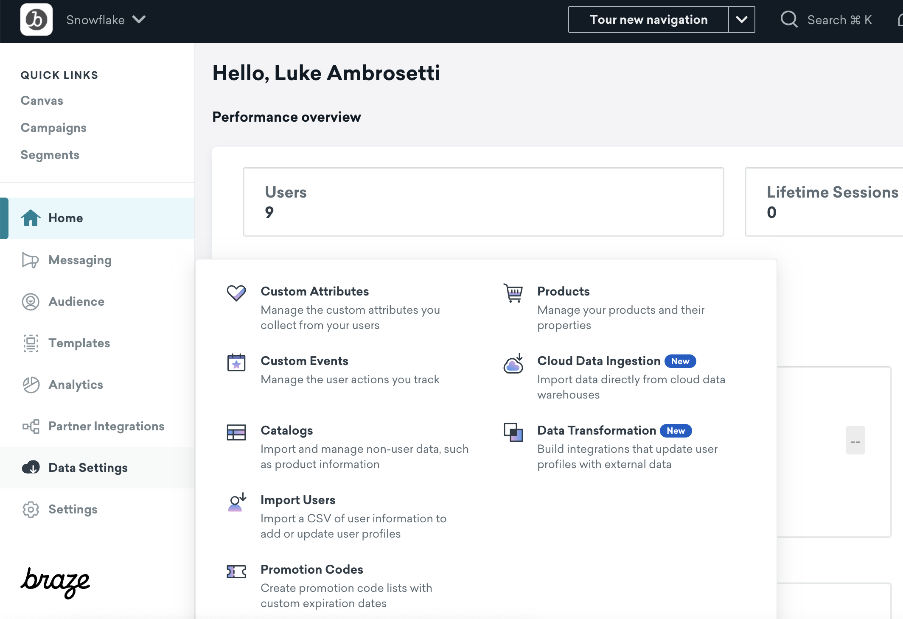
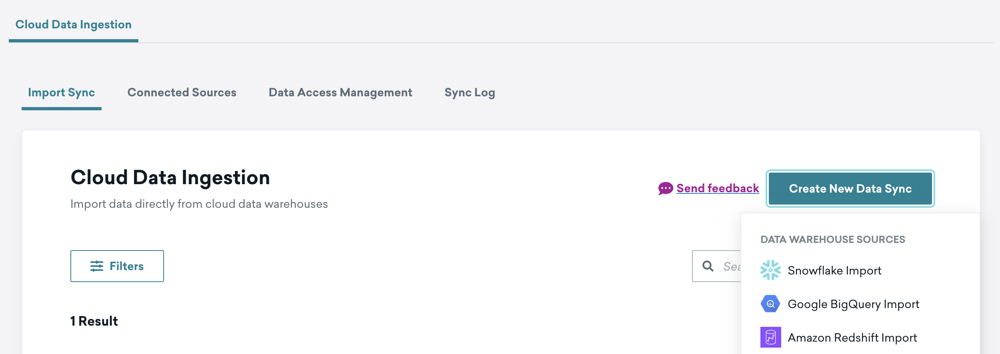
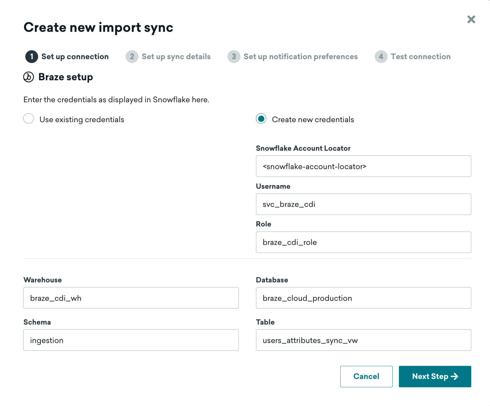
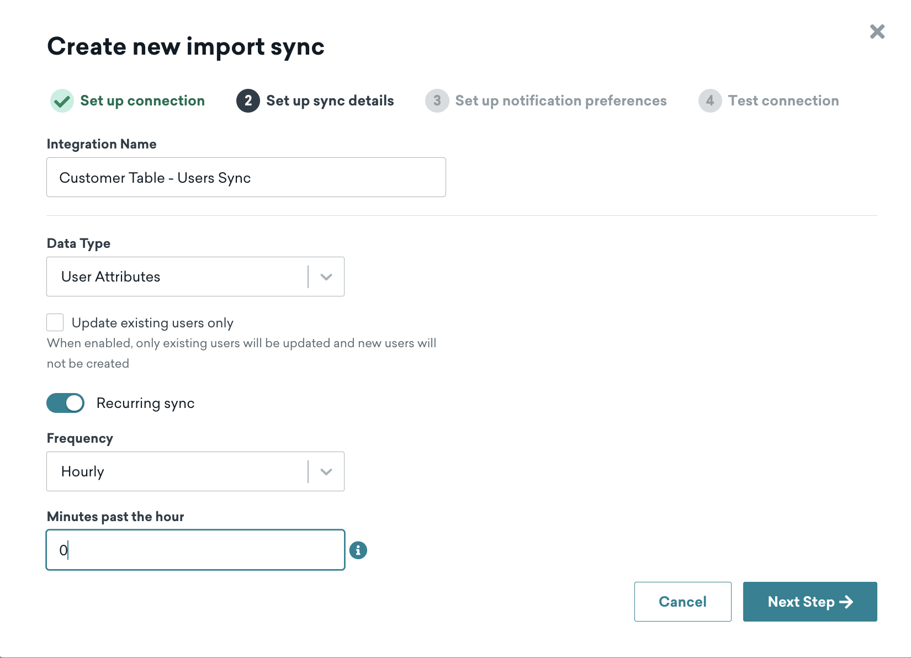
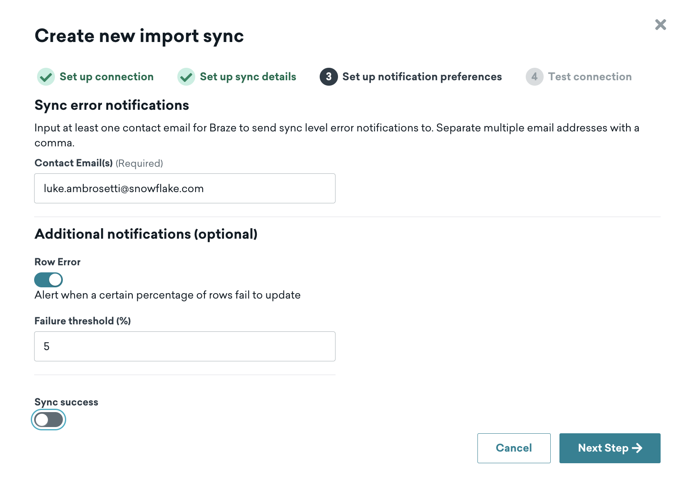
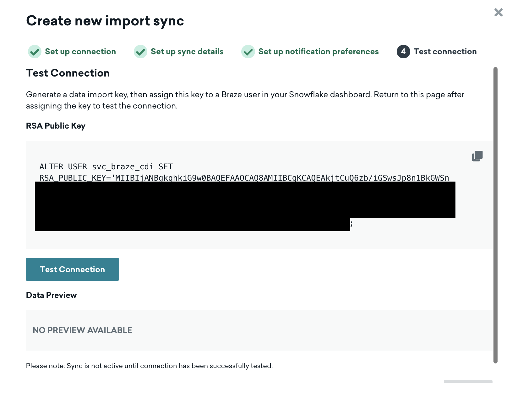
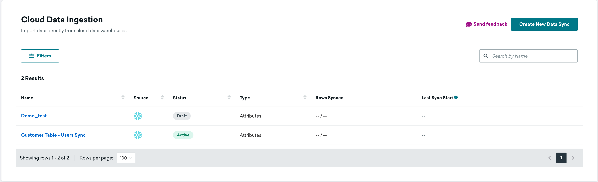
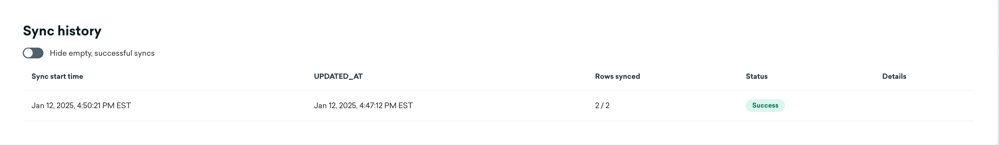

author: Luke Ambrosetti 
id: braze-cdi
categories: snowflake-site:taxonomy/solution-center/certification/quickstart, snowflake-site:taxonomy/product/data-engineering, snowflake-site:taxonomy/snowflake-feature/ingestion, snowflake-site:taxonomy/snowflake-feature/external-collaboration
language: en
summary: Sync Snowflake customer data with Braze Cloud Data Ingestion for personalized marketing campaigns.
environments: web
status: Published 
feedback link: https://github.com/Snowflake-Labs/sfguides/issues


# Braze Cloud Data Ingestion
<!-- ------------------------ -->
## Overview 

Braze Cloud Data Ingestion (CDI) is the easiest way to take data from Snowflake and ingest into the Braze platform.

Braze CDI allows you to set up a direct connection from your data storage solution to Braze to sync relevant user or catalog data, and delete users. When synced to Braze, this data can be leveraged for use cases such as personalization or segmentation. Cloud Data Ingestion’s flexible integration supports complex data structures including nested JSON and arrays of objects.

**Braze Cloud Data Ingestion capabilities**:
- Create a simple integration directly from Snowflake to Braze in just a few minutes.
- Securely sync user data, including attributes, events, and purchases from Snowflake to Braze.
- Close the data loop with Braze by combining Cloud Data Ingestion with Snowflake Data Sharing.

### Prerequisites
- Familiarity with SQL and JSON

### What You’ll Learn 
- how to create the necessary objects + schema in Snowflake for Braze CDI
- how to create a Snowflake Stream
- how to orchestrate a data pipeline with a Snowflake Task 
- how to use the Braze CDI UI to create a connection to Snowflake 

### What You’ll Need 
- A [Snowflake](https://signup.snowflake.com/?utm_source=snowflake-devrel&utm_medium=developer-guides&utm_cta=developer-guides) Account 
- A [Braze](https://www.braze.com/get-started) Account

### What You’ll Build 
- A Snowflake data pipeline for Braze CDI

<!-- ------------------------ -->
## Snowflake Setup

### Create the Braze User, Role, and Warehouse

For this step, you can alternatively use the [Braze+Snowflake Pipeline Notebook](https://github.com/Snowflake-Labs/sf-samples/blob/main/samples/braze-cdi-pipeline/braze_cdi_customer.ipynb). Otherwise follow the guide using Snowflake worksheets.

Here, we'll create the dedicated role and user. The user will be created as a service user as this user is not a human logging into Snowflake, but rather used as a part of the Braze platform to read data from Snowflake. This means that we will be explicitly be deactivating password authentication for login via the Snowflake UI.

Braze will generate the necessary key-pair authentication during the actual Braze CDI installation steps in the Braze UI. In this step, we're just creating the user, role, and the virtual warehouse.

```sql
use role accountadmin;
create or replace role braze_cdi_role;
create or replace user svc_braze_cdi type = service default_role = braze_cdi_role;

grant role braze_cdi_role to role accountadmin;
grant role braze_cdi_role to user svc_braze_cdi;

create or replace warehouse braze_cdi_wh with warehouse_size='xsmall'; -- XS for this demo, but even in production - this warehouse shouldn't be larger than a M/L for large scale. Start with Small and then bump as needed to meet any sync time/SLA requirement

grant usage on warehouse braze_cdi_wh to role braze_cdi_role;
```

### Create the Braze Schema

This creates a dedicated Braze database + schema for use with CDI. It allows CDI to read updates in the necessary Braze format.

In this example notebook, we'll only be focused on **user attribute** updates and **deletes** by creating the users_attributes_sync table. That table will then have two views: the `users_attributes_sync_vw` and the `users_deletes_vw`.

The `users_attributes_sync_vw` view will have the following fields:
- external_id - which is the [External ID](https://www.braze.com/docs/developer_guide/platform_integration_guides/web/analytics/setting_user_ids/#suggested-user-id-naming-convention) that you feed to Braze
- payload - which is JSON-as-text
- updated_at - the UTC timestamp of when the sync record was created in this table. This allows Braze to keep track of only ingesting net-new events

The `users_deletes_vw` view will have the following fields
- external_id - which is the [External ID](https://www.braze.com/docs/developer_guide/platform_integration_guides/web/analytics/setting_user_ids/#suggested-user-id-naming-convention) that you feed to Braze
- updated_at - the UTC timestamp of when the sync record was created in this table. This allows Braze to keep track of only ingesting net-new events

There is no payload for the deletes view.

Alternatively, you can use the email_address or phone_number as your primary customer identifier; however, for most uses of this process, it's highly suggested that you keep a primary external_id / customer_id that is separate from that. Fields for email and phone can be found in the Braze [documentation](https://www.braze.com/docs/user_guide/data_and_analytics/cloud_ingestion/integrations/#step-1-set-up-tables-or-views).

```sql
create or replace database braze_cloud_production;
grant ownership on database braze_cloud_production to role braze_cdi_role;
use role braze_cdi_role;

create or replace schema braze_cloud_production.ingestion;
use schema braze_cloud_production.ingestion;

create or replace table users_attributes_sync (
    external_id varchar,
    payload varchar,
    updated_at timestamp_ntz not null default sysdate()
);

create or replace view users_attributes_sync_vw 
as
    select *
    from users_attributes_sync
    where payload is not null
;

create or replace view users_deletes_vw
as
    select external_id, updated_at
    from users_attributes_sync
    where payload is null
;
```

<!-- ------------------------ -->
## Setup and Simulate Snowflake Data Pipeline

### Generate simple sample data

We're not going to get too fancy with this sample data to make sure tracking the changes are as easy to understand as possible in the next sections. We'll just generate a few records of "customer" data with a few attributes on each customer.

In a real-world scenario, this "customer" table would be a table with all of your customers. 

```sql
create or replace schema braze_cloud_production.demo_data;
use schema braze_cloud_production.demo_data;

create or replace table customer
(
    customer_id number(11,0), --this will be used for the external_id
    first_name varchar,
    last_name varchar,
    title varchar,
    state varchar,
    employer varchar,
    days_since_last_purchase number
);

insert into customer select 1, 'jim', 'smith', 'developer', 'CA', 'Glooble', 320;
insert into customer select 2, 'luke', 'skywalker', 'jedi', 'TN', 'Rebels', 1;
insert into customer select 3, 'george p.', 'burdell', 'engineer', 'GA', 'CNN', 72;

select *
from customer;
```

### Tracking changes with a Snowflake Stream

A [Snowflake Stream](https://docs.snowflake.com/en/user-guide/streams-intro) is an easy way to track changes on a table in Snowflake. The below code simulates inserting a new customer, updates a customer, and deleting a customer.

```sql
create or replace stream customer_stream
on table customer;

-- new customer
insert into customer select 4, 'alice', 'gates', 'chef', 'NY', 'self-employed', 0;

-- updated customer
update customer
set title = 'senior engineer'
where customer_id = 3;

-- deleted customer
delete
from customer
where customer_id = 2;

select *
from customer_stream;
```

### Load the changes to the Braze schema

These are the core steps that is done continously at a time period of your choosing. We'll show an example of automating this at the end.

#### Create a temporary table

First, we'll want to capture these changes as a new temp table to operate on them, but it's also an easy way to advance the offset in the stream.

```sql
create or replace temp table cust_stream_tmp
as
select *
from customer_stream;
```

Then, you can check the stream to ensure that the stream is now back to being **empty** (as it waits for new inserts, updates, or deletes).

```sql
select *
from customer_stream;
```

#### Transform into the Braze payload

Each attribute that has changed on each customer will need to be translated to a json representation of the same record when data is sync'd to Braze. Therefore, a record like:

| customer_id | first_name | last_name | title | state | employer | days_since_last_purchase |
| -------- | ------- | ------- | ------- | ------- | ------- | ------- |
| 3 | george p. | burdell | engineer | GA | CNN | 72 |

Would equate to the following json payload for Braze:

```json
{
    "first_name" : "george p.",
    "last_name" : "burdell",
    "title" : "engineer",
    "state" : "GA",
    "employer" : "CNN",
    "days_since_last_purchase" : 72
}
```

While this is what the *entire* record would look like in Braze, we need to efficiently submit the payload for only the **changed** attributes. For George, only his title changed from "engineer" to "senior engineer". Therefore, we need a payload that matches that changed attribute:

```json
{
    "title" : "senior engineer"
}
```

Because "updates" are handled as both an *insert* and *delete* in a stream, the SQL to do this can seem a little opaque. In the code below, you'll see that comments separate each section specifying which records are new, which records are updated, and which records have been deleted - all combined with UNION ALL.

```sql
INSERT into braze_cloud_production.ingestion.users_attributes_sync

-- get new customers in the CUSTOMER table
select cs.customer_id::varchar as external_id, to_json(object_agg(cs.col, cs.val::variant))::varchar as payload, sysdate() updated_at
from cust_stream_tmp
    UNPIVOT(val FOR col IN (first_name, last_name, title, state, employer)) cs
where cs.metadata$action = 'INSERT'
and cs.metadata$isupdate = FALSE
group by cs.customer_id

-- add updates to existing customers
UNION ALL
select cs.customer_id::varchar as external_id, to_json(object_agg(cs.col, cs.val::variant))::varchar as payload, sysdate() updated_at 
from cust_stream_tmp
    UNPIVOT(val FOR col IN (first_name, last_name, title, state, employer)) cs
left join 
    (select * from cust_stream_tmp
    UNPIVOT(val FOR col IN (first_name, last_name, title, state, employer)) where metadata$action = 'DELETE') cs2
    on cs.metadata$row_id = cs2.metadata$row_id and cs.val = cs2.val
where cs.metadata$action = 'INSERT'
and cs2.val is null
and cs.metadata$isupdate = TRUE
group by cs.customer_id

-- add deletes to deleted customers
UNION ALL
select customer_id::varchar as external_id, null as payload, sysdate() updated_at
from cust_stream_tmp
where metadata$action = 'DELETE'
and metadata$isupdate = FALSE;

select *
from braze_cloud_production.ingestion.users_attributes_sync;
```

Now - we can see the views for both the inserts/updates:

```sql
select *
from braze_cloud_production.ingestion.users_attributes_sync_vw;
```

As well as the deletes:

```sql
select *
from braze_cloud_production.ingestion.users_deletes_vw;
```

A Snowflake stream is going to be one of the easiest and most efficient ways to track changes to a single table. The above method keeps [best practices](https://www.braze.com/docs/user_guide/data_and_analytics/cloud_ingestion/overview/#only-write-new-or-updated-attributes-to-minimize-consumption) in mind to save on both Snowflake and Braze costs.

<!-- ------------------------ -->
## Automation + CDI Installation

Now that we've successfully simulated how this process works, it's time to think about automating this process to run consistently for Braze CDI.

Every step through creating the stream was a one-time setup piece. We'll need to automate the transformation piece to run periodically.

To automate this, we'll put the recurring steps in a stored procedure, and then schedule them with a [Snowflake Task](https://docs.snowflake.com/en/user-guide/tasks-intro). There are other options, like creating a new notebook with just the necessary sells and scheduling the notebook to run, but overall I recommend tasks for data pipelines. Alternatively, you may choose to use your own orchestration outside of Snowflake as well!

In the stored procedure, there will only be a few steps:
1. Create the temp table (and advance the stream offset)
2. Create the SQL for the transformation
3. Run the SQL

The stored procedure will take in 2 parameters: the stream name and the fields/attributes to be analyzed for changes. It will then output the records that are inserted into the `ingestion.users_attributes_sync` table. 

The task will then wrap the procedure and take care of the actual insert operation. 

```sql
CREATE OR REPLACE PROCEDURE braze_cdi_cust_proc(stream_name STRING, fields STRING)
  RETURNS table(external_id varchar, payload varchar, updated_at timestamp_ntz)
  LANGUAGE PYTHON
  RUNTIME_VERSION = '3.9'
  PACKAGES = ('snowflake-snowpark-python')
  HANDLER = 'run'
AS
$$
def run(session, temp_table, fields):

  temp_table_sql = f"""
    create or replace temp table temp_table as select * from {stream_name}
  """
  session.sql(temp_table_sql)

  transform_sql = f"""
  SELECT cs.customer_id::varchar as external_id, to_json(object_agg(cs.col, cs.val::variant)) as payload, sysdate() updated_at
    FROM temp_table
        UNPIVOT(val FOR col IN ({fields})) cs
    where cs.metadata$action = 'INSERT'
    and cs.metadata$isupdate = FALSE
    group by cs.customer_id

    -- add updates to existing customers
    UNION ALL
    SELECT cs.customer_id::varchar as external_id, to_json(object_agg(cs.col, cs.val::variant)) as payload, sysdate() updated_at 
    FROM temp_table
        UNPIVOT(val FOR col IN ({fields})) cs
    left join 
        (select * from temp_table
        UNPIVOT(val FOR col IN ({fields})) where metadata$action = 'DELETE' and metadata$isupdate = TRUE) cs2
        on cs.metadata$row_id = cs2.metadata$row_id and cs.val = cs2.val
    where cs.metadata$action = 'INSERT'
    and cs2.val is null
    and cs.metadata$isupdate = TRUE
    group by cs.customer_id
    
    -- add deletes to deleted customers
    UNION ALL
    select cs.customer_id::varchar as external_id, null as payload, sysdate() updated_at
    FROM temp_table
    where cs.metadata$action = 'DELETE'
    and cs.metadata$isupdate = FALSE
  """
  return session.sql(transform_sql)

$$;

create task braze_cdi_cust_task
  warehouse = braze_cdi_wh
  schedule = '60 MINUTE'
  as
    insert into braze_cloud_production_dd.ingestion.users_attributes_sync
    select *
    from table(braze_cdi_cust_proc('customer_stream','first_name, last_name, title, state, employer'));
```

After creating a task, you'll need to `RESUME` the task to kick it off. It then runs on the schedule until suspended. So that you don't actually run this code accidentally in the notebook, it will be included here for reference:

```sql
alter task braze_cdi_cust_task resume;
```

As deciding on the schedule, a best practice here would be to run the task similar to how the customer table is updated. If the customer table is updated every hour, then run the task every hour (and subsequently, CDI every hour).

<!-- ------------------------ -->
## Braze Setup

For this quickstart, we'll walk through setting up the `users attributes` sync for Braze CDI. We created the Snowflake pipeline to also handle `user deletes`, but that will not be documented step by step here. 

### CDI Setup

Start by logging into your Braze account and finding **Data Settings** -> **Cloud Data Ingestion** on the left nav.



Click the **Create New Data Sync** button to bring up the installation overlay.



As you're most likely setting this connection up for the first time, you'll need to use the **Create new credentials** radio button.



The fields necessary are as follows:
- `Snowflake Account Locator`: Your [account locator](https://docs.snowflake.com/en/user-guide/admin-account-identifier#format-2-account-locator-in-a-region), which is your region-specific URL for your account. The locator will take on a different convention depending on the cloud + region that your Snowflake account is deployed in. Use the table in the Snowflake [documentation](https://docs.snowflake.com/en/user-guide/admin-account-identifier#format-2-account-locator-in-a-region) to help. e.g. AWS US-East-1 will look something like `ABC1234.us-east-1`.
- `Username`: svc_braze_cdi
- `Role`: braze_cdi_role
- `Warehouse`: braze_cdi_wh
- `Database`: braze_cloud_production
- `Schema`: ingestion
- `Table`: **users_attributes_sync_vw**

**Remember to use the view for the "table" here, not the raw table. This specific process will on handle inserts and updates. A delete process will be a separate setup.**

After clicking "Next Step", you'll see the page where you set up the sync details.



Give the "integration name" any business-friendly name of your choosing. The others are as follows:

- `Data Type`: User Attributes
- `Update existing users only`: For this quickstart, leave unchecked. This really is only checked if this process is a "supplemental" process to updating users in Braze, and not the primary workflow.
- `Recurring Sync`: ON
- `Frequency`: Hourly (for this quickstart)
- `Minutes past the hour`: 0 (for this quickstart)

"Frequency" and "Minutes past the hour" could be changed to other settings; however, we'll keep it simple for this setup. In general, it's recommended that frequency matches the pipeline that you've setup that you've used in Snowflake.

After clicking "Next Step", you'll now set up the notification alerts.



Configure this page to your liking. If you set the notifications for errors only, it's recommended that a distribution list is used that's connected to any on-call data engineering support.

After clicking "Next Step", you'll come to the authentication screen.



Braze automatically creates the key-pair authentication for the service user that you created in Snowflake during the previous step.

Here, you'll copy the command that Braze gives you and paste it into a Snowflake worksheet (using the ACCOUNTADMIN role).

```sql
ALTER USER svc_braze_cdi SET RSA_PUBLIC_KEY='MII... <this is here for reference only>';
```

#### (Optional) Network Setup

Beyond updating authentication for the service user, you also might need to allow the IPs from Braze CDI as well. If there are network rules/policies in place, here's how you can allow the service user access:

```sql
create or replace network rule braze_cdi_rule
  type = IPV4
  value_list = ('23.21.118.191','52.58.142.242','13.210.1.145','34.206.23.173','52.29.193.121','13.211.70.159','50.16.249.9','35.158.29.228','13.238.45.54','52.4.160.214','18.157.135.97','52.65.73.167','54.87.8.34','3.123.166.46','54.153.242.239','54.156.35.251','3.64.27.36','54.206.45.213','52.54.89.238','3.65.88.25','18.205.178.15','3.68.144.188','3.70.107.88')
  mode = INGRESS
  comment ='ingress ip range specified in https://www.braze.com/docs/user_guide/data_and_analytics/cloud_ingestion/integrations';

create or replace network policy braze_cdi_policy
  allowed_network_rule_list = ('braze_cdi_rule');

alter user svc_braze_cdi set network_policy = braze_cdi_policy;
```

#### Testing the Connection

After you're done with the above, go back to the Braze UI and hit the **Test Connection** button. This will create a connection to Snowflake and show a preview of the data being ingested (for this quickstart, it's just 2 rows!)

#### (Optional) Delete User Process

You can repeat these steps for user deletes as well. Click **Create new data sync** and reuse your existing credentials. Then, use the `users_deletes_vw` as your table.

<!-- ------------------------ -->
## Starting CDI

After testing the connection, you should see now that your connection is in *Draft* mode.



Click the "play" button on the right side will activate this connection and start the sync.

After the sync has run at least once, the sync history will populate to show that the sync has been run.



After running this sync once, for this quickstart, I highly suggest pausing the sync so that this process can be reconfigured for production. Feel free to use the objects created here in this quickstart, but be sure to set up your own stream and task on production tables!

<!-- ------------------------ -->
## Conclusion And Resources

### What You Learned

With this notebook, you've learned how to do the following steps in Snowflake for use in Braze CDI:
1. Setup the necessary Snowflake objects
2. Generate sample customer records
3. Simulate inserting, updating, and deleting sample records
4. Automate the Snowflake process

### Related Resources
- [Braze CDI Documentation](https://www.braze.com/docs/user_guide/data_and_analytics/cloud_ingestion)
- [Snowflake Pipeline Notebook](https://github.com/Snowflake-Labs/sf-samples/blob/main/samples/braze-cdi-pipeline/braze_cdi_customer.ipynb)
- [Snowflake for Marketing](/en/solutions/departments/marketing/)
