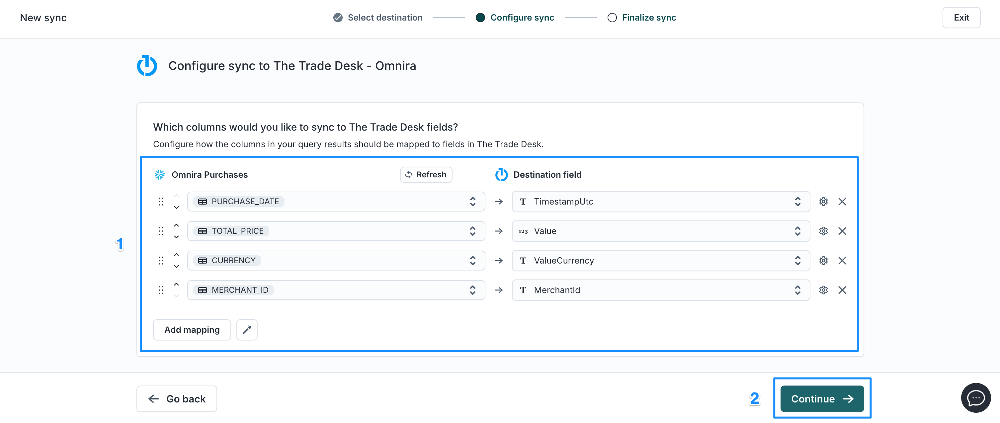
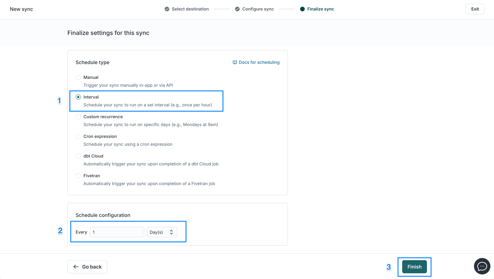

author: Ian Maier
id: build_an_offsite_commerce_media_network_on_snowflake
summary: Build a commerce media platform for audience curation, offsite activation, and closed-loop measurement.
<!--- Categories below should be hyphenated, i.e., Getting-Started. Do not leave blank. Visit site for available categories. -->
categories: Marketing
environments: dais <!--- What is the correct environment for the DAIS hands-on lab? -->
status: Draft
feedback link: https://github.com/Snowflake-Labs/sfguides/issues
tags: Marketing, Partners, Media, Hightouch, Retail, Commerce

# Build an Offsite Commerce Media Network on Snowflake with Hightouch & The Trade Desk
<!-- ------------------------ -->
## Overview 
Duration: 60

In this guide you will learn how to transform your existing Snowflake investment into a user-friendly platform that a non-technical commerce media team can use to curate custom audiences and conversion events, activate them to The Trade Desk for managed service and self-service campaign execution, and provide white-labeled attribution reports.

### Business Scenario
We are building a travel media network for a global luxury hospitality conglomerate called Altuva, which owns multiple hotel brands with millions of  visitors annually. We are partnering with a high-end consumer packaged goods (CPG) company called Omnira, which sells luxury snacks, beverages, and health & wellness amenities within most of Altuva's hotels. Omnira has approached us with a specific campaign request: they want to promote their products to Altuva's upcoming hotel visitors within the 30 days leading up to their arrival in order to influence more in-hotel purchases of their products.

Our task is to build a platform that our non-techincal media team can use to create a custom audience for Omnira's campaign, share those audience for managed service & self-service campaign execution, and provide Omnira with attribution reports to help them understand how well their ads drive in-hotel purchases.

### Prerequisites
- N/A

### What You’ll Learn 
- How to enrich Snowflake with UID2s using the Snowflake Native App for privacy-safe activation and measurement.
- How to build a visual audience builder on top of Snowflake using Hightouch.
- How to activate audiences and conversion events on The Trade Desk using Hightouch, for both managed service and self-service campaign execution.
- How to execute The Trade Desk campaigns using shared audiences and conversion events.
- How to build SKU-level attribution reports in Snowflake using log-level data from The Trade Desk's Raw Event Data Stream (REDS).

### What You’ll Need 
- A Snowflake account login with a role that has the permissions to create a new database, schema, and warehouse to be used by Hightouch. In this hands-on lab you will be granted access to an existing Snowflake account that has been pre-connected to your Hightouch account.
- A Hightouch account with Customer Studio access. An account with temporary Customer Studio access will be provided to you for the hands-on lab.

### What You’ll Build 
- A Snowflake-native visual audience builder customized to your luxury hospitality brand's unique data & offering.
- An activation platform for syndicating audiences and conversion events to The Trade Desk.
- Closed-loop attribution reporting in Snowflake using log-level impression data.

<!-- ------------------------ -->
## Enrich the Snowflake Customers table with UID2
Duration: 10

These instructions provide basic setup details for this hands-on lab. Implementation for your business may vary based on your unique data, use cases, and requirements. For detailed implementation instructions, visit the [UID2 Snowflake Integration Guide &rarr;](https://unifiedid.com/docs/guides/integration-snowflake)

The UID2 Snowflake Native App provides a simplified and seamless process for matching your customer identifiers (e.g. emails and phone numbers) to a pseudonymous identifier that can be used for ad targeting and conversion across publishers supported by The Trade Desk. Unlike directly identifying information, UID2 cannot by itself be traced back to the customer's original identity. UID2 is free to use and open-source.

### How it works
The UID2 Snowflake Native App allows you to enrich your customer tables with UID2 data through authorized functions and views so that you can join UID2 data from the private tables to your customers' emails and phone numbers. You cannot access the private tables directly. The UID2 Share reveals only essential data needed to perform the UID2 enrichment tasks.


### Join UID data to your customer table

To map UID2 to emails and phone numbers in your customer table, we will use the `FN_T_IDENTITY_MAP` function.

1. Go to Projects and create a new project.
2. Copy and paste the following group of SQL statements into your project. We will execute them one at a time to demonstrate the process of enriching email addresses with the UID2 share:

```sql
-- Select Schema

use TAM_TEST;

-- --Create a new table to store Email addresses
Create Table UID_Test_Audience_June25 ( ID INTEGER, EMAIL varchar(128));
    
-- -- Retrieve emails (or hashed emails) from your CDP or CRM platform    

INSERT INTO UID_Test_Audience_June25 
VALUES
(1,'dummy1@demo.com'),
(2,'dummy2@demo.com'),
(3,'dummy3@demo.com'),
(4,'dummy4@demo.com'),
(5,'dummy5@demo.com'),
(6,'dummy6@demo.com'),
(7,'dummy7@demo.com'),
(8,'dummy8@demo.com'),
(9,'dummy9@demo.com'),
(10,'dummy10@demo.com');

-- --Query Table to confirm the emails are in your table
select * from UID_Test_Audience_June25;

-- --Create new empty table with emails, and 2 more columns to collect UID and Bucket ID. This step is in here to illustrate the progression of adding in UIDs and BucketIds
Create Table UID_Test_Audience_June25_withUID ( ID INTEGER, EMAIL varchar(128), UID2 text, Bucket_ID text);

-- --Retrieve UID and bucket ID and insert into a new table, leveraging the functions from the integration guide to map your emails to UID2s
INSERT INTO UID_Test_Audience_June25_withUID 
SELECT 
    a.ID, 
    a.EMAIL, 
    m.UID, 
    m.BUCKET_ID 
FROM UID_Test_Audience_June25 a
LEFT JOIN (
    SELECT 
        ID, 
        t.*
    FROM UID_Test_Audience_June25,
         LATERAL UNIFIED_ID_2_0_ADVERTISER_AND_DATA_PROVIDER_IDENTITY_SOLUTION_DEV.UID.FN_T_IDENTITY_MAP(
             EMAIL, 'email'
         ) t
) m
ON a.ID = m.ID;
    
-- --Confirm the values that now exist in your new table -- now you have mapped emails and can use your UID2s!
select ID, EMAIL, UID2, BUCKET_ID
from UID_Test_Audience_June25_withUID ;

-- --Drop Your Table When Completed. 
-- Drop Table UID_Test_Audience_June25_withUID;
```

The results table includes the data from your customer table (e.g. email address) with a `LEFT JOIN` from the private UID2 tables to bring in the appropriate UID2, bucket, and opt-in status for each email record. For opted-out users you will notice that the UID2 and bucket fields are `null`. This makes compliance easier by restricting access to opted out identifiers upstream.


Now that your customer table is enriched with UID2 values, we can use them for activation and conversion tracking instead of sending directly identifiable information (DII). This will provide better privacy and security for your customer data and will improve your ability to reach your audience and match conversions to impressions and clicks for measurement.

Now that we have our identity data ready to go, let's create our audience curation and activation platform using similar Snowflake data.

<!-- ------------------------ -->
## Access your Hightouch demo account
Duration: 3

In this hands-on lab, you get limited time access to a Hightouch account with:
1. **Full access to a Highotuch account with Customer Studio**, Hightouch's no-code UI that enables marketers to build custom audiences & journeys on your existing Snowflake datasets.
2. **A pre-connected Snowflake account** loaded with mock datasets that represent your customers, loyalty memberships, hotel visits, purchases, and product metadata.
3. **A pre-connected The Trade Desk account** with credential access to send first-party data segments and offline conversion events.

To access your Hightouch demo account:
1. Click on the link provided during the session to access the demo account signup form.
2. Fill in your **email address** and **company name**, and click **Request Access**.
3. Go to your email inbox and find the email with the subject line "Your commerce media hands-on lab account link". If you cannot find the email, check your spam folder.
4. Click on the link in the email to create your Hightouch demo account.

The account comes pre-connected to a shared Snowflake account with mock data for this hands-on lab as well as a Trade Desk account where you can sync audiences & conversion events. Now that we have account access, let's set up the custom audience builder that our team can use to create & sync custom audiences and conversions.

<!-- ------------------------ -->
## Define the data schema
Duration: 5

Data schemas define how data is structured, including the data types (like users, events, accounts, and households) and relationships between those data types. If you think of your data warehouse like an actual house, your data schema is the blueprint. Just like a blueprint outlines the structure of a house—where the rooms are and how they connect—a data schema defines how your data is organized and how different parts of your data relate to one another.

When you define a data schema in Hightouch, it tells the platform how data can be segmented and queried within the visual audience builder. Each unique data schema results in a unique audience segmentation experience for the end-user based on the objects, events, and relationships that you establish between your data assets.

For our travel media network at Altuva, there are three data types we need to represent in our schema using the tables already in Snowflake:
1. **Customers** - Information about our customers, including their identity and loyalty membership status.
2. **Hotel Visits** - Information about past, present, and future hotel visits, including when and where our customers are visiting our hotels.
3. **Purchase Events** - Past and present amenities purchased in our hotels.


### Create a Customer parent model
Parent models define the primary dataset you want to build your audiences off. In this guide, we will create a Customers table that represents all of Altuva's customers so that we can create customer audiences and sync them to The Trade Desk to target with offsite ads.

To create a [parent model](https://hightouch.com/docs/customer-studio/schema#parent-model-setup) for Altuva use the following steps:
1. Create a parent model
    
    1. Go to the [Schema page](https://app.hightouch.com/schema-v2/view).
    2. Select your Snowflake data source from Step 5 by selecting it from the dropdown.
    3. Click **Create parent model**.
2. Select the **CUSTOMERS** table, preview the results, and click **Continue**.
    
3. Configure the Customers model:
    
    1. Enter a **name** for your parent model. In this example, use “Customers”.
    2. Select a **primary key**. You must select a column with unique values. In this example, use **CUSTOMER_ID** for the primary key.
    3. Select columns for the model's **primary label** and **secondary label**. Hightouch displays these column values when previewing audiences. In this example, we will use **FIRST_NAME** as the primary label and **LAST_NAME** as the secondary label.
    4. Click **Create parent model**.

The parent model will now appear in the schema builder. You can edit an existing parent model by clicking on it and making changes in the Query tab. For more configuration options, refer to the [column configuration](https://hightouch.com/docs/customer-studio/schema#column-configuration) section.


### Create Hotel Visits related model
Related models and events provide additional characteristics or actions on which you can filter your parent model. When you create a related model, you simultaneously set up the relationship between it and other objects in the schema. Related objects can have 1:many, 1:1, or many:1 relationships with other objects.

For our travel media network we will create a related model for Hotel Visits  with a many:1 relationship with your Customers object so that we can create segments based on past or upcoming visits to certain hotels.

1. Click the **+** button on the **Customers parent model** that you created before and select **Create a related model**.
    
2. Select the **HOTEL_VISITS** table using the table selector, **preview the results**, and click **Continue**.
    
3. Configure the model:
    
    1. Enter a **name** for your related model. In this example, name it “Hotel Visits”.
    2. Define the related model's **Relationship**. In this example, select the relationship's cardinality as **1:Many**.
    3. To join rows from the related model to rows in the parent model, select the relevant **foreign key columns** from the parent (Customers) and related model (Hotel Visits). In this example, select **Customer_ID** as the foreign key for both models.
    4. Click **Create related model**.

The related model now appears in the schema builder. You can edit an existing related model by clicking on it and making changes in the Query tab.


### Create a Purchases parent model
In order to support each advertising partner with closed-loop measurement, we will want to be able to use the audience builder to quickly create filtered-down conversion event feeds. In this example, we want to make sure that we are only sending Purchase event data for Omnira products, and that we are not sending purchase events for products from other partners.

To do this, we will create a second Parent model for **Purchases**. These parent model will be linked to the Customers parent model that we can do two things with the data:
1. Exclude customers from our audiences if they purchased an Omnira product recently.
2. Send Purchase conversion events to Omnira's advertising account when the purchase includes an Omnira product.

To create and link two parent models together:
1. Click the **Create** button at the top right of the Schema builder page and select **Parent model**.
    
2. Select the **PURCHASES** table using the table selector, preview the results, and click **Continue**.
    
3. Configure the events model:
    
    1. Enter a **name** for your event model. For this example, use "Purchases".
    2. Set the appropriate **Primary Key** field to determine how to distinguish between events. In this example, select **PURCHASE_ID**. Set the **Primary key** to **PURCHASE_ID** and the **Secondary Label** to **PRODUCT_NAME**. Click **Create parent model**.
    
    7. You should now see a new Parent model in the schema builder. To link the Purchases and Customers tables, click on the **Purchases** parent model and click **Relationships** > **Add Relationship**.
    
8.  Use the selectors to create a **many:1** relationship between Purchases and Customers. Set the foreign keys so that both tables are linked using the **CUSTOMER_ID** field in each respective model.
    9. Click **Save changes**.

The **Purchases** parent model will now be linked to the Customers parent model. Now you will be able to use Hightouch's audience builder to create audiences for targeting as well as conversion events for measurement.


<!-- ------------------------ -->
## Create a custom audience
Duration: 5

Now that we've built the schema for audience building and conversion tracking, we can use Hightouch's audience builder to create a custom audience for our advertising partner's upcoming campaign.

Omnira wants to run an influence campaign to encourage Altuva visitors to buy more of their products when they visit Altuva hotels. But they want to carefully segment the audience to ensure the campaign is as targeted and effective as possible:
- Target members with Platinum or Diamond loyalty tiers to promote a discount offer.
- Target customers with a visit coming up in the next 30 days.
- Exclude visitors of the Cavara Residences, since they don’t offer their products at that hotel brand.
- Exclude recent purchasers.

For most CDPs and audience managers, this audience would be too complex to build without the help of data engineers to write complex SQL statements across data tables since most platforms don't support concepts like "Hotel Visits". But with the customized schema we built using our Snowflake data, a business user in Hightouch can build this audience in a few minutes without technical limitations.

### Build a custom audience in Hightouch
Now that you have set up your data schema, your non-technical media team can use Hightouch's visual audience builder to curate custom audiences across the Customers, Hotel Visits, and Purchase tables that you defined.

The audiences that your team creates are transformed into a SQL query that will read your data directly in Snowflake at sync-time. This ensures that none of your sensitive data is copied and stored in an external vendor's database, simplifying privacy and security and ensuring every audience sync uses the most up-to-date view of your customers. 

To build a custom audience in Hightouch for the Omnira campaign:
1. Go to **Customer Studio > Audience** and click **Add audience**.
    
2. Select the **Customers** parent model.
    
3. Build the audience to match the definition here:
    
    1. Select **Add filter** and choose **Customers > MEMBERSHIP_LEVEL**.
    
    2. Select **Platinum** and **Diamond**.
    
    3. Select **Add filter** and choose **Relations > Hotel Visits**.
    
    4. Select **Where event property is** and choose the **CHECK_IN_DATE** field, and select **within next 1 months**.
    
    5. Select **Where event property is** again and choose the **HOTEL_BRAND** field. Click the **equals** box and change the logic to **does not equal** **Cavara Residences**.
    
    6. Select **Add filter** and choose **Events > Purchases**.
    
    7. Click on the filter that says **at least 1 time** and change the frequency to **at most 0 times**.
    
    8. Select the **Time window filter** on the **Purchase event** and change the filter to **within the previous 1 year**.
    
    9. Scroll back to the top and click **Calculate size** to get an estimate of the number of customers in the audience. Click **Continue** at the bottom.
    
    10.  Name the audience “Upcoming Visitors to Altuva Hotels” and click **Finish** to save the audience.

Your audience definition has now been saved in Hightouch and is ready to be activated by creating a sync to The Trade Desk. Hightouch will only query your Snowflake tables at sync-time when you push data to a destination, or when you explicitly call a function that requires it (e.g. previewing an audience size or audience overlap).

<!-- ------------------------ -->
## Sync the custom audience to The Trade Desk
Duration: 3

Now we will sync the audience that we created to The Trade Desk for targeting. In this example, we will use a first-party data segment to sync the audience to your own The Trade Desk seat for managed service execution. Hightouch also offers an integration with The Trade Desk's third-party data marketplace where you can list audiences for public or private use and set CPM rates so that The Trade Desk can automatically track advertising usage, bill your customers, and pay you for their usage.

### Configure The Trade Desk first-party data segment sync
1. Click **Add sync** from the Upcoming Visitors to Altuva Hotels audience page.
    
2. Select **The Trade Desk - Omnira**.
    
3. Select **First-party data segment**. This will allow you to create, sync, and refresh a first-party audience to The Trade Desk using UID2 as the match key.
    
4. Keep the **create new segment** setting on and leave the **segment name** blank. The sync will automatically inherit the audience name, “Upcoming Visitors - Omnira”.
    
5. Select the **UID2** field from your Snowflake Customers table. Make sure it is mapped to the **Unified ID 2.0 (UID2)** field from The Trade Desk. Click **Continue**.
    
6. Set the **Schedule Type** to **Manual** and click **Finish**. In a live environment, we would set the schedule on an interval to refresh daily so that Hightouch automatically adds and removes the appropriate users daily, ensuring your audience is always fresh and complies with opt-out requests.
    

### Run and observe the sync
When Hightouch pushes an audience to The Trade Desk, they use a method of change data capture to only add and remove the necessary audience members from the previous sync. This reduces the load on your warehouse and the amount of data needed to pass between systems. Hightouch also provides granular observability and alerting so that you can easily monitor and fix any unexpected issues querying Snowflake or passing data to The Trade Desk.

1. To run the sync manually, click **Run Sync**.
    
2. To observe the status of the sync run, click on the **processing** sync under **Recent sync runs**.
    

The Run Summary page provides granular insight into the status and speed of the data being queried on Snowflake and synced to The Trade Desk. This level of observability helps your team easily monitor, diagnose, and fix any issues with slow or failed audience updates. You also have the option to set up alerting so that your team can proactively identify and fix issues.


<!-- ------------------------ -->
## Run a managed service campaign with the audience
Duration: 5

Now that the Altuva team has access to the audience in THe Trade Desk, they can select and target that audience in their campaigns by adding the audience to an ad group.


Altuva can also preview the audience before using it to see the number of people, households, and devices that they can reach.


Altuva can also sync audiences through the third-party data marketplace for Omnira to access and use themselves for self-service campaign execution.

<!-- ------------------------ -->
## Create a brand-specific conversion feed
Duration: 5

Now that Altuva is actively targeting Omnira's audience with ads, Omnira want to track the success of their campaign in The Trade Desk. However, it's important that the reports that Altuva provide only includes conversions and revenue from Omnira products. This means that we will need to provide the Altuva team with the ability to easily segment their conversion events based on the brand of product purchases.

To create a brand-specific conversion event we will use the audience builder to create an audience of Purchases with specific filters:

1. Navigate to **Customer Studio** > **Audiences** in Hightouch and click **Add audience**.
    
2. Select the **Purchases** parent model so that we can build an audience of purchase events.
    
3. Click **Add filter** in the audience builder and select the **PURCHASE_DATE** property so that we can filter to recent conversion events.
    
4. Set the **PURCHASE_DATE** time window to **within previous 1 week**.
    
5. Click **Add filter** in the audience builder and select the **BRAND** property. Add a **contains Omnira** filter to ensure only Omnira purchase data is shared. Click **Continue**.
    
6. Name the audience "Omnira Purchases" and click **Finish**.
   

Now you have a brand-specific conversion audience that you can sync to The Trade Desk. You can easily clone this audience to create new conversion feeds for other brands.

<!-- ------------------------ -->
## Sync the brand-specific conversion data to The Trade Desk
Duration: 3

To activate the brand-specific Purchase events for measurement against our campaign, we will send the conversion data directly to their advertising seat. We then have the option to use those conversions in our own ad seat for managed services, or to share a feed of those conversion events with Omnira them to measure results against their self-service campaign:
1. Click **Add Sync** from the Omnira Purchases audience page.
    
2. Select the The Trade Desk - Altuva destination.
    
3. Select the **Offline conversion events** configuration option.
    
4. Keep the default tracking tag configuration options set and name the offline tracking tag "Altuva Purchases".
    
5. Select **Purchases** for the event name set up the match values so that The Trade Desk can match conversions back to specific impressions and clicks for attribution. Select the **UID2** field from the **Omnira Purchases** model and map it to the **UID2** value under the **destination field**.
    
6. Configure the conversion event metadata and click **Continue**.
    
    1. **PURCHASE_DATE** -> **TimestampUtc**
    2. **TOTAL_PRICE** -> **Value**
    3. **CURRENCY** -> **ValueCurrency**
    4. **Merchant_ID** -> **MerchantId**
8. Define the sync schedule. In this example, set the schedule on an **Interval**. Set the interval to **every 1 day(s)**. Click **Finish**.
   

You have successfully set up a conversion feed to send new conversions to Altuva's advertising account using UID2 to privately and securely match conversions to impressions and clicks from their ad campaigns. For managed services, we can link these conversion events to the campaign in our advertising seat. For self-service campaigns, we can choose to share that conversion feed with Omnira so that they can link it to their campaign for measurement.

<!-- ------------------------ -->
## Use conversion data for measurement & reporting
Duration: 5

### Measure conversions in managed service campaigns
Now that the conversion data has been synced to our advertising seat, they can use that data for campaign measurement and reporting in our managed service campaign. Conversion events can be found within The Trade Desk by navigating to the **Advertiser Data & Identity** tile.


### Share conversions for self-service campaigns
If we were enabling a self-service campaign for Omnira, we could alternatively choose to share the conversion feed with Omnira's advertising seat, where they can link those conversions to their own campaign for measurement.

<!-- ------------------------ -->
## Set up REDS data feed into Snowflake
Duration: 5

Raw Event Data Stream (REDS) is one of The Trade Desk's Snowflake-supported reporting solutions. It provides partners with log-level data on impressions, clicks, video views, and conversions from campaigns run across publishers. REDS data can be collected and delivered to Snowflake on an hourly basis.

Here's what REDS allows you to do:
- Create whitelabeled campaign reports for each individual advertising customer.
- Tie your attribution reports to detailed financial metrics by joining log-level data to detailed transaction and product metadata.
- Analyze attributed revenue and spend across multiple off-site and on-site ad platforms to show full-funnel impact across all channels.
- Fine-tune your media execution with hourly data streams, instead of waiting for information to aggregate.

With The Trade Desk as a data partner at the Snowflake Data Exchange, you can use Snowflake to access your REDS data. However, because REDS requires pre-authorization to access, we will demo the use of REDS data live.

<!-- ------------------------ -->
## Create an attribution model & chart in Snowflake
Duration: 5

Once your REDS data is feeding into Snowflake, you can join that data to your own customer data to build custom reports and develop in-depth insights and analysis for your advertising clients. In this example, we will build a simple view-through attribution report with the help of Snowflake's AI Copilot.

### Use Copilot to generate the attribution model
To develop the attribution report:
1. Log into Snowflake and navigate to **Projects**. Click **New project**.
2. In the bottom right corner, click **Copilot**.
3. Copy and paste the following prompt to ask the Copilot to generate a SQL query for our attribution model:

### Copilot Prompt
```text
Write a SQL query that combines the impression log data from the CMN_HOL.PUBLIC.REDS_IMPRESSIONS table with the conversion events from the CMN_HOL.PUBLIC.PURCHASES table to create a last-touch attribution model with a 7-day view-through attribution window. Only include purchases from the Omnira brand. Provide a breakdown by Product Name. Display the attributed conversion count. Group the attribution metrics by week.
```

The copilot will generate SQL for the attribution model. It will look something like this:
### Attribution Model
```SQL
WITH last_touch AS (
  SELECT
    p.purchase_id,
    p.product_name,
    p.purchase_date,
    p.brand,
    i.impressionid,
    i.logentrytime,
    ROW_NUMBER() OVER (
      PARTITION BY p.purchase_id
      ORDER BY
        i.logentrytime DESC
    ) AS touch_rank
  FROM
    purchases AS p
    LEFT JOIN reds_impressions AS i ON i.logentrytime <= p.purchase_date
    AND DATEDIFF (DAY, i.logentrytime, p.purchase_date) <= 7
  WHERE
    p.brand ILIKE '%omnira%'
)
SELECT
  DATE_TRUNC ('WEEK', purchase_date) AS attribution_week,
  product_name,
  COUNT(
    DISTINCT CASE
      WHEN touch_rank = 1 THEN purchase_id
    END
  ) AS attributed_conversions
FROM
  last_touch
WHERE
  NOT product_name IS NULL
GROUP BY
  DATE_TRUNC ('WEEK', purchase_date),
  product_name
ORDER BY
  attribution_week,
  product_name;
```

Alternatively, you can copy and paste the SQL above into your project and run the SQL statement. This will result in a table showing weekly breakdowns of attributed conversions by product name:


### Create an attribution chart
Using the attribution model that you just created, we can develop a simple bar chart to visualize the product revenue attributed to your conversion events:
1. Click on **Charts** in the Snowflake project.
2. Use the **Bar Chart** type. Select the **SUM** of the **Attributed Conversions** column and the **Attribution Week** column.

You should now see a bar chart showing the weekly sum of Omnira purchases per week. Using a BI tool, you can similarly create shared dashboards for your clients to display attributed conversions and revenue broken down by campaign, SKU, hotel, and more.


<!-- ------------------------ -->
## Conclusion
Duration: 0

In this guide, you learned how to transform Snowflake into an end-to-end commerce media platform that your media team can use to curate custom audiences and conversion events, activate them to The Trade Desk for managed service and self-service campaigns, and measure attribution through in-platform reporting and custom reports built on log-level data in Snowflake.

This guide used mock datasets as a guide, but you can use your own datasets with Hightouch to develop a platform that is customized to your unique data assets.

Hightouch's flexible schema allows you to represent unique objects and events that traditional CDPs do not support. Because Hightouch accesses your datasets directly in Snowflake, you can easily make any of your Snowflake ML models, like propensity or affinity models, available as attributes in your audience builder. Your media team can then use those models to develop premium custom audiences for clients that provide better performance and demand higher CPM fees.

### Additional Resources
- [Blog: An architecture blueprint for retail media success](https://hightouch.com/blog/retail-media-blueprint)
- [Hightouch Customer Studio](https://hightouch.com/platform/customer-studio)
- [The Trade Desk for Retail & Commerce Media](https://www.thetradedesk.com/our-demand-side-platform/retail-media)

### Build your own media network
Ready to build your own? [Contact the Hightouch team](https://www.hightouch.com/signup) to get started.
