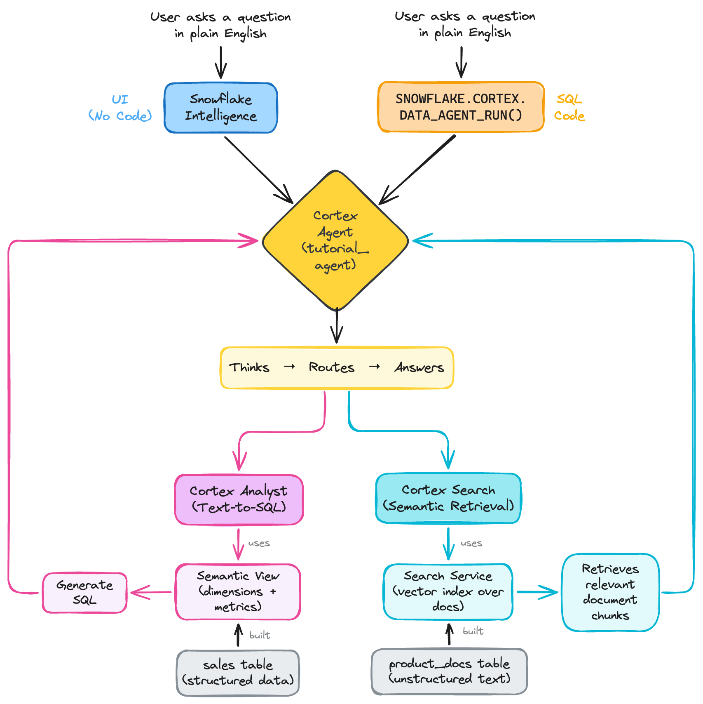
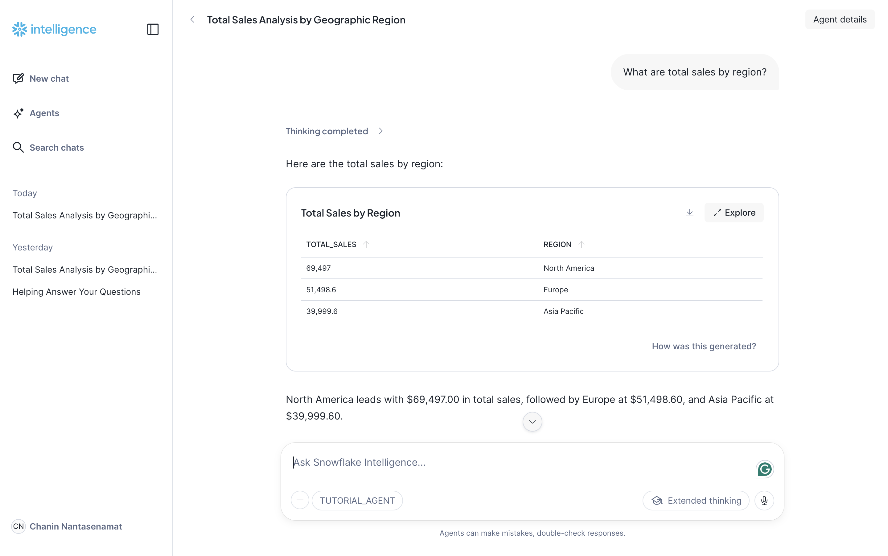
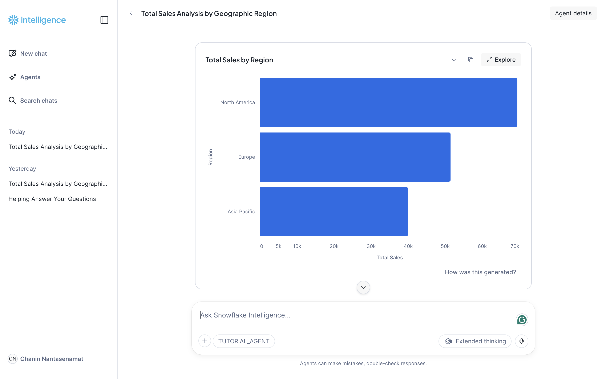
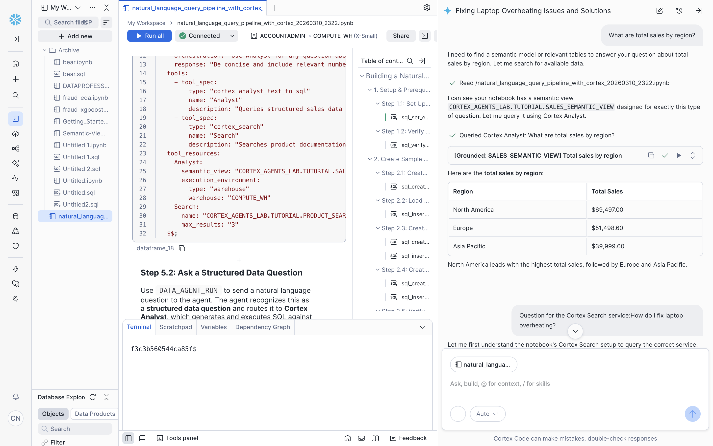

author: Chanin Nantasenamat
id: build-a-cortex-agent-from-scratch-with-snowflake
categories: snowflake-site:taxonomy/solution-center/certification/quickstart, snowflake-site:taxonomy/product/ai
language: en
summary: Build a Cortex Agent that orchestrates across structured and unstructured data using Cortex Analyst, Cortex Search, and Snowflake Intelligence.
environments: web
status: Published
feedback link: https://github.com/Snowflake-Labs/sfguides/issues


# Build a Cortex Agent from Scratch with Snowflake
<!-- ------------------------ -->
## Overview

Every organization sits on two kinds of data: **structured data** (numbers in tables like sales figures, inventory counts, and transaction logs) and **unstructured data** (text in documents like product manuals, troubleshooting guides, and policy documents). Traditionally, getting answers from these two worlds required completely different tools and skills. Want to know last quarter's revenue? Write a SQL query. Need to find the assembly instructions for a product? Search through a document repository. Want both in one conversation? Good luck stitching those workflows together manually.

This is the problem **AI agents** solve. An AI agent doesn't just generate text like a basic LLM call. It *reasons* about your question, *decides* which tool to use, *executes* that tool, and *synthesizes* the results into a coherent answer. Ask it "What are total sales by region?" and it routes to a SQL engine. Ask it "How do I fix laptop overheating?" and it searches your documentation. Ask both in the same conversation, and it handles each seamlessly.

**Cortex Agents** bring this capability directly into Snowflake. You don't need to set up external orchestration frameworks, manage API keys for third-party services, or write complex routing logic. Everything (the agent, its tools, and the data it accesses) lives inside your Snowflake account, governed by the same roles and permissions you already use.

In this guide, you'll build an end-to-end pipeline from scratch, starting with the data. You'll create and load sample data into tables, create a **semantic view** that lets the agent translate natural language into SQL, build a **Cortex Search service** that lets it retrieve relevant documentation, and wire both into a **Cortex Agent** that answers questions about sales data and product documentation, all with standard SQL.

### What You'll Learn
- What Cortex Agents are and how they orchestrate across structured and unstructured data
- What semantic views are and how they enable natural language to SQL translation
- What Cortex Search services are and how they power retrieval-augmented generation (RAG)
- How to create an agent with full tool configuration using `CREATE AGENT ... FROM SPECIFICATION`
- How to test an agent with `DATA_AGENT_RUN` and parse its responses with Python
- How to interact with an agent through Snowflake Intelligence's chat interface

### What You'll Build
A Cortex Agent with two tools:
- **Cortex Analyst**: takes natural language questions like "What are total sales by region?" and automatically converts them into SQL queries that run against your sales data
- **Cortex Search**: takes questions like "How do I assemble the standing desk?" and retrieves the most relevant product documentation using semantic search

The agent automatically decides which tool to use based on what the user asks. You don't write any routing logic; the agent figures it out.

<!-- Workflow diagram (editable): https://excalidraw.com/#json=MioFuiqlV9qvS_486Ezdl,ui60jdFQ8rz79OBXlQABcg -->


### Prerequisites
- A [Snowflake account](https://signup.snowflake.com/?utm_source=snowflake-devrel&utm_medium=developer-guides&utm_cta=developer-guides) (if you don't have one, you can sign up for a free trial)
- `ACCOUNTADMIN` role (or a role with `CREATE AGENT`, `CREATE SEMANTIC VIEW`, and `CREATE CORTEX SEARCH SERVICE` privileges)
- A running warehouse (this guide uses `COMPUTE_WH`, but any warehouse will work)
- Cortex AI enabled on your account (available in most Snowflake regions)

<!-- ------------------------ -->
## Setup Environment

Before building anything, you need a workspace in Snowflake to hold all the objects you'll create (tables, semantic views, search services, and the agent itself). Think of a **database** as a top-level folder and a **schema** as a subfolder within it.

You'll also verify that Cortex AI is available on your account, since the agent depends on it.

### Where to Run SQL

You can run all the SQL in this guide in either:
- **SQL Worksheet**: In Snowsight, click **+ > SQL Worksheet** in the top left
- **Snowflake Notebook**: In Snowsight, click **+ > Notebook** (useful if you want to mix SQL and Python cells, since you'll need Python for the testing section later)

> **Want everything in one notebook?** Download the [companion notebook](https://github.com/Snowflake-Labs/snowflake-demo-notebooks/blob/main/Build-a-Cortex-Agent-from-Scratch-with-Snowflake/build-a-cortex-agent-from-scratch-with-snowflake.ipynb) and import it into Snowsight (**+ > Notebook > Import .ipynb file**).

### Set Up Database and Schema

Copy and paste the following SQL and run it. Each line is explained below:

```sql
-- Use the ACCOUNTADMIN role, which has full privileges
USE ROLE ACCOUNTADMIN;

-- Select a warehouse (compute resource) to run queries
USE WAREHOUSE COMPUTE_WH;

-- Create a new database to hold all tutorial objects
CREATE DATABASE IF NOT EXISTS CORTEX_AGENTS_LAB;
USE DATABASE CORTEX_AGENTS_LAB;

-- Create a schema (subfolder) inside the database
CREATE SCHEMA IF NOT EXISTS TUTORIAL;
USE SCHEMA TUTORIAL;
```

**What each command does:**
- `USE ROLE ACCOUNTADMIN` sets your active role. `ACCOUNTADMIN` has all privileges, which simplifies this tutorial. In production, you'd use a more restricted role.
- `USE WAREHOUSE COMPUTE_WH` selects which compute resource runs your queries. If your warehouse has a different name, replace `COMPUTE_WH` with your warehouse name.
- `CREATE DATABASE` / `CREATE SCHEMA` creates the containers for all the objects you'll build. `IF NOT EXISTS` means it won't error if they already exist.

### Verify Cortex Access

Before going further, confirm that Cortex AI is working on your account. Run this simple test that asks an LLM to respond:

```sql
SELECT SNOWFLAKE.CORTEX.COMPLETE('claude-3-5-sonnet', 'Say hello in one word');
```

**What this does:** `SNOWFLAKE.CORTEX.COMPLETE()` is a built-in function that sends a prompt to an LLM and returns the response. Here, we're using `claude-3-5-sonnet` as the model. If it returns something like "Hello", you're all set.

**If you get an error:** Cortex AI may not be enabled in your account's region. Check the [Cortex AI availability documentation](https://docs.snowflake.com/en/user-guide/snowflake-cortex/llm-functions#availability) for supported regions.

<!-- ------------------------ -->
## Create Sample Data

Now you'll create the data that your agent will work with. You need two types:

1. **Structured data** (a sales table with numbers and categories) that Cortex Analyst will query with SQL
2. **Unstructured data** (product documentation as free-form text) that Cortex Search will index and retrieve

You'll also create an inventory table that's useful for exploring the data, though the agent in this tutorial focuses on sales and documentation.

### Create the Sales Table

This table represents transaction-level sales data for a retail business. Each row is one sale, with information about what was sold, where, for how much, and to what type of customer.

```sql
CREATE OR REPLACE TABLE sales (
    sale_id NUMBER AUTOINCREMENT,
    sale_date DATE,
    product_name VARCHAR,
    category VARCHAR,
    region VARCHAR,
    quantity NUMBER,
    unit_price NUMBER(10,2),
    total_amount NUMBER(10,2),
    customer_segment VARCHAR
);

INSERT INTO sales (sale_date, product_name, category, region, quantity, unit_price, total_amount, customer_segment)
VALUES
    ('2024-01-15', 'Laptop Pro', 'Electronics', 'North America', 10, 1299.99, 12999.90, 'Enterprise'),
    ('2024-01-16', 'Wireless Mouse', 'Electronics', 'Europe', 50, 29.99, 1499.50, 'SMB'),
    ('2024-01-17', 'Office Chair', 'Furniture', 'North America', 20, 299.99, 5999.80, 'Enterprise'),
    ('2024-01-18', 'Standing Desk', 'Furniture', 'Asia Pacific', 15, 499.99, 7499.85, 'SMB'),
    ('2024-01-19', 'Monitor 27"', 'Electronics', 'Europe', 30, 399.99, 11999.70, 'Enterprise'),
    ('2024-01-20', 'Keyboard Pro', 'Electronics', 'North America', 100, 149.99, 14999.00, 'Consumer'),
    ('2024-02-01', 'Laptop Pro', 'Electronics', 'Asia Pacific', 25, 1299.99, 32499.75, 'Enterprise'),
    ('2024-02-05', 'Webcam HD', 'Electronics', 'North America', 75, 79.99, 5999.25, 'SMB'),
    ('2024-02-10', 'Office Chair', 'Furniture', 'Europe', 40, 299.99, 11999.60, 'Enterprise'),
    ('2024-02-15', 'Headphones', 'Electronics', 'North America', 60, 199.99, 11999.40, 'Consumer'),
    ('2024-03-01', 'Standing Desk', 'Furniture', 'North America', 35, 499.99, 17499.65, 'Enterprise'),
    ('2024-03-10', 'Laptop Pro', 'Electronics', 'Europe', 20, 1299.99, 25999.80, 'SMB');
```

**What this creates:** 12 sales transactions across 3 regions (North America, Europe, Asia Pacific), 2 categories (Electronics, Furniture), and 3 customer segments (Enterprise, SMB, Consumer). The `AUTOINCREMENT` on `sale_id` means Snowflake automatically assigns an incrementing ID to each row.

**Quick check:** Preview the data to see what you loaded:

```sql
SELECT * FROM sales ORDER BY sale_date LIMIT 5;
```

### Create the Inventory Table

This table tracks stock levels for each product. It's not directly used by the agent in this tutorial, but it's included so you can explore the data and potentially extend the agent later.

```sql
CREATE OR REPLACE TABLE inventory (
    product_name VARCHAR,
    sku VARCHAR,
    quantity_in_stock NUMBER,
    reorder_level NUMBER,
    unit_cost NUMBER(10,2),
    last_restocked DATE
);

INSERT INTO inventory VALUES
    ('Laptop Pro', 'LP-001', 45, 20, 899.99, '2024-03-01'),
    ('Wireless Mouse', 'WM-002', 500, 100, 12.99, '2024-02-15'),
    ('Office Chair', 'OC-003', 75, 25, 149.99, '2024-02-20'),
    ('Standing Desk', 'SD-004', 30, 15, 299.99, '2024-03-05'),
    ('Monitor 27"', 'MN-005', 60, 20, 249.99, '2024-02-28'),
    ('Keyboard Pro', 'KP-006', 200, 50, 79.99, '2024-03-10');
```

### Create Product Documentation

This is the **unstructured data** that Cortex Search will index. Each row contains a text document about a product, covering things like specifications, troubleshooting guides, assembly instructions, and care tips.

Unlike the sales table (which has clean numeric columns you can aggregate), this data is free-form text that requires semantic search to be useful.

```sql
CREATE OR REPLACE TABLE product_docs (
    doc_id NUMBER AUTOINCREMENT,
    product_name VARCHAR,
    doc_type VARCHAR,
    content VARCHAR,
    last_updated DATE
);

INSERT INTO product_docs (product_name, doc_type, content, last_updated)
VALUES
    ('Laptop Pro', 'specifications', 
     'The Laptop Pro features a 15.6-inch 4K display, Intel i9 processor, 32GB RAM, and 1TB SSD. Battery life is up to 12 hours. Includes Thunderbolt 4 ports and Wi-Fi 6E. Weight: 4.2 lbs. Warranty: 3 years standard, extendable to 5 years.',
     '2024-01-01'),
    ('Laptop Pro', 'troubleshooting',
     'Common issues: 1) Battery drain - check background apps and reduce screen brightness. 2) Overheating - ensure vents are not blocked, use on hard surface. 3) Slow performance - check for updates, run disk cleanup. 4) Wi-Fi issues - update network drivers, reset network settings.',
     '2024-01-15'),
    ('Standing Desk', 'specifications',
     'Electric standing desk with memory presets. Height range: 28-48 inches. Desktop size: 60x30 inches. Weight capacity: 300 lbs. Motor: dual motor system for stability. Includes cable management tray and anti-collision sensor.',
     '2024-01-01'),
    ('Standing Desk', 'assembly',
     'Assembly instructions: 1) Attach legs to frame using provided bolts. 2) Connect motor cables to control box. 3) Mount desktop to frame. 4) Connect power cord. 5) Program height presets using control panel. Assembly time: approximately 45 minutes. Tools needed: Phillips screwdriver.',
     '2024-01-10'),
    ('Office Chair', 'specifications',
     'Ergonomic office chair with lumbar support. Adjustable armrests, seat height, and tilt tension. Breathable mesh back. Seat dimensions: 20x19 inches. Weight capacity: 275 lbs. Warranty: 5 years on frame, 2 years on upholstery.',
     '2024-01-01'),
    ('Office Chair', 'care',
     'Care instructions: Clean mesh with mild soap and water. Lubricate casters annually. Check and tighten bolts every 6 months. Do not exceed weight capacity. Store in dry environment. Replace gas cylinder if chair sinks.',
     '2024-02-01');
```

**What this creates:** 6 documents covering 3 products. Notice the `content` column: it contains plain English text, not structured data. This is exactly the kind of data that's hard to query with SQL (you can't `SUM` or `GROUP BY` a paragraph of text) but perfect for semantic search.

### Verify All Data

Run this query to confirm all three tables loaded correctly:

```sql
SELECT 'sales' as table_name, COUNT(*) as row_count FROM sales
UNION ALL SELECT 'inventory', COUNT(*) FROM inventory
UNION ALL SELECT 'product_docs', COUNT(*) FROM product_docs;
```

**Expected results:** 12 sales rows, 6 inventory rows, and 6 product docs rows. If any count is off, re-run the `INSERT` statements for that table.

<!-- ------------------------ -->
## Create Semantic View

Now you'll create the first tool the agent will use: **Cortex Analyst**, which converts natural language questions into SQL queries.

But there's a challenge: how does an LLM know that "revenue" means `SUM(total_amount)` or that "region" refers to the `region` column? It doesn't, unless you tell it. That's what a **semantic view** does.

A semantic view is a layer on top of your table that defines the **business meaning** of your data:
- **Dimensions**: the categorical columns you group by (product name, region, customer segment)
- **Metrics**: the calculations users care about (total sales, units sold, transaction count)
- **Comments**: plain English descriptions that help the LLM understand each field

Think of it as a data dictionary that the LLM reads to write correct SQL.

### Create the Semantic View

Semantic views are defined with SQL using `TABLES`, `DIMENSIONS`, and `METRICS` clauses. Run the following:

```sql
CREATE OR REPLACE SEMANTIC VIEW sales_semantic_view
  TABLES (
    sales AS CORTEX_AGENTS_LAB.TUTORIAL.SALES
      PRIMARY KEY (sale_id)
      COMMENT = 'Transaction-level sales data'
  )
  DIMENSIONS (
    sales.product_name AS product_name
      COMMENT = 'Name of the product sold',
    sales.category AS category
      COMMENT = 'Product category (Electronics, Furniture)',
    sales.region AS region
      COMMENT = 'Sales region (North America, Europe, Asia Pacific)',
    sales.customer_segment AS customer_segment
      COMMENT = 'Customer type (Enterprise, SMB, Consumer)'
  )
  METRICS (
    sales.total_sales AS SUM(total_amount)
      COMMENT = 'Total sales amount in USD',
    sales.total_quantity AS SUM(quantity)
      COMMENT = 'Total units sold',
    sales.transaction_count AS COUNT(*)
      COMMENT = 'Number of sales transactions'
  )
  COMMENT = 'Sales data for analyzing revenue, products, and regional performance';
```

**Breaking this down:**
- **`TABLES`** tells the semantic view which physical table to query. The `AS CORTEX_AGENTS_LAB.TUTORIAL.SALES` part uses the fully qualified table name (database.schema.table).
- **`DIMENSIONS`** lists the columns that users can filter or group by. Each one has a `COMMENT` that the LLM reads to understand what it represents.
- **`METRICS`** defines named calculations. When a user asks about "total sales," the LLM knows to use `SUM(total_amount)`. This is where you encode your business logic.
- **`COMMENT`** at the view level describes the overall purpose. This helps the agent decide whether to route a question to this tool.

### Verify the Semantic View

Confirm the semantic view was created:

```sql
SHOW SEMANTIC VIEWS;
```

You should see `SALES_SEMANTIC_VIEW` in the results.

### Test the Semantic View

Before wiring it into the agent, query the semantic view directly to make sure it works. This is a good debugging practice: if the semantic view doesn't return correct data, the agent won't either.

```sql
SELECT * FROM SEMANTIC_VIEW(
    CORTEX_AGENTS_LAB.TUTORIAL.SALES_SEMANTIC_VIEW
    METRICS total_sales, total_quantity
    DIMENSIONS region
)
ORDER BY total_sales DESC;
```

**What this does:** Uses the `SEMANTIC_VIEW()` function to query the view just like a table, but using the business names you defined (e.g., `total_sales` instead of `SUM(total_amount)`). You should see sales totals broken down by region.

### Quick Cortex Analyst Demo

To see the natural-language-to-SQL translation in action, try asking an LLM to write a query based on the schema:

```sql
SELECT SNOWFLAKE.CORTEX.COMPLETE(
    'claude-4-sonnet',
    'Given a sales table with columns: product_name, category, region, quantity, unit_price, total_amount, customer_segment - write a SQL query to find total sales by region. Return ONLY the SQL.'
);
```

**Why this matters:** This is essentially what Cortex Analyst does under the hood. It takes your natural language question, reads the semantic view's definitions, and generates a SQL query. The semantic view just makes it far more accurate by giving the LLM explicit business context instead of making it guess.

<!-- ------------------------ -->
## Create Search Service

Now you'll create the second tool: **Cortex Search**, which enables the agent to find relevant product documentation using semantic search.

### What is Semantic Search?

Traditional SQL search requires exact matches. `WHERE content LIKE '%overheating%'` only finds documents containing that exact word. But what if a user asks "my laptop is getting too hot"? A `LIKE` query would miss the troubleshooting document because it uses the word "overheating," not "too hot."

**Semantic search** understands the *meaning* behind words. It converts text into numerical vectors (embeddings) and finds documents that are conceptually similar to the query, even if they use different words.

### What is RAG?

**Retrieval-Augmented Generation (RAG)** is the pattern where you:
1. **Retrieve** relevant documents using search
2. **Augment** an LLM prompt with those documents as context
3. **Generate** an answer grounded in the retrieved information

Cortex Search handles the retrieval step. The agent handles the augmentation and generation steps automatically.

### Create the Cortex Search Service

Run the following to create a search service that indexes your product documentation:

```sql
CREATE OR REPLACE CORTEX SEARCH SERVICE product_search_service
  ON content
  ATTRIBUTES product_name, doc_type
  WAREHOUSE = COMPUTE_WH
  TARGET_LAG = '1 hour'
  AS (
    SELECT 
      doc_id,
      product_name,
      doc_type,
      content
    FROM product_docs
  );
```

**Breaking this down:**
- **`ON content`** tells Cortex Search which column contains the text to index for semantic search. This is the column users will be searching against.
- **`ATTRIBUTES product_name, doc_type`** are additional columns that can be returned alongside search results and used for filtering (e.g., "only show results for Laptop Pro").
- **`WAREHOUSE = COMPUTE_WH`** is the compute resource used to build and refresh the search index.
- **`TARGET_LAG = '1 hour'`** controls how frequently the index refreshes when the underlying data changes. For this tutorial, 1 hour is fine. In production, you might set this shorter for frequently updated data.
- **`AS (SELECT ...)`** is the source query that feeds data into the index.

### Verify the Search Service

Confirm the service was created:

```sql
SHOW CORTEX SEARCH SERVICES;
```

You should see `PRODUCT_SEARCH_SERVICE` in the results. Note: the service takes a moment to build the initial index.

### Test the Search Service

Now test it by searching for troubleshooting information about laptop overheating. This uses the `SEARCH_PREVIEW` function, which returns results as JSON:

```sql
SELECT 
  r.value:product_name::STRING AS product_name,
  r.value:content::STRING AS content
FROM TABLE(FLATTEN(
  PARSE_JSON(
    SNOWFLAKE.CORTEX.SEARCH_PREVIEW(
      'CORTEX_AGENTS_LAB.TUTORIAL.PRODUCT_SEARCH_SERVICE',
      '{"query": "laptop overheating fix", "columns": ["product_name", "content"], "limit": 3}'
    )
  )['results']
)) r;
```

**What's happening here (inside out):**
1. `SEARCH_PREVIEW()` sends the query "laptop overheating fix" to the search service and returns matching documents as a JSON string
2. `PARSE_JSON()` converts the JSON string into a Snowflake VARIANT object
3. `['results']` extracts the results array from the JSON
4. `TABLE(FLATTEN(...))` expands the JSON array into rows (one row per search result)
5. `r.value:product_name::STRING` extracts specific fields from each result

You should see the Laptop Pro troubleshooting document returned, even though the search query ("laptop overheating fix") doesn't exactly match the document text.

### Quick RAG Demo

To see the full RAG pattern in action, take the search results and feed them into an LLM to generate an answer:

```sql
SELECT SNOWFLAKE.CORTEX.COMPLETE(
    'claude-4-sonnet',
    'Based on this documentation, how do I fix laptop overheating? Documentation: ' ||
    (SELECT LISTAGG(r.value:content::STRING, ' | ') 
     FROM TABLE(FLATTEN(
       PARSE_JSON(
         SNOWFLAKE.CORTEX.SEARCH_PREVIEW(
           'CORTEX_AGENTS_LAB.TUTORIAL.PRODUCT_SEARCH_SERVICE',
           '{"query": "laptop overheating", "columns": ["content"], "limit": 2}'
         )
       )['results']
     )) r)
);
```

**What this does:** Retrieves the top 2 documents matching "laptop overheating," concatenates their content together using `LISTAGG`, then passes that as context to the LLM along with the question. The LLM's answer is grounded in your actual product documentation rather than its general training data.

This is exactly the pattern the Cortex Agent automates. It decides when to search, what to search for, and how to present the results, all without you having to write this query manually each time.

<!-- ------------------------ -->
## Build the Agent

You've now built both tools independently:
- A **semantic view** that Cortex Analyst uses to translate questions into SQL
- A **search service** that Cortex Search uses to find relevant documents

Now you'll create a **Cortex Agent** that sits on top of both tools and automatically routes each question to the right one. The agent is the orchestration layer that reads the user's question, decides which tool to call, executes it, and synthesizes a final answer.

### How the Agent Works

When you ask the agent a question, here's what happens behind the scenes:

1. **Thinking**: the agent's LLM reads your question and decides which tool is most appropriate
2. **Tool call**: the agent invokes the chosen tool (Analyst for SQL queries, Search for document retrieval)
3. **Tool result**: the tool returns its results (SQL + data, or matching documents)
4. **Answer**: the agent synthesizes the tool's results into a natural language response

All of this happens in a single call. You don't need to build this orchestration logic yourself.

### Create the Agent

The `CREATE AGENT ... FROM SPECIFICATION` command defines everything about the agent in a single YAML spec embedded in SQL. Run the following:

```sql
CREATE OR REPLACE AGENT tutorial_agent
  COMMENT = 'Tutorial agent that routes questions to Analyst (structured) or Search (unstructured)'
  FROM SPECIFICATION $$
models:
  orchestration: claude-4-sonnet
orchestration:
  budget:
    seconds: 30
    tokens: 16000
instructions:
  system: "You are a helpful assistant for a retail business. You can answer questions about sales data and product documentation."
  orchestration: "Use Analyst for any question about sales, revenue, quantities, or metrics. Use Search for product documentation, troubleshooting, or how-to questions."
  response: "Be concise and include relevant numbers or details from the tools."
tools:
  - tool_spec:
      type: "cortex_analyst_text_to_sql"
      name: "Analyst"
      description: "Queries structured sales data by converting natural language to SQL"
  - tool_spec:
      type: "cortex_search"
      name: "Search"
      description: "Searches product documentation and troubleshooting guides"
tool_resources:
  Analyst:
    semantic_view: "CORTEX_AGENTS_LAB.TUTORIAL.SALES_SEMANTIC_VIEW"
    execution_environment:
      type: "warehouse"
      warehouse: "COMPUTE_WH"
  Search:
    name: "CORTEX_AGENTS_LAB.TUTORIAL.PRODUCT_SEARCH_SERVICE"
    max_results: "3"
$$;
```

**Breaking down the YAML spec section by section:**

**`models`** specifies which LLM the agent uses for reasoning and tool selection:
- `orchestration: claude-4-sonnet` is the model that decides which tool to call and synthesizes final answers

**`orchestration`** sets resource limits to prevent runaway queries:
- `budget.seconds: 30` is the maximum time the agent can spend on a single request
- `budget.tokens: 16000` is the maximum tokens the LLM can generate

**`instructions`** contains three types of instructions that shape the agent's behavior:
- `system` defines the agent's persona ("You are a helpful assistant for a retail business")
- `orchestration` tells the agent **when to use each tool**. This is the most important instruction because it's how the agent knows that "total sales" should go to Analyst while "assembly instructions" should go to Search
- `response` controls the output format ("Be concise and include relevant numbers")

**`tools`** declares what tools are available. Each tool has:
- `type`: the kind of tool (`cortex_analyst_text_to_sql` or `cortex_search`)
- `name`: a label used to reference the tool in `tool_resources` and `instructions`
- `description`: helps the LLM understand what the tool does

**`tool_resources`** connects each tool to its underlying data source:
- **Analyst** points to the semantic view and specifies an `execution_environment` (the warehouse that will run the generated SQL)
- **Search** points to the search service and sets `max_results` to limit how many documents are returned

> **Common mistake**: The `execution_environment` block under Analyst is **required**. If you use a bare `warehouse: "COMPUTE_WH"` key instead of the nested `execution_environment` block, the agent will fail with error 399504: "The Analyst tool is missing an execution environment."

### Verify the Agent

Confirm the agent was created:

```sql
SHOW AGENTS;
```

You should see `TUTORIAL_AGENT` listed. The agent is now a first-class Snowflake object, just like a table or view.

<!-- ------------------------ -->
## Test the Agent

Now that the agent exists, you'll test it by asking questions and examining the full response to understand what's happening at each step.

### How to Call the Agent

You call the agent using the `SNOWFLAKE.CORTEX.DATA_AGENT_RUN()` function. It takes two arguments:
1. The fully qualified agent name (e.g., `'CORTEX_AGENTS_LAB.TUTORIAL.TUTORIAL_AGENT'`)
2. A JSON string containing the conversation messages

The function returns a JSON string with the agent's complete response, including its thinking process, tool calls, and final answer.

### Understanding the Response Format

The response JSON has a `content` array where each item has a `type` field. Here's what each type means:

| Type | What It Contains | Example |
|------|-----------------|---------|
| `thinking` | The agent's reasoning about which tool to use | "The user is asking about sales metrics, so I should use the Analyst tool" |
| `tool_use` | The tool call the agent decided to make | Tool name and parameters |
| `tool_result` | Raw results from the tool | Generated SQL, query results, or retrieved documents |
| `text` | The final human-readable answer | "Total sales by region: North America $69,497..." |

### Test with a Structured Data Question

This test asks about sales data, which should route to the **Analyst** tool. Run this in a Snowflake Notebook Python cell:

```python
import json
from snowflake.snowpark.context import get_active_session

session = get_active_session()

# Ask a structured data question (routes to Cortex Analyst)
result = session.sql("""
  SELECT SNOWFLAKE.CORTEX.DATA_AGENT_RUN(
    'CORTEX_AGENTS_LAB.TUTORIAL.TUTORIAL_AGENT',
    $${"messages": [{"role": "user", "content": [{"type": "text", "text": "What are total sales by region?"}]}]}$$
  ) AS resp
""").collect()

# Parse the JSON response
resp = json.loads(result[0]["RESP"])

# Walk through each item in the content array
for item in resp.get("content", []):
    item_type = item.get("type")

    if item_type == "thinking":
        print("=== THINKING ===")
        print(item["thinking"]["text"])
        print()

    elif item_type == "tool_use":
        print(f"=== TOOL CALL: {item['tool_use'].get('name', '')} ({item['tool_use'].get('type', '')}) ===")
        print()

    elif item_type == "tool_result":
        tr = item["tool_result"]
        print(f"=== TOOL RESULT: {tr.get('name', '')} ===")
        # Extract the JSON content from the tool result
        content_json = tr.get("content", [{}])[0].get("json", {})
        # Show the generated SQL if present (Analyst tool)
        if content_json.get("sql"):
            print(f"Generated SQL:\n{content_json['sql']}\n")
        if content_json.get("sql_explanation"):
            print(f"Explanation: {content_json['sql_explanation']}\n")
        # Show the result data if present
        if content_json.get("result_set", {}).get("data"):
            meta = content_json["result_set"].get("resultSetMetaData", {})
            cols = [col["name"] for col in meta.get("rowType", [])]
            data = content_json["result_set"]["data"]
            if cols:
                print(" | ".join(cols))
                print("-" * (len(" | ".join(cols))))
            for row in data:
                print(" | ".join(str(v) for v in row))
            print()

    elif item_type == "text":
        print("=== ANSWER ===")
        print(item["text"])
        print()
```

**What to expect in the output:**
1. **THINKING**: the agent recognizes this is a sales metrics question and chooses the Analyst tool
2. **TOOL CALL**: shows the agent called the "Analyst" tool
3. **TOOL RESULT**: displays the SQL query the Analyst generated (e.g., `SELECT region, SUM(total_amount) FROM sales GROUP BY region`) and the actual data rows
4. **ANSWER**: a natural language summary like "Total sales by region: North America had the highest at $69,497..."

### Test with a Documentation Question

Now ask about product documentation, which should route to the **Search** tool:

```python
# Ask an unstructured data question (routes to Cortex Search)
result = session.sql("""
  SELECT SNOWFLAKE.CORTEX.DATA_AGENT_RUN(
    'CORTEX_AGENTS_LAB.TUTORIAL.TUTORIAL_AGENT',
    $${"messages": [{"role": "user", "content": [{"type": "text", "text": "How do I fix laptop overheating?"}]}]}$$
  ) AS resp
""").collect()

resp = json.loads(result[0]["RESP"])

for item in resp.get("content", []):
    item_type = item.get("type")

    if item_type == "thinking":
        print("=== THINKING ===")
        print(item["thinking"]["text"])
        print()

    elif item_type == "tool_use":
        print(f"=== TOOL CALL: {item['tool_use'].get('name', '')} ({item['tool_use'].get('type', '')}) ===")
        print()

    elif item_type == "tool_result":
        tr = item["tool_result"]
        print(f"=== TOOL RESULT: {tr.get('name', '')} (status: {tr.get('status', '')}) ===")
        print()

    elif item_type == "text":
        print("=== ANSWER ===")
        print(item["text"])
        print()
```

**What to expect:** This time the agent recognizes this is a documentation question and routes to the Search tool instead of Analyst. The THINKING section will show the agent reasoning about this differently, and the ANSWER will contain troubleshooting steps retrieved from the product documentation you loaded earlier.

### What Just Happened?

With the same agent and no routing code on your part:
- **"What are total sales by region?"** triggered SQL generation, query execution, and data summarization
- **"How do I fix laptop overheating?"** triggered semantic search, document retrieval, and answer synthesis

The agent handled the routing, tool execution, and response formatting automatically based on the instructions you provided in the YAML spec.

<!-- ------------------------ -->
## Ask Questions with Snowflake Intelligence

So far you've tested the agent programmatically with Python. But you don't always need to write code to use an agent. **Snowflake Intelligence** provides a chat interface where you can talk to any agent created with `CREATE AGENT`, with no additional setup required.

This is especially useful for non-technical users (business analysts, product managers, support teams) who want to ask questions without writing SQL or Python.

### Open Snowflake Intelligence

Follow these steps to connect to your agent:

1. In Snowsight, navigate to **AI & ML > Snowflake Intelligence** in the left sidebar
2. In the chat bar at the bottom, click the **agent picker** (it may say "General purpose" by default)
3. Select **TUTORIAL_AGENT** from the list
4. Type a question and press Enter

### Try These Questions

Test both tools to see the agent route questions automatically:

**Structured data questions** (routes to Cortex Analyst):
- "What are total sales by region?"
- "Which product has the highest revenue?"
- "How many units did we sell in Europe?"
- "Show me sales broken down by customer segment"

**Documentation questions** (routes to Cortex Search):
- "How do I assemble the standing desk?"
- "What are the specs for the Office Chair?"
- "How do I fix laptop overheating?"
- "What are the care instructions for the office chair?"

Snowflake Intelligence can present the agent's responses as tables or charts depending on the question:





**Try a follow-up question** to test multi-turn conversation:
1. First ask: "What are total sales by region?"
2. Then follow up: "Which region had the lowest?" The agent remembers the previous context

### What Snowflake Intelligence Provides

- **Streaming responses**: watch the agent think and call tools in real time, so you can see its reasoning process
- **Multi-turn conversations**: ask follow-up questions that build on previous context without re-stating the original question
- **Tool call visibility**: expand the tool call section to see which tool was chosen, the generated SQL, or the search results
- **Shareable**: other users with access to the agent can use the same interface

This is the fastest way to interact with any agent built with `CREATE AGENT`, and it's what most end users will use in practice.

<!-- ------------------------ -->
## Ask Questions with Cortex Code

You can also interact with the objects you built in this guide directly from a Snowflake Notebook using **Cortex Code**, an AI coding assistant built into Snowsight (also available as [Cortex Code CLI](https://docs.snowflake.com/en/user-guide/cortex-code/cortex-code) for terminal-based workflows).

Because the agent, semantic view, search service, and tables all persist as first-class objects in your Snowflake account, Cortex Code is context-aware and can discover and use them to answer questions without any extra configuration.

### Open Cortex Code

1. Open any Snowflake Notebook (or the companion notebook from this guide)
2. Click the **Cortex Code toggle** in the bottom-right corner of the notebook
3. Type a question in the chat panel



### Provide Context in Your Questions

Cortex Code works best when your question includes enough context for it to identify the right objects. Mention the relevant table name, semantic view, or agent so Cortex Code can route your request accurately.

**Examples with context:**

- "Using the `tutorial_agent` agent, what are total sales by region?"
- "Query the `sales_semantic_view` semantic view to show revenue by product category"
- "What product documentation is indexed in the `product_search_service` search service?"
- "What are the top-selling products in the `CORTEX_AGENTS_LAB.TUTORIAL.SALES` table?"

### Why This Works

When you created the agent, semantic view, and search service earlier in this guide, those objects became persistent resources in your Snowflake account. Cortex Code can detect these objects and use them to answer your questions, just like Snowflake Intelligence does. The difference is that Cortex Code lives inside the notebook environment, so you can ask questions and get answers without leaving your development workflow.

<!-- ------------------------ -->
## Conclusion And Resources

You've built a fully functional Cortex Agent from scratch. Starting from raw data, you created the infrastructure (semantic view, search service) and the orchestration layer (agent) that ties it all together.

### What You Learned

Here's a recap of the key concepts and skills you picked up:

- **Semantic views** define the business meaning of your data (dimensions, metrics, comments) so that an LLM can translate natural language questions into accurate SQL
- **Cortex Search services** index unstructured text for semantic search, enabling retrieval-augmented generation (RAG) where answers are grounded in your actual documents
- **Cortex Agents** orchestrate across multiple tools automatically. You write the instructions, and the agent handles routing, execution, and response synthesis
- **`CREATE AGENT ... FROM SPECIFICATION`** lets you define an entire agent (model, instructions, tools, resources) in a single SQL statement with embedded YAML
- **`DATA_AGENT_RUN`** lets you call the agent programmatically and parse the full response (thinking, tool calls, results, answer) with Python
- **Snowflake Intelligence** provides a no-code chat interface for any agent, making it accessible to non-technical users

### What You Built

| Component | What It Does | Why It Matters |
|-----------|-------------|----------------|
| **Sales table** | Stores 12 structured transactions | Provides the data Cortex Analyst queries |
| **Product docs table** | Stores 6 unstructured documents | Provides the text Cortex Search indexes |
| **Semantic View** | Maps business terms to SQL expressions | Enables accurate natural language to SQL |
| **Search Service** | Indexes documents for semantic search | Enables RAG over product documentation |
| **Cortex Agent** | Orchestrates Analyst + Search tools | Routes questions to the right tool automatically |
| **Python parser** | Extracts thinking, SQL, results, answers | Gives full visibility into agent behavior |

### Next Steps

Now that you have a working agent, here are ways to extend it:

- **Add custom tools**: create stored procedures for business logic (e.g., inventory lookups, price calculations) and register them as generic tools in the agent spec
- **Add web search**: enable the agent to search the web for real-time external information
- **Build a Streamlit app**: use `DATA_AGENT_RUN` as the backend for a custom chat UI built with Streamlit
- **Configure access control**: use Snowflake's role-based access control (RBAC) to manage who can use the agent and what data they can access through it

### Cleanup

To remove all objects created in this guide, run the following. The commented-out lines at the bottom drop the entire database and schema; uncomment them only if you want to remove everything.

```sql
-- Drop the agent and its tools
DROP AGENT IF EXISTS tutorial_agent;
DROP CORTEX SEARCH SERVICE IF EXISTS product_search_service;
DROP SEMANTIC VIEW IF EXISTS sales_semantic_view;

-- Drop the data tables
DROP TABLE IF EXISTS sales;
DROP TABLE IF EXISTS inventory;
DROP TABLE IF EXISTS product_docs;

-- Uncomment these to remove the database and schema entirely:
-- DROP SCHEMA IF EXISTS TUTORIAL;
-- DROP DATABASE IF EXISTS CORTEX_AGENTS_LAB;
```

### Related Resources

- [Cortex Agents](https://docs.snowflake.com/en/user-guide/snowflake-cortex/cortex-agents): concepts and architecture of Cortex Agents
- [CREATE AGENT](https://docs.snowflake.com/en/sql-reference/sql/create-agent): create Cortex Agents
- [CREATE SEMANTIC VIEW](https://docs.snowflake.com/en/sql-reference/sql/create-semantic-view): define semantic views
- [Cortex Search](https://docs.snowflake.com/en/user-guide/snowflake-cortex/cortex-search/cortex-search-overview): build Cortex Search services
- [Overview of Snowflake Intelligence](https://docs.snowflake.com/user-guide/snowflake-cortex/snowflake-intelligence): chat interface for agents
