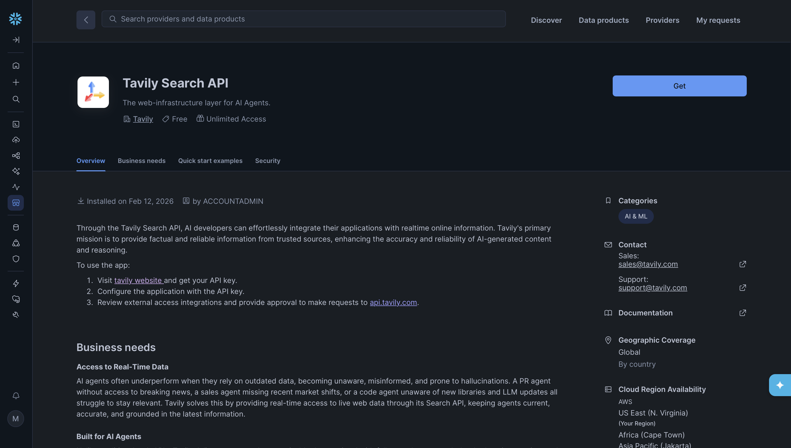

author: Mani Srinivasan
id: build-a-due-diligence-agent-in-snowflake-with-tavily
categories: snowflake-site:taxonomy/solution-center/quickstart, snowflake-site:taxonomy/product/ai-and-ml
language: en
summary: Build a due diligence and investment research agent in Snowflake that enriches NYSE financial data with real-time web intelligence using Tavily.
environments: web
status: Draft
feedback link: https://github.com/manisrinivasan2k1/sfquickstarts/issues

## Overview

In this guide, you will build a real-time Due Diligence and Investment Research Agent in Snowflake that enhances structured NYSE financial data with live external intelligence powered by Tavily Web Search.

You will learn how to create a Financial Agent that analyzes ticker-level fundamentals stored in Snowflake and enriches them with timely insights from across the web. Using Tavily’s real-time search capabilities, the agent retrieves recent news, regulatory updates, litigation developments, executive changes, and emerging risk signals that may not yet be reflected in financial statements.

By combining trusted financial reference data in Snowflake with Tavily’s up-to-date web intelligence, the agent performs contextual risk and opportunity analysis that goes beyond static datasets. This approach helps reduce blind spots between earnings cycles and surfaces early warning signals for buy-side, private equity, and corporate development workflows.

By the end of this guide, you will have a working Financial Agent that demonstrates how Snowflake and Tavily together enable intelligent, real-time financial analysis across structured and unstructured data sources.

### Prerequisites

- A Snowflake account with appropriate access to databases, schemas, Agents, and Cortex Analyst capabilities.  
  https://signup.snowflake.com/?utm_source=snowflake-devrel&utm_medium=developer-guides&utm_cta=developer-guides

- A Tavily API key to enable real-time web search. Tavily offers 1,000 free API credits per month with no credit card required.  
  https://tavily.com/

- Familiarity with Snowflake SQL and basic AI agent concepts.

### What You Will Build

- A structured equity reference dataset in Snowflake containing NYSE ticker-level fundamentals.
- A Financial Agent configured with an `Equity_Intelligence_Analysis_Tool` to evaluate structured financial data.
- A `Tavily_Web_Search_Tool` to retrieve real-time external intelligence, including regulatory updates, litigation signals, executive changes, and adverse media.
- An end-to-end due diligence workflow that combines structured financial analysis with live web intelligence to surface emerging risk and opportunity signals.

By the end of this guide, you will have a working Financial Agent capable of analyzing a company’s fundamentals and enriching that analysis with real-time developments from across the web.

### How You Can Use It

This Financial Agent can support a variety of investment and corporate analysis workflows, including:

- Buy-side due diligence prior to capital deployment.
- Private equity portfolio monitoring and risk assessment.
- Corporate development research for M&A evaluation.
- Continuous monitoring of leadership changes, regulatory exposure, and litigation risk.
- Identifying early warning signals between earnings cycles.

By combining trusted financial reference data in Snowflake with Tavily’s real-time web intelligence, you reduce blind spots in traditional analysis and enable faster, more informed decision-making across structured and unstructured data sources.

### Configuring the Tavily Web Search API

Follow the steps below to configure Tavily Web Search within Snowflake.

1. **Install Tavily from Snowflake Marketplace**

   - Navigate to **Snowflake Marketplace**.
   - Search for **Tavily**.
   - Select the Tavily listing and follow the prompts to install it in your account.

   

2. **Provide Your Tavily API Key**

   - After installation, open the Tavily application in Snowflake.
   - When prompted, enter your **Tavily API key** to enable real-time search functionality.
   - If you do not have an API key, you can create one at:  
     https://tavily.com/

   <insert_multiple_images_here_later>

3. **Validate the Configuration**

   - Once the API key is configured, use the built-in test interface to execute a sample search query.
   - This verifies that Snowflake can successfully communicate with Tavily’s Web Search API.

   <Insert_image_here_later>

4. **Confirm Successful Setup**

   - If you see search results returned in the output console, the Tavily Web Search API has been successfully configured.
   - You are now ready to use Tavily as a tool within your Financial Agent.

   <insert_image_here_later>

