author: Mani Srinivasan
id: build-a-due-diligence-agent-in-snowflake-with-tavily
categories: snowflake-site:taxonomy/solution-center/quickstart, snowflake-site:taxonomy/product/ai-and-ml
language: en
summary: Build a due diligence and investment research agent in Snowflake that enriches NYSE financial data with real-time web intelligence using Tavily.
environments: web
status: Draft
feedback link: https://github.com/manisrinivasan2k1/sfquickstarts/issues

## Overview

In this guide, you will build a real-time Due Diligence and Investment Research Agent in Snowflake that enhances structured NYSE financial data with live external intelligence powered by Tavily Web Search.

You will learn how to create a Financial Agent that analyzes ticker-level fundamentals stored in Snowflake and enriches them with timely insights from across the web. Using Tavily’s real-time search capabilities, the agent retrieves recent news, regulatory updates, litigation developments, executive changes, and emerging risk signals that may not yet be reflected in financial statements.

By combining trusted financial reference data in Snowflake with Tavily’s up-to-date web intelligence, the agent performs contextual risk and opportunity analysis that goes beyond static datasets. This approach helps reduce blind spots between earnings cycles and surfaces early warning signals for buy-side, private equity, and corporate development workflows.

By the end of this guide, you will have a working Financial Agent that demonstrates how Snowflake and Tavily together enable intelligent, real-time financial analysis across structured and unstructured data sources.

### Prerequisites

- A Snowflake account with appropriate access to databases, schemas, Agents, and Cortex Analyst capabilities.  
  https://signup.snowflake.com/?utm_source=snowflake-devrel&utm_medium=developer-guides&utm_cta=developer-guides

- A Tavily API key to enable real-time web search. Tavily offers 1,000 free API credits per month with no credit card required.  
  https://tavily.com/

- Familiarity with Snowflake SQL and basic AI agent concepts.

### What You Will Build

- A structured equity reference dataset in Snowflake containing NYSE ticker-level fundamentals.
- A Financial Agent configured with an `Equity_Intelligence_Analysis_Tool` to evaluate structured financial data.
- A `Tavily_Web_Search_Tool` to retrieve real-time external intelligence, including regulatory updates, litigation signals, executive changes, and adverse media.
- An end-to-end due diligence workflow that combines structured financial analysis with live web intelligence to surface emerging risk and opportunity signals.

By the end of this guide, you will have a working Financial Agent capable of analyzing a company’s fundamentals and enriching that analysis with real-time developments from across the web.

### How You Can Use It

This Financial Agent can support a variety of investment and corporate analysis workflows, including:

- Buy-side due diligence prior to capital deployment.
- Private equity portfolio monitoring and risk assessment.
- Corporate development research for M&A evaluation.
- Continuous monitoring of leadership changes, regulatory exposure, and litigation risk.
- Identifying early warning signals between earnings cycles.

By combining trusted financial reference data in Snowflake with Tavily’s real-time web intelligence, you reduce blind spots in traditional analysis and enable faster, more informed decision-making across structured and unstructured data sources.

## Setup

### Configuring the Tavily Web Search API

Follow the steps below to configure Tavily Web Search within Snowflake.

1. **Install Tavily from Snowflake Marketplace**

   - Navigate to **Snowflake Marketplace**.
   - Search for **Tavily Search API**.
   - Click on 'Get' and follow the prompts to install it in your account.

   

2. **Provide Your Tavily API Key**

   - After installation, click on 'Open'
     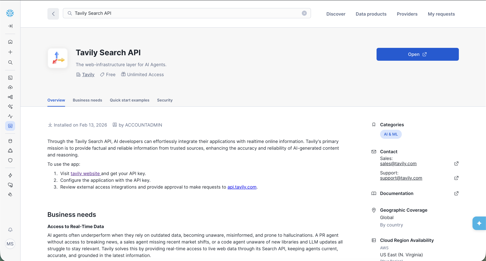
     
   - When prompted, enter your **Tavily API key** to enable real-time search functionality (If you do not have an API key, you can create one at: https://tavily.com/).
     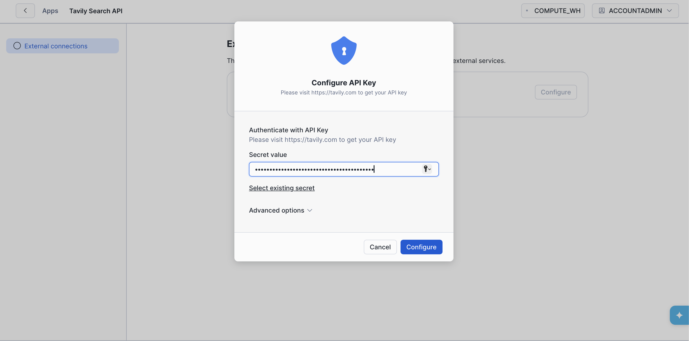

   - External API access must be enabled in the API configuration settings to allow outbound calls (You should find it below the API config field).

3. **Validate the Configuration**

   - Once the API key is configured, click on 'Open Worksheet'.
     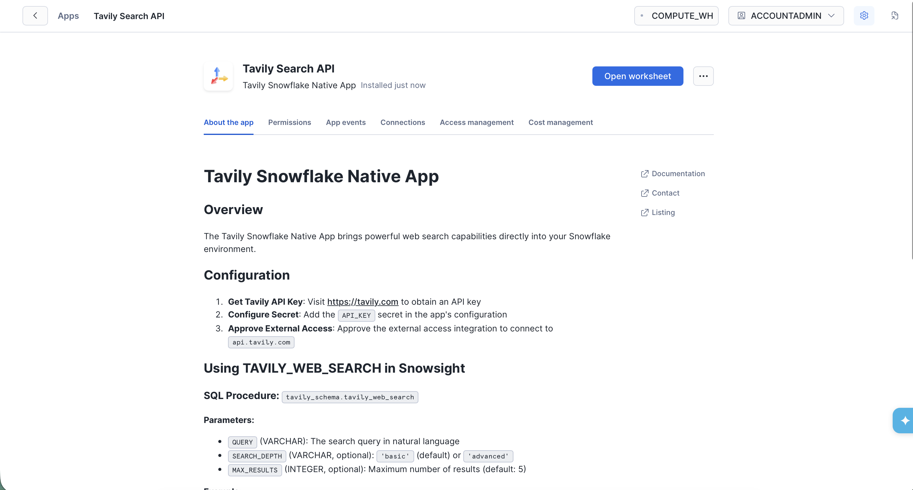
   - Then run the default query by selecting your appropriate warehouse and ensuring the Database is set to TAVILY_SEARCH_API and the Schema is set to TAVILY_SCHEMA, as shown below.
     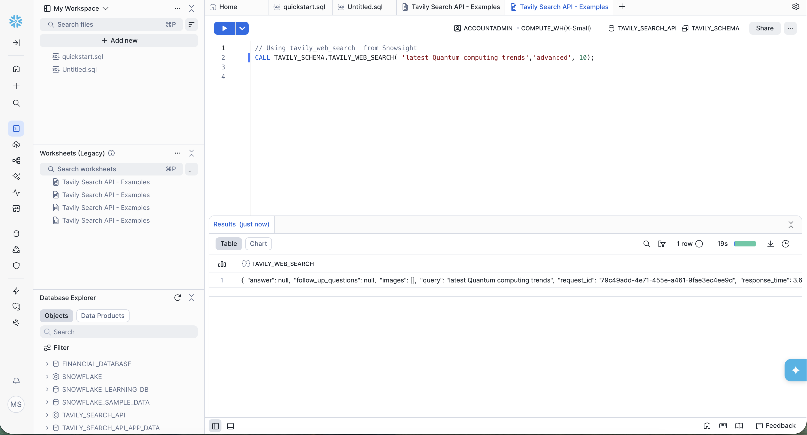
   - You should see the query results displayed in the output console, similar to the example shown above. 

### Load Financial Tables into Snowflake
- Ensure your account privileges, region, and other required configurations are properly set before proceeding to avoid errors.
- Run the commands shown in the image below to create your database and schema, and set the appropriate context to ensure everything is configured correctly.
  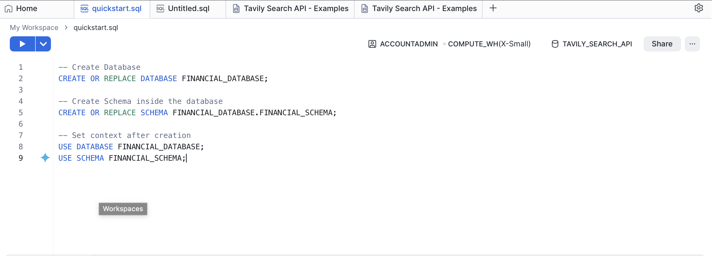
- You can verify that your new database and schema are set correctly by checking the context displayed in the top-right corner.
  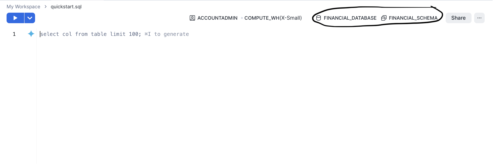
- Click the **“+”** icon, then select **Table → From File**.  
  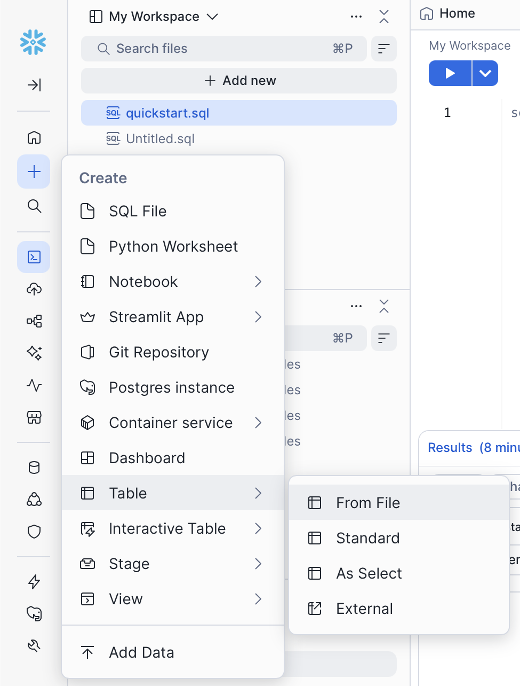
- After uploading your CSV file, ensure the correct **database** and **schema** are selected. Then click **+ Create New Table** and provide an appropriate table name of your choice.  
  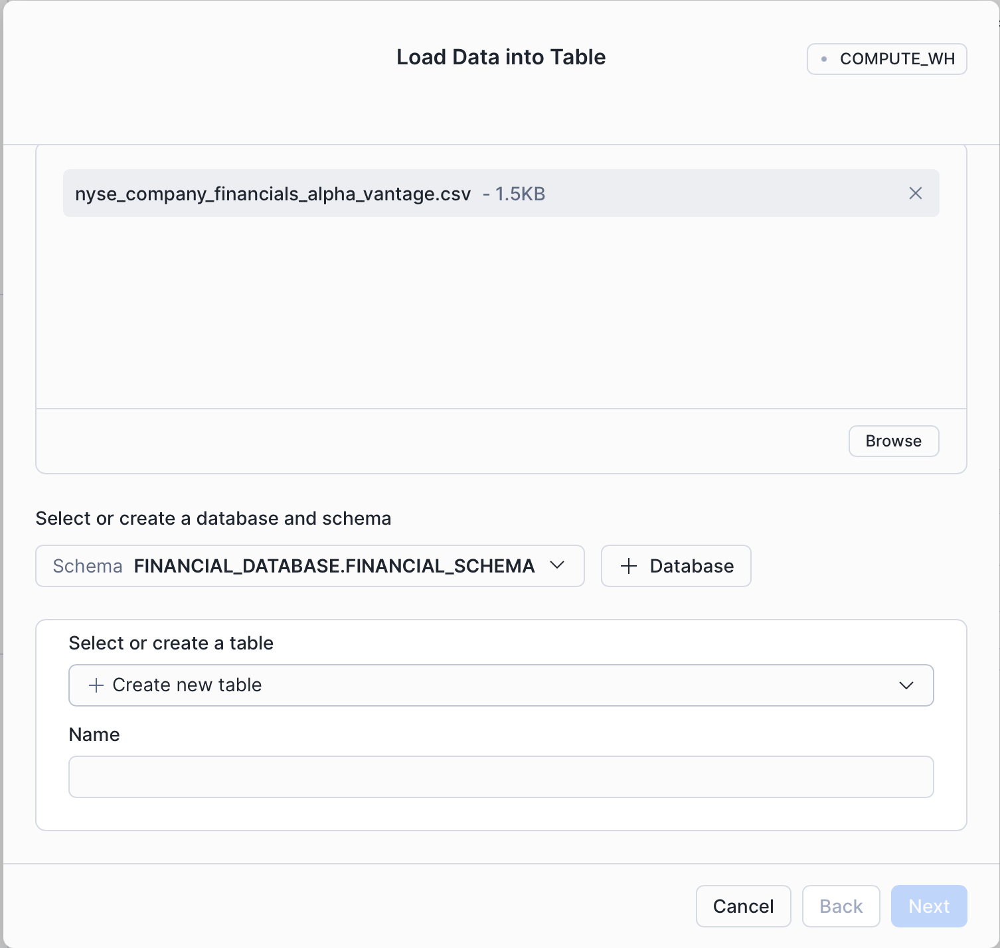

**Once the table is created, verify that it appears under the selected database and schema before proceeding. You can also preview the data to confirm it has been loaded correctly.**
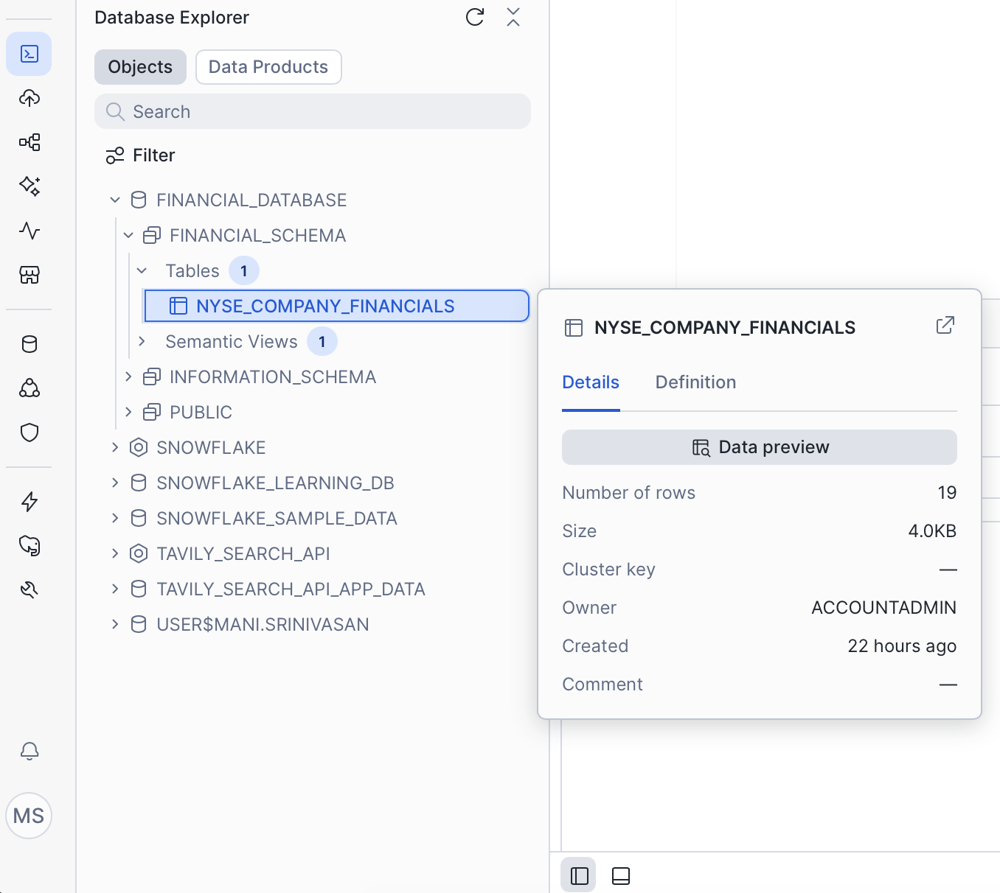

### Create a Snowflake Agent with Tavily Search and Cortex Analyst Tools

1. In the Snowflake UI, navigate to the **AI & ML** tab and select **Agents**.  
   <insert_image_here_later>

2. Click **Create Agent**, then provide a name, description, and relevant example questions for your agent.  
   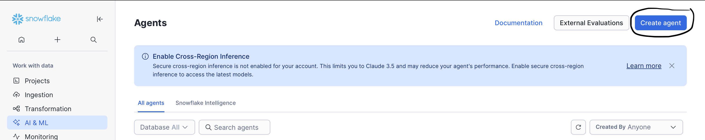
3. Navigate to the **Tools** tab and add the **Cortex Analyst** tool.  
   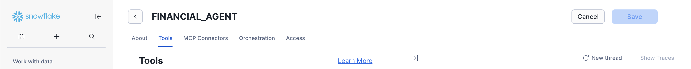
   Add the Cortex Analyst Tool  
   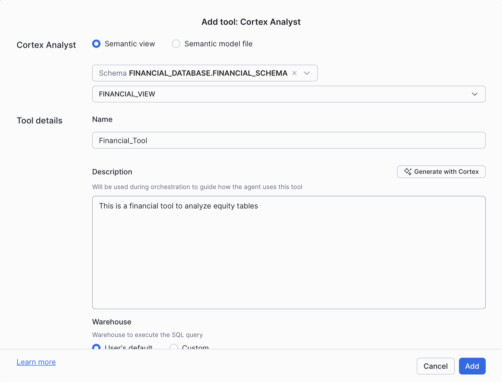

5. Create a new custom tool for the **Tavily Search API** and configure its required parameters.  
   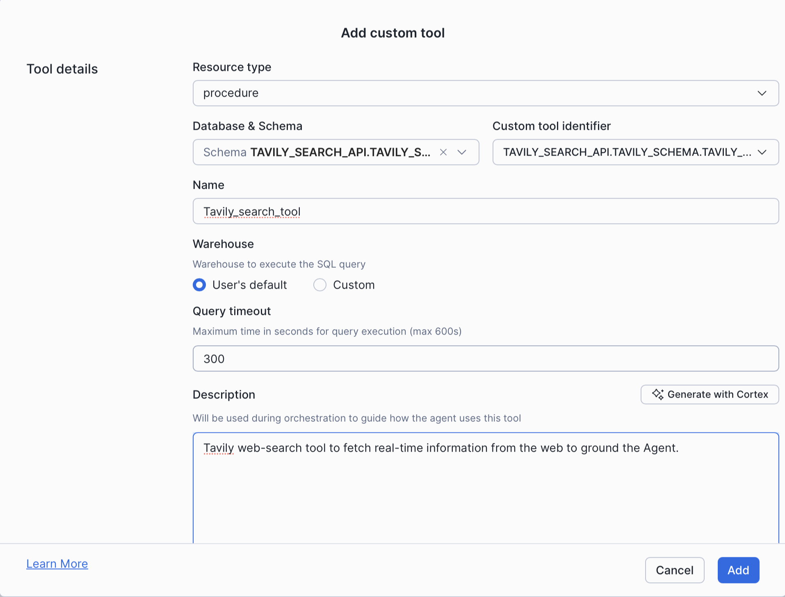

6. Click **Save Updates** to apply the updates.

7. Launch **Snowflake Intelligence** and verify that the agent has access to both configured tools.
   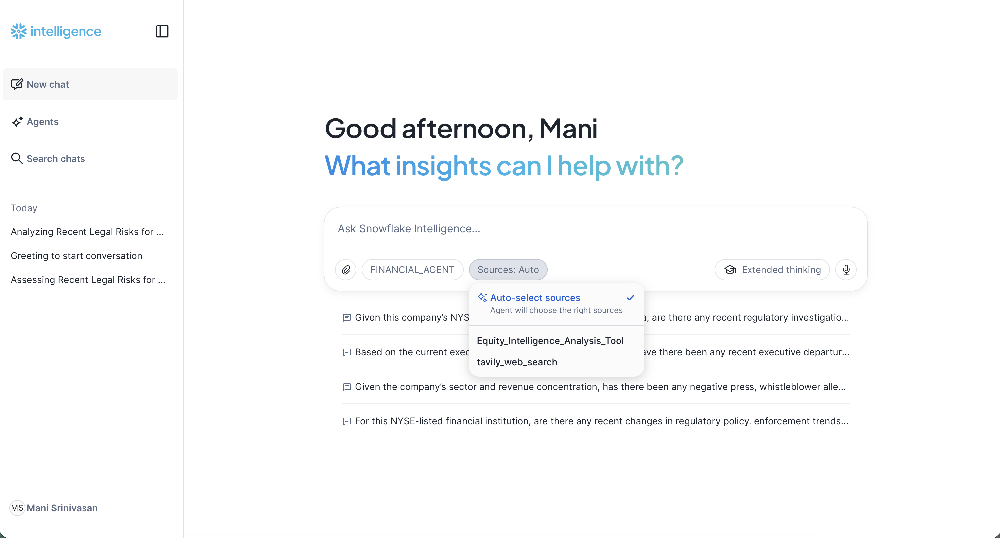
