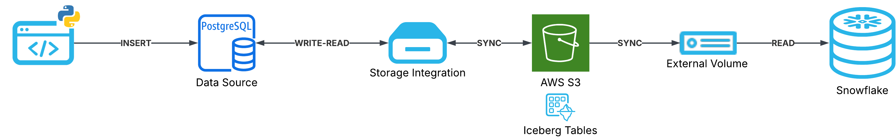

author: Reza Brianca
id: build-a-lakehouse-with-snowflake-postgres-and-pg-lake
summary: Build a zero-ETL lakehouse where Snowflake Postgres writes Iceberg to S3 via pg_lake and Snowflake reads it directly — no COPY INTO, no data duplication.
categories: snowflake-site:taxonomy/solution-center/certification/quickstart, snowflake-site:taxonomy/product/data-engineering, snowflake-site:taxonomy/snowflake-feature/apache-iceberg
environments: web
status: Published
language: en
feedback link: https://github.com/Snowflake-Labs/sfguides/issues

# Build a Lakehouse with Snowflake Postgres and pg_lake
<!-- ------------------------ -->
## Overview
Duration: 5

This guide walks you through building a true lakehouse architecture using **Snowflake Postgres**, **pg_lake**, and **Apache Iceberg**. You will set up a managed PostgreSQL instance that writes transactional data directly to Iceberg tables on Amazon S3, then query that same data from Snowflake — with zero ETL pipelines, no COPY INTO, and no data duplication.

The architecture separates OLTP (PostgreSQL) and OLAP (Snowflake) workloads while sharing a single open data layer (Iceberg on S3).



### What You Will Build
- A managed Snowflake Postgres instance with pg_lake writing Iceberg to S3
- A set of Snowflake Iceberg tables reading the same Parquet files from S3
- An automated refresh pipeline using directory stages, streams, and tasks
- A Python transaction simulator to generate realistic retail data

### What You Will Learn
- How to create and configure a Snowflake Postgres instance
- How to use the pg_lake extension to write Iceberg tables from PostgreSQL
- How to set up storage integrations and external volumes for S3 access
- How to create Snowflake Iceberg tables with OBJECT_STORE catalog
- How to build an auto-refresh pipeline when AUTO_REFRESH is not available
- How to use pg_cron for incremental data sync with the CTE sync pattern

### Prerequisites
- A [Snowflake account](https://signup.snowflake.com/) with ACCOUNTADMIN role and access to Snowflake Postgres (check [region availability](https://docs.snowflake.com/en/LIMITEDACCESS/postgres-overview))
- An [AWS account](https://aws.amazon.com/) with permissions to create S3 buckets and IAM roles
- [psql](https://www.postgresql.org/download/) or [DBeaver](https://dbeaver.io/download/) for connecting to the PostgreSQL instance
- [Python 3.x](https://www.python.org/downloads/) with `psycopg2-binary` installed

<!-- ------------------------ -->
## AWS: Create S3 Bucket and IAM Role
Duration: 10

In this step, you will create the S3 bucket and IAM role that both Snowflake Postgres (writes) and Snowflake (reads) will use.

### Create S3 Bucket

1. Go to the [AWS S3 Console](https://s3.console.aws.amazon.com/)
2. Click **Create bucket**
3. Choose a bucket name (e.g., `retail-lake-<your-initials>`) and select the **same region** as your Snowflake account
4. Leave all other settings as default and create the bucket

> aside positive
> IMPORTANT: Choose a region that matches your Snowflake account region to minimize latency and avoid cross-region data transfer costs.

### Create IAM Policy

1. Go to **IAM** > **Policies** > **Create policy**
2. Select the **JSON** tab and paste:

```json
{
  "Version": "2012-10-17",
  "Statement": [
    {
      "Effect": "Allow",
      "Action": [
        "s3:PutObject",
        "s3:GetObject",
        "s3:GetObjectVersion",
        "s3:DeleteObject",
        "s3:DeleteObjectVersion"
      ],
      "Resource": "arn:aws:s3:::<YOUR-BUCKET>/*"
    },
    {
      "Effect": "Allow",
      "Action": [
        "s3:ListBucket",
        "s3:GetBucketLocation"
      ],
      "Resource": "arn:aws:s3:::<YOUR-BUCKET>"
    }
  ]
}
```

3. Replace `<YOUR-BUCKET>` with your bucket name
4. Name the policy (e.g., `snowflake-retail-lake-policy`) and create it

### Create IAM Role

1. Go to **IAM** > **Roles** > **Create role**
2. Select **Custom trust policy** and paste a temporary placeholder (you will update this after creating the storage integration in Snowflake):

```json
{
  "Version": "2012-10-17",
  "Statement": [
    {
      "Effect": "Allow",
      "Principal": {
        "AWS": "arn:aws:iam::123456789012:root"
      },
      "Action": "sts:AssumeRole"
    }
  ]
}
```

3. Attach the policy you just created
4. Name the role (e.g., `snowflake-retail-lake-role`)

> aside negative
> CRITICAL: After creating the role, go to the role's settings and set **Maximum session duration** to **12 hours**. The storage integration will NOT work with the default 1-hour session.

5. Note the **Role ARN** (e.g., `arn:aws:iam::012345678910:role/snowflake-retail-lake-role`) — you will need it in the next step.

<!-- ------------------------ -->
## Snowflake: Create Postgres Instance and Network Access
Duration: 10

Run the following SQL from a **Snowflake SQL worksheet** with the **ACCOUNTADMIN** role.

### Create the Postgres Instance

```sql
CREATE POSTGRES INSTANCE retail_txns
  COMPUTE_FAMILY = 'STANDARD_M'
  STORAGE_SIZE_GB = 50
  AUTHENTICATION_AUTHORITY = POSTGRES
  COMMENT = 'Retail simulation with pg_lake Iceberg integration';
```

> aside positive
> This will create two users: `snowflake_admin` and `application` with auto-generated passwords. **Copy the passwords immediately** — they are only shown once.

### Check Instance Status

```sql
-- Get the connection host
SHOW POSTGRES INSTANCES;

-- Wait until state = READY (may take 5-10 minutes)
DESCRIBE POSTGRES INSTANCE retail_txns;
```

Note the **host** value from the output — you will use it to connect via psql or DBeaver.

### Configure Network Access

By default, Snowflake Postgres instances block all incoming connections. Create a network rule and policy to allow access:

```sql
CREATE DATABASE IF NOT EXISTS RETAIL_ANALYTICS;
CREATE SCHEMA IF NOT EXISTS RETAIL_ANALYTICS.NETWORK;

CREATE OR REPLACE NETWORK RULE RETAIL_ANALYTICS.NETWORK.PG_RETAIL_INGRESS
  TYPE = IPV4
  VALUE_LIST = ('0.0.0.0/0')
  MODE = POSTGRES_INGRESS;

CREATE OR REPLACE NETWORK POLICY PG_RETAIL_ALLOW_ALL
  ALLOWED_NETWORK_RULE_LIST = ('RETAIL_ANALYTICS.NETWORK.PG_RETAIL_INGRESS')
  COMMENT = 'Allow connections to retail_txns Postgres instance';

ALTER POSTGRES INSTANCE retail_txns
  SET NETWORK_POLICY = 'PG_RETAIL_ALLOW_ALL';
```

> aside negative
> The `0.0.0.0/0` rule allows connections from any IP. For production, restrict this to your specific IP address (e.g., `'203.0.113.5/32'`).

Wait about 2 minutes for the policy to take effect. You should now be able to connect:

```bash
psql "host=<YOUR-HOST> port=5432 dbname=postgres user=snowflake_admin sslmode=require"
```

<!-- ------------------------ -->
## Snowflake: Create Storage Integration
Duration: 5

Still in the Snowflake SQL worksheet, create a storage integration that gives the Postgres instance permission to write Iceberg data to your S3 bucket.

### Create the Storage Integration

```sql
CREATE STORAGE INTEGRATION pg_lake_s3_integration
  TYPE = POSTGRES_EXTERNAL_STORAGE
  STORAGE_PROVIDER = 'S3'
  ENABLED = TRUE
  STORAGE_AWS_ROLE_ARN = '<YOUR-IAM-ROLE-ARN>'
  STORAGE_ALLOWED_LOCATIONS = ('s3://<YOUR-BUCKET>/');
```

Replace `<YOUR-IAM-ROLE-ARN>` with the role ARN from Step 2, and `<YOUR-BUCKET>` with your bucket name.

### Get Snowflake IAM Details

```sql
DESCRIBE STORAGE INTEGRATION pg_lake_s3_integration;
```

Record these values from the output — you will need them to update the IAM trust policy:
- `STORAGE_AWS_IAM_USER_ARN`
- `STORAGE_AWS_EXTERNAL_ID`

### Update AWS IAM Trust Policy

Go back to the **AWS Console** > **IAM** > **Roles** > select your role > **Trust relationships** > **Edit trust policy**:

```json
{
  "Version": "2012-10-17",
  "Statement": [
    {
      "Effect": "Allow",
      "Principal": {
        "AWS": "<STORAGE_AWS_IAM_USER_ARN from DESCRIBE output>"
      },
      "Action": "sts:AssumeRole",
      "Condition": {
        "StringEquals": {
          "sts:ExternalId": "<STORAGE_AWS_EXTERNAL_ID from DESCRIBE output>"
        }
      }
    }
  ]
}
```

### Attach to Postgres Instance

```sql
ALTER POSTGRES INSTANCE retail_txns
  SET STORAGE_INTEGRATION = pg_lake_s3_integration;
```

<!-- ------------------------ -->
## Postgres: Enable pg_lake and Create Tables
Duration: 15

Connect to the managed Postgres instance via psql:

```bash
psql "host=<YOUR-HOST> port=5432 dbname=postgres user=snowflake_admin sslmode=require"
```

### Enable pg_lake Extension

```sql
CREATE EXTENSION IF NOT EXISTS pg_lake CASCADE;

-- Set the default Iceberg storage location
ALTER DATABASE postgres
  SET pg_lake_iceberg.default_location_prefix = 's3://<YOUR-BUCKET>/';

-- Apply to current session
SET pg_lake_iceberg.default_location_prefix TO 's3://<YOUR-BUCKET>/';

-- Verify
SHOW pg_lake_iceberg.default_location_prefix;
```

### Create OLTP Tables (Heap Tables)

These are standard PostgreSQL tables optimized for fast transactional writes:

```sql
CREATE TABLE IF NOT EXISTS stores (
    store_id    SERIAL PRIMARY KEY,
    store_name  TEXT NOT NULL,
    city        TEXT NOT NULL,
    state       TEXT NOT NULL,
    opened_at   TIMESTAMP DEFAULT now()
);

CREATE TABLE IF NOT EXISTS products (
    product_id    SERIAL PRIMARY KEY,
    product_name  TEXT NOT NULL,
    category      TEXT NOT NULL,
    unit_price    NUMERIC(10,2) NOT NULL,
    created_at    TIMESTAMP DEFAULT now()
);

CREATE TABLE IF NOT EXISTS customers (
    customer_id   SERIAL PRIMARY KEY,
    first_name    TEXT NOT NULL,
    last_name     TEXT NOT NULL,
    email         TEXT UNIQUE NOT NULL,
    loyalty_tier  TEXT DEFAULT 'BRONZE',
    created_at    TIMESTAMP DEFAULT now()
);

CREATE TABLE IF NOT EXISTS transactions (
    txn_id         SERIAL PRIMARY KEY,
    store_id       INT NOT NULL REFERENCES stores(store_id),
    customer_id    INT REFERENCES customers(customer_id),
    txn_timestamp  TIMESTAMP NOT NULL DEFAULT now(),
    total_amount   NUMERIC(12,2) NOT NULL DEFAULT 0,
    payment_method TEXT NOT NULL DEFAULT 'CARD',
    synced_at      TIMESTAMP
);

CREATE TABLE IF NOT EXISTS transaction_items (
    item_id       SERIAL PRIMARY KEY,
    txn_id        INT NOT NULL REFERENCES transactions(txn_id),
    product_id    INT NOT NULL REFERENCES products(product_id),
    quantity      INT NOT NULL DEFAULT 1,
    unit_price    NUMERIC(10,2) NOT NULL,
    line_total    NUMERIC(12,2) NOT NULL,
    synced_at     TIMESTAMP
);

-- Indexes for efficient sync (only scan unsynced rows)
CREATE INDEX IF NOT EXISTS idx_txn_synced
  ON transactions(synced_at) WHERE synced_at IS NULL;
CREATE INDEX IF NOT EXISTS idx_items_synced
  ON transaction_items(synced_at) WHERE synced_at IS NULL;
```

### Seed Reference Data

```sql
INSERT INTO stores (store_name, city, state) VALUES
    ('Downtown Flagship', 'Seattle', 'WA'),
    ('Mall of Pacific', 'San Francisco', 'CA'),
    ('Eastside Express', 'Bellevue', 'WA'),
    ('Harbor Point', 'Portland', 'OR'),
    ('Valley Center', 'San Jose', 'CA');

INSERT INTO products (product_name, category, unit_price) VALUES
    ('Organic Coffee Beans 1lb',   'Grocery',       14.99),
    ('Wireless Earbuds Pro',       'Electronics',   79.99),
    ('Cotton T-Shirt',             'Apparel',       24.99),
    ('Stainless Water Bottle',     'Home',          19.99),
    ('Running Shoes',              'Footwear',      129.99),
    ('Yoga Mat Premium',           'Fitness',       39.99),
    ('LED Desk Lamp',              'Electronics',   44.99),
    ('Organic Protein Bar 12pk',   'Grocery',       29.99),
    ('Backpack 30L',               'Accessories',   59.99),
    ('Sunscreen SPF50',            'Personal Care', 12.99),
    ('Bluetooth Speaker',          'Electronics',   49.99),
    ('Trail Mix 2lb',              'Grocery',        9.99),
    ('Insulated Lunch Bag',        'Home',          22.99),
    ('Fitness Tracker Band',       'Electronics',   89.99),
    ('Bamboo Cutting Board',       'Home',          17.99);

INSERT INTO customers (first_name, last_name, email, loyalty_tier) VALUES
    ('Alice',   'Chen',     'alice.chen@example.com',    'GOLD'),
    ('Bob',     'Martinez', 'bob.martinez@example.com',  'SILVER'),
    ('Carol',   'Johnson',  'carol.j@example.com',       'BRONZE'),
    ('David',   'Kim',      'david.kim@example.com',     'GOLD'),
    ('Eve',     'Patel',    'eve.patel@example.com',     'PLATINUM'),
    ('Frank',   'Lopez',    'frank.lopez@example.com',   'BRONZE'),
    ('Grace',   'Wu',       'grace.wu@example.com',      'SILVER'),
    ('Hank',    'Brown',    'hank.brown@example.com',    'BRONZE'),
    ('Iris',    'Davis',    'iris.davis@example.com',    'GOLD'),
    ('Jack',    'Wilson',   'jack.wilson@example.com',   'SILVER');
```

### Create Iceberg Tables

These tables store data as Parquet on S3 via pg_lake:

```sql
CREATE TABLE iceberg_transactions (
    txn_id         INT,
    store_id       INT,
    customer_id    INT,
    txn_timestamp  TIMESTAMP,
    total_amount   NUMERIC(12,2),
    payment_method TEXT,
    synced_at      TIMESTAMP
) USING iceberg;

CREATE TABLE iceberg_transaction_items (
    item_id      INT,
    txn_id       INT,
    product_id   INT,
    quantity     INT,
    unit_price   NUMERIC(10,2),
    line_total   NUMERIC(12,2),
    synced_at    TIMESTAMP
) USING iceberg;

CREATE TABLE iceberg_stores (
    store_id    INT,
    store_name  TEXT,
    city        TEXT,
    state       TEXT,
    opened_at   TIMESTAMP
) USING iceberg;

CREATE TABLE iceberg_products (
    product_id    INT,
    product_name  TEXT,
    category      TEXT,
    unit_price    NUMERIC(10,2),
    created_at    TIMESTAMP
) USING iceberg;

CREATE TABLE iceberg_customers (
    customer_id   INT,
    first_name    TEXT,
    last_name     TEXT,
    email         TEXT,
    loyalty_tier  TEXT,
    created_at    TIMESTAMP
) USING iceberg;
```

### Seed Dimension Data into Iceberg

```sql
INSERT INTO iceberg_stores    SELECT * FROM stores;
INSERT INTO iceberg_products  SELECT * FROM products;
INSERT INTO iceberg_customers SELECT * FROM customers;
```

### Set Up Incremental Sync with pg_cron

pg_lake's SQL parser does not support dollar-quoting (`$$`), so we use a CTE to chain INSERT and UPDATE atomically in a single statement:

```sql
CREATE EXTENSION IF NOT EXISTS pg_cron;

-- Sync transaction headers every minute
SELECT cron.schedule(
    'sync_txn_headers',
    '* * * * *',
    'WITH synced AS (
        INSERT INTO iceberg_transactions
        SELECT txn_id, store_id, customer_id, txn_timestamp,
               total_amount, payment_method, now()
        FROM transactions WHERE synced_at IS NULL
        RETURNING txn_id
    ) UPDATE transactions SET synced_at = now()
      WHERE txn_id IN (SELECT txn_id FROM synced)'
);

-- Sync transaction line items every minute
SELECT cron.schedule(
    'sync_txn_items',
    '* * * * *',
    'WITH synced AS (
        INSERT INTO iceberg_transaction_items
        SELECT item_id, txn_id, product_id, quantity,
               unit_price, line_total, now()
        FROM transaction_items WHERE synced_at IS NULL
        RETURNING item_id
    ) UPDATE transaction_items SET synced_at = now()
      WHERE item_id IN (SELECT item_id FROM synced)'
);
```

### Get Iceberg Metadata Locations

Run this query and save the output — you will need the metadata paths for the next step:

```sql
SELECT table_name, metadata_location FROM iceberg_tables;
```

> aside positive
> The metadata_location values look like: `s3://<YOUR-BUCKET>/frompg/tables/postgres/public/iceberg_transactions/<OID>/metadata/00000-xxxx.metadata.json`. You will use the path **after** the bucket prefix when creating Snowflake Iceberg tables.

<!-- ------------------------ -->
## Snowflake: Create External Volume and Iceberg Tables
Duration: 10

Return to the **Snowflake SQL worksheet** to set up the read path.

### Create External Volume

```sql
CREATE OR REPLACE EXTERNAL VOLUME retail_lake_volume
  STORAGE_LOCATIONS = (
    (
      NAME                 = 'retail-s3'
      STORAGE_PROVIDER     = 'S3'
      STORAGE_BASE_URL     = 's3://<YOUR-BUCKET>/'
      STORAGE_AWS_ROLE_ARN = '<YOUR-IAM-ROLE-ARN>'
    )
  );

DESCRIBE EXTERNAL VOLUME retail_lake_volume;
```

> aside positive
> Record the `STORAGE_AWS_IAM_USER_ARN` and `STORAGE_AWS_EXTERNAL_ID` from this output. You will need them (along with the values from the storage integration) for the IAM trust policy update in the next step.

### Create Catalog Integration

Since pg_lake manages the Iceberg metadata (not Snowflake), we use `CATALOG_SOURCE = OBJECT_STORE`:

```sql
CREATE OR REPLACE CATALOG INTEGRATION pg_lake_catalog
  CATALOG_SOURCE = OBJECT_STORE
  TABLE_FORMAT = ICEBERG
  ENABLED = TRUE;
```

### Create Database and Schema

```sql
CREATE DATABASE IF NOT EXISTS RETAIL_ANALYTICS;
CREATE SCHEMA IF NOT EXISTS RETAIL_ANALYTICS.LAKEHOUSE;
USE SCHEMA RETAIL_ANALYTICS.LAKEHOUSE;
```

### Create Iceberg Tables

Replace each `METADATA_FILE_PATH` with the actual relative path from your `iceberg_tables` query output. The path is relative to the external volume's `STORAGE_BASE_URL` (strip the `s3://<YOUR-BUCKET>/` prefix).

```sql
-- Transactions fact table
CREATE OR REPLACE ICEBERG TABLE iceberg_transactions
  EXTERNAL_VOLUME = 'retail_lake_volume'
  CATALOG = 'pg_lake_catalog'
  METADATA_FILE_PATH = 'frompg/tables/postgres/public/iceberg_transactions/<OID>/metadata/<METADATA-FILE>.metadata.json';

-- Transaction line items
CREATE OR REPLACE ICEBERG TABLE iceberg_transaction_items
  EXTERNAL_VOLUME = 'retail_lake_volume'
  CATALOG = 'pg_lake_catalog'
  METADATA_FILE_PATH = 'frompg/tables/postgres/public/iceberg_transaction_items/<OID>/metadata/<METADATA-FILE>.metadata.json';

-- Dimension: Stores
CREATE OR REPLACE ICEBERG TABLE iceberg_stores
  EXTERNAL_VOLUME = 'retail_lake_volume'
  CATALOG = 'pg_lake_catalog'
  METADATA_FILE_PATH = 'frompg/tables/postgres/public/iceberg_stores/<OID>/metadata/<METADATA-FILE>.metadata.json';

-- Dimension: Products
CREATE OR REPLACE ICEBERG TABLE iceberg_products
  EXTERNAL_VOLUME = 'retail_lake_volume'
  CATALOG = 'pg_lake_catalog'
  METADATA_FILE_PATH = 'frompg/tables/postgres/public/iceberg_products/<OID>/metadata/<METADATA-FILE>.metadata.json';

-- Dimension: Customers
CREATE OR REPLACE ICEBERG TABLE iceberg_customers
  EXTERNAL_VOLUME = 'retail_lake_volume'
  CATALOG = 'pg_lake_catalog'
  METADATA_FILE_PATH = 'frompg/tables/postgres/public/iceberg_customers/<OID>/metadata/<METADATA-FILE>.metadata.json';
```

### Verify

```sql
SELECT 'transactions' AS table_name, COUNT(*) AS row_count FROM iceberg_transactions
UNION ALL
SELECT 'items',        COUNT(*) FROM iceberg_transaction_items
UNION ALL
SELECT 'stores',       COUNT(*) FROM iceberg_stores
UNION ALL
SELECT 'products',     COUNT(*) FROM iceberg_products
UNION ALL
SELECT 'customers',    COUNT(*) FROM iceberg_customers;
```

<!-- ------------------------ -->
## AWS: Update IAM Trust Policy for All Principals
Duration: 5

Your IAM role now needs to trust **three** Snowflake principals. Collect the ARN and external ID from each:

```sql
-- Run these in Snowflake and record the output
DESCRIBE STORAGE INTEGRATION pg_lake_s3_integration;
DESCRIBE EXTERNAL VOLUME retail_lake_volume;
```

> aside positive
> You will also need the values from the stage storage integration created in the next step. You can update the trust policy once more after that step, or add all three principals now if you create the stage integration first.

Update your IAM role's trust policy with **all** principals:

```json
{
  "Version": "2012-10-17",
  "Statement": [
    {
      "Effect": "Allow",
      "Principal": {
        "AWS": [
          "<STORAGE_AWS_IAM_USER_ARN from pg_lake_s3_integration>",
          "<STORAGE_AWS_IAM_USER_ARN from retail_lake_volume>",
          "<STORAGE_AWS_IAM_USER_ARN from iceberg_stage_s3_integration>"
        ]
      },
      "Action": "sts:AssumeRole",
      "Condition": {
        "StringEquals": {
          "sts:ExternalId": [
            "<STORAGE_AWS_EXTERNAL_ID from pg_lake_s3_integration>",
            "<STORAGE_AWS_EXTERNAL_ID from retail_lake_volume>",
            "<STORAGE_AWS_EXTERNAL_ID from iceberg_stage_s3_integration>"
          ]
        }
      }
    }
  ]
}
```

<!-- ------------------------ -->
## Snowflake: Set Up Auto-Refresh
Duration: 10

Since `AUTO_REFRESH = TRUE` only works with external catalogs (AWS Glue, REST catalog), we build an auto-refresh pipeline using **directory stages**, **streams**, **stored procedures**, and **tasks**.

### Architecture

For each Iceberg table:

```
Directory Stage --> Stream --> Root Task (refresh stage) --> Child Task (refresh Iceberg table)
```

### Create Stage Storage Integration

```sql
CREATE OR REPLACE STORAGE INTEGRATION iceberg_stage_s3_integration
  TYPE = EXTERNAL_STAGE
  STORAGE_PROVIDER = 'S3'
  ENABLED = TRUE
  STORAGE_AWS_ROLE_ARN = '<YOUR-IAM-ROLE-ARN>'
  STORAGE_ALLOWED_LOCATIONS = ('s3://<YOUR-BUCKET>/frompg/tables/');

-- Get IAM details (add to trust policy from previous step)
DESCRIBE STORAGE INTEGRATION iceberg_stage_s3_integration;
```

> aside negative
> After running the DESCRIBE above, go back to AWS and add the third principal to your IAM trust policy if you haven't already.

### Create Directory Stages

Replace `<OID>` values with the actual OIDs from your `iceberg_tables` metadata paths:

```sql
USE SCHEMA RETAIL_ANALYTICS.LAKEHOUSE;

CREATE OR REPLACE STAGE stg_meta_transactions
  URL = 's3://<YOUR-BUCKET>/frompg/tables/postgres/public/iceberg_transactions/<OID>/metadata/'
  STORAGE_INTEGRATION = iceberg_stage_s3_integration
  DIRECTORY = (ENABLE = TRUE);

CREATE OR REPLACE STAGE stg_meta_transaction_items
  URL = 's3://<YOUR-BUCKET>/frompg/tables/postgres/public/iceberg_transaction_items/<OID>/metadata/'
  STORAGE_INTEGRATION = iceberg_stage_s3_integration
  DIRECTORY = (ENABLE = TRUE);

CREATE OR REPLACE STAGE stg_meta_stores
  URL = 's3://<YOUR-BUCKET>/frompg/tables/postgres/public/iceberg_stores/<OID>/metadata/'
  STORAGE_INTEGRATION = iceberg_stage_s3_integration
  DIRECTORY = (ENABLE = TRUE);

CREATE OR REPLACE STAGE stg_meta_products
  URL = 's3://<YOUR-BUCKET>/frompg/tables/postgres/public/iceberg_products/<OID>/metadata/'
  STORAGE_INTEGRATION = iceberg_stage_s3_integration
  DIRECTORY = (ENABLE = TRUE);

CREATE OR REPLACE STAGE stg_meta_customers
  URL = 's3://<YOUR-BUCKET>/frompg/tables/postgres/public/iceberg_customers/<OID>/metadata/'
  STORAGE_INTEGRATION = iceberg_stage_s3_integration
  DIRECTORY = (ENABLE = TRUE);
```

### Create Streams

```sql
CREATE OR REPLACE STREAM stream_meta_transactions ON STAGE stg_meta_transactions;
CREATE OR REPLACE STREAM stream_meta_transaction_items ON STAGE stg_meta_transaction_items;
CREATE OR REPLACE STREAM stream_meta_stores ON STAGE stg_meta_stores;
CREATE OR REPLACE STREAM stream_meta_products ON STAGE stg_meta_products;
CREATE OR REPLACE STREAM stream_meta_customers ON STAGE stg_meta_customers;
```

### Create Stored Procedures

Each procedure finds the latest metadata file from the directory stage and refreshes the Iceberg table:

```sql
CREATE OR REPLACE PROCEDURE sp_refresh_iceberg_transactions()
RETURNS VARCHAR
LANGUAGE SQL
AS
$$
DECLARE
  latest_path VARCHAR;
BEGIN
  SELECT RELATIVE_PATH INTO :latest_path
  FROM DIRECTORY(@stg_meta_transactions)
  WHERE RELATIVE_PATH LIKE '%.metadata.json'
  ORDER BY LAST_MODIFIED DESC
  LIMIT 1;

  EXECUTE IMMEDIATE
    'ALTER ICEBERG TABLE iceberg_transactions REFRESH '''
    || 'frompg/tables/postgres/public/iceberg_transactions/<OID>/metadata/'
    || latest_path || '''';
  RETURN latest_path;
END;
$$;

CREATE OR REPLACE PROCEDURE sp_refresh_iceberg_transaction_items()
RETURNS VARCHAR
LANGUAGE SQL
AS
$$
DECLARE
  latest_path VARCHAR;
BEGIN
  SELECT RELATIVE_PATH INTO :latest_path
  FROM DIRECTORY(@stg_meta_transaction_items)
  WHERE RELATIVE_PATH LIKE '%.metadata.json'
  ORDER BY LAST_MODIFIED DESC
  LIMIT 1;

  EXECUTE IMMEDIATE
    'ALTER ICEBERG TABLE iceberg_transaction_items REFRESH '''
    || 'frompg/tables/postgres/public/iceberg_transaction_items/<OID>/metadata/'
    || latest_path || '''';
  RETURN latest_path;
END;
$$;

CREATE OR REPLACE PROCEDURE sp_refresh_iceberg_stores()
RETURNS VARCHAR
LANGUAGE SQL
AS
$$
DECLARE
  latest_path VARCHAR;
BEGIN
  SELECT RELATIVE_PATH INTO :latest_path
  FROM DIRECTORY(@stg_meta_stores)
  WHERE RELATIVE_PATH LIKE '%.metadata.json'
  ORDER BY LAST_MODIFIED DESC
  LIMIT 1;

  EXECUTE IMMEDIATE
    'ALTER ICEBERG TABLE iceberg_stores REFRESH '''
    || 'frompg/tables/postgres/public/iceberg_stores/<OID>/metadata/'
    || latest_path || '''';
  RETURN latest_path;
END;
$$;

CREATE OR REPLACE PROCEDURE sp_refresh_iceberg_products()
RETURNS VARCHAR
LANGUAGE SQL
AS
$$
DECLARE
  latest_path VARCHAR;
BEGIN
  SELECT RELATIVE_PATH INTO :latest_path
  FROM DIRECTORY(@stg_meta_products)
  WHERE RELATIVE_PATH LIKE '%.metadata.json'
  ORDER BY LAST_MODIFIED DESC
  LIMIT 1;

  EXECUTE IMMEDIATE
    'ALTER ICEBERG TABLE iceberg_products REFRESH '''
    || 'frompg/tables/postgres/public/iceberg_products/<OID>/metadata/'
    || latest_path || '''';
  RETURN latest_path;
END;
$$;

CREATE OR REPLACE PROCEDURE sp_refresh_iceberg_customers()
RETURNS VARCHAR
LANGUAGE SQL
AS
$$
DECLARE
  latest_path VARCHAR;
BEGIN
  SELECT RELATIVE_PATH INTO :latest_path
  FROM DIRECTORY(@stg_meta_customers)
  WHERE RELATIVE_PATH LIKE '%.metadata.json'
  ORDER BY LAST_MODIFIED DESC
  LIMIT 1;

  EXECUTE IMMEDIATE
    'ALTER ICEBERG TABLE iceberg_customers REFRESH '''
    || 'frompg/tables/postgres/public/iceberg_customers/<OID>/metadata/'
    || latest_path || '''';
  RETURN latest_path;
END;
$$;
```

### Create Tasks

```sql
-- Root tasks: refresh directory stages every 2 minutes
CREATE OR REPLACE TASK task_refresh_stage_transactions
  WAREHOUSE = COMPUTE_WH
  SCHEDULE  = '2 MINUTES'
AS
  ALTER STAGE stg_meta_transactions REFRESH;

CREATE OR REPLACE TASK task_refresh_stage_transaction_items
  WAREHOUSE = COMPUTE_WH
  SCHEDULE  = '2 MINUTES'
AS
  ALTER STAGE stg_meta_transaction_items REFRESH;

CREATE OR REPLACE TASK task_refresh_stage_stores
  WAREHOUSE = COMPUTE_WH
  SCHEDULE  = '2 MINUTES'
AS
  ALTER STAGE stg_meta_stores REFRESH;

CREATE OR REPLACE TASK task_refresh_stage_products
  WAREHOUSE = COMPUTE_WH
  SCHEDULE  = '2 MINUTES'
AS
  ALTER STAGE stg_meta_products REFRESH;

CREATE OR REPLACE TASK task_refresh_stage_customers
  WAREHOUSE = COMPUTE_WH
  SCHEDULE  = '2 MINUTES'
AS
  ALTER STAGE stg_meta_customers REFRESH;

-- Child tasks: refresh Iceberg tables when stream has new data
CREATE OR REPLACE TASK task_refresh_iceberg_transactions
  WAREHOUSE = COMPUTE_WH
  AFTER task_refresh_stage_transactions
  WHEN SYSTEM$STREAM_HAS_DATA('stream_meta_transactions')
AS
  CALL sp_refresh_iceberg_transactions();

CREATE OR REPLACE TASK task_refresh_iceberg_transaction_items
  WAREHOUSE = COMPUTE_WH
  AFTER task_refresh_stage_transaction_items
  WHEN SYSTEM$STREAM_HAS_DATA('stream_meta_transaction_items')
AS
  CALL sp_refresh_iceberg_transaction_items();

CREATE OR REPLACE TASK task_refresh_iceberg_stores
  WAREHOUSE = COMPUTE_WH
  AFTER task_refresh_stage_stores
  WHEN SYSTEM$STREAM_HAS_DATA('stream_meta_stores')
AS
  CALL sp_refresh_iceberg_stores();

CREATE OR REPLACE TASK task_refresh_iceberg_products
  WAREHOUSE = COMPUTE_WH
  AFTER task_refresh_stage_products
  WHEN SYSTEM$STREAM_HAS_DATA('stream_meta_products')
AS
  CALL sp_refresh_iceberg_products();

CREATE OR REPLACE TASK task_refresh_iceberg_customers
  WAREHOUSE = COMPUTE_WH
  AFTER task_refresh_stage_customers
  WHEN SYSTEM$STREAM_HAS_DATA('stream_meta_customers')
AS
  CALL sp_refresh_iceberg_customers();
```

### Resume Tasks

Resume child tasks first, then root tasks (Snowflake requires children to be active before parents):

```sql
-- Resume child tasks
ALTER TASK task_refresh_iceberg_transactions RESUME;
ALTER TASK task_refresh_iceberg_transaction_items RESUME;
ALTER TASK task_refresh_iceberg_stores RESUME;
ALTER TASK task_refresh_iceberg_products RESUME;
ALTER TASK task_refresh_iceberg_customers RESUME;

-- Resume root tasks
ALTER TASK task_refresh_stage_transactions RESUME;
ALTER TASK task_refresh_stage_transaction_items RESUME;
ALTER TASK task_refresh_stage_stores RESUME;
ALTER TASK task_refresh_stage_products RESUME;
ALTER TASK task_refresh_stage_customers RESUME;
```

<!-- ------------------------ -->
## Simulate Transactions and Verify
Duration: 10

### Install Dependencies

```bash
pip install psycopg2-binary
```

### Run the Transaction Simulator

The Python script generates realistic retail transactions and inserts them into the Postgres heap tables:

```python
"""
simulate_transactions.py - Retail transaction simulator
Generates random transactions into Postgres heap tables.
pg_lake + pg_cron handles the sync to Iceberg on S3 automatically.
"""

import argparse
import random
import time
import sys
from datetime import datetime

import psycopg2
from psycopg2.extras import execute_values

PAYMENT_METHODS = ["CARD", "CASH", "DIGITAL_WALLET", "GIFT_CARD"]
ITEMS_PER_TXN_RANGE = (1, 5)


def get_reference_data(conn):
    """Load store, product, and customer IDs from the database."""
    with conn.cursor() as cur:
        cur.execute("SELECT store_id FROM stores")
        store_ids = [r[0] for r in cur.fetchall()]
        cur.execute("SELECT product_id, unit_price FROM products")
        products = [(r[0], float(r[1])) for r in cur.fetchall()]
        cur.execute("SELECT customer_id FROM customers")
        customer_ids = [r[0] for r in cur.fetchall()]
    return store_ids, products, customer_ids


def generate_transaction(store_ids, products, customer_ids):
    """Generate a single random retail transaction with line items."""
    store_id = random.choice(store_ids)
    customer_id = random.choice(customer_ids) if random.random() < 0.9 else None
    payment = random.choice(PAYMENT_METHODS)
    num_items = random.randint(*ITEMS_PER_TXN_RANGE)
    items = []
    total = 0.0
    selected_products = random.sample(products, min(num_items, len(products)))
    for product_id, unit_price in selected_products:
        qty = random.randint(1, 3)
        line_total = round(unit_price * qty, 2)
        total += line_total
        items.append((product_id, qty, unit_price, line_total))
    return store_id, customer_id, round(total, 2), payment, items


def insert_batch(conn, batch):
    """Insert a batch of transactions and their line items."""
    with conn.cursor() as cur:
        txn_rows = [
            (sid, cid, total, pay)
            for sid, cid, total, pay, _items in batch
        ]
        result = execute_values(
            cur,
            "INSERT INTO transactions (store_id, customer_id, total_amount, payment_method) VALUES %s RETURNING txn_id",
            txn_rows, fetch=True,
        )
        txn_ids = [r[0] for r in result]
        all_items = []
        for txn_id, (_s, _c, _t, _p, items) in zip(txn_ids, batch):
            for pid, qty, up, lt in items:
                all_items.append((txn_id, pid, qty, up, lt))
        if all_items:
            execute_values(
                cur,
                "INSERT INTO transaction_items (txn_id, product_id, quantity, unit_price, line_total) VALUES %s",
                all_items,
            )
    conn.commit()


def trigger_sync(conn):
    """Manually trigger the Iceberg sync."""
    with conn.cursor() as cur:
        cur.execute(
            "WITH synced AS ("
            "INSERT INTO iceberg_transactions "
            "SELECT txn_id, store_id, customer_id, txn_timestamp, "
            "total_amount, payment_method, now() "
            "FROM transactions WHERE synced_at IS NULL "
            "RETURNING txn_id) "
            "UPDATE transactions SET synced_at = now() "
            "WHERE txn_id IN (SELECT txn_id FROM synced)"
        )
        cur.execute(
            "WITH synced AS ("
            "INSERT INTO iceberg_transaction_items "
            "SELECT item_id, txn_id, product_id, quantity, "
            "unit_price, line_total, now() "
            "FROM transaction_items WHERE synced_at IS NULL "
            "RETURNING item_id) "
            "UPDATE transaction_items SET synced_at = now() "
            "WHERE item_id IN (SELECT item_id FROM synced)"
        )
    conn.commit()


def main():
    parser = argparse.ArgumentParser(description="Retail transaction simulator")
    parser.add_argument("--host", required=True, help="Postgres host")
    parser.add_argument("--port", type=int, default=5432)
    parser.add_argument("--dbname", default="postgres")
    parser.add_argument("--user", default="snowflake_admin")
    parser.add_argument("--password", required=True, help="Postgres password")
    parser.add_argument("--transactions", type=int, default=5000)
    parser.add_argument("--batch-size", type=int, default=500)
    parser.add_argument("--sync-every", type=int, default=500)
    args = parser.parse_args()

    conn = psycopg2.connect(
        host=args.host, port=args.port, dbname=args.dbname,
        user=args.user, password=args.password, sslmode="require",
    )
    conn.autocommit = False

    print(f"Connected to {args.host}:{args.port}/{args.dbname}")
    store_ids, products, customer_ids = get_reference_data(conn)
    print(f"Loaded: {len(store_ids)} stores, {len(products)} products, {len(customer_ids)} customers")

    total_generated = 0
    start_time = time.time()
    print(f"\nGenerating {args.transactions} transactions (batch size: {args.batch_size})...\n")

    while total_generated < args.transactions:
        batch_count = min(args.batch_size, args.transactions - total_generated)
        batch = [generate_transaction(store_ids, products, customer_ids) for _ in range(batch_count)]
        insert_batch(conn, batch)
        total_generated += batch_count
        elapsed = time.time() - start_time
        tps = total_generated / elapsed if elapsed > 0 else 0
        print(f"  [{datetime.now().strftime('%H:%M:%S')}] {total_generated}/{args.transactions} ({tps:.0f} txn/sec)")

        if args.sync_every > 0 and total_generated % args.sync_every == 0:
            print(f"  >> Triggering Iceberg sync at {total_generated} transactions...")
            sync_start = time.time()
            trigger_sync(conn)
            print(f"  >> Sync completed in {time.time() - sync_start:.2f}s")

    print("\nTriggering final Iceberg sync...")
    trigger_sync(conn)

    elapsed = time.time() - start_time
    print(f"\nDone! {total_generated} transactions in {elapsed:.1f}s ({total_generated / elapsed:.0f} txn/sec)")
    conn.close()


if __name__ == "__main__":
    main()
```

Run the simulator:

```bash
python simulate_transactions.py \
    --host <YOUR-HOST> \
    --password <YOUR-PASSWORD> \
    --transactions 5000 \
    --batch-size 500 \
    --sync-every 500
```

### Verify on Postgres Side

Connect via psql and check that data was synced:

```sql
-- Heap vs Iceberg row counts
SELECT 'heap_transactions' AS source, COUNT(*) AS rows FROM transactions
UNION ALL
SELECT 'iceberg_transactions', COUNT(*) FROM iceberg_transactions;

-- Check for unsynced rows (should be 0 after final sync)
SELECT COUNT(*) AS unsynced FROM transactions WHERE synced_at IS NULL;

-- Revenue sanity check (should match between heap and Iceberg)
SELECT 'heap' AS source, SUM(total_amount) AS total_revenue FROM transactions
UNION ALL
SELECT 'iceberg', SUM(total_amount) FROM iceberg_transactions;
```

### Verify on Snowflake Side

Run in a Snowflake SQL worksheet. Wait a few minutes for auto-refresh tasks to pick up the latest metadata, or trigger a manual refresh:

```sql
-- Manual refresh (run these first, then the stage refresh procedures)
ALTER STAGE stg_meta_transactions REFRESH;
ALTER STAGE stg_meta_transaction_items REFRESH;
CALL sp_refresh_iceberg_transactions();
CALL sp_refresh_iceberg_transaction_items();

-- Row counts
USE SCHEMA RETAIL_ANALYTICS.LAKEHOUSE;

SELECT 'transactions' AS table_name, COUNT(*) AS row_count FROM iceberg_transactions
UNION ALL
SELECT 'items',        COUNT(*) FROM iceberg_transaction_items
UNION ALL
SELECT 'stores',       COUNT(*) FROM iceberg_stores
UNION ALL
SELECT 'products',     COUNT(*) FROM iceberg_products
UNION ALL
SELECT 'customers',    COUNT(*) FROM iceberg_customers;

-- Revenue by store (proves joins work across Iceberg tables)
SELECT
    s.store_name,
    s.city,
    COUNT(DISTINCT t.txn_id) AS total_transactions,
    SUM(t.total_amount)      AS total_revenue
FROM iceberg_transactions t
JOIN iceberg_stores s ON t.store_id = s.store_id
GROUP BY s.store_name, s.city
ORDER BY total_revenue DESC;

-- Top products by revenue
SELECT
    p.product_name,
    p.category,
    SUM(i.quantity)   AS units_sold,
    SUM(i.line_total) AS revenue
FROM iceberg_transaction_items i
JOIN iceberg_products p ON i.product_id = p.product_id
GROUP BY p.product_name, p.category
ORDER BY revenue DESC
LIMIT 10;

-- Confirm no COPY INTO was used (should return 0 rows)
SELECT *
FROM TABLE(INFORMATION_SCHEMA.COPY_HISTORY(
    TABLE_NAME => 'ICEBERG_TRANSACTIONS',
    START_TIME => DATEADD(hours, -24, CURRENT_TIMESTAMP())
));
```

<!-- ------------------------ -->
## Conclusion And Resources
Duration: 2

Congratulations! You have built a true lakehouse architecture where:

- **Snowflake Postgres** handles OLTP workloads with fast transactional writes
- **pg_lake** writes data as Apache Iceberg (Parquet on S3) with no ETL
- **Snowflake** reads the exact same Iceberg files for powerful analytics
- **Auto-refresh** keeps Snowflake in sync using directory stages, streams, and tasks

This architecture achieves workload separation between OLTP and OLAP, true data openness via Iceberg, and zero-copy data sharing between PostgreSQL and Snowflake.

### What You Learned
- How to create and configure a Snowflake Postgres instance with network access
- How to use pg_lake to write Iceberg tables from PostgreSQL to S3
- How to set up storage integrations (POSTGRES_EXTERNAL_STORAGE and EXTERNAL_STAGE) and external volumes
- How to create Snowflake Iceberg tables with OBJECT_STORE catalog integration
- How to build an auto-refresh pipeline with directory stages, streams, stored procedures, and tasks
- How to use the CTE sync pattern for atomic incremental data sync with pg_cron

### Cleanup

To avoid ongoing costs, suspend or drop the resources:

```sql
-- Suspend tasks
ALTER TASK task_refresh_stage_transactions SUSPEND;
ALTER TASK task_refresh_stage_transaction_items SUSPEND;
ALTER TASK task_refresh_stage_stores SUSPEND;
ALTER TASK task_refresh_stage_products SUSPEND;
ALTER TASK task_refresh_stage_customers SUSPEND;

-- Suspend or drop the Postgres instance
ALTER POSTGRES INSTANCE retail_txns SUSPEND;
-- DROP POSTGRES INSTANCE retail_txns;
```

### Related Resources
- [pg_lake Documentation](https://docs.snowflake.com/en/LIMITEDACCESS/postgres-pg_lake)
- [Snowflake Postgres Overview](https://docs.snowflake.com/en/LIMITEDACCESS/postgres-overview)
- [Apache Iceberg Tables in Snowflake](https://docs.snowflake.com/en/user-guide/tables-iceberg)
- [External Volumes](https://docs.snowflake.com/en/sql-reference/sql/create-external-volume)
- [Storage Integrations](https://docs.snowflake.com/en/sql-reference/sql/create-storage-integration)
- [Directory Tables and Streams](https://docs.snowflake.com/en/user-guide/data-load-dirtables)
- [Tasks](https://docs.snowflake.com/en/user-guide/tasks-intro)
- [Blog Article: Building a True Lakehouse via Snowflake Postgres and pg_lake](https://dev.to/reza_brianca/building-a-true-lakehouse-via-snowflake-postgres-and-pglake-2jne)
