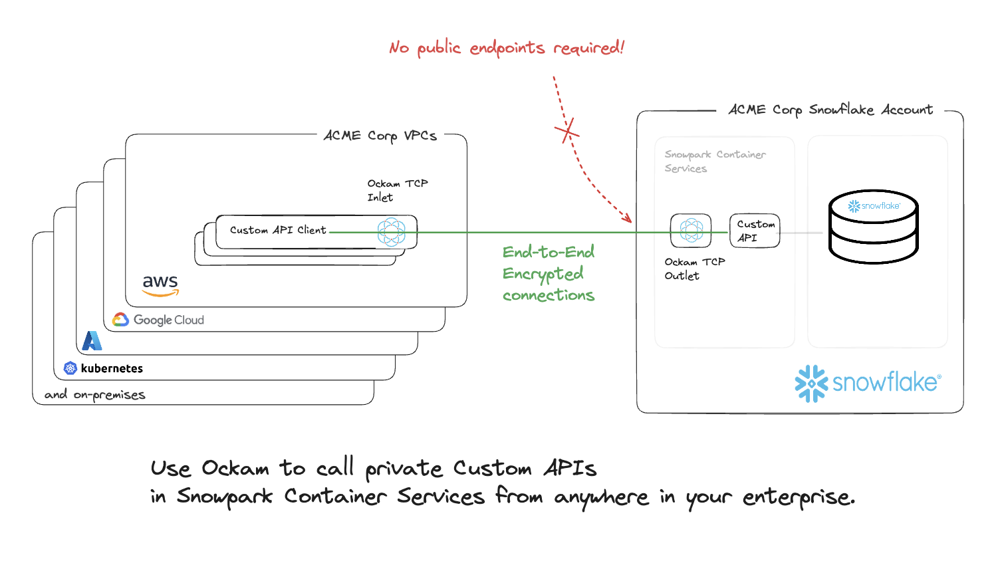

author: Adrian Benavides, Mrinal Wadhwa, Brad Culberson
id: build-a-private-custom-api-in-python
categories: snowflake-site:taxonomy/solution-center/certification/quickstart, snowflake-site:taxonomy/product/data-engineering, snowflake-site:taxonomy/snowflake-feature/build
language: en
summary: Use Ockam and Python/Flask to create private Python APIs for Snowflake with VPC connectivity for secure internal application access and integrations.
environments: web
status: Published
feedback link: https://github.com/Snowflake-Labs/sfguides/issues

# Build a private Custom API in Python and Flask using Ockam

<!-- ------------------------ -->
## Overview

Many builders want to share some of the data stored in Snowflake, over an http API, with various enterprise applications.
This tutorial will go through how to build, deploy, and host a __private__ custom API Powered by Snowflake.

We will use [Ockam](https://www.ockam.io/) to __privately__ share this API with other enterprise applications. This
private API will not have an endpoint that is exposed to the Internet. The tutorial will, instead, show you how to create
end-to-end encrypted Ockam Portals from your enterprise applications to the API in Snowflake. The API would then only be
accessible at private endpoints that are only available within your enterprise's VPC or other private environments.

This approach ensures that your API cannot be attacked from the Internet and its data will remain highly secure.



This API consists of reporting endpoints from data stored in Snowflake. After completing this guide, you will have built a custom API built with [Python Flask](https://flask.palletsprojects.com/).

The dataset is the [TPC-H](https://docs.snowflake.com/en/user-guide/sample-data-tpch) data set included in your Snowflake account.

### Prerequisites

- Privileges necessary to create a user, database, warehouse, compute pool, repository, network rule, external access integration, and service in Snowflake
- Privileges necessary to access the tables in the `SNOWFLAKE_SAMPLE_DATA.TPCH_SF10` database and schema
- Access to run SQL in the Snowflake console or SnowSQL
- Basic experience using git, GitHub, and Codespaces
- Intermediate knowledge of Python

### What You’ll Learn

- How to configure and build a custom API Powered by Snowflake
- How to build, publish, and deploy a container with the API in Snowflake

### What You’ll Need

- [Snowflake](https://snowflake.com) Account in an AWS commercial region
- [GitHub](https://github.com/) Account with credits for Codespaces
- [Ockam](https://www.ockam.io/) Account to securely expose your private API

### What You’ll Build

- API Powered by Snowflake

<!-- ------------------------ -->
## Setting up a Warehouse

The API needs a warehouse to query the data to return to the caller. To create the database and warehouse, connect to Snowflake and run the following commands in the Snowflake console or using SnowSQL:

```sql
USE ROLE ACCOUNTADMIN;
CREATE WAREHOUSE DATA_API_WH WITH WAREHOUSE_SIZE='xsmall';
```

### Create the Application Role in Snowflake

The application will run as a new role with minimal privileges. To create the role, connect to Snowflake and run the following SQL statements to create the role and grant it access to the data needed for the application.

```SQL
USE ROLE ACCOUNTADMIN;
CREATE ROLE DATA_API_ROLE;

GRANT USAGE ON WAREHOUSE DATA_API_WH TO ROLE DATA_API_ROLE;
CREATE DATABASE IF NOT EXISTS SNOWFLAKE_SAMPLE_DATA FROM SHARE SFC_SAMPLES.SAMPLE_DATA;
GRANT IMPORTED PRIVILEGES ON DATABASE SNOWFLAKE_SAMPLE_DATA TO ROLE DATA_API_ROLE;

GRANT ROLE DATA_API_ROLE TO ROLE ACCOUNTADMIN;
```

<!-- ------------------------ -->
## Setting up your Development Environment

The code used in this guide is hosted in GitHub. You will need a new codespace from [this GitHub repository](https://github.com/Snowflake-Labs/lab_data_api_python).

To create a new codespace, browse to this GitHub [repository](https://github.com/Snowflake-Labs/lab_data_api_python) in a browser. You will need to login to GitHub if you are not already logged in to access codespaces. After logging in, click on the green "<> Code" button and "create codespace on main" button.

You will then be redirected into codespaces where your development environment will load and all code from the GitHub repository will be loaded in the project.

### Endpoints

The API creates two sets of endpoints, one for using the Snowflake connector:

1. `https://<host>/connector/customers/top10`, which takes the following optional query parameters
   -`start_range` - the start date of the range in `YYYY-MM-DD` format. Defaults to `1995-01-01`.
   - `end_range` - the end date of the range in `YYYY-MM-DD` format. Defaults to `1995-03-31`.
2. `https://<host>/connector/clerk/<CLERKID>/yearly_sales/<YEAR>`, which takes two required path parameters:
   - `CLERKID` - the clerk ID. Use just the numbers, such as `000000001`.
   - `YEAR` - the year to use, such as `1995`.

And the same ones using Snowpark:
1. `https://<host>/snowpark/customers/top10`, which takes the following optional query parameters:
    - `start_range` - the start date of the range in `YYYY-MM-DD` format. Defaults to `1995-01-01`.
    - `end_range` - the end date of the range in `YYYY-MM-DD` format. Defaults to `1995-03-31`.
2. `https://<host>/snowpark/clerk/<CLERKID>/yearly_sales/<YEAR>`, which takes two required path parameters:
    - `CLERKID` - the clerk ID. Use just the numbers, such as `000000001`.
    - `YEAR` - the year to use, such as `1995`.

### Code

The `src/` directory has all the source code for the API. The `connector.py` file contains all the entrypoints for the API endpoints using the [Snowflake Connector for Python](https://docs.snowflake.com/en/user-guide/python-connector.html). The `customers_top10()` function is one of the API endpoints we needed for this API which finds the top 10 customers by sales in a date range. Review the code and the SQL needed to retrieve the data from Snowflake and serialize it to JSON for the response. This endpoint also takes two optional query string parameters `start_range` and `end_range`.

```python
@connector.route('/customers/top10')
def customers_top10():
    # Validate arguments
    sdt_str = request.args.get('start_range') or '1995-01-01'
    edt_str = request.args.get('end_range') or '1995-03-31'
    try:
        sdt = datetime.datetime.strptime(sdt_str, dateformat)
        edt = datetime.datetime.strptime(edt_str, dateformat)
    except:
        abort(400, "Invalid start and/or end dates.")
    sql_string = '''
        SELECT
            o_custkey
          , SUM(o_totalprice) AS sum_totalprice
        FROM snowflake_sample_data.tpch_sf10.orders
        WHERE o_orderdate >= '{sdt}'
          AND o_orderdate <= '{edt}'
        GROUP BY o_custkey
        ORDER BY sum_totalprice DESC
        LIMIT 10
    '''
    sql = sql_string.format(sdt=sdt, edt=edt)
    try:
        res = conn.cursor(DictCursor).execute(sql)
        return make_response(jsonify(res.fetchall()))
    except:
        abort(500, "Error reading from Snowflake. Check the logs for details.")
```

You can also review the other endpoints in [connector.py](https://github.com/Snowflake-Labs/lab_data_api_python/blob/main/src/connector.py) to see how simple it is to host multiple endpoints.

If you would also like to see how to build endpoints using the Snowflake Snowpark API, review [snowpark.py](https://github.com/Snowflake-Labs/lab_data_api_python/blob/main/src/snowpark.py).

<!-- ------------------------ -->
## Building the Application Container

To create the application container, we will leverage docker. The Dockerfile is based on python 3.8 and installs the required libraries needed for the application as well as the code. To create the docker container, run this command in the codespace terminal:

```bash
docker build -t dataapi .
```

<!-- ------------------------ -->
## Creating the Image Registry

To create the image registry and the database which contains it, connect to Snowflake and run the following commands in the Snowflake console or using SnowSQL:

```sql
USE ROLE ACCOUNTADMIN;
CREATE DATABASE API;

GRANT ALL ON DATABASE API TO ROLE DATA_API_ROLE;
CREATE SCHEMA IF NOT EXISTS API.PRIVATE;
GRANT ALL ON SCHEMA API.PRIVATE TO ROLE DATA_API_ROLE;

USE DATABASE API;
USE SCHEMA PRIVATE;
CREATE OR REPLACE IMAGE REPOSITORY API;
GRANT READ ON IMAGE REPOSITORY API TO ROLE DATA_API_ROLE;
SHOW IMAGE REPOSITORIES;
```

> 
> Note the `repository_url` in the response as that will be needed in the next step.

<!-- ------------------------ -->
## Pushing the Container to the Repository

Run the following command in the codespace terminal, replacing the `<repository_url>` with your repository in the previous step, to login to the container repository. You will be prompted for your Snowflake username and password to login to your repository.

```bash
docker login <repository_url>
docker build -t <repository_url>/dataapi .
docker push <repository_url>/dataapi
```

<!-- ------------------------ -->
## Creating the Compute Pool

To create the compute pool to run the application, connect to Snowflake and run the following command in the Snowflake console or using SnowSQL:

```sql
USE ROLE ACCOUNTADMIN;

CREATE COMPUTE POOL API_POOL
  MIN_NODES = 1
  MAX_NODES = 5
  INSTANCE_FAMILY = CPU_X64_XS;

GRANT USAGE ON COMPUTE POOL API_POOL TO ROLE DATA_API_ROLE;
GRANT MONITOR ON COMPUTE POOL API_POOL TO ROLE DATA_API_ROLE;
```

<!-- ------------------------ -->
## Creating the Application Service

To create the service to host the application, connect to Snowflake and run the following command in the Snowflake console or using SnowSQL.

```sql
USE ROLE ACCOUNTADMIN;
GRANT BIND SERVICE ENDPOINT ON ACCOUNT TO ROLE DATA_API_ROLE;

USE ROLE DATA_API_ROLE;
CREATE SERVICE API.PRIVATE.API
 IN COMPUTE POOL API_POOL
 FROM SPECIFICATION
$$
spec:
  container:
  - name: api
    image: /api/private/api/dataapi:latest
    resources:
      requests:
        cpu: 0.5
        memory: 128M
      limits:
        cpu: 1
        memory: 256M
  endpoint:
  - name: api
    port: 8001
    public: false
$$
QUERY_WAREHOUSE = DATA_API_WH;
```

It will take a few minutes for your service to initialize. You can check its status with these commands:

```sql
CALL SYSTEM$GET_SERVICE_STATUS('api');
CALL SYSTEM$GET_SERVICE_LOGS('api.private.api', 0, 'api');
```

After your service has started, you can get the endpoints with this command:

```sql
SHOW ENDPOINTS IN SERVICE API;
```

Note that the service is not public and that it doesn't have an ingress URL assigned.
In the next step, you will learn how to reach the service.

To verify, check that the DNS name of the API is an internal domain:

```sql
SHOW SERVICES;
```

> 
> Note the service's DNS name from the `dns_name`. You will need this in the next step when creating the Ockam service.

<!-- ------------------------ -->
## Accessing the Private API Securely

#### Get started with Ockam

[Ockam](https://www.ockam.io) and run the following commands in the codespace terminal:

```sh
# Install Ockam Command
curl --proto '=https' --tlsv1.2 -sSfL https://install.command.ockam.io | bash && source "$HOME/.ockam/env"

# Enroll with Ockam Orchestrator
ockam enroll

# Create an enrollment ticket for the node that will run inside container services
ockam project ticket --usage-count 1 --expires-in 1h \
  --attribute snowflake-api-service-outlet --relay snowflake-api-service-relay > ticket

# Print the egress allow list for your Ockam project
ockam project show --jq '.egress_allow_list[]'
```

> 
> Note the `egress_allow_list` in the response as that will be needed in the next step.

#### Create an Ockam node in Snowpark Container Services

Run the following command in the codespace terminal to push the latest Ockam image to the image repository:

```sh
docker pull ghcr.io/build-trust/ockam
docker tag ghcr.io/build-trust/ockam <repository_url>/ockam
docker push <repository_url>/ockam
```

Next, create a new service in Snowflake to run the Ockam node. Run the following command in the Snowflake console or SnowSQL:

> 
> IMPORTANT:
>
> - Replace `<EGRESS_ALLOW_LIST>` values in `VALUE_LIST` with the `egress_allow_list` you just noted.
> - Replace `<OCKAM_ENROLLMENT_TICKET>` with the contents of the `ticket` generated with the `ockam project ticket` command. You will find it in the root directory of your codespace.
> - Replace `<API_DNS_NAME>` with the DNS name of the API service you noted in the previous step.

```sql
USE ROLE ACCOUNTADMIN;

-- Update VALUE_LIST with ockam egress details
CREATE OR REPLACE NETWORK RULE OCKAM_OUT TYPE = 'HOST_PORT' MODE = 'EGRESS'
VALUE_LIST = ("<EGRESS_ALLOW_LIST>");

CREATE OR REPLACE EXTERNAL ACCESS INTEGRATION OCKAM
ALLOWED_NETWORK_RULES = (OCKAM_OUT) ENABLED = true;

GRANT USAGE ON INTEGRATION OCKAM TO ROLE DATA_API_ROLE;

USE ROLE DATA_API_ROLE;

CREATE SERVICE API_OCKAM_OUTLET
IN COMPUTE POOL API_POOL
FROM SPECIFICATION
$$
spec:
  containers:
  - name: ockam-outlet
    image: /api/private/api/ockam:latest
    args:
      - node
      - create
      - --foreground
      - --enrollment-ticket
      - "<OCKAM_ENROLLMENT_TICKET>"
      - --node-config
      - |
        relay: snowflake-api-service-relay
        tcp-outlet:
          to: <API_DNS_NAME>:8001
          allow: snowflake-api-service-inlet
    env:
        OCKAM_DISABLE_UPGRADE_CHECK: true
        OCKAM_OPENTELEMETRY_EXPORT: false
$$
EXTERNAL_ACCESS_INTEGRATIONS = (OCKAM);
```

After your service has started, you can check the service status with these commands:

```sql
CALL SYSTEM$GET_SERVICE_STATUS('API_OCKAM_OUTLET');
CALL SYSTEM$GET_SERVICE_LOGS('API_OCKAM_OUTLET', '0', 'ockam-outlet', 1000);
```

#### Create an Ockam node next to the API Client

Finally, create an Ockam node in the environment where your API client is running.


Run the following command in the codespace terminal:

```sh
docker run --rm -d  --name ockam-inlet -p 8001:8001 \
  ghcr.io/build-trust/ockam node create --foreground \
  --enrollment-ticket "$(ockam project ticket --usage-count 1 --expires-in 1h --attribute snowflake-api-service-inlet)" \
  --configuration "
    tcp-inlet:
      from: 0.0.0.0:8001
      via: snowflake-api-service-relay
      allow: snowflake-api-service-outlet
  "
```

### Testing using cURL

The API can now be tested using the cURL command-line tool from a new codespace terminal.

#### Top 10 Customers

To retrieve the top 10 customers in the date range of `1995-02-01` to `1995-02-14` using the Snowflake Connector for Python, run:

```bash
curl -X GET "http://localhost:8001/connector/customers/top10?start_range=1995-02-01&end_range=1995-02-14"
```

To retrieve the top 10 customers in the date range of `1995-02-01` to `1995-02-14` using the Snowflake Snowpark API, run:

```bash
curl -X GET "http://localhost:8001/snowpark/customers/top10?start_range=1995-02-01&end_range=1995-02-14"
```

If you call the endpoint without specifying the `start_range` then `1995-01-01` will be used. If you call the endpoint without specifying the `end_range` then `1995-03-31` will be used.

#### Monthly sales for a given year for a sales clerk
To retrieve the monthly sales for clerk `000000002` for the year `1995` using the Snowflake Connector for Python, run:

```bash
curl -X GET "http://localhost:8001/connector/clerk/000000002/yearly_sales/1995"
```

To retrieve the monthly sales for clerk `000000002` for the year `1995` using the Snowflake Snowpark API, run:

```bash
curl -X GET "http://localhost:8001/connector/clerk/000000002/yearly_sales/1995"
```

<!-- ------------------------ -->
## Stopping the API

To stop the API, you can suspend the service. From the Snowflake console or SnowSQL, run:

```sql
USE ROLE DATA_API_ROLE;
ALTER SERVICE API.PRIVATE.API SUSPEND;
```

<!-- ------------------------ -->
## Cleanup

To fully remove everything you did today you only need to drop some objects in your Snowflake account. From the Snowflake console or SnowSQL, as `DATA_API_ROLE` run:

```SQL
USE ROLE DATA_API_ROLE;

DROP SERVICE API.PRIVATE.API;
DROP SERVICE API_OCKAM_OUTLET;
```

Then, as `ACCOUNTADMIN` run:

```SQL
USE ROLE ACCOUNTADMIN;

DROP ROLE IF EXISTS DATA_API_ROLE;
DROP DATABASE IF EXISTS API;
DROP INTEGRATION IF EXISTS OCKAM;
DROP COMPUTE POOL IF EXISTS API_POOL;
DROP WAREHOUSE IF EXISTS DATA_API_WH;
```

<!-- ------------------------ -->
## Conclusion And Resources

Congratulations! You've successfully built and deployed a custom private API in Python powered by Snowflake, Ockam, and Flask. You created an http API to share data stored in Snowflake with enterprise applications.

You configured the necessary Snowflake resources, built and containerized the application, and __privately__ shared the API over end-to-end encrypted Ockam Portals. Your API does not have an endpoint that is exposed to the Internet. Instead, you created and tested  a private endpoint to your API.

Finally, you learned how to manage and clean up the deployed services.

### What You Learned

- How to configure and build a custom API Powered by Snowflake
- How to create private endpoints to your API using Ockam
- How to create and manage Snowflake resources such as warehouses, roles, and compute pools
- How to containerize your application using Docker
- How to deploy and run your application in Snowflake
- How to test private API endpoints
- How to manage and clean up deployed services

### Related Resources

- [Code for the project on GitHub](https://github.com/Snowflake-Labs/lab_data_api_python)
- [Snowpark for Python Developer Guide](https://docs.snowflake.com/en/developer-guide/snowpark/python/index.html)
- [Ockam Documentation](https://docs.ockam.io/)
- [Snowpark for Python API Reference](https://docs.snowflake.com/en/developer-guide/snowpark/reference/python/index.html)
- [Snowflake Connector for Python](https://docs.snowflake.com/en/user-guide/python-connector.html)
- [GitHub Codespaces Documentation](https://docs.github.com/en/codespaces)
- [TPC-H Dataset Documentation](https://docs.snowflake.com/en/user-guide/sample-data-tpch)
