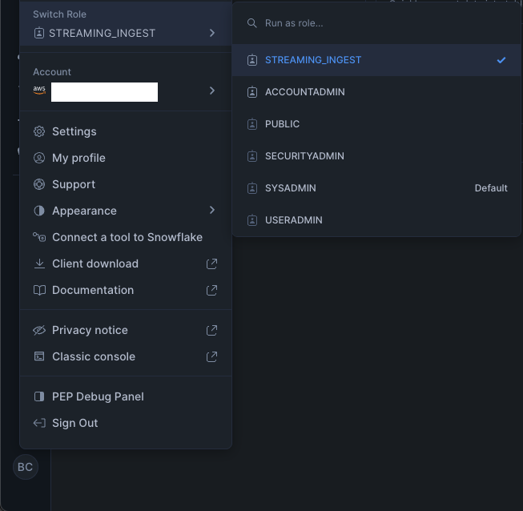
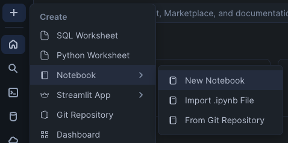
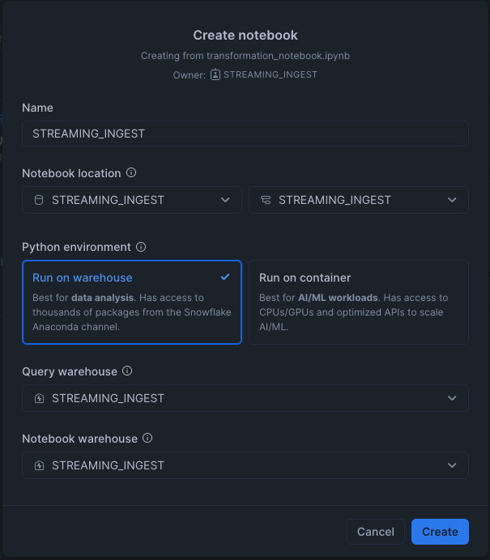
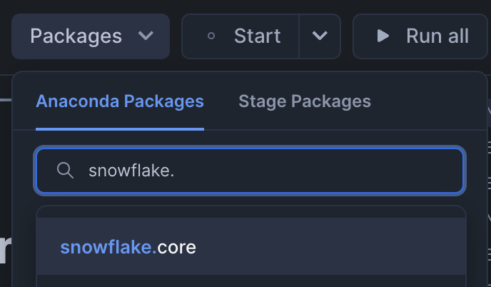
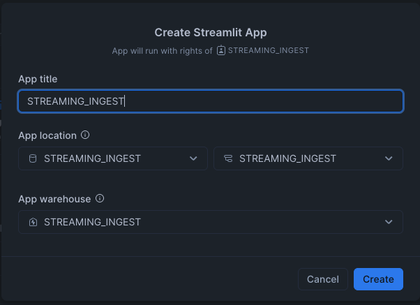
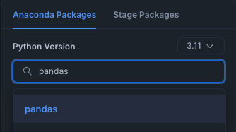

author: Brad Culberson, Keith Gaputis
id: build-a-streaming-data-pipeline-in-python
categories: snowflake-site:taxonomy/solution-center/certification/quickstart, snowflake-site:taxonomy/product/data-engineering
language: en
summary: Build streaming data pipelines in Python with Rowset API, Snowflake Dynamic Tables, and Streamlit for real-time data ingestion. 
environments: web
status: Published
feedback link: https://github.com/Snowflake-Labs/sfguides/issues

# Build a Streaming Data Pipeine in Python

<!-- ------------------------ -->
## Overview

Snowflake is a powerful platform to process streaming data and do near real-time reporting.

In this guide, we will use the High-Performance Python SDK to ingest data into Snowflake tables seconds from generation. The dataset is a randomly generated dataset one would find from ski resorts. It generates Resort Tickets, Lift Rides, and Season Passes in Python and enqueues the data in a SQLite database. The streamer component reads data from the database and sends it to Snowflake and cleans up the database from data sent.

To have fast and efficient near real-time reporting, we will use Dynamic Tables to materialize reports which are then queried from a Streamlit application deployed in the account.

### Prerequisites

- Privileges necessary to create a service user, database, and warehouse in Snowflake
- Access to run SQL in the Snowflake console or SnowSQL
- Basic experience using git, GitHub, and Codespaces
- Intermediate knowledge of Python and SQL

### What You’ll Learn

- How to send data from Python to Snowflake Streaming v2 REST API
- How to prepare data for reporting using Dynamic Tables
- How to create a basic Streamlit application for reporting

### What You’ll Need

- [Snowflake](https://snowflake.com) Account in an AWS commercial region
- [GitHub](https://github.com/) Account with credits for Codespaces

### What You’ll Build

- Streaming pipeline to do near real-time reporting

## Launch the Codespace in GitHub

Navigate to the [code repository](https://github.com/Snowflake-Labs/Summit2025-DE214) in GitHub.

Click on the green Code Button, go to the Codespaces tab, and click the green Create codespace on main. You must be logged into GitHub to see the Codespaces tab.

<!-- ------------------------ -->
## Creating the Service User & Role

To send data to Snowflake, the client must have a Service User's credentials. We will use key-pair authentication in this guide to authenticate to Snowflake and create a custom role with minimal privileges.

To generate the keypair run the following commands in the terminal in the codespace.

```bash
openssl genrsa 2048 | openssl pkcs8 -topk8 -inform PEM -out rsa_key.p8 -nocrypt
openssl rsa -in rsa_key.p8 -pubout -out rsa_key.pub
```

COPY the contents of the public key in rsa_key.pub from codespaces to the clipboard.

Login to Snowsight or use SnowSQL to execute the following commands replacing `===YOUR_PUBLIC_KEY_HERE===` with the key copied previously:

```sql

USE ROLE ACCOUNTADMIN;

CREATE WAREHOUSE IF NOT EXISTS STREAMING_INGEST;
CREATE ROLE IF NOT EXISTS STREAMING_INGEST;
CREATE USER STREAMING_INGEST LOGIN_NAME='STREAMING_INGEST' DEFAULT_WAREHOUSE='STREAMING_INGEST', DEFAULT_NAMESPACE='STREAMING_INGEST.STREAMING_INGEST', DEFAULT_ROLE='STREAMING_INGEST', TYPE=SERVICE, RSA_PUBLIC_KEY='===YOUR_PUBLIC_KEY_HERE===';
GRANT ROLE STREAMING_INGEST TO USER STREAMING_INGEST;
SET USERNAME=CURRENT_USER();
GRANT ROLE STREAMING_INGEST TO USER IDENTIFIER($USERNAME);

GRANT USAGE ON WAREHOUSE STREAMING_INGEST TO ROLE STREAMING_INGEST;
GRANT OPERATE ON WAREHOUSE STREAMING_INGEST TO ROLE STREAMING_INGEST;
```

## Creating the Database and Schema for data

This step will create the database and the schema where all the data is landed. This database will also store the notebook which sets up the data pipeline, the streamlit which displays the reports, and all tasks and dynamic tables created for this guide.

Login to Snowsight or use SnowSQL to execute the following commands:

```sql
USE ROLE ACCOUNTADMIN;

CREATE DATABASE IF NOT EXISTS STREAMING_INGEST;
USE DATABASE STREAMING_INGEST;
ALTER DATABASE STREAMING_INGEST SET USER_TASK_MINIMUM_TRIGGER_INTERVAL_IN_SECONDS=10;
CREATE SCHEMA IF NOT EXISTS STREAMING_INGEST;
USE SCHEMA STREAMING_INGEST;
GRANT OWNERSHIP ON DATABASE STREAMING_INGEST TO ROLE STREAMING_INGEST;
GRANT OWNERSHIP ON SCHEMA STREAMING_INGEST.STREAMING_INGEST TO ROLE STREAMING_INGEST;
GRANT EXECUTE TASK ON ACCOUNT TO ROLE STREAMING_INGEST;
```

## Creating the Tables and Pipes needed for data

This step creates the pipes which are needed to accept data from the clients and the tables which store the data from the pipes.

Login to Snowsight or use SnowSQL to execute the following commands:

```sql
USE ROLE STREAMING_INGEST;
USE DATABASE STREAMING_INGEST;
USE SCHEMA STREAMING_INGEST;

CREATE OR REPLACE TABLE RESORT_TICKET(TXID varchar(255), RFID varchar(255), RESORT varchar(255), PURCHASE_TIME datetime, PRICE_USD DECIMAL(7,2), EXPIRATION_TIME date, DAYS number, NAME varchar(255), ADDRESS variant, PHONE varchar(255), EMAIL varchar(255), EMERGENCY_CONTACT variant);

CREATE OR REPLACE PIPE RESORT_TICKET_PIPE AS
COPY INTO RESORT_TICKET
FROM TABLE (
      DATA_SOURCE (
      TYPE => 'STREAMING'
  )
)
MATCH_BY_COLUMN_NAME=CASE_SENSITIVE;

CREATE OR REPLACE TABLE SEASON_PASS(TXID varchar(255), RFID varchar(255), PURCHASE_TIME datetime, PRICE_USD DECIMAL(7,2), EXPIRATION_TIME date, NAME varchar(255), ADDRESS variant, PHONE varchar(255), EMAIL varchar(255), EMERGENCY_CONTACT variant);

CREATE OR REPLACE PIPE SEASON_PASS_PIPE AS
COPY INTO SEASON_PASS
FROM TABLE (
      DATA_SOURCE (
      TYPE => 'STREAMING'
  )
)
MATCH_BY_COLUMN_NAME=CASE_SENSITIVE;

CREATE OR REPLACE TABLE LIFT_RIDE(TXID varchar(255), RFID varchar(255), RESORT varchar(255), LIFT varchar(255), RIDE_TIME datetime, ACTIVATION_DAY_COUNT integer);

CREATE OR REPLACE PIPE LIFT_RIDE_PIPE AS
COPY INTO LIFT_RIDE
FROM TABLE (
      DATA_SOURCE (
      TYPE => 'STREAMING'
  )
)
MATCH_BY_COLUMN_NAME=CASE_SENSITIVE;
```

## Write Streaming Application

To authenticate to Snowflake, you will need to setup the environment with credentials to your account.

This will all be done in the codespace created previously.

Make a copy of the env file to edit by running this command in the codespace terminal.

```bash
cp .env.example .env
```

Edit the account name in the .env file (SNOWFLAKE_ACCOUNT) to match your Snowflake account name.

If you do not know your account name, you can run this sql in Snowsight or via snowsql.

```sql
select current_account();
```

Paste in your private key from the rsa_key.p8 file into the .env file (PRIVATE_KEY).

Set the appropriate value for the host where your Snowflake endpoint resides (SNOWFLAKE_HOST). You can get the Account/Server URL from the Account Details in Snowsight.

### Stream the Data to Snowflake

This repository will generate sample data and supplies the framework and dependencies needed for you to stream data to Snowflake. You need to write the code to stream data to Snowflake.

You will write the main body of the function stream_data in streamer.py. The pipe_name and 2 data access functions are passed to this function. All configuration parameters needed are in the streamer.py under `# parameters`.

fn_get_data takes 2 parameters, the first parameter is the offset to read data from ex: (SELECT * where > offset) and the second parameter is the maximum number of records to read. It will return a list of json strings which can be sent to Snowflake.

Example usage: 

```python
rows = fn_get_data(latest_committed_offset_token, BATCH_SIZE)
```

fn_delete_data takes 1 parameter: the offset to delete data up to and including ex: (DELETE * where offset <= offset).

```python
fn_delete_data(current_committed_offset_token)
```

The first thing the stream_data fn should do is to create a SnowflakeStreamingIngestClient. This client will allow you to operate on Channels which are needed to send data to Snowflake.

To create a SnowflakeStreamingIngestClient, you will need to pass it the channel name and kwargs: account, user, database, schema, private_key, ROWSET_DEV_VM_TEST_MODE.

```python
client = SnowflakeStreamingIngestClient(client_name, account=account_name, host=host_name, user=user_name, database=database_name, schema=schema_name, private_key=private_key, ROWSET_DEV_VM_TEST_MODE="false")
```

This client can be used to open a channel you will need to send data. client.open_channel function takes the channel_name, database_name, schema_name, and the pipe_name as arguments.

```python
channel = client.open_channel(channel_name, database_name, schema_name, pipe_name)
```

To know where this process left off on last run (or if this is the first run) you can pull the current committed offset. This is available by calling channel.get_latest_committed_offset_token()

```python
latest_committed_offset_token = channel.get_latest_committed_offset_token()
```

If this returns None, there has been no data sent to Snowflake, otherwise it will be the latest offset sent.

The channel should be long lived, so there should be an event loop grabbing data. Data can be pulled using fn_get_data from the that offset, or 0 if this is the first data.

Data is returned from the fn_get_data in records as: (int id, string data), but the append_row function expects a single object. This can easily be converted using json.loads from the data in each row returned from fn_get_data. You can use the id as the last offset in the append_row function to set the correct offset token.

```python
for row in rows:
    channel.append_row(json.loads(row[1]), str(row[0]))
```

In order to cleanup you will also want to occasionally delete the local data from the committed offset (retrieved from Snowflake). You can use the fn_delete_data function to do so. This should also be done in the event loop.

### Test the Streaming Application

In the codespace, build and start the docker container.

```bash
docker compose build
docker compose up
```

### Verify Data is Streaming

Run the following sql to verify data is arriving in your account.

Verify Season Passes are being streamed:

```sql
select * from SEASON_PASS limit 10;
```

Verify Resort Tickets are being streamed:

```sql
select * from RESORT_TICKET limit 10;
```

Verify Lift Rides are being streamed:

```sql
select * from LIFT_RIDE limit 10;
```

## Import the Notebook

We have created a notebook you can use to get started building the streaming data pipeline.

[Download](https://github.com/Snowflake-Labs/Summit2025-DE214/raw/refs/heads/main/transformation_notebook.ipynb) the Notebook from Github.

Login to Snowsight, click on the bottom left to get the Navigation Menu and Switch Role to STREAMING_INGEST.



Click on the +, Notebook, and Import .ipynb File.



Name the notebook transformation_notebook, select the db STREAMING_INGEST and the schema STREAMING_INGEST.

Select Run on warehouse and use the query warehouse STREAMING_INGEST and notebook warehouse STREAMING_INGEST.

This will run everything on one warehouse to keep it as efficient as possible.

Click Create.



Add the Snowflake.Core package which is required by this notebook.



Follow the Notebook cells to build the data pipeline objects.

After complete, you will have a data pipeline built on the streaming data using: views, dynamic tables, and triggered tasks.

## Create the Streamlit Application

A Streamlit Application will be created to demonstrate how the data prepared previously could be leveraged in an analytic dashboard inside your organization.

To create a new Streamlit Application Click on +, Streamlit App, and New Streamlit App.


Choose the App title STREAMING_INGEST, App location in STREAMING_INGEST database and STREAMING_INGEST schema, and run on the warehouse STREAMING_INGEST.



Add the Package plotly and pandas.




Overwrite all the contents of the streamlit_app.py file in the editor with the [application code](https://raw.githubusercontent.com/Snowflake-Labs/Summit2025-DE214/refs/heads/main/streamlit_app.py) available in the Github repository.

Run the Streamlit to see the visualizations from the data pipeline built in this guide.

<!-- ------------------------ -->
## Cleanup

To fully remove everything you did today you only need to drop some objects in your Snowflake account. From the Snowflake console or SnowSQL, as `ACCOUNTADMIN` run:
```SQL
USE ROLE STREAMING_INGEST;
DROP DATABASE IF EXISTS STREAMING_INGEST;

USE ROLE ACCOUNTADMIN;
DROP WAREHOUSE IF EXISTS STREAMING_INGEST;
DROP USER IF EXISTS STREAMING_INGEST;
DROP ROLE IF EXISTS STREAMING_INGEST;
```

<!-- ------------------------ -->
## Conclusion

### What we covered
- Creating a table and pipe to receive streaming data
- Sending data to the Snowpipe Streaming API from Python
- Using a Notebook to create a near real-time Data Pipeline leveraging Dynamic Tables
- Querying the streaming data from a Notebook and Streamlit

### Next steps

Snowflake documentation and quickstarts will provide more information you will need to build a robust streaming data pipeline. Review these resources to learn more.

- [Tutorial: Get started with Snowpipe Streaming high performance architecture SDK](https://docs.snowflake.com/en/user-guide/snowpipe-streaming-high-performance-getting-started)
- [Dynamic Tables Introduction](https://docs.snowflake.com/en/user-guide/dynamic-tables-intro)
- Quickstart on [Dynamic Tables](/en/developers/guides/getting-started-with-dynamic-tables/)
- Quickstart on [Streamlit](/en/developers/guides/getting-started-with-snowpark-for-python-streamlit/)


