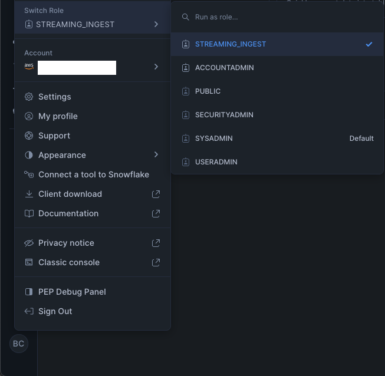
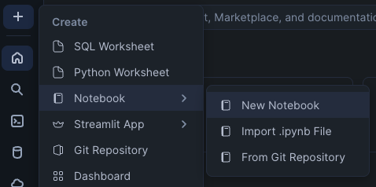
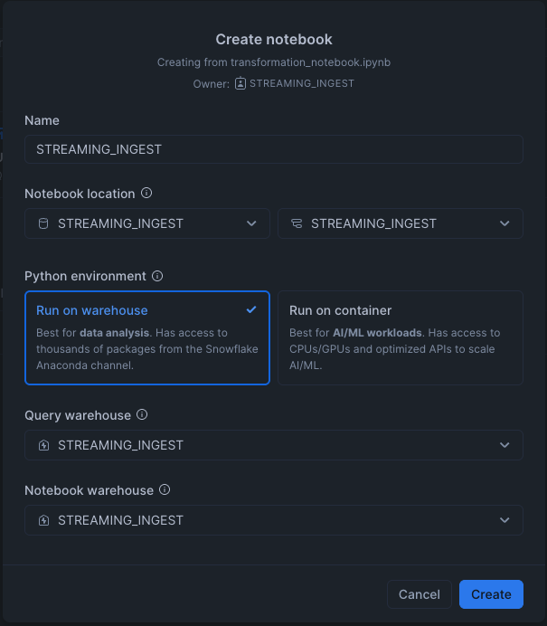
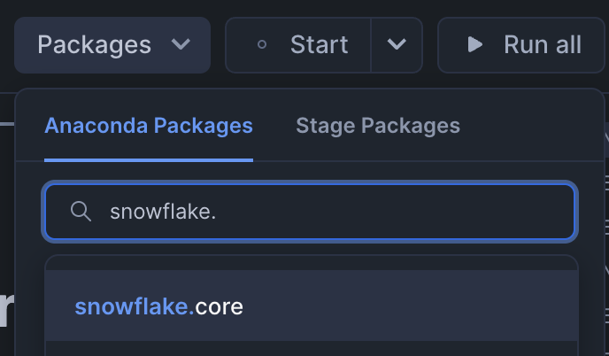
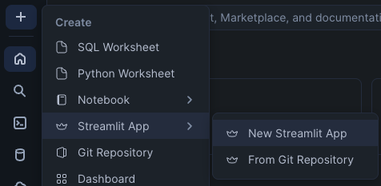
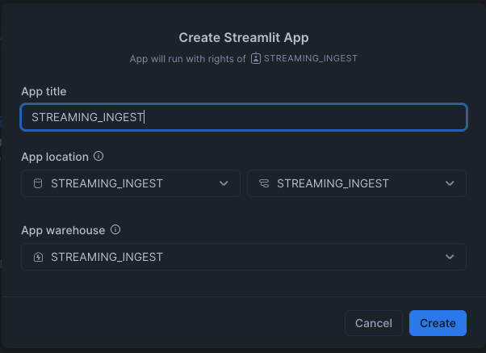
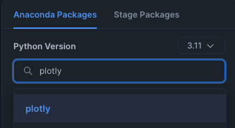
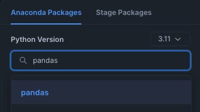

author: Brad Culberson, Keith Gaputis
id: build-a-streaming-data-pipeline-in-python
categories: snowflake-site:taxonomy/solution-center/certification/quickstart, snowflake-site:taxonomy/product/data-engineering
language: en
summary: Build streaming data pipelines in Python with Snowpipe Streaming elastic channels, Snowflake Dynamic Tables, and Streamlit.
environments: web
status: Published
feedback link: https://github.com/Snowflake-Labs/sfguides/issues

# Build a Streaming Data Pipeline in Python

<!-- ------------------------ -->
## Overview

Snowflake is a powerful platform to process streaming data and do near real-time reporting.

In this guide, we will use the Snowpipe Streaming high-performance Python SDK to ingest data into Snowflake tables seconds after generation. The sample generator produces Resort Tickets, Lift Rides, and Season Passes and sends each in-memory batch directly to Snowflake through elastic channels. Each append returns a future that completes only after Snowflake durably acknowledges the rows.

To have fast and efficient near real-time reporting, we will use Dynamic Tables to materialize reports which are then queried from a Streamlit application deployed in the account.

### Prerequisites

- Privileges necessary to create a service user, database, and warehouse in Snowflake
- Access to run SQL in the Snowflake console or SnowSQL
- Basic experience using git, GitHub, and Codespaces
- Intermediate knowledge of Python and SQL

### What You’ll Learn

- How to send Python batches directly to Snowflake with elastic channels
- How to wait for durable acknowledgments from Snowflake
- How to prepare data for reporting using Dynamic Tables
- How to create a basic Streamlit application for reporting

### What You’ll Need

- [Snowflake](https://snowflake.com) Account in an AWS commercial region
- [GitHub](https://github.com/) Account with credits for Codespaces

### What You’ll Build

- Streaming pipeline to do near real-time reporting

## Launch the Codespace in GitHub

Navigate to the [code repository](https://github.com/Snowflake-Labs/Summit2025-DE214) in GitHub.

Click on the green Code Button, go to the Codespaces tab, and click the green Create codespace on main. You must be logged into GitHub to see the Codespaces tab.

<!-- ------------------------ -->
## Creating the Service User & Role

To send data to Snowflake, the client must have a Service User's credentials. We will use key-pair authentication in this guide to authenticate to Snowflake and create a custom role with minimal privileges.

To generate the keypair run the following commands in the terminal in the codespace.

```bash
openssl genrsa 2048 | openssl pkcs8 -topk8 -inform PEM -out rsa_key.p8 -nocrypt
openssl rsa -in rsa_key.p8 -pubout -out rsa_key.pub
```

COPY the contents of the public key in rsa_key.pub from codespaces to the clipboard.

Login to Snowsight or use SnowSQL to execute the following commands replacing `===YOUR_PUBLIC_KEY_HERE===` with the key copied previously:

```sql

USE ROLE ACCOUNTADMIN;

CREATE WAREHOUSE IF NOT EXISTS STREAMING_INGEST;
CREATE ROLE IF NOT EXISTS STREAMING_INGEST;
CREATE USER STREAMING_INGEST LOGIN_NAME='STREAMING_INGEST' DEFAULT_WAREHOUSE='STREAMING_INGEST', DEFAULT_NAMESPACE='STREAMING_INGEST.STREAMING_INGEST', DEFAULT_ROLE='STREAMING_INGEST', TYPE=SERVICE, RSA_PUBLIC_KEY='===YOUR_PUBLIC_KEY_HERE===';
GRANT ROLE STREAMING_INGEST TO USER STREAMING_INGEST;
SET USERNAME=CURRENT_USER();
GRANT ROLE STREAMING_INGEST TO USER IDENTIFIER($USERNAME);

GRANT USAGE ON WAREHOUSE STREAMING_INGEST TO ROLE STREAMING_INGEST;
GRANT OPERATE ON WAREHOUSE STREAMING_INGEST TO ROLE STREAMING_INGEST;
```

## Creating the Database and Schema for data

This step will create the database and the schema where all the data is landed. This database will also store the notebook which sets up the data pipeline, the streamlit which displays the reports, and all tasks and dynamic tables created for this guide.

Login to Snowsight or use SnowSQL to execute the following commands:

```sql
USE ROLE ACCOUNTADMIN;

CREATE DATABASE IF NOT EXISTS STREAMING_INGEST;
USE DATABASE STREAMING_INGEST;
ALTER DATABASE STREAMING_INGEST SET USER_TASK_MINIMUM_TRIGGER_INTERVAL_IN_SECONDS=10;
CREATE SCHEMA IF NOT EXISTS STREAMING_INGEST;
USE SCHEMA STREAMING_INGEST;
GRANT OWNERSHIP ON DATABASE STREAMING_INGEST TO ROLE STREAMING_INGEST;
GRANT OWNERSHIP ON SCHEMA STREAMING_INGEST.STREAMING_INGEST TO ROLE STREAMING_INGEST;
GRANT EXECUTE TASK ON ACCOUNT TO ROLE STREAMING_INGEST;
```

## Creating the Tables and Pipes needed for data

This step creates the pipes which are needed to accept data from the clients and the tables which store the data from the pipes.

Login to Snowsight or use SnowSQL to execute the following commands:

```sql
USE ROLE STREAMING_INGEST;
USE DATABASE STREAMING_INGEST;
USE SCHEMA STREAMING_INGEST;

CREATE OR REPLACE TABLE RESORT_TICKET(TXID varchar(255), RFID varchar(255), RESORT varchar(255), PURCHASE_TIME datetime, PRICE_USD DECIMAL(7,2), EXPIRATION_TIME date, DAYS number, DAYS_USED number, NAME varchar(255), ADDRESS variant, PHONE varchar(255), EMAIL varchar(255), EMERGENCY_CONTACT variant);

CREATE OR REPLACE PIPE RESORT_TICKET_PIPE AS
COPY INTO RESORT_TICKET
FROM TABLE (
      DATA_SOURCE (
      TYPE => 'STREAMING'
  )
)
MATCH_BY_COLUMN_NAME=CASE_SENSITIVE;

CREATE OR REPLACE TABLE SEASON_PASS(TXID varchar(255), RFID varchar(255), PURCHASE_TIME datetime, PRICE_USD DECIMAL(7,2), EXPIRATION_TIME date, DAYS_USED number, NAME varchar(255), ADDRESS variant, PHONE varchar(255), EMAIL varchar(255), EMERGENCY_CONTACT variant);

CREATE OR REPLACE PIPE SEASON_PASS_PIPE AS
COPY INTO SEASON_PASS
FROM TABLE (
      DATA_SOURCE (
      TYPE => 'STREAMING'
  )
)
MATCH_BY_COLUMN_NAME=CASE_SENSITIVE;

CREATE OR REPLACE TABLE LIFT_RIDE(TXID varchar(255), RFID varchar(255), RESORT varchar(255), LIFT varchar(255), RIDE_TIME datetime, ACTIVATION_DAY_COUNT integer);

CREATE OR REPLACE PIPE LIFT_RIDE_PIPE AS
COPY INTO LIFT_RIDE
FROM TABLE (
      DATA_SOURCE (
      TYPE => 'STREAMING'
  )
)
MATCH_BY_COLUMN_NAME=CASE_SENSITIVE;
```

## Write Streaming Application

To authenticate to Snowflake, you will need to setup the environment with credentials to your account.

This will all be done in the codespace created previously.

Make a copy of the env file to edit by running this command in the codespace terminal.

```bash
cp .env.example .env
```

Copy `.env.example` to `.env`. Set `SNOWFLAKE_ACCOUNT_URI` to the **Account URL** from Snowsight (account selector → **View account details**), without building a hostname from an account locator. See [Locate your Snowflake account information in Snowsight](https://docs.snowflake.com/en/user-guide/ui-snowsight-gs#locate-your-snowflake-account-information-in-snowsight).

Paste in your private key from the `rsa_key.p8` file into the `.env` file (`PRIVATE_KEY`).

The example also sets `SNOWFLAKE_ROLE=STREAMING_INGEST` and waits up to 120 seconds for each durable acknowledgment. You can change this with `ACK_TIMEOUT_SECONDS`.

### Stream the Data to Snowflake

The repository pins `snowpipe-streaming==1.8.0`, the latest stable Python SDK release at the time this guide was published. It also includes a `SnowflakeStreamingSink` that connects the generator directly to the three Snowflake pipes.

A `StreamingIngestClient` maps to one database, schema, and pipe. The sink therefore creates one client per generated record type. `account_url` is the Account URL copied from Snowsight; `account_name` is derived from that URL.

```python
client = StreamingIngestClient(
    client_name=f"{client_name}-{stream_name}",
    db_name=database_name,
    schema_name=schema_name,
    pipe_name=pipe_name,
    properties={
        "account": account_name,
        "user": user_name,
        "private_key": private_key,
        "url": account_url,
        "role": "STREAMING_INGEST",
    },
)
```

Get the client-managed elastic channel:

```python
elastic_channel = client.get_elastic_channel()
```

The generator builds Python dictionaries for each record type and sends every non-empty batch with `append_rows_with_wait`. The second argument is a small caller token used if you register success or error handlers. The method returns a `concurrent.futures.Future`. Waiting for each future is the durability boundary: when `result` returns successfully, Snowflake has acknowledged that the rows are safely persisted.

```python
future = elastic_channel.append_rows_with_wait(rows, "tickets-1")
future.result(timeout=120)
```

The generated rows remain in the current in-memory batch while the application waits. If an append or acknowledgment fails, the generator logs the error and stops instead of reporting the batch as successful. The SDK handles transient retries.

### Test the Streaming Application

In the codespace, build and start the docker container.

```bash
docker compose build
docker compose up
```

The container runs the generator as a single process. Its logs show each elastic channel opening and periodic generation statistics. Data is sent directly from that process to Snowflake.

### Verify Data is Streaming

Run the following sql to verify data is arriving in your account.

Verify Season Passes are being streamed:

```sql
select * from SEASON_PASS limit 10;
```

Verify Resort Tickets are being streamed:

```sql
select * from RESORT_TICKET limit 10;
```

Verify Lift Rides are being streamed:

```sql
select * from LIFT_RIDE limit 10;
```

## Import the Notebook

We have created a notebook you can use to get started building the streaming data pipeline.

[Download](https://github.com/Snowflake-Labs/Summit2025-DE214/raw/refs/heads/main/transformation_notebook.ipynb) the Notebook from Github.

Login to Snowsight, click on the bottom left to get the Navigation Menu and Switch Role to STREAMING_INGEST.



Click on the +, Notebook, and Import .ipynb File.



Name the notebook transformation_notebook, select the db STREAMING_INGEST and the schema STREAMING_INGEST.

Select Run on warehouse and use the query warehouse STREAMING_INGEST and notebook warehouse STREAMING_INGEST.

This will run everything on one warehouse to keep it as efficient as possible.

Click Create.



Add the Snowflake.Core package which is required by this notebook.



Follow the Notebook cells to build the data pipeline objects.

After complete, you will have a data pipeline built on the streaming data using: views, dynamic tables, and triggered tasks.

## Create the Streamlit Application

A Streamlit Application will be created to demonstrate how the data prepared previously could be leveraged in an analytic dashboard inside your organization.

To create a new Streamlit Application Click on +, Streamlit App, and New Streamlit App.



Choose the App title STREAMING_INGEST, App location in STREAMING_INGEST database and STREAMING_INGEST schema, and run on the warehouse STREAMING_INGEST.



Add the Package plotly and pandas.





Overwrite all the contents of the streamlit_app.py file in the editor with the [application code](https://raw.githubusercontent.com/Snowflake-Labs/Summit2025-DE214/refs/heads/main/streamlit_app.py) available in the Github repository.

Run the Streamlit to see the visualizations from the data pipeline built in this guide.

<!-- ------------------------ -->
## Cleanup

To fully remove everything you did today you only need to drop some objects in your Snowflake account. From the Snowflake console or SnowSQL, as `ACCOUNTADMIN` run:
```SQL
USE ROLE STREAMING_INGEST;
DROP DATABASE IF EXISTS STREAMING_INGEST;

USE ROLE ACCOUNTADMIN;
DROP WAREHOUSE IF EXISTS STREAMING_INGEST;
DROP USER IF EXISTS STREAMING_INGEST;
DROP ROLE IF EXISTS STREAMING_INGEST;
```

<!-- ------------------------ -->
## Conclusion

### What we covered
- Creating a table and pipe to receive streaming data
- Sending batches through Snowpipe Streaming elastic channels
- Using durable acknowledgments from elastic channels
- Using a Notebook to create a near real-time Data Pipeline leveraging Dynamic Tables
- Querying the streaming data from a Notebook and Streamlit

### Next steps

Snowflake documentation and quickstarts will provide more information you will need to build a robust streaming data pipeline. Review these resources to learn more.

- [Tutorial: Get started with Snowpipe Streaming high performance architecture SDK](https://docs.snowflake.com/en/user-guide/snowpipe-streaming-high-performance-getting-started)
- [Python SDK elastic channel API](https://docs.snowflake.com/en/user-guide/snowpipe-streaming-sdk-python/reference/latest/api/snowflake/ingest/streaming/streaming_ingest_elastic_channel/index)
- [Dynamic Tables Introduction](https://docs.snowflake.com/en/user-guide/dynamic-tables-intro)
- Quickstart on [Dynamic Tables](/en/developers/guides/getting-started-with-dynamic-tables/)
- Quickstart on [Streamlit](/en/developers/guides/getting-started-with-snowpark-for-python-streamlit/)


