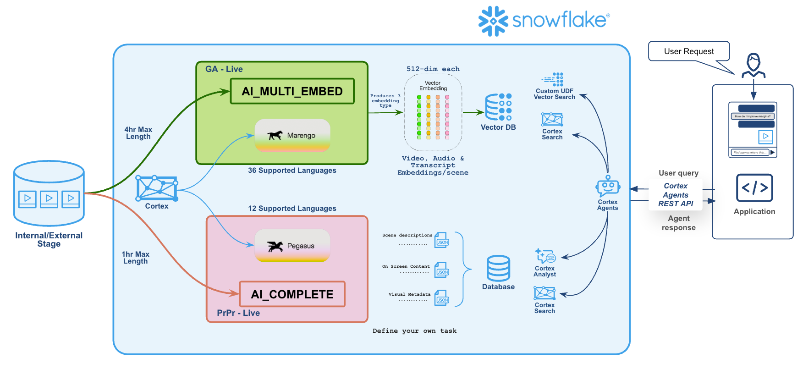

author: Akhil Ramasagaram
id: build-a-video-search-app-with-twelve-labs
language: en
summary: Build an end-to-end video search and analysis app on Snowflake with Twelve Labs Marengo, Pegasus, Cortex Search, and Streamlit.
categories: snowflake-site:taxonomy/solution-center/certification/quickstart, snowflake-site:taxonomy/product/ai, snowflake-site:taxonomy/product/applications-and-collaboration, snowflake-site:taxonomy/snowflake-feature/cortex-search, snowflake-site:taxonomy/snowflake-feature/cortex-llm-functions
environments: web
status: Published
feedback link: https://github.com/Snowflake-Labs/sfguides/issues

# Build a Video Search App with Twelve Labs on Snowflake
<!-- ------------------------ -->
## Overview

In this guide you'll turn a folder of video files into an app that lets you:

- **Search** every video by typing a description or dropping in an image, and jump straight to the matching moment.
- **Analyze** any video with a plain-language prompt and get structured answers back (optional, requires Pegasus Private Preview access).

The whole pipeline runs inside Snowflake. No video leaves your account, and every step is a SQL function call.



### What You'll Build
| Step | What it does | Snowflake surface |
|---|---|---|
| 1. Stage | Point Snowflake at your videos | Stage + directory table |
| 2. Embed | Turn each video into time-stamped vectors | `AI_MULTI_EMBED` with **Marengo 3.0** |
| 3. Index | Make the vectors searchable | **Cortex Search** (vector index) |
| 4. Analyze (optional) | Ask questions about a video | `AI_COMPLETE` with **Pegasus 1.2** |
| 5. App | Put it all behind a UI | **Streamlit** |

### What You'll Learn
- How to embed video, text, and images into one shared vector space with `AI_MULTI_EMBED`
- How to query a Cortex Search vector index with your own embeddings
- How to play search hits at the exact matching timestamp in a Streamlit app
- (Optional) How to ask questions about a video with `AI_COMPLETE` and Pegasus

### What You'll Need
- A Snowflake account in a region that supports `twelvelabs-marengo-embed-3-0`, or with cross-region inference enabled. See [AI_MULTI_EMBED regional availability](https://docs.snowflake.com/en/sql-reference/functions/ai_multi_embed).
- A role with `SNOWFLAKE.CORTEX_USER` and privileges to create a database, stage, and Cortex Search service
- A few `.mp4` files (a handful of short clips is enough to start)
- (Optional) Pegasus 1.2 access. Pegasus is in Private Preview, so the Analyze step and app tab are optional. Everything else uses Marengo 3.0, which is generally available.

<!-- ------------------------ -->
## Stage Your Videos

Create a database, a schema, and a stage with a directory table. The directory table is what lets you list and reference files from SQL.

```sql
CREATE DATABASE IF NOT EXISTS TWELVE_LABS_DEMO;
CREATE SCHEMA IF NOT EXISTS TWELVE_LABS_DEMO.VIDEO_INTELLIGENCE;
USE SCHEMA TWELVE_LABS_DEMO.VIDEO_INTELLIGENCE;

CREATE STAGE IF NOT EXISTS VIDEO_STAGE
  DIRECTORY  = (ENABLE = TRUE)
  ENCRYPTION = (TYPE = 'SNOWFLAKE_SSE');
```

Upload your videos to the stage in Snowsight (**Data » Add Data » Load files into a Stage**), or from the CLI:

```bash
snow stage copy ./videos/*.mp4 @TWELVE_LABS_DEMO.VIDEO_INTELLIGENCE.VIDEO_STAGE
```

Then refresh the directory table:

```sql
ALTER STAGE VIDEO_STAGE REFRESH;
SELECT RELATIVE_PATH, SIZE FROM DIRECTORY(@VIDEO_STAGE);
```

> aside positive
> **Already have video in S3, GCS, or Azure?** Create an external stage on a storage integration instead. The rest of this guide works the same with either kind of stage.

We also need a small internal stage where the app uploads images for image-to-video search:

```sql
CREATE STAGE IF NOT EXISTS SEARCH_UPLOADS
  DIRECTORY  = (ENABLE = TRUE)
  ENCRYPTION = (TYPE = 'SNOWFLAKE_SSE');
```

<!-- ------------------------ -->
## Embed Videos with Marengo

`AI_MULTI_EMBED` with Marengo watches each video and returns a list of segments. Each segment has a 512-dimensional vector for one modality (`visual`, `audio`, or `transcription`) plus its start and end time.

Flatten that output into one row per segment:

```sql
CREATE OR REPLACE TABLE VIDEO_EMBEDDINGS AS
WITH raw AS (
    SELECT
        REPLACE(RELATIVE_PATH, '.mp4', '') AS episode,
        AI_MULTI_EMBED(
            'twelvelabs-marengo-embed-3-0',
            TO_FILE('@VIDEO_STAGE', RELATIVE_PATH)
        ) AS emb
    FROM DIRECTORY(@VIDEO_STAGE)
)
SELECT
    episode,
    f.value['embedding']::VECTOR(FLOAT, 512) AS embedding_vec,
    f.value['embedding_option']::STRING      AS modality,
    f.value['start_sec']::FLOAT              AS start_sec,
    f.value['end_sec']::FLOAT                AS end_sec
FROM raw, LATERAL FLATTEN(input => raw.emb['value']) f;
```

Check what you got:

```sql
SELECT modality, COUNT(*) AS segments, COUNT(DISTINCT episode) AS videos
FROM VIDEO_EMBEDDINGS
GROUP BY modality;
```

> aside positive
> Marengo puts text, images, and video in the **same vector space**. That's why a text query or an uploaded photo can be matched directly against video segments. You'll use this in the app.

<!-- ------------------------ -->
## Index with Cortex Search

Create a Cortex Search service with a **vector index** on the Marengo embeddings. This guide indexes the `visual` modality, which works best for "find the scene where..." queries.

```sql
CREATE OR REPLACE CORTEX SEARCH SERVICE VIDEO_SEARCH_SERVICE
  TEXT INDEXES   EPISODE
  VECTOR INDEXES EMBEDDING_VEC
  ATTRIBUTES     EPISODE, MODALITY, START_SEC, END_SEC
  WAREHOUSE      = <your_warehouse>
  TARGET_LAG     = '1 day'
AS (
    SELECT EPISODE, EMBEDDING_VEC, MODALITY, START_SEC, END_SEC
    FROM VIDEO_EMBEDDINGS
    WHERE MODALITY = 'visual'
);
```

Because the vectors come from Marengo rather than a built-in Cortex embedding model, you embed the query with the same model at search time and pass the vector to the service. The app handles this in the next steps.

<!-- ------------------------ -->
## (Optional) Analyze Video with Pegasus

> aside negative
> **Private Preview:** `twelvelabs-pegasus-1-2` is not yet in the public `AI_COMPLETE` model list. If your account isn't enrolled, skip this step and leave `ENABLE_PEGASUS = False` in the app. Search works without it. Contact your Snowflake account team to request access.

Pegasus is a video-language model. Give it a video and a prompt, and it answers in text:

```sql
SELECT AI_COMPLETE(
    'twelvelabs-pegasus-1-2',
    'Summarize this video in 3 bullets, then list the main characters as JSON.',
    TO_FILE('@VIDEO_STAGE', '<your_video>.mp4')
) AS analysis;
```

There's no frame extraction and no transcription step. That one call is all the app needs for its Analyze tab.

<!-- ------------------------ -->
## Build the Streamlit App

The app has two tabs:

- **Embed + Search**: embed the text or image query with Marengo, send the vector to Cortex Search, and play each hit at its timestamp using a presigned URL.
- **Analyze** (optional): pick a video, write a prompt, and run Pegasus. Set `ENABLE_PEGASUS = True` only if your account has Pegasus access.

Create `streamlit_app.py`:

```python
import json
import streamlit as st
from snowflake.core import Root

st.set_page_config(page_title="Twelve Labs x Snowflake", layout="wide")

DB, SCHEMA = "TWELVE_LABS_DEMO", "VIDEO_INTELLIGENCE"
VIDEO_STAGE = f"@{DB}.{SCHEMA}.VIDEO_STAGE"
UPLOAD_STAGE = f"@{DB}.{SCHEMA}.SEARCH_UPLOADS"
ENABLE_PEGASUS = False  # Pegasus is Private Preview; set True if your account is enrolled

conn = st.connection("snowflake")
session = conn.session()
search_svc = (Root(session).databases[DB].schemas[SCHEMA]
              .cortex_search_services["VIDEO_SEARCH_SERVICE"])


def embed_query(text=None, image=None) -> list:
    """Embed a text string or an uploaded image with Marengo."""
    if image is not None:
        name = image.name.replace(" ", "_")
        session.file.put_stream(image, f"{UPLOAD_STAGE}/{name}",
                                auto_compress=False, overwrite=True)
        sql = f"""SELECT AI_MULTI_EMBED('twelvelabs-marengo-embed-3-0',
                  TO_FILE('{UPLOAD_STAGE}', ?)):value[0]['embedding']::VARCHAR AS v"""
        row = session.sql(sql, params=[name]).collect()[0]
    else:
        sql = """SELECT AI_MULTI_EMBED('twelvelabs-marengo-embed-3-0', ?)
                 :value[0]['embedding']::VARCHAR AS v"""
        row = session.sql(sql, params=[text]).collect()[0]
    return json.loads(row["V"])


def presigned_url(stage: str, path: str) -> str:
    sql = f"SELECT GET_PRESIGNED_URL({stage}, ?, 3600) AS url"
    return session.sql(sql, params=[path]).collect()[0]["URL"]


def fmt(sec: float) -> str:
    return f"{int(sec // 60)}:{int(sec % 60):02d}"


tab_names = ["Embed + Search"] + (["Analyze"] if ENABLE_PEGASUS else [])
tabs = st.tabs(tab_names)
tab_search = tabs[0]

# ── Search ──────────────────────────────────────────
with tab_search:
    query = st.text_input("Describe a scene")
    image = st.file_uploader("...or search with an image", type=["jpg", "jpeg", "png"])

    if st.button("Search", type="primary") and (query or image):
        with st.spinner("Searching..."):
            vec = embed_query(text=query, image=image)
            resp = search_svc.search(
                multi_index_query={"EMBEDDING_VEC": [{"vector": vec}]},
                columns=["EPISODE", "START_SEC", "END_SEC"],
                limit=50,
            )
            # Adjacent segments are usually the same scene; keep hits spread out.
            results, kept = [], {}
            for r in resp.results:
                ep, start = r["EPISODE"], float(r["START_SEC"])
                prior = kept.setdefault(ep, [])
                if len(prior) < 2 and all(abs(start - p) >= 45 for p in prior):
                    prior.append(start)
                    results.append(r)
                if len(results) == 6:
                    break
            urls = {ep: presigned_url(VIDEO_STAGE, f"{ep}.mp4")
                    for ep in {r["EPISODE"] for r in results}}
            st.session_state.hits = (results, urls)

    if "hits" in st.session_state:
        results, urls = st.session_state.hits
        cols = st.columns(2)
        for i, r in enumerate(results):
            with cols[i % 2].container(border=True):
                start, end = float(r["START_SEC"]), float(r["END_SEC"])
                st.markdown(f"**{r['EPISODE']}** · `{fmt(start)} – {fmt(end)}`")
                st.video(urls[r["EPISODE"]], start_time=int(start))

# ── Analyze (optional, Pegasus) ─────────────────────
if ENABLE_PEGASUS:
    with tabs[1]:
        files = [r["RELATIVE_PATH"] for r in
                 session.sql(f"SELECT RELATIVE_PATH FROM DIRECTORY({VIDEO_STAGE}) ORDER BY 1").collect()]
        left, right = st.columns([2, 3])
        with left:
            video = st.selectbox("Video", files)
            if video:
                st.video(presigned_url(VIDEO_STAGE, video))
            prompt = st.text_area("Prompt", placeholder="Ask anything about this video...")
            run = st.button("Analyze with Pegasus", type="primary")
        with right:
            if run and video and prompt:
                with st.spinner("Pegasus is watching..."):
                    sql = f"""SELECT AI_COMPLETE('twelvelabs-pegasus-1-2', ?,
                              TO_FILE('{VIDEO_STAGE}', ?)) AS a"""
                    answer = session.sql(sql, params=[prompt, video]).collect()[0]["A"]
                st.markdown(answer)
```

### Run it
Locally, add a Snowflake connection to `.streamlit/secrets.toml`:

```toml
[connections.snowflake]
account   = "<account_identifier>"
user      = "<user>"
authenticator = "externalbrowser"
role      = "<role>"
warehouse = "<warehouse>"
```

Then:

```bash
pip install streamlit snowflake-snowpark-python snowflake
streamlit run streamlit_app.py
```

To deploy on Snowflake instead, create a **Streamlit in Snowflake** app in Snowsight (**Projects » Streamlit**), paste in the same code, and add the `snowflake` package. `st.connection("snowflake")` picks up the app's session automatically.

### Try it
- **Search:** type something like *"two people running through a crowded street"*, or upload a photo of a location or character.
- **Analyze:** pick a video and ask *"Return JSON with a summary, the main characters, and any historical references."*

<!-- ------------------------ -->
## Conclusion and Resources

You built a video search and analysis app with nothing but SQL functions and a small Streamlit front end:

- **Marengo** (`AI_MULTI_EMBED`) turned your videos into time-stamped vectors.
- **Cortex Search** made them searchable by text or image.
- **Pegasus** (`AI_COMPLETE`) answered questions about any video.

### What You Learned
- How to embed video, text, and images into one shared vector space
- How to query a Cortex Search vector index with your own embeddings
- How to play search hits at the exact matching timestamp

### Next Steps
- Index the `audio` and `transcription` modalities too, and combine them for multi-vector search.
- Run Pegasus over your whole library with a JSON schema and store the output as a metadata table you can join to your business data.

### Related Resources
- [AI_MULTI_EMBED documentation](https://docs.snowflake.com/en/sql-reference/functions/ai_multi_embed)
- [AI_COMPLETE documentation](https://docs.snowflake.com/en/sql-reference/functions/ai_complete)
- [Cortex Search overview](https://docs.snowflake.com/en/user-guide/snowflake-cortex/cortex-search/cortex-search-overview)
- [Twelve Labs](https://www.twelvelabs.io)
