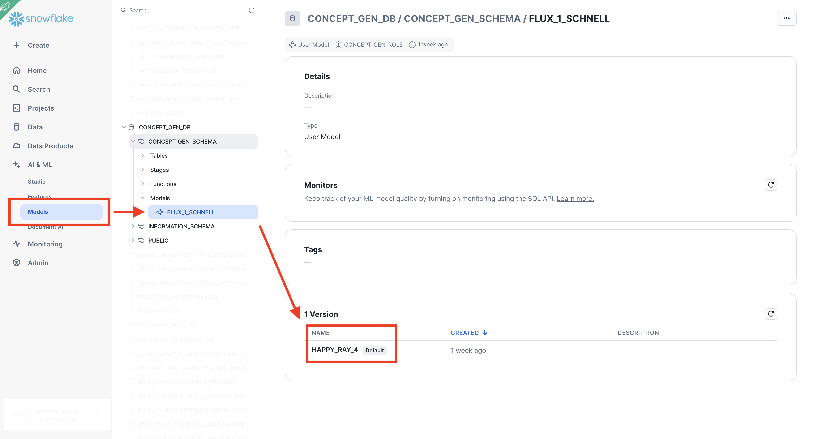
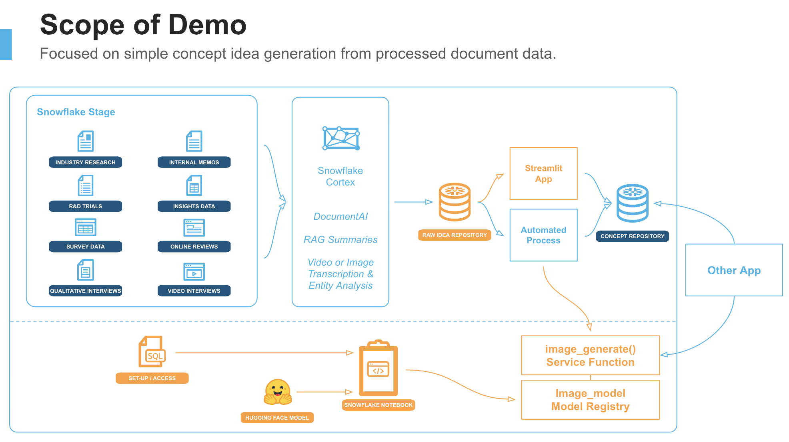

author: Prabhath Nanisetty
id: build-a-visual-idea-generator-with-text-to-image-models
categories: snowflake-site:taxonomy/solution-center/certification/quickstart, snowflake-site:taxonomy/product/ai, snowflake-site:taxonomy/snowflake-feature/model-development, snowflake-site:taxonomy/snowflake-feature/cortex-analyst
language: en
summary: Generate visual ideas with Text2Image LLM models and Streamlit in Snowflake for creative content, marketing assets, and design automation.
environments: web
status: Published 
feedback link: https://github.com/Snowflake-Labs/sfguides/issues
fork repo link: https://github.com/Snowflake-Labs/sfguide-build-a-visual-idea-generator-with-text-to-image-models


# Build a Visual Concept/Idea Generator using a Text-to-Image AI Model
<!-- ------------------------ -->
## Overview 

In this quickstart, you will learn how to easily build a Streamlit application that can generate images inspired by customer feedback or new innovation ideas. 

Generating ideas and concepts is a critical task for brands, manufacturers, and marketers. While the end result of this application may not be to directly use in a marketing campaign, many companies find value in giving this capability to innovation and R&D teams to spawn new ideas and creative thinking.

### Business Scenario
You are a marketing leader tasked with creating ideas for a new commercial innovation (a new campaign that doesn't require heavy R&D) or you are an R&D or Packaging leader that wants to take the rich research from consumers and create automated tools to generate various ideas - mainly to spark ideas with your innovation teams.

The challenge is that in both cases, once you have data and research, it's often hard to communicate these ideas to other parties and teams face 'inspiration blocks'. Having a visual idea generator could unblock these teams while also providing a stream of innovative content ideas.

You want to be able to provide your teams concepts like the one below to spark ideas for marketing campaigns:


This particular concept has a brand logo, a potential idea for Christmas patterns, and a marketing tagline.

Wouldn't it be great if you could generate these automatically and easily? Well, continue on to learn how to do this in Snowflake!

### What You’ll learn

- Using Text 2 Image AI Models and diffusers pipelines to generate images.
- Creating compute pools for GPU access.
- Loading AI Models into Snowflake Model Registry and creating a service that can be called from any other Snowflake runtime object.

### What You’ll Need

- A [GitHub](https://github.com/) Account to access [this repository](https://github.com/Snowflake-Labs/sfguide-build-a-visual-idea-generator-with-text-to-image-models).
- A [Snowflake Account](https://signup.snowflake.com/?utm_source=snowflake-devrel&utm_medium=developer-guides&utm_cta=developer-guides) in a cloud region that supports [Notebooks on Container Runtime](https://docs.snowflake.com/en/user-guide/ui-snowsight/notebooks-on-spcs).
- Access to a role that will allow you to create new roles, databases, schemas, tables, stages, models, services, and create external access integrations.
- Access or permission to create ["large" compute pools](https://docs.snowflake.com/en/sql-reference/sql/create-compute-pool). Due to the GPU VRAM requirements for these models, you may need to contact your Snowflake representative to open access these larger compute pools.

### What You’ll Build 
- A Streamlit in Snowflake application that can be used to generate images from manual input or from a table of ideas.
- A Snowflake model service that can be called from SQL, Snowflake Notebooks, API, or another Streamlit application and can take in input and output an image.


<!-- ------------------------ -->
## About Concept / Idea Generation

### Overview
Many companies have innovation teams that gather input from customers and research the market or industry in order to capture new innovation ideas for their products. A common practice in Retail & Consumer Goods is to understand both disruptive innovation, the development of fundamentally new products, or commercial innovation, the development of new packaging or smaller innovations.

Typical ways to spark idea generation are:
* Survey or Interview customers for ideas and feedback
* Mine customer reviews
* Read industry reports
* Research competitive new products
* Mine data from customer support or call centers

Unfortunately, there is a lot of information across many sources. In these cases, automatically generating visual ideas from all this content may be a faster way for Innovation teams to filter through options.

A number of large companies have implemented such programs and are seeing strong return on investment. One example of this is P&G described in a [Consumer Goods Technology article published Dec 3rd, 2024](https://consumergoods.com/pg-taps-ai-and-automation-faster-smarter-operations).

> 
>
> **From the article:** <br> ...Within content, P&G is using generative AI to generate concept ideas and then test copy against thousands of in-market copy. The automated process cuts down the testing timeline from several months to just a few days and reduces costs. Within the AI, it has created a scoring system for content it is about to launch. <br><br> “That is a very effective way to broaden the mindset of the team — not to write the concept but to give you concept ideas that you might not have thought of,” said CFO Andre Schulten...

Implementing such a program is often complex and requires months of effort, dozens of data systems, complex cloud architecture, and AI/ML experts to stand up models and the corresponding MLOps.

We're going to show you how to create a core part of this program in less than two hours!

### Code Assets
The code for all of the assets we will use today is located on Github [here](https://github.com/Snowflake-Labs/sfguide-build-a-visual-idea-generator-with-text-to-image-models) or you can clone to your computer using the following command: 

``` shell
git clone git@github.com:Snowflake-Labs/sfguide-build-a-visual-idea-generator-with-text-to-image-models sfguide-build-a-visual-idea-generator-with-text-to-image-models
```

### Background on Text 2 Image Models
Text 2 Image models have been available since the mid-2010s, but have become more popular with the introduction of DALL-E models from OpenAI. Much of the innovation to-date has been from open-source models such as Stable Diffusion and newer models like FLUX.1.

Evaluating a Text 2 Image models can be difficult, however, we recommend looking for a model that can represent the typical objects in your innovation program well. For example, if you work on products that typically involve food, look for models that accurately represent colors, shapes, and details. Further, newer models like FLUX.1 handle Text within images very well. These models can also be fine-tuned to your specific needs.

We will be leveraging Huggingface to download all the model assets. For this tutorial, we will be using the FLUX.1-Schnell mode which is a very strong Text-to-Image model that performs well with both image and text generation. This model is released by Black Forest Labs under an Apache 2.0 license.

Read more about [FLUX.1-Schnell on Huggingface](https://huggingface.co/black-forest-labs/FLUX.1-schnell).

Other models that have been tested and confirmed to work are listed below along with the minimum Compute Pool size to create a model service.

* [Stable Diffusion XL](https://huggingface.co/stabilityai/stable-diffusion-xl-base-1.0) - GPU_NV_M or equiv.
* [Stable Diffusion 1.5](https://huggingface.co/stable-diffusion-v1-5/stable-diffusion-v1-5) - GPU_NV_M or equivalent.
* [SmallSD](https://huggingface.co/segmind/small-sd) - GPU_NV_S or equiv.


<!-- ------------------------ -->
## Setup Roles and Permissions

In this section, we will set-up all the required Snowflake objects and permissions for this demo. We will be referencing the `1_set_up.sql` script located [here](https://github.com/Snowflake-Labs/sfguide-build-a-visual-idea-generator-with-text-to-image-models/blob/main/1_set_up.sql).

Each step listed below corresponds to the same section in the script.

### Build Utility Functions
A set of utility functions to help with managing your Snowflake objects, accessing service logs, and turning off services.

Run these commands to see what services, etc are running or suspended. When creating your service, there is a delay until the container is fully loaded or initialized - to check progress we make a call to `SYSTEM$GET_SERVICE_LOGS`.
``` sql
SHOW COMPUTE POOLS;
SHOW EXTERNAL ACCESS INTEGRATIONS;
SHOW NETWORK RULES;
SHOW SERVICES;
SHOW MODELS;
SHOW VERSIONS IN MODEL FLUX_1_SCHNELL;

SELECT SYSTEM$GET_SERVICE_LOGS('CONCEPT_GEN_SERVICE', 0, 'model-inference', 100);
```

After using the services or compute pools, you may want to put them into a SUSPEND state to stop incurring compute charges. For more information about costs of compute pools, see [here](https://docs.snowflake.com/en/developer-guide/snowpark-container-services/accounts-orgs-usage-views#label-compute-pool-cost).

``` sql
ALTER COMPUTE POOL CONCEPT_GEN_POOL_L STOP ALL;
ALTER COMPUTE POOL CONCEPT_GEN_POOL_L SUSPEND;
```

> 
>
> After you complete the demo and create a service. We recommend suspending the service after you are done. The running service will keep a compute pool Active as long as it is running.

### Create Roles and Permissions

In [this step](https://github.com/Snowflake-Labs/sfguide-build-a-visual-idea-generator-with-text-to-image-models/blob/main/1_set_up.sql#L53) we will create a `CONCEPT_GEN_ROLE` that we will use to create the compute engines and other objects for this demo. Note: Snowflake requires roles other than `ACCOUNTADMIN` to create and execute compute pools.

``` sql
USE ROLE ACCOUNTADMIN;
CREATE ROLE IF NOT EXISTS CONCEPT_GEN_ROLE;

GRANT CREATE DATABASE ON ACCOUNT TO ROLE CONCEPT_GEN_ROLE;
GRANT CREATE WAREHOUSE ON ACCOUNT TO ROLE CONCEPT_GEN_ROLE;
GRANT CREATE COMPUTE POOL ON ACCOUNT TO ROLE CONCEPT_GEN_ROLE;
GRANT CREATE INTEGRATION ON ACCOUNT TO ROLE CONCEPT_GEN_ROLE;
GRANT MONITOR USAGE ON ACCOUNT TO ROLE CONCEPT_GEN_ROLE;
GRANT BIND SERVICE ENDPOINT ON ACCOUNT TO ROLE CONCEPT_GEN_ROLE;
GRANT IMPORTED PRIVILEGES ON DATABASE SNOWFLAKE TO ROLE CONCEPT_GEN_ROLE;
GRANT ROLE CONCEPT_GEN_ROLE TO ROLE ACCOUNTADMIN;
```

Next we will create the database, schema, and stages. You may want to upload your own sample brand logo images to the stage so you can reference them in later steps.
``` sql
USE ROLE CONCEPT_GEN_ROLE;
CREATE OR REPLACE DATABASE CONCEPT_GEN_DB;
CREATE OR REPLACE SCHEMA CONCEPT_GEN_SCHEMA;

USE DATABASE CONCEPT_GEN_DB;
USE SCHEMA CONCEPT_GEN_SCHEMA;

CREATE STAGE CONCEPT_GEN_INPUT_IMAGES
  ENCRYPTION = (TYPE = 'SNOWFLAKE_SSE')
  DIRECTORY = (ENABLE = TRUE);
```


<!-- ------------------------ -->
## Create Compute Engines

### Create warehouse and compute pools
First we will create the warehouse to power our Notebook
``` sql
CREATE OR REPLACE WAREHOUSE CONCEPT_GEN_NOTEBOOK_WH
    WAREHOUSE_SIZE = XSMALL
    AUTO_SUSPEND = 120
    AUTO_RESUME = TRUE;
```

Next, we will create a compute pool. Compute pools are special resources, both CPU and GPU, that can be used to run container services. In this demo, there are two compute pools that are created. A Medium pool that can be used to run the full demo inside a Notebook and a Large pool that is needed to run the Notebook and create a service. Text 2 Image models require significant amounts of GPU VRAM to run.

Both compute pools are created and are initially suspended so they will incur no costs until we use them in later steps. Pay attention to the `INSTANCE_FAMILY` parameter, the values show below reference AWS GPU pools and may need to change with other cloud providers as described [in the documentation](https://docs.snowflake.com/en/sql-reference/sql/create-compute-pool#required-parameters).

``` sql
CREATE COMPUTE POOL IF NOT EXISTS CONCEPT_GEN_POOL_M
    MIN_NODES = 1
    MAX_NODES = 1
    INSTANCE_FAMILY = GPU_NV_M
    AUTO_SUSPEND_SECS = 100
    AUTO_RESUME = true
    INITIALLY_SUSPENDED = true
    COMMENT = 'Medium pool for running the concept generator notebook';
    
CREATE COMPUTE POOL IF NOT EXISTS CONCEPT_GEN_POOL_L
    MIN_NODES = 1
    MAX_NODES = 1
    INSTANCE_FAMILY = GPU_NV_L
    AUTO_SUSPEND_SECS = 100
    AUTO_RESUME = true
    INITIALLY_SUSPENDED = true
    COMMENT = 'Large pool for creating a concept generator service';
```


<!-- ------------------------ -->
## Setup Access to External Resources

### Create External Access Integrations
In this step, we will create the External Access Integrations (EAIs) that we will need for our Notebooks and objects to access external resources outside of the Snowflake perimeter.

We will use our `ACCOUNTADMIN` role to create the EAIs and grant usage on them to our `CONCEPT_GEN_ROLE`.

First, we need to be able to access Huggingface servers in order to download model snapshots and configurations. If you encounter an error when trying to access huggingface in later steps, note the URL being accessed and add any new endpoints to the `VALUE_LIST` below and recreate the EAI.

``` sql
USE ROLE ACCOUNTADMIN;

-- Integration 1: Huggingface to download image LLM models
CREATE OR REPLACE NETWORK RULE HUGGINGFACE_NETWORK_RULE
    TYPE = HOST_PORT
    MODE = EGRESS
    VALUE_LIST= ('huggingface.co', 'cdn-lfs.huggingface.co', 'cdn-lfs-us-1.huggingface.co', 'cdn-lfs.hf.co', 'cdn-lfs-us-1.hf.co');

CREATE OR REPLACE EXTERNAL ACCESS INTEGRATION HUGGINGFACE_ACCESS_INTEGRATION
    ALLOWED_NETWORK_RULES = (HUGGINGFACE_NETWORK_RULE)
    ENABLED = true;

GRANT USAGE ON INTEGRATION HUGGINGFACE_ACCESS_INTEGRATION TO ROLE CONCEPT_GEN_ROLE;
```

Next, we will create an EAI to access PyPi, the Python Package Index, the official package repository for the Python programming language. This is specifically to access the `diffusers` and `huggingface_hub` packages that will enable us to download the large text2image models and create model pipelines.

``` sql
-- Integration 2: Pypi for access to key python packages like `diffusers`
CREATE OR REPLACE NETWORK RULE PYPI_NETWORK_RULE
    TYPE = HOST_PORT
    MODE = EGRESS
    VALUE_LIST = ('pypi.org', 'pypi.python.org', 'pythonhosted.org',  'files.pythonhosted.org');

CREATE OR REPLACE EXTERNAL ACCESS INTEGRATION PYPI_ACCESS_INTEGRATION
    ALLOWED_NETWORK_RULES = (PYPI_NETWORK_RULE)
    ENABLED = true;

GRANT USAGE ON INTEGRATION PYPI_ACCESS_INTEGRATION TO ROLE CONCEPT_GEN_ROLE;
```

Finally, as an optional step, you can add your own domains that contain image files - to acquire a brand logo, for instance. In the example below, the EAI access wikimedia.org, the hosting domain for Wikipedia images.

``` sql
-- Integration 3: Wikimedia and githubusercontent for access to images (like a brand logo or something)
CREATE OR REPLACE NETWORK RULE EXTERNAL_LOGO_NETWORK_RULE
    TYPE = HOST_PORT
    MODE = EGRESS
    VALUE_LIST = ('upload.wikimedia.org', 'raw.githubusercontent.com');

CREATE OR REPLACE EXTERNAL ACCESS INTEGRATION EXTERNAL_LOGO_ACCESS_INTEGRATION
    ALLOWED_NETWORK_RULES = (EXTERNAL_LOGO_NETWORK_RULE)
    ENABLED = true;

GRANT USAGE ON INTEGRATION EXTERNAL_LOGO_ACCESS_INTEGRATION TO ROLE CONCEPT_GEN_ROLE;
```

### Create Sample Data
In this demo, we will create a mock dataset of product ideas that have been taken from a combination of magazine articles, customer reviews, and qualitative interviews. 

In a full automated architecture flow, this could be a table created from a RAG-based flow which sources from a document repository and converts the information into a structured table of customer comments. For more information on how to do this, you can read [this blog post(/en/blog/easy-secure-llm-inference-retrieval-augmented-generation-rag-cortex/)] and explore quickstarts [like this one](/en/developers/guides/ask-questions-to-your-own-documents-with-snowflake-cortex-search/).

``` sql
CREATE OR REPLACE TABLE IDEA_REPOSITORY (
    TITLE VARCHAR,
    PRODUCT VARCHAR,
    IDEA_TEXT VARCHAR
);
```

Only one idea is listed below, for others, please reference `1_set_up.sql`.

``` sql
INSERT INTO IDEA_REPOSITORY (TITLE, PRODUCT, IDEA_TEXT)
VALUES
  (
    'DIY Wet Cleaning Wipes',
    'Charisma Paper Towels',
    'Do it yourself wet cleaning wipes. Out of classic wet wipes or disinfecting cloths? Paper towels can easily be transformed into a homemade version of a cleaning cloth. Moisten the disposable sheets with water and a gentle cleaning agent like dish soap, then use the DIY wet wipes to clean countertops or messy faces.'
  ),
  ...
  ...
```


<!-- ------------------------ -->
## Run Demo in Notebook

> 
>
> Basic familiarity with Snowflake Notebooks is recommended. For more information: [Documentation tutorial](https://docs.snowflake.com/en/user-guide/ui-snowsight/notebooks) and [Quickstarts](/en/developers/guides/getting-started-with-snowflake-notebooks/)

In this section, we will do a full end-to-end creation of a concept image all within a Snowflake Notebook! This will allow you to quickly see how this process works. At the end of this step, however, we cannot call the image model from elsewhere, say a Streamlit app or from your own Application - that requires a service which is detailed in the next section.

### What we will create
At the end of this demo, we will create an image that contains a visualization of a product or marketing idea that also contains a brand logo and a marketing tagline.


If you do not have a brand logo to use, you can use the [logo of a fictitious brand called "Charisma"](https://raw.githubusercontent.com/Snowflake-Labs/sfguide-build-a-visual-idea-generator-with-text-to-image-models/refs/heads/main/charisma_paper_towels.png) - located in the Github repo. You can either link to it via URL or upload it to the Snowflake stage you created in the set-up step.

### Run Notebook
For this demo, you can import the Python Notebook labeled `2a_concept_generator_without_service.ipynb` using the Import .pynb File option in the Notebook section of Snowsight.

You will want to select the following options:
* Notebook Location: select the db and schema created in set-up
* Warehouse: select the warehouse created in set-up `CONCEPT_GEN_NOTEBOOK_WH`
* Select Run in Container and select GPU in the first drop down and the compute pool you created in the set-up step. For this demo, you only need a Medium compute pool to follow along.

Once you load the notebook, you will want to access Notebook Settings from the top-right menu and enable all the EAIs in the External Access tab.

There are a few different methods in this Notebook, so hitting Run All is not recommended. The following is the recommended flow:

1. Run all cells in Step 1, the model download may take several minutes.
2. In Step 2, decide if you want to reference an image in a stage by providing the address in the format `@DB_NAME.SCHEMA_NAME.STAGE_NAME/FILENAME.EXT` or an image via a URL. In the latter case, ensure you have the EAI created to access that link. Run the corresponding cells.
3. Optionally, if you want Snowflake Cortex to re-describe the concept which would result in better images, you can run that step as well.
4. Run all the cells in Step 4 and Step 5.
5. Take a look at your visualized idea!


<!-- ------------------------ -->
## Create an Image Model Service

If we don't want to be limited in using a Snowflake Notebook, but instead want to embed this capability into an application or open up for an API, you will need to create a model service that can serve up the model easily.

### Learn more about Model Registry and Services
This part relies on familiarity with MLOps principles, or at least a cursory knowledge of how Model Registries and Services work. For more reading on this, please reference the Snowflake documentation.

[Snowflake Model Registry](https://docs.snowflake.com/en/developer-guide/snowflake-ml/model-registry/overview)

### Run the Notebook
For this demo, you can import the Python Notebook labeled `2b_concept_generator_as_a_service.ipynb` using the Import .pynb File option in the Notebook section of Snowsight. You can follow the same Notebook set-up instructions from the previous tab - please choose a "Large" GPU compute pool this time.

Below is the recommended flow with explanations:

### Download Model and Load into Model Registry
Run all cells in this step. See below for explanations.

1. Install required packages from PyPi, download the FLUX.1-Schnell model, and create a model class that will load the model into memory and provide a callable function for the model `.predict()`.

2. Generate a sample image and run the `.infer_signature()` function to infer the model parameters and specifications; this is a major timesaver versus manual entry.

3. Log the model into the Model Registry and create a new version. Find the model version name in Snowsight from the AI/ML tab > Models > `FLUX_1_SCHNELL`. You will want to write down the name of the model version as you will need to enter this in Step 2. Note: this step may take 20+ minutes.

``` sql
SHOW VERSIONS IN MODEL FLUX_1_SCHNELL;
```


4. Create a second compute pool that will be linked to this service. For Flux.1-Schnell, this must be a Large GPU compute pool with at least 32GB of VRAM.

5. Create a Service using the `.create_service()` function. Note: this step often takes 30+ minutes to complete as a new container image is being created and loaded. To check on service status once the service has started, run the appropriate utility function from the set-up sql file.

### Test the Service within Notebook
Run all cells in this step.

Since we began with a model object and it is already loaded, this step will call `.run()` method and output an image. 

If we are using another access point like a Streamlit app or an external API, we will need to load the model from the Model Registry first. This is covered in the Step 3...

### Test the Service outside Notebook
Run all cells in this step. See below for explanations.

1. Modify the model version obtained from Step 1 with yours as this is needed when using the Snowflake Model Registry.

``` python
MODEL_VERSION = 'HAPPY_RAY_4'  # Get this from Model Registry
```

2. Create a new model object pulled from the Model Registry and generate an image. This is the approach needed if integrating this into a Streamlit app.

``` python
session = get_active_session()
reg = registry.Registry(session=session, database_name=DATABASE_NAME, schema_name=SCHEMA_NAME)
mv = reg.get_model(SELECTED_MODEL).version(MODEL_VERSION)
```

_Optional Steps_

The following steps are optional if you want to also attach a logo and marketing tagline to the image we have generated. This will complete the full flow that you will see in the Streamlit app in the next section.

4. Confirm the location of a logo image via a URL or, if using a file in a Snowflake stage, use the following:

``` python
from io import BytesIO

loc = '@DB_NAME.SCHEMA_NAME.STAGE_NAME/filename.png'
img_raw = session.file.get_stream(loc, decompress=False).read()
img_logo = Image.open(BytesIO(img_raw))
```

5. Using Cortex Complete and the Llama3.1 model from Meta, generate a Marketing Tagline based on the product and concept idea. You can also [select other LLM models](https://docs.snowflake.com/en/sql-reference/functions/complete-snowflake-cortex#arguments) by simply replacing the model name with another.

6. Manipulate the image using python's PIL package to add the logo and expand the canvas with the marketing tagline.

### Ideas to Explore
This flow is what will guide our Streamlit application in the next section. While it is an interesting flow, you may want to modify this to meet your needs. Some thoughtstarters are included below:

* Provide multiple template forms for the resulting image, for example, marketing tagline overlaid or on the right hand side
* The Text2Image model is capable of outputting various image sizes and styles. To keep the demo simple, we have omitted this, however, you can pass additional arguments to the `.pipeline()` function in the `ImageGenerationModel` class in Step 1 such as `width`, `height`, etc. These are detailed [here](https://huggingface.co/docs/diffusers/main/en/api/pipelines/flux#diffusers.FluxPipeline.__call__.prompt).


<!-- ------------------------ -->
## Create a Streamlit Application

> 
>
> Basic familiarity with Streamlit in Snowflake is recommended. For more information: [Documentation tutorial](https://docs.snowflake.com/en/developer-guide/streamlit/getting-started) and [Quickstarts](/en/developers/guides/tasty-bytes-price-optimization-using-snowflake-notebooks-and-streamlit/)

In this section, we will create a Streamlit application that will follow a similar flow to the Notebook path in the last step, but with an easy-to-use UI for non-technical users. We will be referencing the `3_streamlit_app.py` script located [here](https://github.com/Snowflake-Labs/sfguide-build-a-visual-idea-generator-with-text-to-image-models/blob/main/3_streamlit_app.py) and can be loaded into a Streamlit app using Snowsight.

### Parameter Definitions
This section will leverage most of the parameters from the previous notebook, including the model version name and your choice of LLM model supported by Cortex Complete.

A user agent has been defined in this section. When accessing images from a URL, some sites disable hotlinking unless there is a custom user agent that provides additional information (e.g. Wikimedia)

### Core Functions
These functions run the various components of the process that you reviewed in Step 3 of the previous Notebook. The only major difference is that we are leveraging Cortex Analyst to convert a submitted idea to a set of artist instructions. This will generate a better image from a text 2 image model.

### Image Function
Simple image functions that handle type and color transformations

### Define the Streamlit UI
The UI leverages a tabbed interface to control various options. For this demo, we have intentionally omitted the selection of a model and additional parameters that can be passed to a text2image pipeline, such as width & height.

A user can easily select a logo to apply, choose from an existing idea repository table or provide a new idea, and generate a model quickly.

After an image has been generated all of the inputs as well as the output are shown.

### Troubleshooting
* If you have created as service and then suspended it, you may encounter errors in Streamlit initially. Simply wait until the service has been fully resumed before trying again. You can check on the progress of the service using the functions described in the set-up section.


<!-- ------------------------ -->
## Further Considerations

This quickstart help you to quickly create a service and an accompanying Streamlit app for non-technical users to use. However, there are many other modalities for Idea generation that will be discussed below.



The orange areas highlighted in the image above represent the scope of this quickstart, however, for a full idea generation program, you may also want to consider the following:

* **Automatically process unstructured data from documents.** Leverage information from industry reports, customer interviews, and reviews to develop the idea repository that we mocked in this quickstart. For this, you can process new documents with Cortex capabilities like Analyst and Search to automatically distill the information. See this [Quickstart](/en/developers/guides/ask-questions-to-your-own-documents-with-snowflake-cortex-search/) for ideas.

* **Continuously generate concept images from new inbound ideas.** Once ideas are flowing into your idea repository, you can automatically kick off image generation using Dynamic Tables and Scheduled Tasks. See this [Quickstart](/en/developers/guides/getting-started-with-dynamic-tables/) for more information. This image database could be powered by a Streamlit app which exposes ideas across different topic areas for an end-user.

* **Create Automated Review & Testing flows to get feedback about concepts.** Connect your image database with an activation target, such as a survey, to automatically activate to gather feedback or measure performance. For this step, you may want to enable [Cortex Guard](https://docs.snowflake.com/en/user-guide/snowflake-cortex/llm-functions#label-cortex-llm-complete-cortex-guard) to ensure that input concepts or output images follow your safety and privacy policies.


<!-- ------------------------ -->
## Conclusion And Resources

You have just built an entire idea generation engine from scratch and the best part is that you did not need to manage any complex cloud infrastructure other than setting up compute pools or custom configuring APIs to external LLMs. Snowflake took care of all that complexity for you!

### Cost Considerations
It will be important to understand how costs are calculated when leveraging Snowflake tools like Container Runtime Notebooks, Services, and Compute Pools. For more information, consult our [Cost Management Guide](https://docs.snowflake.com/en/user-guide/cost-understanding-overall).

### What You Learned
- Creating execution objects such as Warehouses and Compute Pools
- Loading a Model into the Model Registry
- Creating a Service from an existing Model
- Calling a Service from a Notebook and a Streamlit App
- Creating a UI with Streamlit to address a specific use

### Related Resources
- [Link to Github repo](https://github.com/Snowflake-Labs/sfguide-build-a-visual-idea-generator-with-text-to-image-models)
