id: build-agentic-application-in-snowflake
summary: In this hands-on lab, you'll learn how to build a Data Agent using Snowflake Cortex AI that can intelligently respond to questions by reasoning over both structured and unstructured data.
environments: web
status: Published
feedback link: <https://github.com/Snowflake-Labs/sfguides/issues>
tags: Getting Started, Data-Science-&-Ai, Featured
authors: Dash Desai, Carlos Carrero

# Build Agentic Application with Anthropic In Snowflake
<!-- ------------------------ -->

## Overview

Duration: 4

In this guide, you'll learn how to build a Data Agent using Snowflake Cortex AI that can intelligently respond to questions by reasoning over both structured and unstructured data.

We'll use a custom dataset focused on bikes and skis. This dataset is intentionally artificial, ensuring that no external LLM has prior knowledge of it. This gives us a clean and controlled environment to test and evaluate our data agent. By the end of the session, you'll have a working AI-powered agent capable of understanding and retrieving insights across diverse data types — all securely within Snowflake.

### What You Will Learn

- How to setup your environment using Git integration and Snowflake Notebooks 
- How to work with semantic models and setup Cortex Analyst for structured data
- How to setup Cortext Search for unstructured data like PDFs and images
- How to use Cortex Agents REST API that uses these tools in a Streamlit application

### What You Will Build

A Data Agent packaged in a Streamlit application that can intelligently respond to questions by reasoning over both structured and unstructured data.

### What You Will Need

* A Snowflake account as described specifically in [Step 2 **Snowflake Trial Account**](https://quickstarts.snowflake.com/guide/build-agentic-application-in-snowflake/index.html?index=..%2F..index#1).

<!-- ------------------------ -->
## Snowflake Trial Account
Duration: 5

To complete this lab, you'll need to create a Snowflake account.

1. Click on this link to create a [free trial account](https://bit.ly/devdaybootcamp2025).

2. Complete the first page of the form on the page.

3. On the next section of the form, be sure to set the Snowflake edition to **Enterprise (Most popular)**).

4. Select **AWS – Amazon Web Services** as the cloud provider.

5. Select **US West (Oregon)** as the region.

6. Complete the rest of the form and click **Get started**.


## Setup 
<!-- ------------------------ -->

Duration: 5

In Snowsight, [create a SQL Worksheet](https://docs.snowflake.com/en/user-guide/ui-snowsight-worksheets-gs?_fsi=THrZMtDg,%20THrZMtDg&_fsi=THrZMtDg,%20THrZMtDg#create-worksheets-from-a-sql-file). Then, copy/paste the following statements and execute them from top to bottom. 

``` sql
CREATE or replace DATABASE DASH_CORTEX_AGENTS_SUMMIT;

CREATE OR REPLACE API INTEGRATION git_api_integration
  API_PROVIDER = git_https_api
  API_ALLOWED_PREFIXES = ('https://github.com/Snowflake-Labs/')
  ENABLED = TRUE;

CREATE OR REPLACE GIT REPOSITORY git_repo
    api_integration = git_api_integration
    origin = 'https://github.com/Snowflake-Labs/sfguide-build-data-agents-using-snowflake-cortex-ai';

-- Make sure we get the latest files
ALTER GIT REPOSITORY git_repo FETCH;

-- Setup stage for  Docs
create or replace stage docs ENCRYPTION = (TYPE = 'SNOWFLAKE_SSE') DIRECTORY = ( ENABLE = true );

-- Copy the docs for bikes
COPY FILES
    INTO @docs/
    FROM @DASH_CORTEX_AGENTS_SUMMIT.PUBLIC.git_repo/branches/main/docs/;

ALTER STAGE docs REFRESH;
```

> aside positive
> IMPORTANT NOTE: As a result of this integration, all the PDFs and image files we are going to be using would have been copied into your Snowflake account. 

## Run Snowflake Notebook
<!-- ------------------------ -->

Duration: 30

We will use Snowflake Notebook to setup the tools that will be used by Snowflake Cortex Agents.

Let's get started!

On the left hand navigation menu, select Databases **DASH_CORTEX_AGENTS_SUMMIT** » **PUBLIC** » **Git Repositories** » **GIT REPO** and select `setup_tools.ipynb` Notebook that is already available in your Snowflake account as shown below.

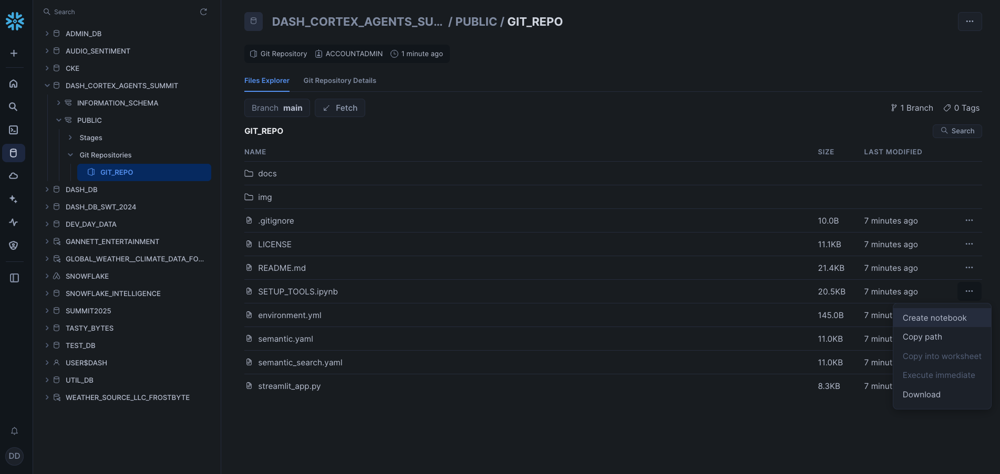

Give it a name and select other options including **DASH_CORTEX_AGENTS_SUMMIT** and **PUBLIC** for location and **Run on warehouse** for Python environment as shown below.

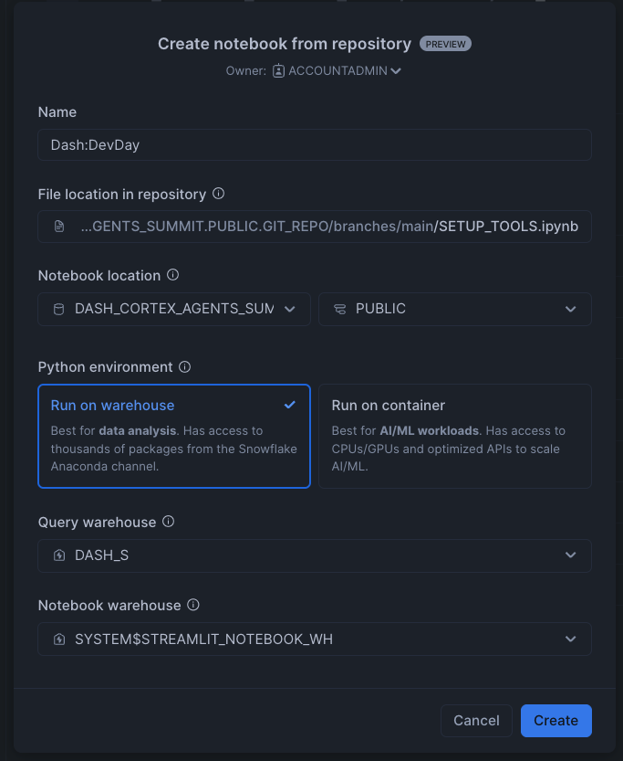

> aside positive
> IMPORTANT NOTE: Run through all the cells in the Snowflake Notebook before proceeding.

## Explore Semantic Model

The [semantic model](https://docs.snowflake.com/en/user-guide/snowflake-cortex/cortex-analyst/semantic-model-spec) maps business terminology to the structured data and adds contextual meaning. It allows [Cortex Analyst](https://docs.snowflake.com/en/user-guide/snowflake-cortex/cortex-analyst) to generate the correct SQL for a question asked in natural language.

### Open the semantic model

On the left hand navigation menu, click on **AI & ML** » **Studio** and select **Cortex Analyst**

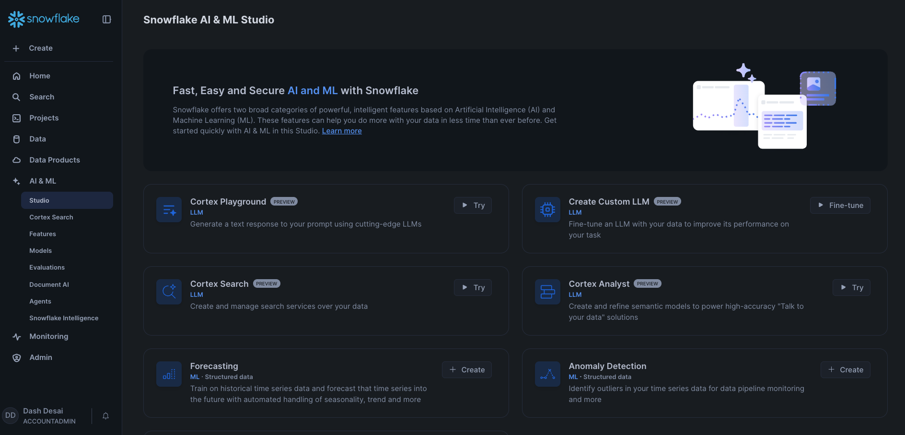

Select the existing `semantic.yaml` file located in **DASH_CORTEX_AGENTS_SUMMIT** » **PUBLIC** » **SEMANTIC_FILES** as shown below.

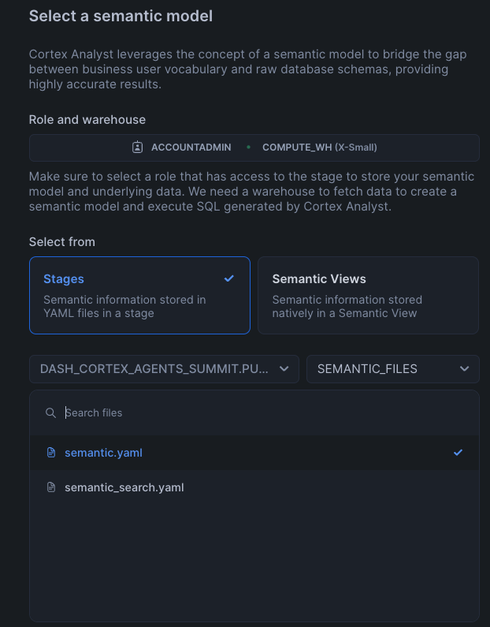

### Test the semantic model

Let's ask these analytical questions to test the semantic file:

- **What is the average revenue per transaction per sales channel?**
- **What products are often bought by the same customers?**

### Cortex Analyst and Cortex Search Integration

Using Cortex Analyst integration with Cortex Search, we can improve the retrieval of possible values of a column without listing them all in the semantic model file. Let's try it as example for the ARTICLE NAMES.

Click on **DIM_ARTICLE -> Dimensions** and edit **ARTICLE_NAME**. Here you will see that some sample values have been provided.

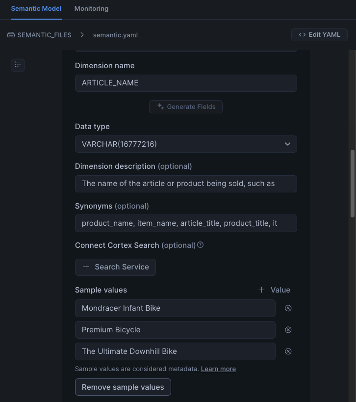

Let's see what happens if we ask the following question:

- **What are the total sales for the carvers?**

At this point, you may see this response:

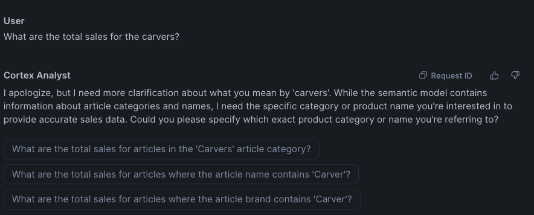

Now let's see what happens when we integrate the **ARTICLE_NAME** dimension with the Cortex Search Service we created in the Notebook (**_ARTICLE_NAME_SEARCH**). If you haven't run it already in the Notebook, execute this in the same SQL worksheet as you opened/created before:

```SQL
CREATE OR REPLACE CORTEX SEARCH SERVICE _ARTICLE_NAME_SEARCH
  ON ARTICLE_NAME
  WAREHOUSE = COMPUTE_WH
  TARGET_LAG = '1 hour'
  EMBEDDING_MODEL = 'snowflake-arctic-embed-l-v2.0'
AS (
  SELECT
      DISTINCT ARTICLE_NAME
  FROM DIM_ARTICLE
);
```

Back in the Semantic model UI:

1) Remove the sample values provided
2) Click on **+ Search Service** and add **_ARTICLE_NAME_SEARCH**

It should look like this:

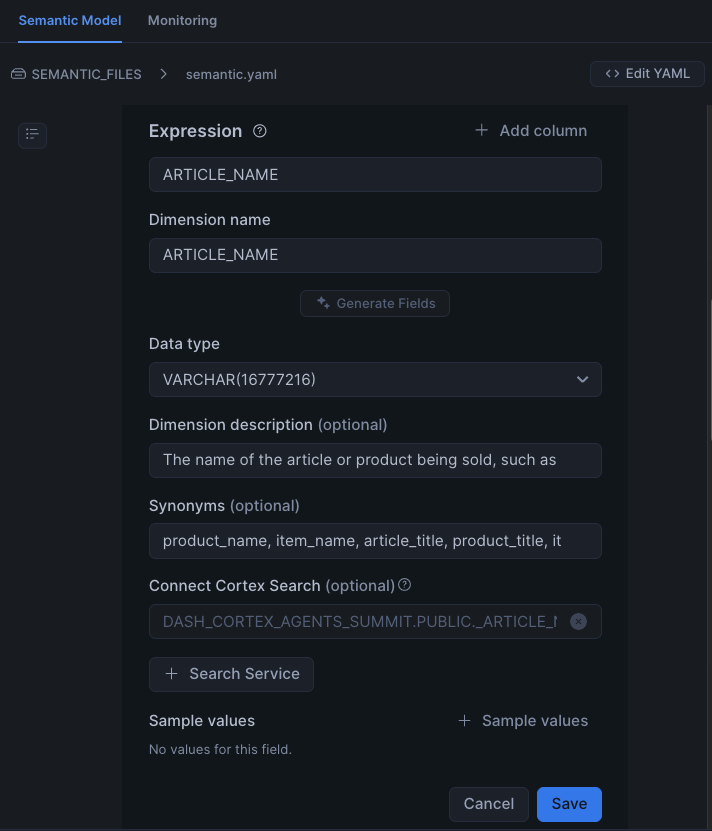

Click on **Save**, also save your semantic file (top right) and ask the same question again:

- **What are the total sales for the carvers?**

Notice that now Cortex Analyst is able to provide the right answer because of the Cortex Search integration, we asked for "Carvers" but found that the correct article to ask about is "Carver Skis":

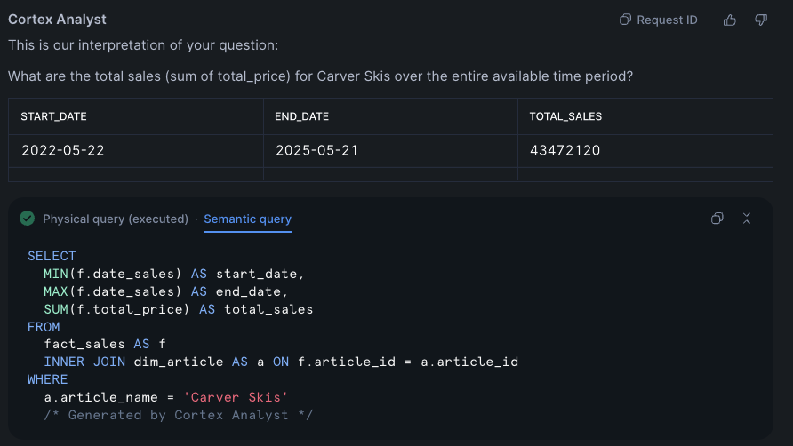

## Streamlit Application
<!-- ------------------------ -->

Duration: 10

Now that we have the tools ready, we can create a Streamlit app that puts it all together using [Cortex Agents API](https://docs.snowflake.com/en/user-guide/snowflake-cortex/cortex-agents) API.

We are going to leverage the code from [streamlit_app.py](https://github.com/Snowflake-Labs/sfguide-build-data-agents-using-snowflake-cortex-ai/blob/main/streamlit_app.py)

On the left hand navigation menu, click on **Projects** » **Streamlit** » **Streamlit App** on the top right and select **Create from repository** as shown below.

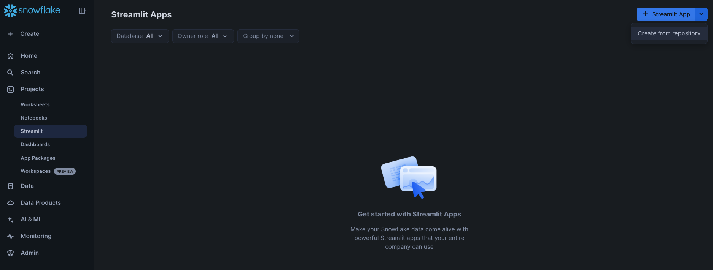

Under **File location in repository** click on **Select main file** 

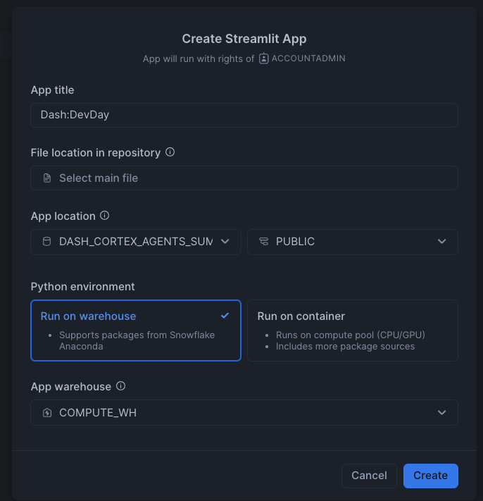

Select the **streamlit_app.py** file located in **DASH_CORTEX_AGENTS_SUMMIT** » **PUBLIC** » **Git Repositories** » **GIT REPO** and click on **Select file**.

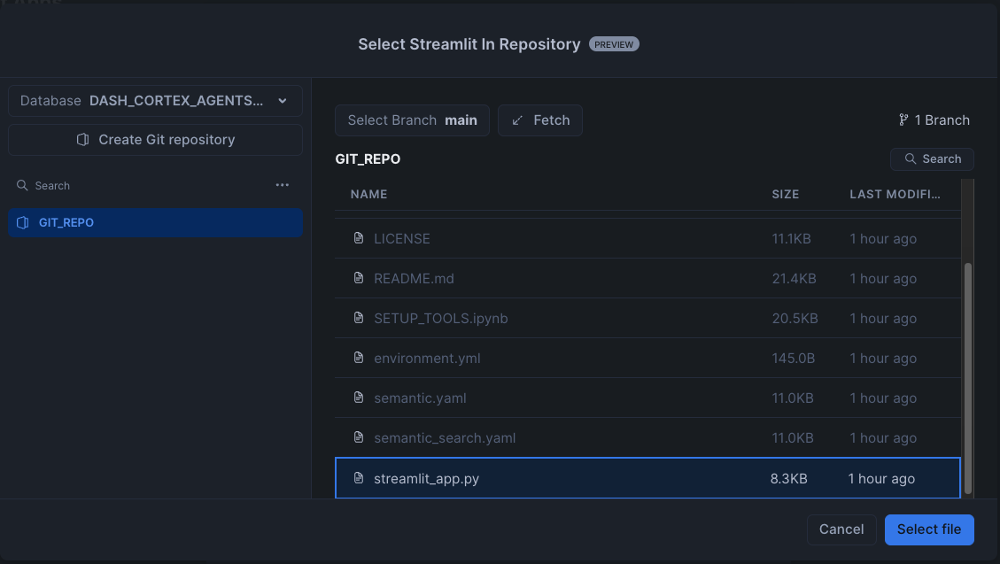

Give it a name and select other options including **DASH_CORTEX_AGENTS_SUMMIT** and **PUBLIC** for location and **Run on warehouse** for Python environment as shown below.

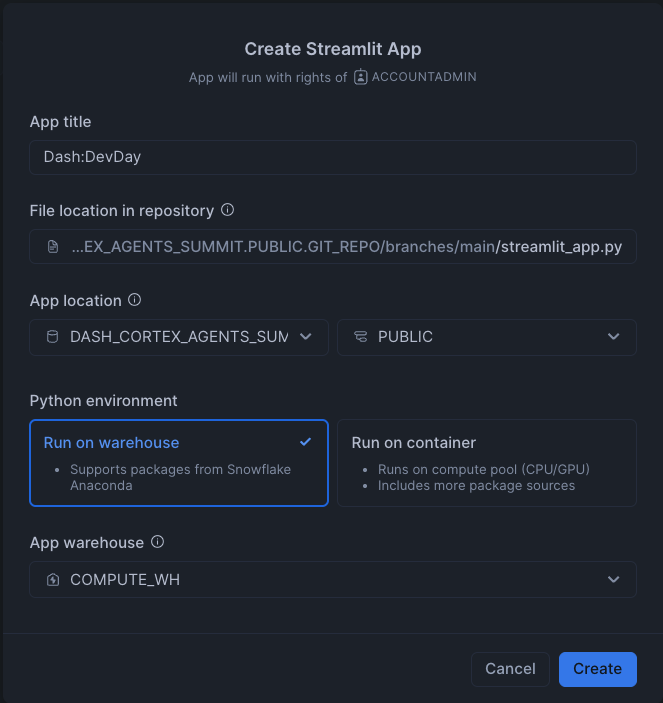

## Run Application
<!-- ------------------------ -->

Duration: 10

Open the Streamlit app and let's check it out.

### Unstructured Data 

These are questions where the answers can be found in the PDF documents.

- **What is the guarantee of the premium bike?** or **What is the warranty on the premium bike?**

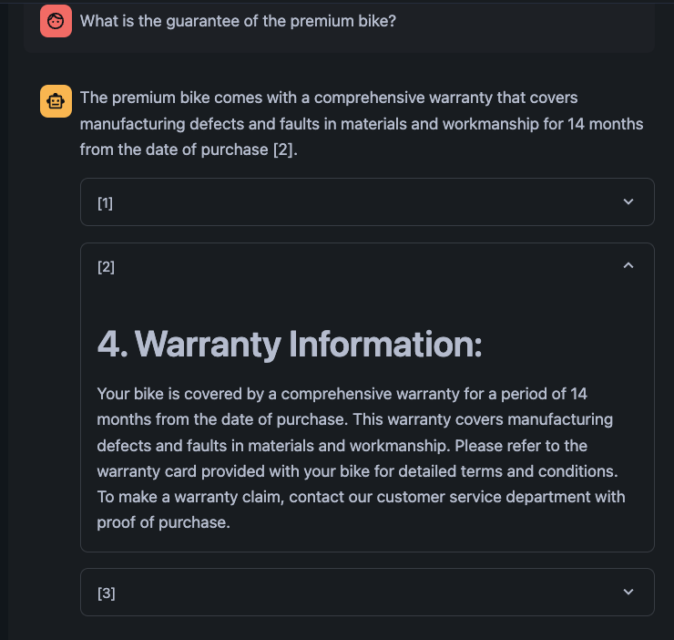

The code contains a *display_citations()* function as an example to show what pieces of information the Cortex Agent used to answer the question. In this case, we can see how it cites the warranty information extracted from the PDF file. 

Let's try these other questions.

- **What is the length of the carver skis?**

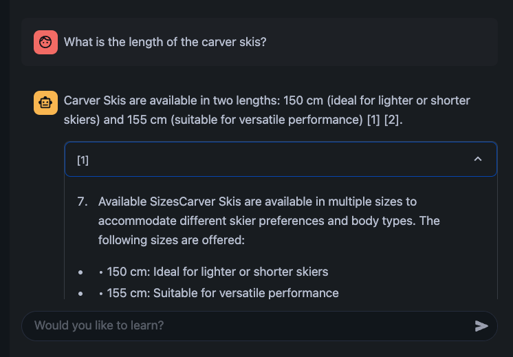

Since we have processed images, the extracted descriptions can also be used by Cortex Agents to answer questions. Here's one example:

- **Is there any brand in the frame of the downhill bike?**

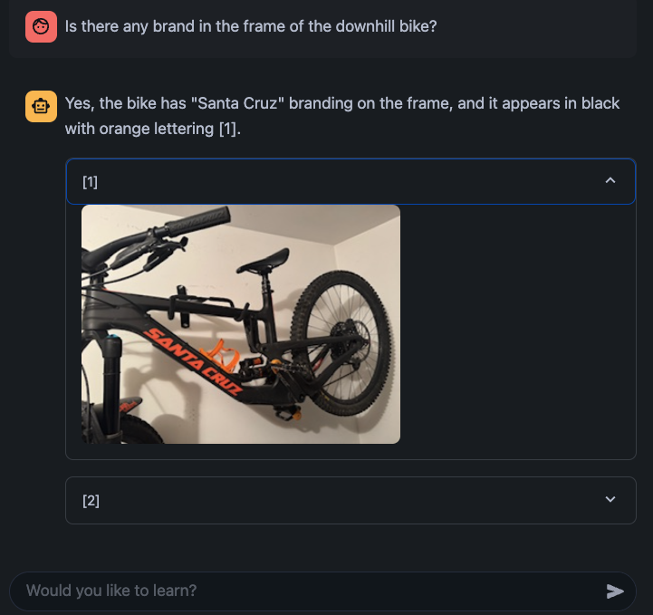

Fell free to explore the PDF documents and image files to ask your own questions.

### Structured Data

These are analytical questions where the answers can be found in structured data stored in Snowflake tables.

- **How many carvers are we selling per year in the North region?**

Notice that for this query, all 3 tables are used. Also note that the Cortex Search integration in the semantic model understands that the article name is "Carver Skis".

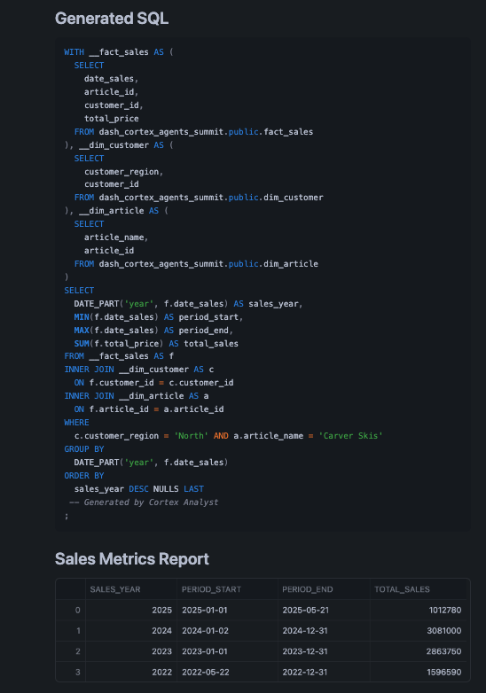

Let's try these other questions.

- **How many infant bikes are we selling per month?**
- **What are the top 5 customers buying the carvers?**

### Cortex Agents

When calling the [Cortex Agents](https://docs.snowflake.com/en/user-guide/snowflake-cortex/cortex-agents) API, we define the tools the Agent can use in that call. You can read the simple [Streamlit App](https://github.com/Snowflake-Labs/sfguide-build-data-agents-using-snowflake-cortex-ai/blob/main/streamlit_app.py) you set up to understand the basics before trying to create something more elaborat and complex.

We define the **API_ENDPOINT** for the agent, and how to access the different tools its going to use. In this lab, we have two Cortex Search services to retrieve information from PDFs about bikes and skis, and one Cortex Analyst service to retrieve analytical information from Snowflake tables. The Cortex Search services were created in the Notebook and the Cortex Analyst uses the semantic model we verified earlier.

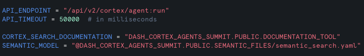

All of these services are added to the payload sent to the Cortex Agents API. We also provide the model we want to use to build the final response, the tools to be used, and any specific instructions for generating the response.

## Conclusion And Resources
<!-- ------------------------ -->

Duration: 1

Congratulations! You've learned how to securely build data agents and agentic application in Snowflake.

### What You Learned

- How to setup your environment using Git integration and Snowflake Notebooks 
- How to work with semantic models and setup Cortex Analyst for structured data
- How to setup Cortext Search for unstructured data like PDFs and images
- How to use Cortex Agents REST API that uses these tools in a Streamlit application

### Related Resources

- [GitHub repo](https://github.com/Snowflake-Labs/sfguide-build-data-agents-using-snowflake-cortex-ai)
- [Cortex Agents](https://docs.snowflake.com/en/user-guide/snowflake-cortex/cortex-agents)
- [Cortex Analyst](https://docs.snowflake.com/en/user-guide/snowflake-cortex/cortex-analyst)
- [Cortex Search](https://docs.snowflake.com/en/user-guide/snowflake-cortex/cortex-search/cortex-search-overview)
- [Integrate Cortex Agents with Slack](https://quickstarts.snowflake.com/guide/integrate_snowflake_cortex_agents_with_slack/index.html)
- [Integrate Cortex Agents with Microsoft Teams](https://quickstarts.snowflake.com/guide/integrate_snowflake_cortex_agents_with_microsoft_teams/index.html)
- [Integrate Cortex Agents with Zoom](https://quickstarts.snowflake.com/guide/integrate-snowflake-cortex-agents-with-zoom/index.html)
- [Integrate Cortex Agents with React](https://quickstarts.snowflake.com/guide/getting_started_with_snowflake_agents_api_and_react/index.html)
