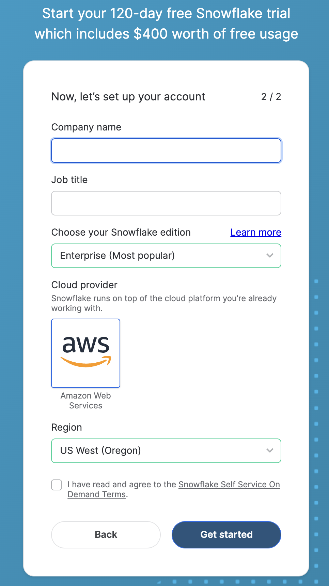

id: build-agentic-application-in-snowflake
categories: snowflake-site:taxonomy/solution-center/certification/quickstart, snowflake-site:taxonomy/product/ai, snowflake-site:taxonomy/snowflake-feature/unstructured-data-analysis, snowflake-site:taxonomy/snowflake-feature/cortex-llm-functions
language: en
summary: Build a Data Agent for Snowflake Intelligence using Snowflake Cortex AI for autonomous task execution and intelligent workflows.
environments: web
status: Published
feedback link: <https://github.com/Snowflake-Labs/sfguides/issues>
fork repo link: https://github.com/Snowflake-Labs/sfguide-build-data-agents-using-snowflake-cortex-ai
authors: Dash Desai


# Build Agentic Application with Anthropic In Snowflake
<!-- ------------------------ -->

## Overview

In this guide, you'll learn how to build a data agent for Snowflake Intelligence using Snowflake Cortex AI that can intelligently respond to questions by reasoning over both structured and unstructured data. Data agents are specialized AI entities configured within Snowflake Intelligence. Data teams define their scope, what data sources they can access, their purpose (e.g., "Sales Performance Agent"), and what actions they can perform. They are designed to interpret user questions within their specific domain, securely analyze the relevant data and generate responses.

We'll use a custom dataset focused on bikes and skis. This dataset is intentionally artificial, ensuring that no external LLM has prior knowledge of it. This gives us a clean and controlled environment to test and evaluate our data agent. By the end of the session, you'll have a working AI-powered agent capable of understanding and retrieving insights across diverse data types — all securely within Snowflake.

### What is Snowflake Intelligence? 

Snowflake Intelligence is an Enterprise Intelligence Agent that provides every user with the ability to answer complex questions in natural language, and puts insights at every user’s fingertips. With a single question, you can get comprehensive insights across your business data. It moves beyond the “what” to the critical “why” with an always-available thought partner at their fingertips that can facilitate deep research and suggest solutions to previously difficult and time-consuming business problems.

Snowflake Intelligence removes the barriers to insights, enabling users to understand the cross-sections of their data and test assumptions with a shared understanding of the data needed to make impactful business decisions.

### What You Will Learn

- How to setup your environment using Git integration and Snowflake Notebooks 
- How to work with semantic models and setup Cortex Analyst for structured data
- How to setup Cortex Search for unstructured data like PDFs and images
- How to use these tools in Snowflake Intelligence

### What You Will Build

A data agent that can intelligently respond to questions by reasoning over both structured and unstructured data.

### What You Will Need

* Access to a [Snowflake account](https://bit.ly/devdaybootcamp2025) as described in the next step.

<!-- ------------------------ -->
## Snowflake Trial Account

To complete this lab, you'll need to create a Snowflake account.

1. Click on this link to create a [free trial account](https://bit.ly/devdaybootcamp2025).

2. Complete the first page of the form on the page.

3. On the next section of the form, be sure to set the Snowflake edition to **Enterprise (Most popular)**).

4. Select **AWS – Amazon Web Services** as the cloud provider.

5. Select **US West (Oregon)** as the region.

6. Complete the rest of the form and click **Get started**.



## Setup 
<!-- ------------------------ -->


* Clone [GitHub repository](https://github.com/Snowflake-Labs/sfguide-build-data-agents-using-snowflake-cortex-ai).

* In Snowsight, [create a SQL Worksheet](https://docs.snowflake.com/en/user-guide/ui-snowsight-worksheets-gs?_fsi=THrZMtDg,%20THrZMtDg&_fsi=THrZMtDg,%20THrZMtDg#create-worksheets-from-a-sql-file) and open [setup.sql](https://github.com/Snowflake-Labs/sfguide-build-data-agents-using-snowflake-cortex-ai/blob/main/setup.sql) to execute all statements in order from top to bottom.

This SQL script sets up roles, databases, schemas, integrations, and stages in Snowflake. Here’s a summary of the objects being created:

```text
Role:
  - snowflake_intelligence_admin (Privileges: create integrations, databases, use warehouse)

Databases:
  - snowflake_intelligence
  - dash_cortex_agents

Schemas:
  - snowflake_intelligence.agents
  - dash_cortex_agents.data

Privileges:
  - Grants to allow agent creation on the snowflake_intelligence.agents schema

API Integration:
  - git_api_integration (For accessing GitHub via HTTPS)

Git Repository:
  - git_repo (Links to a specific GitHub repository)

Stage:
  - docs (With Snowflake SSE encryption and directory enabled)

Data Copy:
  - Copies files from the Git repo into the docs stage

Notification Integration:
  - email_integration

Stored Procedure:
  - send_email
```
 
> NOTE: Switch your user role in Snowsight to **SNOWFLAKE_INTELLIGENCE_ADMIN**.

## Create Tools
<!-- ------------------------ -->


We will use [Snowflake Notebook](https://docs.snowflake.com/en/user-guide/ui-snowsight/notebooks) to set up the [Cortex Analyst](https://docs.snowflake.com/en/user-guide/snowflake-cortex/cortex-analyst) and [Cortex Search](https://docs.snowflake.com/en/user-guide/snowflake-cortex/cortex-search/cortex-search-overview) tools that will be used by the data agent in Snowflake Intelligence.

Let's get started!

* Browse to <a href="https://app.snowflake.com/_deeplink/#/data/databases?utm_source=snowflake-devrel&utm_medium=developer-guides&utm_campaign=-us-en-all&utm_content=app-build-agentic-application-in-snowflake&utm_cta=developer-guides-deeplink" class="_deeplink">Catalog » Database Explorer</a>
* Select **DASH_CORTEX_AGENTS** » **DATA** » **Git Repositories** » **GIT REPO**
* Right click on `SETUP_TOOLS.ipynb`, then click on "..." and select **Create notebook**.
* Give the Notebook a name
* Select Notebook location as **DASH_CORTEX_AGENTS** and **DATA**
* Sekect runtime as **Run on warehouse**
  
> IMPORTANT NOTE: Run through all the cells in the Snowflake Notebook before proceeding. It may take 3-5 minutes to run through everything.

## Explore Semantic Model

The [semantic model](https://docs.snowflake.com/en/user-guide/snowflake-cortex/cortex-analyst/semantic-model-spec) maps business terminology to the structured data and adds contextual meaning. It allows [Cortex Analyst](https://docs.snowflake.com/en/user-guide/snowflake-cortex/cortex-analyst) to generate the correct SQL for a question asked in natural language.

### Open the semantic model

* On the left hand navigation menu, open <a href="https://app.snowflake.com/_deeplink/#/cortex/analyst?utm_source=snowflake-devrel&utm_medium=developer-guides&utm_campaign=-us-en-all&utm_content=app-build-agentic-application-in-snowflake&utm_cta=developer-guides-deeplink" class="_deeplink">**AI & ML** >> **Cortex Analyst**</a>

* Click on the existing `semantic.yaml` file located in **DASH_CORTEX_AGENTS** » **DATA** » **SEMANTIC_FILES**.

### Test the semantic model

Let's ask these analytical questions to test the semantic file:

- **What is the average revenue per transaction per sales channel?**
- **What products are often bought by the same customers?**

Cortex Analyst should successfully generate and execute complex SQL to answer these questions.

### Cortex Analyst and Cortex Search Integration

Using Cortex Analyst integration with Cortex Search, we can improve the retrieval of possible values of a column without listing them all in the semantic model file. Let's try it as an example for the ARTICLE NAMES.

* Click on **DIM_ARTICLE -> Dimensions** and edit **ARTICLE_NAME**. Here you will see that some sample values have been provided.

Let's see what happens if we ask this question.

#### - *Q. What are the total sales for the carvers?*

At this point, you may see this response:

`I apologize, but I'm not sure what 'carvers' refers to in the context of this data. The term 'carvers' could potentially refer to a specific article name, brand, or category, but it's not clear from your question which dimension you're referring to or if this value exists in our sales data.`

Now let's integrate the **ARTICLE_NAME** dimension with the **DASH_CORTEX_AGENTS.DATA.ARTICLE_NAME_SEARCH** Cortex Search Service we created in the Notebook.

* Remove the sample values provided
* Click on **+ Search Service** and add **DASH_CORTEX_AGENTS.DATA >> ARTICLE_NAME_SEARCH**
* Click on **Save**, also save your semantic file (top right)

Now let's ask the same question again.

#### - *Q. What are the total sales for the carvers?*

Notice that Cortex Analyst is now able to provide the right answer because of the Cortex Search integration. Also note that we asked for "Carvers", but the literal article name is "Carver Skis." This enhances the Agent’s ability to handle imprecise or partially correct user input.

## Snowflake Intelligence
<!-- ------------------------ -->

Now that we have the tools ready, we can create a Data Agent for Snowflake Intelligence.

### Create Agent

An agent is an intelligent entity within Snowflake Intelligence that acts on behalf of the user. Agents are configured with specific tools and orchestration logic to answer questions and perform tasks on top of your data. 

Note that you can create multiple agents for various use cases and/or business teams in your organization. 

* In Snowsight, on the left hand navigation menu, select <a href="https://app.snowflake.com/_deeplink/#/agents?utm_source=snowflake-devrel&utm_medium=developer-guides&utm_campaign=-us-en-all&utm_content=app-build-agentic-application-in-snowflake&utm_cta=developer-guides-deeplink" class="_deeplink">**AI & ML** >> **Agents**</a> 
* On the top right, click on **Create agent**
     - Select **Create this agent for Snowflake Intelligence**
     - Schema: **SNOWFLAKE_INTELLIGENCE.AGENTS**
     - Agent object name: **Dash_AI**
     - Display name: **Dash//AI**
* Select the newly created **Dash_AI** agent and click on **Edit** on the top right corner and make the following updates.

### Add Instructions

Add the following starter questions under **Sample questions**:

- Show me monthly sales revenue trends by product category over the past 2 years.
- What is the guarantee of the premium bike?
- What is the length of the carver skis?
- Is there any brand in the frame of the downhill bike?
- How many carvers are we selling per year in the North region?

### Add Tools

Tools are the capabilities an agent can use to accomplish a task. Think of them as the agent's skillset and note that you can add one or more of each of the following tools.

* Tools
  - **Cortex Analyst**
    - Click on **+ Add**
        - Select Semantic model file **DASH_CORTEX_AGENTS.DATA.SEMANTIC_FILES** >> **semantic.yaml**
        - Name: Sales_Data
        - Description: *This retail sales analytics semantic model from DASH_CORTEX_AGENTS.DATA database provides comprehensive sales transaction analysis capabilities through a star schema connecting customer demographics, product catalog, and sales facts. The model enables detailed reporting on sales performance across multiple dimensions including customer segments (Premium, Regular, Occasional), product categories (Bikes, Ski Boots, Skis), sales channels (Online, In-Store, Partner), and time periods. The central FACT_SALES table captures transaction details including quantities, pricing, and promotional information, while linking to DIM_CUSTOMER for demographic analysis and DIM_ARTICLE for product performance insights. The system supports advanced product search functionality and is specifically designed to answer sales-related questions about product performance, customer behavior, and revenue analysis while excluding product specifications or usage information.*
        - Warehouse: **COMPUTE_WH**
        - Query timeout (seconds): 60

  - **Cortex Search Services**
    - Click on **+ Add**
        - Search service: **DASH_CORTEX_AGENTS.DATA.DOCS**
        - ID column: CHUNK_INDEX
        - Title column: RELATIVE_PATH
        - Name: Docs

  - **Custom tools**
    - Click on **+ Add**
      - Resource type: procedure
      - Database & Schema: **DASH_CORTEX_AGENTS.DATA**
      - Custom tool identifier: **DASH_CORTEX_AGENTS.DATA.SEND_EMAIL()**
      - Name: Send_Email
      - Warehouse: **COMPUTE_WH**
      - Query timeout (seconds): 60
      - Parameter: body
        - Description: *Use HTML-Syntax for this. If the content you get is in markdown, translate it to HTML. If body is not provided, summarize the last question and use that as content for the email.*
      - Parameter: recipient_email
        - Description: *If the email is not provided, send it to **YOUR_EMAIL_ADDRESS_GOES_HERE***.
      - Parameter: subject
        - Description: *If the subject is not provided, use "Snowflake Intelligence"*.

* Orchestration instructions: *Whenever you can answer visually with a chart, always choose to generate a chart even if the user didn't specify to.*

* Access: SNOWFLAKE_INTELLIGENCE_ADMIN

> NOTE: On the top right corner, click on **Save** to save the newly updated **Dash_AI** agent.

### Launch Snowflake Intelligence

Open <a href="https://app.snowflake.com/_deeplink/#/ai?utm_source=snowflake-devrel&utm_medium=developer-guides&utm_campaign=-us-en-all&utm_content=app-build-agentic-application-in-snowflake&utm_cta=developer-guides-deeplink" class="_deeplink">Snowflake Intelligence</a> and make sure you're signed into the right account. If you're not sure, click on your name in the bottom left >> **Sign out** and sign back in. Also note that your role should be set to **SNOWFLAKE_INTELLIGENCE_ADMIN** and your agent should be set to Dash//AI.

Now, let's ask the following questions.

#### Unstructured Data 

These are questions where the answers can be found in the PDF documents and image descriptions.

#### - *Q. What is the guarantee of the premium bike?*

In this case, we can see how it cites the warranty information extracted from the PDF file. 

#### - *Q. What is the length of the carver skis?*

Since we have processed images, the extracted descriptions can also be used by Cortex Agents to answer questions.

#### - *Q. Is there any brand in the frame of the downhill bike?*

> Feel free to explore the PDF documents and images to ask other questions.

### Structured Data

These are analytical questions where the answers can be found in structured data stored in Snowflake tables.

#### - *Q. Show me monthly sales revenue trends by product category over the past 2 years.*

#### - *Q. How many carvers are we selling per year in the North region?*

Notice that all 3 tables are used to answer this question.

#### - *Q. How many infant bikes are we selling per month?*

#### - *Q. What are the top 5 customers buying the carvers?*


> Feel free to explore the semantic model to ask other questions.

## Conclusion And Resources
<!-- ------------------------ -->


Congratulations! You've learned how to securely build data agents and agentic applications in Snowflake.

### What You Learned

- How to setup your environment using Git integration and Snowflake Notebooks 
- How to work with semantic models and setup Cortex Analyst for structured data
- How to setup Cortex Search for unstructured data like PDFs and images
- How to use these tools in Snowflake Intelligence

### Related Resources

- [GitHub repository](https://github.com/Snowflake-Labs/sfguide-build-data-agents-using-snowflake-cortex-ai)
- [Cortex Analyst](https://docs.snowflake.com/en/user-guide/snowflake-cortex/cortex-analyst)
- [Cortex Search](https://docs.snowflake.com/en/user-guide/snowflake-cortex/cortex-search/cortex-search-overview)
- [Snowflake Intelligence](https://docs.snowflake.com/user-guide/snowflake-cortex/snowflake-intelligence)
