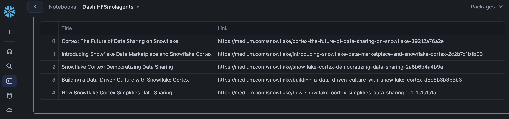
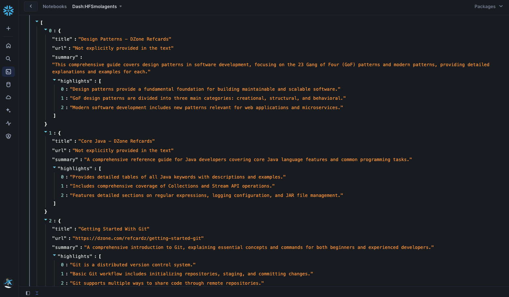

id: build-agentic-workflows-with-huggingface-smolagents-in-snowflake
categories: snowflake-site:taxonomy/solution-center/certification/quickstart, snowflake-site:taxonomy/product/ai, snowflake-site:taxonomy/snowflake-feature/build
language: en
summary: Build agentic workflows with Hugging Face SmolAgents in Snowflake for AI task automation and intelligent processing.
environments: web
status: Published
feedback link: <https://github.com/Snowflake-Labs/sfguides/issues>
authors: Dash Desai

# Build Agentic Workflows with Hugging Face Smolagents in Snowflake
<!-- ------------------------ -->

## Overview

This guide outlines the process for creating agentic workflows in [Snowflake Notebook on Container Runtime](https://docs.snowflake.com/en/user-guide/ui-snowsight/notebooks-on-spcs) using Smolagents from Hugging Face. These agents are capable of writing Python code to call tools and orchestrate other agents. In this guide, we will also see how you can use out of the box tools and also create a custom tool that uses Snowflake Cortex AI.

### What is Container Runtime? 

Snowflake Notebooks on Container Runtime enable flexible and scalable model development and deployment directly within Snowflake for [machine learning](/en/data-cloud/snowflake-ml/) and [gen AI](/en/data-cloud/cortex/) workflows. Powered by Snowpark Container Services, it provides a flexible environment to build and operationalize various workloads, especially those requiring Python packages from multiple sources and powerful compute resources, including CPUs and GPUs. With this Snowflake-native experience, you can train models, perform hyperparameter tuning, and execute batch inference. Container Runtime offers greater flexibility and tailored compute options for complex modeling workloads. ***NOTE: This feature is currently in Public Preview.***

Learn more about [Container Runtime](https://docs.snowflake.com/en/user-guide/ui-snowsight/notebooks-on-spcs).

### What is Snowflake Cortex AI? 

Snowflake Cortex is a suite of AI features that use large language models (LLMs) to understand unstructured data, answer freeform questions, and provide intelligent assistance.

Learn more about [Snowflake Cortex AI](/en/data-cloud/cortex/).

### What is Smolagents?

It is a lightweight library introduced by Hugging Face that enables language models to perform tasks by writing and executing code. It allows for the creation of agents that can interact with tools, execute multi-step workflows, and integrate with various large language models (LLMs). It supports models hosted on the Hugging Face Hub, as well as those from providers like OpenAI and Anthropic. It also offers first-class support for code agents, facilitating the development of agents that write their actions in code. 

Learn more about [Smolagents](https://github.com/huggingface/Smolagents).

### Prerequisites

* Access to a [Snowflake account](https://signup.snowflake.com/?utm_source=snowflake-devrel&utm_medium=developer-guides&utm_cta=developer-guides) with ACCOUNTADMIN role
* Access to a [Hugging Face account and HF token](https://huggingface.co/)
    * Log into your Hugging Face account and access your Hugging Face token by browsing to ***Settings -> Access Tokens -> New token***. Make note of this token – you will need to copy-paste it later on.

### What You Will Learn

* How to create agentic workflows using Smolagents library from Hugging Face in Snowflake

### What You Will Build

Agentic workflow using Smolagents library and Snowflake Cortex AI in Snowflake Notebook on Container Runtime.

<!-- ------------------------ -->
## Setup

**Step 1.** In Snowsight, [create a SQL Worksheet](https://docs.snowflake.com/en/user-guide/ui-snowsight-worksheets-gs?_fsi=THrZMtDg,%20THrZMtDg&_fsi=THrZMtDg,%20THrZMtDg#create-worksheets-from-a-sql-file) and open [setup.sql](https://github.com/Snowflake-Labs/sfguide-build-agentic-workflows-with-huggingface-smolagents-in-snowflake/blob/main/setup.sql) to execute all statements in order from top to bottom.

**Step 2.** In Snowsight, switch your user role to `DASH_CONTAINER_RUNTIME_ROLE`.

**Step 3.** Click on [huggingface_smolagents_notebook_app.ipynb](https://github.com/Snowflake-Labs/sfguide-build-agentic-workflows-with-huggingface-smolagents-in-snowflake/blob/main/huggingface_smolagents_notebook_app.ipynb) to download the Notebook from GitHub. (NOTE: Do NOT right-click to download.)

**Step 4.** In Snowsight:

* On the left hand navigation menu, click on **Projects » Notebooks**
* On the top right, click on **Notebook** down arrow and select **Import .ipynb file** from the dropdown menu
* Select **huggingface_smolagents_notebook_app.ipynb** file you downloaded in the step above
* In the Create Notebook popup
    * For Notebook location, select `DASH_DB` and `DASH_SCHEMA`
    * For SQL warehouse, select `DASH_WH_S`
    * For Python environment, select `Run on container`
    * For Runtime, select `Snowflake ML Runtime CPU 1.0`
    * For Compute pool, select `CPU_X64_XS`
    * Click on **Create** button

**Step 5.** Open Notebook

* Click in the three dots at the very top-right corner and select `Notebook settings` >> `External access`
* Turn on **ALLOW_ALL_ACCESS_INTEGRATION**
* Click on **Save** button
* Click on **Start** button on top right

> 
> NOTE: At this point, the container service will take about 5-7 minutes to start. You will not be able to proceed unless the status changes from **Starting** to **Active**.

<!-- ------------------------ -->
## Run Notebook

> 
> PREREQUISITE: Successful completion of steps outlined under **Setup**.

Here's the code walkthrough of the [huggingface_smolagents_notebook_app.ipynb](https://github.com/Snowflake-Labs/sfguide-build-agentic-workflows-with-huggingface-smolagents-in-snowflake/blob/main/huggingface_smolagents_notebook_app.ipynb) notebook that you downloaded and imported into your Snowflake account.

**Cell 1** 

Install **Smolagents** library

**Cell 2** 

Here we create instances of **HfApiModel**, **ToolCallingAgent**, and **CodeAgent** to perform web search using built-in **DuckDuckGoSearchTool**. 

> 
> NOTE: Replace `hf_ZkEXVwIXXXXXXXXXXXXXXX` with your Hugging Face token before proceeding.

**Cell 3**

Here we use the instance of **CodeAgent** created in step / cell above and perform a web search using built-in tool (DuckDuckGoSearchTool) given the prompt `Top 5 announcements at Snowflake Summit 2024 in JSON format. Only return the JSON formatted output as the response and nothing else.`. If all goes well, you should see output similar to the following:

**Cell 4** 

Here we use the same instance of **CodeAgent** and perform a web search using prompt `Top 5 blog articles on AI. Include blog title and link to the article. Return the response in a Pandas dataframe and nothing else.`. If all goes well, you should see output similar to the following:

**Cell 5** 

Here we create a new tools **get_dzone_refcards**, **read_dzone_refcards**, and **summarize_article**. The first tool retrieves [popular DZone Refcards](https://dzone.com/refcardz?sort=popular), the second one extracts the content of a given article, and the third one uses [Snowflake Cortex Complete](https://docs.snowflake.com/user-guide/snowflake-cortex/llm-functions?_fsi=THrZMtDg,%20THrZMtDg&_fsi=THrZMtDg,%20THrZMtDg&_fsi=THrZMtDg,%20THrZMtDg#complete-function) function to summarize a given article using Anthropic **claude-3-5-sonnet** LLM and prompt `Summarize the text enclosed in ### in less than 500 words: ### {article_text} ###.Produce JSON output that includes article title, article url, article summary, and 3 highlights from the article.`. 

**Cell 6** 

Here we create a new instance of **CodeAgent** and provide the three tools created in the previous step with prompt `Generate a list of 5 popular DZone RefCard summaries by reading them.`.  

If all goes well, you should see the output similar to the following:

---

> 
> NOTES:
> In all of the cases, notice the Python and other code snippets being generated to perform the task(s).
>
> Since LLMs are non-deterministic in nature, the results for all of the 3 operations above may vary. So I encourage you to try different prompts and [other supported LLMs](https://docs.snowflake.com/en/user-guide/snowflake-cortex/llm-functions?_fsi=THrZMtDg,%20THrZMtDg&_fsi=THrZMtDg,%20THrZMtDg#availability) in your region.

<!-- ------------------------ -->
## Conclusion And Resources

Congratulations! You've successfully created agentic workflow using smolagents library and Snowflake Cortex AI in Snowflake Notebook on Container Runtime.

### What You Learned

* How to create agentic workflows using smolagents library from Hugging Face
* How to build custom tools and models with Snowflake Notebooks on Container Runtime

### Related Resources

- [GitHub Repo](https://github.com/Snowflake-Labs/sfguide-build-agentic-workflows-with-huggingface-smolagents-in-snowflake)
- [Snowflake Notebooks on Container Runtime](https://docs.snowflake.com/en/user-guide/ui-snowsight/notebooks-on-spcs)
- [Smolagents](https://huggingface.co/blog/smolagents#introducing-smolagents-a-simple-library-to-build-agents)
- [Snowflake ML](/en/data-cloud/snowflake-ml/)
- [Snowflake Cortex AI](/en/data-cloud/cortex/)

