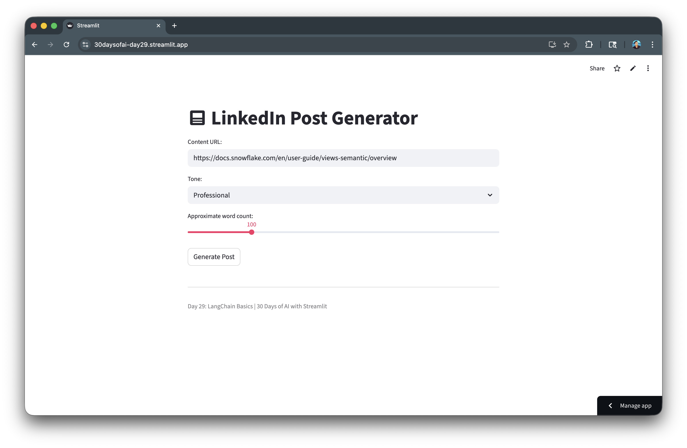
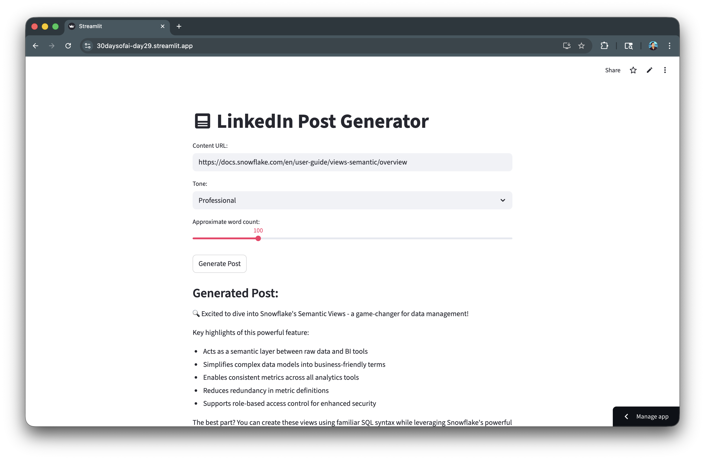

author: Siavash Yasini, Chanin Nantasenamat
id: build-ai-apps-with-langchain-streamlit-and-snowflake-cortex
summary: Learn how to integrate LangChain with Streamlit and Snowflake Cortex to build composable LLM apps with prompt templates and chains.
categories: snowflake-site:taxonomy/solution-center/certification/quickstart,snowflake-site:taxonomy/product/ai
language: en
environments: web
status: Published
feedback link: https://github.com/Snowflake-Labs/sfguides/issues
tags: Streamlit, LangChain, Cortex, LLM, Prompt Templates

# Build AI Apps with LangChain, Streamlit and Snowflake Cortex
<!-- ------------------------ -->
## Overview

In this quickstart, you'll learn how to integrate LangChain with Streamlit and Snowflake Cortex to build composable LLM applications. LangChain provides powerful abstractions for prompt templates, chains, and output handling that work seamlessly with Cortex models.

### What You'll Learn
- How to install and configure `langchain-snowflake`
- How to create prompt templates with variables
- How to build LangChain chains with Cortex LLMs
- How to compose templates and models into pipelines

### What You'll Build
A LinkedIn Post Generator that uses LangChain prompt templates with Streamlit and Snowflake Cortex to generate customized social media content.



### Prerequisites
- Access to a [Snowflake account](https://signup.snowflake.com/?utm_source=snowflake-devrel&utm_medium=developer-guides&utm_cta=developer-guides)
- Basic knowledge of Python and Streamlit
- `langchain-snowflake` package installed

<!-- ------------------------ -->
## Getting Started

Clone or download the code from the [30daysofai](https://github.com/streamlit/30daysofai) GitHub repository:

```bash
git clone https://github.com/streamlit/30DaysOfAI.git
cd 30DaysOfAI/app
```

The app code for this quickstart:
- [Day 29: LangChain App](https://github.com/streamlit/30DaysOfAI/blob/main/app/day29.py)

<!-- ------------------------ -->
## Install LangChain Snowflake

Install the required package.

> Note: This section is repurposed from Day 29 of the [#30DaysOfAI learning challenge](https://30daysofai.streamlit.app/?day=29).

### Installation

```bash
pip install langchain-snowflake
```

Or add to your `requirements.txt`:

```
streamlit
snowflake-snowpark-python
langchain-core
langchain-snowflake
```

### Verify Installation

Test that the LangChain Snowflake integration is properly installed:

```python
from langchain_snowflake import ChatSnowflake
print("LangChain Snowflake installed successfully!")
```

`langchain-snowflake` provides the `ChatSnowflake` class that connects LangChain's abstractions to Snowflake Cortex models.

<!-- ------------------------ -->
## Setup Snowflake Connection

Establish the connection for LangChain to use.

> Note: This section is repurposed from Day 29 of the [#30DaysOfAI learning challenge](https://30daysofai.streamlit.app/?day=29).

### Connection Code

Establish the Snowflake session that LangChain will use for Cortex access:

```python
import streamlit as st
from langchain_snowflake import ChatSnowflake

try:
    from snowflake.snowpark.context import get_active_session
    session = get_active_session()
except:
    from snowflake.snowpark import Session
    session = Session.builder.configs(st.secrets["connections"]["snowflake"]).create()
```

The standard Snowflake connection pattern works with LangChain. The session object is passed to `ChatSnowflake` to enable Cortex model access.

### Create the LLM Instance

Wrap Cortex models with LangChain's interface:

```python
llm = ChatSnowflake(model="claude-3-5-sonnet", session=session)
```

`ChatSnowflake` wraps Cortex models with LangChain's interface. Pass the model name and session to create an LLM instance that works with chains and templates.

### Available Models

| Model | Best For |
|-------|----------|
| `claude-3-5-sonnet` | Complex reasoning, long outputs |
| `mistral-large` | Balanced speed and quality |
| `llama3.1-8b` | Fast responses |
| `mixtral-8x7b` | General purpose |

<!-- ------------------------ -->
## Create Prompt Templates

Prompt templates allow you to define reusable prompts with variables.

> Note: This section is repurposed from Day 29 of the [#30DaysOfAI learning challenge](https://30daysofai.streamlit.app/?day=29).

### Basic Template

Create reusable prompts with variable placeholders:

```python
from langchain_core.prompts import PromptTemplate

template = PromptTemplate.from_template(
    "Explain {topic} in simple terms."
)

formatted = template.format(topic="machine learning")
print(formatted)
# Output: "Explain machine learning in simple terms."
```

`PromptTemplate.from_template()` creates reusable prompts with `{variable}` placeholders. The `format()` method substitutes variables with actual values.

### Multi-Variable Template

Add multiple variables and detailed instructions for consistent output:

```python
template = PromptTemplate.from_template(
    """You are an expert social media manager. Generate a LinkedIn post based on:

    Tone: {tone}
    Desired Length: Approximately {word_count} words
    Use content from this URL: {content}

    Generate only the LinkedIn post text. Use dash for bullet points."""
)
```

Templates can include multiple variables and detailed instructions. Clear formatting guidelines help the LLM produce consistent output.

### Template with Instructions

Use message-based templates for finer control over system and human roles:

```python
from langchain_core.prompts import ChatPromptTemplate

template = ChatPromptTemplate.from_messages([
    ("system", "You are a helpful assistant that writes {style} content."),
    ("human", "Write about: {topic}")
])
```

`ChatPromptTemplate` supports message-based templates with system and human roles, giving you finer control over how the LLM receives instructions.

<!-- ------------------------ -->
## Build Chains

Chains compose templates and LLMs into pipelines.

> Note: This section is repurposed from Day 29 of the [#30DaysOfAI learning challenge](https://30daysofai.streamlit.app/?day=29).

### Basic Chain

Compose templates and LLMs into chains using the pipe operator:

```python
import streamlit as st
from langchain_core.prompts import PromptTemplate
from langchain_snowflake import ChatSnowflake

try:
    from snowflake.snowpark.context import get_active_session
    session = get_active_session()
except:
    from snowflake.snowpark import Session
    session = Session.builder.configs(st.secrets["connections"]["snowflake"]).create()

template = PromptTemplate.from_template(
    "Explain {topic} in simple terms for a beginner."
)

llm = ChatSnowflake(model="claude-3-5-sonnet", session=session)

chain = template | llm
```

The pipe operator (`|`) composes templates and LLMs into chains. When invoked, the template formats the prompt, which then passes to the LLM for generation.

### Execute the Chain

Invoke the chain with a dictionary matching the template variables:

```python
result = chain.invoke({"topic": "neural networks"})
print(result.content)
```

`chain.invoke()` accepts a dictionary matching the template variables. The result is a message object with the LLM's response in the `.content` attribute.

### Chain with Multiple Variables

Pass all required values in the invoke dictionary:

```python
template = PromptTemplate.from_template(
    """Generate a {tone} message about {topic} in {word_count} words."""
)

chain = template | llm

result = chain.invoke({
    "tone": "professional",
    "topic": "data engineering",
    "word_count": 100
})
```

Chains handle any number of variables. Simply pass all required values in the invoke dictionary.

<!-- ------------------------ -->
## Build Post Generator App

Create a complete application using LangChain and Streamlit.

> Note: This section is repurposed from Day 29 of the [#30DaysOfAI learning challenge](https://30daysofai.streamlit.app/?day=29).

### Application Code

Build the complete LinkedIn Post Generator with customizable tone and word count:

```python
import streamlit as st
from langchain_core.prompts import PromptTemplate
from langchain_snowflake import ChatSnowflake

try:
    from snowflake.snowpark.context import get_active_session
    session = get_active_session()
except:
    from snowflake.snowpark import Session
    session = Session.builder.configs(st.secrets["connections"]["snowflake"]).create()

template = PromptTemplate.from_template(
    """You are an expert social media manager. Generate a LinkedIn post based on:

    Tone: {tone}
    Desired Length: Approximately {word_count} words
    Use content from this URL: {content}

    Generate only the LinkedIn post text. Use dash for bullet points."""
)

llm = ChatSnowflake(model="claude-3-5-sonnet", session=session)
chain = template | llm

st.title(":material/post: LinkedIn Post Generator")

content = st.text_input(
    "Content URL:", 
    "https://docs.snowflake.com/en/user-guide/views-semantic/overview"
)
tone = st.selectbox("Tone:", ["Professional", "Casual", "Funny"])
word_count = st.slider("Approximate word count:", 50, 300, 100)

if st.button("Generate Post"):
    result = chain.invoke({
        "content": content, 
        "tone": tone, 
        "word_count": word_count
    })
    
    st.subheader("Generated Post:")
    st.markdown(result.content)
```

The complete app combines UI inputs with chain invocation. The button triggers the chain, and `st.markdown()` renders the formatted output.

<!-- ------------------------ -->
## Advanced Chain Patterns

> Note: This section is repurposed from Day 29 of the [#30DaysOfAI learning challenge](https://30daysofai.streamlit.app/?day=29).

### Chain with Processing

Add a function to the chain pipe for post-processing output:

```python
def process_output(result):
    """Post-process LLM output."""
    return result.content.strip()

chain = template | llm | process_output

result = chain.invoke({"topic": "Snowflake"})
# result is now a string, not a message object
```

Adding a function to the chain pipe processes the output. This pattern extracts just the text content and strips whitespace.

### Multiple Chains

Combine separate chains for multi-step workflows:

```python
summary_template = PromptTemplate.from_template(
    "Summarize this in one sentence: {text}"
)

expand_template = PromptTemplate.from_template(
    "Expand on this topic: {summary}"
)

summary_chain = summary_template | llm
expand_chain = expand_template | llm

summary_result = summary_chain.invoke({"text": long_text})

expanded_result = expand_chain.invoke({"summary": summary_result.content})
```

Separate chains can be combined by passing one chain's output as another's input. This enables multi-step workflows like summarize-then-expand.

### Error Handling

Wrap chain invocations in try/except for graceful error recovery:

```python
try:
    result = chain.invoke({"topic": user_input})
    st.success("Generated successfully!")
    st.markdown(result.content)
except Exception as e:
    st.error(f"Generation failed: {str(e)}")
    st.info("Try rephrasing your request or selecting a different model.")
```

Wrapping chain invocations in try/except handles API errors gracefully. Providing actionable suggestions helps users recover from failures.

<!-- ------------------------ -->
## Complete Application

Here's the complete LinkedIn Post Generator combining LangChain prompt templates, Snowflake Cortex integration, and Streamlit UI controls.

### Full Code

Copy the code below to create your complete LangChain Post Generator app:

```python
import streamlit as st
from langchain_core.prompts import PromptTemplate
from langchain_snowflake import ChatSnowflake

try:
    from snowflake.snowpark.context import get_active_session
    session = get_active_session()
except:
    from snowflake.snowpark import Session
    session = Session.builder.configs(st.secrets["connections"]["snowflake"]).create()

template = PromptTemplate.from_template(
    """You are an expert social media manager. Generate a LinkedIn post based on:

    Tone: {tone}
    Desired Length: Approximately {word_count} words
    Use content from this URL: {content}

    Generate only the LinkedIn post text. Use dash for bullet points."""
)

llm = ChatSnowflake(model="claude-3-5-sonnet", session=session)
chain = template | llm

st.title(":material/post: LinkedIn Post Generator")
content = st.text_input("Content URL:", "https://docs.snowflake.com/en/user-guide/views-semantic/overview")
tone = st.selectbox("Tone:", ["Professional", "Casual", "Funny"])
word_count = st.slider("Approximate word count:", 50, 300, 100)

if st.button("Generate Post"):
    result = chain.invoke({"content": content, "tone": tone, "word_count": word_count})
    st.subheader("Generated Post:")
    st.markdown(result.content)

st.divider()
st.caption("Day 29: LangChain Basics | 30 Days of AI with Streamlit")
```

Here's the app with the generated response:



## Deploy the App

Save the code above as `streamlit_app.py` and deploy using one of these options:

- **Local**: Run `streamlit run streamlit_app.py` in your terminal
- **Streamlit Community Cloud**: [Deploy your app](https://docs.streamlit.io/deploy/streamlit-community-cloud/deploy-your-app/deploy) from a GitHub repository
- **Streamlit in Snowflake (SiS)**: [Create a Streamlit app](https://docs.snowflake.com/en/developer-guide/streamlit/getting-started/create-streamlit-ui) directly in Snowsight

<!-- ------------------------ -->
## Conclusion And Resources

Congratulations! You've learned how to integrate LangChain with Streamlit and Snowflake Cortex to build composable LLM apps. You can now create reusable prompt templates, build chains, and compose powerful AI pipelines.

### What You Learned
- Installing and configuring `langchain-snowflake`
- Creating prompt templates with variables
- Building LangChain chains with Cortex LLMs
- Composing templates and models into pipelines

### Related Resources

Documentation:
- [LangChain Snowflake Integration](https://python.langchain.com/docs/integrations/chat/snowflake/)
- [LangChain Documentation](https://python.langchain.com/docs/)
- [Snowflake Cortex LLM Functions](https://docs.snowflake.com/en/user-guide/snowflake-cortex/llm-functions)

### Source Material

This quickstart was adapted from **Day 29** (LangChain integration with Cortex) of the 30 Days of AI challenge

Learn more:
- [30 Days of AI Challenge](https://30daysofai.streamlit.app/)
- [GitHub Repository](https://github.com/streamlit/30daysofai)
