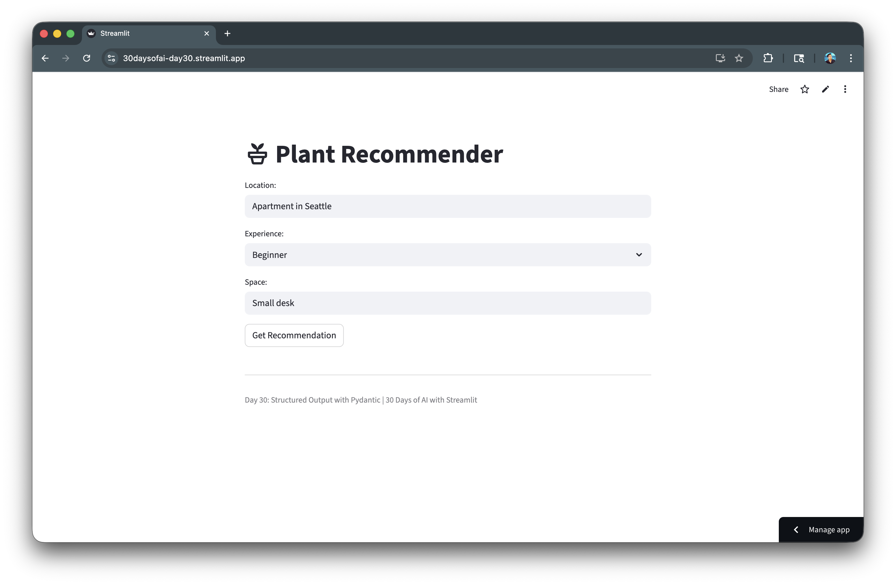
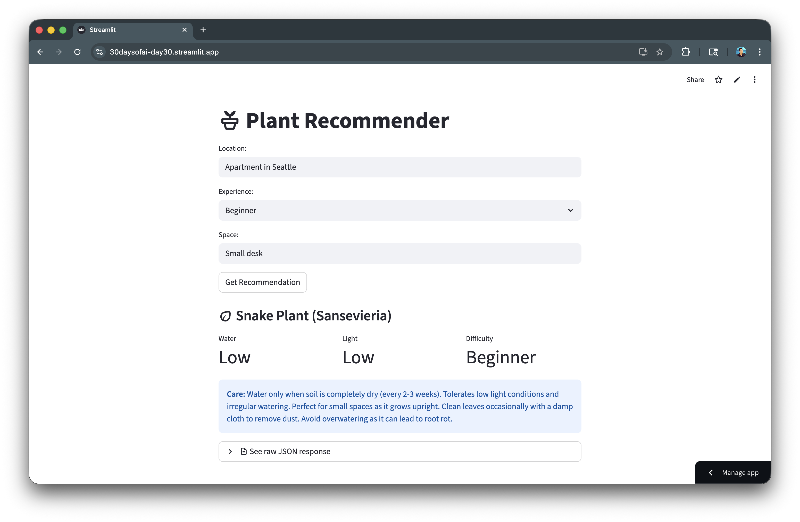

author: Siavash Yasini, Chanin Nantasenamat
id: build-ai-apps-with-pydantic-langchain-streamlit-and-snowflake-cortex
summary: Learn how to use Pydantic with LangChain, Streamlit and Snowflake Cortex to generate type-safe, validated structured output from LLM responses.
categories: snowflake-site:taxonomy/solution-center/certification/quickstart,snowflake-site:taxonomy/product/ai
language: en
environments: web
status: Published
feedback link: https://github.com/Snowflake-Labs/sfguides/issues
tags: Streamlit, Pydantic, LangChain, Structured Output, Data Extraction

# Build AI Apps with Structured Output using Pydantic, Langchain, Streamlit and Snowflake Cortex
<!-- ------------------------ -->
## Overview

In this quickstart, you'll learn how to use Pydantic with LangChain and Snowflake Cortex to generate type-safe, validated structured output from LLM responses. This enables reliable data extraction from natural language inputs.

### What You'll Learn
- Why structured output matters for LLM applications
- How to define Pydantic schemas for LLM output
- How to use PydanticOutputParser with LangChain
- How to build reliable data extraction pipelines

### What You'll Build
A Plant Recommender application that uses Pydantic to generate structured, type-safe plant recommendations from natural language inputs.



### Prerequisites
- Access to a [Snowflake account](https://signup.snowflake.com/?utm_source=snowflake-devrel&utm_medium=developer-guides&utm_cta=developer-guides)
- Basic knowledge of Python and Streamlit
- `langchain-snowflake` and `pydantic` packages installed

<!-- ------------------------ -->
## Getting Started

Clone or download the code from the [30daysofai](https://github.com/streamlit/30daysofai) GitHub repository:

```bash
git clone https://github.com/streamlit/30DaysOfAI.git
cd 30DaysOfAI/app
```

The app code for this quickstart:
- [Day 30: Structured Output](https://github.com/streamlit/30DaysOfAI/blob/main/app/day30.py)

<!-- ------------------------ -->
## Why Structured Output?

Raw LLM responses are unstructured text. Structured output solves key challenges.

### The Problem

```python
response = llm.invoke("Recommend a plant for my desk")
# Returns: "I'd recommend a Snake Plant! It's great for low light..."
# How do you extract: name, water needs, light needs programmatically?
```

### The Solution

```python
result = chain.invoke({"space": "desk"})
# Returns: PlantRecommendation(name="Snake Plant", water="Low", light="Low", ...)
print(result.name)     # "Snake Plant"
print(result.water)    # "Low"
print(result.light)    # "Low"
```

Structured output gives you direct access to individual fields via dot notation, enabling programmatic use of LLM responses in your application logic.

### Benefits

| Unstructured | Structured |
|--------------|------------|
| Unpredictable format | Guaranteed schema |
| Manual parsing needed | Automatic parsing |
| Runtime errors | Type validation |
| Hard to use in code | Programmatically accessible |

<!-- ------------------------ -->
## Define Pydantic Schemas

Pydantic models define the expected output structure.

### Basic Schema

Define a simple Pydantic model with field descriptions:

```python
from pydantic import BaseModel, Field

class PlantRecommendation(BaseModel):
    name: str = Field(description="Plant name")
    care_tips: str = Field(description="Brief care instructions")
```

Pydantic's `BaseModel` defines the expected structure. `Field()` with descriptions helps the LLM understand what each field should contain.

### Schema with Constraints

Use `Literal` types to constrain values to specific options:

```python
from pydantic import BaseModel, Field
from typing import Literal

class PlantRecommendation(BaseModel):
    name: str = Field(description="Plant name")
    water: Literal["Low", "Medium", "High"] = Field(description="Water requirement")
    light: Literal["Low", "Medium", "High"] = Field(description="Light requirement")
    difficulty: Literal["Beginner", "Intermediate", "Expert"] = Field(description="Care difficulty")
    care_tips: str = Field(description="Brief care instructions")
```

`Literal` types constrain values to specific options. This ensures the LLM outputs only valid categories like "Low", "Medium", or "High".

### Advanced Schema

Add lists, numeric constraints, and optional fields for complex extraction:

```python
from typing import List, Optional

class ProductReview(BaseModel):
    product_name: str
    rating: int = Field(ge=1, le=5, description="Rating from 1-5")
    pros: List[str] = Field(description="Positive aspects")
    cons: List[str] = Field(description="Negative aspects")
    summary: str = Field(max_length=200)
    recommended: bool
    price_value: Optional[Literal["Poor", "Fair", "Good", "Excellent"]] = None
```

Advanced schemas can include lists, numeric constraints (`ge`, `le`), string length limits, and optional fields for flexible data extraction.

<!-- ------------------------ -->
## Create the Parser

`PydanticOutputParser` generates format instructions for the LLM.

### Setup Parser

Create a parser that generates format instructions for the LLM:

```python
from langchain_core.output_parsers import PydanticOutputParser

parser = PydanticOutputParser(pydantic_object=PlantRecommendation)
```

`PydanticOutputParser` takes your schema and generates instructions for the LLM to produce JSON matching your Pydantic model.

### Get Format Instructions

Retrieve the JSON schema that tells the LLM how to format its response:

```python
instructions = parser.get_format_instructions()
print(instructions)
# Outputs JSON schema that tells LLM how to format response
```

`get_format_instructions()` returns a string describing the expected JSON format. This is passed to the LLM so it knows exactly what structure to output.

### Parse LLM Output

Validate and convert the LLM's JSON output into a typed Pydantic object:

```python
raw_output = '{"name": "Snake Plant", "water": "Low", ...}'
result = parser.parse(raw_output)
# result is now a PlantRecommendation instance
```

The parser validates the LLM's JSON output against your schema and returns a typed Pydantic object with direct attribute access.

<!-- ------------------------ -->
## Build the Chain

Combine template, LLM, and parser into a pipeline.

### Create Template with Format Instructions

Include a placeholder for parser instructions in the prompt template:

```python
from langchain_core.prompts import ChatPromptTemplate

template = ChatPromptTemplate.from_messages([
    ("system", "You are a plant expert. {format_instructions}"),
    ("human", "Recommend a plant for: {location}, {experience} experience, {space} space")
])
```

The template includes `{format_instructions}` placeholder where parser instructions will be injected. This tells the LLM how to structure its response.

### Build Complete Chain

Combine template, LLM, and parser into a pipeline using the pipe operator:

```python
import streamlit as st
from langchain_snowflake import ChatSnowflake

try:
    from snowflake.snowpark.context import get_active_session
    session = get_active_session()
except:
    from snowflake.snowpark import Session
    session = Session.builder.configs(st.secrets["connections"]["snowflake"]).create()

llm = ChatSnowflake(model="claude-3-5-sonnet", session=session)

chain = template | llm | parser
```

The chain pipes template → LLM → parser. The template formats the prompt, the LLM generates JSON, and the parser validates and converts it to a Pydantic object.

### Execute Chain

Invoke the chain with variables and receive a typed Pydantic object:

```python
result = chain.invoke({
    "location": "Seattle apartment",
    "experience": "Beginner",
    "space": "Small desk",
    "format_instructions": parser.get_format_instructions()
})

print(result.name)        # "Pothos"
print(result.water)       # "Low"
print(result.difficulty)  # "Beginner"
```

Pass `format_instructions` from the parser to fill the template placeholder. The result is a fully typed `PlantRecommendation` object with validated fields.

<!-- ------------------------ -->
## Build Plant Recommender App

Create the complete Streamlit application.

### Full Application Code

Build the complete Plant Recommender with metrics display and JSON preview:

```python
import streamlit as st
from langchain_core.prompts import ChatPromptTemplate
from langchain_core.output_parsers import PydanticOutputParser
from langchain_snowflake import ChatSnowflake
from pydantic import BaseModel, Field
from typing import Literal

try:
    from snowflake.snowpark.context import get_active_session
    session = get_active_session()
except:
    from snowflake.snowpark import Session
    session = Session.builder.configs(st.secrets["connections"]["snowflake"]).create()

class PlantRecommendation(BaseModel):
    name: str = Field(description="Plant name")
    water: Literal["Low", "Medium", "High"] = Field(description="Water requirement")
    light: Literal["Low", "Medium", "High"] = Field(description="Light requirement")
    difficulty: Literal["Beginner", "Intermediate", "Expert"] = Field(description="Care difficulty level")
    care_tips: str = Field(description="Brief care instructions")

parser = PydanticOutputParser(pydantic_object=PlantRecommendation)

template = ChatPromptTemplate.from_messages([
    ("system", "You are a plant expert. {format_instructions}"),
    ("human", "Recommend a plant for: {location}, {experience} experience, {space} space")
])

llm = ChatSnowflake(model="claude-3-5-sonnet", session=session)
chain = template | llm | parser

st.title(":material/potted_plant: Plant Recommender")
location = st.text_input("Location:", "Apartment in Seattle")
experience = st.selectbox("Experience:", ["Beginner", "Intermediate", "Expert"])
space = st.text_input("Space:", "Small desk")

if st.button("Get Recommendation"):
    result = chain.invoke({
        "location": location,
        "experience": experience,
        "space": space,
        "format_instructions": parser.get_format_instructions()
    })

    st.subheader(f":material/eco: {result.name}")

    col1, col2, col3 = st.columns(3)
    col1.metric("Water", result.water)
    col2.metric("Light", result.light)
    col3.metric("Difficulty", result.difficulty)
    st.info(f"**Care:** {result.care_tips}")

    with st.expander(":material/description: See raw JSON response"):
        st.json(result.model_dump())

st.divider()
st.caption("Day 30: Structured Output with Pydantic | 30 Days of AI with Streamlit")
```

The app uses `st.columns()` to display metrics cleanly and `model_dump()` to show the raw JSON for debugging. Each result field is accessed via dot notation.

<!-- ------------------------ -->
## Handle Errors

Robust error handling for production applications.

### Parser Errors

Catch parsing failures when the LLM response doesn't match the schema:

```python
from langchain_core.exceptions import OutputParserException

try:
    result = chain.invoke(inputs)
    st.success(f"Recommendation: {result.name}")
except OutputParserException as e:
    st.error("Could not parse LLM response into expected format")
    st.info("The model's response didn't match the schema. Try rephrasing.")
except Exception as e:
    st.error(f"Error: {str(e)}")
```

### Validation Errors

Handle Pydantic validation errors with detailed field-level feedback:

```python
from pydantic import ValidationError

try:
    result = chain.invoke(inputs)
except ValidationError as e:
    st.error("Invalid data in response")
    for error in e.errors():
        st.warning(f"Field '{error['loc'][0]}': {error['msg']}")
```

Pydantic's `ValidationError` provides detailed error information including which field failed and why, helping users understand what went wrong.

### Complete Error Handling

Implement layered exception handling for production applications:

```python
if st.button("Get Recommendation"):
    try:
        with st.spinner("Finding the perfect plant..."):
            result = chain.invoke({
                "location": location,
                "experience": experience,
                "space": space,
                "format_instructions": parser.get_format_instructions()
            })
        
        st.subheader(f":material/eco: {result.name}")
        col1, col2, col3 = st.columns(3)
        col1.metric("Water", result.water)
        col2.metric("Light", result.light)
        col3.metric("Difficulty", result.difficulty)
        st.info(f"**Care Tips:** {result.care_tips}")
        
    except OutputParserException:
        st.error("The AI response couldn't be parsed. Please try again.")
    except ValidationError as e:
        st.error("Invalid response format")
        st.json(e.errors())
    except Exception as e:
        st.error(f"An error occurred: {str(e)}")
        st.info("Check your connection and try again.")
```

Layered exception handling catches parsing errors, validation failures, and general exceptions separately, providing targeted feedback for each failure type.

<!-- ------------------------ -->
## Best Practices

### Schema Design

1. **Use clear descriptions**: Field descriptions help the LLM understand expectations
2. **Use Literal types**: Constrain values to specific options when possible
3. **Start simple**: Begin with basic schemas, add complexity gradually
4. **Use Optional for nullable**: Mark truly optional fields explicitly

### Chain Design

1. **Include format_instructions**: Always pass parser instructions to the template
2. **Use system messages**: Put formatting instructions in system role
3. **Validate outputs**: Even with schemas, verify results make sense
4. **Log for debugging**: During development, log prompts and raw responses

### Production Tips

Add logging for debugging and monitoring in production environments:

```python
import logging

logging.basicConfig(level=logging.INFO)
logger = logging.getLogger(__name__)

def get_recommendation(location, experience, space):
    inputs = {
        "location": location,
        "experience": experience,
        "space": space,
        "format_instructions": parser.get_format_instructions()
    }
    
    logger.info(f"Requesting recommendation: {inputs}")
    
    try:
        result = chain.invoke(inputs)
        logger.info(f"Got result: {result.model_dump()}")
        return result
    except Exception as e:
        logger.error(f"Failed: {e}")
        raise
```

Here's the app with the generated recommendation:



## Deploy the App

Save the code above as `streamlit_app.py` and deploy using one of these options:

- **Local**: Run `streamlit run streamlit_app.py` in your terminal
- **Streamlit Community Cloud**: [Deploy your app](https://docs.streamlit.io/deploy/streamlit-community-cloud/deploy-your-app/deploy) from a GitHub repository
- **Streamlit in Snowflake (SiS)**: [Create a Streamlit app](https://docs.snowflake.com/en/developer-guide/streamlit/getting-started/create-streamlit-ui) directly in Snowsight

<!-- ------------------------ -->
## Conclusion And Resources

Congratulations! You've learned how to use Pydantic with LangChain and Snowflake Cortex to generate type-safe, validated structured output. This technique enables reliable data extraction from LLM responses for production applications.

### What You Learned
- Why structured output matters for LLM applications
- How to define Pydantic schemas for LLM output
- How to use `PydanticOutputParser` with LangChain
- How to build reliable data extraction pipelines with error handling

### Related Resources

Documentation:
- [Pydantic Documentation](https://docs.pydantic.dev/)
- [LangChain Output Parsers](https://python.langchain.com/docs/modules/model_io/output_parsers/)
- [LangChain Snowflake Integration](https://python.langchain.com/docs/integrations/chat/snowflake/)

### Source Material

This quickstart was adapted from **Day 30** (Structured output with Pydantic) of the 30 Days of AI challenge.

Learn more:
- [30 Days of AI Challenge](https://30daysofai.streamlit.app/)
- [GitHub Repository](https://github.com/streamlit/30daysofai)
