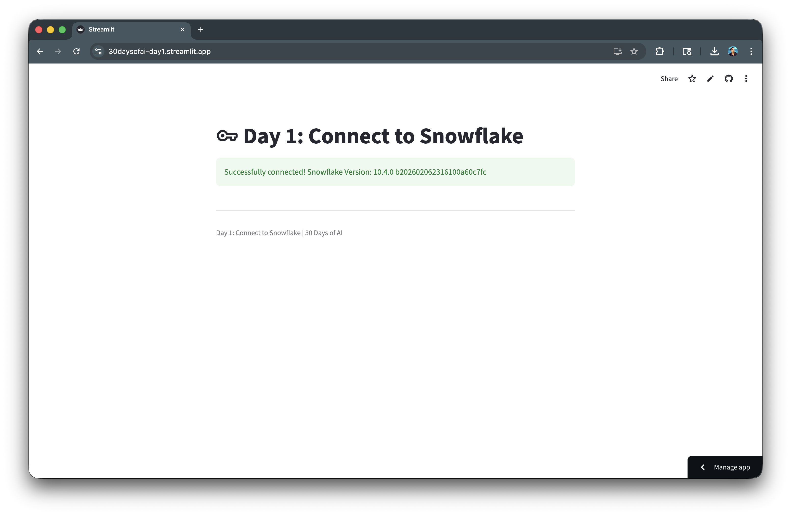
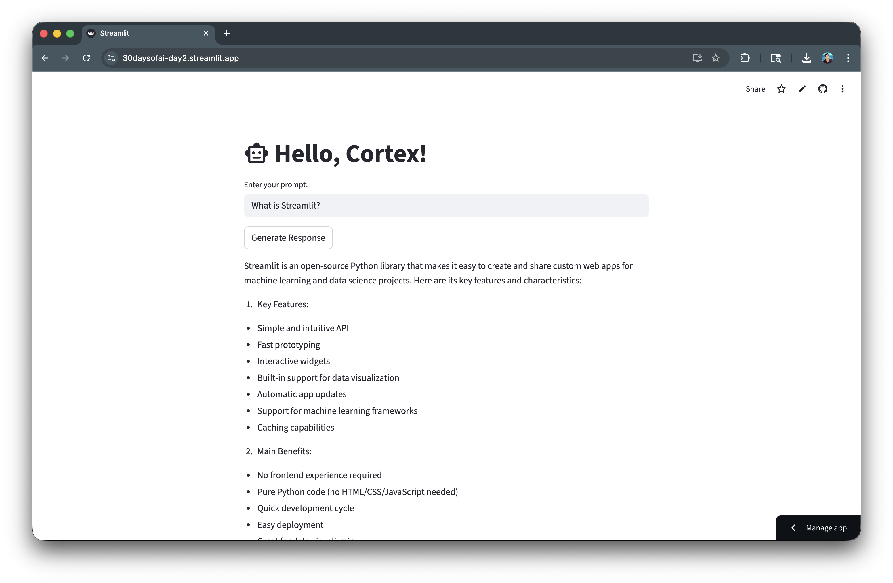
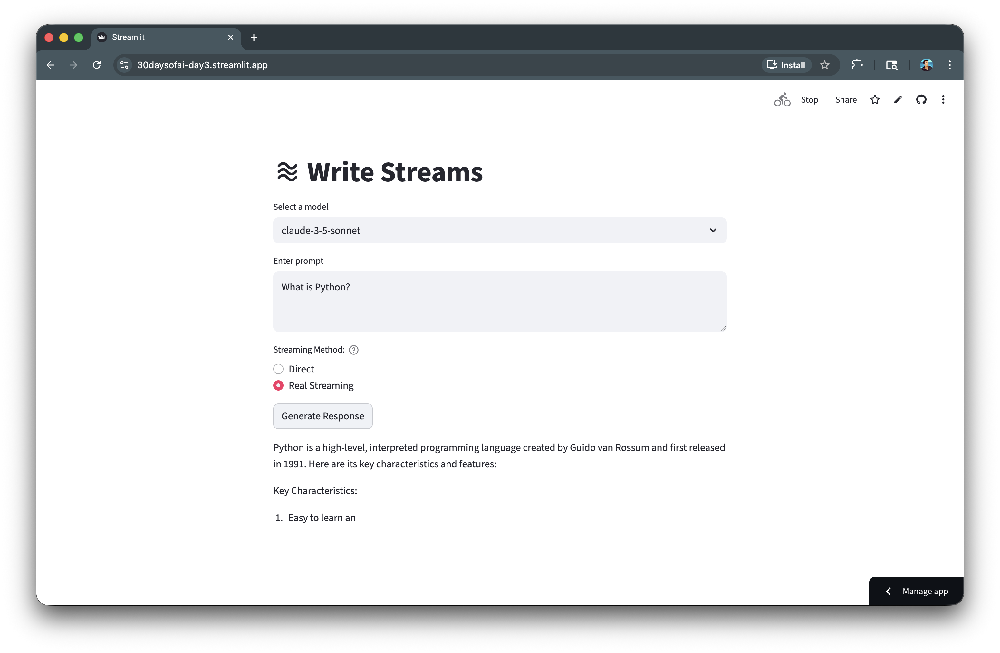
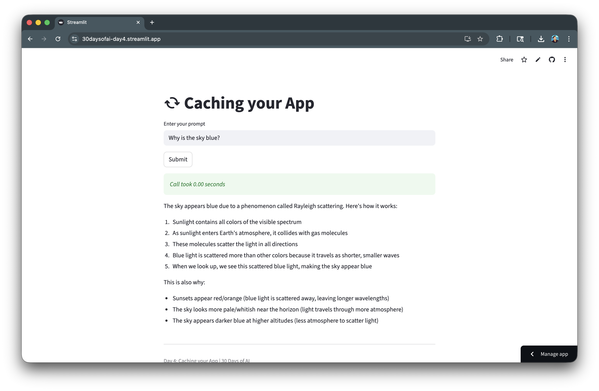
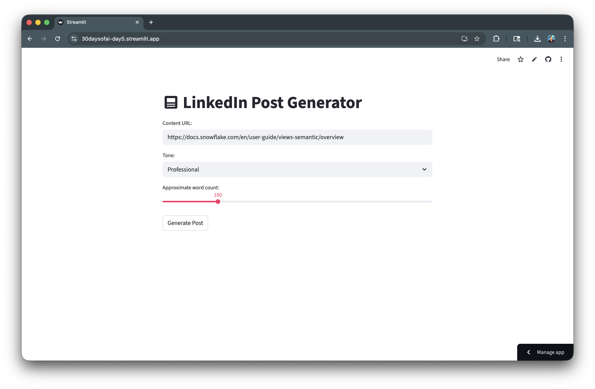
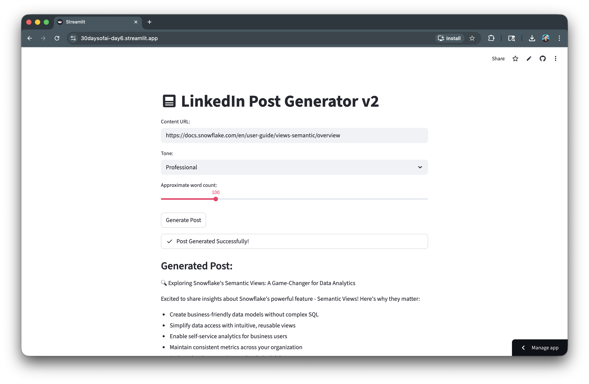
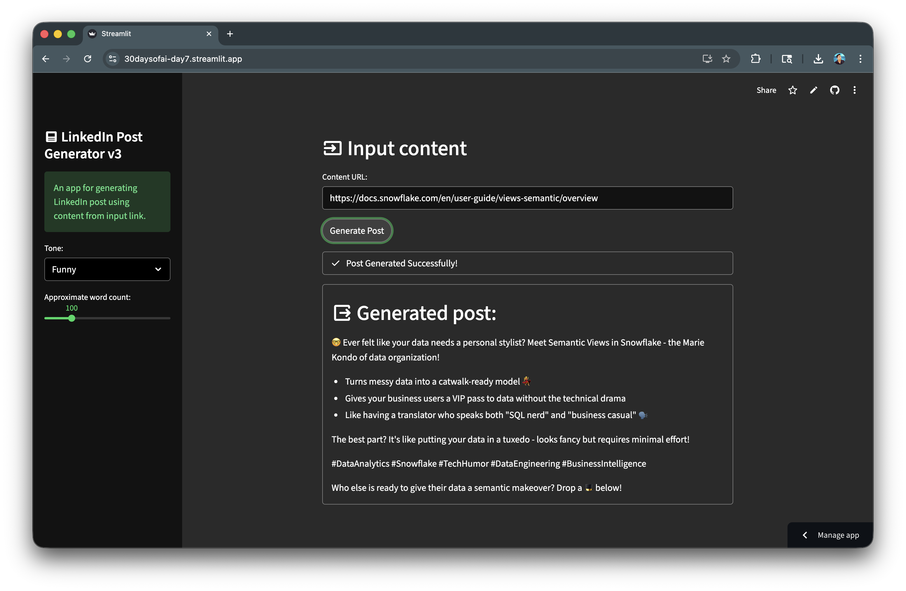

author: Chanin Nantasenamat
id: build-ai-apps-with-streamlit-and-snowflake-cortex
summary: Learn to build AI-powered Streamlit apps using Snowflake Cortex LLM functions, from basic connections to a complete LinkedIn post generator with caching and theming.
categories: snowflake-site:taxonomy/solution-center/certification/quickstart,snowflake-site:taxonomy/product/ai,snowflake-site:taxonomy/snowflake-feature/cortex-llm-functions
language: en
environments: web
status: Published
feedback link: https://github.com/Snowflake-Labs/sfguides/issues
tags: Streamlit, Cortex, LLM, AI, Getting Started

# Build AI Apps with Streamlit and Snowflake Cortex
<!-- ------------------------ -->
## Overview

In this quickstart, you'll learn how to build AI-powered applications using Snowflake Cortex LLM functions and Streamlit. Starting from establishing a Snowflake connection, you'll progressively build up to a complete LinkedIn post generator application with caching, status indicators, and custom theming.

### What You'll Learn
- How to connect Streamlit apps to Snowflake
- How to call Snowflake Cortex LLM functions using `ai_complete()`
- How to implement streaming responses for better UX
- How to use `@st.cache_data` for performance optimization
- How to build a complete AI-powered application
- How to add status indicators for long-running tasks
- How to customize app theming and layout

### What You'll Build
You'll build 7 progressively advanced AI-powered apps, each adding new capabilities:

1. **Snowflake Connection** - Establish a universal connection pattern
2. **Basic LLM Call** - Send prompts and receive responses from Cortex
3. **Streaming Responses** - Display content progressively for better UX
4. **Caching** - Optimize performance with memoization
5. **Post Generator** - Combine inputs into a functional application
6. **Status Indicators** - Add visual feedback for long-running tasks
7. **Theming & Layout** - Polish the UI with sidebar controls and custom styling

This progression takes you from a simple database connection to a production-ready LinkedIn Post Generator that uses Snowflake Cortex to generate social media content based on user-specified URLs, tone, and word count preferences.

### Prerequisites
- Access to a [Snowflake account](https://signup.snowflake.com/?utm_source=snowflake-devrel&utm_medium=developer-guides&utm_cta=developer-guides)
- Basic knowledge of Python and Streamlit
- A Snowflake warehouse with Cortex LLM access

<!-- ------------------------ -->
## Getting Started

Clone or download the code from the [30daysofai](https://github.com/streamlit/30daysofai) GitHub repository:

```bash
git clone https://github.com/streamlit/30DaysOfAI.git
cd 30DaysOfAI/app
```

The app code for each day is available at:
- [Day 1: Snowflake Connection](https://github.com/streamlit/30DaysOfAI/blob/main/app/day1.py)
- [Day 2: Basic LLM Call](https://github.com/streamlit/30DaysOfAI/blob/main/app/day2.py)
- [Day 3: Streaming Responses](https://github.com/streamlit/30DaysOfAI/blob/main/app/day3.py)
- [Day 4: Caching](https://github.com/streamlit/30DaysOfAI/blob/main/app/day4.py)
- [Day 5: Post Generator](https://github.com/streamlit/30DaysOfAI/blob/main/app/day5.py)
- [Day 6: Status Indicators](https://github.com/streamlit/30DaysOfAI/blob/main/app/day6.py)
- [Day 7: Theming & Layout](https://github.com/streamlit/30DaysOfAI/blob/main/app/day7.py)

<!-- ------------------------ -->
## Connect to Snowflake

The first step is establishing a connection to Snowflake that works across different environments.

### Universal Connection Pattern

This pattern works in Streamlit in Snowflake (SiS), locally, and on Streamlit Community Cloud:

```python
import streamlit as st

try:
    from snowflake.snowpark.context import get_active_session
    session = get_active_session()
except:
    from snowflake.snowpark import Session
    session = Session.builder.configs(st.secrets["connections"]["snowflake"]).create()

version = session.sql("SELECT CURRENT_VERSION()").collect()[0][0]
st.success(f"Successfully connected! Snowflake Version: {version}")
```

Once connected, the app displays a success message confirming the Snowflake version:



### Local Development Setup

For local development, create a `.streamlit/secrets.toml` file:

```toml
[connections.snowflake]
account = "your-account"
user = "your-username"
password = "your-password"
warehouse = "COMPUTE_WH"
database = "YOUR_DB"
schema = "YOUR_SCHEMA"
```

<!-- ------------------------ -->
## Call Cortex LLM Functions

Snowflake Cortex provides access to powerful LLMs through SQL functions. Let's explore how to use them.

### Basic LLM Call

Use the `ai_complete()` function from `snowflake.snowpark.functions`:

```python
import streamlit as st
from snowflake.snowpark.functions import ai_complete
import json

try:
    from snowflake.snowpark.context import get_active_session
    session = get_active_session()
except:
    from snowflake.snowpark import Session
    session = Session.builder.configs(st.secrets["connections"]["snowflake"]).create()

st.title("Hello, Cortex!")

model = "claude-3-5-sonnet"
prompt = st.text_input("Enter your prompt:")

if st.button("Generate Response"):
    df = session.range(1).select(
        ai_complete(model=model, prompt=prompt).alias("response")
    )
    
    response_raw = df.collect()[0][0]
    response = json.loads(response_raw)
    st.write(response)
```

The app provides a simple interface where users can enter prompts and receive LLM-generated responses:



### Available Models

Snowflake Cortex supports multiple LLM models:
- `claude-3-5-sonnet` - Best for complex reasoning
- `mistral-large` - Great balance of speed and quality
- `llama3.1-8b` - Fast responses for simpler tasks
- `mixtral-8x7b` - Good for varied tasks

<!-- ------------------------ -->
## Implement Streaming Responses

Streaming responses improve user experience by showing content as it generates.

### Custom Stream Generator

```python
import streamlit as st
import json
import time
from snowflake.snowpark.functions import ai_complete

try:
    from snowflake.snowpark.context import get_active_session
    session = get_active_session()
except:
    from snowflake.snowpark import Session
    session = Session.builder.configs(st.secrets["connections"]["snowflake"]).create()

def call_llm(prompt_text: str, model: str) -> str:
    df = session.range(1).select(
        ai_complete(model=model, prompt=prompt_text).alias("response")
    )
    response_raw = df.collect()[0][0]
    response_json = json.loads(response_raw)
    if isinstance(response_json, dict):
        return response_json.get("choices", [{}])[0].get("messages", "")
    return str(response_json)

def custom_stream_generator(prompt, model):
    response = call_llm(prompt, model)
    for chunk in response.split():
        yield chunk + " "
        time.sleep(0.02)

if st.button("Generate Response"):
    with st.spinner(f"Generating response with `{model}`"):
        st.write_stream(custom_stream_generator(prompt, model))
```

Users can select their preferred model and see responses appear progressively:



### Direct vs Streaming

You can offer both options to users:

```python
streaming_method = st.radio("Streaming Method:", ["Direct", "Custom Generator"])

if streaming_method == "Direct":
    with st.spinner("Generating..."):
        response = call_llm(prompt, model)
        st.write(response)
else:
    with st.spinner("Generating..."):
        st.write_stream(custom_stream_generator(prompt, model))
```

<!-- ------------------------ -->
## Add Caching for Performance

Caching prevents redundant API calls and significantly improves response times.

### Using st.cache_data

```python
import streamlit as st
import json
import time
from snowflake.snowpark.functions import ai_complete

try:
    from snowflake.snowpark.context import get_active_session
    session = get_active_session()
except:
    from snowflake.snowpark import Session
    session = Session.builder.configs(st.secrets["connections"]["snowflake"]).create()

@st.cache_data
def call_cortex_llm(prompt_text):
    model = "claude-3-5-sonnet"
    df = session.range(1).select(
        ai_complete(model=model, prompt=prompt_text).alias("response")
    )
    response_raw = df.collect()[0][0]
    response_json = json.loads(response_raw)
    return response_json

prompt = st.text_input("Enter your prompt", "Why is the sky blue?")

if st.button("Submit"):
    start_time = time.time()
    response = call_cortex_llm(prompt)
    end_time = time.time()
    
    st.success(f"*Call took {end_time - start_time:.2f} seconds*")
    st.write(response)
```

The app displays the response time, demonstrating dramatically faster results on cached queries:



The first call will take several seconds. Subsequent calls with the same prompt return instantly from cache.

<!-- ------------------------ -->
## Build the Post Generator

Now let's build a complete LinkedIn Post Generator application.

### Core Application

```python
import streamlit as st
import json
from snowflake.snowpark.functions import ai_complete

try:
    from snowflake.snowpark.context import get_active_session
    session = get_active_session()
except:
    from snowflake.snowpark import Session
    session = Session.builder.configs(st.secrets["connections"]["snowflake"]).create()

@st.cache_data
def call_cortex_llm(prompt_text):
    model = "claude-3-5-sonnet"
    df = session.range(1).select(
        ai_complete(model=model, prompt=prompt_text).alias("response")
    )
    response_raw = df.collect()[0][0]
    response_json = json.loads(response_raw)
    return response_json

st.title(":material/post: LinkedIn Post Generator")

content = st.text_input("Content URL:", "https://docs.snowflake.com/en/user-guide/views-semantic/overview")
tone = st.selectbox("Tone:", ["Professional", "Casual", "Funny"])
word_count = st.slider("Approximate word count:", 50, 300, 100)

if st.button("Generate Post"):
    prompt = f"""
    You are an expert social media manager. Generate a LinkedIn post based on the following:

    Tone: {tone}
    Desired Length: Approximately {word_count} words
    Use content from this URL: {content}

    Generate only the LinkedIn post text. Use dash for bullet points.
    """
    
    response = call_cortex_llm(prompt)
    st.subheader("Generated Post:")
    st.markdown(response)
```

The LinkedIn Post Generator allows users to customize tone and word count to create tailored social media content:



<!-- ------------------------ -->
## Add Status Indicators

Status indicators provide feedback during long-running operations.

### Using st.status

```python
import streamlit as st
import json
from snowflake.snowpark.functions import ai_complete

try:
    from snowflake.snowpark.context import get_active_session
    session = get_active_session()
except:
    from snowflake.snowpark import Session
    session = Session.builder.configs(st.secrets["connections"]["snowflake"]).create()

@st.cache_data
def call_cortex_llm(prompt_text):
    model = "claude-3-5-sonnet"
    df = session.range(1).select(
        ai_complete(model=model, prompt=prompt_text).alias("response")
    )
    response_raw = df.collect()[0][0]
    response_json = json.loads(response_raw)
    return response_json

st.title(":material/post: LinkedIn Post Generator")

content = st.text_input("Content URL:", "https://docs.snowflake.com/en/user-guide/views-semantic/overview")
tone = st.selectbox("Tone:", ["Professional", "Casual", "Funny"])
word_count = st.slider("Approximate word count:", 50, 300, 100)

if st.button("Generate Post"):
    with st.status("Starting engine...", expanded=True) as status:
        st.write(":material/psychology: Thinking: Analyzing constraints and tone...")
        
        prompt = f"""
        You are an expert social media manager. Generate a LinkedIn post based on the following:

        Tone: {tone}
        Desired Length: Approximately {word_count} words
        Use content from this URL: {content}

        Generate only the LinkedIn post text. Use dash for bullet points.
        """
        
        st.write(":material/flash_on: Generating: contacting Snowflake Cortex...")
        response = call_cortex_llm(prompt)
        
        st.write(":material/check_circle: Post generation completed!")
        status.update(label="Post Generated Successfully!", state="complete", expanded=False)

    st.subheader("Generated Post:")
    st.markdown(response)
```

The status indicator provides real-time feedback as the app processes the request:



<!-- ------------------------ -->
## Customize Theming and Layout

Add sidebar controls and containers for a polished look.

### Final Application with Theming

```python
import streamlit as st
import json
import time
from snowflake.snowpark.functions import ai_complete

try:
    from snowflake.snowpark.context import get_active_session
    session = get_active_session()
except:
    from snowflake.snowpark import Session
    session = Session.builder.configs(st.secrets["connections"]["snowflake"]).create()

@st.cache_data
def call_cortex_llm(prompt_text):
    model = "claude-3-5-sonnet"
    df = session.range(1).select(
        ai_complete(model=model, prompt=prompt_text).alias("response")
    )
    response_raw = df.collect()[0][0]
    response_json = json.loads(response_raw)
    return response_json

st.subheader(":material/input: Input content")
content = st.text_input("Content URL:", "https://docs.snowflake.com/en/user-guide/views-semantic/overview")

with st.sidebar:
    st.title(":material/post: LinkedIn Post Generator")
    st.success("An app for generating LinkedIn post using content from input link.")
    tone = st.selectbox("Tone:", ["Professional", "Casual", "Funny"])
    word_count = st.slider("Approximate word count:", 50, 300, 100)

if st.button("Generate Post"):
    with st.status("Starting engine...", expanded=True) as status:
        st.write(":material/psychology: Thinking: Analyzing constraints and tone...")
        time.sleep(2)
        
        prompt = f"""
        You are an expert social media manager. Generate a LinkedIn post based on the following:

        Tone: {tone}
        Desired Length: Approximately {word_count} words
        Use content from this URL: {content}

        Generate only the LinkedIn post text. Use dash for bullet points.
        """
        
        st.write(":material/flash_on: Generating: contacting Snowflake Cortex...")
        time.sleep(2)
        
        response = call_cortex_llm(prompt)
        
        st.write(":material/check_circle: Post generation completed!")
        status.update(label="Post Generated Successfully!", state="complete", expanded=False)

    with st.container(border=True):
        st.subheader(":material/output: Generated post:")
        st.markdown(response)

st.divider()
st.caption("Day 7: Theming & Layout | 30 Days of AI with Streamlit")
```

The final app features a sidebar for controls and a bordered container for the generated output:



### Custom Theme Configuration

Create `.streamlit/config.toml` for custom theming:

```toml
[theme]
primaryColor = "#29B5E8"
backgroundColor = "#FFFFFF"
secondaryBackgroundColor = "#F0F2F6"
textColor = "#31333F"
font = "sans serif"
```

<!-- ------------------------ -->
## Key App Patterns

Throughout all 7 apps, you'll notice recurring patterns that form the foundation of AI-powered Streamlit applications.

### Universal Snowflake Connection

Every app uses the same try/except pattern to work across environments:

```python
try:
    from snowflake.snowpark.context import get_active_session
    session = get_active_session()
except:
    from snowflake.snowpark import Session
    session = Session.builder.configs(st.secrets["connections"]["snowflake"]).create()
```

**Why it helps:** Write your code once and deploy anywhere. This pattern automatically detects the environment, eliminating the need for separate codebases or manual configuration changes when moving between local development and production. Your app runs identically in SiS, locally, or on Community Cloud without code changes.

### Cortex LLM Call Pattern

The core LLM interaction follows a consistent structure:

```python
from snowflake.snowpark.functions import ai_complete

df = session.range(1).select(
    ai_complete(model=model, prompt=prompt).alias("response")
)
response = json.loads(df.collect()[0][0])
```

**Why it helps:** The `session.range(1).select()` pattern wraps the `ai_complete()` SQL function in a DataFrame context and returns the specific response output.

### Caching for Performance

Wrapping LLM calls with `@st.cache_data` prevents redundant API calls:

```python
@st.cache_data
def call_cortex_llm(prompt_text):
    # LLM call logic here
    return response
```

**Why it helps:** LLM calls can take several seconds and consume compute credits. Caching eliminates redundant calls, dramatically improving response times for repeated queries and reducing costs in production applications. First call takes 3-5 seconds; cached calls return in milliseconds.

### Prompt Engineering with F-Strings

User inputs are incorporated into prompts using f-string templates.

**Why it helps:** F-strings make prompts readable and maintainable. You can easily adjust instructions, add new parameters, or modify behavior without restructuring your code. Adding a new user control (like tone or word count) only requires adding a widget and inserting `{variable}` into the prompt.

```python
prompt = f"""
You are an expert at {role}. Generate content based on:
- Parameter 1: {user_input_1}
- Parameter 2: {user_input_2}
"""
```

This pattern makes prompts dynamic and user-configurable.

### Deploy the App

Save the code above as `streamlit_app.py` and deploy using one of these options:

- **Local**: Run `streamlit run streamlit_app.py` in your terminal
- **Streamlit Community Cloud**: [Deploy your app](https://docs.streamlit.io/deploy/streamlit-community-cloud/deploy-your-app/deploy) from a GitHub repository
- **Streamlit in Snowflake (SiS)**: [Create a Streamlit app](https://docs.snowflake.com/en/developer-guide/streamlit/getting-started/create-streamlit-ui) directly in Snowsight

<!-- ------------------------ -->
## Conclusion And Resources

Congratulations! You've successfully built an AI-powered LinkedIn Post Generator using Snowflake Cortex and Streamlit. By doing so, you've learned how to connect to Snowflake, call Cortex LLM functions, implement streaming responses, add caching for performance, and create a polished UI with status indicators and theming.

### What You Learned
- Establishing Snowflake connections that work across environments
- Calling Cortex LLM functions with `ai_complete()`
- Implementing streaming responses for better UX
- Using `@st.cache_data` for performance optimization
- Building status indicators with `st.status`
- Customizing app theming and layout

### Related Resources

Documentation:
- [Snowflake Cortex LLM Functions](https://docs.snowflake.com/en/user-guide/snowflake-cortex/llm-functions)
- [Streamlit Documentation](https://docs.streamlit.io)
- [Streamlit Caching](https://docs.streamlit.io/develop/concepts/architecture/caching)

Additional Reading:
- [Snowflake Cortex Overview](https://docs.snowflake.com/en/user-guide/snowflake-cortex/overview)

### Source Material

This quickstart was adapted from **Days 1-7** of the [#30DaysOfAI](https://30daysofai.streamlit.app/) challenge:
- Day 1: Snowflake Connection
- Day 2: Basic LLM Call
- Day 3: Streaming Responses
- Day 4: Caching
- Day 5: Post Generator
- Day 6: Status Indicators
- Day 7: Theming & Layout

Learn more:
- [30 Days of AI Challenge](https://30daysofai.streamlit.app/)
- [GitHub Repository](https://github.com/streamlit/30daysofai)
