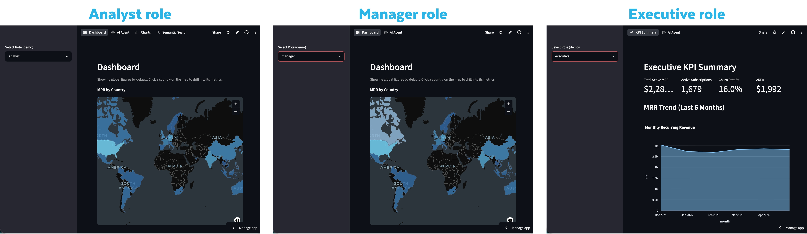
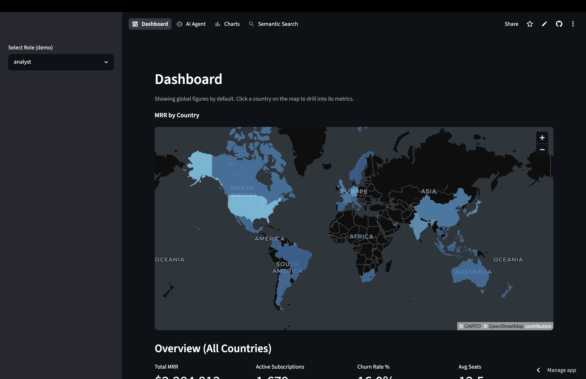
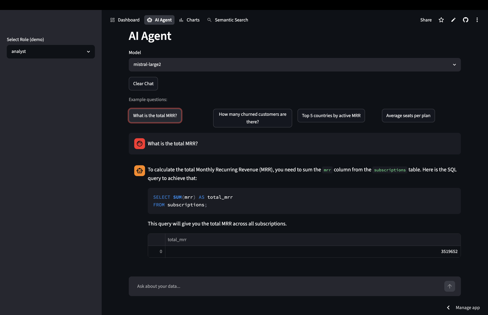
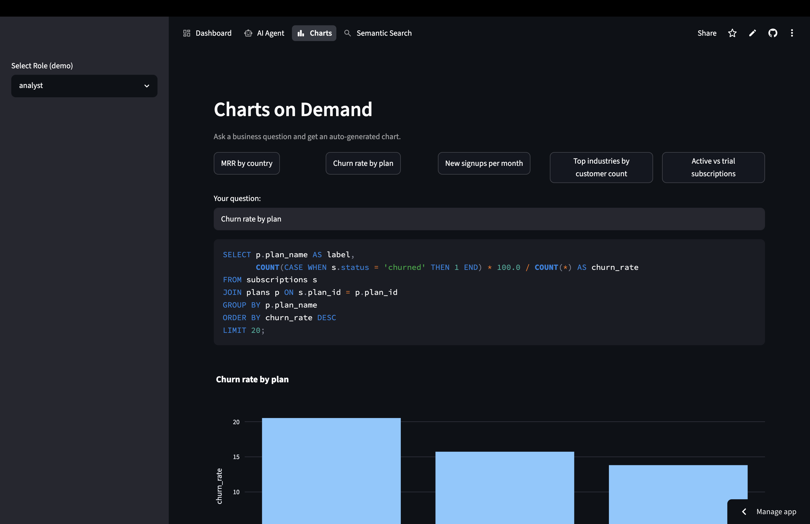
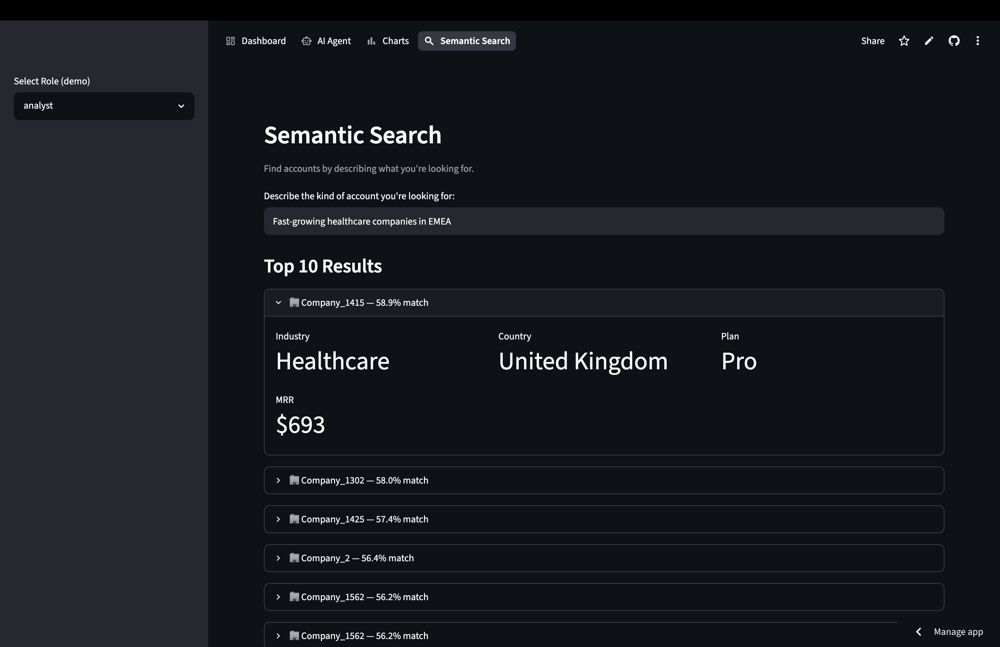

author: Chanin Nantasenamat, Elizabeth Christensen
id: build-an-agentic-analytics-dashboard-app
summary: Use Cortex Code to build an agentic analytics dashboard app with Streamlit, Snowflake Postgres, and Cortex AI, then deploy it to Streamlit in Snowflake and Streamlit Community Cloud. No prior app-building experience required.
categories: snowflake-site:taxonomy/solution-center/certification/quickstart,snowflake-site:taxonomy/product/ai,snowflake-site:taxonomy/product/applications-and-collaboration,snowflake-site:taxonomy/snowflake-feature/postgres
environments: web
status: Published
language: en
feedback link: https://github.com/Snowflake-Labs/sfguides/issues
tags: Getting Started, Streamlit, Snowflake Postgres, Cortex AI, Cortex Code

# Build an Agentic Analytics Dashboard App with Streamlit and Snowflake Postgres
<!-- ------------------------ -->
## Overview
Duration: 5

In this Quickstart, you will build an interactive web app backed by a **Snowflake Postgres** database powered by **Snowflake Cortex AI** and **Streamlit in Snowflake (SiS)**. The headline feature is a clickable world map: click any country and the whole page updates to that country's numbers.

The twist: you will not write the app by hand. You will build it with **Cortex Code**, Snowflake's AI coding assistant, by giving it plain English prompts in each step.

### New here? The 10-second glossary
- **Streamlit**: a Python framework for building data apps with no front-end code.
- **Snowflake Postgres**: a managed PostgreSQL database that runs inside your Snowflake account.
- **Cortex AI**: Snowflake's built-in AI you call with SQL, with no infrastructure to manage. Its LLM inference function (`SNOWFLAKE.CORTEX.COMPLETE`) runs leading large language models right next to your data (including OpenAI's GPT, Anthropic's Claude, and open-source models like Meta's Llama), plus text embeddings for semantic search. This app uses it for the AI Agent, Charts, and search.
- **Cortex Code**: an AI coding assistant you chat with; it writes the SQL and Python for you.
`
### How this Quickstart works
Each step gives you a **prompt** in a gray box. You paste that prompt into Cortex Code. Cortex Code reads a shared `AGENTS.md` file (which holds the exact database schema and rules), writes the SQL or Python, and you review and run it. You do not need to type code by hand, but you should read what it produces.

You can use [Cortex Code](https://docs.snowflake.com/en/user-guide/cortex-code/cortex-code) in any of these places (the prompts are identical):
- Cortex Code in Snowsight, Snowflake's web browser UI (no install needed)
- Cortex Code CLI, which runs in your terminal
- Cortex Code Desktop, a standalone AI-powered IDE for macOS and Windows

### What You Will Learn
- How to create a Snowflake Postgres database and fill it with realistic sample data
- How to build a multipage Streamlit app: dashboard, AI chat, charts, and search
- How to call Cortex AI from your app for natural language features
- How to deploy your app two ways: inside Snowflake and to Streamlit Community Cloud

### What You Will Build
A role-aware Streamlit app with an interactive **world map**, an adaptive KPI row, an **AI Agent** (ask questions in plain English), **Charts on Demand** (describe a chart and get it), and **semantic search** over your accounts.

The role-based access control (RBAC) functionality of the app is provided in the drop-down menu. In a practical setting, one can have the role be determined automatically based on the current roles of the logged in user.



### Prerequisites
- A **Snowflake account** (trial or paid). Start with a free trial account at [signup.snowflake.com](https://signup.snowflake.com?utm_source=snowflake-devrel&utm_medium=developer-guides).
- The `ACCOUNTADMIN` role (the default on a new trial).
- **Snowflake Postgres** available in your account's region.
- **Cortex Code** installed and connected to your account (see [Cortex Code setup](https://docs.snowflake.com/en/user-guide/cortex-code/cortex-code)).
- The **`AGENTS.md`** file from this Quickstart's repo, placed in your project folder. It tells Cortex Code the exact table names, allowed values, and gotchas so it generates correct code. Cortex Code loads it automatically.
- Helpful but **not required**: a little Python and SQL. Cortex Code writes both for you.

> Estimated total time: about 70 minutes. You can stop after the app works locally (through Step 5) and come back for the deploy steps (6 and 7) later.

> External Access Integrations (the feature that lets an app inside Snowflake call the public internet) are not available on trial accounts. This Quickstart is designed around that: you run locally and on Community Cloud against Postgres, and the in-Snowflake deploy uses **warehouse runtime** with the data on Snowflake.

<!-- ------------------------ -->
## Set Up Snowflake Postgres
Duration: 10

**What you'll do:** create a database, open network access to it, and create the Postgres instance.

A Postgres instance needs a *network policy* (a rule that says who can connect). Paste this into Cortex Code:

```text
I want to create a new Postgres instance. First create a database
(TUNDRA_DB) and set it as the current database, since network rules are
schema-scoped. Then create a network rule and network policy for my
Postgres instance allowing all IPv4 ingress (0.0.0.0/0) for lab purposes.
Use MODE = POSTGRES_INGRESS (Postgres ingress rules require this mode).
Name them tundra_lab_ingress and tundra_lab_policy.
```

Now create the instance and capture the password it generates:

```text
Create a Snowflake Postgres instance called tundra_lab with the STANDARD_M
compute family, 10GB storage, Postgres version 18, and network policy
tundra_lab_policy. Then show me the connection details and the generated
admin password, and save the connection details.
```

> Save the admin password now. Snowflake shows it only once, at creation time. You will paste it into a secrets file in Step 3. (If you lose it, you can reset it on the instance later.)

Confirm the connection works:

```text
Gather the connection details (host, port, user, dbname, password) for my
tundra_lab instance, connect to it, and confirm the connection is working.
```

**Checkpoint:** Cortex Code reports a successful connection to `tundra_lab` and shows you the host and port.

<!-- ------------------------ -->
## Generate the Synthetic SaaS Dataset
Duration: 10

**What you'll do:** ask Cortex Code to fill the database with realistic, made-up data for a fictional B2B SaaS company. Nothing is real. It is generated with SQL.

Here is the data you will create:

| Table | Rows | What it holds |
|---|---|---|
| `countries` | ~30 | Country code, name, region, latitude/longitude (for the map) |
| `plans` | 3 | Starter / Pro / Enterprise pricing and features |
| `customers` | ~2000 | Companies, industry, and a short text description |
| `subscriptions` | ~2500 | Plan, seats, monthly revenue (MRR), and status |
| `usage_events` | ~50000 | Product usage events over the last 12 months |
| `invoices` | ~12 per active subscription | Monthly billing with realistic growth |

Paste this prompt:

```text
Connect to my tundra_lab Postgres instance and generate a synthetic Global
SaaS Analytics dataset in the public schema. Use generate_series() and
random() (call setseed() first) to create: countries (~30, real ISO-3
codes + coordinates), plans (Starter/Pro/Enterprise with a features TEXT[]),
customers (~2000 with industry, account_tier, and a short description),
subscriptions (~2500; status in active/trial/churned; ~15% churned; mrr =
plan price * seats), usage_events (~50000 over 12 months with JSONB
metadata), and invoices (one per active subscription per month for 12
months). Make invoice revenue realistic, not flat: a growth ramp
(1 + 0.025 * month_index), monthly seasonality, and +/-10% per-invoice
noise. Add indexes on the foreign keys and country_code.
```

> A flat revenue line is the most common mistake here. The growth ramp + seasonality + noise above are what make the dashboard's trend chart look realistic.

Verify the load:

```text
Verify the Tundra data loaded: count rows in each table, confirm ~15% of
subscriptions are 'churned', that monthly invoice revenue is NOT flat, and
show total MRR and active subscriptions by country_code (top 10).
```

**Checkpoint:** row counts roughly match the table above, about 15% of subscriptions are `churned`, and a handful of countries have noticeably more MRR than others (so the map will have variation).

<!-- ------------------------ -->
## Scaffold and Run the App Locally
Duration: 10

**What you'll do:** set up the project files and run a tiny version of the app on your laptop to confirm everything connects. Building locally first makes problems easy to spot.

```text
Scaffold the local project for my Tundra Analytics app: a src/ Python
package (empty src/__init__.py) and a top-level streamlit_app.py. We build
and run locally first, then deploy later.
```

Ask Cortex Code to create a `pyproject.toml` with `streamlit>=1.50`, `psycopg2-binary`, `snowflake-snowpark-python`, `pandas`, `plotly>=5.18`, and `pydeck>=0.9`. Then create `.streamlit/secrets.toml`, which holds your credentials and stays on your machine:

```toml
[postgres]
host = "<your-instance-host>"
port = 5432
dbname = "postgres"
user = "<admin-user>"
password = "<admin-password>"

[snowflake]
account = "<account>"
user = "<user>"
password = "<password>"
warehouse = "COMPUTE_WH"
```

> Where do these values come from? The `[postgres]` values are the connection details from Step 1. The `[snowflake]` values let the app call Cortex AI; for local testing you can copy `account`, `user`, and `password` from your Snowflake CLI connection file at `~/.snowflake/connections.toml`. If your account signs in with SSO (no password), use `authenticator = "PROGRAMMATIC_ACCESS_TOKEN"` and a `token` instead of `password`.

> Never commit `secrets.toml` to Git. The next steps add it to `.gitignore`. If the `[snowflake]` values are wrong, the AI pages later fail with error `250001 (08001)`.

Now create a minimal `streamlit_app.py` that connects to Postgres and shows the customer count, then run it:

```bash
streamlit run streamlit_app.py
```

**Checkpoint:** your browser opens the app and it displays the number of customers from your database.

<!-- ------------------------ -->
## Build the Dashboard with an Interactive World Map
Duration: 15

**What you'll do:** create the reusable data layer, then the dashboard page with the clickable world map.

First, the data layer, two helper files the rest of the app uses:

```text
Create the data layer: src/db.py (psycopg2 with @st.cache_resource +
auto-reconnect, run_query, run_query_df, get_schema_context, using
st.secrets["postgres"] with sslmode=require) and src/cortex.py (a Snowpark
session that works both inside Snowflake and locally via
st.secrets["snowflake"]; cortex_complete using SNOWFLAKE.CORTEX.COMPLETE and
cortex_embed using EMBED_TEXT_1024 with snowflake-arctic-embed-l-v2.0).
Follow AGENTS.md.
```

Now the dashboard:

```text
Build src/dashboard.py following AGENTS.md. Add an interactive DARK world
map of filled, clickable country polygons colored by active MRR (bundle the
GeoJSON; match on ADM0_A3). Clicking a country drives the whole page (no
selection = global). Below the map: ONE adaptive row of 4 metric cards
(Total MRR, Active Subscriptions, Churn Rate %, Avg Seats) showing the full
country name, an accounts table, and two side-by-side charts: a monthly
revenue line chart and a most-used plan features donut. Every query is
scoped to the selection and parameterized.
```

> A "donut" is a pie chart with a hole. "MRR" is Monthly Recurring Revenue. The map uses **PyDeck** (a mapping library that ships with Streamlit), so it works without any extra setup.

**Checkpoint:** the dashboard shows the world map with global numbers; clicking a country changes the metric cards, the table, and both charts.



<!-- ------------------------ -->
## Add AI Agent, Charts, and Semantic Search
Duration: 15

**What you'll do:** add the AI-powered pages and wire everything into a navigation menu.

```text
Build src/ai_agent.py: a Cortex chat that answers questions about the
Postgres data. Ground the system prompt in the AGENTS.md schema AND allowed
values (status is 'churned', never 'cancelled'). Add example-question
buttons rendered unconditionally; auto-run read SQL and require confirmation
for writes. Build src/chart_agent.py: natural language to a Plotly chart,
injecting the live schema + a worked example so generated SQL uses real
names. Then update streamlit_app.py to wire pages with st.navigation,
giving every st.Page a unique url_path.
```

Add executive views and semantic search:

```text
Add src/kpi_summary.py (executive KPIs + a 6-month revenue area chart) and
route pages by role (analysts, managers, executives). Then add semantic
search: enable pgvector, generate 1024-dim embeddings for each account
description with Cortex EMBED_TEXT_1024, store them in a customer_embeddings
table with an HNSW index, and add src/semantic_search.py that embeds the
user's query and ranks accounts by similarity. Add it to the analyst role.
```

> **Embeddings** turn text into a list of numbers that capture meaning, so "fast-growing healthcare companies" can match accounts even without exact keywords. **pgvector** is the Postgres extension that stores and searches them, and **HNSW** is just an index that makes that search fast. Generating embeddings for ~2000 accounts takes a few minutes, so run it once.

Finally, confirm the headline interaction:

```text
Audit src/dashboard.py so the world-map drill-down works end to end: exactly
ONE adaptive metric row, and the metrics, table, and BOTH charts all react
to the same selected country (none = global). Verify headlessly with AppTest
once global and once with a country selected, and report the before/after
numbers for the USA.
```

**Checkpoint:** the app has a top navigation bar (Dashboard, AI Agent, Charts, Semantic Search), the AI Agent answers a question like "What is the total MRR?", and search returns ranked accounts.

Here's how the created AI-powered pages would look like:

1. The AI agent page - ask the AI agent any question you'd like


2. The charts page - provide a description of the chart that you want to render


3. The semantic search page - enter a description of the desired results


<!-- ------------------------ -->
## Deploy to Streamlit in Snowflake (Warehouse Runtime)
Duration: 10

**What you'll do:** host the app *inside* Snowflake so anyone in your account can use it (no laptop required).

Streamlit in Snowflake has two runtimes. **Container runtime** can install any package and call the internet, but both need an External Access Integration (not available on trials). **Warehouse runtime** installs packages from Snowflake's built-in Anaconda channel and needs no internet, so on a trial we move the data into Snowflake and use warehouse runtime.

```text
My account can't use External Access Integrations. Make a COPY of the app in
a separate folder (sis/). In the copy, migrate the Tundra tables into
Snowflake (TUNDRA_DB.PUBLIC) and rewrite the data layer and SQL to query
Snowflake through the Snowpark session, so it needs no external network
access. Leave the original Postgres app untouched.
```

Cortex Code will translate the Postgres SQL to Snowflake SQL for you (for example, `TEXT[]` becomes `ARRAY`, `unnest()` becomes `LATERAL FLATTEN`, and pgvector search becomes `VECTOR_COSINE_SIMILARITY`). Then deploy:

```text
Create an environment.yml for warehouse runtime and create the Streamlit
object on warehouse runtime (no compute pool, no EAI) in TUNDRA_DB.PUBLIC
using COMPUTE_WH.
```

The `environment.yml` lists packages from the `snowflake` channel:

```yaml
name: tundra_app
channels:
  - snowflake
dependencies:
  - python=3.11
  - streamlit=1.52.2
  - snowflake-snowpark-python
  - pandas
  - plotly
  - pydeck
```

> For warehouse runtime, use `environment.yml` and do NOT include a `pyproject.toml` (it would switch the app to container runtime). On `CREATE STREAMLIT`, leaving out `RUNTIME_NAME` and `COMPUTE_POOL` selects warehouse runtime.

**Checkpoint:** open the app from Snowsight under **Projects → Streamlit**; every page loads with no internet access required.

<!-- ------------------------ -->
## Deploy to Streamlit Community Cloud (Optional)
Duration: 10

**What you'll do:** publish the original Postgres app to a public URL with Streamlit Community Cloud (free). It runs outside Snowflake and connects to your Postgres instance over the public ingress rule from Step 1, with no extra setup.

**Note:** If using natural language prompts to create files for the GitHub repo, it is recommended to perform the following in a Cortex Code CLI session. Alternatively, this can easily be done manually by downloading the app files from the SiS app on Snowflake, then manually create a GitHub repo and upload the app files to the repo.

```text
Create a GitHub repo called tundra-analytics and copy my Tundra app into it.
Create a requirements.txt (streamlit, psycopg2-binary,
snowflake-snowpark-python, pandas, plotly, pydeck) and a .gitignore that
includes .streamlit/secrets.toml so credentials are never committed.
```

Push the repo, then go to [share.streamlit.io](https://share.streamlit.io), connect your GitHub, pick the `tundra-analytics` repo, set the main file to `streamlit_app.py`, and in **Advanced settings → Secrets** paste the same `[postgres]` and `[snowflake]` sections from your local `secrets.toml`.

**Checkpoint:** your app is live at a public `streamlit.app` URL.

<!-- ------------------------ -->
## Conclusion And Resources
Duration: 5

Congratulations! You've built **Tundra Analytics** with Cortex Code. This Streamlit app runs on Snowflake Postgres with LLM-powered inference from Cortex AI. You've learned how to deploy the app on both the Snowflake platform and to a public URL on Streamlit Community Cloud. And you did all of this without writing the code by hand.

### What You Learned
- Creating a Snowflake Postgres database and generating realistic sample data
- Building a multipage Streamlit app with a world map, an AI agent, charts, and semantic search
- Calling Cortex AI (`SNOWFLAKE.CORTEX.COMPLETE(` and `SNOWFLAKE.CORTEX.EMBED_TEXT_1024`) from a Streamlit app
- Deploying to Streamlit in Snowflake (warehouse runtime) and to Streamlit Community Cloud

### Related Resources
- [Snowflake Postgres documentation](https://docs.snowflake.com/en/user-guide/snowflake-postgres/about)
- [Streamlit in Snowflake](https://docs.snowflake.com/en/developer-guide/streamlit/about-streamlit)
- [Snowflake Cortex AI functions](https://docs.snowflake.com/en/user-guide/snowflake-cortex/llm-functions)
- [Cortex Code](https://docs.snowflake.com/en/user-guide/cortex-code/cortex-code)
- [Streamlit documentation](https://docs.streamlit.io/)
