id: build-an-ai-assistant-for-fsi-with-aisql-and-snowflake-intelligence
summary: Build an AI-powered Stock Selection Agent with Snowflake AI Functions and Snowflake Intelligence for natural language banking analytics on unstructured data.
categories: snowflake-site:taxonomy/solution-center/certification/quickstart, snowflake-site:taxonomy/product/ai, snowflake-site:taxonomy/product/analytics, snowflake-site:taxonomy/snowflake-feature/snowflake-intelligence, snowflake-site:taxonomy/industry/financial-services, snowflake-site:taxonomy/snowflake-feature/cortex-search, snowflake-site:taxonomy/snowflake-feature/document-ai, snowflake-site:taxonomy/solution-center/certification/certified-solution
environments: web
language: en
status: Published
author: Becky O'Connor, Colm Moynihan
feedback link: https://github.com/Snowflake-Labs/sfguickstarts/issues
tags: Cortex AI, Snowflake Intelligence, Document AI, Financial Services, Agents, RAG, Text-to-SQL, Machine Learning


# Build an AI Assistant for FSI using AI SQL and Snowflake Intelligence

<!-- ------------------------ -->

## Overview

### Introduction

Effective stock selection relies on having up-to-date data from diverse sources—research analyst reports, 10-K filings, investor call recordings, historical tick data, and real-time market feeds. To manage this efficiently, a unified platform is essential—one capable of storing and processing all data types, whether PDFs of analyst reports, MP3 investor recordings, or SEC documents.

This data must be readily accessible for analysis using the latest large language models (LLMs) such as Anthropic, Gemma, LLaMA, or DeepSeek. Ensuring the trustworthiness and security of generated summaries and insights is critical, especially when they inform high-stakes financial decisions.

In addition, developing Agentic AI capabilities allows for natural language question-answering tailored to investors and traders who need precise, real-time insights before executing trades.

**In this hands-on lab, you'll learn how to build a Stock Selection Agent from the ground up using the Snowflake AI Data Cloud.**

Learn how you can leverage the latest AI technologies right within the Snowflake platform. When AI is deeply embedded in your trusted data platform, the possibilities are endless. We will be exploring the processing of both **Unstructured** and **Structured** data which will then allow the application of a **Cortex Agent** to help discover insights by leveraging **All Data.**

### Data Sources and Analyst Coverage

This hands-on lab utilizes a comprehensive dataset spanning multiple data types and financial analysts to demonstrate real-world AI applications in financial services. You'll work with:

**Analyst Research Reports**

The lab features comprehensive analysis from specialized research firms created specifically for this hands-on experience:

- **Apex Analytics** - Growth-focused equity research
- **Consensus Point** - Institutional-grade analysis and recommendations
- **Momentum Metrics** - Quantitative trading insights and momentum analysis
- **Pinnacle Growth Investors** - Growth equity research and sector analysis
- **Quant-Vestor** - Quantitative investment research and algorithmic trading insights
- **Sterling Partners** - Value-oriented investment analysis
- **Veridian Capital** - Comprehensive equity research and market analysis

**Multi-Modal Data Integration**

Throughout the lab, you'll process and analyze:

- **Research Reports** - 30 analyst reports from 6 research firms, extract structured insights (ratings, price targets, growth forecasts) using Document AI
- **Earnings Call Transcripts** - Process 92 audio recordings from 11 companies into searchable text with sentiment analysis
- **Financial Infographics** - Extract key metrics from 11 quarterly earnings visuals using multimodal AI
- **Analyst Emails** - 950+ professional analyst emails with 7 rating types (BUY, OVERWEIGHT, OUTPERFORM, HOLD, EQUAL-WEIGHT, UNDERWEIGHT, SELL)
- **Investment Research** - 7 Federal Reserve and NBER research papers on portfolio management and risk
- **Stock Price Data** - Historical data with 6,420+ Snowflake price points (2020-2025)
- **Financial Reports** - 11 companies with income statements, KPIs, and customer metrics

**AI-Powered Analysis Journey**

Your AI assistant will synthesize insights from all these sources to answer questions like:

- *"What do Apex Analytics and Consensus Point analysts say about Snowflake's growth prospects?"*
- *"How does Momentum Metrics' quantitative analysis compare to Sterling Partners' value assessment?"*
- *"What are Veridian Capital's latest price targets and how do they align with earnings call sentiment?"*
- *"Based on all available data, should I buy, sell, or hold Snowflake shares?"*

This diverse dataset enables you to experience how modern AI can unify structured financial data with unstructured analyst opinions, creating comprehensive investment intelligence.

> **⚠️ Important Disclaimer:** All analyst reports and company data (except Snowflake) are completely fictitious for educational purposes. Financial decisions cannot be made based on any outcomes of this lab. Snowflake earnings calls are real but may be outdated.

### What You'll Build

In this quickstart, you'll build a comprehensive AI-powered financial analysis platform called **StockOne** using Snowflake's Cortex AI capabilities. This end-to-end solution demonstrates how to:

- Process unstructured financial documents (PDFs, HTML) with **Document AI**
- Transcribe and analyze earnings call audio with **AI Transcribe** and **AI Sentiment**
- Create intelligent search experiences with **Cortex Search Services**
- Build natural language data queries with **Cortex Analyst** and semantic views
- Deploy conversational AI agents with **Snowflake Intelligence**
- Train and deploy ML models for stock price prediction

### What You'll Learn

- How to extract structured data from unstructured financial documents
- How to build and configure Cortex Search Services for RAG applications
- How to create Cortex Analyst semantic views for business intelligence
- How to use Snowflake Intelligence agents with multiple tools
- How to integrate the Cortex Agents REST API with Feedback API
- How to deploy production-ready Streamlit applications in Snowflake

### What You'll Need

- A Snowflake account (free trial works for most features) with **ACCOUNTADMIN** access
- Web browser (Chrome, Firefox, or Safari)
- Basic knowledge of SQL
- 15-20 minutes for deployment

**No downloads or CLI tools required!** Deploy directly from GitHub using Snowflake's Git integration.

> **⚠️ Note for Trial Accounts:** The **Web Search** agent tool requires **External Access Integration**, which is not enabled by default on trial accounts. If you need this feature, contact your Snowflake representative to have it enabled. All other features (Document AI, Cortex Search, Cortex Analyst, ML predictions, email notifications) work without this.

### Assets Created

By the end of this lab, you'll have deployed:

- **11 Companies** of synthetic financial data
- **4,391 Social Media + News Items** (3 languages, geolocation, images)
- **950+ Emails** previews across all tickers
- **850+ Financial Reports** extracted with AI
- **22 Annual Reports** with embedded SVG charts
- **5 Cortex Search Services** for semantic search
- **2 Cortex Analyst Semantic Views** for text-to-SQL
- **1 Streamlit Application** (StockOne) with REST API integration
- **1 SnowMail Email Viewer** (Native App)
- **4 Snowflake Notebooks** for data processing and ML
- **1 Pre-trained ML Model** for stock prediction (GPU-accelerated)

<!-- ------------------------ -->

## Architecture Overview

### Multi-Modal AI Platform

This quickstart deploys a **complete multi-modal AI platform** combining:

**Unstructured Data** → **AI Processing** → **Structured Data** → **AI Services** → **Applications**

**Data Types**:

- 📄 Documents (PDFs, HTML, Markdown)
- 🎙️ Audio (MP3 earnings calls, interviews)
- 📸 Images (Charts, social media photos, executive portraits)
- 📱 Social Media (Posts, news articles, cross-company mentions)
- 📊 Structured (Tables with 10,000+ rows)

**AI Capabilities**:

- Document AI (AI_PARSE_DOCUMENT, AI_EXTRACT)
- Audio AI (AI_TRANSCRIBE with timestamps)
- Vision AI (AI_CLASSIFY, AI_FILTER on images)
- Translation AI (AI_TRANSLATE for multi-language)
- Aggregation AI (AI_AGG without context limits)
- Geospatial AI (ST_MAKEPOINT, ST_DISTANCE)

**Latest AISQL Syntax**: All examples use 2025 AI_* functions

### System Architecture

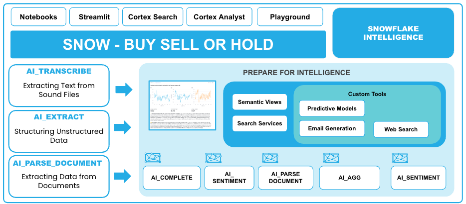

### Key Technologies

- **Cortex AI Functions**: AI_EXTRACT, AI_PARSE_DOCUMENT, AI_TRANSCRIBE, AI_SENTIMENT, AI_COMPLETE
- **Cortex Search**: 5 search services (created in Notebook 4) for semantic search and RAG
- **Cortex Analyst**: 2 semantic views for natural language SQL
- **Snowflake Intelligence**: Conversational agents with tool orchestration
- **Document AI**: Automated document processing at scale
- **Snowpark ML**: GPU-accelerated model training and inference

<!-- ------------------------ -->

## Setup Your Environment

### Step 1: Get a Snowflake Account

**Option A - Free Trial** (Recommended):

1. Visit https://signup.snowflake.com/
2. Sign up for a free 30-day trial
3. Choose **Enterprise** edition
4. Select a cloud region (AWS, Azure, or GCP)
5. Verify your email
6. Log in to Snowsight (https://app.snowflake.com)

**Option B - Existing Account**:

- Use any Snowflake account with ACCOUNTADMIN access
- Log in to Snowsight
- No special setup required

### Step 2: Connect to GitHub Repository in Snowflake

**Deploy directly from GitHub - No downloads or CLI tools needed!**

#### Step 2a: Create Git Integration (One-Time Setup)

1. In **Snowsight**, click on **Projects**
2. Select **Workspaces**
3. Add new **SQL file**
4. Copy and paste this script:

```sql
-- Setup Git Integration (one-time)
-- This creates a SEPARATE database for Git repos so you can drop/recreate 
-- ACCELERATE_AI_IN_FSI without losing the Git integration

USE ROLE ACCOUNTADMIN;

-- Create SEPARATE database for Git repositories (won't be dropped with main database)
CREATE DATABASE IF NOT EXISTS SNOWFLAKE_QUICKSTART_REPOS
    COMMENT = 'Persistent database for Git repository integrations - DO NOT DROP';
CREATE SCHEMA IF NOT EXISTS SNOWFLAKE_QUICKSTART_REPOS.GIT_REPOS;

USE DATABASE SNOWFLAKE_QUICKSTART_REPOS;
USE SCHEMA GIT_REPOS;

-- Create API integration for GitHub
CREATE OR REPLACE API INTEGRATION git_api_integration
    API_PROVIDER = git_https_api
    API_ALLOWED_PREFIXES = ('https://github.com/Snowflake-Labs/')
    ENABLED = TRUE;

-- Grant usage on API integration
GRANT USAGE ON INTEGRATION git_api_integration TO ROLE ACCOUNTADMIN;

-- Create Git repository object
CREATE OR REPLACE GIT REPOSITORY SNOWFLAKE_QUICKSTART_REPOS.GIT_REPOS.ACCELERATE_AI_IN_FSI_REPO
    API_INTEGRATION = git_api_integration
    ORIGIN = 'https://github.com/Snowflake-Labs/sfguide-Build-an-AI-Assistant-for-FSI-with-AISQL-and-Snowflake-Intelligence.git';

-- Grant READ permission on Git repository
GRANT READ ON GIT REPOSITORY SNOWFLAKE_QUICKSTART_REPOS.GIT_REPOS.ACCELERATE_AI_IN_FSI_REPO TO ROLE ACCOUNTADMIN;

-- Fetch code from GitHub
ALTER GIT REPOSITORY SNOWFLAKE_QUICKSTART_REPOS.GIT_REPOS.ACCELERATE_AI_IN_FSI_REPO FETCH;

SELECT 'Git integration ready!' AS status,
       'Git repo is in SNOWFLAKE_QUICKSTART_REPOS database (separate from main database)' AS note;
```

4. Click **Run** (or press Cmd/Ctrl + Enter)
5. Wait for completion (~30 seconds)
6. ✅ **Git integration complete!** You're now connected to GitHub

#### Step 2b: Access Git Repository in Snowflake UI

Now will create a workspace from the github repository

1. Create a Workspace from Github repository by clicking on My Workspace, then select the option **From Git repository**
  
   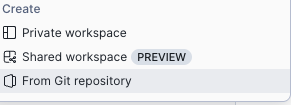

2. When Prompted, populate the following screen
   
    

    Use the following URL in the **Repository URL** field:
  
```text    
https://github.com/Snowflake-Labs/sfguide-Build-an-AI-Assistant-for-FSI-with-AISQL-and-Snowflake-Intelligence.git
```
3. Press **Create**

**You should see the repository file structure:**

```
├── README.md                   
├── LICENSE                     
├── .gitignore
└── assets/
    ├── sql/                    ← Deployment scripts (START HERE)
    ├── data/                   ← CSV/Parquet files
    ├── documents/              ← PDFs, images, audio
    ├── Notebooks/              ← Snowflake notebooks
    ├── Streamlit/              ← StockOne application
    ├── native_app_snowmail/    ← SnowMail Native App
    └── semantic_models/        ← YAML definitions
```

1. **Navigate to `assets/sql/`** - This is where the deployment scripts are
2. You'll see SQL files numbered 01-08 (plus optional 05b for GPU)

✅ **You're now ready to deploy!**

---

### Step 3: Deploy from GitHub (Choose Method)

**Option A: Execute all at once** (in one worksheet):

```sql
-- Run deployment scripts directly from GitHub (fully qualified names)
EXECUTE IMMEDIATE FROM @SNOWFLAKE_QUICKSTART_REPOS.GIT_REPOS.ACCELERATE_AI_IN_FSI_REPO/branches/main/assets/sql/01_configure_account.sql;
EXECUTE IMMEDIATE FROM @SNOWFLAKE_QUICKSTART_REPOS.GIT_REPOS.ACCELERATE_AI_IN_FSI_REPO/branches/main/assets/sql/02_data_foundation.sql;
EXECUTE IMMEDIATE FROM @SNOWFLAKE_QUICKSTART_REPOS.GIT_REPOS.ACCELERATE_AI_IN_FSI_REPO/branches/main/assets/sql/03_deploy_cortex_analyst.sql;
EXECUTE IMMEDIATE FROM @SNOWFLAKE_QUICKSTART_REPOS.GIT_REPOS.ACCELERATE_AI_IN_FSI_REPO/branches/main/assets/sql/04_deploy_streamlit.sql;
EXECUTE IMMEDIATE FROM @SNOWFLAKE_QUICKSTART_REPOS.GIT_REPOS.ACCELERATE_AI_IN_FSI_REPO/branches/main/assets/sql/05_deploy_notebooks.sql;
-- Optional GPU notebook (skip if unavailable):
-- EXECUTE IMMEDIATE FROM @SNOWFLAKE_QUICKSTART_REPOS.GIT_REPOS.ACCELERATE_AI_IN_FSI_REPO/branches/main/assets/sql/05b_deploy_gpu_notebook.sql;
EXECUTE IMMEDIATE FROM @SNOWFLAKE_QUICKSTART_REPOS.GIT_REPOS.ACCELERATE_AI_IN_FSI_REPO/branches/main/assets/sql/06_deploy_documentai.sql;
EXECUTE IMMEDIATE FROM @SNOWFLAKE_QUICKSTART_REPOS.GIT_REPOS.ACCELERATE_AI_IN_FSI_REPO/branches/main/assets/sql/07_deploy_snowmail.sql;
EXECUTE IMMEDIATE FROM @SNOWFLAKE_QUICKSTART_REPOS.GIT_REPOS.ACCELERATE_AI_IN_FSI_REPO/branches/main/assets/sql/08_custom_agent_tools.sql;
```

**Option B: Use Git Repositories UI** (interactive):

1. Navigate: **Projects** → **Git Repositories** → **SNOWFLAKE_QUICKSTART_REPOS.GIT_REPOS.ACCELERATE_AI_IN_FSI_REPO**
2. Browse to: `assets/sql/`
3. Right-click each file (01-08) → "Open in new worksheet"
4. Execute each script in order

**What gets deployed**:

1. ✅ Database `ACCELERATE_AI_IN_FSI` with 3 schemas
2. ✅ Role `ACCOUNTADMIN` with CORTEX_USER privileges
3. ✅ 20+ tables with ~10,000 rows of data
4. ✅ 2 Cortex Analyst Semantic Views
5. ✅ 1 Snowflake Intelligence Agent
6. ✅ 2 Streamlit applications
7. ✅ 4-5 Notebooks (GPU notebook optional)
8. ✅ 1 Native App (SnowMail email viewer)
9. ✅ Stages with PDFs, audio files, and images

⚠️ **Note**: Search services are created later in **Notebook 4**, not during initial deployment.

**Deployment time**: 15-20 minutes

---

### Step 3: Verify Deployment

After deployment completes, verify in Snowflake UI:

```sql
-- Check all components
USE DATABASE ACCELERATE_AI_IN_FSI;

SHOW TABLES IN SCHEMA DEFAULT_SCHEMA;           -- Should see 20+ tables
SHOW SEMANTIC VIEWS IN SCHEMA CORTEX_ANALYST;   -- Should see 2 views
SHOW STREAMLITS IN SCHEMA STREAMLIT;            -- Should see STOCKONE_AGENT
SHOW NOTEBOOKS IN SCHEMA NOTEBOOKS;             -- Should see 4-5 notebooks
SHOW AGENTS IN SCHEMA SNOWFLAKE_INTELLIGENCE.AGENTS; -- Should see FSI_STOCK_AGENT
```

⚠️ **Note**: Cortex Search Services will appear **after** you run Notebook 4.

**All set?** ✅ Continue to the next section!

<!-- ------------------------ -->

## Verify Your Deployment

After Git integration deployment completes, let's verify everything was created successfully.

### Check Database Objects

Open Snowflake UI and navigate to **Data** → **Databases** → **ACCELERATE_AI_IN_FSI**

You should see:

- ✅ **DEFAULT_SCHEMA** - Main data tables
- ✅ **DOCUMENT_AI** - Document processing tables
- ✅ **CORTEX_ANALYST** - Semantic views
- ✅ **NOTEBOOKS** - Snowflake notebooks
- ✅ **STREAMLIT** - Streamlit applications

### Verify Tables (20+)

```sql
USE DATABASE ACCELERATE_AI_IN_FSI;
USE SCHEMA DEFAULT_SCHEMA;

-- Show all tables
SHOW TABLES;

-- Verify key table counts
SELECT 'FINANCIAL_REPORTS' AS table_name, COUNT(*) AS rows 
FROM DOCUMENT_AI.FINANCIAL_REPORTS
UNION ALL
SELECT 'EMAIL_PREVIEWS', COUNT(*) 
FROM DEFAULT_SCHEMA.EMAIL_PREVIEWS
UNION ALL
SELECT 'STOCK_PRICES', COUNT(*) 
FROM DEFAULT_SCHEMA.STOCK_PRICES
UNION ALL
SELECT 'TRANSCRIBED_EARNINGS_CALLS_WITH_SENTIMENT', COUNT(*) 
FROM DEFAULT_SCHEMA.TRANSCRIBED_EARNINGS_CALLS_WITH_SENTIMENT;
```

**Expected Results**:

- FINANCIAL_REPORTS: **850 rows** (11 companies)
- STOCK_PRICES: **6,420 rows** (Snowflake stock)
- TRANSCRIBED_EARNINGS_CALLS_WITH_SENTIMENT: **1,788 rows**
- EMAIL_PREVIEWS: **324 rows** (email metadata)

⚠️ **Note**: The following are created **during the notebooks**, not during initial deployment:

- **Notebook 1 creates**: `EMAIL_PREVIEWS_EXTRACTED`, `PARSED_ANALYST_REPORTS`, `AI_EXTRACT_ANALYST_REPORTS_ADVANCED`, `FINANCIAL_REPORTS`, `INFOGRAPHIC_METRICS_EXTRACTED`
- **Notebook 2 creates**: `TRANSCRIBED_EARNINGS_CALLS`, `SENTIMENT_ANALYSIS`, `TRANSCRIPTS_BY_MINUTE`
- **Notebook 4 creates**: `call_embeds`, `FULL_TRANSCRIPTS`, `INFOGRAPHICS_FOR_SEARCH`, `SENTIMENT_WITH_TRANSCRIPTS_FOR_SEARCH`, and all 5 **Cortex Search Services**

### Verify Semantic Views (2)

```sql
SHOW SEMANTIC VIEWS IN ACCELERATE_AI_IN_FSI.CORTEX_ANALYST;
```

You should see:

- ✅ COMPANY_DATA_8_CORE_FEATURED_TICKERS
- ✅ SNOWFLAKE_ANALYSTS_VIEW

### Verify Applications

**Streamlit**:

```sql
SHOW STREAMLITS IN ACCELERATE_AI_IN_FSI.STREAMLIT;
```

- ✅ STOCKONE_AGENT

**Notebooks**:

```sql
SHOW NOTEBOOKS IN ACCELERATE_AI_IN_FSI.NOTEBOOKS;
```

- ✅ 1_EXTRACT_DATA_FROM_DOCUMENTS
- ✅ 2_ANALYSE_SOUND
- ✅ 3_build_quantitive_model
- ✅ 4_CREATE_SEARCH_SERVICE

**All verified?** ✅ Let's start using the AI features!

<!-- ------------------------ -->

## AI & ML Studio

### Snowflake AI and ML Studio

Before diving into the notebooks, let's explore the **AI & ML Studio** - your one-stop shop for trying out AI functions using a user-friendly UI.

Navigate to the **AI & ML** section in the Snowflake navigation bar.

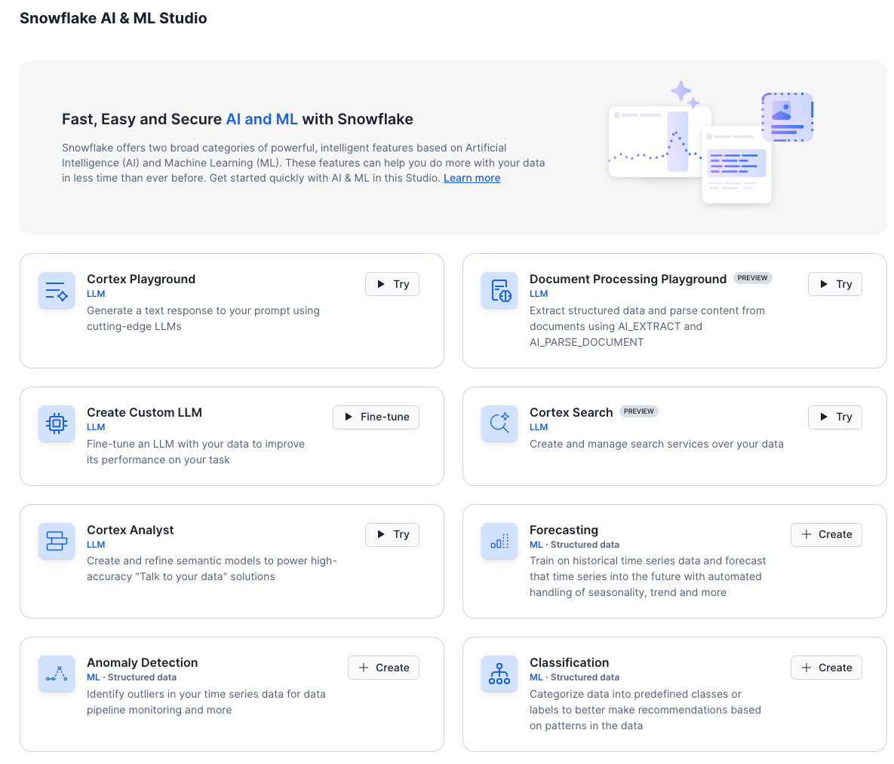

### Features You'll Explore

The AI and ML Studio provides access to:

- **Cortex Playground** - Compare text completions across multiple LLMs
- **Cortex Fine Tuning** - Customize large language models for specific tasks
- **Cortex Search** - Low-latency semantic search over your data
- **Cortex Analyst** - Text-to-SQL for business intelligence
- **Document Processing Playground** - Explore AI_EXTRACT and AI_PARSE_DOCUMENT functions

---

### Cortex Playground

The Cortex LLM Playground lets you compare text completions across multiple large language models available in Cortex AI.

**Try it now:**

1. Click on **Cortex Playground** in the AI & ML Studio
2. Select a model (e.g., `claude-4-sonnet`, `llama-3.1-70b`, `mistral-large2`)
3. Try asking a financial question:

**Example prompt:**

> "Should I buy Snowflake stock? What factors should I consider before making this financial decision?"

**What you'll see:**
The model will suggest various factors to consider:

- Company financial performance
- Market conditions
- Analyst opinions
- Industry trends
- Risk factors

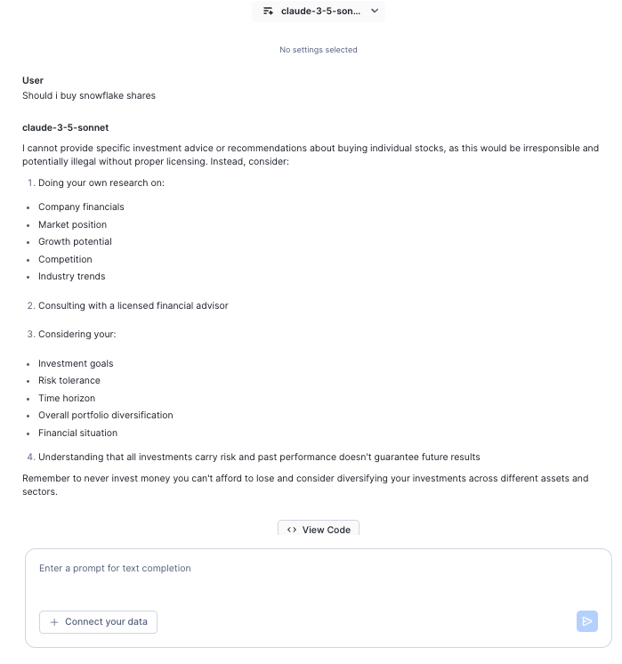

**Key insight**: Notice how the model doesn't make a direct recommendation - this demonstrates responsible AI. All the information suggested (analyst reports, earnings calls, financial metrics) is available in the datasets you'll be working with in this lab.

---

### Document Processing Playground

Now let's explore how to extract text and data from documents. The Document Processing Playground provides a UI for testing **AI_EXTRACT** and **AI_PARSE_DOCUMENT** functions.

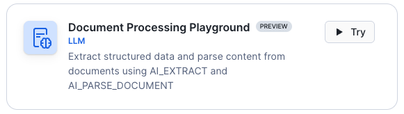

#### Step 1: Upload Documents from Stage

1. Click **Document Processing Playground** in the AI & ML Studio
2. Click **Add from stage**


3. Select the following:
   - **Database**: `ACCELERATE_AI_IN_FSI`
   - **Schema**: `DOCUMENT_AI` (contains sample PDF documents)
   - **Stage**: `ANALYST_REPORTS` (contains analyst report PDFs)
4. Choose 1-3 analyst report PDF documents

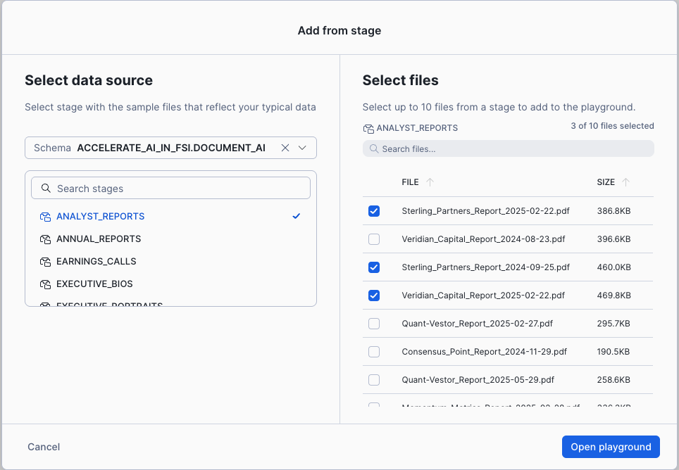

5. Click **Open playground**

#### Step 2: Extract Information Using Questions

Once your document is loaded, you'll see three tabs: **Extraction**, **Markdown**, and **Text**.

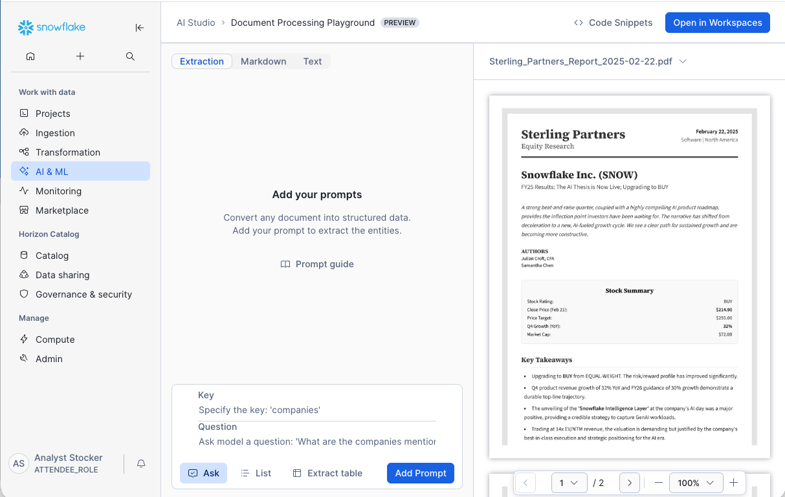

The **Extraction** tab is where you can ask questions to pull specific information from the document.

**Try creating these key-value question pairs:**

- **Key**: `company_name`**Question**: `What is the name of the company?`
- **Key**: `revenue`**Question**: `What is the total revenue mentioned?`
- **Key**: `date`**Question**: `What is the report date?`
- **Key**: `rating`
  **Question**: `What is the analyst rating (BUY, SELL, HOLD)?`

After entering each question, click **Add Prompt** to see the extracted results.

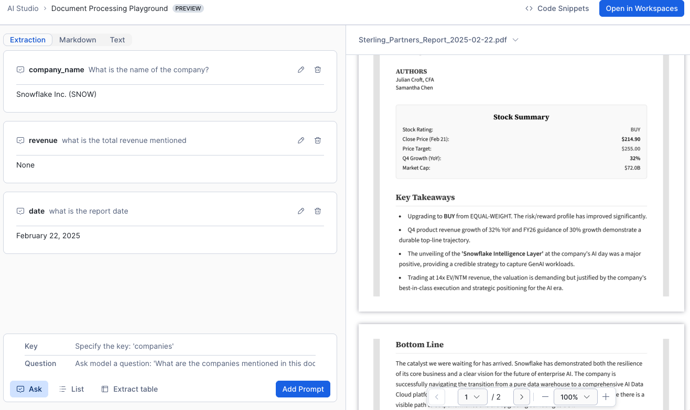

#### Step 3: View Different Document Formats

The playground provides three different views:

- **Extraction tab**: Shows answers to your questions using AI_EXTRACT
- **Markdown tab**: Displays document structure in markdown format (LAYOUT mode from AI_PARSE_DOCUMENT)
- **Text tab**: Shows raw text extracted from the document (OCR mode from AI_PARSE_DOCUMENT)

Click through each tab to see how the document is processed differently.

#### Step 4: Get the SQL Code

Once you've asked at least one question, the playground automatically generates SQL code:

1. Click **Code Snippets** in the top right corner

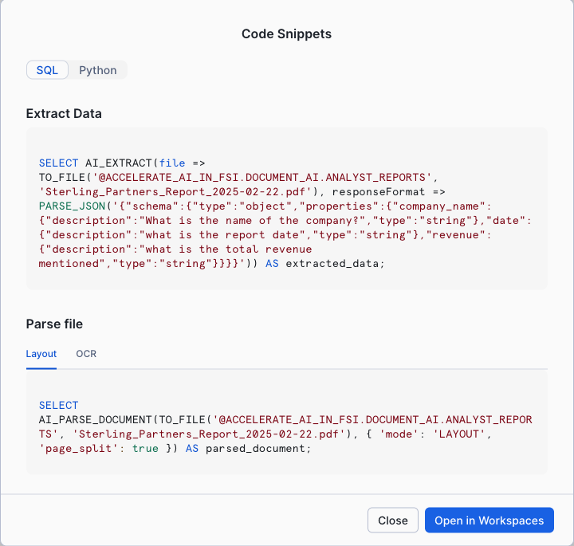

2. Review the generated SQL using AI_EXTRACT and AI_PARSE_DOCUMENT functions
3. Click **Workspaces** to open the code in a new worksheet

**Example generated code:**

```sql
-- AI_EXTRACT
SELECT
  AI_EXTRACT(
    file => TO_FILE(
      '@ACCELERATE_AI_IN_FSI.DOCUMENT_AI.ANALYST_REPORTS',
      'Sterling_Partners_Report_2025-02-22.pdf'
    ),
    responseFormat => PARSE_JSON(
      '{"schema":{"type":"object","properties":{"company_name":{"description":"What is the name of the company?","type":"string"}}}}'
    )
  ) AS extracted_data;
```

This SQL code can be used to automate document processing at scale!

#### Step 5: Try Table Extraction

Let's extract structured tables from financial reports:

1. Close the playground and reopen Document Processing Playground
2. Within the same schema, select the stage **FINANCIAL_REPORTS**

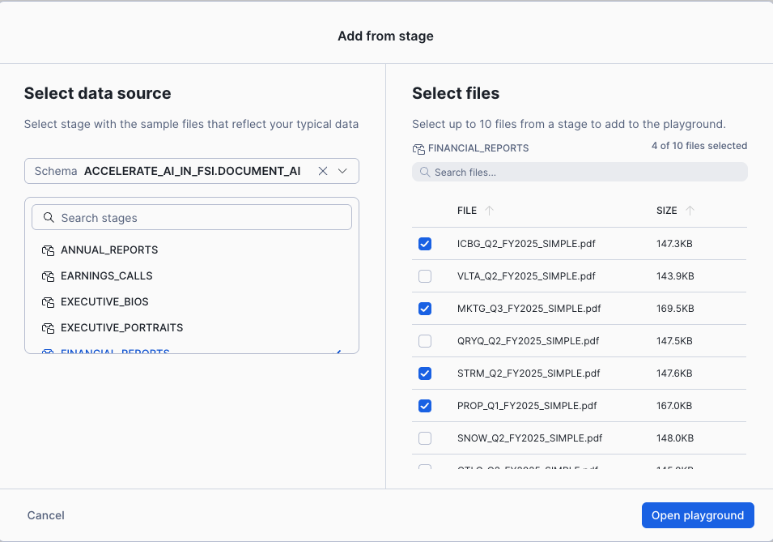

3. Select 1-2 financial report PDFs
4. Open the playground
5. In the prompt area, select **Extract table**

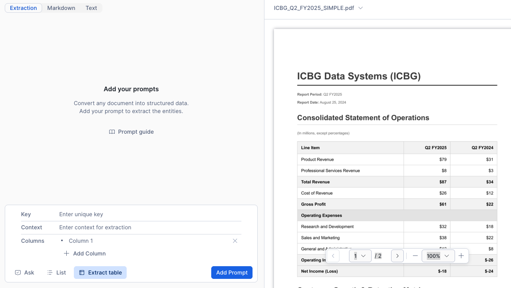

**Configure table extraction:**

- **Key**: `income_statement`
- **Context**: `Income statement showing revenue and expenses by quarter`
- **Columns**: Describe what to extract dynamically:
  - `Line Item` - The name of each financial line item
  - `Current Year` - Current year amount (let AI determine which column)
  - `Previous Year` - Previous year amount (let AI determine which column)

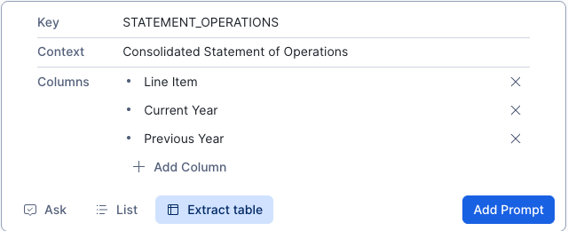

**Why dynamic column names?**
Notice we used "Current Year" and "Previous Year" instead of specific years like "2024" and "2023". AI_EXTRACT uses the LLM to intelligently map these generic descriptions to the actual column headers in the document, making the extraction work across different documents with different year labels.


**Why This Matters:**
These document processing capabilities are essential for the notebooks you'll run next. Understanding AI_EXTRACT and AI_PARSE_DOCUMENT helps you appreciate how the notebooks process financial reports, analyst documents, and unstructured data at scale.

---

### Summary: What You've Learned

Before proceeding to the notebooks, you now understand:

✅ **Cortex Playground** - How to test LLM capabilities and prompt engineering
✅ **AI_PARSE_DOCUMENT** - Extract text and structure from PDFs
✅ **AI_EXTRACT** - Pull specific fields from documents using questions
✅ **Table Extraction** - Extract structured tables with dynamic column mapping
✅ **SQL Code Generation** - Automating document processing at scale

**Next**: Apply these concepts in Notebook 1 to process hundreds of financial documents!

<!-- ------------------------ -->

## Document Extraction

### Overview

In this section, you'll process multiple types of unstructured financial documents using Cortex AI functions. You'll work with the AI capabilities you just explored in the Document Processing Playground, but now at scale across hundreds of documents.

**What You'll Process:**

- 📄 **30 Analyst Reports** (PDFs) - Multi-page research reports with ratings and analysis
- 📊 **11 Financial Reports** (PDFs) - Quarterly statements with income tables and KPIs
- 🖼️ **11 Infographics** (PNG images) - Visual earnings summaries with metrics
- 📧 **324 Analyst Emails** (HTML) - Financial communications with ratings and sentiment

**Cortex AI Functions You'll Use:**

- **AI_PARSE_DOCUMENT** - Extract all text from PDFs preserving layout
- **AI_COMPLETE** - Generate structured extractions using LLMs
- **AI_EXTRACT** - Pull specific fields, entities, or tables from documents
- **AI_AGG** - Summarize and aggregate text across multiple documents
- **AI_SENTIMENT** - Analyze emotional tone in financial communications

### Open Notebook 1

Navigate to **AI & ML Studio** → **Notebooks** → **1_EXTRACT_DATA_FROM_DOCUMENTS**

### What the Notebook Demonstrates

The notebook is organized into 4 parts:

**Part 1: Analyst Reports**

- Parse multi-page PDFs with AI_PARSE_DOCUMENT
- Extract structured fields (ratings, prices, growth) with AI_COMPLETE
- Summarize long documents with AI_AGG
- Interactive PDF viewer to validate extractions

**Part 2: Financial Reports**

- Extract tables (income statements, KPIs) with AI_EXTRACT
- Transform JSON arrays into queryable views
- Process structured financial data at scale

**Part 3: Infographics from Images**

- Extract data from PNG files (not just PDFs!)
- Process visual charts and metrics
- Handle diverse visual layouts

**Part 4: Email Analysis**

- Extract tickers and ratings from HTML content
- Analyze sentiment of financial communications
- Interactive email analytics dashboard

### Key Tables Created by This Notebook

After running this notebook, you'll have created:

- **PARSED_ANALYST_REPORTS** - Full text from 30 analyst reports
- **AI_EXTRACT_ANALYST_REPORTS_ADVANCED** - Structured data extracted from reports
- **FINANCIAL_REPORTS** - Extracted income statements and KPIs from 11 companies
- **INFOGRAPHIC_METRICS_EXTRACTED** - Key metrics from 11 earnings infographics
- **EMAIL_PREVIEWS_EXTRACTED** - Tickers, ratings, and sentiment from 324 emails

💡 **Note**: These tables are **not** pre-loaded during initial deployment. The notebook demonstrates the full extraction process using Cortex AI.

### Follow the Notebook

The notebook contains **detailed instructions and explanations** for each step. Simply:

1. Click **Start** to begin the notebook session
2. Read through each cell's markdown explanations
3. **Run All** or execute cells one by one
4. Observe the outputs and interactive visualizations

**Time**: Plan for 10-15 minutes to run through all cells and explore the results.

**Note**: All data is pre-loaded, so the AI extractions happen quickly for demonstration purposes.

<!-- ------------------------ -->

## Audio Analysis

### Overview

Process earnings call audio recordings using **AI_TRANSCRIBE** to convert speech to text, then analyze the content for sentiment and insights.

**What You'll Process:**

- 🎙️ **3 Snowflake Earnings Calls** (MP3 audio files from Q1, Q2, Q3 FY2025)
- 🗣️ **Speaker Identification** - Separate CEO, CFO, and analyst comments
- 💭 **Sentiment Analysis** - Measure emotional tone throughout the call
- 🔍 **Vector Embeddings** - Enable semantic search across transcripts

### Open Notebook 2

Navigate to **AI & ML Studio** → **Notebooks** → **2_ANALYSE_SOUND**

### What the Notebook Demonstrates

**AI_TRANSCRIBE** - Converts MP3 audio to timestamped text:

- Generates full transcripts with speaker identification
- Preserves timestamps for navigation
- Processes multi-speaker conversations

**AI_SENTIMENT** - Analyzes emotional tone:

- Scores sentiment segment by segment
- Identifies positive, negative, and neutral sections
- Tracks sentiment trends over time

**Vector Embeddings** - Enables semantic search:

- Creates embeddings with EMBED_TEXT_1024
- Splits text into searchable chunks
- Powers RAG (Retrieval Augmented Generation) applications

### Key Tables Created by This Notebook

After running this notebook, you'll have created:

- **TRANSCRIBED_EARNINGS_CALLS** - Full transcripts with speaker IDs and timestamps
- **SENTIMENT_ANALYSIS** - Sentiment scores for each transcript segment
- **TRANSCRIPTS_BY_MINUTE** - Minute-by-minute sentiment tracking

💡 **Note**: The `call_embeds` table (vector embeddings) is actually created in **Notebook 4**, not here.

### Follow the Notebook

The notebook includes:

- Audio file listings and metadata
- Transcription with AI_TRANSCRIBE
- Sentiment analysis with AI_SENTIMENT
- Vector embedding generation
- Interactive visualizations

Simply run through the cells to see how audio becomes searchable, analyzable data.

**Time**: 10-15 minutes to complete.

<!-- ------------------------ -->

## ML Model Training

### Overview

Build and deploy a **machine learning model** for stock price prediction using **Snowflake ML**. This notebook demonstrates GPU-accelerated model training and the Model Registry.

⚠️ **Note**: This notebook requires GPU compute pools which may not be available in all regions. If GPU is not available, a **pre-trained model** (`STOCK_RETURN_PREDICTOR_GBM`) is already deployed for you!

**What You'll Build:**

- 📊 **Feature Engineering** - Create technical indicators from price data
- 🤖 **ML Model Training** - Gradient boosting for stock return prediction
- 📦 **Model Registry** - Version and deploy models
- 🔮 **Batch Predictions** - Generate stock rankings
- ⚡ **GPU Acceleration** - 10-100x faster training

### Open Notebook 3

Navigate to **AI & ML Studio** → **Notebooks** → **3_BUILD_A_QUANTITIVE_MODEL**

### What the Notebook Demonstrates

**Feature Engineering**:

- Momentum ratios: r_1, r_5_1, r_10_5, r_21_10, r_63_21
- Forward-looking returns for prediction targets
- Handling stock splits in historical data

**Model Training**:

- Gradient Boosting Models (GBM) using LightGBM
- Training on historical technical indicators
- Model evaluation and validation

**Model Registry**:

- Versioning trained models
- Deploying to production
- Creating SQL functions for predictions

**GPU Benefits**:

- 10-100x faster training vs CPU
- Real-time hyperparameter experimentation
- Production-grade ML infrastructure

### The Pre-Trained Model

If GPU is not available, the agent can still use:

**Function**: `GET_TOP_BOTTOM_STOCK_PREDICTIONS(model_name, top_n)`

- Uses pre-trained `STOCK_RETURN_PREDICTOR_GBM` model
- Analyzes technical indicators for all stocks
- Returns top N and bottom N predicted performers

This powers the agent's ability to answer:

> "Give me top 3 vs bottom 3 trade predictions for the next period."

### Follow the Notebook

1. Run through cells to see model training
2. Observe model registry integration
3. Test predictions with the SQL function

**Time**: 15-20 minutes if training from scratch (pre-trained model saves time!)

<!-- ------------------------ -->

## Cortex Search Services

### Overview

Create **5 intelligent search services** that make your financial data instantly accessible using semantic search. This is the foundation for RAG (Retrieval Augmented Generation) applications.

**Why Search Services Matter:**

- Traditional keyword search fails with financial content ("revenue growth" vs "top-line expansion")
- Semantic search understands meaning and context
- Critical for AI agents to find relevant information quickly
- Powers the One Ticker agent you'll use later

**What You'll Build:**

1. **Analyst Sentiment Search** - Search 92 earnings call transcripts
2. **Full Earnings Calls** - Semantic search across chunked Snowflake transcripts
3. **Analyst Reports** - Search 30 reports with ratings and targets
4. **Infographics** - Search 11 company earnings visuals
5. **Email Content** - Search 950+ analyst emails

### Open Notebook 4

Navigate to **AI & ML Studio** → **Notebooks** → **4_CREATE_SEARCH_SERVICE**

### What the Notebook Demonstrates

**Cortex Search** provides:

- **Hybrid Search**: Combines vector (semantic) and keyword search
- **Zero Infrastructure**: No need to manage embeddings or indexes
- **Real-time Updates**: Automatically refreshes as data changes
- **SQL-Based Creation**: Define search services as code

**Creation Approach**:The notebook uses **programmatic SQL creation** (vs UI point-and-click) for:

- Reproducibility across environments
- Version control of search configurations
- Automation in CI/CD pipelines
- Clear documentation as code

### Key Search Services Created

Each search service targets a specific data type and use case:

1. **`dow_analysts_sentiment_analysis`** - Search transcripts by sentiment context
2. **`snow_full_earnings_calls`** - Search chunked call segments
3. **`ANALYST_REPORTS_SEARCH`** - Search reports by full text
4. **`INFOGRAPHICS_SEARCH`** - Search infographics and branding
5. **`EMAILS`** - Search emails by ticker, rating, or sentiment

### Tables Created by This Notebook

Before creating the search services, the notebook creates supporting tables:

- **`call_embeds`** - Vector embeddings for semantic search
- **`FULL_TRANSCRIPTS`** - Complete earnings call transcripts
- **`INFOGRAPHICS_FOR_SEARCH`** - Processed infographic data
- **`SENTIMENT_WITH_TRANSCRIPTS_FOR_SEARCH`** - Combined sentiment and transcript data

💡 **Note**: These tables are prerequisites for the search services and are NOT pre-loaded during initial deployment.

### Follow the Notebook

The notebook walks through:

- Understanding RAG and semantic search concepts
- Creating each search service with SQL
- Testing search queries
- Viewing results in the UI

After completion, your search services will be visible in **AI & ML Studio** → **Cortex Search**.

**Time**: 10-15 minutes to complete.

**Next**: These search services become tools for the Snowflake Intelligence Agent!

<!-- ------------------------ -->

## Cortex Analyst

### Overview

**Cortex Analyst** enables natural language querying of structured data using semantic views. Instead of writing SQL, users ask questions in plain English and Cortex Analyst generates the SQL automatically.

**What You'll Explore:**

- 📊 **Semantic Views** - Business-friendly data models with relationships
- 🔍 **Natural Language to SQL** - Ask questions, get SQL and results
- 📈 **Verified Queries** - Save and reuse successful queries
- 🎯 **Named Filters** - Predefined filters like "TICKER_SNOW"

### Prerequisites: Get Marketplace Data

Before running Notebook 5, you need to get the **Snowflake Public Data (Paid)** dataset from the Snowflake Marketplace:

1. Click on **Data Products** → **Marketplace** in the left navigation
2. Search for **"Snowflake Public Data"**
3. Find the listing from **Snowflake Public Data Products** (has 60-day unlimited trial)
4. Click on the listing and then click **Get**
5. Accept the terms and the data will be available as a shared database

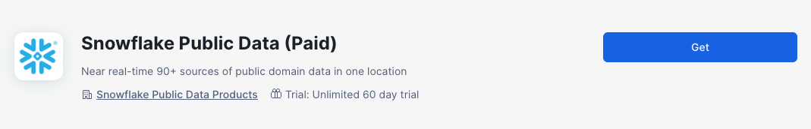

> **💡 Tip**: This dataset includes 90+ sources of public domain data including stock prices that the notebook uses for visualization and analysis. The 60-day trial is free.

### Open Notebook 5

Navigate to **AI & ML Studio** → **Notebooks** → **5_CORTEX_ANALYST**

### What the Notebook Demonstrates

The notebook explores marketplace data and shows how to:

- Create datasets from the Snowflake Marketplace
- Visualize stock price data in Streamlit
- Understand structured vs unstructured data analysis

**Time for notebook**: 5-10 minutes

---

### Explore Cortex Analyst in the UI

After completing the notebook, let's explore the semantic views that power the agent.


#### Step 1: Navigate to Cortex Analyst

1. From the navigation bar, click **AI & ML** → **Studio**
2. Click on **Cortex Analyst**

You'll see **2 semantic views** that have been set up:

- **Snowflake Analysts View** - Snowflake-specific data (analyst reports, earnings calls, stock prices)
- **Company Data 8 Core Featured Tickers** - Data across all 11 companies


#### Step 2: Explore Snowflake Analysts View

Click on **Snowflake Analysts View** to see its structure:

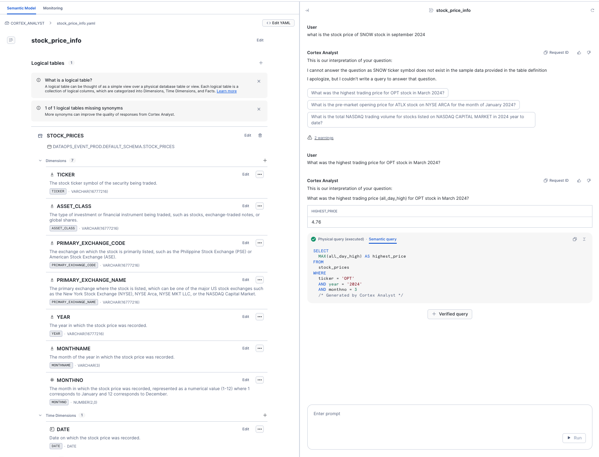

**Logical Tables**:

- ANALYST_REPORTS - 30 analyst reports with ratings and summaries
- SENTIMENT_ANALYSIS - Sentiment scores from earnings calls
- TRANSCRIBED_EARNINGS_CALLS_WITH_SENTIMENT - Full transcripts with sentiment
- TRANSCRIPTS_BY_MINUTE - Minute-by-minute transcript breakdowns
- STOCK_PRICES - Historical stock price data (2020-2025)

**Field Organization**:

- **Dimensions** - Descriptive attributes (company names, dates, categories)
- **Time Dimensions** - Date/timestamp fields for temporal analysis
- **Facts** - Numeric measures (prices, scores, counts)

Each field has:

- Clear descriptions to help the LLM understand the data
- Synonyms for natural language variations
- Sample values for context

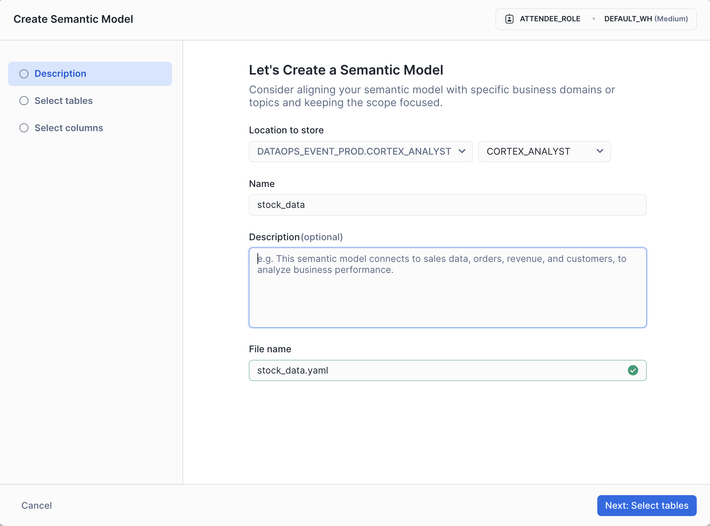

#### Step 3: Explore Company Data View

Click on **Company Data 8 Core Featured Tickers**:

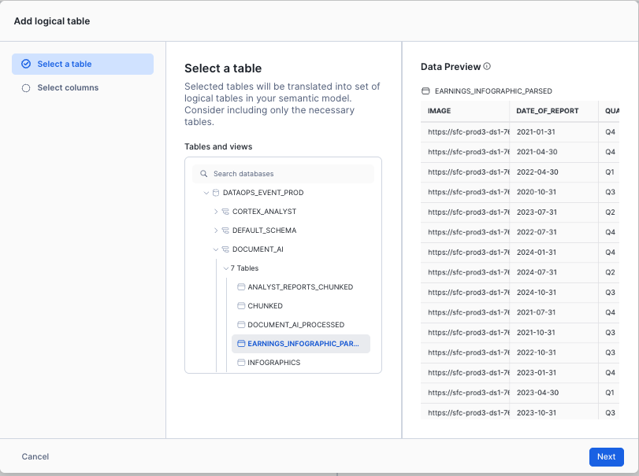

**Key Features**:

- **Relationships**: 4 relationships defined, all pointing to INFOGRAPHICS_FOR_SEARCH table
- **Primary Keys**: The right side of joins must be unique/primary key
- **Multiple Tables**: Financial reports, infographics, transcripts, sentiment data

**Relationship Example**:

- `TRANSCRIPTS_TO_COMPANY_INFO`: Links transcripts to company info via TICKER field

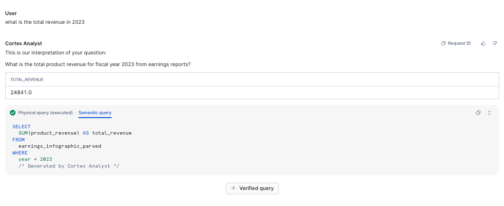

**Why Relationships Matter**:
They allow Cortex Analyst to automatically join tables when answering complex questions like "Show me sentiment from earnings calls for companies with negative free cash flow"

Looking at the Infographics for Search table, you'll notice where the primary key is defined.

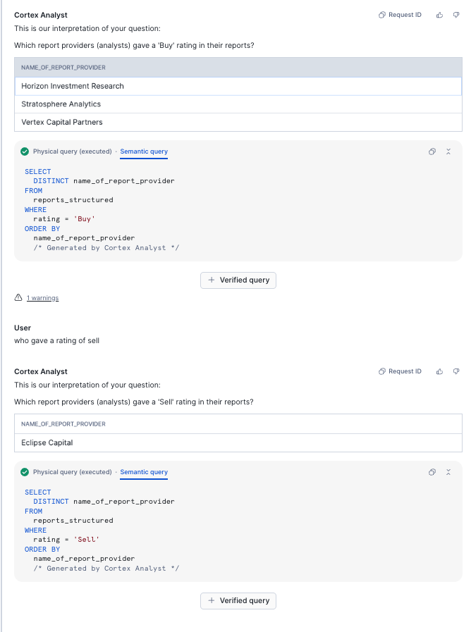

#### Step 4: Understanding Cortex Search Integration

Notice some dimensions have this annotation:

```
WITH CORTEX SEARCH SERVICE DEFAULT_SCHEMA.INFOGRAPHICS_SEARCH
```

This connects the semantic view to your search services, enabling the agent to seamlessly query both structured and unstructured data!

#### Step 5: Try the Playground (Optional)

Click **Playground** to test queries:

**Example questions**:

- "What was Snowflake's revenue in Q2 FY2025?"
- "Show me analyst ratings over time"
- "Which companies have the highest NRR?"

The playground shows the generated SQL and results.

---

### Key Insights

✅ **Semantic Views** bridge business language and database schemas
✅ **Relationships** enable multi-table analysis automatically
✅ **Search Integration** connects structured SQL with unstructured search
✅ **Verified Queries** can be saved for future agent use
✅ **Named Filters** (like TICKER_SNOW) simplify common queries

**Next**: These semantic views become tools for the Snowflake Intelligence Agent, enabling it to answer complex questions about financial data!

<!-- ------------------------ -->

## Test Search Services

### Use the Cortex Search Playground

Test the search services you created:

1. Navigate to **AI & ML Studio** → **Cortex Search**
2. Select **EMAILS** service
3. Try a search: "Tell me about companies with strong earnings"
4. Observe:
   - Semantic search results (not exact match)
   - Ranked by relevance
   - Attributes returned (TICKER, RATING, SENTIMENT)

### Search Service Details

| Service                         | Purpose                     | Search Column        | Records |
| ------------------------------- | --------------------------- | -------------------- | ------- |
| dow_analysts_sentiment_analysis | Sentiment analysis on calls | FULL_TRANSCRIPT_TEXT | 92      |
| snow_full_earnings_calls        | Earnings call chunks        | TEXT                 | 317     |
| ANALYST_REPORTS_SEARCH          | Analyst reports             | FULL_TEXT            | 30      |
| INFOGRAPHICS_SEARCH             | Company infographics        | BRANDING             | 11      |
| EMAILS                          | Email previews              | HTML_CONTENT         | 950     |

**Total**: 1,400+ searchable documents across 5 services

<!-- ------------------------ -->

## Semantic Views

### Navigate to Cortex Analyst

Go to **AI & ML Studio** → **Cortex Analyst**

You should see 2 semantic views:

1. **COMPANY_DATA_8_CORE_FEATURED_TICKERS**
2. **SNOWFLAKE_ANALYSTS_VIEW**

### Semantic View 1: 11 Companies Data

**Purpose**: Query financial data and sentiment for 11 companies using natural language

**Tables**:

- Infographics (company metrics)
- Sentiment analysis (earnings calls)
- Financial summaries (revenue, income)
- KPI metrics (operational data)

**Example Questions**:

Try asking in natural language:

1. "What is the revenue for SNOW in Q2 FY2025?"
2. "Show me the sentiment scores for all companies"
3. "Which companies have the highest net income?"
4. "Compare EPS across all 11 companies"

**How It Works**:

- You type natural language → Cortex Analyst generates SQL → Returns data
- No SQL knowledge required!

### Semantic View 2: Snowflake Analysis

**Purpose**: Deep dive into Snowflake (SNOW ticker) data

**Tables**:

- ANALYST_REPORTS (30 reports)
- TRANSCRIBED_EARNINGS_CALLS_WITH_SENTIMENT (1,788 segments)
- TRANSCRIPTS_BY_MINUTE (364 minutes)
- SENTIMENT_ANALYSIS (overall scores)
- ✅ **STOCK_PRICES** (6,420 price points)

**Named Filter**:

- **TICKER_SNOW** - Automatically filters to Snowflake stock only

**Example Questions**:

1. "What was the highest stock price for Snowflake in 2024?"
2. "Show me the price trend over the last 6 months"
3. "What did analysts say in the most recent earnings call?"
4. "Compare pre-market and post-market prices"

**New Feature**: STOCK_PRICES table with pivoted structure

- Easier queries (columns vs. JSON)
- Time dimensions (DATE, MONTHNAME, YEAR)
- All metrics as facts (ALL_DAY_HIGH, ALL_DAY_LOW, etc.)

### Test the Semantic Views

1. Click on **SNOWFLAKE_ANALYSTS_VIEW**
2. Try: "What is the latest closing price of Snowflake stock?"
3. View the generated SQL
4. Observe the results

<!-- ------------------------ -->

## Intelligence Agent

### Overview: The One Ticker Stock Agent

The **One Ticker** agent is your AI-powered financial analyst assistant that combines multiple data sources, search capabilities, and analytical tools to provide comprehensive insights about stocks and companies.

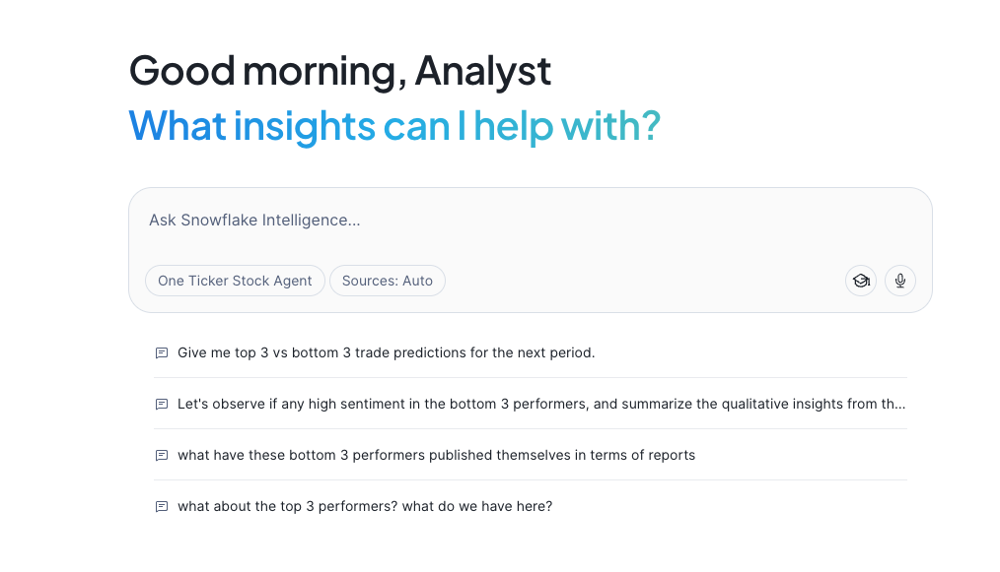

**What the Agent Can Do**:

- 📊 Analyze company financial data and performance metrics
- 📈 Track stock price trends and generate predictions
- 💬 Review analyst sentiment from earnings calls
- 📧 Search through analyst emails and reports
- 🔍 Perform web searches for fact-checking
- ✉️ Generate and send email summaries via SnowMail

This agent represents the **culmination of all the previous work** - it brings together the unstructured data processing, search services, semantic views, and ML models into one conversational interface.

---

### Access the Agent

1. Navigate to **AI & ML Studio** → **Snowflake Intelligence** in your Snowflake account
2. Select the **One Ticker** agent
3. The agent will automatically select the right tools based on your question

**Location**: `SNOWFLAKE_INTELLIGENCE.AGENTS."One Ticker"`

---

### Agent Architecture: 10 Powerful Tools

The One Ticker agent has access to **10 different tools** that it automatically orchestrates based on your questions:

#### Semantic Analysis Tools (2)

**1. SENTIMENT_INFO_FROM_TRANSCRIPTS_AND_SUPPORTING_DATA**

- Queries data across all 11 companies
- Includes financial reports, infographics, earnings transcripts
- Email content with ratings and sentiment
- Uses: `COMPANY_DATA_8_CORE_FEATURED_TICKERS` semantic view

**2. snowflake_data**

- Snowflake-specific data (real and synthetic)
- 3 quarters of real earnings calls
- Analyst reports and stock price history
- Uses: `SNOWFLAKE_ANALYSTS_VIEW` semantic view

#### Search Services (5)

**3. Sentiment_Analysis**

- Searches across 92 earnings call transcripts
- Filters by ticker, sentiment score (1-10), analyst count
- Service: `DOW_ANALYSTS_SENTIMENT_ANALYSIS`

**4. Analyst_Reports_Snowflake**

- 30 analyst reports about Snowflake
- Full text search with ratings, price targets, summaries
- Service: `ANALYST_REPORTS_SEARCH`

**5. Latest_infographics_8_core_stocks**

- 11 company earnings infographics
- Visual KPI summaries and brand analysis
- Service: `INFOGRAPHICS_SEARCH`

**6. Email_Content**

- 950+ analyst emails
- 7 rating types with sentiment analysis
- Service: `EMAILS`

**7. snowflake_full_earnings_calls**

- Full Snowflake earnings call transcripts
- Chunked for semantic search (Q1, Q2, Q3 FY2025)
- Service: `SNOW_FULL_EARNINGS_CALLS`

#### Generic Functions (3)

**8. STOCK_PERFORMANCE_PREDICTOR**

- ML-powered stock predictions using gradient boosting
- Model: `STOCK_RETURN_PREDICTOR_GBM`
- Returns top N and bottom N predicted performers
- Function: `GET_TOP_BOTTOM_STOCK_PREDICTIONS`

**9. SEND_EMAIL**

- Creates formatted emails with markdown-to-HTML conversion
- Saves to SnowMail for viewing
- Returns clickable viewing URL
- Procedure: `SEND_EMAIL_NOTIFICATION`

**10. WEB_SEARCH** 🆕

- Searches the web for fact-checking
- Uses DuckDuckGo search engine
- Returns top 3 results with summaries
- Function: `WEB_SEARCH`

---

### What the Agent Can Do

#### 1. Stock Performance Predictions

**Try asking:**

> "Give me top 3 vs bottom 3 trade predictions for the next period."

The agent will:

- Use machine learning models to analyze technical indicators
- Rank stocks by predicted performance
- Show you the top 3 expected winners and bottom 3 underperformers
- Display results in a visual chart

**Behind the scenes:** Uses the `STOCK_PERFORMANCE_PREDICTOR` function with gradient boosting models trained on historical price data (r_1, r_5_1, r_10_5, r_21_10, r_63_21 momentum ratios).

#### 2. Sentiment Analysis

**Try asking:**

> "Let's observe if any high sentiment in the bottom 3 performers, and summarize the qualitative insights from the earnings call that shows top sentiment."

The agent will:

- Identify bottom performing companies
- Analyze earnings call transcripts for sentiment
- Extract positive insights from analyst discussions
- Summarize key qualitative findings

**Data sources:** Searches across 92 earnings call transcripts from 11 companies with AI-extracted sentiment scores.

#### 3. Company Material Review

**Try asking:**

> "What have these bottom 3 performers published themselves in terms of reports?"

The agent will:

- Search infographics, financial reports, and earnings materials
- Show what investor relations materials exist
- Compare to top performers' comprehensive disclosures
- Explain the limited IR approach of smaller companies

**Demonstrates:** PROP, GAME, and MKTG have minimal published materials (realistic for growth-stage companies).

#### 4. Stock Price Trend Visualization

**Try asking:**

> "Now I would like to see a trend visualising the SNOW stock performance over time"

The agent will:

- Query the STOCK_PRICES table (6,420+ data points)
- Filter to Snowflake (SNOW ticker) using TICKER_SNOW filter
- Create time-series visualizations
- Show high, low, volume, and closing prices over time

**Data coverage:** Historical stock prices from 2020-present with daily granularity.

#### 5. Analyst Opinion Research

**Try asking:**

> "What do the other analysts say about snowflake?"

The agent will:

- Search 30 analyst reports across 6 research firms
- Search 950+ analyst emails
- Summarize consensus opinions
- Show rating distribution (BUY, HOLD, SELL, etc.)

**Research firms covered:** Apex Analytics, Sterling Partners, Veridian Capital, Pinnacle Growth Investors, Momentum Metrics, Quant-Vestor.

#### 6. Narrative Analysis with Web Fact-Checking

**Try asking:**

> "I would like to see what happened to neuro nector and how did this impact Snowflake. Present the information based on what we have - then fact check with any available data from the web."

The agent will:

- Review internal data about Neuro-Nectar (NRNT)
- Show the bankruptcy timeline (July-Nov 2024)
- Analyze impact on Snowflake stock
- Use WEB_SEARCH to fact-check details
- Cross-reference with external sources

**Demonstrates:** How AI agents can combine internal data with external web searches for comprehensive analysis.

#### 7. Email Report Generation

**Try asking:**

> "Finally send me an email of your findings - as i really want to put neuro nector drama to bed!!!"

The agent will:

- Summarize all previous analysis
- Format as professional email with markdown
- Save to EMAIL_PREVIEWS table
- Return SnowMail URL for viewing

**Email features:**

- Markdown converted to HTML automatically
- Snowflake brand styling applied
- Viewable in Gmail-style SnowMail interface
- Includes all charts and findings

**IMPORTANT**: After calling SEND_EMAIL, the agent will display a **clickable URL** - right-click or CMD+Click to open the email in SnowMail!

---

### Sample Conversation Flow

Here's an example conversation demonstrating the agent's capabilities:

**You:** "Give me top 3 vs bottom 3 trade predictions for the next period."

**Agent:** *Runs ML model, shows chart with top performers (e.g., VLTA, QRYQ, ICBG) and bottom performers (e.g., PROP, GAME, MKTG)*

**You:** "What have these bottom 3 performers published themselves in terms of reports?"

**Agent:** *Searches infographics and reports, explains PROP/GAME/MKTG have limited investor materials compared to core 8 companies*

**You:** "Now can we focus on snowflake - are there any c level people at snowflake that are negative on earnings calls?"

**Agent:** *Analyzes earnings transcripts by speaker, shows C-level sentiment scores*

**You:** "I would like to see a trend visualising the SNOW stock performance over time"

**Agent:** *Queries STOCK_PRICES with TICKER_SNOW filter, creates time-series chart showing price trends*

**You:** "What do the other analysts say about snowflake?"

**Agent:** *Searches analyst reports and emails, summarizes ratings distribution, shows consensus*

**You:** "I would like to see what happened to neuro nector and how did this impact Snowflake. Present the information based on what we have - then fact check with any available data from the web."

**Agent:** *Reviews NRNT bankruptcy timeline from internal data, searches web for external verification, shows SNOW recovery pattern*

**You:** "Finally send me an email of your findings - as i really want to put neuro nector drama to bed!!!"

**Agent:** *Generates comprehensive email summary, returns SnowMail URL for viewing*

---

### Editing and Understanding the Agent

After using the agent, explore its configuration:

1. Navigate to **AI & ML Studio** → **Agents**
2. Click on **One Ticker** agent
3. Click **Edit** to view:
   - **Sample Questions**: The questions you just tried
   - **Tools**: All 10 tools available to the agent
   - **Orchestration Instructions**: How the agent decides which tools to use
   - **Access Control**: Who can use the agent

---

### Data Coverage

#### Companies Analyzed (11 Total)

**Core 8** (Full materials):

- **SNOW** - Snowflake (market leader)
- **CTLG** - CatalogX (governance)
- **DFLX** - DataFlex Analytics (BI)
- **ICBG** - ICBG Data Systems (open lakehouse)
- **QRYQ** - Querybase (price/performance)
- **STRM** - StreamPipe Systems (streaming)
- **VLTA** - Voltaic AI (ML platform)
- **NRNT** - Neuro-Nectar (bankruptcy case study)

**Bottom 3** (Limited materials):

- **PROP** - PropTech Analytics (real estate)
- **GAME** - GameMetrics (gaming analytics)
- **MKTG** - Marketing Analytics (challenged)

#### Data Assets

- **📊 Financial Reports**: 11 companies
- **📈 Infographics**: 11 companies
- **🎙️ Earnings Calls**: 92 transcripts (3 Snowflake, 89 other companies)
- **📧 Analyst Emails**: 950 emails with ratings and sentiment
- **📝 Analyst Reports**: 30 detailed reports (Snowflake-focused)
- **💹 Stock Prices**: 6,420 Snowflake data points (2020-2025)
- **📑 Investment Docs**: 7 Federal Reserve & NBER research papers

---

### Tips for Best Results

#### Ask Specific Questions

✅ **Good**: "What was Snowflake's NRR in Q2 FY2025?"
❌ **Too vague**: "Tell me about Snowflake"

#### Request Visualizations

The agent automatically creates charts because of this instruction:

> "Whenever you can answer visually with a chart, always choose to generate a chart even if the user didn't specify to"

This is intentional for better data comprehension!

#### Use Follow-up Questions

The agent maintains context, so you can:

1. Ask initial question
2. Drill deeper on specific findings
3. Request different visualizations
4. Ask for comparisons
5. Request email summary

#### Leverage Web Search

For fact-checking or current events:

> "Fact check this with web search"
> "What does the web say about..."

#### Request Email Summaries

End your research session with:

> "Send me an email summarizing our findings"

You'll get a professional email with all insights accessible via SnowMail!

---

### Advanced Features

#### TICKER_SNOW Named Filter

When querying stock prices, the agent can use the `TICKER_SNOW` filter to quickly focus on Snowflake data.

**Synonyms supported**:

- snow_equity_code
- snow_security_id
- snow_stock_code
- snow_stock_ticker
- stock_symbol_snow

This makes queries like "show me SNOW stock performance" work seamlessly.

#### Multi-Source Intelligence

The agent automatically:

- Searches across 5 different data sources simultaneously
- Cross-references findings between sources
- Validates data consistency
- Provides confidence levels for insights

#### Visual-First Responses

Most responses include:

- 📊 Bar charts for comparisons
- 📈 Line charts for trends
- 📉 Performance rankings
- 🎯 KPI visualizations

---

### Real-World Use Cases

#### Portfolio Manager Use Case

**Scenario**: Weekly portfolio review

**Questions to ask**:

1. "Give me top 3 vs bottom 3 trade predictions"
2. "Show me SNOW stock price trends for the last quarter"
3. "What's the analyst consensus on SNOW?"
4. "How do the bottom performers compare to top performers on NRR?"
5. "Send me an email summary of this week's insights"

**Time saved**: 2-3 hours of manual research → 5 minutes with agent

#### Risk Analyst Use Case

**Scenario**: Investigating potential red flags

**Questions to ask**:

1. "Which companies have negative free cash flow?"
2. "Show me sentiment from analyst earnings calls for companies with FCF < 0"
3. "What concerns do analysts mention most frequently?"
4. "Search web for recent news about these companies"
5. "Email me a risk assessment summary"

**Benefit**: Rapid identification of potential issues across 11 companies

#### Research Analyst Use Case

**Scenario**: Deep dive on Snowflake

**Questions to ask**:

1. "What do analyst reports say about Snowflake's competitive position?"
2. "Show me earnings call sentiment trends over 3 quarters"
3. "How does SNOW compare to ICBG and QRYQ on key metrics?"
4. "Search web for latest Snowflake news"
5. "What was the Neuro-Nectar situation and how did it affect SNOW?"
6. "Send me a comprehensive Snowflake analysis email"

**Output**: Complete research report with internal data + external validation

---

### Understanding Agent Responses

#### When You See Charts

The agent automatically generates visualizations - this is intentional!

#### When You See "Checking multiple sources..."

The agent is:

- Querying semantic views
- Searching multiple search services
- Running ML predictions
- Performing web searches

This ensures comprehensive, validated answers.

#### When You See a SnowMail URL

**What to do**:

1. Right-click the URL
2. Select "Open in new tab" (or CMD+Click / CTRL+Click)
3. View your email in the SnowMail interface

**Note**: The email wasn't "sent" externally - it's saved for demo viewing.

---

### Data Limitations & Disclaimers

#### Synthetic Data

- **8 core companies**: Entirely fictional (except Snowflake)
- **Snowflake data**: Mix of real earnings calls (outdated) and synthetic reports
- **Stock prices**: Real historical data for SNOW
- **Bottom 3 performers**: Fictional companies demonstrating smaller players

#### Purpose

This is a **demonstration environment** showing FSI AI capabilities. **Do not make actual investment decisions based on this data!**

#### Data Currency

- Earnings calls: 2024-2025 (may be outdated)
- Analyst reports: Fictional but realistic
- Stock prices: Historical data through 2025
- Financial metrics: Synthetic but industry-realistic

---

## Conclusion

### What You've Accomplished

In this quickstart, you've built a comprehensive AI-powered financial analysis platform using Snowflake's Cortex AI capabilities. You started by processing unstructured data—extracting insights from PDF analyst reports using Document AI, transcribing earnings call audio with AI_TRANSCRIBE, and analyzing sentiment across thousands of data points. This transformed raw, unstructured financial content into structured, queryable data that forms the foundation of intelligent applications.

You then created the AI services layer that makes this data accessible and actionable. Cortex Search services enable semantic search across analyst reports, earnings transcripts, emails, and infographics—finding relevant information based on meaning rather than keywords. Cortex Analyst semantic views allow natural language queries against structured financial data, automatically generating SQL from plain English questions. Together, these services power the intelligence layer that connects users to insights without requiring technical expertise.

Finally, you deployed and explored the Snowflake Intelligence Agent—the "One Ticker" stock analyst that orchestrates all of these capabilities through a conversational interface. The agent seamlessly combines search services, semantic views, ML predictions, and web search to answer complex financial questions, generate visualizations, and even send email summaries via SnowMail. This demonstrates how modern AI platforms can unify structured and unstructured data analysis, enabling faster decision-making and deeper insights across financial services use cases.

### Resources

- **Repository**: [GitHub - FSI Cortex Assistant](https://github.com/Snowflake-Labs/sfguide-Build-an-AI-Assistant-for-FSI-with-AISQL-and-Snowflake-Intelligence)
- **Documentation**: See DEPLOYMENT_README.md in repository
- **Homepage Portal**: Interactive lab guide included
- **Pre-Configured Hands on Lab**: Contact your representative to arrange a hands on lab event with this content pre configured.

---

**Ready to build AI-powered applications with Snowflake Cortex?** Start experimenting with your own data today!

### Related Resources

- [Snowflake AI and ML Features](https://docs.snowflake.com/guides-overview-ai-features)
- [Snowflake Intelligence Overview](https://docs.snowflake.com/en/user-guide/snowflake-cortex/snowflake-intelligence)
- [Snowflake Public Paid Data](https://app.snowflake.com/marketplace/listing/GZTSZ290BUXPL/snowflake-public-data-products-snowflake-public-data-paid)
  -[Snowflake for Financial Services](https://www.snowflake.com/en/solutions/industries/financial-services/)
