id: build-an-ai-assistant-for-telco-with-aisql-and-snowflake-intelligence
summary: Build an AI-powered Telco Operations Agent with Snowflake AI Functions and Snowflake Intelligence for natural language analytics on network performance, customer feedback, and call center data.
categories: snowflake-site:taxonomy/solution-center/certification/quickstart, snowflake-site:taxonomy/product/ai, snowflake-site:taxonomy/product/analytics, snowflake-site:taxonomy/snowflake-feature/snowflake-intelligence, snowflake-site:taxonomy/industry/telecommunications, snowflake-site:taxonomy/snowflake-feature/cortex-search, snowflake-site:taxonomy/snowflake-feature/cortex-analyst, snowflake-site:taxonomy/snowflake-feature/document-ai, snowflake-site:taxonomy/snowflake-feature/cortex-llm-functions, snowflake-site:taxonomy/snowflake-feature/unstructured-data-analysis, snowflake-site:taxonomy/solution-center/certification/certified-solution
environments: web
language: en
status: Published
author: Vasanth Pandiaraj, Becky O'Connor
feedback link: https://github.com/Snowflake-Labs/sfguides/issues
tags: Cortex AI, Snowflake Intelligence, Document Processing, Cortex Analyst, Cortex Search, Telecommunications, Agents, RAG, Text-to-SQL, Call Center Analytics, AI Transcribe, Semantic Models, Network Operations


# Build an AI Assistant for Telco using AI SQL and Snowflake Intelligence

<!-- ------------------------ -->

## Overview

### Introduction

Telecommunications companies face unique challenges in managing vast amounts of operational data—from network performance metrics and infrastructure capacity to customer call recordings, support tickets, and satisfaction surveys. To address these challenges effectively, a unified platform is essential—one capable of storing and processing all data types, whether MP3 call recordings, PDF help documents, or structured network telemetry.

Throughout this quickstart, we'll use **NovaConnect**—a fictitious telecommunications company—as our example organization. NovaConnect operates a nationwide 5G network serving millions of customers, and needs AI-powered tools to analyze network performance, understand customer feedback, and streamline support operations.

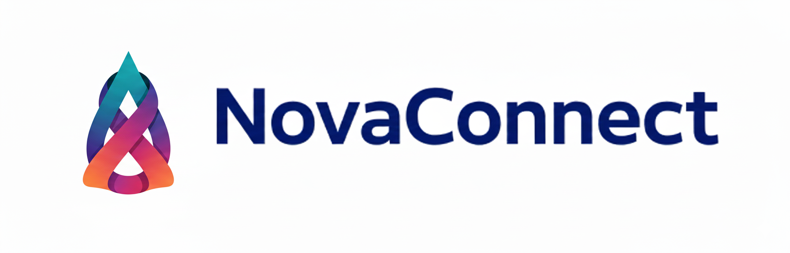

This data must be readily accessible for analysis using the latest large language models (LLMs) such as Anthropic, Gemma, LLaMA, or DeepSeek. Ensuring the trustworthiness and security of generated insights is critical, especially when they inform network operations decisions and customer experience strategies.

In addition, developing Agentic AI capabilities allows for natural language question-answering tailored to network engineers, customer service managers, and operations teams who need real-time insights into network health and customer satisfaction.

**In this hands-on lab, you'll learn how to build a Telco Operations AI Agent from the ground up using the Snowflake AI Data Cloud.**

Learn how you can leverage the latest AI technologies right within the Snowflake platform. When AI is deeply embedded in your trusted data platform, the possibilities are endless. We will be exploring the processing of both **Unstructured** and **Structured** data which will then allow the application of a **Cortex Agent** to help discover insights by leveraging **All Data.**

### Data Sources and Analytics

This hands-on lab utilizes a comprehensive telecommunications dataset spanning multiple data types to demonstrate real-world AI applications. You'll work with:

**Network Operations Data**

- **Network Performance Metrics** - Latency, download/upload speeds, packet loss, and availability from cell towers
- **Infrastructure Capacity** - Bandwidth utilization, equipment status, and capacity planning data
- **4G/5G Tower Analytics** - Regional performance metrics across multiple geographic regions

**Customer Experience Data**

- **25 Call Recordings** (MP3) - Customer support calls transcribed with AI_TRANSCRIBE
- **8 Help Documents** (PDF) - Product guides and troubleshooting documents processed with AI_PARSE_DOCUMENT
- **Customer Feedback Summary** - Sentiment analysis, complaints, and feedback categorization
- **Customer Details** - Demographics, plan types, tenure, and churn analysis
- **Support Tickets** - Issue tracking with priority, category, and resolution data
- **CSAT Surveys** - Customer satisfaction scores and NPS ratings

**AI-Powered Analysis Journey**

Your AI assistant will synthesize insights from all these sources to answer questions like:

- *"Which regions have the highest network latency issues?"*
- *"Show me 5G towers operating above 80% capacity"*
- *"Find calls mentioning network connectivity problems"*
- *"Which customer segments have the highest churn risk?"*
- *"What are the top customer complaints this month?"*

This diverse dataset enables you to experience how modern AI can unify structured network data with unstructured customer interactions, creating comprehensive operational intelligence.

> **⚠️ Important Disclaimer:** All data including NovaConnect company information is completely synthetic and created for educational purposes. Business decisions cannot be made based on any outcomes of this lab.

### What You'll Build

In this quickstart, you'll build a comprehensive AI-powered telecommunications operations platform called **NovaConnect Intelligence** using Snowflake's Cortex AI capabilities. This end-to-end solution demonstrates how to:

- Process unstructured documents (PDFs) with **Cortex Document Processing**
- Transcribe and analyze customer call audio with **AI Transcribe** and **AI Sentiment**
- Create intelligent search experiences with **Cortex Search Services**
- Build natural language data queries with **Cortex Analyst** and semantic models
- Deploy conversational AI agents with **Snowflake Intelligence**

### What You'll Learn

- How to extract structured data from unstructured documents
- How to build and configure Cortex Search Services for RAG applications
- How to create Cortex Analyst semantic models for business intelligence
- How to use Snowflake Intelligence agents with multiple tools
- How to deploy production-ready Streamlit applications in Snowflake

### What You'll Need

- A Snowflake account (free trial works for most features) with **ACCOUNTADMIN** access
- Web browser (Chrome, Firefox, or Safari)
- Basic knowledge of SQL
- 15-20 minutes for deployment

### Deployment Options

This quickstart offers two deployment paths to accommodate different preferences and skill levels. Choose the option that best fits your workflow:

#### Option 1: Snowsight UI (Recommended)

**Best for:** Most users, visual learners, those new to Snowflake

Deploy directly from GitHub using Snowflake's built-in Git integration. This approach:
- **No local setup required** - Everything runs in your browser
- **Visual feedback** - Watch each step execute in Snowsight
- **Easy troubleshooting** - See errors immediately in the UI
- **Learn as you go** - Understand what each script does

You'll connect Snowflake to GitHub, then run a series of SQL scripts that automatically:
1. Configure your account and create required objects
2. Load sample data from stages
3. Deploy Cortex Search services and Analyst semantic models
4. Create notebooks for data processing
5. Deploy the SnowMail native app

#### Option 2: Cortex Code CLI (Alternative)

**Best for:** Developers, automation enthusiasts, CLI power users

Use the Telco Agent Builder skill for guided, conversational deployment. This approach:
- **Conversational interface** - AI guides you through deployment
- **Automated execution** - Less manual copying/pasting
- **Skill-based** - Uses Cortex Code's agent capabilities

> **⚠️ Note for Trial Accounts:** The **Web Search** agent tool requires **External Access Integration**, which is not enabled by default on trial accounts. If you need this feature, contact your Snowflake representative to have it enabled. All other features (Document Processing, Cortex Search, Cortex Analyst, email notifications) work without this.

### Assets Created

By the end of this lab, you'll have deployed:

- **Database**: `TELCO_OPERATIONS_AI` with multiple schemas
- **Warehouse**: `TELCO_WH` (Medium)
- **Role**: `TELCO_ANALYST_ROLE` with CORTEX_USER privileges
- **14+ Tables** with ~10,000 rows of telco data
- **2 Cortex Search Services** (call transcripts, support tickets)
- **3 Cortex Analyst Semantic Models** (network, infrastructure, customer)
- **1 Snowflake Intelligence Agent** (Telco Operations AI Agent)
- **3 Snowflake Notebooks** for data processing
- **1 Native App** (SnowMail email viewer)
- **33+ Files** (25 MP3 audio, 8 PDF documents)

<!-- ------------------------ -->

## Architecture Overview

### Multi-Modal AI Platform

This quickstart deploys a **complete multi-modal AI platform** combining:

**Data Sources** → **AI Processing** → **Structured Data** → **AI Services** → **Applications**

**Data Types**:

- 📄 Documents (PDFs - help guides, product information)
- 🎙️ Audio (MP3 customer support calls)
- 📊 Structured (Network metrics, customer data, 10,000+ rows)
- 📧 Support Tickets (Customer issues and resolutions)
- 📱 Customer Feedback (Sentiment analysis, complaints)

**AI Capabilities**:

- Cortex Document Processing (AI_PARSE_DOCUMENT, AI_EXTRACT)
- Audio AI (AI_TRANSCRIBE with timestamps)
- Sentiment AI (AI_SENTIMENT for call analysis)
- Translation AI (AI_TRANSLATE for multi-language support)
- Aggregation AI (AI_AGG without context limits)

**Latest AISQL Syntax**: All examples use 2025 AI_* functions

### System Architecture

The NovaConnect AI platform follows a layered architecture that transforms raw unstructured data into actionable intelligence. Data flows from multiple sources (documents, audio, structured tables) through Cortex AI processing functions, into organized tables and search indices, and finally surfaces through Snowflake Intelligence agents and applications.

The architecture diagram below illustrates how each component connects:

- **Left side**: Raw data sources (PDFs, MP3s, CSVs) stored in Snowflake stages
- **Middle**: AI processing layer using Cortex functions to extract, transcribe, and analyze content
- **Right side**: Structured outputs (tables, search services, semantic models) that power the agent

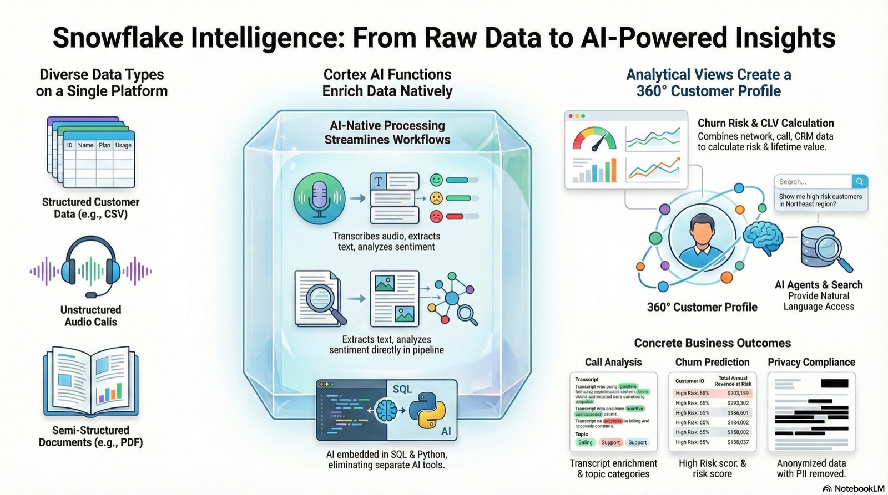

The dataflow diagram below shows how data moves through the system to power Snowflake Intelligence. Raw data enters from the left (CSV files, PDF documents, MP3 audio recordings), gets processed through Cortex AI functions in the middle (AI_PARSE_DOCUMENT, AI_TRANSCRIBE, AI_SENTIMENT), and flows into the structured outputs on the right (Cortex Search services and Cortex Analyst semantic models). These services become the "tools" that the Snowflake Intelligence agent uses to answer user questions—combining structured SQL queries with semantic search across unstructured content.

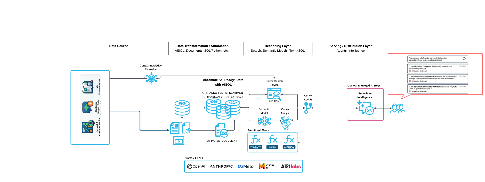

### Key Technologies

- **Cortex AI Functions**: AI_PARSE_DOCUMENT, AI_TRANSCRIBE, AI_SENTIMENT, AI_COMPLETE
- **Cortex Search**: 2 search services for semantic search and RAG
- **Cortex Analyst**: 3 semantic models for natural language SQL
- **Snowflake Intelligence**: Conversational agents with tool orchestration
- **Cortex Document Processing**: Automated document processing at scale

<!-- ------------------------ -->

## Setup Your Environment

### Step 1: Get a Snowflake Account

**Option A - Free Trial** (Recommended):

1. Visit https://signup.snowflake.com/
2. Sign up for a free 30-day trial
3. Choose **Enterprise** edition
4. Select a cloud region (AWS, Azure, or GCP)
5. Verify your email
6. Log in to Snowsight (https://app.snowflake.com)

**Option B - Existing Account**:

- Use any Snowflake account with ACCOUNTADMIN access
- Log in to Snowsight
- No special setup required

### Step 2: Connect to GitHub Repository in Snowflake

**Deploy directly from GitHub - No downloads or CLI tools needed!**

#### Step 2a: Create Git Integration (One-Time Setup)

1. In **Snowsight**, click on **Projects**
2. Select **Workspaces**
3. Add new **SQL file**
4. Copy and paste this script:

```sql
-- Setup Git Integration (one-time)
-- This creates a SEPARATE database for Git repos so you can drop/recreate 
-- TELCO_OPERATIONS_AI without losing the Git integration

USE ROLE ACCOUNTADMIN;

-- Create SEPARATE database for Git repositories (won't be dropped with main database)
CREATE DATABASE IF NOT EXISTS SNOWFLAKE_QUICKSTART_REPOS
    COMMENT = 'Persistent database for Git repository integrations - DO NOT DROP';
CREATE SCHEMA IF NOT EXISTS SNOWFLAKE_QUICKSTART_REPOS.GIT_REPOS;

USE DATABASE SNOWFLAKE_QUICKSTART_REPOS;
USE SCHEMA GIT_REPOS;

-- Create API integration for GitHub
CREATE OR REPLACE API INTEGRATION git_api_integration
    API_PROVIDER = git_https_api
    API_ALLOWED_PREFIXES = ('https://github.com/Snowflake-Labs/')
    ENABLED = TRUE;

-- Grant usage on API integration
GRANT USAGE ON INTEGRATION git_api_integration TO ROLE ACCOUNTADMIN;

-- Create Git repository object
CREATE OR REPLACE GIT REPOSITORY SNOWFLAKE_QUICKSTART_REPOS.GIT_REPOS.TELCO_AI_REPO
    API_INTEGRATION = git_api_integration
    ORIGIN = 'https://github.com/Snowflake-Labs/sfquickstarts.git';

-- Grant READ permission on Git repository
GRANT READ ON GIT REPOSITORY SNOWFLAKE_QUICKSTART_REPOS.GIT_REPOS.TELCO_AI_REPO TO ROLE ACCOUNTADMIN;

-- Fetch code from GitHub
ALTER GIT REPOSITORY SNOWFLAKE_QUICKSTART_REPOS.GIT_REPOS.TELCO_AI_REPO FETCH;

SELECT 'Git integration ready!' AS status,
       'Git repo is in SNOWFLAKE_QUICKSTART_REPOS database (separate from main database)' AS note;
```

4. Click **Run** (or press Cmd/Ctrl + Enter)
5. Wait for completion (~30 seconds)
6. ✅ **Git integration complete!** You're now connected to GitHub

#### Step 2b: Access Git Repository in Snowflake UI

Now will create a workspace from the github repository

1. Create a Workspace from Github repository by clicking on My Workspace, then select the option **From Git repository**

2. When Prompted, use the following URL in the **Repository URL** field:

```text    
https://github.com/Snowflake-Labs/sfquickstarts.git
```

3. Press **Create**

4. **Navigate to the telco guide assets folder:**
   
   ```
   site/sfguides/src/build-an-ai-assistant-for-telco-with-aisql-and-snowflake-intelligence/assets/
   ```
   
   > ⚠️ **Important**: The sfquickstarts repository contains many guides. You must navigate to the path above to find the assets for this specific guide.

**You should see the following file structure:**

```
assets/
├── sql/                    ← Deployment scripts (START HERE)
├── data/                   ← CSV files and PDFs
├── audio/                  ← MP3 call recordings
├── Notebooks/              ← Snowflake notebooks
├── semantic_models/        ← YAML definitions
└── native_app_snowmail/    ← SnowMail Native App
```

5. **Navigate to `sql/`** - This is where the deployment scripts are
6. You'll see SQL files numbered 01-06

✅ **You're now ready to deploy!**

---

### Step 3: Deploy from GitHub Using Git Integration

#### Understanding GitHub Integration in Snowflake

Snowflake's **Git Integration** feature allows you to connect directly to GitHub repositories and execute SQL scripts without downloading files locally. This is powerful because:

- **Version Control**: Scripts are always up-to-date from the source repository
- **No Downloads**: Execute directly from GitHub - no local files needed
- **Reproducible**: Same scripts, same results every time
- **Workspace Integration**: Browse, view, and edit files directly in Snowsight

When you created the Git Repository object in Step 2, Snowflake established a connection to the `sfquickstarts` GitHub repository. This connection allows you to:

1. **Browse files** in the repository through the Snowsight UI
2. **Execute SQL files** directly using `EXECUTE IMMEDIATE FROM @<stage>/<path>`
3. **Create Workspaces** from repository folders for interactive development
4. **Fetch updates** when the repository changes

The deployment scripts in `assets/sql/` are numbered 01-06 and should be executed in order. Each script builds on the previous one, creating the complete NovaConnect AI platform.

#### Choose Your Deployment Method

**Option A: Execute all at once** (in one worksheet):

```sql
-- Run deployment scripts directly from GitHub (fully qualified names)
EXECUTE IMMEDIATE FROM @SNOWFLAKE_QUICKSTART_REPOS.GIT_REPOS.TELCO_AI_REPO/branches/master/site/sfguides/src/build-an-ai-assistant-for-telco-with-aisql-and-snowflake-intelligence/assets/sql/01_configure_account.sql;
EXECUTE IMMEDIATE FROM @SNOWFLAKE_QUICKSTART_REPOS.GIT_REPOS.TELCO_AI_REPO/branches/master/site/sfguides/src/build-an-ai-assistant-for-telco-with-aisql-and-snowflake-intelligence/assets/sql/02_data_foundation.sql;
EXECUTE IMMEDIATE FROM @SNOWFLAKE_QUICKSTART_REPOS.GIT_REPOS.TELCO_AI_REPO/branches/master/site/sfguides/src/build-an-ai-assistant-for-telco-with-aisql-and-snowflake-intelligence/assets/sql/03_deploy_cortex_search.sql;
EXECUTE IMMEDIATE FROM @SNOWFLAKE_QUICKSTART_REPOS.GIT_REPOS.TELCO_AI_REPO/branches/master/site/sfguides/src/build-an-ai-assistant-for-telco-with-aisql-and-snowflake-intelligence/assets/sql/04_deploy_cortex_analyst.sql;
EXECUTE IMMEDIATE FROM @SNOWFLAKE_QUICKSTART_REPOS.GIT_REPOS.TELCO_AI_REPO/branches/master/site/sfguides/src/build-an-ai-assistant-for-telco-with-aisql-and-snowflake-intelligence/assets/sql/05_deploy_notebooks.sql;
EXECUTE IMMEDIATE FROM @SNOWFLAKE_QUICKSTART_REPOS.GIT_REPOS.TELCO_AI_REPO/branches/master/site/sfguides/src/build-an-ai-assistant-for-telco-with-aisql-and-snowflake-intelligence/assets/sql/06_deploy_snowmail.sql;
```

**Option B: Use Git Repositories UI** (interactive):

1. Navigate: **Projects** → **Git Repositories** → **SNOWFLAKE_QUICKSTART_REPOS.GIT_REPOS.TELCO_AI_REPO**
2. Browse to: `site/sfguides/src/build-an-ai-assistant-for-telco-with-aisql-and-snowflake-intelligence/assets/sql/`
3. Right-click each file (01-06) → "Open in new worksheet"
4. Execute each script in order

**What gets deployed**:

1. ✅ Database `TELCO_OPERATIONS_AI` with schemas
2. ✅ Role `TELCO_ANALYST_ROLE` with CORTEX_USER privileges
3. ✅ 14+ tables with ~10,000 rows of data
4. ✅ 2 Cortex Search Services
5. ✅ 3 Cortex Analyst Semantic Models
6. ✅ 1 Snowflake Intelligence Agent
7. ✅ 3 Notebooks
8. ✅ 1 Native App (SnowMail email viewer)
9. ✅ Stages with MP3 audio files and PDFs

**Deployment time**: 15-20 minutes

---

### Alternative: Deploy with Cortex Code CLI

**New!** You can also deploy this quickstart using the **Cortex Code CLI** - Snowflake's AI-powered command-line assistant.

#### Option C: Automated Deployment with Cortex Code

If you have Cortex Code CLI installed, you can use the **Telco Agent Builder skill** for guided, automated deployment:

**1. Clone and Navigate to the Repository**

```bash
# Clone the quickstart repository
git clone https://github.com/Snowflake-Labs/sfquickstarts.git
cd sfquickstarts/site/sfguides/src/build-an-ai-assistant-for-telco-with-aisql-and-snowflake-intelligence
```

**2. Configure Your Snowflake Connection** (if not already configured)

```bash
# List available connections
snow connection list

# Or create a new connection
snow connection add
```

**3. Run Cortex Code with the Skill**

Launch Cortex Code from the project directory - it will automatically detect the skill in `assets/cortex_code_skill/`:

```bash
cortex

# Then ask Cortex Code to deploy:
> Deploy the NovaConnect Telco Operations AI quickstart
> Set up the telecommunications agent
> Build the telco agent for me
```

**What the skill does:**

The Telco Agent Builder skill will:
- ✅ Verify your Snowflake connection and permissions
- ✅ Create the database, schemas, roles, and warehouse
- ✅ Upload all data files (CSV, PDF, MP3) to Snowflake stages
- ✅ Create and load 14+ tables with sample data
- ✅ Deploy 2 Cortex Search services
- ✅ Upload semantic model YAML files for Cortex Analyst
- ✅ Create the Snowflake Intelligence Agent
- ✅ Deploy 3 Snowflake Notebooks
- ✅ Install the SnowMail Native App
- ✅ Verify the complete deployment

**Benefits of CLI deployment:**

- **Interactive guidance** - Step-by-step with explanations
- **Error handling** - Automatic troubleshooting and fixes
- **Progress tracking** - Real-time status updates
- **Customization** - Easily modify settings during deployment

> **Note**: Cortex Code CLI is currently in Private Preview. Contact your Snowflake account team to request access.

---

### Step 4: Verify Deployment

After deployment completes, verify in Snowflake UI:

```sql
-- Check all components
USE DATABASE TELCO_OPERATIONS_AI;

SHOW TABLES IN SCHEMA DEFAULT_SCHEMA;              -- Should see 14+ tables
SHOW CORTEX SEARCH SERVICES IN SCHEMA DEFAULT_SCHEMA; -- Should see 2 services
SHOW NOTEBOOKS IN SCHEMA NOTEBOOKS;                -- Should see 3 notebooks
SHOW AGENTS IN SCHEMA SNOWFLAKE_INTELLIGENCE.AGENTS;  -- Should see Telco Operations AI Agent
```

**All set?** ✅ Continue to the next section!

<!-- ------------------------ -->

## Verify Your Deployment

After Git integration deployment completes, let's verify everything was created successfully.

### Check Database Objects

Open Snowflake UI and navigate to **Data** → **Databases** → **TELCO_OPERATIONS_AI**

You should see:

- ✅ **DEFAULT_SCHEMA** - Main data tables
- ✅ **CORTEX_ANALYST** - Semantic model stage and views
- ✅ **NOTEBOOKS** - Snowflake notebooks
- ✅ **STREAMLIT** - Streamlit applications schema
- ✅ **MODELS** - ML models and UDFs schema

### Verify Tables (14+)

```sql
USE DATABASE TELCO_OPERATIONS_AI;
USE SCHEMA DEFAULT_SCHEMA;

-- Show all tables
SHOW TABLES;

-- Verify key table counts
SELECT 'network_performance' AS table_name, COUNT(*) AS rows FROM network_performance
UNION ALL SELECT 'infrastructure_capacity', COUNT(*) FROM infrastructure_capacity
UNION ALL SELECT 'customer_details', COUNT(*) FROM customer_details
UNION ALL SELECT 'customer_feedback_summary', COUNT(*) FROM customer_feedback_summary
UNION ALL SELECT 'CALL_TRANSCRIPTS', COUNT(*) FROM CALL_TRANSCRIPTS
UNION ALL SELECT 'AGENT_PERFORMANCE', COUNT(*) FROM AGENT_PERFORMANCE
UNION ALL SELECT 'NETWORK_INCIDENTS', COUNT(*) FROM NETWORK_INCIDENTS;
```

### Verify Cortex Search Services (2)

```sql
SHOW CORTEX SEARCH SERVICES IN SCHEMA DEFAULT_SCHEMA;
```

You should see:

- ✅ CALL_TRANSCRIPT_SEARCH
- ✅ SUPPORT_TICKET_SEARCH

### Verify Applications

**Notebooks**:

```sql
SHOW NOTEBOOKS IN TELCO_OPERATIONS_AI.NOTEBOOKS;
```

- ✅ 1_DATA_PROCESSING
- ✅ 2_ANALYZE_CALL_AUDIO
- ✅ 3_INTELLIGENCE_LAB

**All verified?** ✅ Let's start using the AI features!

<!-- ------------------------ -->

## AI & ML Studio

### Snowflake AI and ML Studio

Before diving into the notebooks, let's explore the **AI & ML Studio** - your one-stop shop for trying out AI functions using a user-friendly UI.

Navigate to the **AI & ML** section in the Snowflake navigation bar.

### Features You'll Explore

The AI and ML Studio provides access to:

- **Cortex Playground** - Compare text completions across multiple LLMs
- **Cortex Fine Tuning** - Customize large language models for specific tasks
- **Cortex Search** - Low-latency semantic search over your data
- **Cortex Analyst** - Text-to-SQL for business intelligence
- **Document Processing Playground** - Explore AI_EXTRACT and AI_PARSE_DOCUMENT functions

---

### Cortex Playground

The Cortex LLM Playground lets you compare text completions across multiple large language models available in Cortex AI.

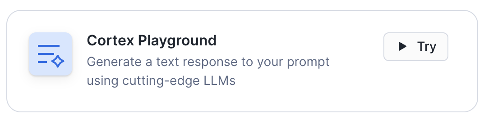

**Try it now:**

1. Click on **Cortex Playground** in the AI & ML Studio
2. Select a model (e.g., `claude-4-sonnet`, `llama-3.1-70b`, `mistral-large2`)
3. Try asking a telecommunications question:

**Example prompt:**

> "What are the key metrics I should monitor for 5G network performance? What factors indicate potential service degradation?"

**What you'll see:**
The model will suggest various factors to consider:

- Network latency and jitter
- Download/upload speeds
- Packet loss rates
- Handover success rates
- Signal strength (dBm)
- User load and capacity utilization

**Key insight**: Notice how the model provides industry-relevant metrics - all of which are available in the datasets you'll be working with in this lab.

---

### Document Processing Playground

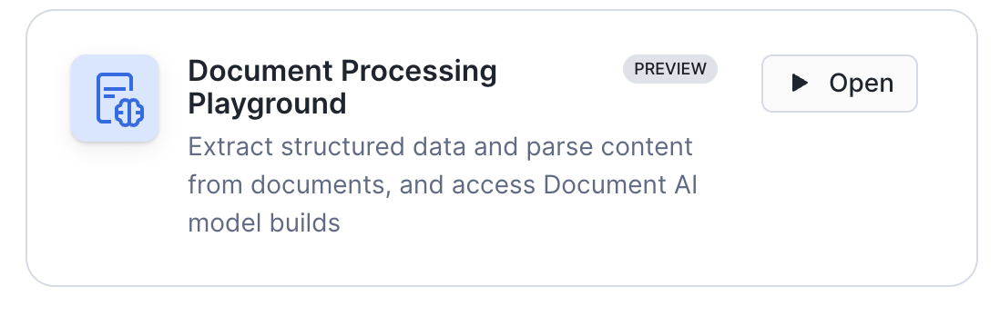

The **Document Processing Playground** is a powerful AI tool that helps you understand how text is extracted from documents. It provides an interactive UI for testing **AI_EXTRACT** and **AI_PARSE_DOCUMENT** functions, allowing you to experiment with different extraction strategies before implementing them in production.

#### Step 1: Upload Documents from Stage

1. Click **Document Processing Playground** in the AI & ML Studio
2. Click **Add from stage**
3. Select the following:
   - **Database**: `TELCO_OPERATIONS_AI`
   - **Schema**: `DEFAULT_SCHEMA`
   - **Stage**: `PDF_STAGE`
4. Choose 1-2 PDF documents (e.g., NovaConnect help documents)
5. Click **Open playground**

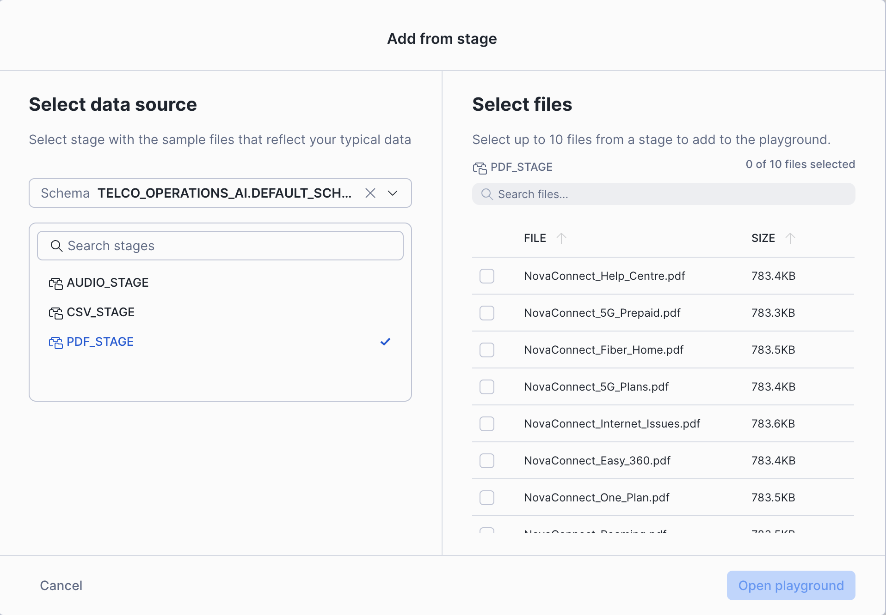

#### Step 2: Extract Information Using Questions

Once your document is loaded, you'll see three tabs: **Extraction**, **Markdown**, and **Text**.

The **Extraction** tab is where you can ask questions to pull specific information from the document.

**Try creating these key-value question pairs:**

- **Key**: `product_name` **Question**: `What is the name of the product or service?`
- **Key**: `features` **Question**: `What are the key features mentioned?`
- **Key**: `price` **Question**: `What is the pricing information?`
- **Key**: `data_allowance` **Question**: `What is the data allowance or quota?`
- **Key**: `contract_terms` **Question**: `What are the contract terms?`

After entering each question, click **Add Prompt** to see the extracted results.

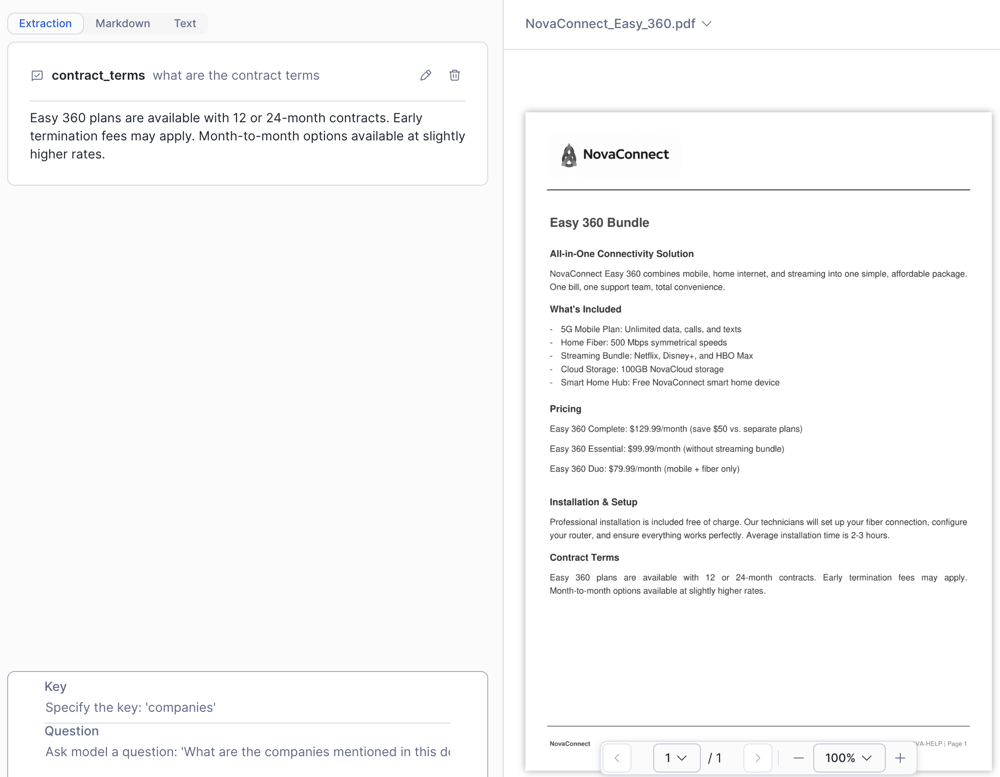

#### Step 3: Get the SQL Code

Once you've asked at least one question, the playground automatically generates SQL code:

1. Click **Code Snippets** in the top right corner
2. Review the generated SQL using AI_EXTRACT and AI_PARSE_DOCUMENT functions
3. Click **Workspaces** to open the code in a new worksheet

**Example generated code:**

```sql
-- Extract Data
SELECT AI_EXTRACT(
    file => TO_FILE('@TELCO_OPERATIONS_AI.DEFAULT_SCHEMA.PDF_STAGE', 'NovaConnect_Easy_360.pdf'),
    responseFormat => PARSE_JSON('{"schema":{"type":"object","properties":{"contract_terms":{"description":"what are the contract terms","type":"string"}}}}')
) AS extracted_data;

-- Parse file (Layout mode)
SELECT AI_PARSE_DOCUMENT(
    TO_FILE('@TELCO_OPERATIONS_AI.DEFAULT_SCHEMA.PDF_STAGE', 'NovaConnect_Easy_360.pdf'),
    { 'mode': 'LAYOUT', 'page_split': true }
) AS parsed_document;
```

This SQL code can be used to automate document processing at scale!

> **💡 Tip:** You'll see these functions in action in the **1_DATA_PROCESSING** notebook, which processes all 8 NovaConnect PDF documents using `AI_PARSE_DOCUMENT` with LAYOUT mode for bulk text extraction.

---

### Summary: What You've Learned

Before proceeding to the notebooks, you now understand:

✅ **Cortex Playground** - How to test LLM capabilities and prompt engineering
✅ **AI_PARSE_DOCUMENT** - Extract text and structure from PDFs
✅ **AI_EXTRACT** - Pull specific fields from documents using questions
✅ **SQL Code Generation** - Automating document processing at scale

**Next**: Apply these concepts in the notebooks to process help documents and call recordings!

<!-- ------------------------ -->

## Document Processing

### Overview

In this section, you'll process unstructured documents using Cortex AI functions through Notebook 1.

**What You'll Process:**

- 📄 **8 Help Documents** (PDFs) - Product guides, troubleshooting documents, and service information

**Cortex AI Functions You'll Use:**

- **AI_PARSE_DOCUMENT** - Extract all text from PDFs preserving layout
- **AI_COMPLETE** - Generate structured extractions using LLMs
- **AI_SENTIMENT** - Analyze emotional tone in customer communications

### Open Notebook 1

Navigate to **AI & ML Studio** → **Notebooks** → **1_DATA_PROCESSING**

### What the Notebook Demonstrates

**PDF Processing**:

- Parse help documents with AI_PARSE_DOCUMENT
- Extract product features, pricing, and data allowances
- Create searchable content from unstructured PDFs

**Key Tables Created by This Notebook**:

After running this notebook, you'll have processed PDFs ready for search and analysis.

### Follow the Notebook

The notebook contains **detailed instructions and explanations** for each step. Simply:

1. Click **Start** to begin the notebook session
2. Read through each cell's markdown explanations
3. **Run All** or execute cells one by one
4. Observe the outputs and interactive visualizations

**Time**: 10-15 minutes to run through all cells.

<!-- ------------------------ -->

## Audio Analysis

### Overview

Process customer call recordings using **AI_TRANSCRIBE** to convert speech to text, then analyze the content for sentiment and insights.

**What You'll Process:**

- 🎙️ **25 Customer Support Calls** (MP3 audio files)
- 🗣️ **Speaker Identification** - Separate customer and agent comments
- 💭 **Sentiment Analysis** - Measure emotional tone throughout the call
- 📝 **Call Summarization** - Generate AI summaries of each call

### Open Notebook 2

Navigate to **AI & ML Studio** → **Notebooks** → **2_ANALYZE_CALL_AUDIO**

### What the Notebook Demonstrates

**AI_TRANSCRIBE** - Converts MP3 audio to timestamped text:

- Generates full transcripts with speaker identification
- Preserves timestamps for navigation
- Processes multi-speaker conversations

**AI_SENTIMENT** - Analyzes emotional tone:

- Scores sentiment segment by segment
- Identifies positive, negative, and neutral sections
- Tracks sentiment trends over the call

**AI_COMPLETE** - Summarizes calls:

- Creates concise call summaries
- Identifies key issues discussed
- Extracts action items and resolutions

### Key Tables Updated by This Notebook

After running this notebook, you'll have:

- **CUSTOMER_CALL_TRANSCRIPTS** - Full transcripts with summaries
- Updated sentiment analysis for calls

💡 **Note**: The `CALL_TRANSCRIPTS` table with sample data is pre-loaded during initial deployment for the search services to work immediately.

### Follow the Notebook

The notebook includes:

- Audio file listings and metadata
- Transcription with AI_TRANSCRIBE
- Sentiment analysis with AI_SENTIMENT
- Call summarization with AI_COMPLETE
- Interactive visualizations

Simply run through the cells to see how audio becomes searchable, analyzable data.

**Time**: 10-15 minutes to complete.

<!-- ------------------------ -->

## Intelligence Lab

### Overview

Notebook 3 provides advanced analytics and visualizations combining all your processed data.

### Open Notebook 3

Navigate to **AI & ML Studio** → **Notebooks** → **3_INTELLIGENCE_LAB**

### What the Notebook Demonstrates

**Cross-Domain Analysis**:

- Correlating network issues with customer complaints
- Identifying patterns in customer churn
- Regional performance comparisons
- Agent performance analytics

**Visualizations**:

- Network performance dashboards
- Customer sentiment trends
- Capacity utilization charts
- Call center metrics

### Follow the Notebook

This notebook brings together insights from all data sources for comprehensive operational intelligence.

**Time**: 10-15 minutes to complete.

<!-- ------------------------ -->

## Cortex Search Services

### Overview

The deployment scripts created **2 intelligent search services** that make your telecommunications data instantly accessible using semantic search. This is the foundation for RAG (Retrieval Augmented Generation) applications.

**Why Search Services Matter:**

- Traditional keyword search fails with conversational content
- Semantic search understands meaning and context
- Critical for AI agents to find relevant information quickly
- Powers the Telco Operations agent you'll use later

**What's Deployed:**

1. **CALL_TRANSCRIPT_SEARCH** - Search customer call transcripts by conversation content
2. **SUPPORT_TICKET_SEARCH** - Search support tickets by issue description

### Test the Search Services

1. Navigate to **AI & ML Studio** → **Cortex Search**
2. Select **CALL_TRANSCRIPT_SEARCH** service
3. Try a search: "network connectivity problems"
4. Observe:
   - Semantic search results (not exact match)
   - Ranked by relevance
   - Attributes returned (CALL_ID, SPEAKER_ROLE, SENTIMENT_SCORE)

### Search Service Details

| Service | Purpose | Search Column | Attributes |
|---------|---------|---------------|------------|
| CALL_TRANSCRIPT_SEARCH | Customer call transcripts | SEGMENT_TEXT | CALL_ID, SPEAKER_ROLE, SENTIMENT_SCORE, CALL_TIMESTAMP |
| SUPPORT_TICKET_SEARCH | Support tickets | DESCRIPTION | TICKET_ID, CUSTOMER_ID, CATEGORY, STATUS, PRIORITY |

<!-- ------------------------ -->

## Cortex Analyst

### Overview

**Cortex Analyst** enables natural language querying of structured data using semantic models. Instead of writing SQL, users ask questions in plain English and Cortex Analyst generates the SQL automatically.

**What's Deployed:**

- 📊 **3 Semantic Models** - Network performance, infrastructure capacity, customer feedback
- 🔍 **Natural Language to SQL** - Ask questions, get SQL and results
- 📈 **Verified Queries** - Pre-tested queries for common questions

### Semantic Model 1: Network Performance

**Purpose**: Query network metrics across cell towers and regions

**Key Dimensions**:
- TOWER_ID, TOWER_NAME, REGION, NETWORK_TYPE

**Key Facts**:
- AVG_LATENCY_MS, AVG_DOWNLOAD_SPEED_MBPS, PACKET_LOSS_PCT
- CALL_DROP_RATE_PCT, HANDOVER_SUCCESS_RATE_PCT, AVAILABILITY_PCT

**Example Questions**:

1. "Which towers have high latency issues?"
2. "What are the best performing 5G towers by download speed?"
3. "Show me network availability by region"
4. "Which regions have the highest call drop rates?"

### Semantic Model 2: Infrastructure Capacity

**Purpose**: Analyze bandwidth utilization and capacity planning

**Key Dimensions**:
- TOWER_ID, TOWER_NAME, REGION, EQUIPMENT_STATUS

**Key Facts**:
- TOTAL_BANDWIDTH_GBPS, USED_BANDWIDTH_GBPS, UTILIZATION_PCT
- EXPECTED_GROWTH_PCT, UPGRADE_RECOMMENDED

**Example Questions**:

1. "Which towers are operating at over 80% capacity?"
2. "Which towers need infrastructure upgrades?"
3. "Which towers will run out of capacity in the next 6 months?"
4. "Show me 5G towers with upgrade recommended"

### Semantic Model 3: Customer Feedback

**Purpose**: Analyze customer sentiment, complaints, and churn

**Key Dimensions**:
- REGION, FEEDBACK_TYPE, CUSTOMER_SEGMENT, PLAN_TYPE

**Key Facts**:
- COMPLAINT_COUNT, AVG_SENTIMENT_SCORE, NETWORK_ISSUE_COUNT
- MONTHLY_REVENUE, TENURE_MONTHS, IS_CHURNED

**Example Questions**:

1. "Which regions have the most customer complaints?"
2. "What is the trend in customer sentiment over the past month?"
3. "What are the top reasons for customer churn?"
4. "Show me customers at risk of churning"

### Explore Cortex Analyst in the UI

1. From the navigation bar, click **AI & ML** → **Studio**
2. Click on **Cortex Analyst**
3. The semantic models are available via the stage `@TELCO_OPERATIONS_AI.CORTEX_ANALYST.CORTEX_ANALYST`

### Key Insights

✅ **Semantic Models** bridge business language and database schemas
✅ **Verified Queries** provide pre-tested SQL for common questions
✅ **Natural Language** enables non-technical users to query data
✅ **Multiple Models** allow domain-specific analysis

**Next**: These semantic models become tools for the Snowflake Intelligence Agent!

<!-- ------------------------ -->

## Intelligence Agent

### Overview: The Telco Operations AI Agent

The **Telco Operations AI Agent** is your AI-powered telecommunications operations assistant that combines multiple data sources, search capabilities, and analytical tools to provide comprehensive insights about network performance, customer experience, and operational efficiency.

**What the Agent Can Do**:

- 📊 Analyze network performance metrics and identify issues
- 🏗️ Monitor infrastructure capacity and recommend upgrades
- 💬 Search customer call transcripts for specific topics
- 📧 Search support tickets for issue patterns
- 📈 Track customer sentiment and churn risk
- ✉️ Generate and send email summaries via SnowMail

This agent represents the **culmination of all the previous work** - it brings together the unstructured data processing, search services, and semantic models into one conversational interface.

---

### Access the Agent

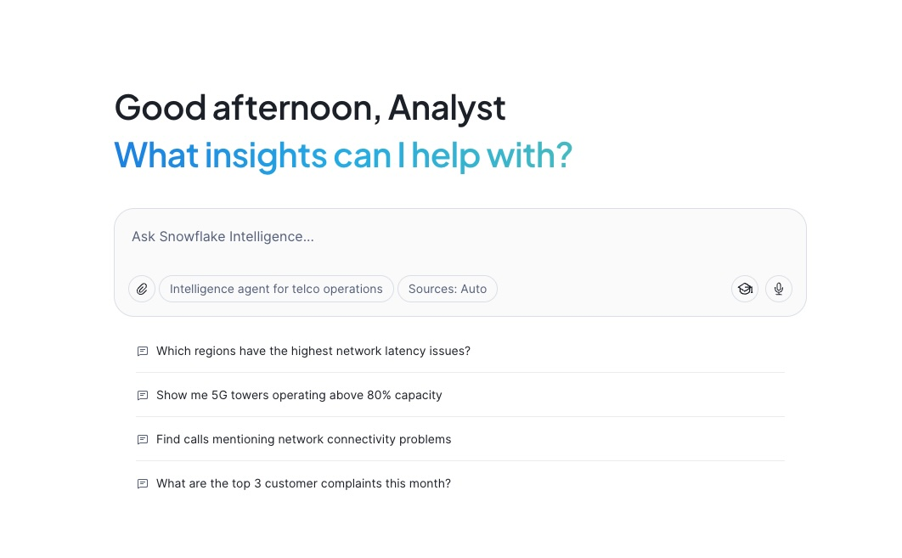

1. Navigate to **AI & ML Studio** → **Snowflake Intelligence** in your Snowflake account
2. Select the **Telco Operations AI Agent**
3. The agent will automatically select the right tools based on your question

**Location**: `SNOWFLAKE_INTELLIGENCE.AGENTS."Telco Operations AI Agent"`

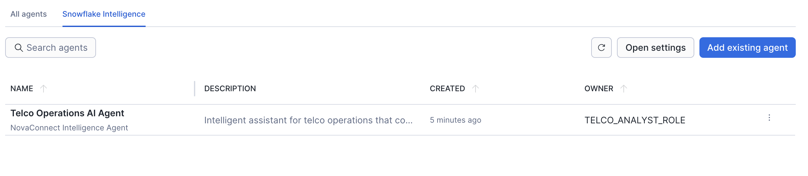

---

### Agent Architecture: 5 Powerful Tools

The Telco Operations AI Agent has access to **5 different tools** that it automatically orchestrates based on your questions:

#### Cortex Analyst Tools (3)

**1. network_performance**

- Network performance metrics for cell towers across regions
- Latency, speed measurements, user activity, service quality
- Uses: `network_performance.yaml` semantic model

**2. Customer_Feedback**

- Customer feedback analytics with sentiment analysis
- Feedback categorization and customer details including churn
- Uses: `customer_feedback.yaml` semantic model

**3. Infrastructure_Capacity**

- Infrastructure capacity metrics for telecom towers
- Bandwidth utilization, equipment status, capacity planning
- Uses: `infrastructure_capacity.yaml` semantic model

#### Cortex Search Tools (2)

**4. CALL_TRANSCRIPTS**

- Search customer call transcripts for specific issues or keywords
- Includes sentiment scores and speaker identification
- Service: `CALL_TRANSCRIPT_SEARCH`

**5. SUPPORT_TICKETS**

- Search support tickets for issue tracking and resolution
- Includes priority, category, and status information
- Service: `SUPPORT_TICKET_SEARCH`

---

### What the Agent Can Do

#### 1. Network Performance Analysis

**Try asking:**

> "Which regions have the highest network latency issues?"

The agent will:

- Query the network_performance semantic model
- Analyze latency metrics by region
- Rank regions by average latency
- Show you towers that need attention

**Behind the scenes:** Uses the `network_performance` Cortex Analyst tool to generate and execute SQL.

#### 2. Capacity Planning

**Try asking:**

> "Show me 5G towers operating above 80% capacity"

The agent will:

- Query infrastructure capacity data
- Filter for 5G towers with high utilization
- Show capacity exhaustion timelines
- Recommend upgrades where needed

**Data sources:** Infrastructure capacity metrics with utilization percentages and growth projections.

#### 3. Customer Call Analysis

**Try asking:**

> "Find calls mentioning network connectivity problems"

The agent will:

- Search call transcripts semantically
- Find conversations about connectivity issues
- Show sentiment scores for matching calls
- Identify patterns in customer complaints

**Demonstrates:** Semantic search across transcribed call recordings.

#### 4. Customer Churn Analysis

**Try asking:**

> "Which customer segments have the highest churn risk?"

The agent will:

- Analyze customer feedback and churn data
- Segment by customer type and plan
- Identify at-risk customers
- Correlate with complaint patterns

#### 5. Cross-Domain Insights

**Try asking:**

> "Are network issues correlated with negative customer sentiment?"

The agent will:

- Query both network performance and customer feedback
- Correlate latency spikes with complaint volumes
- Identify regions with both technical and satisfaction issues
- Provide actionable insights

#### 6. Email Report Generation

**Try asking:**

> "Send me an email summary of network performance issues"

The agent will:

- Compile findings from your session
- Format as professional email with markdown
- Save to EMAIL_PREVIEWS table
- Return SnowMail URL for viewing

**IMPORTANT**: After calling SEND_EMAIL, the agent will display a **clickable URL** - right-click or CMD+Click to open the email in SnowMail!

---

### Sample Conversation Flow

Here's an example conversation demonstrating the agent's capabilities:

**You:** "Which regions have the highest network latency issues?"

**Agent:** *Queries network performance, shows regions ranked by average latency*

**You:** "Show me 5G towers operating above 80% capacity"

**Agent:** *Queries infrastructure capacity, lists overloaded towers with utilization %*

**You:** "Find calls mentioning network connectivity problems"

**Agent:** *Searches call transcripts, returns matching conversations with sentiment*

**You:** "What are the top 3 customer complaints in October 2025?"

**Agent:** *Queries customer feedback, shows complaint categories ranked*

**You:** "Send me an email summary of our findings"

**Agent:** *Generates comprehensive email summary, returns SnowMail URL*

---

### Sample Questions to Try

Here are the sample questions configured in the agent:

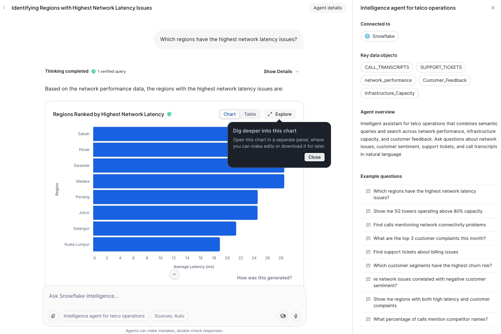

1. "Which regions have the highest network latency issues?"
2. "Show me 5G towers operating above 80% capacity"
3. "Find calls mentioning network connectivity problems"
4. "What are the top 3 customer complaints in October 2025?"
5. "Find support tickets about billing issues"
6. "Which customer segments have the highest churn risk?"
7. "Are network issues correlated with negative customer sentiment?"
8. "Show me regions with both high latency and customer complaints"
9. "What percentage of calls mention competitor names?"

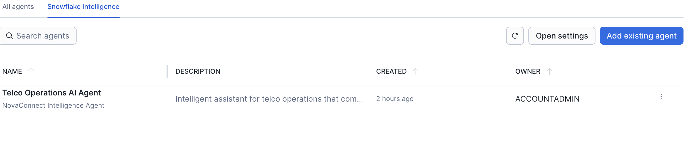

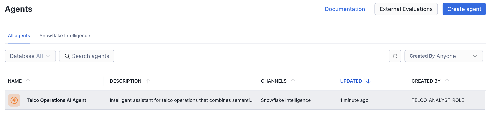

---

### Editing and Understanding the Agent

After using the agent, explore its configuration:

1. Navigate to **AI & ML Studio** → **Agents**
2. Click on **Telco Operations AI Agent**
3. Click **Edit** to view:
   - **Sample Questions**: The questions you just tried
   - **Tools**: All 5 tools available to the agent
   - **Orchestration Instructions**: How the agent decides which tools to use
   - **Access Control**: Who can use the agent

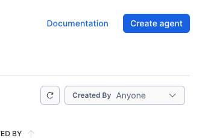

### Agent Configuration Details

When configuring the agent, you'll see these key sections:

**Agent Description:**

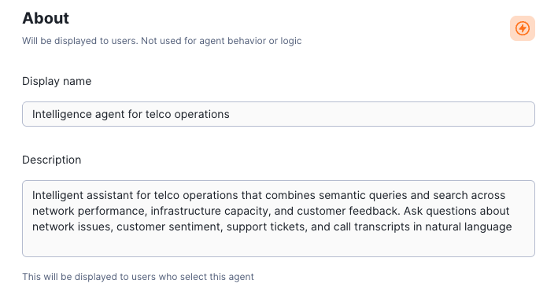

**Semantic Model YAML Files:**

The agent uses 3 semantic models located in the CORTEX_ANALYST stage:

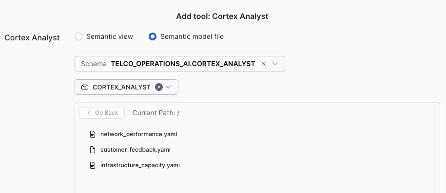

**Add Tools with Detailed Descriptions:**


**All 3 Semantic Model Tools:**

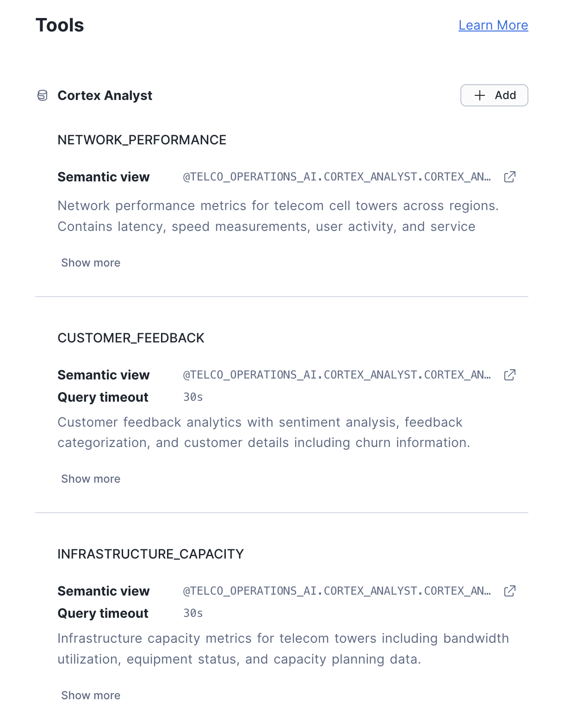

**Cortex Search Service Configuration:**

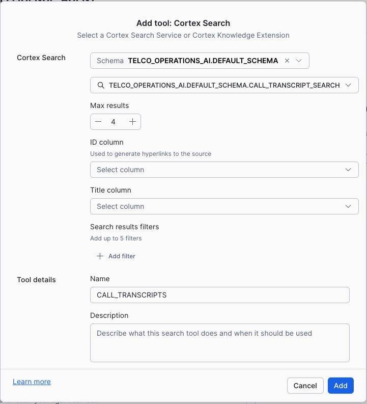

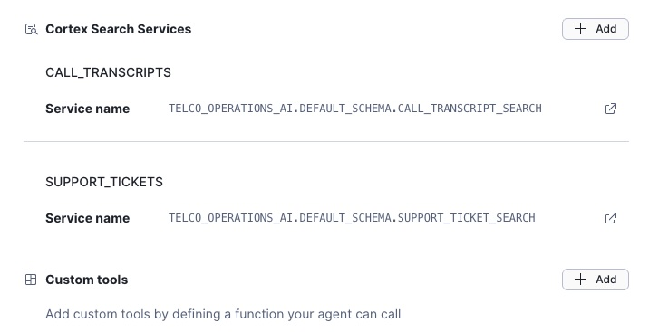

**Test Your Agent:**

The Test Agent interface is where you can interact with your AI assistant in real-time before publishing it. Here you can:

- **Ask natural language questions** about network performance, customer feedback, and infrastructure capacity
- **Verify tool selection** - watch which tools (Cortex Analyst semantic models or Cortex Search services) the agent chooses to answer each question
- **Review SQL generation** - see the actual SQL queries generated by Cortex Analyst for structured data questions
- **Test multi-tool queries** - try complex questions that require the agent to combine data from multiple sources
- **Refine responses** - iterate on your tool descriptions and instructions to improve answer quality
- **Debug issues** - identify when the agent selects the wrong tool or misunderstands a question

Try questions like: *"What regions have the highest call drop rates?"* or *"What are customers saying about 5G coverage?"*


**Configure Sample Questions:**

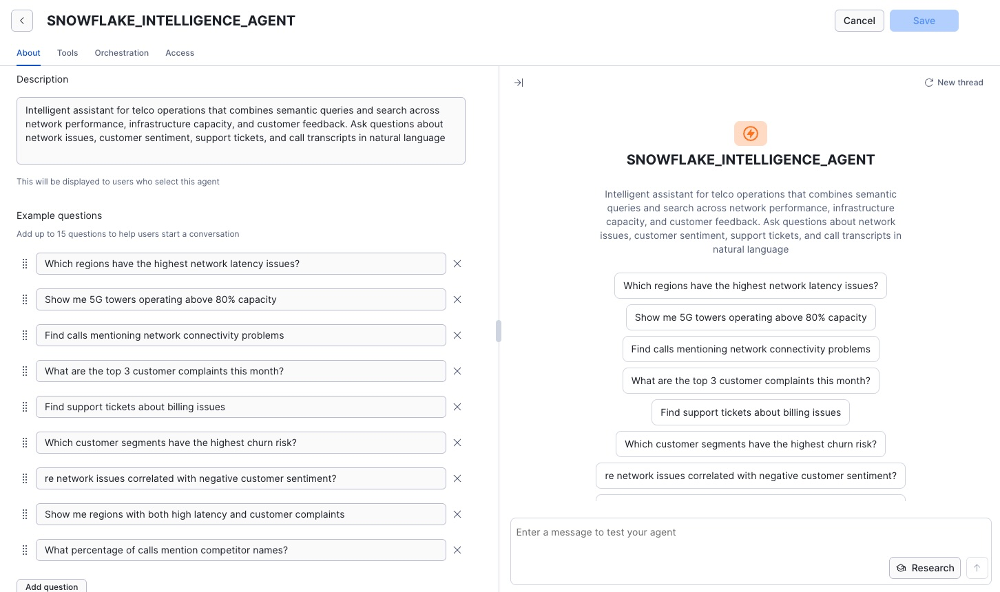

---

### Data Coverage

#### Network Data
- **Multiple Regions**: Geographic coverage across all operational areas
- **Network Types**: 4G and 5G towers
- **Performance Metrics**: Latency, speed, packet loss, availability

#### Customer Data
- **Customer Segments**: Consumer, Business, Enterprise
- **Plan Types**: Premium 5G, Standard 4G, Business Plan
- **Churn Analysis**: Reasons, at-risk identification

#### Interaction Data
- **25 Call Recordings**: Transcribed with AI_TRANSCRIBE
- **Support Tickets**: Categorized by type and priority
- **Feedback**: Sentiment analyzed by channel and region

---

### Configure Snowflake Intelligence Settings

To customize the appearance of your Intelligence interface:

1. Navigate to **AI & ML** → **Agents** → **Snowflake Intelligence** tab
2. Click **Open Settings**

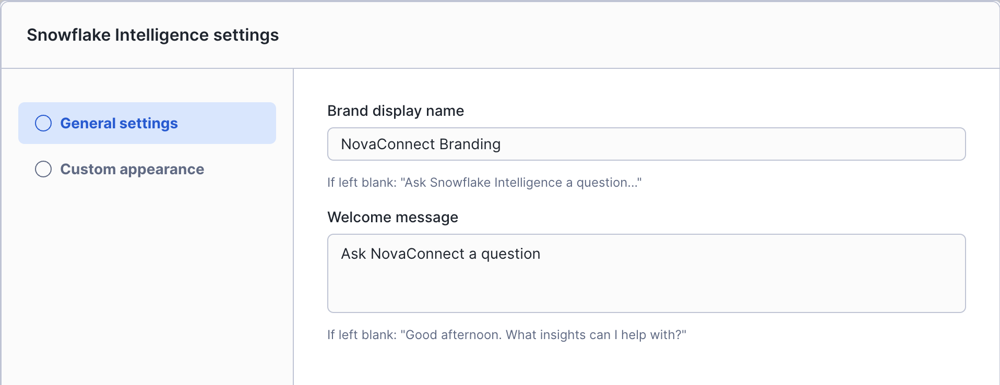

**Customize the Interface:**

- **Display Name**: "NovaConnect Intelligence" or your organization name
- **Description**: Brief description of what the agent can help with
- **Welcome Message**: Greeting users see when starting a conversation
- **Color Theme**: Match your brand colors

**Brand Your Intelligence with Logos:**

Use the NovaConnect logos to brand your interface:


---

### Tips for Best Results

#### Ask Specific Questions

✅ **Good**: "Which 5G towers have latency above 25ms?"
❌ **Too vague**: "Tell me about the network"

#### Use Follow-up Questions

The agent maintains context, so you can:

1. Ask initial question
2. Drill deeper on specific findings
3. Request different visualizations
4. Ask for comparisons
5. Request email summary

#### Request Email Summaries

End your research session with:

> "Send me an email summarizing our findings"

You'll get a professional email with all insights accessible via SnowMail!

---

### Understanding Agent Responses

#### When You See Charts

The agent automatically generates visualizations based on the orchestration instruction to convert to logs when comparing measures.

#### When You See "Checking multiple sources..."

The agent is:

- Querying semantic models
- Searching search services
- Combining results from multiple tools

This ensures comprehensive, validated answers.

#### When You See a SnowMail URL

**What to do**:

1. Right-click the URL
2. Select "Open in new tab" (or CMD+Click / CTRL+Click)
3. View your email in the SnowMail interface

**Note**: The email wasn't "sent" externally - it's saved for demo viewing.

---

### Data Limitations & Disclaimers

#### Synthetic Data

- **NovaConnect**: Entirely fictional telecommunications company
- **All metrics**: Synthetic but industry-realistic
- **Customer data**: Generated for demonstration purposes

#### Purpose

This is a **demonstration environment** showing telecommunications AI capabilities. **Do not make actual business decisions based on this data!**

---

## SnowMail Application

### Overview

SnowMail is a native Snowflake application that provides a Gmail-style email viewer for AI-generated reports and notifications.

### Access SnowMail

Navigate to: **Data Products** → **Apps** → **SNOWMAIL**

### What SnowMail Provides

- 📧 **Email Inbox** - View AI-generated email reports
- ⭐ **Starred Messages** - Mark important emails
- 📖 **Read/Unread Status** - Track which reports you've reviewed
- 🎨 **Snowflake Branding** - Professional formatting with Snowflake styling

### Using SnowMail

1. When the agent sends an email, it saves to the `EMAIL_PREVIEWS` table
2. Click the SnowMail URL provided by the agent
3. View your email in the Gmail-style interface
4. Star important reports for future reference

---

## Customize Regions (Optional)
Duration: 5

### Make the Demo Your Own

The sample data uses Malaysian regions by default (Kuala Lumpur, Selangor, Penang, etc.). If you'd like to customize the demo to use regions relevant to your geography, we've included a customization script.

### Running the Customization Script

1. Navigate to the SQL script in your Git repository:

```sql
-- Open from Snowflake UI or run directly
@TELCO_AI_REPO/branches/main/assets/sql/99_customize_regions.sql
```

2. Or create a new SQL worksheet and copy the script from:
   `assets/sql/99_customize_regions.sql`

### Available Presets

The script includes several preset configurations you can uncomment:

| Preset | Example Regions |
|--------|-----------------|
| **US Cities** | New York Metro, Los Angeles, Chicago, Houston, Phoenix |
| **European** | London, Paris, Berlin, Madrid, Rome, Amsterdam |
| **Generic** | Region Alpha, Region Beta, Region Gamma, etc. |

### Custom Mapping

To create your own mapping, modify the `INSERT INTO REGION_MAPPING` statements:

```sql
INSERT INTO REGION_MAPPING VALUES
    -- (Original Region, Your New Region, Original Prefix, Your New Prefix)
    ('Kuala Lumpur', 'Your City Name', 'KL', 'YCN'),
    ('Selangor', 'Another Region', 'SEL', 'AR'),
    -- ... add more as needed
```

### What Gets Updated

The script updates the following tables:
- `NETWORK_PERFORMANCE` - Tower regions and names
- `INFRASTRUCTURE_CAPACITY` - Tower regions and names  
- `CUSTOMER_FEEDBACK_SUMMARY` - Feedback regions

After running the customization, your agent queries will return results using your custom region names!

---

## Conclusion

### What You've Accomplished

In this quickstart, you've built a comprehensive AI-powered telecommunications operations platform using Snowflake's Cortex AI capabilities. You started by processing unstructured data—extracting insights from PDF help documents using Cortex Document Processing, transcribing customer call recordings with AI_TRANSCRIBE, and analyzing sentiment across thousands of data points. This transformed raw, unstructured telecommunications content into structured, queryable data that forms the foundation of intelligent applications.

You then created the AI services layer that makes this data accessible and actionable. Cortex Search services enable semantic search across call transcripts and support tickets—finding relevant information based on meaning rather than keywords. Cortex Analyst semantic models allow natural language queries against structured network and customer data, automatically generating SQL from plain English questions. Together, these services power the intelligence layer that connects users to insights without requiring technical expertise.

Finally, you deployed and explored the Snowflake Intelligence Agent—the "Telco Operations AI Agent" that orchestrates all of these capabilities through a conversational interface. The agent seamlessly combines search services, semantic models, and email notifications to answer complex operational questions, generate visualizations, and send email summaries via SnowMail. This demonstrates how modern AI platforms can unify structured and unstructured data analysis, enabling faster decision-making and deeper insights across telecommunications operations use cases.

### Resources

- **Repository**: [GitHub - Telco AI Assistant](https://github.com/Snowflake-Labs/sfquickstarts/tree/master/site/sfguides/src/build-an-ai-assistant-for-telco-with-aisql-and-snowflake-intelligence)
- **Documentation**: See README.md in repository

---

**Ready to build AI-powered applications with Snowflake Cortex?** Start experimenting with your own data today!

### Related Resources

- [Snowflake AI and ML Features](https://docs.snowflake.com/guides-overview-ai-features)
- [Snowflake Intelligence Overview](https://docs.snowflake.com/en/user-guide/snowflake-cortex/snowflake-intelligence)
- [Snowflake for Telecommunications](https://www.snowflake.com/en/solutions/industries/telecommunications/)

---

## Re-deploying / Reset

Since the Git repo is in a separate database, you can easily reset:

```sql
-- Drop the main database (Git repo stays safe!)
DROP DATABASE IF EXISTS TELCO_OPERATIONS_AI;
DROP DATABASE IF EXISTS SNOWFLAKE_INTELLIGENCE;
DROP APPLICATION IF EXISTS SNOWMAIL;
DROP APPLICATION PACKAGE IF EXISTS SNOWMAIL_PKG;
DROP DATABASE IF EXISTS TELCO_OPERATIONS_AI_SNOWMAIL_PKG;

-- Fetch latest code
ALTER GIT REPOSITORY SNOWFLAKE_QUICKSTART_REPOS.GIT_REPOS.TELCO_AI_REPO FETCH;

-- Re-run deployment scripts (01-06)
EXECUTE IMMEDIATE FROM @SNOWFLAKE_QUICKSTART_REPOS.GIT_REPOS.TELCO_AI_REPO/branches/master/site/sfguides/src/build-an-ai-assistant-for-telco-with-aisql-and-snowflake-intelligence/assets/sql/01_configure_account.sql;
EXECUTE IMMEDIATE FROM @SNOWFLAKE_QUICKSTART_REPOS.GIT_REPOS.TELCO_AI_REPO/branches/master/site/sfguides/src/build-an-ai-assistant-for-telco-with-aisql-and-snowflake-intelligence/assets/sql/02_data_foundation.sql;
EXECUTE IMMEDIATE FROM @SNOWFLAKE_QUICKSTART_REPOS.GIT_REPOS.TELCO_AI_REPO/branches/master/site/sfguides/src/build-an-ai-assistant-for-telco-with-aisql-and-snowflake-intelligence/assets/sql/03_deploy_cortex_search.sql;
EXECUTE IMMEDIATE FROM @SNOWFLAKE_QUICKSTART_REPOS.GIT_REPOS.TELCO_AI_REPO/branches/master/site/sfguides/src/build-an-ai-assistant-for-telco-with-aisql-and-snowflake-intelligence/assets/sql/04_deploy_cortex_analyst.sql;
EXECUTE IMMEDIATE FROM @SNOWFLAKE_QUICKSTART_REPOS.GIT_REPOS.TELCO_AI_REPO/branches/master/site/sfguides/src/build-an-ai-assistant-for-telco-with-aisql-and-snowflake-intelligence/assets/sql/05_deploy_notebooks.sql;
EXECUTE IMMEDIATE FROM @SNOWFLAKE_QUICKSTART_REPOS.GIT_REPOS.TELCO_AI_REPO/branches/master/site/sfguides/src/build-an-ai-assistant-for-telco-with-aisql-and-snowflake-intelligence/assets/sql/06_deploy_snowmail.sql;
```
