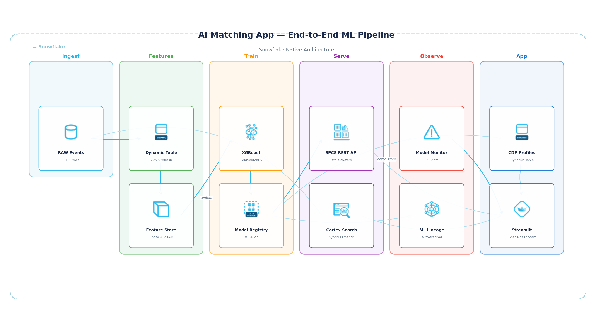

author: Abhinav Bannerjee
id: build-an-ai-matching-app-with-snowflake-ml
summary: Build an AI-powered matching application on Snowflake using Dynamic Tables, Feature Store, Model Registry, SPCS, Cortex Search, Model Monitoring, and Streamlit.
categories: snowflake-site:taxonomy/solution-center/certification/quickstart, snowflake-site:taxonomy/product/ai, snowflake-site:taxonomy/product/applications-and-collaboration, snowflake-site:taxonomy/snowflake-feature/model-development, snowflake-site:taxonomy/snowflake-feature/snowpark-container-services, snowflake-site:taxonomy/snowflake-feature/cortex-search, snowflake-site:taxonomy/snowflake-feature/dynamic-tables, snowflake-site:taxonomy/snowflake-feature/streamlit, snowflake-site:taxonomy/snowflake-feature/snowpark, snowflake-site:taxonomy/snowflake-feature/snowflake-ml-functions, snowflake-site:taxonomy/industry/advertising-media-and-entertainment
language: en
environments: web
status: Published
feedback link: https://github.com/Snowflake-Labs/sfguides/issues
tags: Snowflake ML, Model Registry, Feature Store, SPCS, Cortex Search, Dynamic Tables, Streamlit, XGBoost, Machine Learning, Creator Economy, Model Monitoring
Duration: 90
fork repo link: https://github.com/Snowflake-Labs/sfquickstarts/tree/master/site/sfguides/src/build-an-ai-matching-app-with-snowflake-ml/assets

# Build an AI Matching App with Snowflake ML
<!-- ------------------------ -->
## Overview

In this guide, you will build an AI-powered matching application entirely on Snowflake. The use case is **creator-brand matching** for a commerce platform, but the architecture pattern applies to any two-sided matching problem: job candidates to roles, patients to providers, products to customers, and more.

You will train an XGBoost classification model using Snowflake ML, deploy it for both batch and real-time inference, add semantic search over unstructured content, and wrap everything in an interactive Streamlit dashboard.

### Prerequisites

- Basic familiarity with SQL and Python
- Understanding of machine learning concepts (classification, training/test split, AUC)

### What You'll Learn

- How to use **Dynamic Tables** for automated feature engineering from behavioral event data
- How to register entities and feature views in the **Snowflake Feature Store** with online serving
- How to train an XGBoost model and log it to the **Snowflake Model Registry** with versioning, aliases, and RBAC
- How to deploy a model as a real-time REST API using **Snowpark Container Services (SPCS)** with scale-to-zero
- How to create a **Cortex Search** service for hybrid semantic search over creator content
- How to build a multi-page **Streamlit in Snowflake** dashboard that ties all components together

### What You'll Need

- A [Snowflake account](https://signup.snowflake.com/?utm_cta=quickstarts_) (Enterprise Edition or higher recommended)
- A role with privileges to create databases, schemas, warehouses, compute pools, and Streamlit apps
- Python 3.9+ with `pip` ([Miniconda](https://docs.conda.io/en/latest/miniconda.html) recommended)
- A SQL client or [Snowsight](https://docs.snowflake.com/en/user-guide/ui-snowsight) for running setup scripts

### What You'll Build

- A Dynamic Table that auto-refreshes engagement features from 500K behavioral events
- A Feature Store with a CREATOR entity and feature views for training and online serving
- An XGBoost match-score model registered in the Model Registry (V1 with auto-endpoints, V2 with custom multi-endpoint)
- A real-time SPCS inference service with a public REST endpoint
- A Cortex Search service over 200 creator content records with filtering by category and platform
- A 6-page Streamlit dashboard: Feature Store explorer, Model Registry viewer, Inference playground, CDP Profiles, Cortex Search, and Model Monitoring

### Architecture



<!-- ------------------------ -->
## Set Up Your Environment

### Download the Source Files

Download the source files from the [assets folder](https://github.com/Snowflake-Labs/sfquickstarts/tree/master/site/sfguides/src/build-an-ai-matching-app-with-snowflake-ml/assets) on GitHub.

Alternatively, use a sparse clone to download only this guide's files (~5 MB):

```bash
git clone --no-checkout --depth 1 --filter=blob:none --sparse \
  https://github.com/Snowflake-Labs/sfquickstarts.git
cd sfquickstarts
git sparse-checkout set site/sfguides/src/build-an-ai-matching-app-with-snowflake-ml/assets
```

### Install Python Dependencies

```bash
pip install snowflake-ml-python>=1.7.0 snowflake-connector-python xgboost scikit-learn pandas numpy matplotlib sentence-transformers
```

Or use the provided conda environment file (after the sparse clone above, run from the `sfquickstarts` directory):

```bash
conda env create -f site/sfguides/src/build-an-ai-matching-app-with-snowflake-ml/assets/notebooks/environment.yml
conda activate creator_brand_match
```

### Run the Setup SQL

Open a SQL worksheet in Snowsight and paste the contents of [00_setup.sql](https://github.com/Snowflake-Labs/sfquickstarts/blob/master/site/sfguides/src/build-an-ai-matching-app-with-snowflake-ml/assets/sql/00_setup.sql). This creates:

- **CC_DEMO** database with 5 schemas: `RAW`, `ML`, `ML_REGISTRY`, `FEATURE_STORE`, `APPS`
- **CC_ML_WH** warehouse (MEDIUM, auto-suspend 120s)
- **CC_COMPUTE_POOL** for SPCS model serving (CPU_X64_XS, max 2 nodes)
- Raw data tables: `CREATORS`, `BRANDS`, `BEHAVIORAL_EVENTS`, `CREATOR_BRAND_INTERACTIONS`, `CREATOR_CONTENT`
- A Dynamic Table `CREATOR_ENGAGEMENT_FEATURES` with 2-minute target lag
- 200 sample content records across 8 categories for Cortex Search

```sql
-- Run the full setup script in Snowsight
-- File: sql/00_setup.sql
```

### Generate Synthetic Data

The data generator creates realistic creator-brand interaction data using archetype-driven distributions. Download [generate_synthetic_data.py](https://github.com/Snowflake-Labs/sfquickstarts/blob/master/site/sfguides/src/build-an-ai-matching-app-with-snowflake-ml/assets/scripts/generate_synthetic_data.py) and run:

```bash
export SNOWFLAKE_CONNECTION_NAME=<your_connection>
python scripts/generate_synthetic_data.py
```

This populates:

| Table | Rows | Description |
|-------|------|-------------|
| CREATORS | 10,000 | Creators across 4 archetypes (Power Performer, Rising Star, Steady Earner, Long Tail) |
| BRANDS | 1,000 | Brands across 8 categories with 4 budget tiers |
| BEHAVIORAL_EVENTS | 500,000 | Click, view, purchase, share, and save events over 7 days |
| CREATOR_BRAND_INTERACTIONS | 100,000 | Campaign interaction records with conversion labels |

<!-- ------------------------ -->
## Build Dynamic Features

### How Dynamic Tables Work

The setup SQL already created a Dynamic Table that auto-computes rolling engagement features from raw behavioral events:

```sql
-- Already created by 00_setup.sql
CREATE OR REPLACE DYNAMIC TABLE CREATOR_ENGAGEMENT_FEATURES
    TARGET_LAG = '2 minutes'
    WAREHOUSE = CC_ML_WH
AS
SELECT
    CREATOR_ID,
    COUNT(DISTINCT SESSION_ID)                                AS SESSIONS_7D,
    AVG(CLICK_THROUGH_RATE)                                   AS AVG_CTR_7D,
    SUM(CASE WHEN EVENT_TYPE = 'purchase' THEN 1 ELSE 0 END) AS PURCHASES_7D,
    SUM(GMV)                                                  AS GMV_7D,
    COUNT(DISTINCT BRAND_ID)                                  AS UNIQUE_BRANDS_7D,
    AVG(ENGAGEMENT_SCORE)                                     AS AVG_ENGAGEMENT_7D,
    CURRENT_TIMESTAMP()                                       AS FEATURE_TIMESTAMP
FROM CC_DEMO.RAW.BEHAVIORAL_EVENTS
WHERE EVENT_DATE >= DATEADD('day', -7, CURRENT_DATE())
GROUP BY CREATOR_ID;
```

### Verify the Dynamic Table

Upload `notebooks/creator_brand_match.py` to Snowsight as a Python Notebook and run the first few cells:

```python
from snowflake.snowpark.context import get_active_session

session = get_active_session()
session.use_database("CC_DEMO")
session.use_warehouse("CC_ML_WH")

# Quickstart telemetry tag (required for sfguide tracking)
session.query_tag = {"origin": "sf_sit-is",
                     "name": "sfguide_creator_brand_match",
                     "version": {"major": 1, "minor": 0},
                     "attributes": {"is_quickstart": 1, "source": "notebook"}}

# Check Dynamic Table status
session.sql("""
    SHOW DYNAMIC TABLES LIKE 'CREATOR_ENGAGEMENT%' IN SCHEMA CC_DEMO.ML
""").select('"name"', '"target_lag"', '"refresh_mode"', '"scheduling_state"', '"rows"').show()

# Preview features
session.table("CC_DEMO.ML.CREATOR_ENGAGEMENT_FEATURES").limit(10).show()
```

The Dynamic Table refreshes automatically every 2 minutes. No scheduling, no ETL pipelines, no infrastructure to maintain.

> **Expected output:** The `SHOW DYNAMIC TABLES` query returns one row with `scheduling_state = ACTIVE` and `rows` showing `~10,000`. The preview shows 6 numeric features per creator.

<!-- ------------------------ -->
## Register Feature Store

### Create Entity and Feature Views

The Feature Store makes features discoverable, governed, and reusable. Register a `CREATOR` entity and attach the Dynamic Table as a feature view:

```python
from snowflake.ml.feature_store import FeatureStore, FeatureView, Entity, CreationMode

fs = FeatureStore(
    session=session,
    database="CC_DEMO",
    name="FEATURE_STORE",
    default_warehouse="CC_ML_WH",
    creation_mode=CreationMode.CREATE_IF_NOT_EXIST,
)

# Register the CREATOR entity
creator_entity = Entity(
    name="CREATOR",
    join_keys=["CREATOR_ID"],
    desc="Creator — lifestyle influencer on the platform",
)
fs.register_entity(creator_entity)

# Register engagement features from the Dynamic Table
engagement_df = session.table("CC_DEMO.ML.CREATOR_ENGAGEMENT_FEATURES")
engagement_fv = FeatureView(
    name="CREATOR_ENGAGEMENT_7D",
    entities=[creator_entity],
    feature_df=engagement_df,
    timestamp_col="FEATURE_TIMESTAMP",
    refresh_freq="2 minutes",
    desc="Rolling 7-day creator engagement metrics from behavioral events",
)
engagement_fv = engagement_fv.attach_feature_desc({
    "SESSIONS_7D": "Distinct sessions in last 7 days",
    "AVG_CTR_7D": "Average click-through rate (7d)",
    "PURCHASES_7D": "Total purchases driven (7d)",
    "GMV_7D": "Total gross merchandise value driven (7d)",
    "UNIQUE_BRANDS_7D": "Distinct brands interacted with (7d)",
    "AVG_ENGAGEMENT_7D": "Average engagement score (7d)",
})
engagement_fv = fs.register_feature_view(feature_view=engagement_fv, version="V1")
```

> **Expected output:** `"Entity CREATOR registered"` and `"FeatureView CREATOR_ENGAGEMENT_7D/V1 registered"`. If they already exist, you'll see skip messages — this is normal for re-runs.

### Register an Online Feature View

Online serving delivers creator profile features in under 30ms for real-time inference. Register a `CREATOR_PROFILE` feature view backed by static creator attributes with online serving enabled:

```python
from snowflake.ml.feature_store.feature_view import OnlineConfig

profile_df = session.sql("""
    SELECT CREATOR_ID, FOLLOWER_COUNT, CATEGORY, COUNTRY,
           AVG_ENGAGEMENT AS HISTORICAL_ENGAGEMENT
    FROM CC_DEMO.RAW.CREATORS
""")

try:
    profile_fv = FeatureView(
        name="CREATOR_PROFILE",
        entities=[creator_entity],
        feature_df=profile_df,
        desc="Static creator profile with online serving for real-time lookups",
        online_config=OnlineConfig(enable=True, target_lag="30 seconds"),
    )
    profile_fv = fs.register_feature_view(feature_view=profile_fv, version="V1")
    print(f"Online Feature View: {profile_fv.name} v{profile_fv.version}")
    print(f"Online serving enabled: {profile_fv.online}")
except Exception as e:
    print(f"Online serving not available on this account: {e}")
    print("Note: Online feature tables require Snowflake >= 9.26")
```

> **Expected output:** `"Online Feature View: CREATOR_PROFILE vV1"`. If your account doesn't support online serving, you'll see `"Online serving not available on this account"` — the feature view is still registered, just without the online endpoint.

### Generate a Training Dataset

The Feature Store generates training data with **ASOF joins** to prevent data leakage. Each row gets feature values that were available at the time of the interaction:

```python
spine_df = session.table("CC_DEMO.RAW.CREATOR_BRAND_INTERACTIONS").select(
    "CREATOR_ID", "BRAND_ID", "EVENT_TIMESTAMP", "CONVERTED"
).limit(50_000)

training_dataset = fs.generate_dataset(
    name="DEMO_TRAINING",
    spine_df=spine_df,
    features=[engagement_fv],
    spine_timestamp_col="EVENT_TIMESTAMP",
    desc="Training dataset for creator-brand match model",
    output_type="table",
)

training_pd = training_dataset.to_pandas()
print(f"Training dataset shape: {training_pd.shape}")
print(f"Label distribution:\n{training_pd['CONVERTED'].value_counts()}")
```

> **Expected output:** `"Training dataset shape: (50000, 10)"` with a roughly 37/63 label split (CONVERTED=1 vs 0).

<!-- ------------------------ -->
## Train the Match Model

### Train XGBoost

Train an XGBoost classifier on the 6 engagement features to predict creator-brand match quality:

```python
import xgboost as xgb
from sklearn.model_selection import train_test_split, GridSearchCV
from sklearn.metrics import roc_auc_score, f1_score, classification_report

feature_cols = [
    "SESSIONS_7D", "AVG_CTR_7D", "PURCHASES_7D",
    "GMV_7D", "UNIQUE_BRANDS_7D", "AVG_ENGAGEMENT_7D",
]
label_col = "CONVERTED"

df = training_pd.dropna(subset=feature_cols)
X = df[feature_cols].fillna(0)
y = df[label_col].astype(int)

X_train, X_test, y_train, y_test = train_test_split(
    X, y, test_size=0.2, random_state=42, stratify=y
)

# --- Baseline model (V0) ---
baseline_model = xgb.XGBClassifier(
    n_estimators=100, max_depth=4, learning_rate=0.1,
    eval_metric="logloss", random_state=42,
)
baseline_model.fit(X_train, y_train)
baseline_auc = roc_auc_score(y_test, baseline_model.predict_proba(X_test)[:, 1])
print(f"Baseline AUC-ROC: {baseline_auc:.4f}")

# --- Hyperparameter optimization via GridSearchCV ---
param_grid = {
    "max_depth": [4, 6, 8],
    "n_estimators": [100, 200],
    "learning_rate": [0.05, 0.1],
}

grid_search = GridSearchCV(
    estimator=xgb.XGBClassifier(eval_metric="logloss", random_state=42),
    param_grid=param_grid,
    cv=3,
    scoring="roc_auc",
    n_jobs=-1,
    verbose=1,
)
grid_search.fit(X_train, y_train)

model = grid_search.best_estimator_
print(f"\nBest parameters: {grid_search.best_params_}")
print(f"Best CV AUC-ROC: {grid_search.best_score_:.4f}")

y_pred = model.predict(X_test)
y_prob = model.predict_proba(X_test)[:, 1]

auc = roc_auc_score(y_test, y_prob)
f1 = f1_score(y_test, y_pred)

print(f"\nOptimized model — Test AUC-ROC: {auc:.4f}  (baseline: {baseline_auc:.4f})")
print(f"Optimized model — Test F1 Score: {f1:.4f}")
print()
print(classification_report(y_test, y_pred, target_names=["No Match", "Match"]))
```

You should see AUC in the range **0.65–0.75**, indicating the model has learned meaningful patterns from the engagement features. AUC is the primary metric here because match scoring is a ranking problem — we care about ordering creators correctly, not about a specific probability threshold. F1 will vary more across runs since it depends on the default 0.5 cutoff; the classification report shows the full precision/recall breakdown.

### Log to Model Registry

Register the trained model as a first-class Snowflake object with versioning, metrics, and RBAC:

```python
from snowflake.ml.registry import Registry
from snowflake.ml.model import task

reg = Registry(session=session, database_name="CC_DEMO", schema_name="ML_REGISTRY")

try:
    mv = reg.get_model("CREATOR_BRAND_MATCH").version("V1")
    print("Model CREATOR_BRAND_MATCH V1 already exists — using existing version")
except:
    mv = reg.log_model(
        model=model,
        model_name="CREATOR_BRAND_MATCH",
        version_name="V1",
        conda_dependencies=["xgboost"],
        sample_input_data=X_test.head(10),
        comment="XGBoost creator-brand match model",
        metrics={"auc_roc": round(auc, 4), "f1_score": round(f1, 4)},
        task=task.Task.TABULAR_BINARY_CLASSIFICATION,
    )
    print("Model: CREATOR_BRAND_MATCH V1 — logged to registry")
print(f"\nAvailable functions:")
for fn in mv.show_functions():
    print(f"  {fn['name']} ({fn['target_method_function_type']})")
print(f"\nStored metrics: {mv.show_metrics()}")

# Set default version and production alias
m = reg.get_model("CREATOR_BRAND_MATCH")
m.default = "V1"

try:
    session.sql("""
        ALTER MODEL CC_DEMO.ML_REGISTRY.CREATOR_BRAND_MATCH
        VERSION V1 SET ALIAS = PRODUCTION
    """).collect()
    print("Alias 'PRODUCTION' set on V1")
except:
    print("Alias 'PRODUCTION' already exists on V1")

print("\nModel versions:")
print(m.show_versions().to_string())
```

V1 automatically gets `PREDICT`, `PREDICT_PROBA`, and `EXPLAIN` endpoints with zero additional code.

> **Expected output:** `"Model: CREATOR_BRAND_MATCH V1 — logged to registry"` with three listed functions and stored metrics showing your AUC and F1 values. On re-runs, you'll see `"already exists — using existing version"`.

### Govern Access with RBAC

Models are first-class Snowflake objects with full RBAC. Grant usage to ML engineers for inference and restrict production promotion to senior roles — no external ACL system needed:

```python
print("Model RBAC — granting access across teams:")

# Grant inference access to a data science role
session.sql("""
    GRANT USAGE ON MODEL CC_DEMO.ML_REGISTRY.CREATOR_BRAND_MATCH
    TO ROLE SYSADMIN
""").collect()
print("  GRANT USAGE ON MODEL → SYSADMIN (can run inference)")

# Note: MODEL objects support USAGE and OWNERSHIP privileges
# MONITOR is not a valid privilege for MODEL objects
print("  Note: Use USAGE for inference, OWNERSHIP for full control")

print("""
RBAC patterns for production:
  GRANT USAGE ON MODEL ... TO ROLE ML_ENGINEER;      -- inference only
  GRANT OWNERSHIP ON MODEL ... TO ROLE ML_ADMIN;     -- full control
  -- Version-level: only ML_ADMIN can SET ALIAS = 'PRODUCTION'
""")

# Show current grants
print("Current grants on CREATOR_BRAND_MATCH:")
session.sql("""
    SHOW GRANTS ON MODEL CC_DEMO.ML_REGISTRY.CREATOR_BRAND_MATCH
""").show()
```

> **Expected output:** The grants table shows `OWNERSHIP` held by `ACCOUNTADMIN` and `USAGE` granted to `SYSADMIN`.

### Trace ML Lineage

Snowflake tracks object-level lineage automatically. Query `ACCOUNT_USAGE.OBJECT_DEPENDENCIES` to see how raw tables feed Dynamic Tables, which feed Feature Views, which feed model training — all without external orchestration or metadata catalogs:

```python
print("ML Lineage — data-to-model dependency chain:")
lineage_df = session.sql("""
    SELECT
        REFERENCING_OBJECT_NAME   AS DOWNSTREAM,
        REFERENCING_OBJECT_DOMAIN AS DOWNSTREAM_TYPE,
        REFERENCED_OBJECT_NAME    AS UPSTREAM,
        REFERENCED_OBJECT_DOMAIN  AS UPSTREAM_TYPE
    FROM SNOWFLAKE.ACCOUNT_USAGE.OBJECT_DEPENDENCIES
    WHERE REFERENCED_DATABASE  = 'CC_DEMO'
       OR REFERENCING_DATABASE = 'CC_DEMO'
    ORDER BY DOWNSTREAM
""")
lineage_df.show()

print("""
Lineage chain (auto-tracked by Snowflake):
  RAW.CREATORS ──► ML.CREATOR_PROFILE$V1 (Feature View)
  RAW.BEHAVIORAL_EVENTS ──► ML.CREATOR_ENGAGEMENT_FEATURES (Dynamic Table)
  ML.CREATOR_ENGAGEMENT_FEATURES ──► ML.CREATOR_ENGAGEMENT_7D$V1 (Feature View)
  Feature Views ──► Model Training ──► ML_REGISTRY.CREATOR_BRAND_MATCH

No external lineage tool needed — Snowflake knows the full graph.
""")
```

> **Expected output:** The printed lineage chain shows the full dependency path. Note: The `OBJECT_DEPENDENCIES` query may return empty results for newly created objects — `ACCOUNT_USAGE` views have up to 180 minutes of latency. The printed chain description is always accurate.

<!-- ------------------------ -->
## Deploy Real-Time Inference

### Batch Inference via Warehouse

Score all creators using SQL-based inference. This approach keeps CREATOR_ID in scope and runs entirely on the warehouse:

```python
results = session.sql("""
    SELECT
        e.CREATOR_ID,
        CC_DEMO.ML_REGISTRY.CREATOR_BRAND_MATCH!PREDICT_PROBA(
            e.SESSIONS_7D, e.AVG_CTR_7D, e.PURCHASES_7D,
            e.GMV_7D, e.UNIQUE_BRANDS_7D, e.AVG_ENGAGEMENT_7D
        ):"output_feature_1"::FLOAT AS MATCH_SCORE
    FROM CC_DEMO.ML.CREATOR_ENGAGEMENT_FEATURES e
    ORDER BY MATCH_SCORE DESC
""")

print("Top 10 Creators by Match Score:")
results.show(10)
```

### Deploy to SPCS

Deploy the model as a real-time REST API with Snowpark Container Services:

```python
mv.create_service(
    service_name="CC_MATCH_SERVICE",
    service_compute_pool="CC_COMPUTE_POOL",
    ingress_enabled=True,
    min_instances=0,   # Scale to zero when idle
    max_instances=3,
)
```

> **Tip:** `min_instances=0` enables scale-to-zero. The service auto-suspends after 30 minutes of inactivity, costing nothing when idle. First cold-start takes 2-3 minutes.

> **Expected output:** The service begins provisioning. Run `SHOW SERVICES IN COMPUTE POOL CC_COMPUTE_POOL` to check status — it will show `PENDING` initially, then `READY` after 2-3 minutes.

### Call the REST API

Once deployed, any external application can call the endpoint:

```bash
curl -X POST "https://<service-id>.snowflakecomputing.app/predict" \
  -H 'Authorization: Snowflake Token="<your-pat>"' \
  -H 'Content-Type: application/json' \
  -d '{
    "dataframe_split": {
      "columns": ["SESSIONS_7D","AVG_CTR_7D","PURCHASES_7D",
                   "GMV_7D","UNIQUE_BRANDS_7D","AVG_ENGAGEMENT_7D"],
      "data": [[25, 0.05, 3, 150.0, 5, 0.7]]
    }
  }'
```

Or invoke directly via SQL:

```sql
SELECT CC_DEMO.ML_REGISTRY.CREATOR_BRAND_MATCH!PREDICT_PROBA(
    10, 0.05, 3, 150.0, 5, 0.7
) AS MATCH_SCORE;
```

<!-- ------------------------ -->
## Build Multi-Endpoint Model

### Why a CustomModel

V1 provides automatic endpoints, but sometimes you need custom business logic. V2 uses `CustomModel` to define **three inference APIs** on a single set of weights:

- `predict_match_score` - Simple match probability
- `predict_ranked` - Ranked creator list with scores
- `predict_with_features` - Score plus per-feature contributions (SHAP workaround)

```python
import tempfile, joblib, xgboost as xgb
from snowflake.ml.model import custom_model

tmp_dir = tempfile.mkdtemp()
model_path = f"{tmp_dir}/xgb_model.joblib"
joblib.dump(model, model_path)

class CreatorMatchMultiEndpoint(custom_model.CustomModel):

    def __init__(self, context: custom_model.ModelContext) -> None:
        super().__init__(context)
        self.model = joblib.load(context.path("xgb_model"))

    @custom_model.inference_api
    def predict_match_score(self, input_df: pd.DataFrame) -> pd.DataFrame:
        proba = self.model.predict_proba(input_df)[:, 1]
        return pd.DataFrame({"MATCH_SCORE": proba})

    @custom_model.inference_api
    def predict_ranked(self, input_df: pd.DataFrame) -> pd.DataFrame:
        proba = self.model.predict_proba(input_df)[:, 1]
        result = input_df.copy()
        result["MATCH_SCORE"] = proba
        return result.sort_values("MATCH_SCORE", ascending=False).reset_index(drop=True)

    @custom_model.inference_api
    def predict_with_features(self, input_df: pd.DataFrame) -> pd.DataFrame:
        proba = self.model.predict_proba(input_df)[:, 1]
        booster = self.model.get_booster()
        dmat = xgb.DMatrix(input_df)
        contribs = booster.predict(dmat, pred_contribs=True)
        result = pd.DataFrame({"MATCH_SCORE": proba})
        for i, col in enumerate(input_df.columns):
            result[f"{col}_CONTRIB"] = contribs[:, i]
        result["BIAS"] = contribs[:, -1]
        return result

mc = custom_model.ModelContext(models={}, artifacts={"xgb_model": model_path})
multi_model = CreatorMatchMultiEndpoint(mc)

mv2 = reg.log_model(
    model=multi_model,
    model_name="CREATOR_BRAND_MATCH",
    version_name="V2",
    pip_requirements=["xgboost", "joblib"],
    sample_input_data=X_test.head(5),
    comment="Multi-endpoint CustomModel with 3 inference APIs",
)
```

### Invoke Any Endpoint via SQL

```sql
-- Match score only
SELECT CC_DEMO.ML_REGISTRY.CREATOR_BRAND_MATCH!PREDICT_MATCH_SCORE(
    10, 0.05, 3, 150.0, 5, 0.7
) AS SCORE;

-- Score with per-feature contributions
SELECT CC_DEMO.ML_REGISTRY.CREATOR_BRAND_MATCH!PREDICT_WITH_FEATURES(
    10, 0.05, 3, 150.0, 5, 0.7
) AS EXPLAINED;
```

<!-- ------------------------ -->
## Explain Model Predictions

### Two-Layer Explainability

The Model Registry provides a built-in `EXPLAIN` function, but for production dashboards we use a two-layer approach: quantitative feature contributions via XGBoost's native `pred_contribs` (identical Shapley values, zero dependencies), then Cortex LLM to translate those numbers into actionable business narratives:

```python
import matplotlib.pyplot as plt
import numpy as np

# XGBoost native Shapley values via pred_contribs
booster = model.get_booster()
dmat = xgb.DMatrix(X_test)
shap_values = booster.predict(dmat, pred_contribs=True)

# shap_values shape: (n_samples, n_features + 1) — last column is bias
feature_importance = np.abs(shap_values[:, :-1]).mean(axis=0)

print("Layer 1 — Quantitative Feature Importance (XGBoost native Shapley values):")
for name, imp in sorted(zip(feature_cols, feature_importance), key=lambda x: -x[1]):
    print(f"  {name:25s} {imp:.4f}")

# Bar chart of mean |SHAP| values
fig, ax = plt.subplots(figsize=(8, 4))
sorted_idx = np.argsort(feature_importance)
ax.barh([feature_cols[i] for i in sorted_idx], feature_importance[sorted_idx])
ax.set_xlabel("Mean |SHAP Value|")
ax.set_title("Feature Importance — XGBoost Shapley Values")
plt.tight_layout()
plt.show()

# --- Layer 2: Cortex LLM Business Narrative ---
print("\nLayer 2 — Cortex LLM Business Narrative:")

# Pick a sample creator and build context for the LLM
sample_idx = 0
sample_features = X_test.iloc[sample_idx]
sample_shap = shap_values[sample_idx, :-1]  # exclude bias

# Build feature context string
feature_context = "\n".join(
    f"  - {name}: value={sample_features[name]:.3f}, SHAP contribution={sample_shap[i]:+.4f}"
    for i, name in enumerate(feature_cols)
)

prompt = f"""You are a data analyst for a creator commerce platform. A creator-brand match model
produced a prediction. Explain WHY this creator is or isn't a good match for the brand,
using the feature values and their SHAP contributions below. Be specific, reference the
actual numbers, and end with one actionable recommendation. Keep it to 3-4 sentences.

Feature contributions for this creator:
{feature_context}

Business explanation:"""

# Escape single quotes for SQL
safe_prompt = prompt.replace("'", "''")

llm_result = session.sql(f"""
    SELECT SNOWFLAKE.CORTEX.AI_COMPLETE('claude-3-5-sonnet', '{safe_prompt}') AS EXPLANATION
""").collect()

print(llm_result[0]["EXPLANATION"])
```

Layer 1 gives you the quantitative "which features matter and by how much." Layer 2 uses `CORTEX.AI_COMPLETE()` to translate those numbers into a business-language narrative — prediction, explanation, and recommendation, entirely in Snowflake.

> **Expected output:** Layer 1 shows SHAP values with `GMV_7D` (~0.47) and `AVG_ENGAGEMENT_7D` (~0.40) as the top two features, followed by `AVG_CTR_7D` (~0.31). Layer 2 produces a 3-4 sentence business narrative explaining why a specific creator is or isn't a good brand match, referencing actual feature values and ending with an actionable recommendation.

<!-- ------------------------ -->
## Add Semantic Search

### Create a Cortex Search Service

Cortex Search provides hybrid semantic search (vector + keyword + reranking) with zero infrastructure:

```python
session.sql("""
    CREATE OR REPLACE CORTEX SEARCH SERVICE CC_DEMO.RAW.CREATOR_CONTENT_SEARCH
        ON content_text
        ATTRIBUTES category, creator_id, platform
        WAREHOUSE = CC_ML_WH
        TARGET_LAG = '1 day'
        EMBEDDING_MODEL = 'snowflake-arctic-embed-l-v2.0'
    AS (
        SELECT CREATOR_ID, CONTENT_TEXT, CATEGORY, PLATFORM
        FROM CC_DEMO.RAW.CREATOR_CONTENT
    )
""").collect()
```

### Search Creator Content

```python
from snowflake.core import Root

root = Root(session)
search_svc = (root
    .databases["CC_DEMO"]
    .schemas["RAW"]
    .cortex_search_services["CREATOR_CONTENT_SEARCH"]
)

results = search_svc.search(
    query="eco-friendly beauty products",
    columns=["CREATOR_ID", "CONTENT_TEXT", "CATEGORY"],
    limit=3,
)
for r in results.results:
    print(f"  {r['CREATOR_ID']} | {r['CATEGORY']:8s} | {r['CONTENT_TEXT'][:60]}")
```

This returns ranked results combining semantic understanding with keyword matching, filtered by category. Response time is typically under 200ms.

> **Expected output:** 3 creator content results with CREATOR_ID, CATEGORY, and a content snippet. If the service is still indexing (takes ~60 seconds after creation), retry after a short wait.

<!-- ------------------------ -->
## Build the Streamlit Dashboard

### Deploy the Dashboard

The [assets folder](https://github.com/Snowflake-Labs/sfquickstarts/tree/master/site/sfguides/src/build-an-ai-matching-app-with-snowflake-ml/assets/app) includes a 6-page Streamlit app. Deploy it to Snowflake:

**Option A — Snowsight UI:**

1. In Snowsight, navigate to **Projects > Streamlit > + Streamlit App**
2. Name it `CREATOR_MATCH_DEMO` in the `CC_DEMO.APPS` schema
3. Select `CC_ML_WH` as the warehouse
4. Replace the default code with the contents of [streamlit_app.py](https://github.com/Snowflake-Labs/sfquickstarts/blob/master/site/sfguides/src/build-an-ai-matching-app-with-snowflake-ml/assets/app/streamlit_app.py)

**Option B — SQL (reproducible):**

```python
# Upload app files to a stage and create the Streamlit app via SQL
session.sql("CREATE STAGE IF NOT EXISTS CC_DEMO.APPS.STREAMLIT_STAGE").collect()

session.file.put(
    "file://app/streamlit_app.py",
    "@CC_DEMO.APPS.STREAMLIT_STAGE",
    auto_compress=False, overwrite=True,
)
session.file.put(
    "file://app/environment.yml",
    "@CC_DEMO.APPS.STREAMLIT_STAGE",
    auto_compress=False, overwrite=True,
)

session.sql("""
    CREATE OR REPLACE STREAMLIT CC_DEMO.APPS.CREATOR_MATCH_DEMO
        ROOT_LOCATION = '@CC_DEMO.APPS.STREAMLIT_STAGE'
        MAIN_FILE = 'streamlit_app.py'
        QUERY_WAREHOUSE = CC_ML_WH
        TITLE = 'Creator Match ML Demo'
""").collect()
print("Streamlit app created: CC_DEMO.APPS.CREATOR_MATCH_DEMO")
print("Open in Snowsight: Streamlit > CREATOR_MATCH_DEMO")
```

### What Each Page Shows

**Page 1: Feature Store** - Browse registered entities and feature views. Preview the latest engagement features with distribution charts.

**Page 2: Model Registry** - View registered models, versions, aliases, and stored metrics (AUC, F1).

**Page 3: Inference & API** - Interactive form to test batch predictions. Enter creator features and get a real-time match score. Includes REST API reference for external integration.

**Page 4: CDP Profiles** - Creator tier distribution (PREMIUM / STANDARD / EMERGING) based on ML scores. Brand affinity clusters (POWER_CONVERTER, NICHE_SPECIALIST, BROAD_REACH, EMERGING_TALENT) and enriched profile data.

**Page 5: Cortex Search** - Interactive hybrid search over creator content with category and platform filters.

**Page 6: Model Monitoring** - Monitor status, prediction drift (Population Stability Index), prediction volume, and version comparison with metrics side-by-side.

<!-- ------------------------ -->
## Run CDP Enrichment

### Score All Creators and Assign Tiers

Use the model to enrich creator profiles with ML-inferred attributes. This is a two-step process: first score all creators, then build enriched profiles with tier assignments and brand affinity clusters.

```python
# Step 1: Batch inference — score all creators via SQL function
print("Step 1: Batch inference on all creators...")
session.sql("""
    CREATE OR REPLACE TABLE CC_DEMO.ML.MATCH_PREDICTIONS AS
    WITH scored AS (
        SELECT
            e.CREATOR_ID,
            e.SESSIONS_7D, e.AVG_CTR_7D, e.PURCHASES_7D,
            e.GMV_7D, e.UNIQUE_BRANDS_7D, e.AVG_ENGAGEMENT_7D,
            CC_DEMO.ML_REGISTRY.CREATOR_BRAND_MATCH!PREDICT_PROBA(
                e.SESSIONS_7D, e.AVG_CTR_7D, e.PURCHASES_7D,
                e.GMV_7D, e.UNIQUE_BRANDS_7D, e.AVG_ENGAGEMENT_7D
            ) AS RAW_SCORE
        FROM CC_DEMO.ML.CREATOR_ENGAGEMENT_FEATURES e
    )
    SELECT
        CREATOR_ID, SESSIONS_7D, AVG_CTR_7D, PURCHASES_7D,
        GMV_7D, UNIQUE_BRANDS_7D, AVG_ENGAGEMENT_7D,
        RAW_SCORE:"output_feature_1"::FLOAT AS MATCH_SCORE,
        CURRENT_TIMESTAMP()::TIMESTAMP_NTZ AS SCORED_AT
    FROM scored
""").collect()
pred_count = session.sql("SELECT COUNT(*) AS N FROM CC_DEMO.ML.MATCH_PREDICTIONS").collect()[0]["N"]
print(f"  Scored {pred_count} creators → CC_DEMO.ML.MATCH_PREDICTIONS")

# Step 2: Build enriched profile with tiers and clusters
print("\nStep 2: Building enriched CREATOR_PROFILES...")
session.sql("""
    CREATE OR REPLACE TABLE CC_DEMO.ML.CREATOR_PROFILES AS
    WITH interaction_stats AS (
        SELECT
            CREATOR_ID,
            AVG(CASE WHEN CONVERTED THEN 1 ELSE 0 END) AS CONVERSION_RATE,
            COUNT(DISTINCT BRAND_ID) AS BRAND_COUNT
        FROM CC_DEMO.RAW.CREATOR_BRAND_INTERACTIONS
        GROUP BY CREATOR_ID
    )
    SELECT
        c.CREATOR_ID, c.CREATOR_NAME, c.CATEGORY, c.FOLLOWER_COUNT, c.COUNTRY,
        s.SESSIONS_7D, s.AVG_CTR_7D, s.AVG_ENGAGEMENT_7D,
        s.MATCH_SCORE,
        CASE WHEN s.MATCH_SCORE >= 0.50 THEN 'PREMIUM'
             WHEN s.MATCH_SCORE >= 0.30 THEN 'STANDARD'
             ELSE 'EMERGING' END AS CREATOR_TIER,
        LEAST(100, GREATEST(0, ROUND(s.AVG_ENGAGEMENT_7D * 100 / 0.15, 1)))
            AS CONTENT_QUALITY_SCORE,
        CASE WHEN i.CONVERSION_RATE > 0.7 AND i.BRAND_COUNT >= 5 THEN 'POWER_CONVERTER'
             WHEN i.CONVERSION_RATE > 0.5 AND i.BRAND_COUNT < 5  THEN 'NICHE_SPECIALIST'
             WHEN i.BRAND_COUNT >= 8                               THEN 'BROAD_REACH'
             ELSE 'EMERGING_TALENT' END AS BRAND_AFFINITY_CLUSTER
    FROM CC_DEMO.RAW.CREATORS c
    JOIN CC_DEMO.ML.MATCH_PREDICTIONS s ON c.CREATOR_ID = s.CREATOR_ID
    LEFT JOIN interaction_stats i ON c.CREATOR_ID = i.CREATOR_ID
""").collect()
profile_count = session.sql("SELECT COUNT(*) AS N FROM CC_DEMO.ML.CREATOR_PROFILES").collect()[0]["N"]
print(f"  Built {profile_count} enriched profiles → CC_DEMO.ML.CREATOR_PROFILES")
```

> **Expected output:** Step 1 scores 10,000 creators with scores ranging from ~0.05 to ~0.96. Step 2 builds 10,000 enriched profiles with tier assignments.

### Expected Tier Distribution

| Tier | Target % | Description |
|------|----------|-------------|
| PREMIUM | ~18% | High-value creators with strong engagement |
| STANDARD | ~25% | Consistent performers with moderate scores |
| EMERGING | ~57% | Growing creators with developing engagement |

### Validate

```sql
SELECT CREATOR_TIER, COUNT(*) AS CNT,
       ROUND(100.0 * COUNT(*) / SUM(COUNT(*)) OVER(), 1) AS PCT
FROM CC_DEMO.ML.CREATOR_PROFILES
GROUP BY 1 ORDER BY PCT DESC;
```

### Auto-Refreshing Profiles with a Dynamic Table

The static `CREATOR_PROFILES` table is a one-time snapshot. For production, create a Dynamic Table that auto-recomputes tiers as new events arrive — new events produce new features, which produce new scores, which produce new tier assignments, all without scheduling:

```python
# Create CREATOR_PROFILES_LIVE as a Dynamic Table that auto-refreshes
# by joining creators + engagement features + model scores.
# Tier assignments and quality scores are recomputed on each refresh.

print("Creating CREATOR_PROFILES_LIVE Dynamic Table...")
try:
    session.sql("""
        CREATE OR REPLACE DYNAMIC TABLE CC_DEMO.ML.CREATOR_PROFILES_LIVE
            TARGET_LAG = '10 minutes'
            WAREHOUSE = CC_ML_WH
        AS
            WITH interaction_stats AS (
                SELECT
                    CREATOR_ID,
                    AVG(CASE WHEN CONVERTED THEN 1 ELSE 0 END) AS CONVERSION_RATE,
                    COUNT(DISTINCT BRAND_ID) AS BRAND_COUNT
                FROM CC_DEMO.RAW.CREATOR_BRAND_INTERACTIONS
                GROUP BY CREATOR_ID
            ),
            scored AS (
                SELECT
                    e.CREATOR_ID,
                    CC_DEMO.ML_REGISTRY.CREATOR_BRAND_MATCH!PREDICT_PROBA(
                        e.SESSIONS_7D, e.AVG_CTR_7D, e.PURCHASES_7D,
                        e.GMV_7D, e.UNIQUE_BRANDS_7D, e.AVG_ENGAGEMENT_7D
                    ):"output_feature_1"::FLOAT AS MATCH_SCORE
                FROM CC_DEMO.ML.CREATOR_ENGAGEMENT_FEATURES e
            )
            SELECT
                c.CREATOR_ID, c.CREATOR_NAME, c.CATEGORY,
                c.FOLLOWER_COUNT, c.COUNTRY,
                e.SESSIONS_7D, e.AVG_CTR_7D, e.AVG_ENGAGEMENT_7D,
                s.MATCH_SCORE,
                CASE WHEN s.MATCH_SCORE >= 0.50 THEN 'PREMIUM'
                     WHEN s.MATCH_SCORE >= 0.30 THEN 'STANDARD'
                     ELSE 'EMERGING' END AS CREATOR_TIER,
                LEAST(100, GREATEST(0, ROUND(e.AVG_ENGAGEMENT_7D * 100 / 0.15, 1)))
                    AS CONTENT_QUALITY_SCORE,
                CASE WHEN i.CONVERSION_RATE > 0.7 AND i.BRAND_COUNT >= 5 THEN 'POWER_CONVERTER'
                     WHEN i.CONVERSION_RATE > 0.5 AND i.BRAND_COUNT < 5  THEN 'NICHE_SPECIALIST'
                     WHEN i.BRAND_COUNT >= 8                               THEN 'BROAD_REACH'
                     ELSE 'EMERGING_TALENT' END AS BRAND_AFFINITY_CLUSTER
            FROM CC_DEMO.RAW.CREATORS c
            JOIN CC_DEMO.ML.CREATOR_ENGAGEMENT_FEATURES e ON c.CREATOR_ID = e.CREATOR_ID
            JOIN scored s ON c.CREATOR_ID = s.CREATOR_ID
            LEFT JOIN interaction_stats i ON c.CREATOR_ID = i.CREATOR_ID
    """).collect()
    print("CREATOR_PROFILES_LIVE created — auto-refreshes every 10 minutes.")
    print("New events → new features → new scores → new tier assignments. Zero scheduling.")

    # Show sample
    session.sql("""
        SELECT CREATOR_ID, CREATOR_NAME, CATEGORY, CREATOR_TIER,
               ROUND(MATCH_SCORE, 3) AS MATCH_SCORE,
               CONTENT_QUALITY_SCORE, BRAND_AFFINITY_CLUSTER
        FROM CC_DEMO.ML.CREATOR_PROFILES_LIVE
        ORDER BY MATCH_SCORE DESC
        LIMIT 5
    """).show()
except Exception as e:
    print(f"Dynamic Table note: {e}")
    print("CREATOR_PROFILES_LIVE requires MATCH_PREDICTIONS or model to be deployed.")
```

> **Expected output:** `"CREATOR_PROFILES_LIVE created — auto-refreshes every 10 minutes"` followed by 5 sample rows showing top creators with `CREATOR_TIER = PREMIUM`, match scores above 0.95, and assigned `BRAND_AFFINITY_CLUSTER` values.

<!-- ------------------------ -->
## Monitor Model Drift

### Create a Model Monitor

Now that `MATCH_PREDICTIONS` exists, attach a Model Monitor for automated drift detection. The monitor compares current predictions against a baseline using Population Stability Index (PSI) and auto-refreshes daily:

```python
# Create Model Monitor for drift detection
# Note: CREATE MODEL MONITOR requires the model to be in the current schema context
print("Creating Model Monitor for drift detection...")
session.sql("USE SCHEMA CC_DEMO.ML_REGISTRY").collect()
try:
    session.sql("""
        CREATE OR REPLACE MODEL MONITOR CREATOR_MATCH_MONITOR
        WITH
            MODEL = CREATOR_BRAND_MATCH
            VERSION = 'V1'
            FUNCTION = 'PREDICT_PROBA'
            SOURCE = CC_DEMO.ML.MATCH_PREDICTIONS
            TIMESTAMP_COLUMN = SCORED_AT
            PREDICTION_SCORE_COLUMNS = ('MATCH_SCORE')
            ID_COLUMNS = ('CREATOR_ID')
            WAREHOUSE = CC_ML_WH
            REFRESH_INTERVAL = '1 day'
            AGGREGATION_WINDOW = '1 day'
    """).collect()
    print("Model Monitor created: CREATOR_MATCH_MONITOR")
except Exception as e:
    print(f"Model Monitor note: {e}")
    print("Monitor may already exist or require specific account features.")

# Verify monitor is active
print("\nMonitor status:")
session.sql("""
    DESCRIBE MODEL MONITOR CC_DEMO.ML_REGISTRY.CREATOR_MATCH_MONITOR
""").show()

# Query drift metrics
print("\nDrift metrics (POPULATION_STABILITY_INDEX):")
try:
    drift_df = session.sql("""
        SELECT *
        FROM TABLE(MODEL_MONITOR_DRIFT_METRIC(
            'CC_DEMO.ML_REGISTRY.CREATOR_MATCH_MONITOR', 'POPULATION_STABILITY_INDEX', 'MATCH_SCORE', '1 DAY',
            DATEADD('DAY', -30, CURRENT_TIMESTAMP()::TIMESTAMP_NTZ),
            CURRENT_TIMESTAMP()::TIMESTAMP_NTZ
        ))
        ORDER BY EVENT_TIMESTAMP DESC
        LIMIT 5
    """)
    drift_df.show()
except Exception as e:
    print(f"  Drift query note: {e}")
    print("  Metrics available after monitor's first refresh cycle.")

# Query performance metrics
print("\nPerformance tracking:")
try:
    perf_df = session.sql("""
        SELECT *
        FROM TABLE(MODEL_MONITOR_STAT_METRIC(
            'CC_DEMO.ML_REGISTRY.CREATOR_MATCH_MONITOR', 'COUNT', 'MATCH_SCORE', '1 DAY',
            DATEADD('DAY', -30, CURRENT_TIMESTAMP()::TIMESTAMP_NTZ),
            CURRENT_TIMESTAMP()::TIMESTAMP_NTZ
        ))
        ORDER BY EVENT_TIMESTAMP DESC
        LIMIT 5
    """)
    perf_df.show()
except Exception as e:
    print(f"  Stats query note: {e}")

print("""
Monitor dashboards: Snowsight → AI & ML → Models → CREATOR_BRAND_MATCH → Monitors
Available metric functions:
  • MODEL_MONITOR_DRIFT_METRIC('POPULATION_STABILITY_INDEX')  — feature drift over time
  • MODEL_MONITOR_PERFORMANCE_METRIC(...)                     — accuracy, AUC, F1
  • MODEL_MONITOR_STAT_METRIC('COUNT')                        — prediction volume
""")
```

> **Expected output:** `"Model Monitor created: CREATOR_MATCH_MONITOR"` with `monitor_state = ACTIVE` and `model_task = TABULAR_BINARY_CLASSIFICATION` (auto-detected). Drift and stats metric queries may return empty results until the monitor completes its first refresh cycle. View the monitor dashboard in Snowsight under **AI & ML > Models > CREATOR_BRAND_MATCH > Monitors**.

<!-- ------------------------ -->
## Clean Up

### Remove All Demo Objects

When you are finished with the guide, run the teardown script to remove all objects:

```sql
-- Run in Snowsight: sql/99_teardown.sql
-- This drops (in order):
-- 1. SPCS inference service
-- 2. Cortex Search service
-- 3. Streamlit app
-- 4. Models from registry
-- 5. ML tables and Dynamic Tables
-- 6. Feature Store schema
-- 7. All remaining schemas
-- 8. CC_DEMO database
-- 9. CC_ML_WH warehouse
-- 10. CC_COMPUTE_POOL compute pool
```

Or run from the command line:

```bash
snowsql -c <your_connection> -f sql/99_teardown.sql
```

<!-- ------------------------ -->
## Going Further

The notebook (`notebooks/creator_brand_match.py`) includes several additional capabilities beyond this guide. Here are pointers to explore next.

### Scheduled Retraining with Snowflake Tasks

Automate model retraining on a schedule using Snowflake Task DAGs. The pattern chains four tasks: data refresh, training, evaluation, and promotion:

```sql
-- Example Task DAG for automated retraining (not in the demo notebook)
CREATE OR REPLACE TASK CC_DEMO.ML.RETRAIN_ROOT
    WAREHOUSE = CC_ML_WH
    SCHEDULE = 'USING CRON 0 2 * * 0 America/Los_Angeles'  -- Weekly Sunday 2 AM
AS CALL CC_DEMO.ML.RETRAIN_PROCEDURE();

-- Chain: root_task >> train >> evaluate >> promote
-- See: https://docs.snowflake.com/en/user-guide/tasks-intro
```

### Anomaly Detection

The notebook's "Anomaly Detection Teaser" section demonstrates z-score based outlier detection on creator engagement features. Creators with |z| > 2 on `SESSIONS_7D` or `MATCH_SCORE` are flagged as anomalies:

```python
# From notebook — Anomaly Detection Teaser section
session.sql("""
    WITH stats AS (
        SELECT AVG(SESSIONS_7D) AS mu_s, STDDEV(SESSIONS_7D) AS sd_s,
               AVG(MATCH_SCORE) AS mu_m, STDDEV(MATCH_SCORE) AS sd_m
        FROM CC_DEMO.ML.CREATOR_PROFILES
    )
    SELECT CREATOR_ID, SESSIONS_7D, MATCH_SCORE,
           ABS((SESSIONS_7D - mu_s) / NULLIF(sd_s, 0)) AS Z_SESSIONS,
           ABS((MATCH_SCORE - mu_m) / NULLIF(sd_m, 0)) AS Z_SCORE,
           'ANOMALY' AS FLAG
    FROM CC_DEMO.ML.CREATOR_PROFILES CROSS JOIN stats
    WHERE ABS((SESSIONS_7D - mu_s) / NULLIF(sd_s, 0)) > 2
       OR ABS((MATCH_SCORE - mu_m) / NULLIF(sd_m, 0)) > 2
    ORDER BY Z_SESSIONS DESC
    LIMIT 10
""").show()
```

For production, consider `snowflake.ml.modeling.anomaly_detection` for unsupervised detection, combined with a Snowflake Task + notification integration for automated alerting.

### Embedding Backfill Pipeline

The notebook's "Embedding Backfill Pipeline" section demonstrates a zero-downtime embedding model upgrade workflow. The key steps:

1. Log new embedding model as V2 in Registry (V1 stays immutable)
2. Run `model.run_batch()` on GPU compute pool to re-embed the entire corpus
3. Store new embeddings as a VECTOR column or new Feature View version
4. A/B test V1 vs V2 via `fs.generate_dataset()` with version parameter
5. Promote via atomic alias switch: `ALTER MODEL ... SET ALIAS = 'PRODUCTION'`
6. Rollback by switching alias back — old version is still intact

```python
# From notebook — Embedding Backfill Pipeline section
from sentence_transformers import SentenceTransformer

model_v1 = SentenceTransformer("all-MiniLM-L6-v2")      # Current
model_v2 = SentenceTransformer("paraphrase-MiniLM-L6-v2")  # Candidate

# Encode and compare cosine similarity between versions
# Full pipeline in notebook's Embedding Backfill Pipeline section
```

### Advanced Feature Engineering

The notebook's "Feature Engineering" section shows the Snowpark Analytics API for lag-based feature enrichment:

```python
# From notebook — Feature Engineering section
enriched_df = engagement_sp_df.analytics.compute_lag(
    cols=["AVG_ENGAGEMENT_7D", "SESSIONS_7D"],
    lags=[1],
    partition_by=["CREATOR_ID"],
    order_by=["FEATURE_TIMESTAMP"],
)
```

This creates `AVG_ENGAGEMENT_7D_LAG_1` and `SESSIONS_7D_LAG_1` columns — useful for detecting engagement trends. Requires `snowflake-ml-python >= 1.5.0`.

<!-- ------------------------ -->
## Troubleshooting

| Symptom | Cause | Fix |
|---------|-------|-----|
| SPCS service stuck in `PENDING` | Compute pool not ready or insufficient capacity | Run `SHOW COMPUTE POOLS` to check status. Wait for `ACTIVE`/`IDLE` state. If `SUSPENDED`, run `ALTER COMPUTE POOL CC_COMPUTE_POOL RESUME`. |
| Cortex Search returns empty results | Service still indexing after creation | Wait ~60 seconds after `CREATE CORTEX SEARCH SERVICE`, then retry. Check `SHOW CORTEX SEARCH SERVICES` for indexing status. |
| `Model version already exists` error | Re-running a cell that logs a model | The notebook uses a try/get/except/log pattern for idempotency. If you see this outside the try block, use `reg.get_model("CREATOR_BRAND_MATCH").version("V1")` to get the existing version. |
| Online Feature View shows `enable: false` | Account doesn't support online feature tables | The feature view is still registered — just without online serving. Online tables require specific account features. The try/except handles this gracefully. |
| Lineage query returns empty results | `ACCOUNT_USAGE` views have up to 180-minute latency | This is expected for newly created objects. The printed lineage chain description is always accurate. Check back after 3 hours for populated results. |
| `CREATE MODEL MONITOR` fails with "Model does not exist" | Fully-qualified model name not resolved | Add `session.sql("USE SCHEMA CC_DEMO.ML_REGISTRY").collect()` before the statement and use the unqualified model name `CREATOR_BRAND_MATCH`. |
| `compute_lag()` raises an error | Snowpark ML version too old | Requires `snowflake-ml-python >= 1.5.0`. Run `pip install --upgrade snowflake-ml-python`. |
| `GRANT USAGE ON MODEL` fails | Insufficient privileges | You need `OWNERSHIP` on the model or `MANAGE GRANTS` privilege to grant access to other roles. |

<!-- ------------------------ -->
## Conclusion And Resources

Congratulations! You have successfully built an AI-powered matching application on Snowflake that covers the full ML lifecycle: feature engineering with Dynamic Tables, training with Feature Store, model versioning in the Registry, real-time deployment via SPCS, semantic search with Cortex Search, model monitoring with drift detection, and an interactive Streamlit dashboard.

### What You Learned

- How **Dynamic Tables** eliminate manual ETL by auto-refreshing engagement features
- How the **Feature Store** provides governed, reusable features with ASOF joins for training and online serving for inference
- How the **Model Registry** gives you immutable versioning, aliases for zero-downtime promotion, and RBAC for access control
- How **SPCS** turns any model into a real-time REST API with scale-to-zero cost optimization
- How **CustomModel** lets you define multiple inference endpoints on a single set of weights
- How **Cortex Search** provides hybrid semantic search with no infrastructure to manage
- How **Model Monitors** track prediction drift and volume over time with built-in metric functions
- How **Streamlit in Snowflake** brings all components together in an interactive dashboard

### Related Resources

- [Snowflake ML Documentation](https://docs.snowflake.com/en/developer-guide/snowflake-ml/overview)
- [Feature Store Documentation](https://docs.snowflake.com/en/developer-guide/snowflake-ml/feature-store/overview)
- [Model Registry Documentation](https://docs.snowflake.com/en/developer-guide/snowflake-ml/model-registry/overview)
- [Snowpark Container Services](https://docs.snowflake.com/en/developer-guide/snowpark-container-services/overview)
- [Cortex Search Documentation](https://docs.snowflake.com/en/user-guide/snowflake-cortex/cortex-search/cortex-search-overview)
- [Streamlit in Snowflake](https://docs.snowflake.com/en/developer-guide/streamlit/about-streamlit)
- [Model Monitoring](https://docs.snowflake.com/en/developer-guide/snowflake-ml/model-registry/model-monitor)
- [Dynamic Tables](https://docs.snowflake.com/en/user-guide/dynamic-tables-about)
