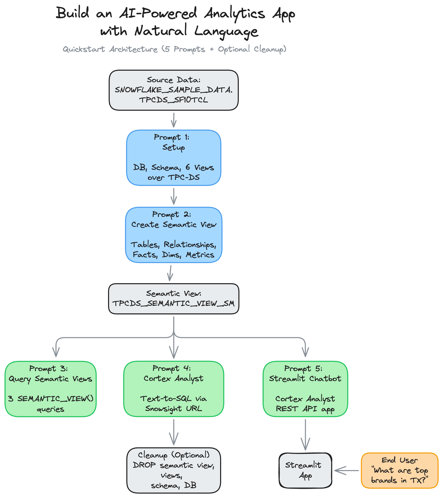

author: Chanin Nantasenamat
id: build-an-ai-powered-analytics-app-with-nl
categories: snowflake-site:taxonomy/solution-center/certification/quickstart,snowflake-site:taxonomy/product/ai
language: en
summary: Build an AI-powered analytics app using natural language prompts in Cortex Code to create Semantic Views, Cortex Analyst queries, and a Streamlit chatbot over TPC-DS retail data.
environments: web
status: Published
feedback link: https://github.com/Snowflake-Labs/sfguides/issues


# Build an AI-Powered Analytics App with Natural Language
<!-- ------------------------ -->
## Overview

A **semantic view** is a Snowflake object that describes the business meaning of your data. Think of it as a business glossary layered on top of your database -- it tells AI tools what your columns mean, how your tables relate to each other, and what metrics to calculate. Once defined, tools like Cortex Analyst can translate plain English questions into accurate SQL automatically, without the user needing to know any SQL.

Without a semantic view, an analyst would need to know that `SS_QUANTITY` means "store sales quantity" or that `STORE_SALES` joins to `CUSTOMER` on `SS_CUSTOMER_SK`. With a semantic view, cryptic column names become readable business terms (e.g., `SS_QUANTITY` → `store_sales_quantity`, `SS_NET_PROFIT` → `net_profit`), table relationships are defined once, and every downstream tool (Cortex Analyst, Streamlit chatbots, Snowflake Intelligence) benefits from both the clearer names and the business logic.

In this guide, you will use **natural language prompts** in **Cortex Code** (Snowflake's AI coding assistant) to build the entire solution. Instead of writing SQL and Python by hand, you paste a prompt, and Cortex Code generates and runs the code for you.

<!-- https://excalidraw.com/#json=O3elexOP5-tpVfE7ckwCH,7jqIJl1q-Ub_WFaqLcBRGw  -->


### What You'll Learn

- How to use Cortex Code to build a complete analytics solution using natural language prompts
- How semantic views model your data with tables, relationships, dimensions, facts, and metrics
- How to query semantic views using the `SEMANTIC_VIEW()` SQL function
- How to use Cortex Analyst for natural language-to-SQL over a semantic view
- How to build a Streamlit in Snowflake chatbot powered by Cortex Analyst
- How the semantic view connects to the broader Snowflake Intelligence stack

### What You'll Build

A conversational analytics chatbot deployed as a Streamlit in Snowflake app. Users type natural language questions like "What are the top-selling brands in Texas?" and the app calls Cortex Analyst, which reads your semantic view, generates the correct SQL, runs it, and displays results with interactive charts.

### How to Use These Prompts

This guide is organized as a series of **5 natural language prompts** (plus an optional cleanup). For each step:

1. Open the appropriate Snowflake editor (Workspace Notebook or Streamlit in Snowflake)
2. Paste the prompt into **Cortex Code** (the AI assistant)
3. Cortex Code generates and runs the SQL or Python code for you
4. Review the output to confirm it matches the expected results

Prompts 1 through 4 and the optional Cleanup prompt run in a **Workspace Notebook**. The Streamlit Chatbot prompt (Prompt 5) runs in **Streamlit in Snowflake (SiS)**.

 > **Note:** Because Cortex Code uses LLMs to generate code from natural language, the exact code it produces may differ from the examples shown in this guide. The logic and results should be equivalent, but variable names, formatting, and SQL style may vary between runs.

> **Prefer code?** If you'd like to see the exact SQL and Python instead of natural language prompts, check out the [companion notebook](https://github.com/Snowflake-Labs/snowflake-demo-notebooks/blob/main/build-an-ai-powered-analytics-app/build-an-ai-powered-analytics-app.ipynb).

### Prerequisites

- Access to a [Snowflake account](https://signup.snowflake.com/?utm_source=snowflake-devrel&utm_medium=developer-guides&utm_cta=developer-guides)
- ACCOUNTADMIN role access (required for creating semantic views)
- Access to the `SNOWFLAKE_SAMPLE_DATA` shared database (available by default on all Snowflake accounts)
- A running warehouse (e.g., `COMPUTE_WH`)

<!-- ------------------------ -->
## Setup

In this section, you will set up a database, schema, and views over Snowflake's built-in TPC-DS sample data. These views give you retail data (customers, items, stores, sales) to model without uploading anything.

### Where to Run

Open a new Workspace Notebook in Snowsight by clicking on Projects > Workspaces from the sidebar. Next, click on "+ Add new" > Notebook.

> Note: You may be prompted to create a new service on which the notebook is run, if this is your first time running the notebook.

### Prompt 1

Paste this into Cortex Code:

```
Set up an environment for a semantic view tutorial. Use ACCOUNTADMIN role and COMPUTE_WH warehouse. Create a SAMPLE_DATA database with a TPCDS_SF10TCL schema, then create 6 views (CUSTOMER, CUSTOMER_DEMOGRAPHICS, DATE_DIM, ITEM, STORE, STORE_SALES) that each select all columns from the matching table in SNOWFLAKE_SAMPLE_DATA.TPCDS_SF10TCL. Verify with SHOW VIEWS, then preview 5 rows from STORE_SALES.
```

**What to expect**: 6 views created, a SHOW VIEWS result listing them, and a preview of raw STORE_SALES data with cryptic column names like `SS_SOLD_DATE_SK`. These cryptic names are exactly why you need a semantic view -- the next step gives them business-friendly names.

<!-- ------------------------ -->
## Create a Semantic View

A semantic view has five sections:

- **tables**: Which physical tables to include, with aliases and primary keys. Primary keys uniquely identify each row in a table, which the semantic view needs to correctly join data.
- **relationships**: How tables join via foreign keys. A foreign key is a column in one table that points to a row in another table. For example, each sale links to a customer through a foreign key.
- **facts**: Raw numeric values that can be measured (cost, price, quantity). These are unaggregated row-level numbers.
- **dimensions**: Categorical attributes for grouping and filtering (brand, state, year). These answer "by what?" and "where?"
- **metrics**: Aggregated calculations like `SUM(SS_QUANTITY)`. The `WITH SYNONYMS` clause helps Cortex Analyst recognize alternate phrasings.

### Prompt 2

Paste this into Cortex Code:

```
Create a semantic view called TPCDS_SEMANTIC_VIEW_SM over the 6 views in SAMPLE_DATA.TPCDS_SF10TCL. Use SQL syntax (CREATE SEMANTIC VIEW, not YAML).

Include all 6 tables with aliases DATE for DATE_DIM, DEMO for CUSTOMER_DEMOGRAPHICS, and STORESALES for STORE_SALES. Define primary keys for each table and foreign key relationships from STORESALES to the other 5 tables.

For facts, include item cost, item price, store tax rate, and sales quantity. For dimensions, include customer attributes (birth year, country), date attributes (date, month, week, year), demographic attributes (credit rating, marital status), item attributes (brand, category, class), store attributes (market, square footage, state, country), and the surrogate key columns. For metrics, define total cost as SUM of item cost, total sales price as SUM of SS_SALES_PRICE, and total sales quantity as SUM of SS_QUANTITY with synonyms 'total sales quantity' and 'total sales amount'.

After creating it, verify with SHOW SEMANTIC VIEWS and use DESC SEMANTIC VIEW with the flow operator (->>) to list all metrics and dimensions with their parent tables.
```

**What to expect**: The semantic view is created successfully. `SHOW SEMANTIC VIEWS` lists it, and the `DESC` output shows each metric and dimension with its parent table. You now have a complete business model on top of your retail data.

<!-- ------------------------ -->
## Query Semantic Views

The `SEMANTIC_VIEW()` function lets you query a semantic view with SQL. You specify which dimensions and metrics you want, and the semantic view handles all the joins automatically.

### Prompt 3

Paste this into Cortex Code:

```
Write 3 SEMANTIC_VIEW() queries against TPCDS_SEMANTIC_VIEW_SM in separate cells:

1. What are the top 10 book brands by sales quantity in Texas in December 2002?
2. Which item categories generated the most revenue in December 2002? Show quantity, sales price, and cost side by side (top 10).
3. What are the purchasing patterns across item categories and customer credit ratings in July 2002? Show the top 20 by sales quantity.
```

**What to expect**: Three result sets showing retail analytics. The semantic view handles all joins automatically, with no JOIN clauses needed.

### Query 1: Top Brands in Texas

**Expected output:**

| # | BRAND | CATEGORY | YEAR | MONTH | STATE | TOTALSALESQUANTITY |
|---|-------|----------|------|-------|-------|--------------------|
| 1 | maximaxi #1 | Books | 2002 | 12 | TX | 4,295,870 |
| 2 | amalgunivamalg #1 | Books | 2002 | 12 | TX | 4,212,167 |
| 3 | importounivamalg #8 | Books | 2002 | 12 | TX | 4,190,557 |
| 4 | scholarmaxi #8 | Books | 2002 | 12 | TX | 4,142,716 |
| 5 | edu packunivamalg #7 | Books | 2002 | 12 | TX | 4,115,186 |
| 6 | scholarunivamalg #7 | Books | 2002 | 12 | TX | 4,115,046 |
| 7 | scholarunivamalg #8 | Books | 2002 | 12 | TX | 4,109,582 |
| 8 | exportiunivamalg #4 | Books | 2002 | 12 | TX | 4,050,496 |
| 9 | edu packunivamalg #1 | Books | 2002 | 12 | TX | 4,044,801 |
| 10 | maximaxi #2 | Books | 2002 | 12 | TX | 4,031,232 |

### Query 2: Revenue by Category

**Expected output:**

| # | CATEGORY | TOTALSALESQUANTITY | TOTALSALESPRICE | TOTALCOST |
|---|----------|--------------------|-----------------|-----------|
| 1 | Jewelry | 4,621,648,147 | 3,464,601,821.81 | 4,621,542,749.27 |
| 2 | Electronics | 4,610,399,852 | 3,458,991,769.62 | 4,611,085,628.19 |
| 3 | Shoes | 4,609,138,575 | 3,456,238,423.66 | 4,608,459,675.77 |
| 4 | Music | 4,600,476,410 | 3,449,655,506.66 | 4,600,476,085.26 |
| 5 | Children | 4,599,410,238 | 3,448,763,810.14 | 4,600,276,652.09 |
| 6 | Sports | 4,593,506,426 | 3,443,422,975.07 | 4,592,666,550.02 |
| 7 | Home | 4,568,720,116 | 3,423,952,324.14 | 4,567,662,115.11 |
| 8 | Men | 4,533,955,269 | 3,399,863,845.91 | 4,534,921,556.42 |
| 9 | Women | 4,527,154,871 | 3,394,914,055.14 | 4,527,355,370.41 |
| 10 | Books | 4,506,010,090 | 3,380,120,928.25 | 4,507,832,214.86 |

### Query 3: Purchasing Patterns by Credit Rating

**Expected output (first 10 of 20 rows):**

| # | CATEGORY | CREDIT_RATING | TOTALSALESQUANTITY |
|---|----------|---------------|--------------------|
| 1 | Jewelry | High Risk | 331,469,969 |
| 2 | Electronics | Unknown | 331,326,959 |
| 3 | Jewelry | Low Risk | 331,302,893 |
| 4 | Jewelry | Unknown | 331,288,124 |
| 5 | Jewelry | Good | 330,967,806 |
| 6 | Electronics | Good | 330,779,045 |
| 7 | Shoes | Unknown | 330,608,471 |
| 8 | Shoes | High Risk | 330,416,355 |
| 9 | Electronics | High Risk | 330,365,401 |
| 10 | Electronics | Low Risk | 330,262,865 |

<!-- ------------------------ -->
## Cortex Analyst

Cortex Analyst is Snowflake's **text-to-SQL** engine -- it translates plain English questions into SQL queries that a database can execute. It reads your semantic view definition and generates accurate `SEMANTIC_VIEW()` SQL queries, so users can ask questions about data without writing any SQL themselves.

### How It Works

When you ask a question like "What are the top selling brands in Texas?", Cortex Analyst:

1. Reads the semantic view definition (dimensions, metrics, relationships, synonyms)
2. Generates the correct `SEMANTIC_VIEW()` SQL query
3. Returns the results

The semantic view you created is the knowledge base that makes Cortex Analyst accurate.

### Prompt 4

Paste this into Cortex Code:

```
Generate a clickable Snowsight URL that opens Cortex Analyst. Use CURRENT_ORGANIZATION_NAME() and CURRENT_ACCOUNT_NAME() to build the URL dynamically.
```

**What to expect**: A clickable URL that opens Cortex Analyst directly on your semantic view.

### Try Natural Language Queries

Open the resulting URL in your browser to access the Cortex Analyst interface for your semantic view. Try these questions:

- "Show me the top selling brands in Texas in 2002"
- "What is the total sales quantity by state?"
- "Which item categories have the highest total cost?"
- "Compare sales across credit ratings for the Books category"

Cortex Analyst translates each question into a `SEMANTIC_VIEW()` SQL query and returns results. Notice how synonyms (like "total sales amount" for TotalSalesQuantity) help it understand alternate phrasings.

<!-- ------------------------ -->
## Streamlit Chatbot

**Streamlit in Snowflake (SiS)** lets you build interactive Python web apps that run entirely inside Snowflake, no external servers, no deployment pipelines. You write Python with the Streamlit library, and Snowflake hosts and runs it for you.

In this section, you will build a chatbot app that takes a natural language question from the user, sends it to the Cortex Analyst REST API along with your semantic view, and displays the answer with data tables and interactive charts. The result is a "talk to your data" experience that anyone in your organization can use.

### Architecture

The app flow is:

1. User types a natural language question
2. The app sends it to the Cortex Analyst REST API with your semantic view
3. Cortex Analyst generates SQL and returns results
4. The app displays the answer with data tables and interactive charts

### Where to Run

In Snowsight, navigate to **Projects > Streamlit > + Streamlit App** and configure:

- **App name**: `Semantic_View_Chatbot`
- **Warehouse**: Your warehouse (e.g., `COMPUTE_WH`)
- **Database/Schema**: `SAMPLE_DATA` / `TPCDS_SF10TCL`

Next, use Cortex Code in the SiS editor to generate the app.

### Prompt 5

Paste this into Cortex Code:

```
Build a Streamlit chatbot that queries retail sales data via Snowflake Cortex Analyst using semantic view `SAMPLE_DATA.TPCDS_SF10TCL.TPCDS_SEMANTIC_VIEW_SM`.

**Connection** (`@st.cache_resource`): Try `get_active_session()` first, fall back to `snowflake.connector.connect(connection_name=os.getenv("SNOWFLAKE_CONNECTION_NAME", "devrel"))` wrapped in `Session.builder.configs({"connection": conn}).create()`.

**API call**: POST `/api/v2/cortex/analyst/message`, body (dict, not JSON string): `{"messages": [...], "semantic_view": "..."}`. User messages: `{"role": "user", "content": [{"type": "text", "text": question}]}`.
- **SiS**: `_snowflake.send_snow_api_request("POST", endpoint, {}, {}, body, {}, 30000)`, which returns `{"status": int, "content": str}`, so parse: `json.loads(resp["content"])` after checking `resp["status"] < 400`.
- **Local**: `requests.post(url, json=body, headers={"Authorization": f'Snowflake Token="{conn._rest.token}"'}, timeout=60)` where `conn = session.connection`, `host = conn.host.replace("_", "-").lower()`.

**Response**: `response["message"]["content"]` is a list of blocks with `type` = `"text"`, `"sql"` (has `"statement"`), or `"suggestions"` (has `"suggestions"` list). Render text as markdown, SQL in an expander with a "Run SQL" button + dataframe + bar chart, suggestions as clickable buttons.

**Key patterns**: Use `on_click` callbacks (not button return values). Deterministic widget keys via `f"msg_{idx}_{bidx}"` (same prefix for new and replayed messages). Use `role="assistant"` in `st.chat_message`. Keep separate display (`role="assistant"`) and API (`role="analyst"`) message lists. Don't pass `key=` to `st.expander()`.
```

**What to expect**: A chatbot app generated by Cortex Code. The app displays a chat interface where users type questions, Cortex Analyst generates SQL, and results appear with data tables and interactive charts.

### Test the Chatbot

Try these questions in your chatbot:

- "What are the top 10 brands by total sales quantity?"
- "Show me sales by state for 2002"
- "Which item categories generate the most revenue?"
- "Compare married vs single customer spending"

### Multi-Turn Conversations

The app sends the full message history to Cortex Analyst, so follow-up questions work:

- First: "Show me total sales by state"
- Follow-up: "Now filter to just Texas"

Cortex Analyst remembers the context from prior messages in the conversation.

<!-- ------------------------ -->
## Cleanup (Optional)

This section removes all objects created in this guide. Only run this if you want to clean up your environment. The underlying `SNOWFLAKE_SAMPLE_DATA` shared database is untouched.

### Prompt 6

Paste this into Cortex Code (in your Workspace Notebook):

```
Clean up the following objects created in this tutorial. Use IF EXISTS on everything and run each DROP in a separate cell:

1. Semantic view: SAMPLE_DATA.TPCDS_SF10TCL.TPCDS_SEMANTIC_VIEW_SM
2. Views in SAMPLE_DATA.TPCDS_SF10TCL: CUSTOMER, CUSTOMER_DEMOGRAPHICS, DATE_DIM, ITEM, STORE, STORE_SALES
3. Schema: SAMPLE_DATA.TPCDS_SF10TCL
4. Database: SAMPLE_DATA
```

**What to expect**: All tutorial objects removed. The Streamlit app can be deleted separately from Snowsight under **Projects > Streamlit**.

<!-- ------------------------ -->
## Conclusion And Resources

Congratulations! You've built a conversational analytics app using natural language prompts with the help of Cortex Code. We went from raw data to a working chatbot in 5 prompts.

### Key Takeaways

- The **semantic view** is the foundation. Define your data well once, and every downstream tool benefits.
- **Cortex Analyst** reads the semantic view and translates plain English into accurate SQL. It powers both the Streamlit chatbot and the built-in Snowsight UI.
- **Cortex Code** lets data analysts build the entire stack (views, semantic models, queries, apps) without writing SQL or Python by hand. You describe what you want, and Cortex Code generates the code.

### Why This Matters for Data Analysts

This workflow removes the biggest bottleneck in analytics: translating business questions into code. Instead of writing complex multi-table JOINs, you define the business model once in a semantic view and let AI handle the rest. Non-technical users can then ask questions in plain English through the chatbot, reducing the back-and-forth between analysts and stakeholders.

### Next Steps

The semantic view you built here also works with **Snowflake Intelligence**. By adding a Cortex Agent on top of Cortex Analyst, you can create an organization-wide AI assistant that answers data questions across multiple semantic views and data sources.

### What You Learned

- How to use Cortex Code's natural language prompts to build a complete analytics stack
- How semantic views model your data with tables, relationships, dimensions, facts, and metrics
- How to query semantic views using the `SEMANTIC_VIEW()` function
- How Cortex Analyst translates natural language into SQL using the semantic view as its knowledge base
- How to build a Streamlit in Snowflake chatbot that calls the Cortex Analyst REST API

### Related Resources

Documentation:
- [CREATE SEMANTIC VIEW](https://docs.snowflake.com/en/sql-reference/sql/create-semantic-view)
- [Cortex Analyst](https://docs.snowflake.com/en/user-guide/snowflake-cortex/cortex-analyst)
- [Streamlit in Snowflake](https://docs.snowflake.com/en/developer-guide/streamlit/about-streamlit)
- [SEMANTIC_VIEW Function](https://docs.snowflake.com/en/sql-reference/functions/semantic_view)
