author: Emil Hvitfeldt
id: build-an-llm-powered-dashboard-with-posit-connect-and-cortex
language: en
summary: Build a Shiny for Python dashboard that answers natural language questions with Snowflake Cortex, then deploy it to Posit Connect so each viewer's questions run under their own Snowflake credentials
categories: snowflake-site:taxonomy/solution-center/certification/quickstart, snowflake-site:taxonomy/product/ai, snowflake-site:taxonomy/product/data-engineering, snowflake-site:taxonomy/snowflake-feature/cortex-llm-functions, snowflake-site:taxonomy/industry/financial-services
environments: web
status: Published
feedback link: https://github.com/Snowflake-Labs/sfguides/issues

# Build an LLM-Powered Dashboard with Posit Connect and Snowflake Cortex AI
<!-- ------------------------ -->
## Overview

In this guide, we'll build a Shiny for Python dashboard over Home Mortgage Disclosure Act (HMDA) data. When designing a dashboard you are constrained by space and it can be hard to answer every possible question a stakeholder might have. This is why we will show how to integrate an AI powered chat into the dashboard, where anyone viewing it can ask questions in plain English and get back tables and charts. The dashboard doesn't ask a model to guess at answers. It asks the model to write SQL, runs that SQL in Snowflake, and shows both the result and the query that produced it.

The benefit of this cannot be overstated. Letting the AI agent produce a SQL query as an artifact is exactly what we want. This query can be saved, rerun, and modified at will without having to reprompt the agent. It also keeps the heavy lifting where your data already lives.

We'll develop in Posit Workbench inside the Posit Team Native App, use Snowflake Cortex AI as the model backend, and publish to Posit Connect. Because the deployed content carries a Snowflake OAuth integration, each viewer's questions execute under their own Snowflake identity, so the dashboard respects the grants you've already configured. Data, compute, and inference all stay inside your Snowflake account.


TODO: Thinking this is a good starting point, where is the source for this?

### What You Will Learn

- How to connect to Snowflake from Python so the same code works in Workbench and on Connect
- How to use Snowflake Cortex as an LLM backend with the `chatlas` package
- How to build a natural language dashboard with `querychat`, including LLM-generated charts with `ggsql`
- How to keep generated queries running in Snowflake instead of collecting data into memory
- How to publish to Posit Connect and serve every viewer under their own Snowflake credentials

### Prerequisites

- A [Snowflake account](https://signup.snowflake.com/) with Cortex AI enabled
- The [Posit Team Snowflake Native App](https://app.snowflake.com/marketplace/listing/GZTSZMCB9S/posit-pbc-posit-team) installed and configured by an administrator with the `accountadmin` role, and access granted to you
- A Snowflake OAuth integration configured for Posit Connect, which your administrator sets up alongside the app
- Access to the [`SNOWFLAKE_PUBLIC_DATA_FREE` database](https://app.snowflake.com/marketplace/listing/GZTSZ290BV255/snowflake-public-data-products-snowflake-public-data-free)
- Familiarity with Python and SQL

### What You Will Need

- A Positron Pro session in Posit Workbench, running Python 3.12
- The Shiny and Posit Publisher extensions, both bootstrapped in Positron
- A Posit Connect publisher API key

### What You Will Build

- An interactive Shiny for Python dashboard, published on Posit Connect, that turns viewers' plain-English questions into Snowflake SQL and renders the answers as tables and charts

<!-- ------------------------ -->
## Set Up Your Environment

### Verify the Data

We'll use the Home Mortgage Disclosure Act (HMDA) dataset from Snowflake's free public data. It contains mortgage application records covering loan types, applicant demographics, property characteristics, amounts, and outcomes across U.S. geographies.

The HMDA dataset we'll use is located at:

- **Database:** `SNOWFLAKE_PUBLIC_DATA_FREE`
- **Schema:** `PUBLIC_DATA_FREE`
- **Table:** `HOME_MORTGAGE_DISCLOSURE_ATTRIBUTES`

To verify you have access to this data, navigate to Snowsight and click **+** > **SQL File** and run:

```sql
SELECT *
FROM SNOWFLAKE_PUBLIC_DATA_FREE.PUBLIC_DATA_FREE.HOME_MORTGAGE_DISCLOSURE_ATTRIBUTES
LIMIT 10;
```

You should see ten rows of mortgage application data.

> If you find that you don't have access to this dataset, please contact your account administrator.

### Launch Posit Workbench

#### Step 1: Open the Posit Team Native App

In Snowsight, navigate to **Horizon Catalog** > **Catalog** > **Apps** > **Posit Team**, then click **Launch app**.

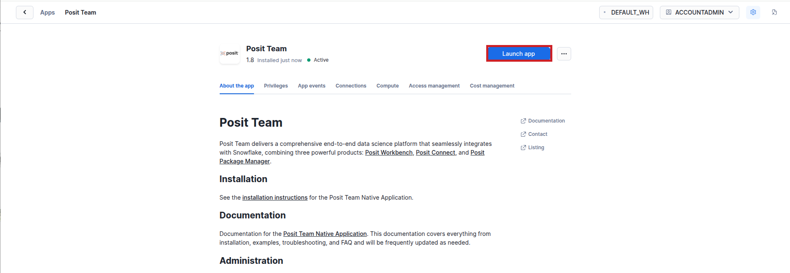

> If you don't see the Posit Team Native App listed, ask your Snowflake account administrator to install it from the Marketplace, [configure](https://docs.posit.co/partnerships/snowflake/posit-team/) it, and grant you access.

#### Step 2: Open Workbench

From within the Posit Team Native App, click **Posit Workbench**. You might be prompted to sign in to Snowflake.

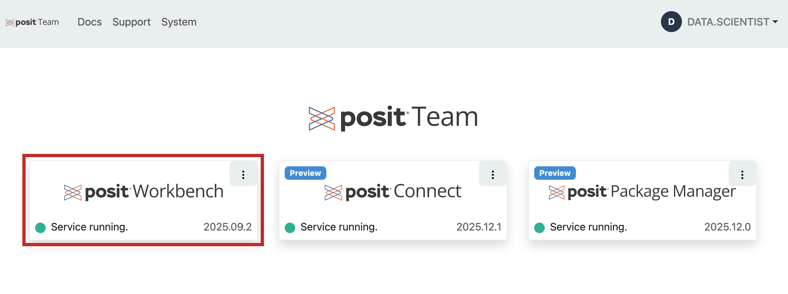

### Start a Positron Pro Session

Workbench offers several IDEs for data science work. For this guide, we'll use Positron Pro, the data science IDE for Python and R.

#### Step 1: Create the session

Click **+ New Session** and select the **Positron Pro** IDE.

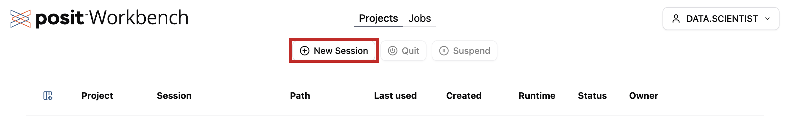

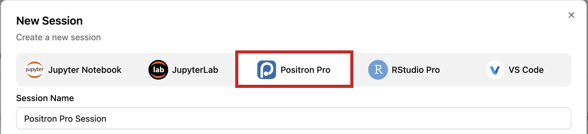

#### Step 2: Sign in to Snowflake

Under **Session Credentials**, click the button with the Snowflake icon, complete the sign-in prompts, then click **Launch**.

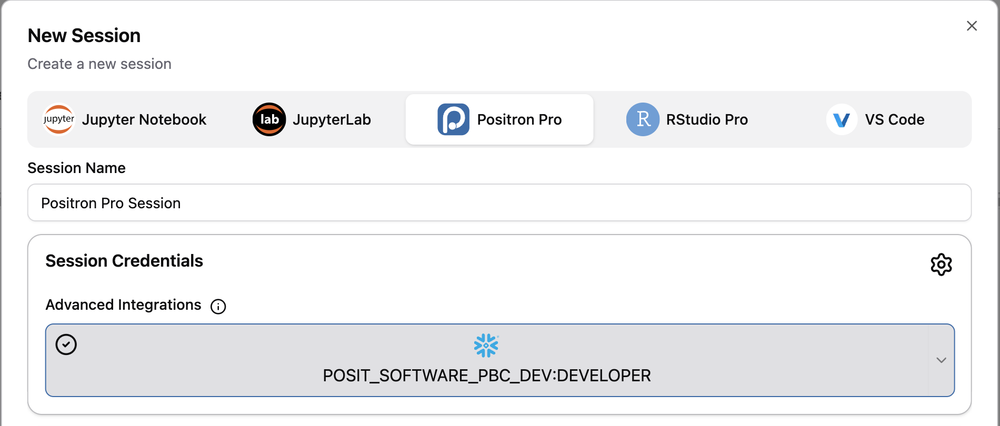

Your session now holds [managed credentials](https://docs.posit.co/partnerships/snowflake/posit-team/managed-credentials.html) derived from the Snowflake identity you signed in with, and that one identity covers both querying the mortgage table and calling Cortex. You only have to manage access at the Snowflake level, everything is inherited down into Workbench.

#### Step 3: Check the extensions

Confirm the [Shiny](https://open-vsx.org/extension/posit/shiny) and [Posit Publisher](https://docs.posit.co/connect/user/publishing-positron-vscode/) extensions are installed and enabled from the Extensions view. Both ship with Positron as bootstrapped extensions.

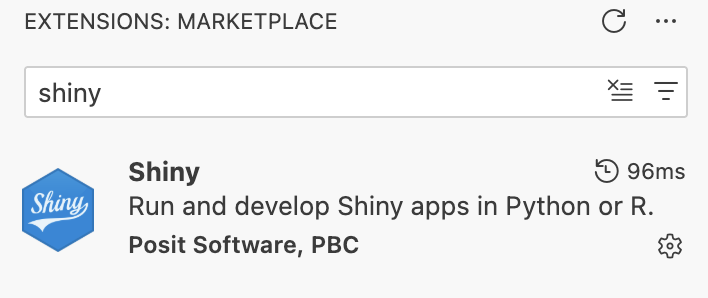

<!-- ------------------------ -->
## Connect Data and Inference

### Get the Guide Materials

Clone the example repository into your Workbench session and open `quarto.qmd`. It walks through connecting to Snowflake, configuring Cortex, and building the dashboard, with each step runnable via the **Run Cell** button. The repository also contains the finished `app.py` that this guide builds up to and deploys.

```bash
git clone https://github.com/posit-dev/snowflake-posit-llm-dashboard-connect-python/
```

Use **Python 3.12** for this guide. The Snowflake packages don't yet publish wheels for the newest Python releases, so a newer interpreter forces pip to compile from source. The repository pins the version in a `.python-version` file, which Positron picks up when selecting an interpreter for the session; confirm the interpreter shown in the top right of Positron reads 3.12 before installing anything.

Once you are in the repo, you can install the required dependencies.

```bash
python -m pip install --upgrade pip setuptools wheel
python -m pip install -r requirements.txt
```

querychat must be **0.7.0 or newer**. Earlier versions require a data source at construction time, and the deployed app builds one per viewer instead.

> If the install can't find a recent enough `chatlas` or `querychat`, your Package Manager mirror may be behind. Adding `--extra-index-url https://pypi.org/simple` as the first line of `requirements.txt` lets pip fall back to PyPI, and Connect honors that line at deploy time too. Ask whoever administers Package Manager first, since a curated mirror is usually deliberate.

### Connect to Snowflake

Remember that the goal of this post is to let the viewers of the dashboard chat with it using their own credentials. We have already gotten those credentials in Workbench for us to use while developing the Shiny app, but the deployed dashboard needs a second path using each viewer's own credentials. We'll come back to it when we assemble the app.

```python
import ibis
import snowflake.connector

WAREHOUSE = "DEFAULT_WH"
DATABASE = "SNOWFLAKE_PUBLIC_DATA_FREE"
SCHEMA = "PUBLIC_DATA_FREE"
TABLE = "HOME_MORTGAGE_DISCLOSURE_ATTRIBUTES"

con = snowflake.connector.connect(
    connection_name="workbench",
    warehouse=WAREHOUSE,
    database=DATABASE,
    schema=SCHEMA,
)
```

Now wrap the connection with [Ibis](https://ibis-project.org/), which gives us a Pythonic way to work with Snowflake tables:

```python
ibiscon = ibis.snowflake.from_connection(con, create_object_udfs=False)
mortgage_data = ibiscon.table(TABLE)

mortgage_data
```

It is important that we don't call `.to_pandas()` at this stage. `mortgage_data` is a lazy reference to a Snowflake table. We don't want the app to pull any more data than necessary.

### Reach Cortex from Python

[chatlas](https://posit-dev.github.io/chatlas/) is a Python package for talking to LLMs, and its `ChatSnowflake` provider targets Cortex. Your Workbench session already holds your Snowflake credentials, so pointing it at Cortex takes one call:

```python
from chatlas import ChatSnowflake

chat = ChatSnowflake(
    system_prompt="You are a mortgage lending and housing finance data analysis expert",
    model="claude-haiku-4-5",  # Choose from the available Cortex AI models
    connection_name="workbench",
)
```

Name the model explicitly. `ChatSnowflake` will pick a default and warn you about it, but a dashboard other people depend on shouldn't change models when that default moves.

It is generally a good idea to test it before wiring it into an app, as it can be harder to debug later on. This way we can surface credential problems in the console rather than getting a blank app.

```python
chat.chat("What patterns do you see in home mortgage lending data?")
```

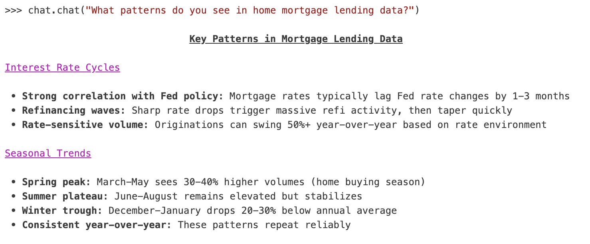

<!-- ------------------------ -->
## Build the Dashboard

### Using querychat

The [querychat](https://posit-dev.github.io/querychat/) package lets us turn questions into SQL. It needs two things: a data source and a model.

```python
from querychat import QueryChat

qc = QueryChat(mortgage_data, TABLE, client=chat)
```

That is the whole configuration: the lazy Ibis table from the previous section, the name the model should use for it in SQL, and the Cortex client. Note that we hand over `mortgage_data` itself, not a sample. querychat sends the model the table's *schema*, not its rows, and the SQL the model writes runs against the table by name on your connection, so the model can work over the full table without anything being pulled into Python to get there.

We are building the configuration here rather than launching an app, because the app that ships has to create its connection per viewer, and we will assemble it in one piece shortly. Two things are worth adding to `QueryChat` before then.

querychat also gives you SQL you can read, which is the reason to use it over a black-box text-to-answer service. Every response is backed by a query you can inspect, copy, and rerun.

### querychat and charts

querychat is not limited to producing SQL queries, it can also produce data visualizations. Charts are not on by default, so we opt in by adding `"visualize"` to `tools`.

```python
qc = QueryChat(
    mortgage_data,
    TABLE,
    client=chat,
    tools=("filter", "query", "visualize"),
)
```

Behind this is [ggsql](https://posit-dev.github.io/ggsql/), an extension of SQL that brings the elegance of the Grammar of Graphics to SQL. The model writes one query that both aggregates and describes the chart, querychat runs the SQL part against Snowflake, and the result is rendered as a chart in the chat.

This stays efficient because all the aggregation happens in the database, and only the handful of summarized rows the chart needs come back to us.

### Teach the Model Your Data

What we have right now works. But we can improve it a bit using our domain knowledge about the data and how we expect users to interact with the app.

Firstly, a `data_description` gives the model your domain vocabulary and your caveats:

```python
data_description = """
Home Mortgage Disclosure Act (HMDA) dataset containing mortgage application and
origination data. Includes loan types, applicant demographics, property
characteristics, loan amounts, interest rates, and loan outcomes across U.S.
geographic areas.

One row is an application, not an approved loan. Loan amounts are in whole
dollars. Approval rate is not a stored column and must be computed as originated
applications divided by total applications.
"""
```

Secondly, a `greeting` tells a first-time viewer what kinds of questions work, so they aren't staring at an empty text box:

```python
greeting = """
# Home Mortgage Disclosure Act (HMDA) Data Explorer

Ask questions about mortgage lending patterns, loan characteristics, and geographic trends.

**Example questions:**
- What are the most common loan types?
- How do loan approval rates vary by state?
- Chart loan amounts across different property types
"""
```

Add these two as additional arguments to `QueryChat()`, which gives us the configuration the deployed app will use:

```python
qc = QueryChat(
    mortgage_data,
    TABLE,
    client=chat,
    greeting=greeting,
    data_description=data_description,
    tools=("filter", "query", "visualize"),
)
```

> If you'd rather the model never see raw rows at all, set `tools="filter"`. It can then only drive the dashboard's filters, and your own code renders results from the database. The model writes the query; it never reads the data.

### Use Certified Metrics

If your account defines [Snowflake Semantic Views](https://docs.snowflake.com/en/user-guide/views-semantic/overview), querychat discovers them automatically on a Snowflake connection and includes their definitions in what it sends the model. The model can then answer using `SEMANTIC_VIEW()` and your organization's certified metrics instead of inventing its own arithmetic. Nothing extra is required in the app code.

### Assemble the App to Deploy

So far we have used our own connection to work with the data. As mentioned above, we need to do something different, so that the deployed app has each viewer use their own credentials and session tokens to query the data.

Our deployable artifact is a self-contained `app.py`, and what changes is *where* the connection is created. Everything credential-related moves **inside the server function**, which Shiny calls once per session with that session's request headers in hand.

First, the imports, a few constants, and the credentials. One function, two environments:

```python
import os

import ibis
import snowflake.connector
from chatlas import ChatSnowflake
from posit.connect.external.snowflake import PositAuthenticator

MODEL = "claude-haiku-4-5"
MAX_ROWS = 1000
SYSTEM_PROMPT = "You are a mortgage lending and housing finance data analysis expert"

def credentials(session):
    """Snowflake connection parameters for the current viewer."""
    if os.getenv("RSTUDIO_PRODUCT") == "CONNECT":
        token = session.http_conn.headers.get("Posit-Connect-User-Session-Token")
        if token is None:
            raise RuntimeError(
                "No Posit-Connect-User-Session-Token header. Attach the "
                "Snowflake integration to this content in Connect."
            )
        account = os.getenv("SNOWFLAKE_ACCOUNT")
        if account is None:
            raise RuntimeError(
                "SNOWFLAKE_ACCOUNT is not set. Connect does not inherit it, so "
                "add it as an environment variable on this content (Vars pane)."
            )

        auth = PositAuthenticator(
            local_authenticator="EXTERNALBROWSER",
            user_session_token=token,
        )
        return {
            "account": account,
            "authenticator": auth.authenticator,
            "token": auth.token,
        }

    if os.getenv("SNOWFLAKE_HOME") is not None:
        return {"connection_name": "workbench"}

    raise RuntimeError("No Snowflake credentials found.")
```

The two `RuntimeError`s are the two Connect-side setup steps this guide finishes with. Raising them by name beats the `AttributeError` and `KeyError` you'd otherwise get.

The `session` argument is not decoration: the viewer's token arrives as an HTTP header on their session, so this function cannot be called at import time, and that constraint shapes the rest of the file.

Second, two helpers that turn those credentials into the table and the chat client. Both take the same `creds`, so one identity covers the query, the model call, and the rows that come back:

```python
def get_table(creds):
    """A lazy Ibis reference to the HMDA table, for one viewer."""
    con = snowflake.connector.connect(
        warehouse=WAREHOUSE, database=DATABASE, schema=SCHEMA, **creds
    )
    ibiscon = ibis.snowflake.from_connection(con, create_object_udfs=False)
    return con, ibiscon.table(TABLE)

def get_chat(creds):
    """A Cortex chat client for one viewer, using the same credentials."""
    creds = dict(creds)
    return ChatSnowflake(
        system_prompt=SYSTEM_PROMPT,
        model=MODEL,
        connection_name=creds.pop("connection_name", None),
        account=creds.pop("account", None),
        # Anything else the Snowpark session builder needs (an OAuth
        # authenticator and token, on Connect) goes through kwargs.
        kwargs={"warehouse": WAREHOUSE, **creds},
    )
```

`ChatSnowflake` accepts `connection_name`, `account`, `user`, `password`, and `private_key_file` directly; anything else the underlying Snowpark session needs goes through `kwargs`. That's how the OAuth authenticator and token reach it on Connect, so inference runs as the viewer too, not just data access.

Third, the app. The UI is built once and shared, since rendering the chat sidebar needs only the module `id` and the tool list. The data source and chat client are built per session:

```python
from querychat import QueryChat
from shiny import App, Inputs, Outputs, Session, render, ui

QUERYCHAT_ID = "querychat"
TOOLS = ("filter", "query", "visualize")

# No data source, so this instance is safe to share across sessions.
qc_ui = QueryChat(id=QUERYCHAT_ID, tools=TOOLS)

app_ui = ui.page_sidebar(
    qc_ui.sidebar(),
    ui.card(
        ui.card_header(ui.output_text("query_title", inline=True)),
        ui.output_code("sql_query"),
        fill=False,
        style="max-height: 33%;",
    ),
    ui.card(
        ui.card_header("Data"),
        ui.output_data_frame("data_table"),
    ),
    title="HMDA Mortgage Data Explorer",
    fillable=True,
)

def server(input: Inputs, output: Outputs, session: Session):
    creds = credentials(session)
    con, mortgage_data = get_table(creds)
    session.on_ended(con.close)

    qc = QueryChat(
        mortgage_data,
        TABLE,
        id=QUERYCHAT_ID,
        client=get_chat(creds),
        greeting=greeting,
        data_description=data_description,
        tools=TOOLS,
    )
    vals = qc.server()

    @render.text
    def query_title():
        return vals.title() or "SQL Query"

    @render.code
    def sql_query():
        return vals.sql() or "-- Ask a question to generate SQL"

    @render.data_frame
    def data_table():
        df = vals.df().head(MAX_ROWS)
        return df.to_pandas() if hasattr(df, "to_pandas") else df

app = App(app_ui, server)
```

That `.head(MAX_ROWS)` is not cosmetic, and it is the reason we render the table ourselves rather than letting something else do it. `vals.df()` is a *lazy* Ibis table: before anyone asks a question it is the entire table, and after a filter it is that filter's result, still unevaluated. The filter tool is also required to return every column of the original schema, so a filtered result is narrower in rows but never in columns. Hand either one straight to `render.data_frame` and Shiny materializes all of it, so the app renders and then spins while it drags HMDA out of Snowflake a row at a time. Limit before materializing.

Bounding the render is what lets us hand `QueryChat` the full `mortgage_data`. The model writes queries against the whole table, aggregates are computed over all of it in the database, and only the rows actually on screen come back.

`qc.server()` returns that session's reactive values, so `vals.df()`, `vals.sql()`, and `vals.title()` are ordinary Shiny reactives. That's the seam for the value boxes and extra tabs above: they read `vals.df()` and never touch the connection.

Create `app.py` next to `quarto.qmd` and paste these pieces into it, or copy the complete file from the root of the accompanying repository. Run it locally before deploying:

```bash
shiny run app.py
```

### Try It Out

This is the first time we have had something to ask questions of, so it is worth spending a few minutes here before deploying. Which part of the app answers depends on how you phrase the question, and knowing that up front saves confusion.

Start with an analytical question:

```text
How do loan approval rates vary by state?
```

The model answers in the chat, showing the query it ran alongside the result. The SQL card and the data table do not change, and that is correct: you asked for a number, not for a different view of the data.

Now ask for a different view:

```text
Show only loans in Vermont from the most recent year, sorted by loan amount
```

This time the SQL card and the data table both re-render from the new query. Two different tools sit behind these, and the model chooses between them from your phrasing: "what is", "how many", "which is highest" get answered in the chat, while "show me", "filter to", "sort by" drive the dashboard. If you ask an analytical question and wonder why the SQL card did not change, that is why, and not a bug.

Keep filters reasonably narrow while you are exploring. A filter returns whole rows rather than a summary, so filtering to one of the largest states pulls a lot of data through `MAX_ROWS` before you see anything.

Finally, ask for a chart, which is the `visualize` tool we opted into earlier:

```text
Chart average loan amount by state for the most recent year
```

The aggregation runs in Snowflake and only the summarized rows come back to be drawn.

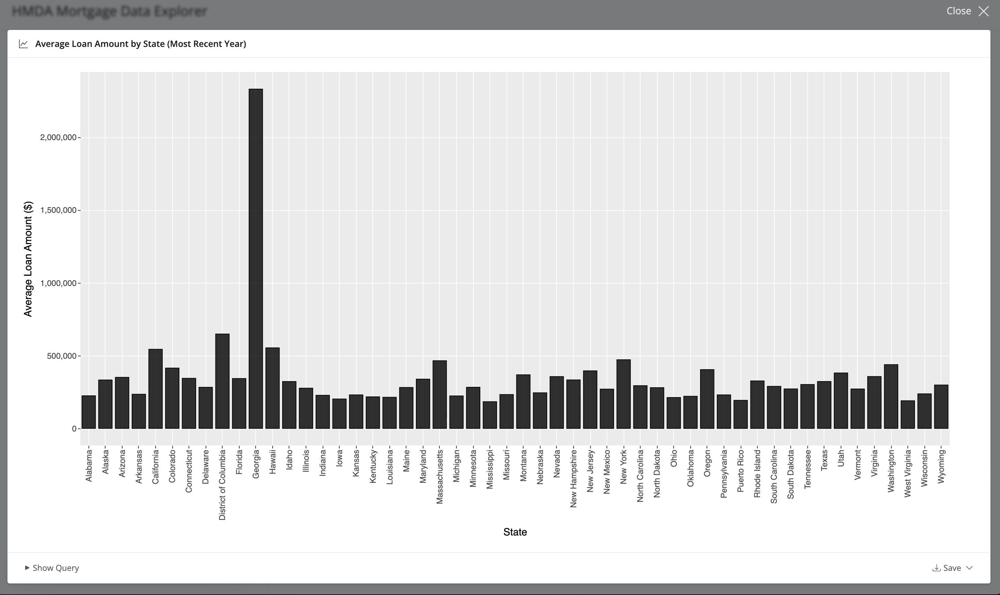

<!-- ------------------------ -->
## Deploy to Posit Connect

### Create an API Key

1. Open Posit Connect from the Posit Team Native App.

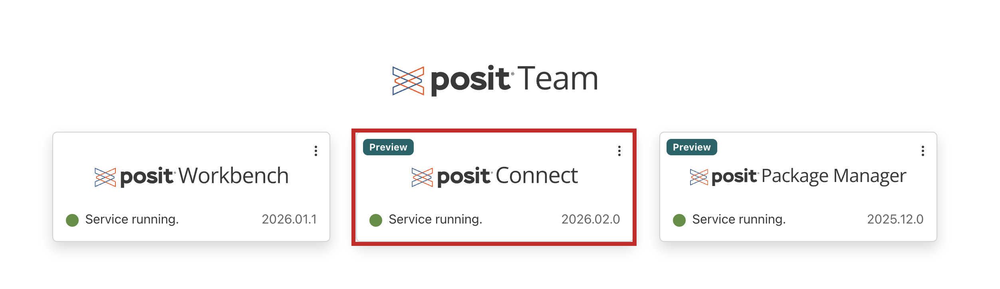

2. Click your account in the upper right, then **Manage Your API Keys**.
3. Click **+ New API Key**, name it, and select the **Publisher** role.
4. Click **Create Key** and copy it somewhere safe.

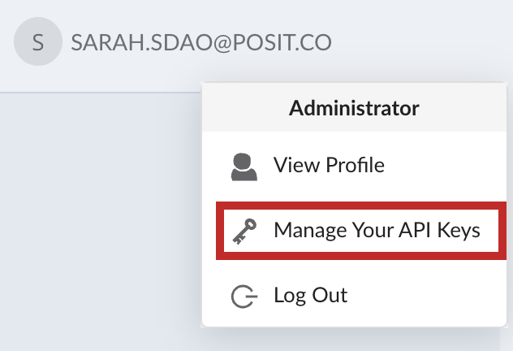

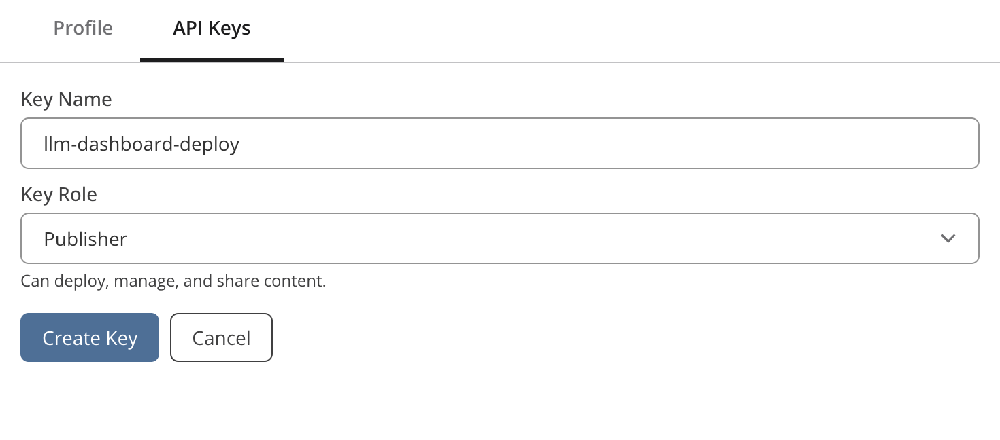

### Publish in One Click

Because Workbench and Connect run inside the same Native App, publishing avoids the network and authentication problems this step usually involves.

#### Step 1: Pin the Python version

The `.python-version` file that selected your session interpreter also governs the deployment, so confirm it sits alongside `app.py` and reads `3.12`. It ships in the repository; if you are adapting this pattern in a project of your own, create it with:

```bash
echo "3.12" > .python-version
```

#### Step 2: Deploy

1. In the Positron tool menu, click the **Posit Publisher** icon.


2. Under **Deployment**, click **Select...** and create a new deployment for `app.py`.
3. Choose the Connect deployment, or create one with the URL `https://connect/`.

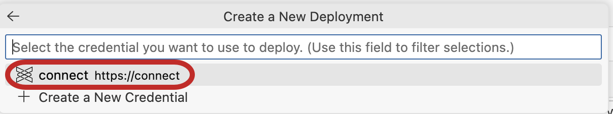

4. Enter the API key you just created.
5. Include both `requirements.txt` and `.python-version` in the file list. `.python-version` is a hidden file, so it's easy to miss, and leaving it out puts you back on Connect's newest interpreter.

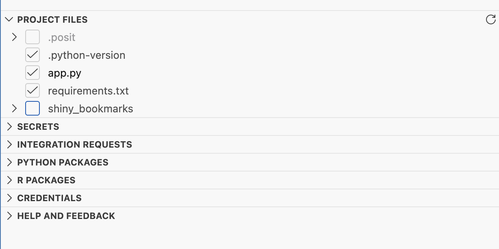

6. Click **Integration requests** > **+** > the available Snowflake integration.

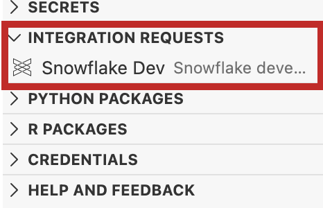

7. Click **Deploy your project**.

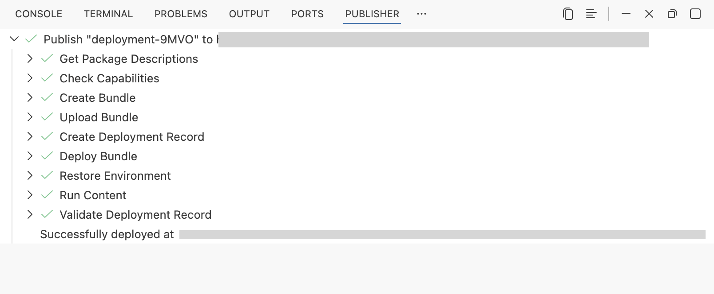

### Finish the Setup in Connect

The app is deployed now, but it won't work yet. Two things have to be set on the content itself, and neither travels in the bundle.

#### Step 1: Attach the Snowflake integration

Open the content in Connect, go to **Content Settings** > **Access**, and add the Snowflake integration there.

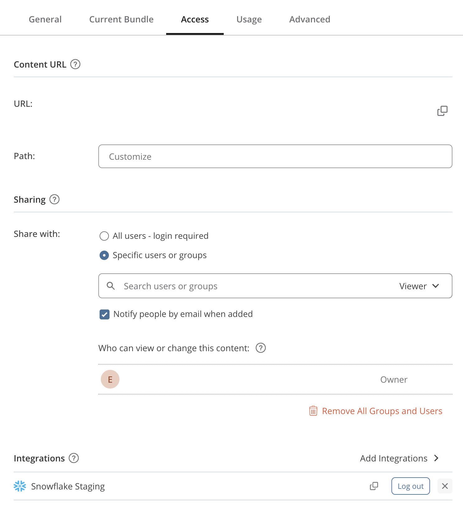


Check that you're attaching the **viewer** integration rather than a service account one. That choice is what makes the rest of this guide true.

#### Step 2: Set the account identifier

In the **Vars** pane, add `SNOWFLAKE_ACCOUNT`. Connect doesn't inherit it from Workbench, and the app needs it to build the connection. Your Workbench session already knows the value:

```bash
echo $SNOWFLAKE_ACCOUNT
```

If that's empty, read it from the connection file at `$SNOWFLAKE_HOME/connections.toml`, or ask Snowflake with `SELECT CURRENT_ACCOUNT()`.

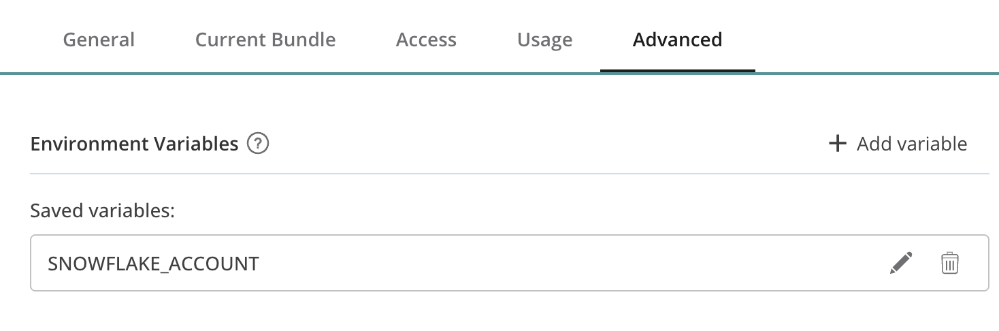

Changing a variable restarts the content, so neither of these needs a redeploy. Reload the app and it should come up.

> The first time you open content backed by a viewer integration, you may be asked to log in to Snowflake through the **Access** tab. That's the OAuth session being established, and it happens once.

<!-- ------------------------ -->
## Ask Questions as a Viewer

### Open the Dashboard

We did it! the app has been deployed correctly. Return to Connect in the Posit Team Native App, click the **Content** tab, and open your dashboard. Ask a few questions to confirm it behaves the way it did locally.


To share it, open the **Settings** pane on the content page, copy the URL from the **Content URL** section, and send it to your team.

### Using the viewers credentials

The important thing to itterate there is that the viewers Snowflake Credentials are used when querying the dashbaord. This means that two colleagues can open the same dashboard, both be able to send a query, but receive different results depending on whether they have access to view the data or not. The Model will only see what the data base is allowed to send back.

> The alternative is a service account integration, where all content queries Snowflake as one shared identity. That suits a dashboard meant to show everyone the same governed numbers, but it puts access control back on you. Over sensitive data, the viewer integration is the safer default.

<!-- ------------------------ -->
## Conclusion and Resources

We've built a dashboard that answers questions in natural language and deployed it somewhere a whole team can use it, without moving data, standing up model infrastructure, or writing a permission layer.

Three properties carry to your next project: the model writes SQL rather than answers, so results can be checked and reused; queries execute in Snowflake, so the dashboard scales with your warehouse instead of your container; and access is delegated to Snowflake, so security is inherited rather than reimplemented. Point the pattern at your own table and the credentials function and data description are the only parts to rewrite.

### What You Learned

- How to write one Snowflake connection that works in both Workbench and Connect
- How to use Snowflake Cortex as the model backend for a deployed application
- How to build a natural language dashboard with `querychat`, Shiny, and `ggsql`
- Why passing a database connection rather than a data frame keeps queries in Snowflake
- How to publish to Posit Connect and inherit Snowflake's access controls per viewer

### Related Resources

- [Snowflake Cortex AI LLM Functions](https://docs.snowflake.com/en/user-guide/snowflake-cortex/llm-functions)
- [Snowflake Semantic Views](https://docs.snowflake.com/en/user-guide/views-semantic/overview)
- [chatlas documentation](https://posit-dev.github.io/chatlas/)
- [querychat documentation](https://posit-dev.github.io/querychat/)
- [ggsql documentation](https://posit-dev.github.io/ggsql/)
- [Shiny for Python](https://shiny.posit.co/py/)
- [Posit Team Native App documentation](https://docs.posit.co/partnerships/snowflake/posit-team/)
- [Managed credentials in the Posit Team Native App](https://docs.posit.co/partnerships/snowflake/posit-team/managed-credentials.html)
- [Posit Connect user guide](https://docs.posit.co/connect/user/)
- **Related Guides**: [Build and Deploy an Interactive Shiny Dashboard with the Posit Team Native App and Snowflake Cortex AI](https://www.snowflake.com/en/developers/guides/build-and-deploy-interactive-dashboard-with-posit-team-and-cortex/), [Analyze Data with Python Using Posit Team](https://www.snowflake.com/en/developers/guides/analyze-data-with-python-using-posit-team/)
