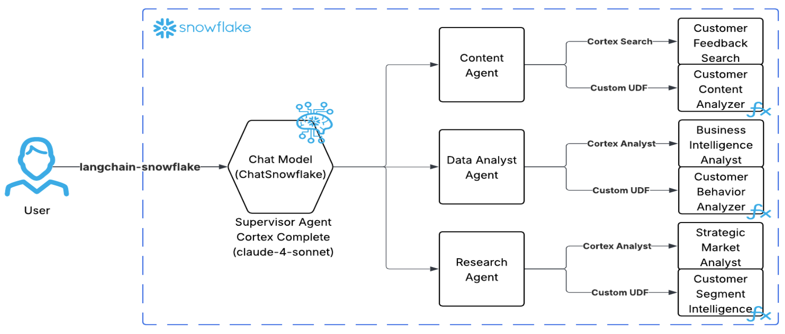

author: Josh Reini, Prathamesh Nimkar
id: build-and-evaluate-agents-with-langgraph-and-snowflake
categories: snowflake-site:taxonomy/solution-center/certification/quickstart, snowflake-site:taxonomy/product/ai, snowflake-site:taxonomy/product/platform, snowflake-site:taxonomy/snowflake-feature/ingestion/conversational-assistants, snowflake-site:taxonomy/snowflake-feature/cortex-llm-functions
language: en
summary: Build and evaluate a multi-agent supervisor system using LangGraph and Snowflake Cortex Agents
environments: web
status: Published 
feedback link: https://github.com/Snowflake-Labs/sfguides/issues

# Build and Evaluate Multi-Agent Systems with Snowflake and LangGraph

## Overview

Modern organizations need to combine multiple AI capabilities to handle complex business questions. This quickstart demonstrates how to build a **multi-agent supervisor architecture** using LangGraph and Snowflake Cortex Agents for customer intelligence, churn prediction, and business analytics.

You can also watch this use case in action on Youtube:

[LangGraph And Snowflake Cortex AI: Exploring Multi-Agentic Workflows](https://www.youtube.com/watch?v=LsanBaHbCvE)

### What is a Multi-Agent Supervisor Architecture?

A multi-agent supervisor architecture uses a central "supervisor" LLM as a hub that coordinates specialized agents:

1. **Plans** an execution strategy with explicit steps (once, immutable)
2. **Routes** queries to specialized agents based on the plan
3. **Coordinates** data flow between agents when multi-step analysis is needed
4. **Synthesizes** results from agents into coherent executive summaries

```
User Query → Supervisor (Plan) → Agent → Supervisor (Route) → Agent → Supervisor (Synthesize) → Summary
```

### Why LangGraph

[LangGraph](https://github.com/langchain-ai/langgraph) provides low-level supporting infrastructure for any long-running, stateful workflow or agent. LangGraph is great for building durable, stateful agents across multiple systems.

If you're not building with LangGraph, try this [guide](https://www.snowflake.com/en/developers/guides/multi-agent-orchestration-snowflake-intelligence/) to build a multi-agent system entirely native to Snowflake.

### Architecture Overview



### What You'll Learn

- How to set up Snowflake Cortex Agents with specialized tools
- How to create Cortex Search services for semantic search
- How to build Semantic Views for Cortex Analyst text-to-SQL
- How to build a multi-agent supervisor workflow using LangGraph
- How to run and debug your workflow with LangGraph Studio
- How to evaluate agent performance using TruLens with Snowflake

### What You'll Build

A complete multi-agent customer intelligence system that:

- Routes queries to specialized agents (Content, Data Analyst, Research)
- Uses Cortex Search for semantic search across support tickets
- Uses Cortex Analyst for natural language to SQL conversion
- Uses custom AI UDFs for sentiment analysis and churn prediction
- Can be run interactively via LangGraph Studio or programmatically via notebook
- Evaluates responses using Agent Goal-Plan-Action alignment metrics via TruLens

### Prerequisites

- [Snowflake Account](https://signup.snowflake.com/) with Cortex AI features enabled
- Python 3.9+ installed locally
- [Git](https://git-scm.com/book/en/v2/Getting-Started-Installing-Git) installed
- [LangGraph CLI](https://langchain-ai.github.io/langgraph/how-tos/local-studio/) (`pip install langgraph-cli`) for LangGraph Studio
- [LangSmith Account](https://smith.langchain.com/) (optional, for tracing)
- Basic familiarity with LangGraph and LangChain concepts (optional)

## Setup Git Integration

The first step is to clone the repository into Snowflake using Git Integration. This gives you access to all the SQL scripts and demo data files.

### Create Database and Clone Repository

Open Snowsight and create a new SQL Worksheet. Run the following SQL:

```sql
USE ROLE ACCOUNTADMIN;

-- Create database and schema
CREATE DATABASE IF NOT EXISTS CUSTOMER_INTELLIGENCE_DB;
USE DATABASE CUSTOMER_INTELLIGENCE_DB;
CREATE SCHEMA IF NOT EXISTS PUBLIC;
USE SCHEMA PUBLIC;

-- Create API integration for GitHub
CREATE API INTEGRATION IF NOT EXISTS github_api_integration
    API_PROVIDER = git_https_api
    API_ALLOWED_PREFIXES = ('https://github.com/Snowflake-Labs/')
    ENABLED = TRUE;

-- Clone the GitHub repository
CREATE OR REPLACE GIT REPOSITORY customer_intelligence_demo
    API_INTEGRATION = github_api_integration
    ORIGIN = 'https://github.com/Snowflake-Labs/sfguide-build-and-evaluate-agents-with-snowflake-and-langgraph.git';

-- Fetch latest from GitHub
ALTER GIT REPOSITORY customer_intelligence_demo FETCH;

-- Verify repository contents
LS @customer_intelligence_demo/branches/main/;
```

You should see the SQL scripts and CSV files in the repository listing.

### Run Setup Scripts

After the Git integration is set up, you can run each SQL script directly from the repository. Navigate to **Data » Databases » CUSTOMER_INTELLIGENCE_DB » PUBLIC » Git Repositories » customer_intelligence_demo » branches » main » sql** and execute each script in order:

| Order | Script | Purpose |
|-------|--------|---------|
| 1 | `01_setup_database_and_load_data.sql` | Creates tables and loads CSV data |
| 2 | `02_setup_cortex_search.sql` | Creates Cortex Search services |
| 3 | `03_setup_semantic_views.sql` | Creates Semantic Views for Cortex Analyst |
| 4 | `04_setup_udfs.sql` | Creates AI UDFs (tools for agents) |
| 5 | `05_setup_cortex_agents.sql` | Creates the three Cortex Agents |

> **Note:** Run scripts in order as later scripts depend on earlier ones.

The following sections explain what each script does in detail.

## Setup Database and Load Data

The `01_setup_database_and_load_data.sql` script creates the tables and loads demo data. Here's what it does:

### Create Tables

Create the four tables that will store customer data:

```sql
-- CUSTOMERS TABLE
CREATE OR REPLACE TABLE CUSTOMERS (
    customer_id VARCHAR(50) PRIMARY KEY,
    signup_date DATE NOT NULL,
    plan_type VARCHAR(20) NOT NULL,
    company_size VARCHAR(20) NOT NULL,
    industry VARCHAR(30) NOT NULL,
    status VARCHAR(20) NOT NULL DEFAULT 'active',
    monthly_revenue DECIMAL(10,2),
    created_at TIMESTAMP DEFAULT CURRENT_TIMESTAMP()
);

-- USAGE_EVENTS TABLE
CREATE OR REPLACE TABLE USAGE_EVENTS (
    event_id VARCHAR(50) PRIMARY KEY,
    customer_id VARCHAR(50) NOT NULL,
    event_date DATE NOT NULL,
    feature_used VARCHAR(50) NOT NULL,
    session_duration_minutes INTEGER NOT NULL,
    actions_count INTEGER NOT NULL,
    created_at TIMESTAMP DEFAULT CURRENT_TIMESTAMP()
);

-- SUPPORT_TICKETS TABLE
CREATE OR REPLACE TABLE SUPPORT_TICKETS (
    ticket_id VARCHAR(50) PRIMARY KEY,
    customer_id VARCHAR(50) NOT NULL,
    created_date DATE NOT NULL,
    category VARCHAR(30) NOT NULL,
    priority VARCHAR(10) NOT NULL,
    status VARCHAR(20) NOT NULL,
    resolution_time_hours INTEGER,
    satisfaction_score INTEGER,
    ticket_text TEXT NOT NULL,
    created_at TIMESTAMP DEFAULT CURRENT_TIMESTAMP()
);

-- CHURN_EVENTS TABLE
CREATE OR REPLACE TABLE CHURN_EVENTS (
    churn_id VARCHAR(50) PRIMARY KEY,
    customer_id VARCHAR(50) NOT NULL,
    churn_date DATE NOT NULL,
    churn_reason VARCHAR(50) NOT NULL,
    days_since_signup INTEGER NOT NULL,
    final_plan_type VARCHAR(20),
    final_monthly_revenue DECIMAL(10,2),
    created_at TIMESTAMP DEFAULT CURRENT_TIMESTAMP()
);
```

### Step 3: Load Demo Data

Load the CSV files from the Git repository:

```sql
-- Create file format
CREATE OR REPLACE FILE FORMAT csv_format
    TYPE = CSV 
    SKIP_HEADER = 1 
    FIELD_OPTIONALLY_ENCLOSED_BY = '"'
    NULL_IF = ('', 'NULL', 'null') 
    EMPTY_FIELD_AS_NULL = TRUE;

-- Load CUSTOMERS
INSERT INTO CUSTOMERS (customer_id, signup_date, plan_type, company_size, industry, status, monthly_revenue)
SELECT $1,$2,$3,$4,$5,$6,$7 
FROM @customer_intelligence_demo/branches/main/demo_customers.csv (FILE_FORMAT=>csv_format);

-- Load USAGE_EVENTS  
INSERT INTO USAGE_EVENTS (event_id, customer_id, event_date, feature_used, session_duration_minutes, actions_count)
SELECT $1,$2,$3,$4,$5,$6 
FROM @customer_intelligence_demo/branches/main/demo_usage_events.csv (FILE_FORMAT=>csv_format);

-- Load SUPPORT_TICKETS
INSERT INTO SUPPORT_TICKETS (ticket_id, customer_id, created_date, category, priority, status, resolution_time_hours, satisfaction_score, ticket_text)
SELECT $1,$2,$3,$4,$5,$6,$7,$8,$9 
FROM @customer_intelligence_demo/branches/main/demo_support_tickets.csv (FILE_FORMAT=>csv_format);

-- Load CHURN_EVENTS
INSERT INTO CHURN_EVENTS (churn_id, customer_id, churn_date, churn_reason, days_since_signup, final_plan_type, final_monthly_revenue)
SELECT $1,$2,$3,$4,$5,$6,$7 
FROM @customer_intelligence_demo/branches/main/demo_churn_events.csv (FILE_FORMAT=>csv_format);
```

### Step 4: Verify Data Loaded

```sql
SELECT 'CUSTOMERS' as table_name, COUNT(*) as row_count FROM CUSTOMERS
UNION ALL SELECT 'USAGE_EVENTS', COUNT(*) FROM USAGE_EVENTS
UNION ALL SELECT 'SUPPORT_TICKETS', COUNT(*) FROM SUPPORT_TICKETS
UNION ALL SELECT 'CHURN_EVENTS', COUNT(*) FROM CHURN_EVENTS;
```

You should see data in all four tables.

## Setup Cortex Search Services

Cortex Search provides hybrid search (semantic + keyword) capabilities for unstructured text data. We'll create search services that the agents will use to find relevant customer feedback and support tickets.

### Create Support Tickets Search Service

This service enables semantic search across all customer support tickets:

```sql
USE DATABASE CUSTOMER_INTELLIGENCE_DB;
USE SCHEMA PUBLIC;

CREATE OR REPLACE CORTEX SEARCH SERVICE SUPPORT_TICKETS_SEARCH
ON ticket_text
ATTRIBUTES customer_id, ticket_id, category, priority, status, created_date
WAREHOUSE = COMPUTE_WH
TARGET_LAG = '1 hour'
AS (
    SELECT 
        ticket_id,
        customer_id,
        category,
        priority,
        status,
        created_date,
        ticket_text
    FROM SUPPORT_TICKETS
);
```

### Create Customers Search Service (Optional)

```sql
CREATE OR REPLACE CORTEX SEARCH SERVICE CUSTOMERS_SEARCH
ON industry
ATTRIBUTES customer_id, plan_type, company_size, status, monthly_revenue
WAREHOUSE = COMPUTE_WH
TARGET_LAG = '1 hour'
AS (
    SELECT 
        customer_id,
        plan_type,
        company_size,
        industry,
        status,
        monthly_revenue
    FROM CUSTOMERS
);
```

### Verify Search Services

```sql
SHOW CORTEX SEARCH SERVICES IN SCHEMA CUSTOMER_INTELLIGENCE_DB.PUBLIC;
```

## Setup Semantic Views

[Semantic Views](https://docs.snowflake.com/en/user-guide/views-semantic/overview) power Cortex Analyst, enabling natural language to SQL conversion. They define the schema, relationships, and business metrics that the AI uses to generate accurate SQL queries.

### Create Customer Behavior Analyst View

This semantic view is used by the DATA_ANALYST_AGENT for customer behavior analytics:

```sql
CREATE OR REPLACE SEMANTIC VIEW CUSTOMER_BEHAVIOR_ANALYST
  TABLES (
    CUSTOMERS AS CUSTOMER_INTELLIGENCE_DB.PUBLIC.CUSTOMERS
      PRIMARY KEY (CUSTOMER_ID)
      COMMENT = 'Customer master data',
    USAGE_EVENTS AS CUSTOMER_INTELLIGENCE_DB.PUBLIC.USAGE_EVENTS
      COMMENT = 'Customer usage events',
    SUPPORT_TICKETS AS CUSTOMER_INTELLIGENCE_DB.PUBLIC.SUPPORT_TICKETS
      COMMENT = 'Support tickets',
    CHURN_EVENTS AS CUSTOMER_INTELLIGENCE_DB.PUBLIC.CHURN_EVENTS
      COMMENT = 'Churn events'
  )
  RELATIONSHIPS (
    CUSTOMER_TO_USAGE AS USAGE_EVENTS (CUSTOMER_ID) REFERENCES CUSTOMERS (CUSTOMER_ID),
    CUSTOMER_TO_SUPPORT AS SUPPORT_TICKETS (CUSTOMER_ID) REFERENCES CUSTOMERS (CUSTOMER_ID),
    CUSTOMER_TO_CHURN AS CHURN_EVENTS (CUSTOMER_ID) REFERENCES CUSTOMERS (CUSTOMER_ID)
  )
  FACTS (
    CUSTOMERS.MONTHLY_REVENUE AS CUSTOMERS.MONTHLY_REVENUE
      WITH SYNONYMS = ('MRR', 'monthly recurring revenue')
      COMMENT = 'Monthly revenue per customer',
    USAGE_EVENTS.SESSION_DURATION_MINUTES AS USAGE_EVENTS.SESSION_DURATION_MINUTES
      WITH SYNONYMS = ('session length')
      COMMENT = 'Session duration in minutes',
    USAGE_EVENTS.ACTIONS_COUNT AS USAGE_EVENTS.ACTIONS_COUNT
      COMMENT = 'Number of actions in session',
    SUPPORT_TICKETS.SATISFACTION_SCORE AS SUPPORT_TICKETS.SATISFACTION_SCORE
      WITH SYNONYMS = ('CSAT')
      COMMENT = 'Customer satisfaction score'
  )
  DIMENSIONS (
    CUSTOMERS.CUSTOMER_ID AS CUSTOMERS.CUSTOMER_ID
      WITH SYNONYMS = ('customer identifier', 'account id')
      COMMENT = 'Unique customer identifier',
    CUSTOMERS.INDUSTRY AS CUSTOMERS.INDUSTRY
      WITH SYNONYMS = ('sector', 'vertical')
      COMMENT = 'Customer industry',
    CUSTOMERS.PLAN_TYPE AS CUSTOMERS.PLAN_TYPE
      WITH SYNONYMS = ('subscription', 'tier')
      COMMENT = 'Subscription plan level'
  )
  METRICS (
    CUSTOMERS.TOTAL_CUSTOMERS AS COUNT(CUSTOMERS.CUSTOMER_ID)
      WITH SYNONYMS = ('customer count')
      COMMENT = 'Total number of customers',
    CUSTOMERS.ARPU AS AVG(CUSTOMERS.MONTHLY_REVENUE)
      WITH SYNONYMS = ('average revenue per user')
      COMMENT = 'Average revenue per customer',
    USAGE_EVENTS.AVG_SESSION_DURATION AS AVG(USAGE_EVENTS.SESSION_DURATION_MINUTES)
      COMMENT = 'Average session duration'
  )
  COMMENT = 'Customer behavior analytics for usage patterns, churn analysis, and retention insights';
```

### Create Strategic Research Analyst View

This semantic view is used by the RESEARCH_AGENT for market intelligence:

```sql
CREATE OR REPLACE SEMANTIC VIEW STRATEGIC_RESEARCH_ANALYST
  TABLES (
    CUSTOMERS AS CUSTOMER_INTELLIGENCE_DB.PUBLIC.CUSTOMERS
      PRIMARY KEY (CUSTOMER_ID)
      COMMENT = 'Customer master data',
    USAGE_EVENTS AS CUSTOMER_INTELLIGENCE_DB.PUBLIC.USAGE_EVENTS
      COMMENT = 'Usage data',
    SUPPORT_TICKETS AS CUSTOMER_INTELLIGENCE_DB.PUBLIC.SUPPORT_TICKETS
      COMMENT = 'Support data',
    CHURN_EVENTS AS CUSTOMER_INTELLIGENCE_DB.PUBLIC.CHURN_EVENTS
      COMMENT = 'Churn data'
  )
  RELATIONSHIPS (
    CUSTOMER_TO_USAGE AS USAGE_EVENTS (CUSTOMER_ID) REFERENCES CUSTOMERS (CUSTOMER_ID),
    CUSTOMER_TO_SUPPORT AS SUPPORT_TICKETS (CUSTOMER_ID) REFERENCES CUSTOMERS (CUSTOMER_ID),
    CUSTOMER_TO_CHURN AS CHURN_EVENTS (CUSTOMER_ID) REFERENCES CUSTOMERS (CUSTOMER_ID)
  )
  METRICS (
    CUSTOMERS.TOTAL_MRR AS SUM(CUSTOMERS.MONTHLY_REVENUE)
      WITH SYNONYMS = ('total recurring revenue')
      COMMENT = 'Total monthly recurring revenue',
    CHURN_EVENTS.LOST_REVENUE AS SUM(CHURN_EVENTS.FINAL_MONTHLY_REVENUE)
      COMMENT = 'Total lost revenue'
  )
  COMMENT = 'Strategic research and market intelligence for executive-level business analysis';
```

### Verify Semantic Views

```sql
SHOW SEMANTIC VIEWS IN SCHEMA CUSTOMER_INTELLIGENCE_DB.PUBLIC;
```

## Setup Custom AI UDFs

Custom UDFs (User-Defined Functions) extend agent capabilities with specialized AI analysis. These functions use Snowflake Cortex AI to perform sentiment analysis, behavior analysis, and strategic insights.

### Create Customer Content Analyzer UDF

Used by the CONTENT_AGENT for sentiment and feedback analysis:

```sql
CREATE OR REPLACE FUNCTION AI_ANALYZE_CUSTOMER_CONTENT(
    "CUSTOMER_IDS_STRING" VARCHAR, 
    "ANALYSIS_TYPE" VARCHAR DEFAULT 'recent_support_tickets'
)
RETURNS VARIANT
LANGUAGE SQL
AS '
WITH parsed_customer_ids AS (
  SELECT TRIM(VALUE) as customer_id
  FROM TABLE(SPLIT_TO_TABLE(customer_ids_string, '',''))
),
target_tickets AS (
  SELECT 
    st.customer_id,
    st.ticket_text,
    st.category,
    st.priority,
    st.satisfaction_score,
    st.created_date
  FROM support_tickets st
  INNER JOIN parsed_customer_ids pci ON st.customer_id = pci.customer_id
  ORDER BY st.created_date DESC
  LIMIT 10
),
content_summary AS (
  SELECT 
    COUNT(*) as total_tickets,
    COUNT(DISTINCT customer_id) as customers_with_tickets,
    ROUND(AVG(satisfaction_score), 2) as avg_satisfaction,
    COUNT(CASE WHEN priority IN (''high'', ''critical'') THEN 1 END) as urgent_tickets,
    LISTAGG(DISTINCT category, '', '') as ticket_categories,
    SUBSTRING(LISTAGG(ticket_text, '' | ''), 1, 1000) as combined_ticket_text
  FROM target_tickets
),
ai_content_analysis AS (
  SELECT 
    cs.*,
    CASE 
      WHEN cs.total_tickets > 0 THEN
        AI_COMPLETE(
          ''claude-3-5-sonnet'',
          CONCAT(
            ''Analyze customer feedback: '', analysis_type, ''\\n'',
            ''Tickets: '', cs.total_tickets, '' ('', cs.urgent_tickets, '' urgent)\\n'',
            ''Satisfaction: '', cs.avg_satisfaction, ''/5\\n'',
            ''Categories: '', cs.ticket_categories, ''\\n'',
            ''Content: '', cs.combined_ticket_text, ''\\n\\n'',
            ''JSON: {"sentiment":"positive/neutral/negative","urgency":"low/medium/high","key_issue":"main_problem","action_needed":"recommendation"}''
          )
        )
      ELSE NULL
    END as ai_content_insights
  FROM content_summary cs
)
SELECT OBJECT_CONSTRUCT(
    ''analysis_type'', analysis_type,
    ''customer_ids_input'', customer_ids_string,
    ''content_metrics'', OBJECT_CONSTRUCT(
      ''total_tickets'', total_tickets,
      ''customers_affected'', customers_with_tickets,
      ''avg_satisfaction'', avg_satisfaction,
      ''urgent_tickets'', urgent_tickets
    ),
    ''ai_content_insights'', TRY_PARSE_JSON(ai_content_insights),
    ''analysis_timestamp'', CURRENT_TIMESTAMP()
)::VARIANT as result
FROM ai_content_analysis
';
```

### Create Customer Segment Analyzer UDF

Used by the DATA_ANALYST_AGENT to analyze customer behavior, metrics and analytics.

```sql
CREATE OR REPLACE FUNCTION AI_ANALYZE_CUSTOMER_SEGMENT("CUSTOMER_IDS_STRING" VARCHAR, "SEGMENT_NAME" VARCHAR DEFAULT 'high_value_customers')
RETURNS VARIANT
LANGUAGE SQL
AS '
WITH parsed_customer_ids AS (
  -- Parse comma-separated string into individual customer IDs
  SELECT 
    TRIM(VALUE) as customer_id
  FROM TABLE(SPLIT_TO_TABLE(customer_ids_string, '',''))
),
target_customers AS (
  SELECT 
    c.customer_id,
    c.plan_type,
    c.monthly_revenue,
    c.company_size,
    c.industry,
    c.status,
    DATEDIFF(''day'', c.signup_date, CURRENT_DATE()) as customer_age_days
  FROM customers c
  INNER JOIN parsed_customer_ids pci ON c.customer_id = pci.customer_id
),
segment_usage AS (
  SELECT 
    COUNT(DISTINCT u.customer_id) as active_users,
    COUNT(*) as total_events,
    ROUND(AVG(u.session_duration_minutes), 2) as avg_session_duration,
    SUM(u.actions_count) as total_actions
  FROM usage_events u
  INNER JOIN parsed_customer_ids pci ON u.customer_id = pci.customer_id
  WHERE u.event_date >= CURRENT_DATE() - 365 - 90  -- Handle data offset
),
segment_support AS (
  SELECT 
    COUNT(*) as total_tickets,
    ROUND(AVG(satisfaction_score), 2) as avg_satisfaction,
    COUNT(CASE WHEN priority IN (''high'', ''critical'') THEN 1 END) as high_priority_tickets
  FROM support_tickets s
  INNER JOIN parsed_customer_ids pci ON s.customer_id = pci.customer_id
  WHERE s.created_date >= CURRENT_DATE() - 365 - 90  -- Handle data offset
),
segment_summary AS (
  SELECT 
    tc.customer_count,
    tc.total_mrr,
    tc.avg_revenue,
    tc.plan_mix,
    su.active_users,
    su.total_events,
    su.avg_session_duration,
    ss.total_tickets,
    ss.avg_satisfaction,
    -- AI analysis with proper input validation
    CASE 
      WHEN tc.customer_count > 0 THEN
        AI_COMPLETE(
          ''claude-3-5-sonnet'',
          CONCAT(
            ''Analyze customer segment and respond with valid JSON only:\\n'',
            ''Segment: '', segment_name, ''\\n'',
            ''Customers: '', tc.customer_count, ''\\n'',
            ''MRR: $'', tc.total_mrr, '' (avg $'', tc.avg_revenue, '')\\n'',
            ''Usage: '', COALESCE(su.active_users, 0), '' active, '', COALESCE(su.total_events, 0), '' events\\n'',
            ''Support: '', COALESCE(ss.total_tickets, 0), '' tickets, '', COALESCE(ss.avg_satisfaction, 0), ''/5 satisfaction\\n\\n'',
            ''JSON: {"risk_level":"low/medium/high/critical","key_insight":"main_finding","recommendation":"action"}''
          )
        )
      ELSE NULL
    END as ai_segment_analysis
  FROM (
    SELECT 
      COUNT(*) as customer_count,
      SUM(monthly_revenue) as total_mrr,
      ROUND(AVG(monthly_revenue), 0) as avg_revenue,
      LISTAGG(DISTINCT plan_type, '', '') as plan_mix
    FROM target_customers
  ) tc
  CROSS JOIN segment_usage su
  CROSS JOIN segment_support ss
)
SELECT 
  (OBJECT_CONSTRUCT(
    ''segment_name'', segment_name,
    ''customer_ids_input'', customer_ids_string,
    ''segment_metrics'', OBJECT_CONSTRUCT(
      ''customer_count'', customer_count,
      ''total_mrr'', total_mrr,
      ''avg_revenue_per_customer'', avg_revenue,
      ''plan_mix'', plan_mix,
      ''active_users'', COALESCE(active_users, 0),
      ''avg_session_duration'', COALESCE(avg_session_duration, 0),
      ''support_satisfaction'', COALESCE(avg_satisfaction, 0)
    ),
    ''ai_insights'', TRY_PARSE_JSON(ai_segment_analysis),
    ''raw_ai_response'', ai_segment_analysis,
    ''processing_mode'', ''agent_compatible_analysis'',
    ''node_name'', ''ai_customer_segment_analyzer'',
    ''analysis_timestamp'', CURRENT_TIMESTAMP()
  ))::VARIANT as result
FROM segment_summary
';
```

### Create Churn Risk Predictor UDF

Used by the DATA_ANALYST_AGENT for engagement and churn risk prediction:

```sql
CREATE OR REPLACE FUNCTION AI_PREDICT_CHURN_RISK(
    "CUSTOMER_IDS_STRING" VARCHAR, 
    "ANALYSIS_DAYS" NUMBER(38,0) DEFAULT 30
)
RETURNS VARIANT
LANGUAGE SQL
AS '
WITH parsed_customer_ids AS (
  SELECT TRIM(VALUE) as customer_id
  FROM TABLE(SPLIT_TO_TABLE(customer_ids_string, '',''))
),
target_customers AS (
  SELECT 
    c.customer_id,
    c.plan_type,
    c.monthly_revenue,
    c.company_size,
    c.industry,
    c.status
  FROM customers c
  INNER JOIN parsed_customer_ids pci ON c.customer_id = pci.customer_id
),
behavior_metrics AS (
  SELECT 
    COUNT(DISTINCT u.customer_id) as active_customers,
    COUNT(*) as total_events,
    ROUND(AVG(u.session_duration_minutes), 2) as avg_session_duration,
    SUM(u.actions_count) as total_actions
  FROM usage_events u
  INNER JOIN parsed_customer_ids pci ON u.customer_id = pci.customer_id
),
analysis_result AS (
  SELECT 
    tc.customer_count,
    tc.total_mrr,
    bm.active_customers,
    bm.total_events,
    bm.avg_session_duration,
    CASE 
      WHEN tc.customer_count > 0 THEN
        AI_COMPLETE(
          ''claude-3-5-sonnet'',
          CONCAT(
            ''Analyze customer behavior:\\n'',
            ''Customers: '', tc.customer_count, '', MRR: $'', tc.total_mrr, ''\\n'',
            ''Active: '', COALESCE(bm.active_customers, 0), ''\\n'',
            ''Events: '', COALESCE(bm.total_events, 0), ''\\n'',
            ''JSON: {"engagement":"high/medium/low","churn_risk":"low/medium/high","recommendation":"action"}''
          )
        )
      ELSE NULL
    END as ai_behavior_insights
  FROM (
    SELECT 
      COUNT(*) as customer_count,
      SUM(monthly_revenue) as total_mrr
    FROM target_customers
  ) tc
  CROSS JOIN behavior_metrics bm
)
SELECT OBJECT_CONSTRUCT(
    ''customer_ids_input'', customer_ids_string,
    ''behavior_metrics'', OBJECT_CONSTRUCT(
      ''customer_count'', customer_count,
      ''total_mrr'', total_mrr,
      ''active_customers'', COALESCE(active_customers, 0),
      ''avg_session_duration'', COALESCE(avg_session_duration, 0)
    ),
    ''ai_behavior_insights'', TRY_PARSE_JSON(ai_behavior_insights),
    ''analysis_timestamp'', CURRENT_TIMESTAMP()
)::VARIANT as result
FROM analysis_result
';
```

### Verify UDFs

```sql
SHOW USER FUNCTIONS IN SCHEMA CUSTOMER_INTELLIGENCE_DB.PUBLIC;
```

## Create Cortex Agents

Now we create the three specialized [Cortex Agents](https://docs.snowflake.com/en/user-guide/snowflake-cortex/cortex-agents) that will be orchestrated by the LangGraph supervisor. Each agent has specific tools and instructions for their domain.

### Create Agent Database

```sql
CREATE DATABASE IF NOT EXISTS SNOWFLAKE_INTELLIGENCE;
USE DATABASE SNOWFLAKE_INTELLIGENCE;
CREATE SCHEMA IF NOT EXISTS AGENTS;
USE SCHEMA AGENTS;
```

### Create CONTENT_AGENT

The Content Agent specializes in customer feedback, sentiment analysis, and support intelligence:

```sql
CREATE OR REPLACE AGENT CONTENT_AGENT
  COMMENT = 'Customer feedback, sentiment analysis, and communication intelligence specialist'
FROM SPECIFICATION $$
{
    "models": {
        "orchestration": "claude-4-sonnet"
    },
    "orchestration": {
        "budget": {
            "seconds": 60,
            "tokens": 32000
        }
    },
    "instructions": {
        "system": "The Content Agent specializes in analyzing customer feedback, support interactions, and satisfaction trends. It combines targeted customer analysis with broad pattern recognition to distinguish between isolated incidents and systemic issues.",
        "response": "Always synthesize data into executive insights. Provide maximum 3-5 key findings with business impact."
    },
    "tools": [
        {
            "tool_spec": {
                "type": "cortex_search",
                "name": "CUSTOMER_FEEDBACK_SEARCH",
                "description": "Semantic search across all customer support tickets and feedback."
            }
        },
        {
            "tool_spec": {
                "type": "generic",
                "name": "CUSTOMER_CONTENT_ANALYZER",
                "description": "AI-powered analysis of specific customer feedback and support interactions.",
                "input_schema": {
                    "type": "object",
                    "properties": {
                        "customer_ids_string": {
                            "type": "string",
                            "description": "Comma-separated list of customer IDs to analyze"
                        }
                    },
                    "required": ["customer_ids_string"]
                }
            }
        }
    ],
    "tool_resources": {
        "CUSTOMER_FEEDBACK_SEARCH": {
            "execution_environment": {
                "type": "warehouse",
                "warehouse": "COMPUTE_WH",
                "query_timeout": 300
            },
            "search_service": "CUSTOMER_INTELLIGENCE_DB.PUBLIC.SUPPORT_TICKETS_SEARCH",
            "id_column": "ticket_id",
            "title_column": "ticket_text"
        },
        "CUSTOMER_CONTENT_ANALYZER": {
            "type": "procedure",
            "identifier": "CUSTOMER_INTELLIGENCE_DB.PUBLIC.AI_ANALYZE_CUSTOMER_CONTENT",
            "execution_environment": {
                "type": "warehouse",
                "warehouse": "COMPUTE_WH",
                "query_timeout": 300
            }
        }
    }
}
$$;
```

### Create DATA_ANALYST_AGENT

The Data Analyst Agent specializes in customer behavior, metrics, and predictive analytics:

```sql
CREATE OR REPLACE AGENT DATA_ANALYST_AGENT
  COMMENT = 'Customer behavior, business metrics, and predictive analytics specialist'
FROM SPECIFICATION $$
{
    "models": {
        "orchestration": "claude-4-sonnet"
    },
    "orchestration": {
        "budget": {
            "seconds": 60,
            "tokens": 32000
        }
    },
    "instructions": {
        "system": "Expert customer behavior analyst specializing in data-driven insights about customer engagement, usage patterns, churn prediction, and retention strategies.",
        "response": "Always synthesize data into executive insights. Never return raw data tables."
    },
    "tools": [
        {
            "tool_spec": {
                "type": "cortex_analyst_text_to_sql",
                "name": "BUSINESS_INTELLIGENCE_ANALYST",
                "description": "Natural language to SQL for comprehensive customer behavior analytics."
            }
        },
        {
            "tool_spec": {
                "type": "generic",
                "name": "CHURN_RISK_PREDICTOR",
                "description": "AI-powered churn risk prediction and engagement analysis.",
                "input_schema": {
                    "type": "object",
                    "properties": {
                        "customer_ids_string": {
                            "type": "string",
                            "description": "Comma-separated list of customer IDs to analyze"
                        }
                    },
                    "required": ["customer_ids_string"]
                }
            }
        }
    ],
    "tool_resources": {
        "BUSINESS_INTELLIGENCE_ANALYST": {
            "execution_environment": {
                "type": "warehouse",
                "warehouse": "COMPUTE_WH",
                "query_timeout": 300
            },
            "semantic_view": "CUSTOMER_INTELLIGENCE_DB.PUBLIC.CUSTOMER_BEHAVIOR_ANALYST"
        },
        "CHURN_RISK_PREDICTOR": {
            "type": "procedure",
            "identifier": "CUSTOMER_INTELLIGENCE_DB.PUBLIC.AI_PREDICT_CHURN_RISK",
            "execution_environment": {
                "type": "warehouse",
                "warehouse": "COMPUTE_WH",
                "query_timeout": 300
            }
        }
    }
}
$$;
```

### Create RESEARCH_AGENT

The Research Agent specializes in market intelligence and strategic analysis:

```sql
CREATE OR REPLACE AGENT RESEARCH_AGENT
  COMMENT = 'Market intelligence, strategic analysis, and competitive insights specialist'
FROM SPECIFICATION $$
{
    "models": {
        "orchestration": "claude-4-sonnet"
    },
    "orchestration": {
        "budget": {
            "seconds": 60,
            "tokens": 32000
        }
    },
    "instructions": {
        "system": "Strategic research and market intelligence specialist focused on executive-level business analysis, competitive positioning, and market opportunity identification.",
        "response": "Always synthesize data into executive insights. Provide board-ready intelligence."
    },
    "tools": [
        {
            "tool_spec": {
                "type": "cortex_analyst_text_to_sql",
                "name": "STRATEGIC_MARKET_ANALYST",
                "description": "Executive-level market intelligence platform for strategic analysis."
            }
        }
    ],
    "tool_resources": {
        "STRATEGIC_MARKET_ANALYST": {
            "execution_environment": {
                "type": "warehouse",
                "warehouse": "COMPUTE_WH",
                "query_timeout": 300
            },
            "semantic_view": "CUSTOMER_INTELLIGENCE_DB.PUBLIC.STRATEGIC_RESEARCH_ANALYST"
        }
    }
}
$$;
```

### Verify Agents

```sql
SHOW AGENTS IN SCHEMA SNOWFLAKE_INTELLIGENCE.AGENTS;
```

## Build LangGraph Supervisor Workflow

Now we'll build the LangGraph workflow that orchestrates these Snowflake Cortex Agents. This section uses the Jupyter notebook from the companion repository.

### Local Environment Setup

First, set up your local Python environment:

```bash
# Clone the repository
git clone https://github.com/Snowflake-Labs/sfguide-build-and-evaluate-agents-with-snowflake-and-langgraph.git
cd sfguide-build-and-evaluate-agents-with-snowflake-and-langgraph

# Create virtual environment
python -m venv venv
source venv/bin/activate  # On Windows: venv\Scripts\activate

# Install dependencies
pip install -r requirements.txt
```

### Configure Environment Variables

Create a `.env` file with your Snowflake credentials:

```env
SNOWFLAKE_ACCOUNT=your_account_identifier
SNOWFLAKE_USER=your_username
SNOWFLAKE_PASSWORD=your_password
SNOWFLAKE_DATABASE=CUSTOMER_INTELLIGENCE_DB
SNOWFLAKE_SCHEMA=PUBLIC
SNOWFLAKE_WAREHOUSE=COMPUTE_WH
SNOWFLAKE_ROLE=your_role
```

### Open the Notebook

Open `build_and_evaluate_agents_with_langgraph_and_snowflake.ipynb`:


### Notebook Walkthrough

The notebook guides you through building the multi-agent workflow step-by-step:

#### Steps 1-2: Import Dependencies and Define State

Run the first few cells to import all necessary libraries including LangGraph, LangChain, and the Snowflake integration. The workflow uses an extended `MessagesState` that tracks:

- The execution plan (immutable after creation)
- Current step in the plan
- Agent outputs (accumulated from all agents)
- Execution errors (aggregated, not cascaded)

#### Steps 3-5: Connect to Snowflake and Initialize Components

These cells establish your Snowflake session and initialize:
- **Supervisor Model**: A `ChatSnowflake` instance using `claude-4-sonnet` for routing and synthesis
- **Specialized Agents**: Three `SnowflakeCortexAgent` instances (CONTENT_AGENT, DATA_ANALYST_AGENT, RESEARCH_AGENT)

#### Steps 6-7: Create Prompts and Helper Functions

The supervisor uses two prompts:
- **Planning Prompt**: Creates an efficient, immutable execution plan with consolidated queries
- **Synthesis Prompt**: Combines agent results into executive summaries

Helper functions handle message parsing, plan tracking, and context passing between agents.

#### Steps 8-9: Define Node Functions

Each node in the graph has a dedicated function:

- **supervisor_node**: Handles planning (once) and synthesis (once) - the hub of the architecture
- **content_agent_node**: Invokes the Content Agent for feedback and sentiment analysis
- **data_analyst_agent_node**: Invokes the Data Analyst Agent for metrics and churn analysis
- **research_agent_node**: Invokes the Research Agent for strategic analysis

All agent nodes route back to the supervisor for clean hub-and-spoke coordination.

#### Steps 10-12: Build and Compile the Graph

Assemble the workflow using LangGraph's `StateGraph`:

```
START → supervisor (planning) → Agent → supervisor (routing) → Agent → supervisor (synthesis) → END
```

The compiled graph features:

- **Immutable plan**: Created once, executed linearly without re-planning
- **No LLM routing calls**: Supervisor uses simple plan lookup
- **Consolidated queries**: Single SQL aggregations instead of multiple calls
- **Aggregated error handling**: Errors collected, not cascaded

#### Step 13: Test the Workflow

Run sample queries to test the system:

| Query Type | Expected Agent |
|------------|----------------|
| Customer feedback, sentiment, complaints | CONTENT_AGENT |
| Metrics, behavior, churn, analytics | DATA_ANALYST_AGENT |
| Market research, competition, strategy | RESEARCH_AGENT |

## Run with LangGraph Studio

[LangGraph Studio](https://smith.langchain.com/studio) provides a visual interface for developing, debugging, and testing your multi-agent workflow. It's an excellent alternative to running the notebook for interactive exploration.

### Install LangGraph CLI

Add the LangGraph CLI to your environment:

```bash
pip install langgraph-cli
```

### Configure Agent Location

The companion repository includes a `studio_app.py` file that connects to your Snowflake Cortex Agents. Open this file and verify the agent database and schema match your setup:

```python
agent_database = "SNOWFLAKE_INTELLIGENCE"  # Your agent database
agent_schema = "AGENTS"                     # Your agent schema
```

### Launch LangGraph Studio

From the repository directory, start the development server:

```bash
langgraph dev
```

This opens LangGraph Studio in your browser at [https://smith.langchain.com/studio/](https://smith.langchain.com/studio/).

### Using LangGraph Studio

In the Studio interface:

1. **Enter your query** in the "Messages" field
2. **Click "Run"** to execute the workflow
3. **Watch the execution** as it flows through the supervisor and agents
4. **Inspect state** at each node to debug or understand behavior

### Sample Test Queries

Try these business scenarios to test your multi-agent system:

| Query Type | Example Query |
|------------|---------------|
| Content Analysis | "Assess the churn risk for customers complaining about API issues." |
| Data Analytics | "What's the average session duration for enterprise vs professional customers?" |
| Strategic Research | "What industries represent our best expansion opportunities?" |
| Churn Prediction | "Which customers are most likely to churn in the next 30 days?" |
| Support Analysis | "What are the most common support issues for enterprise customers?" |

### Optional: Enable LangSmith Tracing

For enhanced observability, add LangSmith credentials to your `.env` file:

```env
LANGSMITH_API_KEY=your_langsmith_api_key
```

This enables detailed tracing of all LLM calls and agent interactions within LangGraph Studio.

### Troubleshooting

| Issue | Solution |
|-------|----------|
| "401 Unauthorized" | Check your Snowflake credentials in `.env` and verify your role has USAGE on the Cortex Agents |
| "No human message found" | Enter the query in the "Messages" field in LangGraph Studio |
| Agent returns 0 customers | Verify Cortex Search service includes `customer_id` in ATTRIBUTES and demo data was loaded |
| Connection Issues | Verify `SNOWFLAKE_ACCOUNT` format (e.g., `org-account` or `account.region`) |

## Evaluate with TruLens

[TruLens](https://www.trulens.org/) provides observability and evaluation for your multi-agent system. Continue following the notebook to set up metrics and run evaluations.

### TruLens Setup (Steps 14+ in Notebook)

The notebook walks you through:

1. **Importing TruLens Dependencies**: Including `TruGraph`, `SnowflakeConnector`, and `Cortex` provider

2. **Connecting to Snowflake**: Creating a connector that stores evaluation data in Snowflake

3. **Configuring Evaluation Metrics**:
   - **Plan Quality**: Evaluates how well the supervisor creates execution plans
   - **Plan Adherence**: Checks if agents follow the plan
   - **Execution Efficiency**: Measures workflow efficiency
   - **Logical Consistency**: Verifies consistency across agent responses

4. **Instrumenting the App**: Wrapping the LangGraph graph with `TruGraph` for observability

5. **Running Evaluations**: Processing test queries and computing metrics

### Evaluation Metrics

The notebook configures these Goal-Plan-Action (GPA) alignment metrics:

| Metric | Description |
|--------|-------------|
| Plan Quality | How well does the supervisor create actionable execution plans? |
| Plan Adherence | Do agents follow the specified plan? |
| Execution Efficiency | Is the workflow efficient (minimal redundant calls)? |
| Logical Consistency | Are responses consistent across agents? |
| Answer Relevance | Does the final answer address the original question? |

### Running the Evaluation

Follow the notebook cells to:

1. Define evaluation inputs as LangGraph state dicts
2. Create a DataFrame with test queries
3. Configure and start the evaluation run
4. Wait for invocations to complete
5. Compute all metrics

Results are stored in Snowflake and can be viewed in Snowsight.

## Conclusion and Resources

Congratulations! You've successfully built an **efficient multi-agent supervisor architecture** using LangGraph and Snowflake Cortex. This system demonstrates:

### What You Built

1. **Snowflake Infrastructure**
   - Database with customer intelligence data
   - Cortex Search services for semantic search
   - Semantic Views for text-to-SQL
   - Custom AI UDFs for specialized analysis
   - Three specialized Cortex Agents

2. **Efficient LangGraph Workflow**
   - Hub-and-spoke architecture with supervisor as central coordinator
   - Immutable execution planning (plan once, execute linearly)
   - No LLM calls for routing (simple plan lookup)
   - Aggregated error handling (errors collected, not cascaded)
   - State-based context passing between agents

3. **Interactive Development Environment**
   - LangGraph Studio for visual workflow debugging
   - Real-time state inspection at each node
   - LangSmith tracing for detailed observability

4. **Evaluation Pipeline**
   - TruLens integration for observability
   - Custom metrics for goal-plan-action (GPA) alignment
   - Snowflake-native evaluation storage

### Next Steps

- **Add more agents**: Extend with specialized agents for sales, finance, or operations
- **Tune prompts**: Use the evaluations to guide improvements to supervisor and agent prompts
- **Build custom tools**: Create additional UDFs for domain-specific analysis
- **Iterate with LangGraph Studio**: Use the visual debugger to rapidly test and refine your workflow

### Related Resources

- [Developer Guide GitHub Repository](https://github.com/Snowflake-Labs/sfguide-build-and-evaluate-agents-with-snowflake-and-langgraph)
- [LangChain Snowflake Integration](https://github.com/langchain-ai/langchain-snowflake)
