author: Ovi Hutuleac, Gilberto Hernandez
id: build-autonomous-sql-pipelines-for-ai-agents
summary: Build a real-time logistics data platform using DCM Projects, Openflow, Dynamic Tables, and Cortex AI.
categories: snowflake-site:taxonomy/solution-center/certification/quickstart, snowflake-site:taxonomy/product/data-engineering, snowflake-site:taxonomy/snowflake-feature/dynamic-tables, snowflake-site:taxonomy/snowflake-feature/cortex
environments: web
status: Hidden
language: en
feedback link: https://github.com/Snowflake-Labs/sfguides/issues
fork repo link: https://github.com/Snowflake-Labs/sfguide-build-autonomous-pipelines-for-ai-agents

# Build Autonomous Pipelines for AI Agents
<!-- ------------------------ -->
## Overview

EuroShip Logistics is a pan-European shipping company that moves thousands of packages a day across 20 hubs in 15 countries. Their data team wants to build a modern analytics platform that streams order events in real time, transforms them through a multi-layer architecture, detects fraudulent payments using AI, and exposes clean, queryable data to Cortex Agents — all defined as code and deployable across environments.

In this guide, you'll build that platform end to end. You'll define your entire infrastructure as code using a Snowflake DCM Project, stream real-time data from Kafka into Snowflake via Openflow, build a two-layer Dynamic Table pipeline for cleansing and analytics, run AI-powered fraud detection with Cortex, and expose everything through an analytics layer ready for agent consumption.

### What You'll Learn

- How to define a multi-environment data platform as code using DCM Projects
- How to provision and configure Openflow to stream data from Kafka into Snowflake
- How to build a two-layer Dynamic Table pipeline (cleansing + analytics)
- How to use Cortex AI for real-time fraud detection and enrichment (`AI_CLASSIFY`, `AI_COMPLETE`)
- How to create a Semantic View with Cortex Code for natural language querying
- How to deploy a Cortex Agent that answers operational questions using the semantic view
- How to expose transformed data through analytics views for AI agents
- How to use Cortex Agents and Snowflake Intelligence to explore and get insights from your real-time data
- How to use Cortex Code to vibe-code a Streamlit in Snowflake operations dashboard from a natural language prompt

### What You'll Need

- A [Snowflake account](https://signup.snowflake.com/) with **ACCOUNTADMIN** access (Enterprise edition or higher for Openflow)
- [Snowflake CLI](https://docs.snowflake.com/en/developer-guide/snowflake-cli/installation/installation) (`snow`) v3.16.0+ installed
- Python 3.13+ with `pip`
- [Redpanda CLI](https://docs.redpanda.com/current/get-started/rpk-install/) (`rpk`) for Kafka topic management
- A Kafka/Redpanda cluster (we provide one for this lab, or bring your own)

### What You'll Build

- A fully deployed TMS (Transportation Management System) data platform with:
  - 9 raw ingestion tables fed by Openflow from Kafka
  - 9 cleansing Dynamic Tables (dedup, trim, standardize)
  - 5 analytic Dynamic Tables (order summary, package tracking, hop-by-hop journey, location activity, fraud detection)
  - 5 analytics views ready for Cortex Agent consumption
  - AI-powered fraud detection on streaming payment data
  - Cortex Code assisted semantic view for Cortex Agent consumption
  - Cortex Agent for "Talk-to-your-data" insights
  - Streamlit in Snowflake operations dashboard built with Cortex Code

<!-- ------------------------ -->
## Architecture Overview

The diagram below shows the end-to-end architecture you'll build in this lab:

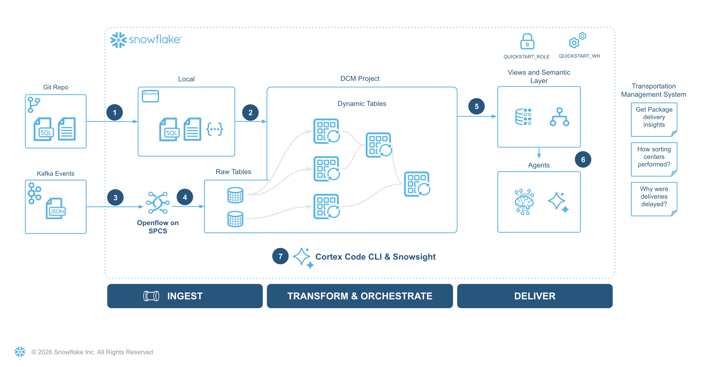

<!-- ------------------------ -->
## Clone the Companion Git Repo

This guide has a companion repository that contains all the code, configuration files, and scripts you'll need. Clone it to your local machine and use it as your working directory throughout the lab.

```bash
git clone https://github.com/Snowflake-Labs/sfguide-build-autonomous-pipelines-for-ai-agents
cd sfguide-build-autonomous-pipelines-for-ai-agents
```

The repository includes the DCM project definitions, Kafka producer/consumer scripts, fraud detection notebook, Cortex Agent SQL, Streamlit app, and helper scripts referenced in each step.

<!-- ------------------------ -->
## Bootstrap the Account

> **Note:** This step has been already completed in your account as part of the Summit provisioning. Run this only if you intend to run the hands-on lab in your own Snowflake account.

Let's create the foundational roles, resources, and network access that the rest of the hands on lab depends on.

Run **1_bootstrap/setup.sql** as **ACCOUNTADMIN** in Snowsight UI.

If you already have Snowflake CLI configured with a connection that uses the ACCOUNTADMIN role for this account:

```bash
source .env
snow sql -f 1_bootstrap/setup.sql -c <connection-name>
```

Here's what the script does:

- Creates a **SUMMIT_ADMIN** role with privileges to create databases, warehouses, roles, integrations, and Openflow deployments
- Grants **SUMMIT_ADMIN** to your current user
- Creates the **DCM_DB** database, **DCM_DB.PROJECTS** schema, and **SUMMIT_WH** warehouse
- Creates a DCM Project object (**DCM_DB.PROJECTS.DCM_PROJECT_DEV**)
- Provisions an Openflow deployment named **SUMMIT_DEPLOYMENT** (this takes 8–10 minutes — start it early)
- Creates a network rule and external access integration for the Kafka broker

> **Note:** The Openflow deployment provisioning runs asynchronously. You can continue with the next steps while it completes. The deployment must be ready before you configure the Openflow connector in Step 4.

Sanity check the run of bootstrap, following objects should be available in the snowflake account:

```sql
show dcm projects in schema dcm_db.projects;
-- DCM_PROJECT_DEV
show openflow deployments like 'summit_deployment';
-- SUMMIT_DEPLOYMENT
show network rules in schema dcm_db.network;
-- REDPANDA_NETWORK_RULE
show integrations like 'summit_eai';
-- SUMMIT_EAI
```

The final query in the script outputs your account identifier and username. You'll need these values for the DCM manifest in the next step:

```sql
SELECT CURRENT_ORGANIZATION_NAME() || '-' || CURRENT_ACCOUNT_NAME() AS account_identifier,
       CURRENT_USER() AS user_name;
```

Copy this value — you'll use them shortly.

<!-- ------------------------ -->
## Set Up Your Environment

Before we start building, let's get your local workspace and Snowflake account configured.

### Python Environment

Create a virtual environment and install the required packages:

```bash
# Verify Python 3.13+ is available
python3 --version  # Must show 3.13 or higher

# If below 3.13, install it first:
#   macOS:  brew install python@3.13
#   Ubuntu: sudo apt install python3.13 python3.13-venv
# Then use the explicit path: /opt/homebrew/bin/python3.13 -m venv .venv

python3 -m venv .venv
source .venv/bin/activate
pip install --upgrade pip
pip install kafka-python-ng python-dotenv snowflake-cli snowflake-connector-python ipykernel
pip install "snowflake-connector-python[pandas]"
```

### Create a Programmatic Access Token (PAT)

Generate a PAT restricted to the `SUMMIT_ADMIN` role. Run this in Snowsight or any authenticated session:

```sql
ALTER USER ADD PAT summit_admin_pat
  DAYS_TO_EXPIRY = 7
  COMMENT = 'PAT for summit quickstart';
```

Copy the `token_secret` from the output — it is only shown once. You will use it as `SNOWFLAKE_PAT` in the next step.

> **Note:** The `SUMMIT_ADMIN` role must already be granted to your user (the bootstrap section does this). If you haven't bootstrapped yet, go to bootstrap section and configure the foundational roles and access for your account.

### Environment Variables

All scripts in this guide read configuration from a `.env` file. Copy the template and fill in your values:

```bash
cp .env.template .env
```

Open `.env` and update the following variables:

| Variable | Description |
|:---------|:------------|
| `SNOWFLAKE_ACCOUNT` | Your account identifier in `ORG-ACCOUNT` format |
| `SNOWFLAKE_USER` | Your Snowflake username |
| `SNOWFLAKE_PAT` | A Programmatic Access Token for authentication |
| `KAFKA_BOOTSTRAP_SERVERS` | Kafka broker address (provided for this lab) |
| `KAFKA_USERNAME` | SASL username for Kafka |
| `KAFKA_PASSWORD` | SASL password for Kafka |

### Configure Snowflake CLI

Run the helper script to set up a named `summit` snow-cli connection using your `.env` values. If asked about password or other parameters, just hit Enter:

```bash
source .env
bash helpers/setup_snow_cli_connection.sh
# if prompted for password or other parameters just hit Enter multiple times
```

The connection was set as default, let's verify it works as expected:

```bash
snow connection list
snow sql -q "SELECT CURRENT_ORGANIZATION_NAME() || '-' || CURRENT_ACCOUNT_NAME() AS account_identifier, CURRENT_USER() AS user_name"
```

You should see a successful connection message with your account and role information. If the connection fails, you will need to run the `bootstrap` and `env setup` sections again.

### Configure Redpanda CLI (rpk)

Let's setup the [Redpanda CLI](https://docs.redpanda.com/current/get-started/rpk-install/) (`rpk`) for topic management.

```bash
# Verify rpk cli is available
rpk --version
```

If you didn't install rpk-cli yet, follow the instruction to set it up:

```bash
brew install redpanda-data/tap/redpanda  # macOS
```

Or for Linux: 

```bash
curl -1sLf 'https://dl.redpanda.com/nzc4ZYQK3WRGd9sy/redpanda/cfg/setup/bash.deb.sh' | sudo -E bash && sudo apt install redpanda
```

Set up an `rpk` profile so you can manage Kafka topics directly:

```bash
source .env
bash helpers/setup_rpk_profile.sh
```

Verify connectivity to the Kafka cluster:

```bash
rpk cluster info
```

You should see broker metadata and cluster information printed to the console.

<!-- ------------------------ -->
## Deploy the DCM Project

Now let's deploy the entire data platform as code. The DCM Project in `2_dcm_project/` defines every object declaratively — databases, schemas, tables, dynamic tables, views, roles, and grants.

### Explore the Project Structure

The project follows this layout:

```console
2_dcm_project/
├── manifest.yml                        # Targets and templating config
├── sources/definitions/
│   ├── database.sql                    # Database, schemas, warehouse
│   ├── roles.sql                       # SUMMIT_DEVELOPER_ROLE, SUMMIT_INGEST_ROLE
│   ├── raw_tables.sql                  # 9 raw tables (change-tracking enabled)
│   ├── transform.sql                   # 14 dynamic tables (2 layers)
│   └── analytics.sql                   # 5 analytics views
└── scripts/
    ├── seed_data.sql                   # Reference + sample data
    ├── post_deploy.sql                 # Openflow runtime creation
    └── tear_down.sql                   # Drop all resources
```

### Update the Manifest

Open **manifest.yml** and update the `account_identifier` field under the `DCM_DEV` target with the value from the bootstrap step:

```yaml
targets:
  DCM_DEV:
    account_identifier: MYORG-MY_STAGE_ACCOUNT   # <-- replace with your value
    project_name: DCM_DB.PROJECTS.DCM_PROJECT_DEV
    project_owner: SUMMIT_ADMIN
    templating_config: DEV
```

The manifest uses Jinja templating with an `env_suffix` variable (`_DEV`, `_STAGE`, `_PROD`) so the same definitions work across environments. For this lab we'll deploy to the `DCM_DEV` target.

### Plan the Deployment

Always run a Plan before deploying. A Plan is a dry-run that shows exactly what DCM will create without executing anything:

```bash
snow dcm plan --target DCM_DEV --from 2_dcm_project
```

You should see planned CREATE operations for a database, 4 schemas, 9 raw tables, 14 dynamic tables, 5 views, a warehouse, 3 roles, and their associated grants. Review the output to confirm everything looks correct.

>**Note**: you can save the output generated after dcm plan using the "--save-output" parameter.

### Deploy

Once the plan looks good, deploy:

```bash
snow dcm deploy --target DCM_DEV --from 2_dcm_project
```

DCM creates all objects using the **SUMMIT_ADMIN** role. The deployment should complete in under a minute.

### Post-Deploy: Create the Openflow Runtime

The Openflow runtime runs inside the deployed database but requires the deployment to be ready first. Create it with the post-deploy script:

```bash
snow sql -f 2_dcm_project/scripts/post_deploy.sql \
  --variable "env_suffix=_DEV" --enable-templating JINJA
```

Here's what this does:

- Grants usage on the Openflow deployment to **SUMMIT_ROLE_DEV**
- Creates an Openflow runtime named **SUMMIT_RUNTIME** in `SUMMIT_DB_DEV.OPENFLOW`
- Attaches the external access integration for Kafka network access
- Grants USAGE and OPERATE on the runtime to **SUMMIT_ROLE_DEV**


### Post-Deploy: Seed initial data

With the infrastructure deployed, let's populate the initial reference data.

The seed script inserts reference data (locations, customers, shipping products) and one complete end-to-end order example:

```bash
snow sql -f 2_dcm_project/scripts/seed_data.sql \
  --variable "env_suffix=_DEV" --enable-templating JINJA
```

Here's what gets loaded:

- **20 European logistics locations** — hubs, warehouses, offices, and pickup points across 15 countries
- **50 customers** — a mix of companies and individuals
- **8 shipping products** — standard, express, economy, and envelope services
- **1 sample order** — a complete lifecycle from Schneider Electronics (Berlin) to Marie Dupont (Paris), including order items, payment, package, 7 tracking events, and delivery

### Explore the Data model

You can now open a workspace sql file and explore the created objects. There is only 1 Order at the moment, but we will start streaming soon.

```sql
USE ROLE SUMMIT_ADMIN;
USE WAREHOUSE SUMMIT_WH;
USE DATABASE SUMMIT_DB_DEV;
USE SCHEMA RAW;

SHOW TABLES;

SELECT * FROM CUSTOMERS ORDER BY 1;
SELECT * FROM ORDERS ORDER BY 1;
SELECT * FROM PAYMENTS ORDER BY 1;
SELECT * FROM PACKAGES ORDER BY 1;
SELECT * FROM TRACKING_EVENTS ORDER BY 1;
```

In the RAW schema you will see the following data model:

```
┌─────────────────┐       ┌──────────────────────┐
│   CUSTOMERS     │       │  SHIPPING_PRODUCTS   │
│─────────────────│       │──────────────────────│
│ customer_id PK  │       │ product_id PK        │
│ customer_type   │       │ name                 │
│ first_name      │       │ service_type         │
│ last_name       │       │ zone                 │
│ company_name    │       │ base_price           │
│ email           │       │ max_weight/dims      │
│ city, country   │       │ estimated_days       │
└────────┬────────┘       └──────────┬───────────┘
         │ 1:N                       │ 1:N
         ▼                           ▼
┌──────────────────────────────────────────────┐
│                  ORDERS                      │
│──────────────────────────────────────────────│
│ order_id PK                                  │
│ customer_id FK ──► CUSTOMERS                 │
│ origin_location_id FK ──► LOCATIONS          │
│ pickup_address/city/country                  │
│ destination_address/city/country             │
│ total_amount, currency                       │
└───────┬──────────────────────────┬───────────┘
        │ 1:N                      │ 1:1
        ▼                          ▼
┌─────────────────────────┐       ┌─────────────────────────┐
│  ORDER_ITEMS            │       │       PAYMENTS          │
│─────────────────────────│       │─────────────────────────│
│ order_item_id PK        │       │ payment_id PK           │
│ order_id FK ─► ORDERS   │       │ order_id FK ──► ORDERS  │
│ product_id FK ─►        │       │ payment_method          │
│   SHIPPING_PRODUCTS     │       │ card_last_four/brand    │
│ quantity                │       │ card_country            │
│ declared_contents       │       │ billing_addr/city/ctry  │
│ declared_value          │       │ ip_address              │
│ insurance_opted         │       │ device_fingerprint      │
└────────┬────────────────┘       └─────────────────────────┘
         │ 1:1                        ▲ fraud detection
         ▼
┌─────────────────────────┐     ┌────────────────────┐
│     PACKAGES            │     │   LOCATIONS        │
│─────────────────────────│     │────────────────────│
│ package_id PK           │     │ location_id PK     │
│ order_item_id FK ──►    │     │ name               │
│   ORDER_ITEMS           │     │ type (HUB/WH/      │
│ order_id FK ──► ORDERS  │     │   OFFICE/PICKUP)   │
│ tracking_number         │     │ city, country      │
│ actual_weight_kg        │     │ lat, lng           │
│ status                  │     │ capacity           │
└───────┬─────────────────┘     └─────┬──────────────┘
        │ 1:N                         │ 1:N
        ▼                             │
┌──────────────────────┐              │
│  TRACKING_EVENTS     │              │
│──────────────────────│              │
│ event_id PK          │              │
│ package_id FK ─► PKG │              │
│ location_id FK ──────┼──────────────┘
│ event_timestamp      │
│ event_type           │
│ carrier              │
└───────┬──────────────┘
        │ 1:1
        ▼
┌──────────────────────┐
│    DELIVERIES        │
│──────────────────────│
│ delivery_id PK       │
│ package_id FK ─► PKG │
│ driver_name          │
│ actual_delivery_date │
│ signature_collected  │
│ status               │
└──────────────────────┘

Flow: CUSTOMER ─► ORDER ─► ORDER_ITEMS ─► PACKAGES ─► TRACKING_EVENTS ─► DELIVERIES
                    │                                        │
                    └──► PAYMENT                             └──► LOCATIONS
```

<!-- ------------------------ -->
## Start streaming from Kafka

Now that we have the RAW zone deployed, and all tables are in place, let's configure and start streaming data from Kafka topics.

### Create Kafka Topics

> **Note:** If you're using the provided Kafka cluster for this lab, topics are already created and data is streaming. You can skip topic creation and the producer setup step below. Jump directly to the consumer testing.

If you're using your own Kafka cluster, you can create the topics the producer needs like this:

```bash
source .env
for suffix in orders order-items payments packages tracking-events deliveries; do
  rpk topic create "${KAFKA_TOPIC_PREFIX}-${suffix}"
done
```

Let's list the topics we have access to:

```bash
rpk topic list
```

You should see 6 topics listed: `tms-orders`, `tms-order-items`, `tms-payments`, `tms-packages`, `tms-tracking-events`, and `tms-deliveries`.

### Test the Producer (Dry Run)

Before pushing data to Kafka, verify the producer generates valid data by running it in dry-run mode:

```bash
python3 3_generate/tms_producer.py --dry-run --count 1
```

You should see a single order printed to stdout with all its associated events (order items, payment, packages, tracking events, deliveries) as JSON messages.

> **Note:** The Kafka cluster provided for this lab is already producing events — you do not need to run the producer yourself. If you are using your own cluster, run the producer script to generate events and publish them to the Kafka topics.

### Run the Producer

Now push some orders to Kafka:

```bash
python3 3_generate/tms_producer.py --count 5 --delay 1
```

On startup, the producer reads the last order ID from `.tms_producer_state.json` and resumes from that point, preventing duplicate messages from being sent to Kafka.

Each order generates approximately 15-17 messages across the 6 topics. The producer prints a summary for each order:

```text
[1/5] order=ORD-00002 | items=2 | events=12 | msgs=17
[2/5] order=ORD-00003 | items=1 | events=8 | msgs=15
...

Done. Produced 5 orders (82 total messages).
```

### Verify with the Consumer

Optionally, verify that messages are flowing into Kafka by running the consumer. By default it runs in dry-run mode and does not commit offsets, so you can safely inspect messages without affecting your consumer group state. Pass `--commit` to persist offsets.

```bash
python3 3_generate/tms_consumer.py --from-beginning
```

You should see formatted JSON messages from all 6 topics. Press `Ctrl+C` to stop.

<!-- ------------------------ -->
## Configure the Openflow Connector

Now let's configure Openflow to continuously stream data from Kafka into the **RAW** schema. Openflow runs inside Snowflake and provides a visual flow-based interface for data ingestion.


### Create a new Flow

Using the `SUMMIT_ADMIN` Role, Open the Openflow runtime in Snowsight, by Nagivating to **Ingestion > OPENFLOW > Launch Openflow > Login to Control Plane**). You should see the Runtime that was created by the DCM project post-deploy script:

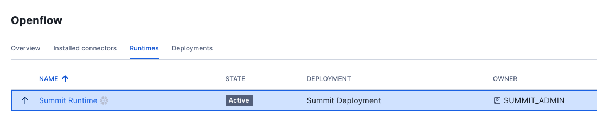

Click on the `Summit Runtime` to open the canvas.

>**Note** An error will occur if you try to open the canvas using the ACCOUNTADMIN Role. Make sure that you log out from Openflow, Set your Default Role to SUMMIT_ADMIN in Snowsight and Launch Openflow again.

In the canvas drag-and-drop **Import from Registry** → and choose the flow **kafka-json-sasl-topic2table-schemaev**, and Click Import.

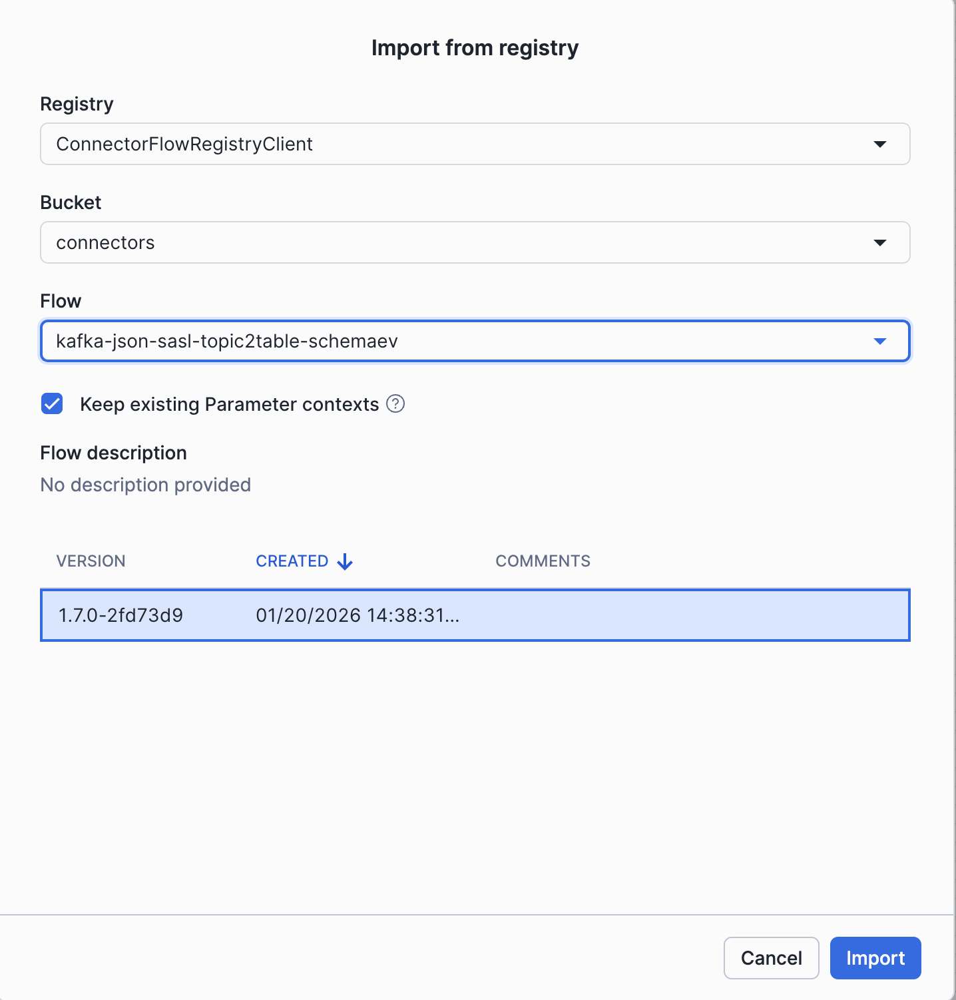

### Configure Flow Parameters

Right-click on the `Process Group` and update the 3 parameter contexts:

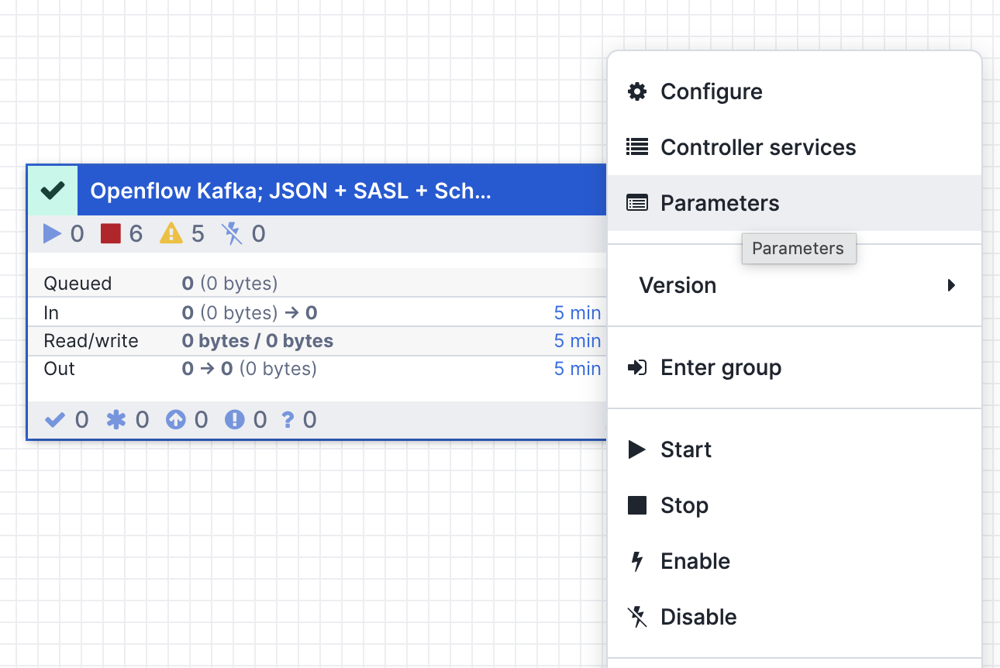

**Source Parameters:**

| Parameter | Value |
|:----------|:------|
| Kafka Bootstrap Servers | `<KAFKA_BOOTSTRAP_SERVERS>` |
| Kafka SASL Username | `<KAFKA_USERNAME>` |
| Kafka SASL Password | `<KAFKA_PASSWORD>` |
| Kafka Security Protocol | `SASL_SSL` |
| Kafka SASL Mechanism | `SCRAM-SHA-256` |

**The Source parameters**: add your Kafka broker, SASL username/password, use SASL_SSL as security protocol - these are all inside your `.env` file

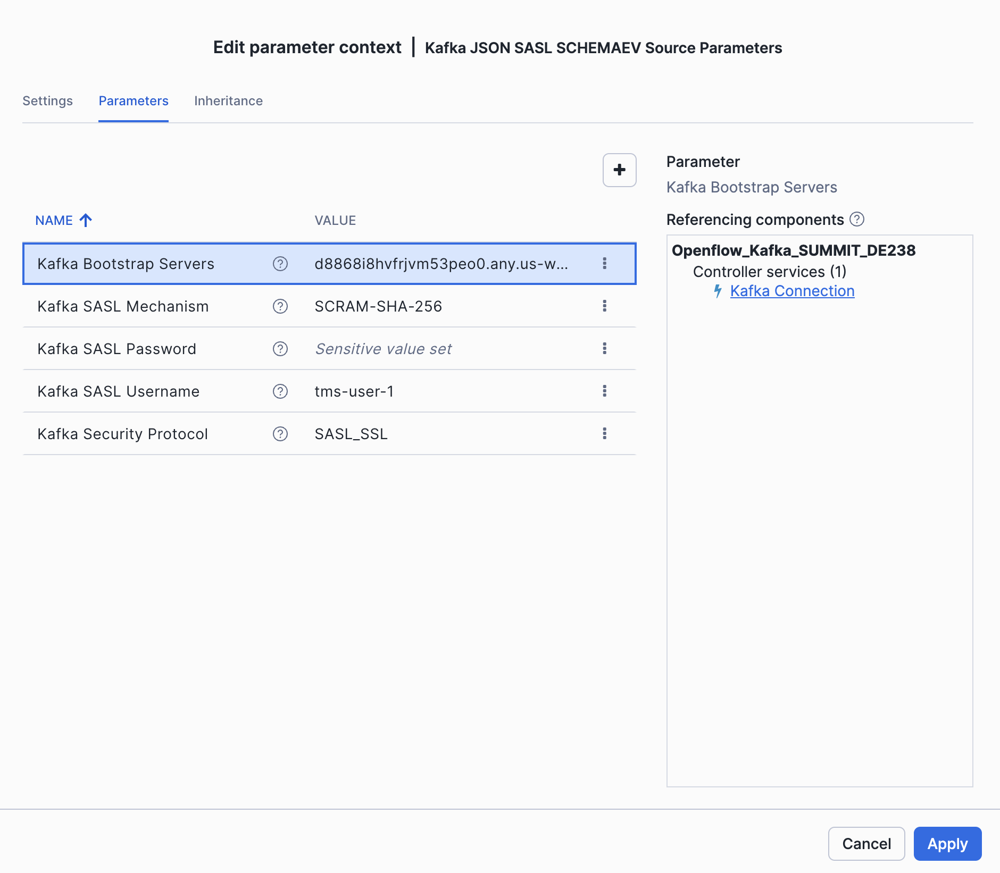

**Destination Parameters:**

| Parameter | Value |
|:----------|:------|
| Destination Database | `SUMMIT_DB_DEV` |
| Destination Schema | `RAW` |
| Snowflake Role | `SUMMIT_INGEST_ROLE_DEV` |
| Snowflake Authentication Strategy | `SNOWFLAKE_MANAGED` |

**The Destination parameters**: Database `SUMMIT_DB_DEV`, schema `RAW`, role `SUMMIT_INGEST_ROLE_DEV`, use `SNOWFLAKE_MANAGED` authentication

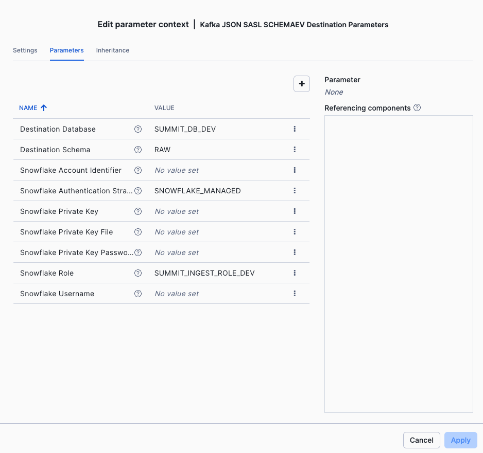

**Ingestion Parameters:**

| Parameter | Value |
|:----------|:------|
| Kafka Topics | `tms-.*` |
| Kafka Topic Format | `pattern` |
| Kafka Group Id | `<KAFKA_USERNAME>-group` |
| Kafka Auto Offset Reset | `ealiest` |

**Ingestion parameters**: update topic format to `pattern`, use pattern `tms-.*` for reading all topics starting with tms-, the consumer group is your `KAFKA_USERNAME` with `-group` suffix (e.g. tms-user-1-group)

Deselect **Show Inherited Parameters** to show only the Ingestion parameters.

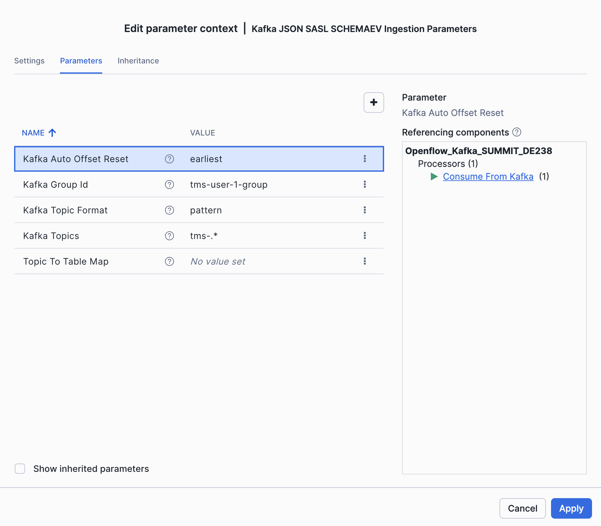


**Map Topic to Table names:** Update the Topic to Table mapping processor, by double chicking on the **main processor group**, and navigate to `Map Topic to Table` processor, the regex will remove the topic prefix and transform topic names to snowflake table names. For example the data from topic `order-items` will be mapped to snowflake table `ORDER_ITEMS`.

```
${kafka.topic:substringAfter('tms-'):replace('-', '_'):toUpper()}
```

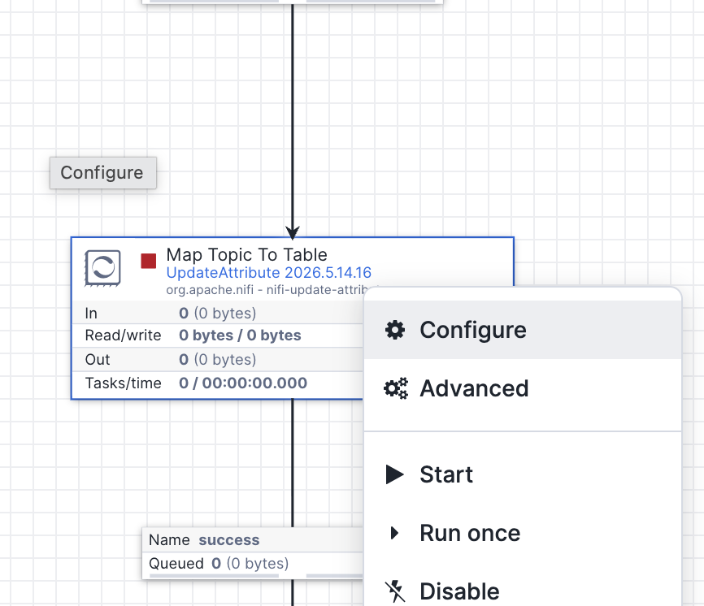

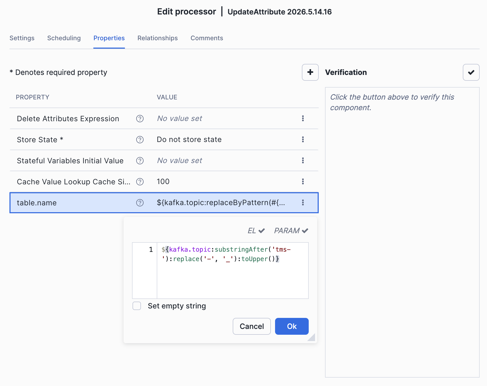

### Check flow parameters fits the Kafka cluster endpoint

Before starting the flow, verify that the Kafka broker address in your flow parameters matches the endpoint allowed by the Snowflake network rule. If these don't match, Openflow won't be able to reach Kafka.

**1. Check the actual broker endpoints from your Kafka cluster:**

```bash
rpk cluster info
```

Note the broker addresses in the output (e.g., `***.any.us-west-2.mpx.prd.cloud.redpanda.com:9092`).

**2. Check what the Snowflake network rule allows:**

```sql
USE ROLE SUMMIT_ADMIN;
DESCRIBE INTEGRATION SUMMIT_EAI;
DESCRIBE NETWORK RULE DCM_DB.NETWORK.REDPANDA_NETWORK_RULE;
```

The `VALUE_LIST` column shows the allowed host:port entries. The broker addresses from `rpk cluster info` must be covered by this list.

**3. Verify they match:**

The bootstrap URL in your Openflow Source Parameters (e.g., `***.any.us-west-2.mpx.prd.cloud.redpanda.com:9092`) should resolve to brokers listed in the network rule. If your cluster has different broker IDs or the network rule is outdated, update the network rule:

```sql
ALTER NETWORK RULE DCM_DB.NETWORK.REDPANDA_NETWORK_RULE
  SET VALUE_LIST = (
    '<bootstrap-server>:9092',
    '<broker-1>:9092',
    '<broker-2>:9092',
    '<broker-3>:9092'
  );
```

> **Tip:** The bootstrap server uses the `.any.` subdomain which load-balances across brokers. The network rule must include both the bootstrap address and all individual broker addresses returned by `rpk cluster info`.


### Start the Flow

Now that we have the flow configured, let's start streaming.

1. Enable all controller services by right-click on the main process group

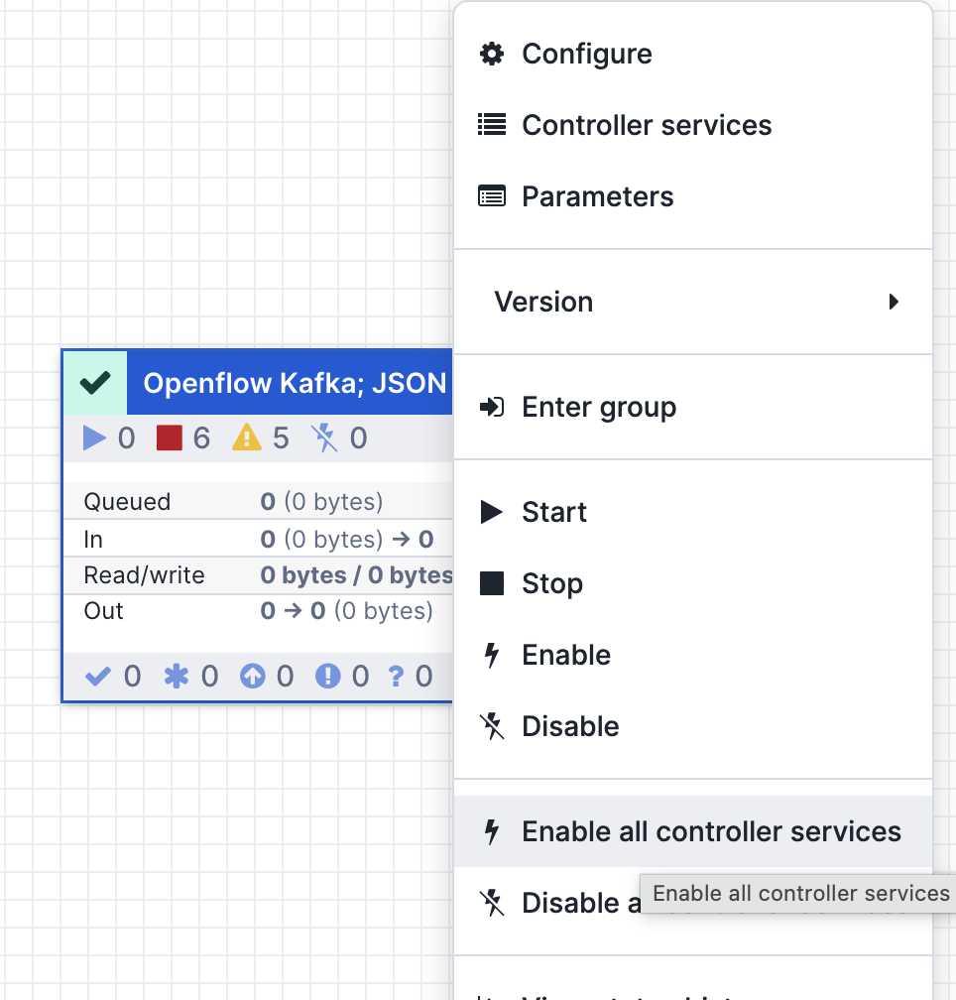

2. Right-click again on the main processor group and click **Start**

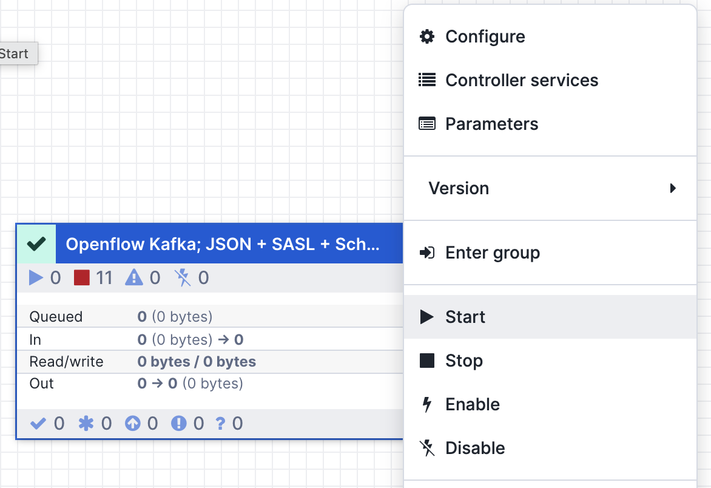

You should see data flowing through the connector. The flow counters in the Openflow UI will show bytes and records being processed.

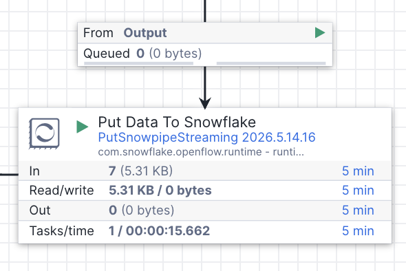

### (Optionally) Import an existing Flow

 In the [`4_openflow/Openflow_Kafka_SUMMIT_DE238.json`](4_openflow/Openflow_Kafka_SUMMIT_DE238.json) you can find an example flow, that can be imported in case you get into configuration problems. 

You drag-and-drop a new `Processor Group` in the main canvas, and import the file as in the screen bellow.

This flow already has all parameters pre-configured. You only need to set the Kafka related parameters in the source parameter group (`KAFKA_USERNAME`, `KAFKA_PASSWORD`, `KAFKA_BROKERS`) and the ingestion parameter group (`KAFKA_USERNAME-GROUP`).

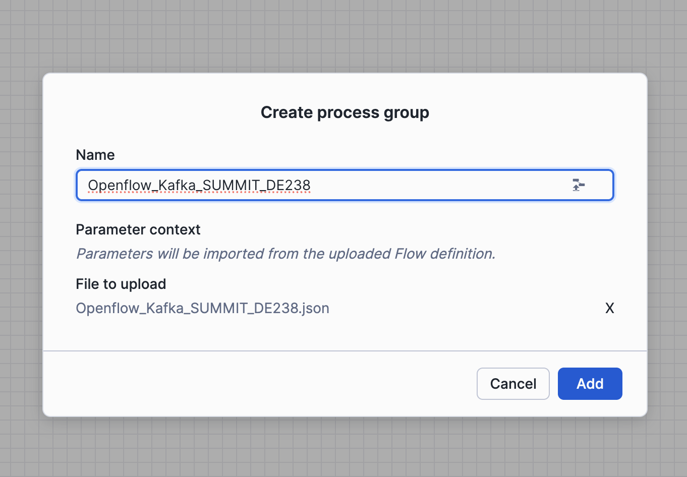

Now you can **Enable Controller Services** and **Start** the Flow.


### Verify Data in Snowflake

After a few moments, check that data is landing in the RAW schema:

```sql
USE ROLE SUMMIT_DEVELOPER_ROLE_DEV;
USE WAREHOUSE SUMMIT_WH_DEV;
USE SCHEMA SUMMIT_DB_DEV.RAW;

SELECT 'ORDERS' AS table_name, COUNT(*) AS row_count FROM ORDERS
UNION ALL SELECT 'ORDER_ITEMS', COUNT(*) FROM ORDER_ITEMS
UNION ALL SELECT 'PAYMENTS', COUNT(*) FROM PAYMENTS
UNION ALL SELECT 'PACKAGES', COUNT(*) FROM PACKAGES
UNION ALL SELECT 'TRACKING_EVENTS', COUNT(*) FROM TRACKING_EVENTS
UNION ALL SELECT 'DELIVERIES', COUNT(*) FROM DELIVERIES;
```

You should see row counts increasing as data streams in from Kafka.

<!-- ------------------------ -->
## Explore the Dynamic Tables

With data flowing into RAW, the Dynamic Tables in the **TRANSFORM** schema automatically refresh on a 1-minute target lag. The pipeline uses a two-layer architecture: Layer 1 cleans and deduplicates raw data, and Layer 2 builds analytic aggregations on top.

### Layer 1: Clean Tables

The first layer applies deduplication, TRIM on strings, and UPPER on status/type fields. For example, here's the clean customers table:

```sql
-- DT_CLEAN_CUSTOMERS: deduplicates by CUSTOMER_ID, trims strings, normalizes types
SELECT
    CUSTOMER_ID,
    UPPER(TRIM(CUSTOMER_TYPE)) AS CUSTOMER_TYPE,
    TRIM(FIRST_NAME) AS FIRST_NAME,
    TRIM(LAST_NAME) AS LAST_NAME,
    TRIM(COMPANY_NAME) AS COMPANY_NAME,
    TRIM(EMAIL) AS EMAIL,
    TRIM(CITY) AS CITY,
    TRIM(COUNTRY) AS COUNTRY,
    COALESCE(UPPER(TRIM(ACCOUNT_STATUS)), 'ACTIVE') AS ACCOUNT_STATUS,
    CREATED_AT
FROM SUMMIT_DB_DEV.RAW.CUSTOMERS
QUALIFY ROW_NUMBER() OVER (PARTITION BY CUSTOMER_ID ORDER BY CUSTOMER_ID) = 1;
```

There are 9 clean dynamic tables total — one for each RAW table. They all use the same pattern: deduplicate on the primary key, trim strings, and standardize categorical values with UPPER.

### Layer 2: Analytic Tables

The second layer builds business-ready aggregations by joining across the clean tables. Let's examine each one.

**DT_ORDER_SUMMARY** — A denormalized view of every order with customer info, item counts, package counts, and delivery status:

```sql
USE SCHEMA SUMMIT_DB_DEV.TRANSFORM;

SELECT * 
FROM DT_ORDER_SUMMARY 
ORDER BY ORDER_DATE DESC LIMIT 10;
```

You should see columns like `CUSTOMER_NAME`, `ORDER_STATUS`, `TOTAL_ITEMS`, `TOTAL_PACKAGES`, `ORDER_VALUE`, and `DAYS_SINCE_ORDER`.

**DT_PACKAGE_TRACKING** — Package-level tracking showing transit progress, hubs visited, and transit hours:

```sql
SELECT PACKAGE_ID, TRACKING_NUMBER, PACKAGE_STATUS, HUBS_VISITED, TRANSIT_HOURS, CARRIER
FROM DT_PACKAGE_TRACKING
ORDER BY FIRST_SCAN DESC LIMIT 10;
```

**DT_PACKAGE_HOPS** — The hop-by-hop journey of every package through the logistics network:

```sql
SELECT TRACKING_NUMBER, HOP_NUMBER, LOCATION_NAME, LOCATION_CITY, EVENT_TYPE, 
       MINUTES_SINCE_PREV_HOP, CUMULATIVE_MINUTES
FROM DT_PACKAGE_HOPS
WHERE TRACKING_NUMBER = 'TMS-2025-000001'
ORDER BY HOP_NUMBER;
```

You should see the sample order's journey: Berlin Central Hub → Frankfurt Airport Hub → Paris North Hub → delivered.

**DT_LOCATION_ACTIVITY** — Daily throughput and dwell-time percentiles for each logistics location:

```sql
SELECT LOCATION_NAME, LOCATION_TYPE, CITY, ACTIVITY_DATE,
       NUM_PACKAGES, PACKAGES_ARRIVED, PACKAGES_DEPARTED,
       PROCESSING_P75_MINUTES, PROCESSING_P90_MINUTES
FROM DT_LOCATION_ACTIVITY
ORDER BY ACTIVITY_DATE DESC, NUM_PACKAGES DESC
LIMIT 10;
```

**DT_FRAUD_DETECTION** — Payment fraud scoring (we'll populate this in the next step):

```sql
SELECT COUNT(*) AS fraud_results FROM DT_FRAUD_DETECTION;
```

This table will be empty until we run the fraud detection pipeline in the next step.

### Check Dynamic Table Health

Verify all dynamic tables are refreshing properly:

```sql
SHOW DYNAMIC TABLES IN SCHEMA SUMMIT_DB_DEV.TRANSFORM;
```

Look at the `scheduling_state` column — all tables should show `ACTIVE`. The `last_completed_time` column shows when each table last refreshed.

<!-- ------------------------ -->
## Run AI-Powered Fraud Detection

The fraud detection pipeline uses heuristic scoring to identify suspicious payments. In production, this would run continuously as a Cortex AI function; for this lab, we'll run it as a batch process that scores payments and writes results to the **FRAUD_DETECTION_RESULTS** table.

### Understanding the Fraud Signals

The fraud detector evaluates 6 independent signals for each payment:

| Signal | Weight | Trigger |
|:-------|:-------|:--------|
| `billing_country_mismatch` | +0.35 | Billing country ≠ customer country |
| `card_country_mismatch` | +0.30 | Card issuing country ≠ customer country |
| `ip_geolocation_mismatch` | +0.25 | IP prefix doesn't match customer country |
| `known_fraud_device` | +0.40 | Device fingerprint in known-fraud pool |
| `velocity_abuse` | +0.30 | 5+ payments from same customer in 5 minutes |
| `high_declared_value` | +0.20 | Total declared value > EUR 20,000 |

A payment is flagged as fraudulent when its combined score reaches 0.30 or higher.

### Run the Fraud Producer

>**Note:** We are generating fraud payments already in the provided Kafka Cluster. Run this only if you are using your own Kafka Cluster.

Let's produce some orders with a higher fraud rate to see the detector in action:

```bash
source .env
python3 3_generate/tms_producer.py --count 50 --delay 0.5 --fraud-rate 0.10
```

This generates 50 orders with a 10% fraud rate, meaning roughly 5 orders will have deliberately fraudulent payment patterns injected by the producer.

### Score Payments Using the Notebook

Open the [`5_fraud_detection/fraud_detection_notebook.ipynb`](5_fraud_detection/fraud_detection_notebook.ipynb) notebook in Snowflake Notebooks or your local Jupyter environment.

**Snowflake Notebooks setup:** When you create or import the notebook in Snowsight (Projects → Workspaces → Upload Files), you'll need to configure your default compute service:

- **Service Name**: `USER_SERVICE`
- **Service Settings**: `SYSTEM_COMPUTE_POOL_CPU (CPU_X64_S)`

Click **Create and Connect**. Wait for Connection to be established, it should not take more than 1 minute.

On the top right choose your running Role and Warehouse:

- **Role**: `SUMMIT_DEVELOPER_ROLE_DEV`
- **Warehouse**: Select `SUMMIT_WH_DEV`

Enable the current session credentials by updating the first Cell, comment lines 8-10 with Local setup, uncomment the lines 13-14 with snowsight setup.

```python
# If running in Snowsight Workspace, use the block below
session = get_active_session()
conn = session.connection
```


**Local Jupyter setup:** If you prefer to run the notebook locally:

```bash
source .venv/bin/activate
```

Update first Cell, and enable the line 8-10 with Local setup, comment the lines 13-14 with snowsight setup.

```python
# If running locally, use the block below
conn = snowflake.connector.connect(
    connection_name="summit"
)
```


Then open the notebook in VS Code or Jupyter Lab, select the **.venv/bin/python** kernel, and run all cells. The notebook connects to Snowflake using the `summit` named connection from your Snowflake CLI config:


Make sure you've already run `bash helpers/setup_snow_cli_connection.sh` (from the environment setup step) so the `summit` connection exists and is configured with your PAT.

#### What the notebook does

1. Reads unscored payments from `SUMMIT_DB_DEV.TRANSFORM.DT_CLEAN_PAYMENTS`
2. Joins with order and customer data for context
3. Runs each payment through the 6-signal heuristic fraud scorer
4. Writes scored results to `SUMMIT_DB_DEV.TRANSFORM.FRAUD_DETECTION_RESULTS`
5. **AI Enrichment** — uses Cortex AI to classify and explain each flagged payment:
   - `AI_CLASSIFY` assigns a fraud type (`identity_theft`, `card_testing`, `account_takeover`, `synthetic_identity`, or `friendly_fraud`)
   - `AI_COMPLETE` (mistral-large2) generates a 2–3 sentence natural language explanation of why the payment is fraudulent
6. Updates the results table with `FRAUD_TYPE` and `EXPLANATION` columns

After running the notebook, verify fraud detections:

```sql
USE ROLE SUMMIT_DEVELOPER_ROLE_DEV;
USE SCHEMA SUMMIT_DB_DEV.TRANSFORM;

SELECT COUNT(*) AS total_scored,
       SUM(CASE WHEN IS_FRAUD THEN 1 ELSE 0 END) AS flagged_fraud,
       ROUND(AVG(FRAUD_SCORE), 3) AS avg_score
FROM FRAUD_DETECTION_RESULTS;
```

### Explore the AI-Enriched Fraud Results

Check the AI-classified fraud types and explanations:

```sql
SELECT PAYMENT_ID, FRAUD_SCORE, FRAUD_TYPE, EXPLANATION
FROM FRAUD_DETECTION_RESULTS
WHERE IS_FRAUD = TRUE
ORDER BY FRAUD_SCORE DESC LIMIT 5;
```

You should see each flagged payment classified into a fraud type (e.g., `identity_theft` for geographic mismatches, `card_testing` for known fraud devices) with a natural language explanation.

### Explore the Fraud Detection Dynamic Table

The **DT_FRAUD_DETECTION** dynamic table automatically enriches the raw fraud results with payment details, customer information, and order context:

```sql
SELECT CUSTOMER_NAME, CUSTOMER_COUNTRY, PAYMENT_METHOD, CARD_BRAND,
       CARD_COUNTRY, BILLING_COUNTRY, PAYMENT_AMOUNT,
       FRAUD_SCORE, IS_FRAUD, FRAUD_SIGNALS, FRAUD_TYPE, EXPLANATION
FROM SUMMIT_DB_DEV.TRANSFORM.DT_FRAUD_DETECTION
WHERE IS_FRAUD = TRUE
ORDER BY FRAUD_SCORE DESC
LIMIT 10;
```

You should see flagged payments with their triggered signals (e.g., `billing_country_mismatch`, `known_fraud_device`), AI-classified fraud type, and a human-readable explanation of why the payment was flagged.

<!-- ------------------------ -->
## Query the Analytics Layer

The **ANALYTICS** schema provides clean views on top of the transform layer. These are the consumer-facing objects designed for dashboards, analysts, and Cortex Agents.

```sql
USE ROLE SUMMIT_DEVELOPER_ROLE_DEV;
USE SCHEMA SUMMIT_DB_DEV.ANALYTICS;

SHOW VIEWS;
```

### Order Summary

Get a high-level view of all orders:

```sql
SELECT ORDER_ID, CUSTOMER_NAME, ORDER_DATE, ORDER_STATUS,
       DESTINATION_CITY, TOTAL_ITEMS, ORDER_VALUE, DAYS_SINCE_ORDER
FROM ORDER_SUMMARY
WHERE ORDER_STATUS = 'DELIVERED'
ORDER BY ORDER_DATE DESC
LIMIT 20;
```

### Package Tracking

Track packages in transit:

```sql
SELECT TRACKING_NUMBER, CUSTOMER_NAME, DESTINATION_CITY,
       PACKAGE_STATUS, HUBS_VISITED, TRANSIT_HOURS, CARRIER
FROM PACKAGE_TRACKING
WHERE PACKAGE_STATUS != 'DELIVERED'
ORDER BY FIRST_SCAN DESC;
```

### Fraud Alerts

Surface high-risk payments for review:

```sql
SELECT CUSTOMER_NAME, PAYMENT_AMOUNT, FRAUD_SCORE, FRAUD_SIGNALS,
       CARD_COUNTRY, BILLING_COUNTRY, CUSTOMER_COUNTRY
FROM FRAUD_DETECTION
WHERE IS_FRAUD = TRUE
ORDER BY PAYMENT_TIMESTAMP DESC;
```

### Location Performance

Identify bottleneck locations by processing time:

```sql
SELECT LOCATION_NAME, LOCATION_TYPE, CITY, COUNTRY,
       NUM_PACKAGES, PROCESSING_P90_MINUTES
FROM LOCATION_ACTIVITY
WHERE ACTIVITY_DATE = CURRENT_DATE()
ORDER BY PROCESSING_P90_MINUTES DESC
LIMIT 10;
```

These views are ready to be consumed by a Cortex Agent — the agent can query them using natural language to answer questions like "Which packages are delayed?", "Show me today's fraud alerts", or "What's the busiest hub right now?"


<!-- ------------------------ -->
## Create Semantic View using Cortex Code

A semantic view defines the business meaning of your data — dimensions, metrics, relationships, and verified queries — so that Cortex Analyst and Cortex Agents can answer natural language questions accurately.

We'll use **Cortex Code** to generate the semantic view SQL from a natural language prompt, then deploy it.

> **Important:** The semantic view must be created using the `SUMMIT_ADMIN` role (which owns the `ANALYTICS` schema). If you're running in a Snowsight worksheet, run `USE ROLE SUMMIT_ADMIN;` first. The `snow sql` CLI command already uses this role via your `summit` connection.

### The Prompt

Open Cortex Code (in Snowsight or the Cortex Code CLI) and paste the following prompt from [`6_cortex-agent/create_semantic_view_prompt.txt`](6_cortex-agent/create_semantic_view_prompt.txt):

```text
Create a semantic view named SUMMIT_DB_DEV.ANALYTICS.TMS_SEMANTIC_VIEW over the following views
in the ANALYTICS schema of SUMMIT_DB_DEV:

- ORDER_SUMMARY
- PACKAGE_TRACKING
- PACKAGE_HOPS
- LOCATION_ACTIVITY
- FRAUD_DETECTION

Requirements:
1. Add meaningful descriptions to the semantic view itself and to every table, column, dimension,
   and metric so that Cortex Analyst understands the business context of a Transportation
   Management System (TMS) for a pan-European shipping company.
2. Define appropriate relationships (joins) between the tables based on shared keys (ORDER_ID,
   PACKAGE_ID, CUSTOMER_NAME, etc.).
3. Add at least 3 verified queries (examples) that demonstrate how to use the semantic view.

Rules:
Start the SQL file with `USE ROLE SUMMIT_ADMIN;` and `USE WAREHOUSE SUMMIT_WH_DEV;`.
Create only a SQL file and save it locally.
Use the local repository to get information about schema objects.
Do not try to run snowflake statements. Do not run the SQL yet.
```

Cortex Code will generate a `CREATE SEMANTIC VIEW` statement with tables, relationships, dimensions, metrics, facts, verified queries, and AI generation/categorization hints.

### The Generated SQL

Explore the generated SQL. There is one for backup here as well [`6_cortex-agent/create_semantic_view.sql`](6_cortex-agent/create_semantic_view.sql). Here are the key elements:

**Tables** — Maps 5 analytics views with primary keys, synonyms, and business descriptions:

```sql
TABLES (
    order_summary AS SUMMIT_DB_DEV.ANALYTICS.ORDER_SUMMARY
      PRIMARY KEY (ORDER_ID)
      WITH SYNONYMS ('orders', 'shipments', 'order details')
      COMMENT = 'Denormalized order view with customer info, item counts, ...',
    package_tracking AS SUMMIT_DB_DEV.ANALYTICS.PACKAGE_TRACKING
      PRIMARY KEY (PACKAGE_ID) ...,
    package_hops AS SUMMIT_DB_DEV.ANALYTICS.PACKAGE_HOPS ...,
    location_activity AS SUMMIT_DB_DEV.ANALYTICS.LOCATION_ACTIVITY ...,
    fraud_detection AS SUMMIT_DB_DEV.ANALYTICS.FRAUD_DETECTION ...
)
```

**Relationships** — Defines joins between tables:

```sql
RELATIONSHIPS (
    package_tracking_to_orders AS
      package_tracking (ORDER_ID) REFERENCES order_summary,
    package_hops_to_tracking AS
      package_hops (PACKAGE_ID) REFERENCES package_tracking,
    fraud_to_orders AS
      fraud_detection (ORDER_ID) REFERENCES order_summary
)
```

**Dimensions** — Business attributes like `CUSTOMER_NAME`, `ORDER_STATUS`, `CARRIER`, `IS_FRAUD`, `FRAUD_SIGNALS`, each with synonyms and descriptions.

**Metrics** — Aggregations like `total_orders`, `avg_transit_hours`, `total_fraud_flagged`, `total_fraud_amount`, each with formulas and descriptions.

**Verified Queries** — 3 pre-verified queries that serve as examples for Cortex Analyst:
- "Which packages are currently in transit and how many hubs have they visited?"
- "Show me the top 5 locations with the highest P90 processing time today"
- "List all fraudulent payments detected in the last 7 days"

**AI Hints** — `AI_SQL_GENERATION` and `AI_QUESTION_CATEGORIZATION` clauses that guide the LLM on date handling, status filtering, and topic boundaries.

### Validate semantic view before execution

You can ask Cortex Code to validate the semantic view before execution and fix errors if possible:

```text
Validate the semantic view SQL syntax by compiling it against Snowflake before execution
```

### Deploy the Semantic View

Run the SQL file:

```bash
snow sql -f 6_cortex-agent/create_semantic_view.sql
```

Verify it was created:

```sql
USE ROLE SUMMIT_ADMIN;
SHOW SEMANTIC VIEWS IN SCHEMA SUMMIT_DB_DEV.ANALYTICS;
```

### Test the Semantic View

Verify the semantic view was created and inspect its structure:

```sql
DESCRIBE SEMANTIC VIEW SUMMIT_DB_DEV.ANALYTICS.TMS_SEMANTIC_VIEW;
```

You can test it as well using Cortex Code:

```text
Test the 3 onboarding queries in TMS_SEMANTIC_VIEW to verify Cortex can resolve dimensions and metrics correctly
```

To test it interactively, open **Snowflake Intelligence** in Snowsight (AI & ML → Cortex Agents) and create a new conversation using the `TMS_SEMANTIC_VIEW` as the data source. Try asking: "Which packages are currently in transit?"

Alternatively, you can test it in the next step by deploying the Cortex Agent, which uses this semantic view under the hood.

<!-- ------------------------ -->
## Create a Cortex Agent

Now let's create a conversational agent that uses the semantic view to answer questions in natural language. The agent will serve as the "Talk-to-your-data" interface for EuroShip Logistics operations teams.

### The Prompt

Open Cortex Code and use the prompt from [`6_cortex-agent/create_agent_prompt.txt`](6_cortex-agent/create_agent_prompt.txt):

```text
Create a Cortex Agent named SUMMIT_DB_DEV.ANALYTICS.TMS_AGENT that uses the semantic view SUMMIT_DB_DEV.ANALYTICS.TMS_SEMANTIC_VIEW as its data source.

Requirements:
1. The agent should be able to answer natural language questions about the TMS (Transportation Management System) data: orders, package tracking, logistics hub performance, and fraud detection.
2. Give the agent a clear description and instructions so it understands it serves a pan-European shipping company called EuroShip Logistics.
3. The agent should respond concisely and include relevant data in its answers.

After creating the agent, provide 3 example prompts to demonstrate how to use it:
- "Which packages are currently delayed and where are they stuck?"
- "What is our fraud detection rate this week compared to last week?"
- "Show me the busiest hubs today and their average processing times"

Rules:
Create only a SQL file and save it locally. Do not run the SQL yet.
Use the local repository to get information about schema objects.
```

### Agent Configuration

Explore the generated SQL, there is one. backup here as well at [`6_cortex-agent/create_agent.sql`](6_cortex-agent/create_agent.sql):

**Tools** — The agent uses two tools:
- `cortex_analyst_text_to_sql` — translates natural language to SQL using the semantic view
- `data_to_chart` — generates visualizations from query results

**Instructions** — The agent knows it serves EuroShip Logistics and:
- Defaults to the last 7 days when time range is ambiguous
- Uses EUR as the default currency
- Rounds percentages to 1 decimal place
- Always mentions fraud scores and signals when discussing fraud
- Proactively highlights concerning metrics

**Sample Questions** — Pre-configured onboarding questions:
- "Which packages are currently delayed and where are they stuck?"
- "What is our fraud detection rate this week compared to last week?"
- "Show me the busiest hubs today and their average processing times"
- "How many orders were delivered in the last 7 days?"
- "What are the top fraud signals this month?"

### Deploy the Agent

```bash
snow sql -f 6_cortex-agent/create_agent.sql
```

Verify it was created:

```sql
USE ROLE SUMMIT_ADMIN;
SHOW AGENTS IN SCHEMA SUMMIT_DB_DEV.ANALYTICS;
```

### Chat with the Agent

Open the agent in **Snowflake Intelligence** (Snowsight → AI & ML → Cortex Agents → `TMS_AGENT`) for a full chat interface with visualization support.

You can also interact with the agent programmatically using the Cortex Agents REST API or via **Cortex Code** by typing a question and selecting the agent as the data source.

<!-- ------------------------ -->
## Work with Snowflake Intelligence

Once the Cortex Agent is deployed, it appears automatically in **Snowflake Intelligence**. Navigate to **AI & ML → Cortex Agents** in Snowsight to find `TMS_AGENT`.

From Snowflake Intelligence you can:
- Chat with the agent using natural language
- See the generated SQL for transparency
- View chart visualizations inline
- Share conversations with team members
- Pin useful queries as bookmarks

### Example Conversations

Try these prompts to see the agent in action:

```text
"How many orders were placed today and what's the total revenue?"
"Show me all fraud alerts from the last 7 days with their explanations"
"What are the top 3 busiest hubs right now by package volume?"
"Which carriers have the longest average transit times?"
"Compare this week's fraud rate to last week"
```

The agent will use the semantic view to generate SQL, execute it, and return formatted results with context.

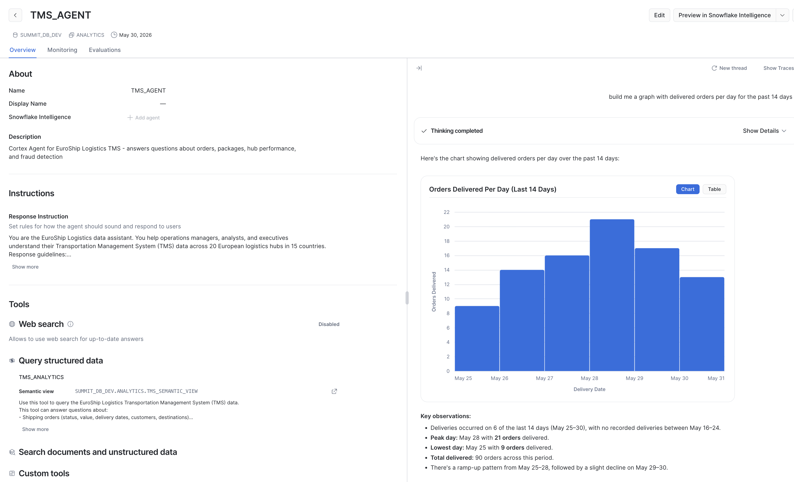

If you Click on **Show Traces** you can see detailed execution tracking, with performance metrics and tokens consumed.

<!-- ------------------------ -->
## Build a Streamlit Dashboard with Cortex Code

Now let's use **Cortex Code** to vibe-code a Streamlit in Snowflake (SiS) operations dashboard for EuroShip Logistics. Instead of writing the app manually, you'll give Cortex Code a detailed prompt and let it generate the full application.

### Prepare the Prompt

The prompt file is already provided at [`7_streamlit/create_streamlit_app_prompt.txt`](7_streamlit/create_streamlit_app_prompt.txt). It instructs Cortex Code to build a multi-page Streamlit app with:

- **Dashboard** — KPIs (total orders, packages in transit, fraud alerts, avg transit hours) and trend charts
- **Package Tracking** — Searchable, filterable table of all packages
- **Fraud Alerts** — Flagged payments with AI-generated explanations and a fraud score slider
- **Location Performance** — Hub/warehouse metrics with P90 processing times

The Prompt:

```text
Build a Streamlit in Snowflake (SiS) app for the EuroShip Logistics TMS system.

The app should connect to SUMMIT_DB_DEV.ANALYTICS and provide:

1. **Dashboard page** — Key KPIs at the top (total orders, packages in transit, fraud alerts, avg transit hours), followed by charts showing:
   - Orders over time (line chart)
   - Package status distribution (bar chart)
   - Top 10 busiest hubs by package volume (horizontal bar chart)

2. **Package Tracking page** — A searchable table of all packages with filters for status (IN_TRANSIT, DELIVERED, etc.) and carrier. Show tracking number, customer, destination, status, hubs visited, and transit hours.

3. **Fraud Alerts page** — A table of flagged fraudulent payments with fraud score, fraud type, triggered signals, and the AI-generated explanation. Add a filter for minimum fraud score threshold (slider from 0.3 to 1.0).

4. **Location Performance page** — A table and bar chart of hub/warehouse performance metrics: location name, type, city, country, number of packages processed, and P90 processing time in minutes. Add date filter.

Requirements:
- Use the role SUMMIT_ADMIN and warehouse SUMMIT_WH_DEV.
- Query these views: ORDER_SUMMARY, PACKAGE_TRACKING, FRAUD_DETECTION, LOCATION_ACTIVITY.
- Use st.connection("snowflake") for the Snowflake connection.
- Use Streamlit's built-in charting (st.bar_chart, st.line_chart) or st.altair_chart for more control.
- Add a sidebar with page navigation using st.navigation and st.Page.
- Apply clean formatting with st.metric for KPIs.
- The app title should be "EuroShip Logistics — TMS Operations".

Rules:
- Create only the Python app file and save it locally as `7_streamlit/tms_app.py`.
- Do not deploy the app yet.
- Use the local repository to get information about schema objects and column names.
```

### Generate the App with Cortex Code

1. Open **Cortex Code** — either in the desktop IDE or through the Snowsight integration.

2. Make sure you have the project repository open as your workspace so Cortex Code can reference the schema objects.

3. Paste the contents of `7_streamlit/create_streamlit_app_prompt.txt` into the Cortex Code chat panel.

4. Cortex Code will generate a complete `tms_app.py` file. Review the generated code — it should:
   - Use `st.connection("snowflake")` for the database connection
   - Query the `ANALYTICS` schema views (`ORDER_SUMMARY`, `PACKAGE_TRACKING`, `FRAUD_DETECTION`, `LOCATION_ACTIVITY`)
   - Use `st.navigation` and `st.Page` for multi-page layout
   - Display KPIs with `st.metric` and charts with `st.bar_chart` / `st.line_chart`

5. Save the generated file to `7_streamlit/tms_app.py`.

### Run Locally

To test the app locally before deploying:

```bash
source .venv/bin/activate
streamlit run 7_streamlit/tms_app.py
```

This uses your local `summit` Snowflake CLI connection via `st.connection("snowflake")`.

### Deploy to Snowflake (Optional)

Once you're happy with the generated app, let's update the connection and deploy it as a Streamlit in Snowflake app:

Cortex Code:

```text
Update the streamlit app to use streamlit snowflake connection
```

Deploy using snow cli:

```bash
snow streamlit deploy tms_operations_app \
  --replace \
  --database SUMMIT_DB_DEV \
  --role SUMMIT_ADMIN \
  --project 7_streamlit
```

Now Open the Link printed after deploy:

`Streamlit successfully deployed and available under https://app.snowflake.com/...`

Still get errors? Cortex Code is your friend. Just paste the error in the prompt and ask to fix.

### Iterate with Cortex Code

The power of this approach is iteration. If you want to add features or change the layout, simply ask Cortex Code:

- "Provide a date selector for the Dashboard, with default to last 7 days"
- "Add a map visualization showing package locations across Europe"
- "Add a real-time refresh button that re-queries the data"
- "Change the fraud alerts page to highlight critical scores in red"

Cortex Code will modify the existing file in place, preserving what works and adding the requested changes.

<!-- ------------------------ -->
## Bonus: Configure github actions for your DCM project

Automate DCM deployments using GitHub Actions so that pushes to specific branches trigger `snow dcm plan` and `snow dcm deploy` against the correct environment.

### Multi-Environment Strategy

The `manifest.yml` already defines three targets with Jinja-templated suffixes:

| Branch | Target | Suffix | Account |
|:-------|:-------|:-------|:--------|
| `main` | `DCM_DEV` | `_DEV` | Dev account |
| `staging` | `DCM_STAGE` | `_STAGE` | Stage account |
| `production` | `DCM_PROD` | `_PROD` | Prod account |

Each target creates isolated objects (e.g., `SUMMIT_DB_DEV`, `SUMMIT_DB_STAGE`, `SUMMIT_DB_PROD`) using the same definitions.

You will need a Github account for this, where you will upload the dcm project.

See these 2 Quickstarts for reference:
 - https://www.snowflake.com/en/developers/guides/get-started-snowflake-dcm-projects/
 - https://www.snowflake.com/en/developers/guides/build-data-pipelines-with-snowflake-dcm-projects/

<!-- ------------------------ -->
## Cleanup

When you're done exploring, tear down all resources created by this guide.

### Stop the Openflow Connector

In the Openflow UI, right-click on the process group and click **Stop**. Wait for all processors to stop before proceeding. Then disable controllers.

### Drop All Resources

Run the tear-down script to remove the database, warehouse, roles, and Openflow runtime:

```bash
snow sql -f 2_dcm_project/scripts/tear_down.sql \
  --variable "env_suffix=_DEV" --enable-templating JINJA
```

Here's what gets dropped in order:

1. Suspends and drops the Openflow runtime
2. Drops the **SUMMIT_DB_DEV** database (removes all schemas, tables, dynamic tables, views, and data)
3. Drops the **SUMMIT_WH_DEV** warehouse
4. Drops roles: **SUMMIT_INGEST_ROLE_DEV**, **SUMMIT_DEVELOPER_ROLE_DEV**
5. Drops the DCM project object

### Drop Bootstrap Resources (Optional)

If you also want to remove the DCM infrastructure and Openflow deployment:

```sql
USE ROLE ACCOUNTADMIN;

ALTER OPENFLOW DEPLOYMENT SUMMIT_DEPLOYMENT TERMINATE;
DROP DATABASE IF EXISTS DCM_DB;
DROP WAREHOUSE IF EXISTS SUMMIT_WH;
DROP ROLE IF EXISTS SUMMIT_ADMIN;
```

> **Note:** Terminating the Openflow deployment takes a few minutes to complete.

### Delete Kafka Topics (Optional)

If you created topics on your own cluster:

```bash
source .env
for suffix in orders order-items payments packages tracking-events deliveries; do
  rpk topic delete "${KAFKA_TOPIC_PREFIX}-${suffix}"
done
```

<!-- ------------------------ -->
## Conclusion and Resources

Congratulations! You've built a complete real-time data platform that streams logistics events from Kafka, transforms them through a multi-layer Dynamic Table pipeline, scores payments for fraud using AI, and exposes clean analytics views ready for agent consumption — all defined as code using DCM Projects.

### What You Learned

- How to define an entire data platform as code using **DCM Projects** with Jinja templating for multi-environment support
- How to provision and configure **Openflow** to stream data from Kafka into Snowflake using SASL authentication and regex-based topic-to-table mapping
- How to build a **two-layer Dynamic Table architecture** — a clean layer for deduplication and standardization, and an analytic layer for business aggregations
- How the entire pipeline refreshes automatically with 1-minute target lag, providing near real-time analytics on streaming data
- How to structure an **analytics layer** with views that serve as the interface for Cortex Agents and dashboards
- How to implement **AI-powered fraud detection** using heuristic scoring enriched with Cortex AI (`AI_CLASSIFY` + `AI_COMPLETE`) for fraud classification and explanation
- How to create a **Semantic View** with Cortex Code that defines dimensions, metrics, relationships, and verified queries for natural language querying
- How to deploy a **Cortex Agent** that uses the semantic view to answer operational questions in plain English
- How to use **Cortex Code** to vibe-code a **Streamlit in Snowflake** operations dashboard from a natural language prompt

### Related Resources

- [DCM Projects Documentation](https://docs.snowflake.com/en/user-guide/dcm-projects/dcm-projects-overview)
- [Openflow Documentation](https://docs.snowflake.com/en/user-guide/data-load/openflow/openflow-overview)
- [Dynamic Tables Documentation](https://docs.snowflake.com/en/user-guide/dynamic-tables-about)
- [Cortex AI Documentation](https://docs.snowflake.com/en/user-guide/snowflake-cortex/overview)
- [Streamlit in Snowflake](https://docs.snowflake.com/en/developer-guide/streamlit/about-streamlit)
- [Snowflake CLI — DCM Projects](https://docs.snowflake.com/developer-guide/snowflake-cli/data-pipelines/dcm-projects)
- [Get Started with Snowflake DCM Projects](https://www.snowflake.com/en/developers/guides/get-started-snowflake-dcm-projects/)
