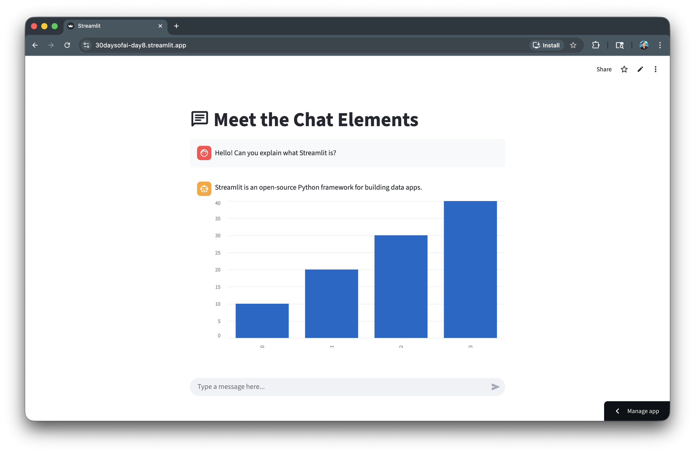
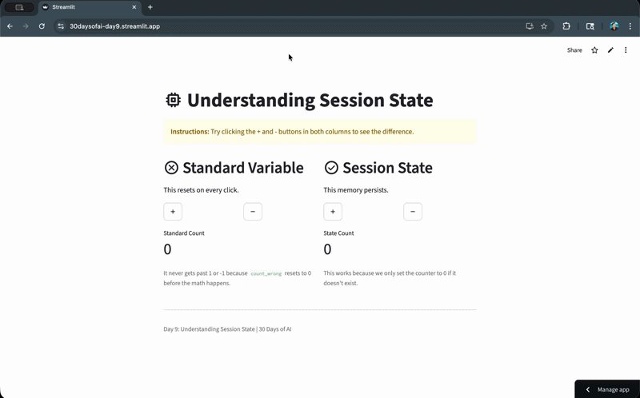
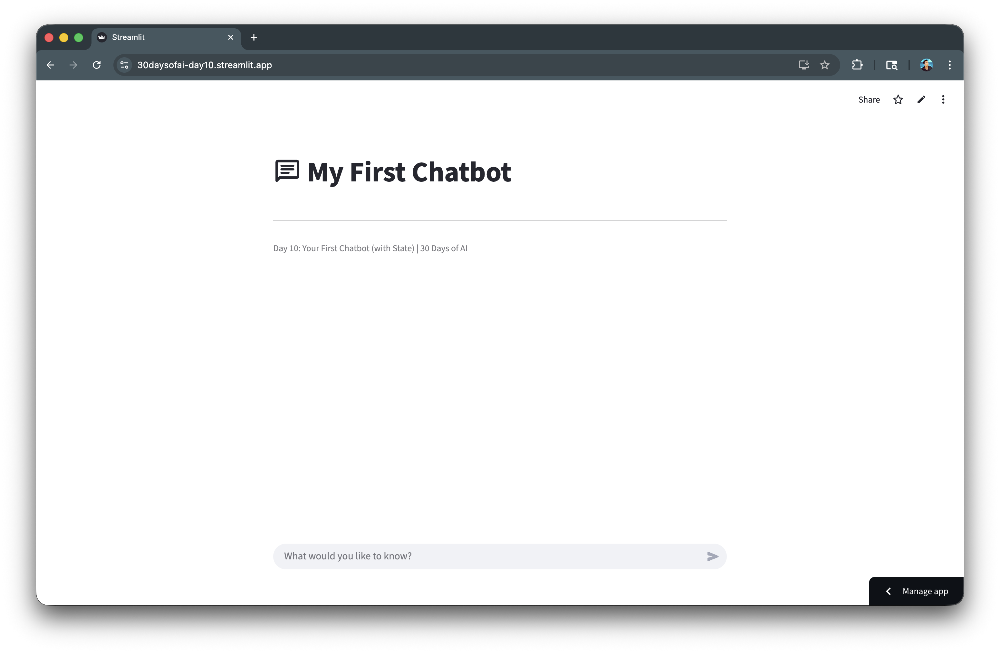
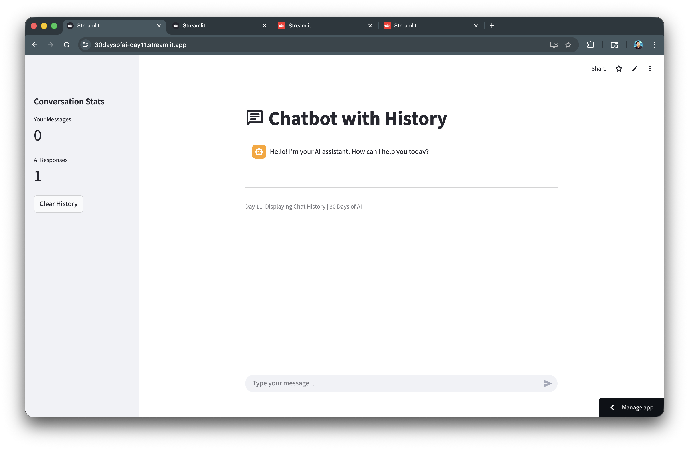
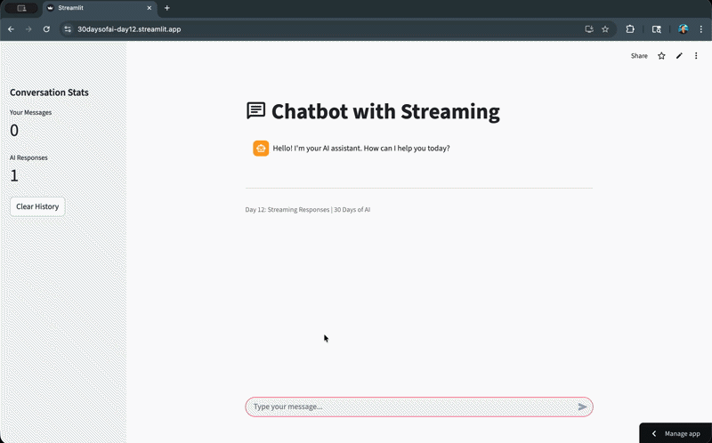
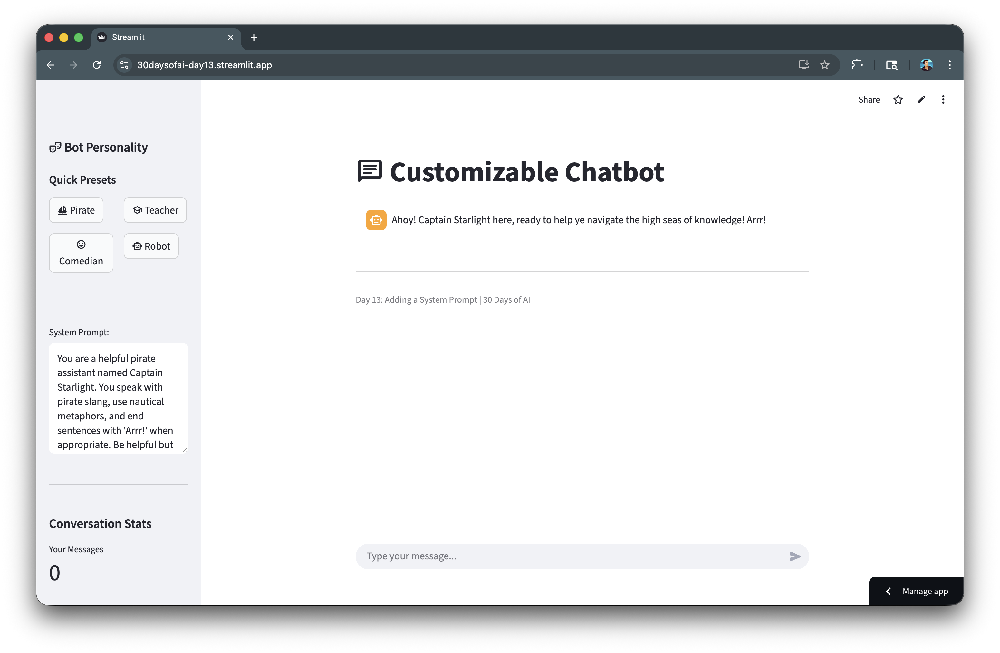
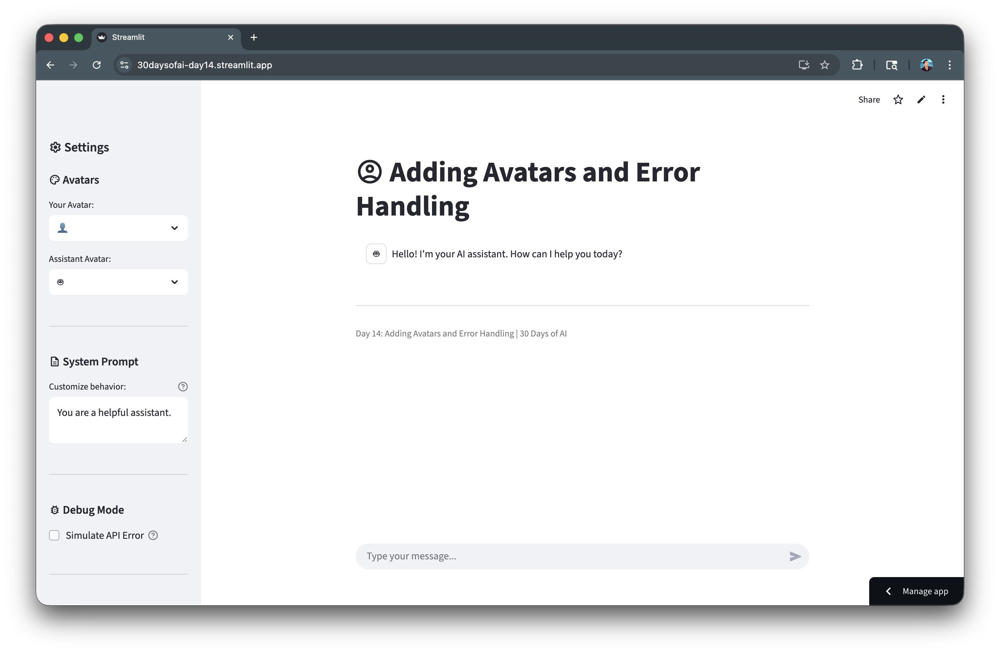

author: Chanin Nantasenamat
id: build-chatbot-app-with-streamlit-and-snowflake-cortex
summary: Build a production-ready AI chatbot with Streamlit and Snowflake Cortex, featuring chat history, streaming responses, system prompts, avatars, and error handling.
categories: snowflake-site:taxonomy/solution-center/certification/quickstart,snowflake-site:taxonomy/product/ai
language: en
environments: web
status: Published
feedback link: https://github.com/Snowflake-Labs/sfguides/issues
tags: Streamlit, Cortex, Chatbot, LLM, Session State

# Build a Chatbot App with Streamlit and Snowflake Cortex
<!-- ------------------------ -->
## Overview

In this quickstart, you'll learn how to build a production-ready chatbot using Streamlit's chat components and Snowflake Cortex LLM functions. Starting with basic chat elements, you'll progressively add session state for memory, streaming responses, customizable system prompts, avatars, and error handling.

### What You'll Learn
- How to use Streamlit's chat UI elements (`st.chat_message`, `st.chat_input`) (Day 8)
- How to implement session state for conversation memory (Day 9)
- How to build a chatbot with conversation history context (Days 10-11)
- How to add streaming responses for better UX (Day 12)
- How to implement customizable system prompts for bot personalities (Day 13)
- How to add custom avatars and robust error handling (Day 14)

### What You'll Build
A fully-featured AI chatbot with persistent conversation history, customizable personality presets, streaming responses, and professional error handling.


### Prerequisites
- Access to a [Snowflake account](https://signup.snowflake.com/?utm_source=snowflake-devrel&utm_medium=developer-guides&utm_cta=developer-guides)
- Basic knowledge of Python and Streamlit
- A Snowflake warehouse with Cortex LLM access

<!-- ------------------------ -->
## Getting Started

Clone or download the code from the [30daysofai](https://github.com/streamlit/30daysofai) GitHub repository:

```bash
git clone https://github.com/streamlit/30DaysOfAI.git
cd 30DaysOfAI/app
```

The app code for this quickstart:
- [Day 8: Chat Elements](https://github.com/streamlit/30DaysOfAI/blob/main/app/day8.py)
- [Day 9: Session State](https://github.com/streamlit/30DaysOfAI/blob/main/app/day9.py)
- [Day 10: Chat Input](https://github.com/streamlit/30DaysOfAI/blob/main/app/day10.py)
- [Day 11: Chatbot App](https://github.com/streamlit/30DaysOfAI/blob/main/app/day11.py)
- [Day 12: Streaming Responses](https://github.com/streamlit/30DaysOfAI/blob/main/app/day12.py)
- [Day 13: System Prompts](https://github.com/streamlit/30DaysOfAI/blob/main/app/day13.py)
- [Day 14: Avatars and Error Handling](https://github.com/streamlit/30DaysOfAI/blob/main/app/day14.py)

<!-- ------------------------ -->
## Meet the Chat Elements

Streamlit provides dedicated components for building chat interfaces.

> Note: This section is repurposed from Day 8 of the [#30DaysOfAI learning challenge](https://30daysofai.streamlit.app/?day=8).

### Basic Chat Messages

The `st.chat_message` context manager creates styled message containers. You can include any Streamlit elements inside chat messages:

```python
import streamlit as st

st.title(":material/chat: Meet the Chat Elements")

with st.chat_message("user"):
    st.write("Hello! Can you explain what Streamlit is?")

with st.chat_message("assistant"):
    st.write("Streamlit is an open-source Python framework for building data apps.")
    st.bar_chart([10, 20, 30, 40])
```

The `st.chat_message()` context manager creates styled message bubbles with automatic role-based formatting. You can include any Streamlit elements inside chat messages, including charts and media.

### Chat Input

The `st.chat_input` widget creates a fixed input field at the bottom of the app. The walrus operator (`:=`) assigns and checks the input in one line:

```python
prompt = st.chat_input("Type a message here...")

if prompt:
    with st.chat_message("user"):
        st.write(prompt)
    
    with st.chat_message("assistant"):
        st.write(f"You just said: '{prompt}' (I don't have memory yet!)")
```

The `st.chat_input()` creates a fixed input field at the bottom of the app. The walrus operator (`:=`) assigns the input value and checks if it exists in one line.

Here's what the chat elements look like in action:



<!-- ------------------------ -->
## Understanding Session State

Session state is crucial for maintaining conversation history across reruns.

> Note: This section is repurposed from Day 9 of the [#30DaysOfAI learning challenge](https://30daysofai.streamlit.app/?day=9).

### The Problem with Regular Variables

Regular variables reset on every Streamlit rerun, making them unsuitable for state:

```python
count_wrong = 0

if st.button("Add"):
    count_wrong += 1

st.metric("Count", count_wrong)
```

Regular Python variables reset to their initial values on every Streamlit rerun, making them unsuitable for maintaining state.

### The Session State Solution

Session state persists data across reruns within a user session:

```python
if "counter" not in st.session_state:
    st.session_state.counter = 0

if st.button("Add"):
    st.session_state.counter += 1

st.metric("Count", st.session_state.counter)
```

`st.session_state` is a dictionary-like object that persists data across Streamlit reruns within a user session.

### Key Pattern

Always check if a key exists before initializing to prevent overwriting data:

```python
if "messages" not in st.session_state:
    st.session_state.messages = []
```

Always check if a key exists before initializing to prevent overwriting data on reruns. This pattern ensures messages persist throughout the conversation.

Here's session state in action, maintaining the counter value across reruns:



<!-- ------------------------ -->
## Build Your First Chatbot

Combine chat elements with session state and Cortex LLM.

> Note: This section is repurposed from Days 10-11 of the [#30DaysOfAI learning challenge](https://30daysofai.streamlit.app/?day=10).

### Complete Chatbot Code

Combine chat elements with session state and Cortex LLM to build a basic chatbot:

```python
import streamlit as st
import json
from snowflake.snowpark.functions import ai_complete

try:
    from snowflake.snowpark.context import get_active_session
    session = get_active_session()
except:
    from snowflake.snowpark import Session
    session = Session.builder.configs(st.secrets["connections"]["snowflake"]).create()

def call_llm(prompt_text: str) -> str:
    df = session.range(1).select(
        ai_complete(model="claude-3-5-sonnet", prompt=prompt_text).alias("response")
    )
    response_raw = df.collect()[0][0]
    response_json = json.loads(response_raw)
    if isinstance(response_json, dict):
        return response_json.get("choices", [{}])[0].get("messages", "")
    return str(response_json)

st.title(":material/chat: My First Chatbot")

if "messages" not in st.session_state:
    st.session_state.messages = []

for message in st.session_state.messages:
    with st.chat_message(message["role"]):
        st.write(message["content"])

if prompt := st.chat_input("What would you like to know?"):
    st.session_state.messages.append({"role": "user", "content": prompt})
    
    with st.chat_message("user"):
        st.write(prompt)
    
    with st.chat_message("assistant"):
        response = call_llm(prompt)
        st.write(response)
    
    st.session_state.messages.append({"role": "assistant", "content": response})
```

This pattern stores messages in session state, displays them using a loop, processes new input with the LLM, and appends both user and assistant messages. The conversation persists across reruns.

Here's the basic chatbot with message history:



<!-- ------------------------ -->
## Add Conversation History

Send the full conversation context to maintain coherent multi-turn conversations.

> Note: This section continues from Day 11 of the [#30DaysOfAI learning challenge](https://30daysofai.streamlit.app/?day=11).

### Chat History Display

Display conversation stats in the sidebar and render chat history:

```python
if "messages" not in st.session_state:
    st.session_state.messages = [
        {"role": "assistant", "content": "Hello! I'm your AI assistant. How can I help you today?"}
    ]

with st.sidebar:
    st.header("Conversation Stats")
    user_msgs = len([m for m in st.session_state.messages if m["role"] == "user"])
    assistant_msgs = len([m for m in st.session_state.messages if m["role"] == "assistant"])
    st.metric("Your Messages", user_msgs)
    st.metric("AI Responses", assistant_msgs)
    
    if st.button("Clear History"):
        st.session_state.messages = [
            {"role": "assistant", "content": "Hello! I'm your AI assistant. How can I help you today?"}
        ]
        st.rerun()

for message in st.session_state.messages:
    with st.chat_message(message["role"]):
        st.markdown(message["content"])
```

The sidebar displays conversation stats and provides a clear history button. `st.rerun()` forces a page refresh after clearing to update the display immediately.

### Conversation Context

Build the full conversation context as a formatted string for each LLM call:

```python
if prompt := st.chat_input("Type your message..."):
    st.session_state.messages.append({"role": "user", "content": prompt})
    with st.chat_message("user"):
        st.markdown(prompt)
    
    with st.chat_message("assistant"):
        with st.spinner("Thinking..."):
            conversation = "\n\n".join([
                f"{'User' if msg['role'] == 'user' else 'Assistant'}: {msg['content']}"
                for msg in st.session_state.messages
            ])
            full_prompt = f"{conversation}\n\nAssistant:"
            
            response = call_llm(full_prompt)
        st.markdown(response)
    
    st.session_state.messages.append({"role": "assistant", "content": response})
    st.rerun()
```

Building the full conversation context as a formatted string gives the LLM awareness of the entire conversation history, enabling coherent multi-turn dialogues where it remembers previous exchanges.

Here's the chatbot with conversation history and sidebar stats:



<!-- ------------------------ -->
## Implement Streaming Responses

Add streaming for a more responsive feel.

> Note: This section is repurposed from Day 12 of the [#30DaysOfAI learning challenge](https://30daysofai.streamlit.app/?day=12).

### Stream Generator Function

Create a generator that yields words one at a time for a typing effect:

```python
import time

def stream_generator():
    conversation = "\n\n".join([
        f"{'User' if msg['role'] == 'user' else 'Assistant'}: {msg['content']}"
        for msg in st.session_state.messages
    ])
    full_prompt = f"{conversation}\n\nAssistant:"
    
    response_text = call_llm(full_prompt)
    for word in response_text.split(" "):
        yield word + " "
        time.sleep(0.02)

if prompt := st.chat_input("Type your message..."):
    st.session_state.messages.append({"role": "user", "content": prompt})
    with st.chat_message("user"):
        st.markdown(prompt)
    
    with st.chat_message("assistant"):
        with st.spinner("Processing"):
            response = st.write_stream(stream_generator)
    
    st.session_state.messages.append({"role": "assistant", "content": response})
    st.rerun()
```

The generator function yields words one at a time with a small delay, creating a typing effect. `st.write_stream()` consumes the generator and displays output progressively, improving perceived responsiveness.

Here's the streaming response in action:



<!-- ------------------------ -->
## Add System Prompts

System prompts define the chatbot's personality and behavior.

> Note: This section is repurposed from Day 13 of the [#30DaysOfAI learning challenge](https://30daysofai.streamlit.app/?day=13).

### Personality Presets

Add preset buttons and a text area for customizing the bot's personality:

```python
if "system_prompt" not in st.session_state:
    st.session_state.system_prompt = "You are a helpful pirate assistant named Captain Starlight. You speak with pirate slang and end sentences with 'Arrr!' when appropriate."

with st.sidebar:
    st.header(":material/theater_comedy: Bot Personality")
    
    st.subheader("Quick Presets")
    col1, col2 = st.columns(2)
    
    with col1:
        if st.button(":material/sailing: Pirate"):
            st.session_state.system_prompt = "You are a helpful pirate assistant named Captain Starlight. You speak with pirate slang and end sentences with 'Arrr!' when appropriate."
            st.rerun()
    
    with col2:
        if st.button(":material/school: Teacher"):
            st.session_state.system_prompt = "You are Professor Ada, a patient and encouraging teacher. You explain concepts clearly and use examples."
            st.rerun()
    
    col3, col4 = st.columns(2)
    
    with col3:
        if st.button(":material/mood: Comedian"):
            st.session_state.system_prompt = "You are Chuckles McGee, a witty comedian assistant. You love puns and jokes while being genuinely helpful."
            st.rerun()
    
    with col4:
        if st.button(":material/smart_toy: Robot"):
            st.session_state.system_prompt = "You are UNIT-7, a helpful robot assistant. You speak in a precise, logical manner."
            st.rerun()
    
    st.text_area("System Prompt:", height=200, key="system_prompt")
```

Preset buttons update the system prompt and trigger a rerun. The `st.text_area()` with `key="system_prompt"` binds directly to session state, allowing users to customize the prompt.

### Using the System Prompt

Prepend the system prompt to the conversation context:

```python
def stream_generator():
    conversation = "\n\n".join([
        f"{'User' if msg['role'] == 'user' else 'Assistant'}: {msg['content']}"
        for msg in st.session_state.messages
    ])
    
    full_prompt = f"""{st.session_state.system_prompt}

Here is the conversation so far:
{conversation}

Respond to the user's latest message while staying in character."""
    
    response_text = call_llm(full_prompt)
    for word in response_text.split(" "):
        yield word + " "
        time.sleep(0.02)
```

The system prompt is prepended to the conversation context, establishing the assistant's personality. The LLM receives instructions to stay in character while responding.

Here's the chatbot with personality presets in the sidebar:



<!-- ------------------------ -->
## Add Avatars and Error Handling

Polish your chatbot with custom avatars and robust error handling.

> Note: This section is repurposed from Day 14 of the [#30DaysOfAI learning challenge](https://30daysofai.streamlit.app/?day=14).

### Custom Avatars

Add avatar selection using emoji selectboxes:

```python
with st.sidebar:
    st.header(":material/settings: Settings")
    
    st.subheader(":material/palette: Avatars")
    user_avatar = st.selectbox(
        "Your Avatar:",
        ["👤", "🧑‍💻", "👨‍🎓", "👩‍🔬", "🦸", "🧙"],
        index=0
    )
    
    assistant_avatar = st.selectbox(
        "Assistant Avatar:",
        ["🤖", "🧠", "✨", "🎯", "💡", "🌟"],
        index=0
    )

for message in st.session_state.messages:
    avatar = user_avatar if message["role"] == "user" else assistant_avatar
    with st.chat_message(message["role"], avatar=avatar):
        st.markdown(message["content"])
```

The `avatar` parameter in `st.chat_message()` accepts emoji or image URLs. Storing avatar selections in session state allows users to personalize their chat experience.

### Error Handling

Wrap LLM calls in try/except blocks for graceful error handling:

```python
with st.sidebar:
    st.subheader(":material/bug_report: Debug Mode")
    simulate_error = st.checkbox("Simulate API Error", value=False)

if prompt := st.chat_input("Type your message..."):
    st.session_state.messages.append({"role": "user", "content": prompt})
    with st.chat_message("user", avatar=user_avatar):
        st.markdown(prompt)
    
    with st.chat_message("assistant", avatar=assistant_avatar):
        try:
            if simulate_error:
                raise Exception("Simulated API error: Service temporarily unavailable (429)")
            
            with st.spinner("Processing"):
                response = st.write_stream(stream_generator)
            
            st.session_state.messages.append({"role": "assistant", "content": response})
            st.rerun()
            
        except Exception as e:
            error_message = f"I encountered an error: {str(e)}"
            st.error(error_message)
            st.info(":material/lightbulb: **Tip:** This might be a temporary issue. Try again in a moment, or rephrase your question.")
```

Wrapping LLM calls in try/except blocks catches API errors gracefully. The debug checkbox simulates errors for testing. Displaying helpful tips guides users when issues occur.

Here's the polished chatbot with custom avatars and error handling:



<!-- ------------------------ -->
## Deploy the App

Save the code above as `streamlit_app.py` and deploy using one of these options:

- **Local**: Run `streamlit run streamlit_app.py` in your terminal
- **Streamlit Community Cloud**: [Deploy your app](https://docs.streamlit.io/deploy/streamlit-community-cloud/deploy-your-app/deploy) from a GitHub repository
- **Streamlit in Snowflake (SiS)**: [Create a Streamlit app](https://docs.snowflake.com/en/developer-guide/streamlit/getting-started/create-streamlit-ui) directly in Snowsight

<!-- ------------------------ -->
## Conclusion And Resources

Congratulations! You've successfully built a production-ready AI chatbot with Streamlit and Snowflake Cortex. Your chatbot features persistent conversation history, customizable personalities, streaming responses, custom avatars, and robust error handling.

### What You Learned
- Using Streamlit's chat UI elements (`st.chat_message`, `st.chat_input`) (Day 8)
- Implementing session state for conversation memory (Day 9)
- Building context-aware conversations with history (Days 10-11)
- Adding streaming responses for better UX (Day 12)
- Creating customizable bot personalities with system prompts (Day 13)
- Implementing avatars and error handling (Day 14)

### Related Resources

Documentation:
- [Streamlit Chat Elements](https://docs.streamlit.io/develop/api-reference/chat)
- [Streamlit Session State](https://docs.streamlit.io/develop/concepts/architecture/session-state)
- [Snowflake Cortex LLM Functions](https://docs.snowflake.com/en/user-guide/snowflake-cortex/llm-functions)

Additional Reading:
- [Build a Chatbot with Streamlit](https://docs.streamlit.io/develop/tutorials/llms/build-conversational-apps)

### Source Material

This quickstart was adapted from **Days 8-14** of the 30 Days of AI challenge:
- [Day 8: Chat Elements](https://github.com/streamlit/30DaysOfAI/blob/main/app/day8.py)
- [Day 9: Session State](https://github.com/streamlit/30DaysOfAI/blob/main/app/day9.py)
- [Day 10: Chat Input](https://github.com/streamlit/30DaysOfAI/blob/main/app/day10.py)
- [Day 11: Chatbot App](https://github.com/streamlit/30DaysOfAI/blob/main/app/day11.py)
- [Day 12: Streaming Responses](https://github.com/streamlit/30DaysOfAI/blob/main/app/day12.py)
- [Day 13: System Prompts](https://github.com/streamlit/30DaysOfAI/blob/main/app/day13.py)
- [Day 14: Avatars and Error Handling](https://github.com/streamlit/30DaysOfAI/blob/main/app/day14.py)

Learn more:
- [30 Days of AI Challenge](https://30daysofai.streamlit.app/)
- [GitHub Repository](https://github.com/streamlit/30daysofai)
