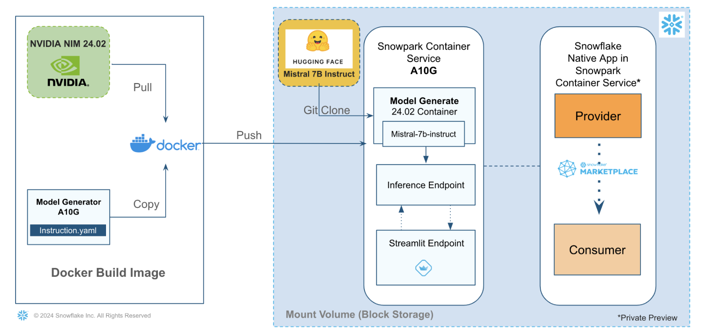

author: NVIDIA Staff
id: build-custom-llm-apps-with-snowpark-container-services-and-nvidia
summary: This solution architecture helps you understand how to build an LLM app powered by Snowpark Container Services and NVIDIA NeMo Inference Service (NIM) Download an open source foundation model such as Mistral-7b-instruct from HuggingFace Shrink the mo
categories: snowflake-site:taxonomy/solution-center/certification/partner-solution
environments: web
language: en
status: Published
feedback link: https://github.com/Snowflake-Labs/sfguides/issues
fork repo link: https://github.com/Snowflake-Labs/sfguide-build-ai-app-using-nvidia-snowpark-container-services

# Build LLM Apps with Snowpark Container Services and NVIDIA
<!-- ------------------------ -->
## Overview

This solution architecture helps you understand how to build an LLM app powered by Snowpark Container Services and NVIDIA NeMo Inference Service (NIM)

* Download an open source foundation model such as Mistral-7b-instruct from HuggingFace
* Shrink the model size to fit in a smaller GPU (A10G->GPU\_NV\_M) for inference
* Generate a new model using a model generator on NIM Snowpark container
* Publish Mistral Inference App as internal Snowflake Native Application, that uses Streamlit for the app UI

<!-- ------------------------ -->
## Solution Architecture: LLM App Powered By NVIDIA on Snowpark Container Services

* In this use-case, we leverage Snowpark Container Services to run a Model Generator container. It downloads the Mistral-7b-Instruct from HuggingFace and shrinks it using NVIDIA NIM,
* We build a Streamlit app for the model inference endpoint for the Model Generator

<!-- ------------------------ -->
## Get Started

- [view quickstart](https://quickstarts.snowflake.com/guide/build_llm_app_nvidia_scs/index.html?index=..%2F..index#0)
- [fork repo](https://github.com/Snowflake-Labs/sfguide-build-ai-app-using-nvidia-snowpark-container-services)
- [Download reference architecture](https://www.snowflake.com/content/dam/snowflake-site/developers/2024/05/Build-custom-LLM-Apps-with-Snowpark-Container-Services-and-NVIDIA-Inference-Microservices.pdf)
