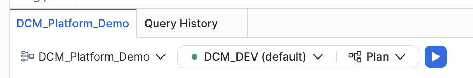
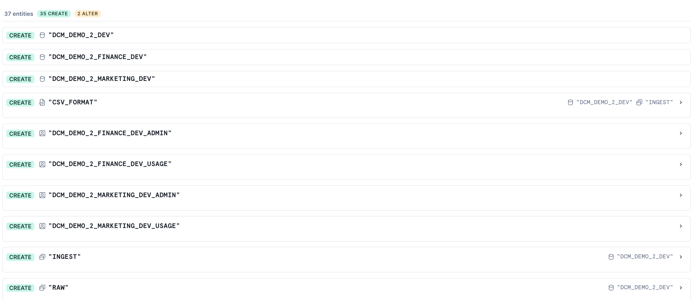
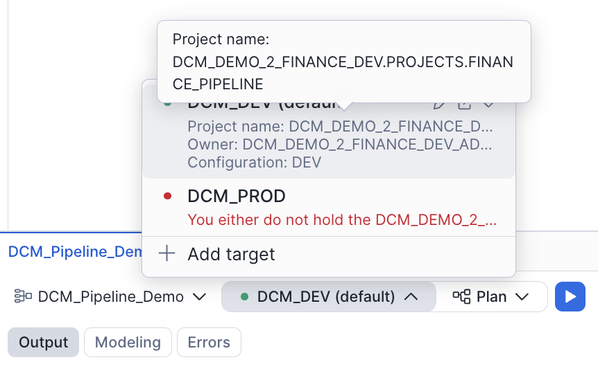
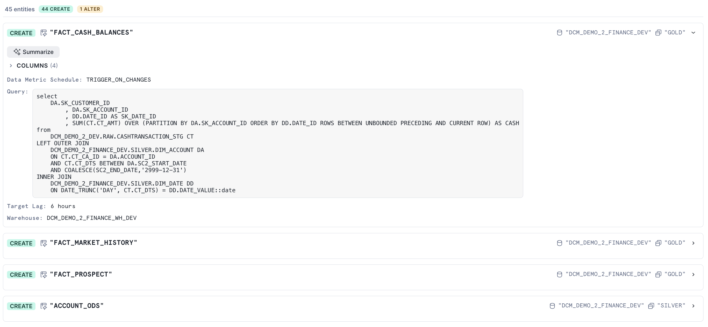

author: Jan Sommerfeld, Gilberto Hernandez, Yoav Ostrinsky
id: build-data-pipelines-with-snowflake-dcm-projects
summary: Learn how to split platform infrastructure and data pipelines into separate DCM Projects, deploy them sequentially, and build a medallion-architecture transformation layer.
categories: snowflake-site:taxonomy/solution-center/certification/quickstart, snowflake-site:taxonomy/product/platform, snowflake-site:taxonomy/product/data-engineering
environments: web
status: Published
language: en
feedback link: https://github.com/Snowflake-Labs/sfguides/issues
fork repo link: https://github.com/Snowflake-Labs/snowflake-dcm-projects

# Build Data Pipelines with Snowflake DCM Projects
<!-- ------------------------ -->
## Overview

In the [Get Started with Snowflake DCM Projects](https://www.snowflake.com/en/developers/guides/get-started-snowflake-dcm-projects/) guide, you learned the fundamentals of DCM Projects — how to define Snowflake infrastructure as code, use Jinja templating, and plan and deploy changes from Snowsight Workspaces.

In this guide, you'll take that a step further. You'll work with **two separate DCM Projects** that together build a complete data pipeline:

- **DCM_Platform_Demo** — Defines shared platform infrastructure: a database, raw staging tables, an ingestion stage and Task, warehouses, roles, and grants
- **DCM_Pipeline_Demo** — Defines a data transformation pipeline on top of the platform: silver-layer Dynamic Tables, gold-layer fact tables and views, and data quality expectations

By splitting platform infrastructure and data pipelines into separate projects, you get a clean separation of concerns. The Platform project can be owned by a platform team and deployed independently, while the Pipeline project can be owned by a data engineering team that builds transformations on top.

> **Note:** DCM Projects is currently in Public Preview. See the [DCM Projects documentation](https://docs.snowflake.com/en/user-guide/dcm-projects/dcm-projects-overview) for the latest details.

### Prerequisites
- A [Snowflake account](https://signup.snowflake.com/?utm_source=snowflake-devrel&utm_medium=developer-guides&utm_cta=developer-guides) with ACCOUNTADMIN access (or a role with sufficient privileges)
- Familiarity with DCM Projects concepts (complete [Get Started with Snowflake DCM Projects](https://www.snowflake.com/en/developers/guides/get-started-snowflake-dcm-projects/) first)

### What You'll Learn
- How to split infrastructure into multiple DCM Projects with different responsibilities
- How to define stage-based data ingestion with Tasks and CRON schedules
- How to build a medallion architecture (bronze/silver/gold layers) using Dynamic Tables defined as code
- How to use Jinja macros and loops to create per-team infrastructure (warehouses, roles, grants)

### What You'll Need
- A [Snowflake account](https://signup.snowflake.com/?utm_source=snowflake-devrel&utm_medium=developer-guides&utm_cta=developer-guides) with ACCOUNTADMIN access
- (Optional) [Snowflake CLI](https://docs.snowflake.com/en/developer-guide/snowflake-cli/installation/installation) v3.16.0+ if you prefer CLI over the Snowsight UI

### What You'll Build
- A fully deployed data platform and transformation pipeline consisting of:

  - A shared raw database with 16 staging tables
  - An ingestion stage and scheduled Task for loading CSV data
  - Per-team warehouses, databases, roles, and grants
  - A silver layer of Dynamic Tables that clean, filter, and transform raw data
  - A gold layer of fact tables, views, and aggregate calculations
  - Data quality expectations attached to gold-layer tables

<!-- ------------------------ -->
## Create a Workspace from Git

In this step, you'll create a Snowsight Workspace linked to the sample DCM Project repository on GitHub.

1. Navigate to **Projects > Workspaces** in Snowsight.
2. Click **Create** (+) and select **Git repository**.
3. Enter the repository URL: `https://github.com/snowflake-labs/snowflake-dcm-projects`
4. Select an API Integration for GitHub ([create one if needed](https://docs.snowflake.com/en/user-guide/ui-snowsight/workspaces-git#label-create-a-git-workspace)).
5. Select **Public repository**.

Once the workspace is created, you'll see the repository files in the file explorer. Navigate to **Quickstarts/build-data-pipelines-with-snowflake-dcm-projects** to find the following directories:

- **`DCM_Platform_Demo/`** — The Platform DCM Project (manifest, definitions, macros). Defines shared infrastructure.
- **`DCM_Pipeline_Demo/`** — The Pipeline DCM Project (manifest, definitions). Defines the transformation layer.
- **`sample_data/`** — CSV files to load into the raw tables after deployment.
- **`scripts/`** — Numbered SQL files that you'll run in Snowsight worksheets at different stages of this guide. These live outside the DCM project directories so they don't interfere with Plan & Deploy.

| File | When to Run |
|:-----|:-----------|
| `scripts/01_pre_deploy.sql` | Before the first DCM Plan & Deploy |
| `scripts/02_platform_post_deploy.sql` | After the Platform deployment |
| `scripts/03_pipeline_pre_deploy.sql` | Before deploying the Pipeline project |
| `scripts/04_query_results.sql` | After the Pipeline deployment to verify results |
| `scripts/05_cleanup.sql` | When you're done and want to tear everything down |

Open `scripts/01_pre_deploy.sql` in a Snowsight worksheet — you'll use it in the next step.

<!-- ------------------------ -->
## Set Up Roles and Permissions

In this step, you'll create a dedicated admin role for managing DCM Projects and grant it the necessary privileges.

Open `scripts/01_pre_deploy.sql` in a Snowsight worksheet and run each section in order. This script lives outside the DCM project directories, so it won't be picked up by Plan or Deploy. The script does the following:

### 1. Create a DCM Developer Role

```sql
USE ROLE ACCOUNTADMIN;

CREATE ROLE IF NOT EXISTS dcm_developer;
SET user_name = (SELECT CURRENT_USER());
GRANT ROLE dcm_developer TO USER IDENTIFIER($user_name);
```

### 2. Grant Infrastructure Privileges

The DCM_DEVELOPER role needs privileges to create infrastructure objects through DCM deployments:

```sql
GRANT CREATE WAREHOUSE ON ACCOUNT TO ROLE dcm_developer;
GRANT CREATE ROLE ON ACCOUNT TO ROLE dcm_developer;
GRANT CREATE DATABASE ON ACCOUNT TO ROLE dcm_developer;
GRANT EXECUTE MANAGED TASK ON ACCOUNT TO ROLE dcm_developer;
GRANT EXECUTE TASK ON ACCOUNT TO ROLE dcm_developer;
GRANT MANAGE GRANTS ON ACCOUNT TO ROLE dcm_developer;
```

### 3. Grant Data Quality Privileges

To define and test data quality expectations, grant the following:

```sql
GRANT APPLICATION ROLE SNOWFLAKE.DATA_QUALITY_MONITORING_VIEWER TO ROLE dcm_developer;
GRANT APPLICATION ROLE SNOWFLAKE.DATA_QUALITY_MONITORING_ADMIN TO ROLE dcm_developer;
GRANT DATABASE ROLE SNOWFLAKE.DATA_METRIC_USER TO ROLE dcm_developer;
GRANT EXECUTE DATA METRIC FUNCTION ON ACCOUNT TO ROLE dcm_developer WITH GRANT OPTION;
```

<!-- ------------------------ -->
## Explore the Platform Project

Before deploying anything, take a moment to explore the Platform project structure. Navigate into the **DCM_Platform_Demo/** directory — this is the actual DCM Project that the Plan & Deploy operations read.

### Manifest

Open `DCM_Platform_Demo/manifest.yml`. The Platform manifest defines two targets (DEV and PROD) and includes several templating variables:

```yaml
manifest_version: 2
type: DCM_PROJECT

default_target: DCM_DEV

targets:
  DCM_DEV:
    account_identifier: MYORG-MY_DEV_ACCOUNT # <-- Replace with your account identifier
    project_name: DCM_DEMO.PROJECTS.DCM_PLATFORM_DEV
    project_owner: DCM_DEVELOPER
    templating_config: DEV

  DCM_PROD:
    account_identifier: MYORG-MY_PROD_ACCOUNT # <-- Replace with your account identifier
    project_name: DCM_DEMO.PROJECTS.DCM_PLATFORM
    project_owner: DCM_PROD_DEPLOYER
    templating_config: PROD

templating:
  defaults:
    users:
      - "GITHUB_ACTIONS_SERVICE_USER"
    wh_size: "X-SMALL"

  configurations:
    DEV:
      env_suffix: "_DEV"
      users:
        - "INSERT_YOUR_USER" # <-- Replace with your Snowflake username
      project_owner_role: "DCM_DEVELOPER"
      teams:
        - name: "Finance"
          raw_access: "READ"
        - name: "Marketing"
          raw_access: "READ"

    PROD:
      env_suffix: ""
      project_owner_role: "DCM_PROD_DEPLOYER"
      wh_size: "MEDIUM"
      teams:
        - name: "Marketing"
          raw_access: "READ"
        - name: "Finance"
          raw_access: "READ"
        - name: "HR"
          raw_access: "NONE"
        - name: "IT"
          raw_access: "WRITE"
        - name: "Sales"
          raw_access: "NONE"
        - name: "Research"
          raw_access: "NONE"
        - name: "Design"
          raw_access: "NONE"
```

A few things to notice:

- **`teams`** — DEV has two teams (Finance and Marketing), while PROD has seven. Each team has a `raw_access` property that controls whether it gets `READ`, `WRITE`, or no access to the shared raw tables. The Jinja loops in the definition files will create per-team infrastructure for each.
- **`users`** — Defined as a list. The DEV configuration includes `INSERT_YOUR_USER` as a placeholder for your own Snowflake username.
- **`wh_size`** — DEV uses X-Small warehouses (the default), PROD uses Medium.

### Definition Files

The `sources/definitions/` directory contains three SQL files:

| File | What It Defines |
|:-----|:----------------|
| `raw.sql` | Shared database (`DCM_DEMO_2_DEV`), RAW schema, and 16 staging tables with change tracking |
| `wh_roles_and_grants.sql` | Per-team warehouses, databases, schemas, roles, and grants using Jinja loops |
| `ingest.sql` | INGEST schema, a file format, a stage for CSV files, and a scheduled Task for loading data |

#### Raw Tables

Open `raw.sql`. This file defines a shared database and 16 staging tables for a financial trading dataset. Each table has `CHANGE_TRACKING = TRUE` and `DATA_METRIC_SCHEDULE = 'TRIGGER_ON_CHANGES'` enabled:

```sql
DEFINE DATABASE dcm_demo_2{{env_suffix}};
DEFINE SCHEMA dcm_demo_2{{env_suffix}}.raw;

DEFINE TABLE dcm_demo_2{{env_suffix}}.raw.account_stg (
    cdc_flag VARCHAR(1) COMMENT 'I OR U DENOTES INSERT OR UPDATE',
    cdc_dsn TIMESTAMP_NTZ(9) COMMENT 'DATABASE SEQUENCE NUMBER',
    ca_id NUMBER(38,0) COMMENT 'CUSTOMER ACCOUNT IDENTIFIER',
    ca_b_id NUMBER(38,0) COMMENT 'IDENTIFIER OF THE MANAGING BROKER',
    ca_c_id NUMBER(38,0) COMMENT 'OWNING CUSTOMER IDENTIFIER',
    ca_name VARCHAR(50) COMMENT 'NAME OF CUSTOMER ACCOUNT',
    ca_tax_st NUMBER(38,0) COMMENT '0, 1 OR 2 TAX STATUS OF THIS ACCOUNT',
    ca_st_id VARCHAR(4) COMMENT 'ACTV OR INAC CUSTOMER STATUS TYPE IDENTIFIER'
)
CHANGE_TRACKING = TRUE
DATA_METRIC_SCHEDULE = 'TRIGGER_ON_CHANGES';
```

The full file defines tables for accounts, cash transactions, customers, daily market data, dates, finwire records, holding history, HR data, industries, prospects, status types, tax rates, time dimensions, trades, trade history, and watch history.

#### Per-Team Infrastructure

Open `wh_roles_and_grants.sql`. This is where the Jinja `` loop creates infrastructure for each team defined in the manifest:

```sql

    
    DEFINE WAREHOUSE dcm_demo_2_{{team_name}}_wh{{env_suffix}}
        WITH WAREHOUSE_SIZE='{{wh_size}}'
        COMMENT = 'For DCM Build Data Pipelines Quickstart';
    DEFINE DATABASE dcm_demo_2_{{team_name}}{{env_suffix}};
    DEFINE SCHEMA dcm_demo_2_{{team_name}}{{env_suffix}}.projects;
    DEFINE SCHEMA dcm_demo_2_{{team_name}}{{env_suffix}}.analytics;

    {{ create_team_roles(team_name) }}

    
        GRANT USAGE ON DATABASE dcm_demo_2{{env_suffix}} TO ROLE dcm_demo_2_{{team_name}}{{env_suffix}}_admin;
        GRANT USAGE ON SCHEMA dcm_demo_2{{env_suffix}}.raw TO ROLE dcm_demo_2_{{team_name}}{{env_suffix}}_admin;
        GRANT SELECT ON ALL TABLES IN SCHEMA dcm_demo_2{{env_suffix}}.raw TO ROLE dcm_demo_2_{{team_name}}{{env_suffix}}_admin;

    
        GRANT USAGE ON DATABASE dcm_demo_2{{env_suffix}} TO ROLE dcm_demo_2_{{team_name}}{{env_suffix}}_admin;
        GRANT USAGE ON SCHEMA dcm_demo_2{{env_suffix}}.raw TO ROLE dcm_demo_2_{{team_name}}{{env_suffix}}_admin;
        GRANT SELECT ON ALL TABLES IN SCHEMA dcm_demo_2{{env_suffix}}.raw TO ROLE dcm_demo_2_{{team_name}}{{env_suffix}}_admin;
        GRANT INSERT, UPDATE, DELETE ON ALL TABLES IN SCHEMA dcm_demo_2{{env_suffix}}.raw TO ROLE dcm_demo_2_{{team_name}}{{env_suffix}}_admin;
    

    
        GRANT DATABASE ROLE SNOWFLAKE.DATA_METRIC_USER TO ROLE dcm_demo_2_{{team_name}}{{env_suffix}}_admin;
        GRANT EXECUTE DATA METRIC FUNCTION ON ACCOUNT TO ROLE dcm_demo_2_{{team_name}}{{env_suffix}}_admin;
    

```

For each team, this creates a dedicated warehouse, database, and schemas (`PROJECTS` and `ANALYTICS`). The `raw_access` property from the manifest controls how much access each team gets to the shared raw tables — `READ` grants `SELECT`, `WRITE` additionally grants `INSERT`, `UPDATE`, and `DELETE`, and `NONE` skips the grants entirely. The `` conditional grants data quality privileges to the Finance team, which needs them for the Pipeline project's expectations.

#### Grants Macro

Open `sources/macros/grants_macro.sql`. This reusable macro creates a standard role hierarchy for each team:

```sql


    DEFINE ROLE dcm_demo_2_{{team}}{{env_suffix}}_admin;
    DEFINE ROLE dcm_demo_2_{{team}}{{env_suffix}}_usage;

    GRANT CREATE SCHEMA ON DATABASE dcm_demo_2_{{team}}{{env_suffix}}
        TO ROLE dcm_demo_2_{{team}}{{env_suffix}}_admin;
    GRANT USAGE ON WAREHOUSE dcm_demo_2_{{team}}_wh{{env_suffix}}
        TO ROLE dcm_demo_2_{{team}}{{env_suffix}}_usage;
    GRANT USAGE ON DATABASE dcm_demo_2_{{team}}{{env_suffix}}
        TO ROLE dcm_demo_2_{{team}}{{env_suffix}}_usage;
    GRANT USAGE ON SCHEMA dcm_demo_2_{{team}}{{env_suffix}}.projects
        TO ROLE dcm_demo_2_{{team}}{{env_suffix}}_usage;
    GRANT CREATE DCM PROJECT ON SCHEMA dcm_demo_2_{{team}}{{env_suffix}}.projects
        TO ROLE dcm_demo_2_{{team}}{{env_suffix}}_admin;

    GRANT ROLE dcm_demo_2_{{team}}{{env_suffix}}_usage TO ROLE dcm_demo_2_{{team}}{{env_suffix}}_admin;
    GRANT ROLE dcm_demo_2_{{team}}{{env_suffix}}_admin TO ROLE {{project_owner_role}};

    
        GRANT ROLE dcm_demo_2_{{team}}{{env_suffix}}_usage TO USER {{user_name}};
    

```

Each team gets an `_admin` role (with CREATE permissions) and a `_usage` role (with read access), following a standard role hierarchy pattern where usage rolls up into admin, and admin rolls up into the project owner. The `{{env_suffix}}` in the role names ensures DEV and PROD roles are distinct.

#### Ingestion

Open `ingest.sql`. This file defines the data ingestion infrastructure:

```sql
DEFINE SCHEMA dcm_demo_2{{env_suffix}}.ingest;

DEFINE STAGE dcm_demo_2{{env_suffix}}.ingest.dcm_sample_data
    DIRECTORY = ( ENABLE = TRUE )
    COMMENT = 'for csv files with sample data to demo DCM Pipeline project';

DEFINE FILE FORMAT dcm_demo_2{{env_suffix}}.ingest.csv_format
    TYPE = CSV
    COMPRESSION = NONE
    FIELD_OPTIONALLY_ENCLOSED_BY = '"'
    SKIP_HEADER = 1
    FIELD_DELIMITER = ','
    NULL_IF = ('NULL', 'null', '')
    EMPTY_FIELD_AS_NULL = TRUE;

DEFINE TASK dcm_demo_2{{env_suffix}}.ingest.load_new_data
SCHEDULE='USING CRON 15 8-18 * * MON-FRI CET'
COMMENT = 'loading sample data to demo DCM Pipeline project'
AS
BEGIN
    COPY INTO dcm_demo_2{{env_suffix}}.raw.date_stg
    FROM '@dcm_demo_2{{env_suffix}}.ingest.dcm_sample_data/DATE_STG.csv'
    FILE_FORMAT = dcm_demo_2{{env_suffix}}.ingest.csv_format
    ON_ERROR = CONTINUE;

    -- ... similar COPY INTO statements for all 16 staging tables ...

    CALL SYSTEM$SET_RETURN_VALUE('raw dataset loaded into all staging tables');
END;
```

One concept here that wasn't covered in [Get Started with Snowflake DCM Projects](https://www.snowflake.com/en/developers/guides/get-started-snowflake-dcm-projects/) is **`SCHEDULE` with CRON** — the Task is configured to run on a schedule (every hour from 8 AM to 6 PM, Monday through Friday). In production, this would automatically ingest new data on a recurring basis. The file format and stage are defined as regular DCM objects that the Task references.

<!-- ------------------------ -->
## Deploy the Platform Project

Now that you've explored the Platform project files, create the DCM Project object and deploy it.

### Create the DCM Project Object

The last section of `scripts/01_pre_deploy.sql` creates the Platform DCM Project object:

```sql
USE ROLE dcm_developer;

CREATE DATABASE IF NOT EXISTS dcm_demo;
CREATE SCHEMA IF NOT EXISTS dcm_demo.projects;

CREATE DCM PROJECT IF NOT EXISTS dcm_demo.projects.dcm_platform_dev
    COMMENT = 'for DCM Platform Demo - Build Data Pipelines Quickstart';
```

The Platform project object lives in `dcm_demo.projects`. Later, you'll create the Pipeline project object in the Finance team's database instead — demonstrating how teams can own their own projects independently.

> **Note:** After running this script, refresh your browser so Snowsight picks up the newly created DCM Project object. It won't appear in the Workspaces project selector until you do.

> **CLI Alternative:** You can also create the DCM Project object from the command line using [Snowflake CLI](https://docs.snowflake.com/developer-guide/snowflake-cli/data-pipelines/dcm-projects):
> ```
> snow dcm create --target DCM_DEV
> ```

### Plan the Deployment

1. You should see the DCM control panel in the first tab in the bottom panel. Select the project **DCM_Platform_Demo**.
2. The `DCM_DEV` target should already be selected (it's the default in the manifest).
3. Click on the target profile to verify it uses `DCM_PLATFORM_DEV` and the `DEV` templating configuration.

> **Important:** Before running a Plan, update `account_identifier` and `users` under the `DCM_DEV` target in `build-data-pipelines-with-snowflake-dcm-projects/DCM_Platform_Demo/manifest.yml` to match your Snowflake account. The last query in `scripts/01_pre_deploy.sql` (step 6) returns both values — copy them from that output.



Click the play button to the right of **Plan** and wait for the definitions to render, compile, and dry-run.



Since none of the defined objects exist yet, the plan will show only **CREATE** statements. You should see planned operations for:

- 1 shared database (`DCM_DEMO_2_DEV`) with a RAW schema and 16 staging tables
- 2 team-specific databases (`DCM_DEMO_2_FINANCE_DEV` and `DCM_DEMO_2_MARKETING_DEV`) with PROJECTS and ANALYTICS schemas
- 2 warehouses (`DCM_DEMO_2_FINANCE_WH_DEV` and `DCM_DEMO_2_MARKETING_WH_DEV`)
- Roles and grants for the Finance and Marketing teams
- An INGEST schema with a stage and a scheduled Task

### Deploy

1. In the top-right corner of the Plan results tab, click **Deploy**.
2. Optionally, add a **Deployment alias** (e.g., "Initial platform deployment").
3. DCM will create all objects and attach grants using the owner role of the project object.

Alternatively, you can deploy from SQL using the `EXECUTE DCM PROJECT` command. Make sure you are using the `DCM_DEVELOPER` role, and replace `YOUR_USERNAME` with your Snowflake username:

```sql
USE ROLE dcm_developer;

EXECUTE DCM PROJECT dcm_demo.projects.dcm_platform_dev DEPLOY
    USING CONFIGURATION DEV (users => ['YOUR_USERNAME'])
    FROM 'snow://workspace/USER$.PUBLIC."snowflake-dcm-projects"/versions/live/Quickstarts/build-data-pipelines-with-snowflake-dcm-projects/DCM_Platform_Demo';
```

Once the deployment completes, refresh the Database Explorer. You should see `DCM_DEMO_2_DEV` (the shared raw database), `DCM_DEMO_2_FINANCE_DEV` (the Finance team's database), and `DCM_DEMO_2_MARKETING_DEV` (the Marketing team's database).

<!-- ------------------------ -->
## Load Sample Data

The Platform deployment created the table structures, the ingestion stage, and the load Task — but the tables are empty. In this step, you'll upload sample CSV files to the stage and trigger the Task to load data into the raw tables.

### Copy CSV Files to the Stage

Open `scripts/02_platform_post_deploy.sql` in a Snowsight worksheet and run each section in order.

### Copy CSV Files to the Stage

The `sample_data/` folder in the workspace contains 17 CSV files. The script copies them to the ingestion stage:

```sql
COPY FILES INTO
    @dcm_demo_2_dev.ingest.dcm_sample_data
FROM
    'snow://workspace/USER$.PUBLIC."snowflake-dcm-projects"/versions/live/Quickstarts/build-data-pipelines-with-snowflake-dcm-projects/sample_data'
DETAILED_OUTPUT = TRUE;
```

This command copies all files from the workspace's `sample_data` directory directly into the stage in a single operation.

### Trigger the Load Task

Manually execute the load Task to load the staged data into the raw tables:

```sql
EXECUTE TASK dcm_demo_2_dev.ingest.load_new_data;
```

### Verify the Data

Check that data has been loaded into the raw tables:

```sql
SELECT COUNT(*) FROM dcm_demo_2_dev.raw.customer_stg;
SELECT COUNT(*) FROM dcm_demo_2_dev.raw.trade_stg;
SELECT COUNT(*) FROM dcm_demo_2_dev.raw.dailymarket_stg;
```

You should see rows in each table. The exact counts depend on the sample data files.

<!-- ------------------------ -->
## Explore the Pipeline Project

With the Platform infrastructure deployed and data loaded, you can now explore the Pipeline project. Navigate into the **DCM_Pipeline_Demo/** directory.

### Manifest

Open `DCM_Pipeline_Demo/manifest.yml`. The Pipeline manifest is simpler than the Platform's — it only needs `env_suffix` and `users`:

```yaml
manifest_version: 2
type: DCM_PROJECT

default_target: DCM_DEV

targets:
  DCM_DEV:
    account_identifier: MYORG-MY_DEV_ACCOUNT # <-- Replace with your account identifier
    project_name: DCM_DEMO_2_FINANCE_DEV.PROJECTS.FINANCE_PIPELINE
    project_owner: DCM_DEMO_2_FINANCE_DEV_ADMIN
    templating_config: DEV

  DCM_PROD:
    account_identifier: MYORG-MY_PROD_ACCOUNT # <-- Replace with your account identifier
    project_name: DCM_DEMO_2_FINANCE.PROJECTS.FINANCE_PIPELINE
    project_owner: DCM_DEMO_2_FINANCE_ADMIN
    templating_config: PROD

templating:
  defaults:
    users:
      - "GITHUB_ACTIONS_SERVICE_USER"

  configurations:
    DEV:
      env_suffix: "_DEV"
      users:
        - "INSERT_YOUR_USER" # <-- Replace with your Snowflake username

    PROD:
      env_suffix: ""
```

Notice that the Pipeline project lives in the **Finance team's database** (`DCM_DEMO_2_FINANCE_DEV.PROJECTS`) rather than the shared `DCM_DEMO.PROJECTS` where the Platform project lives. It's also owned by `DCM_DEMO_2_FINANCE_DEV_ADMIN` — the team-specific admin role created by the Platform deployment. This means the Finance team can independently manage their own pipeline project without needing account-level privileges.

### Definition Files

The `sources/definitions/` directory contains three SQL files that implement a medallion architecture:

| File | What It Defines |
|:-----|:----------------|
| `silver_layer.sql` | SILVER schema and 11 Dynamic Tables that clean, filter, and transform raw data |
| `gold_layer.sql` | GOLD schema with aggregate fact tables, views, and calculations |
| `expectations.sql` | Data quality expectations using Data Metric Functions on gold-layer tables |

#### Silver Layer

Open `silver_layer.sql`. This file defines the SILVER schema inside the Finance team's database and creates Dynamic Tables that transform the raw staging data:

```sql
DEFINE SCHEMA dcm_demo_2_finance{{env_suffix}}.silver;

DEFINE DYNAMIC TABLE dcm_demo_2_finance{{env_suffix}}.silver.finwire_cmp_stg
TARGET_LAG='DOWNSTREAM'
WAREHOUSE='dcm_demo_2_finance_wh{{env_suffix}}'
DATA_METRIC_SCHEDULE = 'TRIGGER_ON_CHANGES'
INITIALIZE = ON_SCHEDULE
AS
SELECT
    TO_TIMESTAMP_NTZ(pts,'YYYYMMDD-HH24MISS') AS pts,
    rec_type,
    company_name,
    cik,
    status,
    industry_id,
    sp_rating,
    TRY_TO_DATE(founding_date) AS founding_date,
    addr_line1,
    addr_line2,
    postal_code,
    city,
    state_province,
    country,
    ceo_name,
    description
FROM dcm_demo_2{{env_suffix}}.raw.finwire_stg
WHERE rec_type = 'CMP';
```

This is a key cross-project pattern: the Dynamic Table in the **Pipeline** project reads from `dcm_demo_2{{env_suffix}}.raw.finwire_stg`, a table created by the **Platform** project. The Finance team's admin role was granted `SELECT` access to the raw schema during the Platform deployment, making this cross-project dependency work.

The silver layer includes several types of transformations:

- **Filtering and type casting** — `finwire_cmp_stg`, `finwire_fin_stg`, and `finwire_sec_stg` split a single raw finwire table into company, financial, and security records
- **SCD2 (slowly changing dimension) patterns** — `finwire_cmp_ods` and `finwire_sec_cik_ods` use `LEAD()` window functions to track historical changes with start and end dates
- **Sparse value fill-forward** — `customer_ods` and `account_ods` use `LAG() IGNORE NULLS` to carry forward non-null values from prior CDC records
- **Dimension and fact tables** — `dim_trade`, `dim_account`, `dim_date`, and others join and reshape data for the gold layer

All Dynamic Tables use `TARGET_LAG='DOWNSTREAM'`, meaning they refresh only when a downstream table needs them — keeping compute costs low. They also use `INITIALIZE = ON_SCHEDULE`, which prevents them from refreshing immediately on creation. This keeps deployments fast and predictable.

#### Gold Layer

Open `gold_layer.sql`. This file defines the gold schema with aggregate fact tables and views:

```sql
DEFINE SCHEMA dcm_demo_2_finance{{env_suffix}}.gold;

DEFINE DYNAMIC TABLE dcm_demo_2_finance{{env_suffix}}.gold.fact_market_history
TARGET_LAG='2 hours'
WAREHOUSE='dcm_demo_2_finance_wh{{env_suffix}}'
DATA_METRIC_SCHEDULE = 'TRIGGER_ON_CHANGES'
INITIALIZE = ON_SCHEDULE
AS
SELECT
    fmht.sk_security_id,
    fmht.sk_company_id,
    fmht.sk_date_id,
    fmht.yield,
    fmht.close_price,
    fmht.day_high,
    fmht.day_low,
    fmht.volume,
    COALESCE(fmht.close_price / dfrye.roll_year_eps, 0) AS pe_ratio,
    fmhchl.fifty_two_week_high,
    fmhchl.sk_fifty_two_week_high_date,
    fmhchl.fifty_two_week_low,
    fmhchl.sk_fifty_two_week_low_date
FROM dcm_demo_2_finance{{env_suffix}}.silver.fact_market_history_trans fmht
LEFT OUTER JOIN dcm_demo_2_finance{{env_suffix}}.silver.dim_financial_roll_year_eps dfrye
    ON fmht.sk_company_id = dfrye.sk_company_id
    AND YEAR(TO_DATE(fmht.sk_date_id::STRING, 'YYYYMMDD')) || QUARTER(TO_DATE(fmht.sk_date_id::STRING, 'YYYYMMDD')) = dfrye.year_qtr
INNER JOIN dcm_demo_2_finance{{env_suffix}}.silver.fact_market_history_calc_high_low fmhchl
    ON fmht.sk_security_id = fmhchl.sk_security_id
    AND fmht.sk_date_id = fmhchl.sk_date_id;
```

Notice that `fact_market_history` uses `TARGET_LAG='2 hours'` — unlike the silver-layer tables that use `DOWNSTREAM`, this gold-layer table refreshes on a fixed schedule. This is common for aggregate tables that serve dashboards.

The gold layer also includes:
- **`fact_holdings`** — A view (not a Dynamic Table) that joins raw holding history with the silver-layer trade dimension
- **`fact_prospect`** — A Dynamic Table that unions prospect data with customer designations and builds a marketing nameplate
- **`fact_cash_balances`** — A Dynamic Table that calculates running cash balances per account using window functions

#### Data Quality Expectations

Open `expectations.sql`. This file attaches Data Metric Functions to the gold-layer prospect table:

```sql
ATTACH DATA METRIC FUNCTION SNOWFLAKE.CORE.NULL_COUNT
    TO TABLE dcm_demo_2_finance{{env_suffix}}.gold.fact_prospect
        ON (agency_id)
        EXPECTATION no_missing_id (VALUE = 0);

ATTACH DATA METRIC FUNCTION SNOWFLAKE.CORE.MAX
    TO TABLE dcm_demo_2_finance{{env_suffix}}.gold.fact_prospect
        ON (age)
        EXPECTATION no_dead_prospects (VALUE < 120);

ATTACH DATA METRIC FUNCTION SNOWFLAKE.CORE.MIN
    TO TABLE dcm_demo_2_finance{{env_suffix}}.gold.fact_prospect
        ON (age)
        EXPECTATION no_kids (VALUE > 18);
```

These expectations enforce three data quality rules on the `fact_prospect` table:
- **`no_missing_id`** — The `agency_id` column must have zero nulls
- **`no_dead_prospects`** — The maximum age must be less than 120
- **`no_kids`** — The minimum age must be greater than 18

Because the table has `DATA_METRIC_SCHEDULE = 'TRIGGER_ON_CHANGES'`, these expectations are automatically evaluated whenever the data changes.

<!-- ------------------------ -->
## Deploy the Pipeline Project

With the Platform deployed and data loaded, you can now deploy the Pipeline project to build the transformation layers.

### Create the DCM Project Object

The Pipeline project lives in the Finance team's database, which was created by the Platform deployment. Open `scripts/03_pipeline_pre_deploy.sql` in a Snowsight worksheet and run it:

```sql
USE ROLE dcm_demo_2_finance_dev_admin;

CREATE DCM PROJECT IF NOT EXISTS dcm_demo_2_finance_dev.projects.finance_pipeline
    COMMENT = 'for DCM Pipeline Demo - Build Data Pipelines Quickstart';
```

> **Note:** After running this script, refresh your browser so Snowsight picks up the newly created Pipeline project object.

### Plan the Deployment

1. You should see the DCM control panel in the first tab in the bottom panel. Select the project **DCM_Pipeline_Demo**.
2. Verify the `DCM_DEV` target is selected and it points to `FINANCE_PIPELINE`.

> **Important:** Before running a Plan, update `account_identifier` and `users` under the `DCM_DEV` target in `build-data-pipelines-with-snowflake-dcm-projects/DCM_Pipeline_Demo/manifest.yml` to match your Snowflake account — the same values you used for the Platform manifest.



Click **Plan** and wait for the definitions to render, compile, and dry-run.



The plan should show CREATE statements for:

- 2 schemas (`SILVER` and `GOLD`) in `DCM_DEMO_2_FINANCE_DEV`
- 37 Dynamic Tables in the silver layer
- 3 Dynamic Tables and 1 view in the gold layer
- 3 data quality expectations attached to `FACT_PROSPECT`

### Deploy

1. Click **Deploy** in the top-right corner of the Plan results.
2. Add a deployment alias (e.g., "Initial pipeline deployment").

Alternatively, you can deploy from SQL using the `EXECUTE DCM PROJECT` command. Make sure you are using the `DCM_DEMO_2_FINANCE_DEV_ADMIN` role, and replace `YOUR_USERNAME` with your Snowflake username:

```sql
USE ROLE dcm_demo_2_finance_dev_admin;

EXECUTE DCM PROJECT dcm_demo_2_finance_dev.projects.finance_pipeline DEPLOY
    USING CONFIGURATION DEV (users => ['YOUR_USERNAME'])
    FROM 'snow://workspace/USER$.PUBLIC."snowflake-dcm-projects"/versions/live/Quickstarts/build-data-pipelines-with-snowflake-dcm-projects/DCM_Pipeline_Demo';
```

Once the deployment completes, refresh the Database Explorer. You should see the `SILVER` and `GOLD` schemas inside `DCM_DEMO_2_FINANCE_DEV`, each populated with Dynamic Tables and views.

All Dynamic Tables in this project use `INITIALIZE = ON_SCHEDULE`, which prevents them from refreshing immediately on creation. This keeps the deployment fast and predictable — especially important in production scenarios with large datasets. You'll trigger the initial refresh manually in the next step using `REFRESH ALL`.

<!-- ------------------------ -->
## Query the Results

With both projects deployed and data loaded, the Dynamic Tables are ready but haven't refreshed yet (they were created with `INITIALIZE = ON_SCHEDULE`). Open `scripts/04_query_results.sql` in a Snowsight worksheet and run the queries to trigger a refresh and verify the end-to-end pipeline.

### Refresh All Dynamic Tables

Since the Dynamic Tables were deployed with `INITIALIZE = ON_SCHEDULE`, they won't refresh until their scheduled lag interval triggers. Use `REFRESH ALL` to kick off the initial refresh immediately:

```sql
USE ROLE dcm_demo_2_finance_dev_admin;
EXECUTE DCM PROJECT dcm_demo_2_finance_dev.projects.finance_pipeline REFRESH ALL;
```

This triggers a refresh of every Dynamic Table managed by the Pipeline project. The refresh follows the dependency graph — silver-layer tables refresh first, then gold-layer tables that depend on them. Allow a minute or so for the refresh to complete before querying.

### Query Fact Tables

```sql
SELECT * FROM dcm_demo_2_finance_dev.gold.fact_prospect LIMIT 10;
```

```sql
SELECT * FROM dcm_demo_2_finance_dev.gold.fact_cash_balances LIMIT 10;
```

```sql
SELECT * FROM dcm_demo_2_finance_dev.gold.fact_holdings LIMIT 10;
```

### Check Data Quality Expectations

You can verify the data quality expectations by querying the Data Metric Function results:

```sql
SELECT *
FROM TABLE(dcm_demo_2_finance_dev.INFORMATION_SCHEMA.DATA_METRIC_FUNCTION_REFERENCES(
    REF_ENTITY_NAME => 'dcm_demo_2_finance_dev.gold.fact_prospect',
    REF_ENTITY_DOMAIN => 'TABLE'
));
```

This shows all attached expectations and their current status.

### Run All Expectations

While `DATA_METRIC_FUNCTION_REFERENCES` shows *which* monitors are attached, `TEST ALL` actually *runs* them and evaluates the results against the expectation expressions:

```sql
USE ROLE dcm_demo_2_finance_dev_admin;
EXECUTE DCM PROJECT dcm_demo_2_finance_dev.projects.finance_pipeline TEST ALL;
```

The result is a JSON object with the status and per-expectation details — the actual metric value, the expression, and whether it was violated. You should see:

| Expectation | Value | Expression | Violated |
|:---|:---|:---|:---|
| `no_dead_prospects` | 100 | `value < 120` | false |
| `no_kids` | 0 | `value > 18` | **true** |
| `no_missing_id` | 0 | `value = 0` | false |

The overall status is **FAILED** because `no_kids` is violated — some prospects in the sample data have `age = 0` (missing values stored as zero). This is intentional: it shows how expectations surface data quality issues that you'd otherwise miss.

<!-- ------------------------ -->
## Cleanup

When you're done, open `scripts/05_cleanup.sql` in a Snowsight worksheet and run it to tear down all objects. `EXECUTE DCM PROJECT ... PURGE` drops every object each project created. Run Pipeline's PURGE first to clean out its silver/gold DTs while its host database still exists; Platform's PURGE then drops the databases, warehouses, and roles (including the database that held the Pipeline project object itself).

```sql
-- Pipeline first: purge DTs, views, and DMF attachments inside dcm_demo_2_finance_dev
USE ROLE dcm_demo_2_finance_dev_admin;
EXECUTE DCM PROJECT dcm_demo_2_finance_dev.projects.finance_pipeline PURGE;

-- Platform: drops dcm_demo_2_finance_dev, dcm_demo_2_marketing_dev, dcm_demo_2_dev,
-- warehouses, and all team roles. The Pipeline project object goes with the Finance DB.
USE ROLE dcm_developer;
EXECUTE DCM PROJECT dcm_demo.projects.dcm_platform_dev PURGE;

-- Platform project object itself (in the shared dcm_demo DB), plus the scaffolding
DROP DCM PROJECT IF EXISTS dcm_demo.projects.dcm_platform_dev;
DROP SCHEMA IF EXISTS dcm_demo.projects;
DROP DATABASE IF EXISTS dcm_demo;

USE ROLE ACCOUNTADMIN;
DROP ROLE IF EXISTS dcm_developer;
```

<!-- ------------------------ -->
## Conclusion and Resources

In this guide, you learned how to:

- **Split infrastructure across multiple DCM Projects** — separating platform infrastructure from data transformation pipelines for cleaner ownership and independent deployment
- **Define stage-based data ingestion** using a stage, a file format, and a CRON-scheduled Task
- **Build a medallion architecture as code** with silver-layer Dynamic Tables for cleaning and transformation, and gold-layer fact tables for aggregation
- **Use Jinja macros and loops** to create per-team infrastructure (warehouses, databases, roles, grants) from a single set of definition files
- **Attach data quality expectations** to gold-layer tables using Data Metric Functions
- **Deploy projects sequentially** where one project's output becomes another project's input

### What's Next

Continue the series:

- **Part 3 — [DCM Projects for Dynamic Tables](https://www.snowflake.com/en/developers/guides/dcm-projects-for-dynamic-tables/)** — deep-dive into DT lifecycle, schema evolution, and refresh optimization under DCM.

### Related Resources
- [DCM Projects Documentation](https://docs.snowflake.com/en/user-guide/dcm-projects/dcm-projects-overview)
- [Sample DCM Projects Repository](https://github.com/Snowflake-Labs/snowflake-dcm-projects)
- [Get Started with Snowflake DCM Projects](https://www.snowflake.com/en/developers/guides/get-started-snowflake-dcm-projects/)
- [DCM Projects for Dynamic Tables](https://www.snowflake.com/en/developers/guides/dcm-projects-for-dynamic-tables/)
