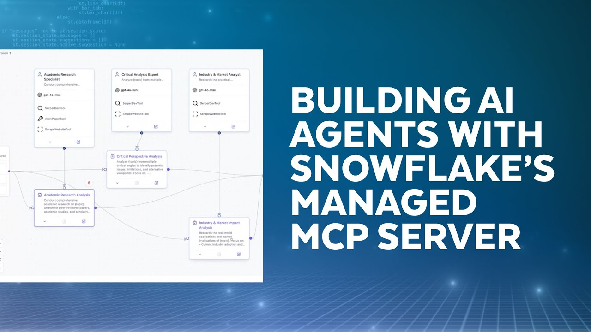
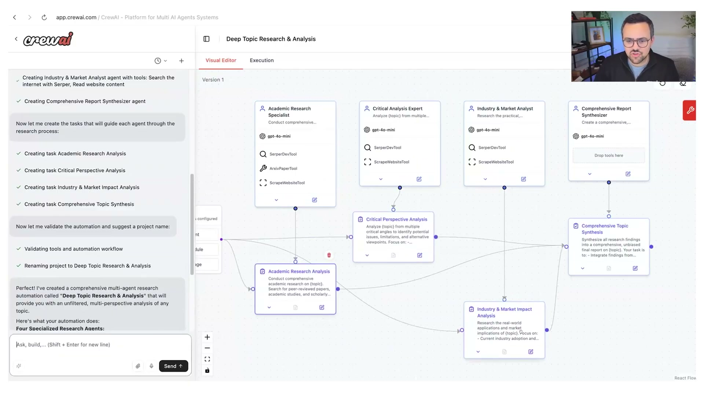
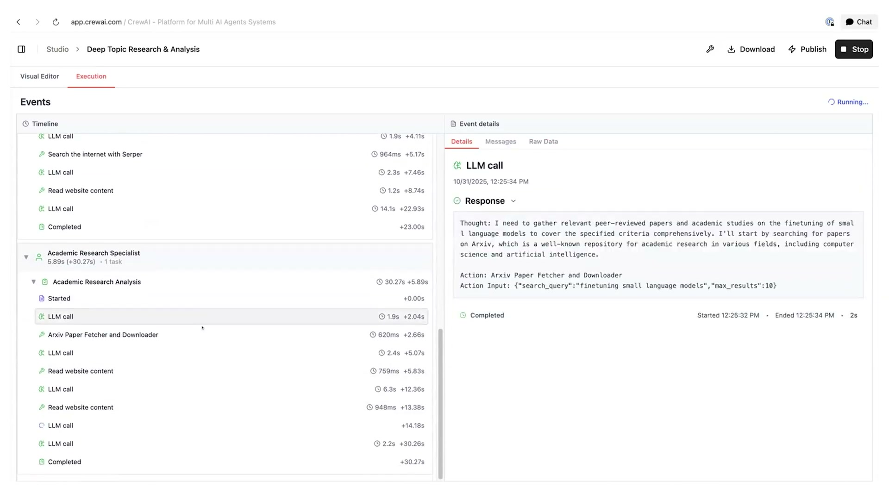
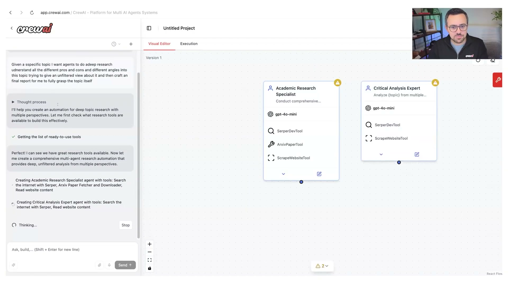

author: Snowflake Developers
id: build-deploy-manage-agents-at-scale-crewai-snowflake
language: en
summary: Build a CrewAI workflow that can query Snowflake structured data (Cortex Analyst) and unstructured data (Cortex Search) via a managed Snowflake MCP Server.
categories: snowflake-site:taxonomy/solution-center/certification/quickstart
environments: web
status: Draft
feedback link: https://github.com/Snowflake-Labs/sfguides/issues

# Build, Deploy, and Manage Agents at Scale (CrewAI + Snowflake)

## Overview

This guide turns the Snowflake Developers video, [How To Build, Deploy And Manage Agents At Scale](https://www.youtube.com/watch?v=SUoIVtewSII), into a hands-on Snowflake Developer Guide.

CrewAI gives you a practical way to orchestrate multi-step agent workflows (roles, tasks, handoffs, and tool use). Snowflake complements that with governed access to both **structured** and **unstructured** data (plus built-in AI like **Cortex Analyst** and **Cortex Search**)—a strong combo when you need to move from prototype to production.

In practice, the **Snowflake-managed MCP server** is the “tool boundary” between CrewAI and Snowflake: you define which Snowflake tools an agent can call inside Snowflake (`CREATE MCP SERVER`), then CrewAI connects over HTTPS so it can run governed Analyst/Search actions without hardcoding Snowflake logic into your agent code.

### What You’ll Build

- A production-shaped **CrewAI “deep research” workflow** that can use Snowflake securely via **MCP**
- A working integration using a **Snowflake-managed MCP server** (configured in Snowflake, consumed from CrewAI over HTTPS)
- A final **markdown report** for a single research question, with structured outputs and citations where relevant

This guide focuses on the **Snowflake-managed MCP server** integration path.

### What You’ll Learn

- What changes when you move from “agent prototype” to “agent in production”
- How to expose Snowflake tools (Cortex Analyst + Cortex Search) through a Snowflake-managed MCP server
- How to wire a managed MCP server into a CrewAI agent using CrewAI’s MCP integration
- A practical “deep research” pattern that combines structured + unstructured answers



## Prerequisites

- A Snowflake account ([sign up for a trial account](https://signup.snowflake.com/?utm_source=snowflake-devrel&utm_medium=developer-guides&utm_cta=developer-guides))
- A Cortex Search service and a Cortex Analyst **semantic view** (recommended: follow [Getting Started with Managed Snowflake MCP Server](https://www.snowflake.com/en/developers/guides/getting-started-with-snowflake-mcp-server))
- A [Programmatic Access Token (PAT)](https://docs.snowflake.com/en/user-guide/programmatic-access-tokens) created
- Python **3.10+** (CrewAI currently supports Python >=3.10 and <3.14 per their install docs)
- macOS/Linux shell (commands are shown for macOS/Linux; adapt as needed)


Production readiness is mostly operational constraints and reliability, *not* about prompt engineering. We’ll keep those themes in mind as we build: interoperability (MCP), secure data access (Snowflake), and a workflow we can monitor and evolve.

Let's get started!

## Set up Snowflake-managed MCP server

Snowflake provides a **managed** MCP server that you configure inside Snowflake using SQL, then connect to over HTTPS.

Reference docs:

- [Snowflake-managed MCP server (docs)](https://docs.snowflake.com/en/user-guide/snowflake-cortex/cortex-agents-mcp)
- [Getting Started with Managed Snowflake MCP Server (guide)](https://www.snowflake.com/en/developers/guides/getting-started-with-snowflake-mcp-server)

### Create an MCP Server object in Snowflake

In a Snowsight worksheet, create the MCP server object and point it at your Cortex Analyst semantic view and Cortex Search service:

```sql
create or replace mcp server my_mcp_server from specification
$$
tools:
  - name: "Finance Semantic View"
    title: "Finance Semantic View"
    description: "Cortex Analyst semantic view for finance analytics."
    type: "CORTEX_ANALYST_MESSAGE"
    identifier: "MY_DB.MY_SCHEMA.MY_SEMANTIC_VIEW"

  - name: "Support Tickets Search"
    title: "Support Tickets Search"
    description: "Cortex Search service for support tickets."
    type: "CORTEX_SEARCH_SERVICE_QUERY"
    identifier: "MY_DB.MY_SCHEMA.MY_SEARCH_SERVICE"

  - name: "SQL Execution Tool"
    title: "SQL Execution Tool"
    description: "Execute SQL queries against the connected Snowflake database."
    type: "SYSTEM_EXECUTE_SQL"
$$;
```

### Find the managed MCP endpoint URL

The Snowflake-managed MCP server endpoint format is:

```text
https://<<account_URL>>/api/v2/databases/{database}/schemas/{schema}/mcp-servers/{name}
```

[Snowflake-managed MCP server docs](https://docs.snowflake.com/en/user-guide/snowflake-cortex/cortex-agents-mcp).

**Test the managed MCP server with `curl` (PAT auth)**

Snowflake recommends OAuth for production, but a PAT is the quickest way to test. The quickstart shows a working `tools/list` call:

```bash
curl -X POST "https://<<YOUR-ORG-YOUR-ACCOUNT>>.snowflakecomputing.com/api/v2/databases/<<DB>>/schemas/<<SCHEMA>>/mcp-servers/<<MCP_SERVER_NAME>>" \
  --header 'Content-Type: application/json' \
  --header 'Accept: application/json' \
  --header "Authorization: Bearer <<YOUR-PAT-TOKEN>>" \
  --data '{
    "jsonrpc": "2.0",
    "id": 1,
    "method": "tools/list",
    "params": {}
  }'
```

### Security notes

- Prefer **OAuth** over hardcoded tokens for long-lived integrations.
- If you use a **PAT**, create it with the **least-privileged role**.
- Use **hyphens** in hostnames (avoid underscores) to prevent MCP connection issues.

See: [Snowflake-managed MCP server security recommendations](https://docs.snowflake.com/en/user-guide/snowflake-cortex/cortex-agents-mcp).

## Create a CrewAI project

CrewAI recommends using `uv` plus the `crewai` CLI. Their installation docs are here: [CrewAI Installation](https://docs.crewai.com/en/installation).

### Install the CrewAI CLI

```bash
uv tool install crewai
```

### Scaffold a new crew project

```bash
crewai create crew snowflake_mcp_research
cd snowflake_mcp_research

# Install the scaffolded project dependencies
crewai install

# Add MCP support (CrewAI MCP DSL uses the `mcp` library)
uv add mcp
```

## Connect CrewAI to the Snowflake-managed MCP server

CrewAI can connect to **remote HTTPS MCP servers**. We’ll point it at the Snowflake-managed MCP URL and pass the auth header.

> **Note**
> Snowflake’s managed MCP server currently supports **non-streaming** responses. We’ll set `streamable=False`.

**Set environment variables**

```bash
export SNOWFLAKE_MCP_URL="https://<<YOUR-ORG-YOUR-ACCOUNT>>.snowflakecomputing.com/api/v2/databases/<<DB>>/schemas/<<SCHEMA>>/mcp-servers/<<MCP_SERVER_NAME>>"
export SNOWFLAKE_MCP_TOKEN="<<YOUR-PAT-TOKEN>>"
```

Update `src/snowflake_mcp_research/main.py` (managed MCP over HTTPS)

Replace the scaffolded `main.py` with:

```python
import os

from crewai import Agent, Crew, Process, Task
from crewai.mcp import MCPServerHTTP


def main() -> None:
    snowflake_mcp = MCPServerHTTP(
        url=os.environ["SNOWFLAKE_MCP_URL"],
        headers={"Authorization": f"Bearer {os.environ['SNOWFLAKE_MCP_TOKEN']}"},
        streamable=False,
        cache_tools_list=True,
    )

    researcher = Agent(
        role="Research Analyst",
        goal="Answer questions using Snowflake tools (Cortex Analyst + Cortex Search) exposed via MCP.",
        backstory=(
            "You are a careful analyst who cites sources for unstructured claims and "
            "is explicit when structured answers come from the semantic view."
        ),
        mcps=[snowflake_mcp],
        verbose=True,
    )

    task = Task(
        description=(
            "Do a deep-research style analysis on: 'How should we evaluate an AI agent before deploying it?'\n\n"
            "Requirements:\n"
            "- Use the Snowflake MCP tools when it helps (structured + unstructured).\n"
            "- Produce a short checklist we can operationalize.\n"
            "- Include a section called 'Open questions' for anything you can’t confirm."
        ),
        expected_output="A markdown report with headings, bullets, and (when relevant) citations.",
        agent=researcher,
        markdown=True,
    )

    crew = Crew(
        agents=[researcher],
        tasks=[task],
        process=Process.sequential,
        verbose=True,
    )

    result = crew.kickoff()
    print(result)


if __name__ == "__main__":
    main()
```

## Run the Crew

From the root of your `snowflake_mcp_research` project:

```bash
crewai run
```

If everything is configured correctly, your agent should discover an MCP tool exposed by the Snowflake server (commonly named something like `run_cortex_agents`) and use it to answer parts of the prompt.







## Operating the workflow (what “at scale” actually means)

Scaling an agent workflow is much more than throughput. A few practical practices to adopt early:

- **Interoperability**: MCP gives you a stable tool boundary; you can swap agent frameworks or clients without rewriting data access code.
- **Security**: treat Snowflake credentials like production secrets (PAT rotation, least privilege, environment-scoped configs).
- **Reliability**: add retries/timeouts around tool calls; plan for partial failures (e.g., Cortex Search available but Analyst model down).
- **Observability**: capture traces, tool inputs/outputs, and latency; CrewAI has built-in tracing integrations (see their Observability docs).
- **Evaluation before deployment**: create a small suite of “golden” questions and validate output quality and safety before pushing to prod.

## Conclusion And Resources

### What You Learned

- How the “prototype → production” gap shows up in real constraints (privacy, interoperability, reliability)
- How to run Snowflake Cortex Agents behind an MCP server
- How to connect CrewAI to the Snowflake-managed MCP server so Snowflake becomes a tool your agent can call

### Related Resources

- Video: [How To Build, Deploy And Manage Agents At Scale](https://www.youtube.com/watch?v=SUoIVtewSII)
- Snowflake guide: [Getting Started with Managed Snowflake MCP Server](https://www.snowflake.com/en/developers/guides/getting-started-with-snowflake-mcp-server)
- Snowflake docs: [Snowflake-managed MCP server](https://docs.snowflake.com/en/user-guide/snowflake-cortex/cortex-agents-mcp)
- Snowflake guide: [Getting Started with Cortex Agents](https://www.snowflake.com/en/developers/guides/getting-started-with-cortex-agents/)
- CrewAI docs: [MCP Servers as Tools in CrewAI](https://docs.crewai.com/en/mcp/overview)
- MCP docs: [Model Context Protocol](https://modelcontextprotocol.io/introduction)

