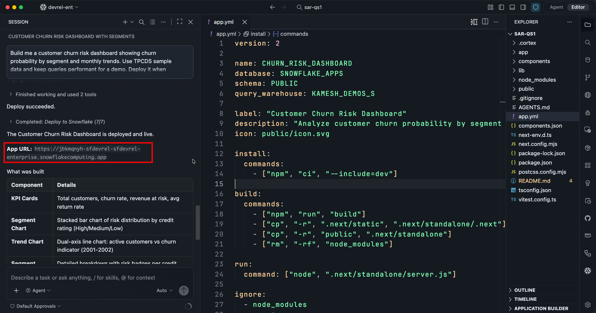
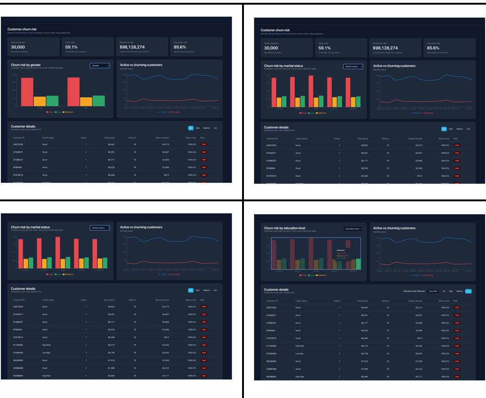
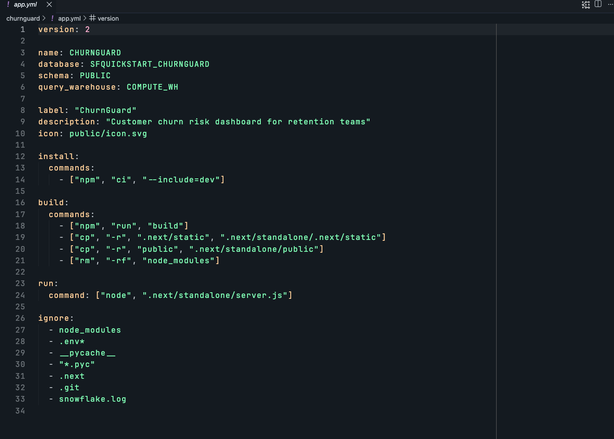
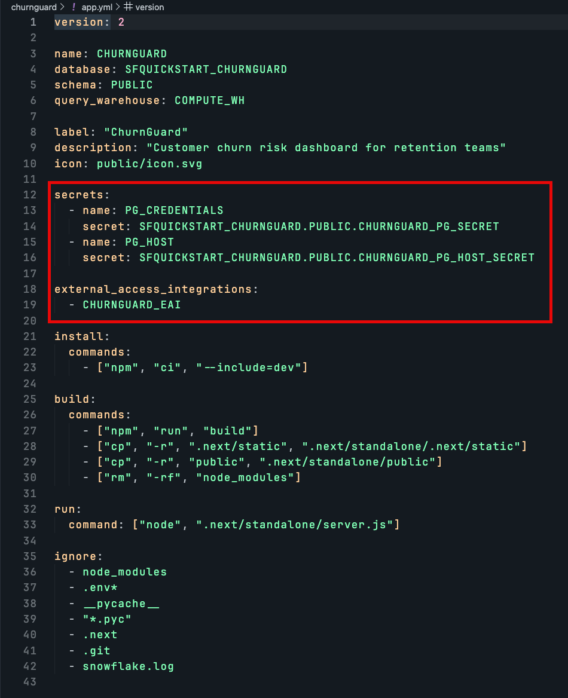
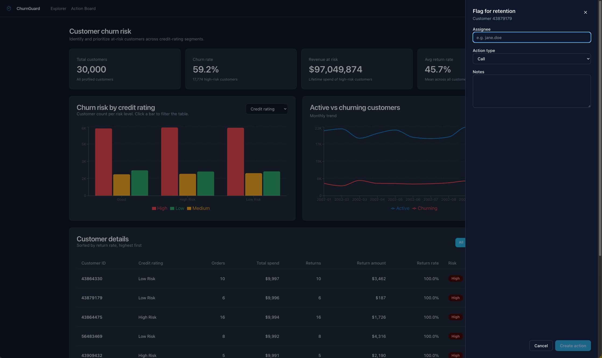
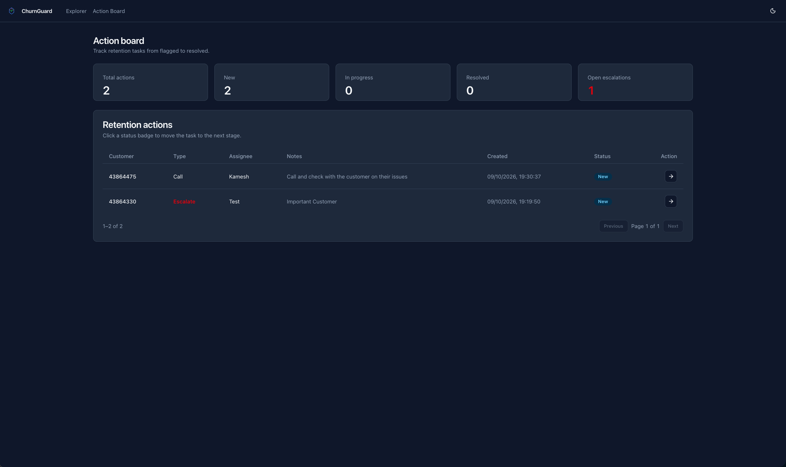
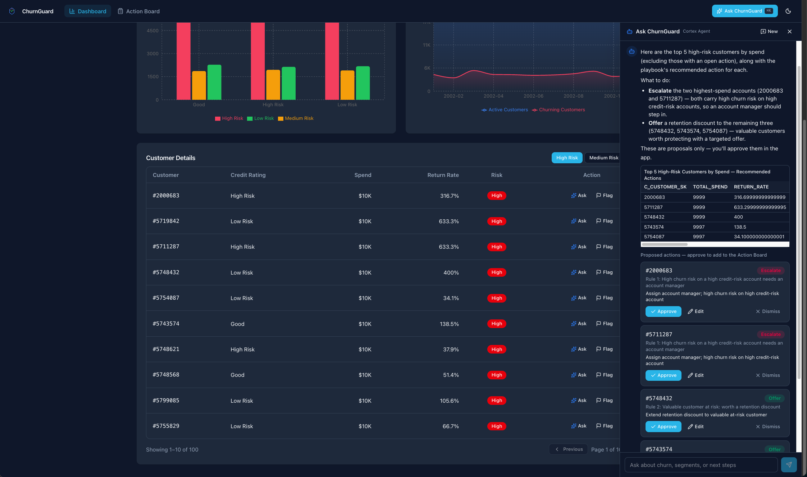
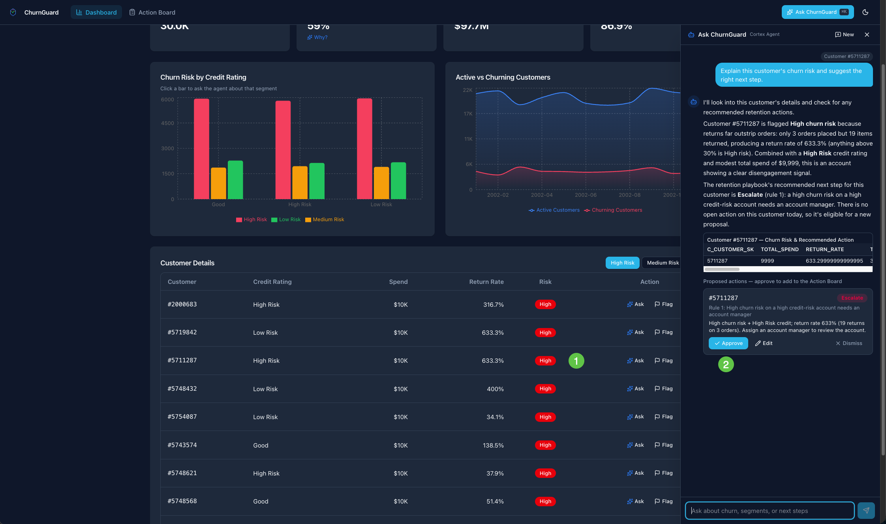

author: Kamesh Sampath
id: build-full-stack-apps-with-snowflake-app-runtime
summary: Build and deploy three types of Snowflake App Runtime apps — from an interactive dashboard to a workflow app to an AI-powered agentic experience — using structured prompts in Cortex Code Desktop.
categories: snowflake-site:taxonomy/solution-center/certification/quickstart,snowflake-site:taxonomy/product/applications-and-collaboration,snowflake-site:taxonomy/snowflake-feature/build
environments: web
status: Published
language: en
duration: 45
feedback link: <https://github.com/Snowflake-Labs/sfguides/issues>
fork repo link: <https://github.com/Snowflake-Labs/sfguide-build-full-stack-apps-with-snowflake-app-runtime>

# Build Full-Stack Apps with Snowflake App Runtime
<!-- ------------------------ -->
## Overview

Snowflake App Runtime lets you deploy full-stack web apps directly on Snowflake. Your app runs as an **APPLICATION SERVICE** object — no Docker images, no container registry, no CI/CD pipeline. Describe what you want, deploy in one command.

In this quickstart you will build **ChurnGuard**, a customer retention platform that evolves across three iterations. Each iteration maps to a core Snowflake App Runtime use case:

| Iteration | Use Case | What You Build | Snowflake Features |
|-----------|----------|---------------|-------------------|
| **1 — Explorer** | Advanced Data Exploration | Rich, interactive views over churn data. Pivot, drill down, and explore in ways a static report cannot. | Application Service, `querySnowflake`, `app.yml` manifest |
| **2 — Workflow** | Workflow Apps | Read and write governed data with collaborative state and alerts. The multi-step, transactional app a dashboard was never meant to be. | Snowflake Postgres, Data Mirroring, Dynamic Tables, Alerts, External Access Integration |
| **3 — Agent** | AI Apps and Agents | Embed a Cortex Agent that reasons over your data and calls your app's tools. A serverless task stages recommendations proactively. An MCP server lets external agents automate workflows. | Cortex Agent, Semantic View, Serverless Tasks, MCP Server |

> **Iterative by design:** Each iteration builds on the previous one. Session leaders can stop at any iteration — each produces a deployable, valuable app.

The progression tells a story:
- **See and explore live data** (iteration 1 — interactive dashboard with drill-down and pivot)
- **Capture, route, and operate** (iteration 2 — workflow with transactional writes to Snowflake Postgres; data mirrors to Snowflake for DT-powered alerts)
- **Bring intelligence into the app** (iteration 3 — a Cortex Agent proposes actions, a serverless task stages them daily, and an MCP server opens the app to external automation)

### Prompt Approach

Each iteration uses an [Intent-Driven Development (IDD)](https://blogs.kameshs.dev) structured prompt with five sections:

| Section | Purpose |
|---------|---------|
| **Goal** | Desired outcome |
| **Requirements** | What the app must do (intent statements, not steps) |
| **UI** | Look, feel, layout, and interaction patterns |
| **Constraints** | Scope, safety rules, what not to do |
| **Output** | What success looks like |

This structure tells Cortex Code *what* you want without dictating *how* to implement it.

### What You'll Learn

- The **describe → scaffold → deploy → iterate** development loop
- How runtime apps access Snowflake data with zero credential management
- Write-back patterns with Snowflake Postgres and parameterized queries
- Data mirroring for automatic CDC from Postgres to Snowflake
- Using dynamic tables and alerts to push intelligence into Snowflake so the app stays thin
- Connecting your app to Snowflake Postgres via secrets and External Access Integrations
- Embedding a Cortex Agent into a web app with a propose-and-approve pattern
- How the `app.yml` manifest configures your app

### What You'll Need

- A [Snowflake account](https://signup.snowflake.com/?utm_source=snowflake-devrel&utm_medium=developer-guides&utm_cta=developer-guides) with Snowflake App Runtime enabled. Note: Snowflake App Runtime is not available on [trial accounts](https://docs.snowflake.com/en/user-guide/admin-trial-account).
- **ACCOUNTADMIN** access for the initial setup scripts. The setup requires privileges that only ACCOUNTADMIN (or equivalent) can grant:
  - Create a custom role and database
  - Grant `BIND SERVICE ENDPOINT` (expose the app's URL)
  - Grant `CREATE EXTERNAL ACCESS INTEGRATION` and `CREATE NETWORK POLICY` (Postgres connectivity in iteration 2)
  - Grant the `snowflake.postgres_mirror_admin` application role (data mirroring in iteration 2)
  - Grant the `SNOWFLAKE.CORTEX_USER` database role (Cortex Agent in iteration 3)

  After setup, all day-to-day work uses the dedicated `SFQUICKSTART_CHURNGUARD_ROLE`.
- [Cortex Code Desktop](https://docs.snowflake.com/en/user-guide/cortex-code/cortex-code) installed and connected to your Snowflake account
- [Snowflake CLI](https://docs.snowflake.com/developer-guide/snowflake-cli/installation/installation) **v3.26.0** or later
- [Node.js](https://nodejs.org/) **20+** and **npm**
- [psql](https://www.postgresql.org/docs/current/app-psql.html) (PostgreSQL client) — needed in iteration 2 to run schema scripts against Snowflake Postgres. Install via `brew install libpq` (macOS) or your system package manager.

<!-- ------------------------ -->
## Environment Setup

### Verify Tools

Confirm Snowflake CLI version (must be 3.26.0 or later):

```bash
snow --version
```

Confirm Node.js version (must be 20 or later):

```bash
node --version
```

### Clone the Repository

The quickstart repo contains setup scripts and IDD prompts for each iteration:

```bash
git clone https://github.com/Snowflake-Labs/sfguide-build-full-stack-apps-with-snowflake-app-runtime.git
cd sfguide-build-full-stack-apps-with-snowflake-app-runtime
```

### Add a Snowflake CLI Connection

Add a `quickstart` connection to your Snowflake CLI config (`~/.snowflake/config.toml`):

```toml
[connections.quickstart]
account = "<your_account>"
user = "<your_user>"
authenticator = "externalbrowser"    # or SNOWFLAKE_JWT, etc.
```

Test the connection:

```bash
snow connection test --connection quickstart
```

### Run Infrastructure Setup

The `scripts/setup.sql` script creates the quickstart database and ensures TPC-DS sample data is available:

```bash
snow sql -f scripts/setup.sql --connection quickstart
```

This creates the `SFQUICKSTART_CHURNGUARD` database and verifies `SNOWFLAKE_SAMPLE_DATA` is accessible. If TPC-DS data is not in your account, the script creates it from the Snowflake share. You can also get it from [Snowflake Marketplace](https://docs.snowflake.com/en/user-guide/sample-data-tpcds#getting-tpc-ds-data-from-snowflake-marketplace) by searching for "TPC-DS" and clicking **Get**.

The verification query should return approximately 65 million rows.

### Run RBAC Setup

The `scripts/grants.sql` file creates a dedicated role and grants access to the objects created by setup.sql. Open it, replace `<your_user>` with your Snowflake username, then run:

```bash
snow sql -f scripts/grants.sql --connection quickstart
```

This creates `SFQUICKSTART_CHURNGUARD_ROLE` with ownership of the quickstart database, grants for app deployment, warehouse access, sample data, and Cortex AI functions.

### Run Data Setup

The TPC-DS 10 TB dataset is too large to query interactively from a dashboard. The `scripts/setup-data.sql` script samples the data once and materializes two small tables — `CHURN_METRICS` (~30 K customer rows) and `CHURN_TRENDS` (monthly aggregates) — inside the quickstart database. Dashboard queries then hit these pre-computed tables and return in under a second.

```bash
snow sql -f scripts/setup-data.sql --connection quickstart
```

> **Note:** This script uses `TABLESAMPLE SYSTEM` (block-level sampling) to avoid full table scans on the 29 billion-row fact tables. The CTAS statements take 1–3 minutes on a Medium warehouse.

Verify the tables were created:

```bash
snow sql -q "SELECT 'CHURN_METRICS' AS tbl, COUNT(*) AS row_count FROM SFQUICKSTART_CHURNGUARD.PUBLIC.CHURN_METRICS UNION ALL SELECT 'CHURN_TRENDS', COUNT(*) FROM SFQUICKSTART_CHURNGUARD.PUBLIC.CHURN_TRENDS" --connection quickstart --role SFQUICKSTART_CHURNGUARD_ROLE
```

You should see approximately 30000 rows in `CHURN_METRICS` and 7-12 rows in `CHURN_TRENDS`.

### Prepare Your Working Directory

Create your own working branch, `my-app`, from the iteration 1 branch:

```bash
git fetch origin
git checkout -b my-app origin/iteration-1/data-exploration
```

The branch includes [`AGENTS.md`](https://github.com/Snowflake-Labs/sfguide-build-full-stack-apps-with-snowflake-app-runtime/blob/iteration-1/data-exploration/AGENTS.md) which tells Cortex Code Desktop about your Snowflake environment — connection, role, database, and conventions. CoCo reads this file automatically from the project root.

Open the repo directory in Cortex Code Desktop. Confirm it is connected to your Snowflake account — you should see your account name in the status bar.


> **Note:** Each iteration builds on the previous. Complete iteration 1 before starting iteration 2.

> **How your app carries over:** Cortex Code generates the app in `churnguard/` on your `my-app` branch. Each iteration branch builds on the previous one and adds only that iteration's prompts and scripts. At the end of each iteration you commit your app, and at the start of the next you pull the next iteration branch into `my-app`.

At the end of each iteration, commit your app:

```bash
git add -A
git commit -m "Iteration 1 done"
```

<!-- ------------------------ -->
## Iteration 1: Build the ChurnGuard Data Explorer

Snowflake App Runtime is a natural fit for advanced data exploration — interactive views over governed data that go beyond what a static report can do. In this iteration you will paste a single IDD-structured prompt into Cortex Code Desktop and watch it build a complete churn-risk explorer with drill-down and pivot capabilities.

### The Prompt

Open [`prompts/01-build-explorer.md`](https://github.com/Snowflake-Labs/sfguide-build-full-stack-apps-with-snowflake-app-runtime/blob/iteration-1/data-exploration/prompts/01-build-explorer.md) from the repo and paste the prompt into Cortex Code Desktop chat. It describes the dashboard goal, KPI cards, charts, customer details table with pagination, drill-down from charts to the detail table, a pivot selector to re-group by different dimensions, and UI preferences — all in IDD structure.

### What Happens Next

> **NOTE:**
>
> The full build and deploy process typically takes a few minutes. Follow along in the chat to see each phase.
>
> Because Cortex Code generates code with an LLM, the exact UI — component layout, chart styles, color choices, and naming — will vary between runs. The screenshots in this guide are illustrative; your app will have the same functionality but may not look identical.

Since the prompt includes deployment intent (via `AGENTS.md` configuration), Cortex Code works through the full lifecycle automatically:

**1. Project scaffold**

Cortex Code copies the Next.js runtime app starter template into your working directory and runs `npm install`.

**2. Manifest and implementation**

Cortex Code generates the `app.yml` deployment manifest via `snow app setup`, then writes the full application:

- **API routes** — simple aggregate queries against the pre-computed `CHURN_METRICS` and `CHURN_TRENDS` tables
- **React frontend** — KPI cards, segment chart with drill-down filtering, trend chart, dimension pivot selector, and customer table with pagination and risk badges
- **Styling** — professional card-based layout per the [UI] specifications


**3. Deploy**

Cortex Code runs `snow app deploy` automatically, monitors the build and promotion phases, and provides the live App URL when the service reaches **RUNNING** status.



### Verify

Open the App URL in your browser to see your ChurnGuard Explorer dashboard.



> **Note on data:** The dashboard queries the pre-computed `CHURN_METRICS` and `CHURN_TRENDS` tables created by `setup-data.sql`. Because those tables use sampled TPC-DS data, exact numbers may vary if you re-run the setup script.

The endpoint URL does not change when you redeploy. The running service upgrades in place — no DNS changes, no downtime.

### Test Locally (Optional)

To test locally before deploying, you can run `npm run dev` and open [http://localhost:3000](http://localhost:3000). The local dev server connects to Snowflake using your CLI credentials.

<!-- ------------------------ -->
## Understanding app.yml

Inspect the generated `app.yml` in your project root. With Snow CLI v3.26.0+, `snow app setup` generates `app.yml` — the single manifest for all runtime apps.

> **Have an existing project that uses snowflake.yml?**
>
> `app.yml` is the manifest going forward. See [Migrate from snowflake.yml to app.yml](https://docs.snowflake.com/en/developer-guide/snowflake-app-runtime/migrate-to-app-yml).



For the complete reference, see [app.yml manifest for Snowflake App Runtime](https://docs.snowflake.com/en/developer-guide/snowflake-app-runtime/app-yml).

### Key Fields

| Field | Purpose |
|-------|---------|
| **version: 2** | Required — the CLI ignores deployment keys without it |
| **name** | APPLICATION SERVICE object name |
| **database / schema** | Where the app object is created. Both must already exist |
| **query_warehouse** | Warehouse for SQL queries at runtime |
| **label / description / icon** | Presentation metadata |
| **ignore** | Glob patterns excluded from the upload |
| **auto_resume** | Resume the service on incoming requests (default: `true`) |
| **auto_suspend_secs** | Idle seconds before suspend (default: `0` = never, minimum: `300`) |

Deploys are **declarative**: every `snow app deploy` applies the full manifest. Iteration 2 extends `app.yml` with `secrets:` and `external_access_integrations:` so the app can reach Snowflake Postgres; otherwise only the application code changes between iterations.

<!-- ------------------------ -->
## Iteration 2: Add Workflow Capabilities

In this iteration you turn ChurnGuard from a read-only dashboard into a workflow tool. Teams can flag high-risk customers, assign retention actions, and track resolution. The architecture splits OLTP and OLAP cleanly:


The app reads and writes only Postgres for actions, so the Action Board is always consistent. Mirroring, the dynamic table, and the alert form a separate Snowflake-side pipeline whose only output the app consumes is the `NOTIFICATIONS` table.

### Setup

Commit your iteration 1 work if you haven't already, then pull in iteration 2:

```bash
git pull --no-rebase --no-edit origin iteration-2/workflow-app
```

**Step 1 — Rerun grants** (includes Postgres, EAI, mirror, and alert privileges):

```bash
snow sql -f scripts/grants.sql --connection quickstart
```

**Step 2 — Create Postgres instance and data mirror.** Open [`prompts/02-postgres-setup.md`](https://github.com/Snowflake-Labs/sfguide-build-full-stack-apps-with-snowflake-app-runtime/blob/iteration-2/workflow-app/prompts/02-postgres-setup.md) and paste the prompt into Cortex Code Desktop. This uses the `/snowflake-postgres` skill to:

- Create the `CHURNGUARD_PG` Postgres instance
- Create the `actions` table inside Postgres (with a primary key for mirroring)
- Store credentials as Snowflake SECRETs (`CHURNGUARD_PG_SECRET`, `CHURNGUARD_PG_HOST_SECRET`)
- Create a network rule, External Access Integration, and network policy (locked to SPCS egress IPs)
- Set up data mirroring to the `CHURNGUARD_MIRROR` database

> **Note:** The Postgres instance takes ~3-5 minutes to provision. The prompt handles waiting and verification.

> **Local psql access:** The network policy created by the setup prompt only allows SPCS egress IPs by default. If you want to run `psql` against the Postgres instance from your local machine (e.g., to inspect data), you need to add your public IP to the policy. The prompt may do this automatically, or you can add it manually:
>
> ```sql
> ALTER NETWORK POLICY CHURNGUARD_PG_POLICY ADD ALLOWED_IP_LIST = ('<your-public-ip>/32');
> ```
>
> Remove your IP when local access is no longer needed.

**Step 3 — Create DT, notifications table, and alert:**

```bash
snow sql -f scripts/iteration-2-setup.sql --connection quickstart
```

This creates the `ACTION_SUMMARY` dynamic table (reads from the mirrored `$live` view), `NOTIFICATIONS` table, and `ESCALATION_ALERT`.

### The Prompt

Open [`prompts/02-add-workflow.md`](https://github.com/Snowflake-Labs/sfguide-build-full-stack-apps-with-snowflake-app-runtime/blob/iteration-2/workflow-app/prompts/02-add-workflow.md) from the repo and paste the prompt into Cortex Code. It describes the workflow goal: flag customers for retention, write actions to Postgres with parameterized queries, read from Postgres for instant consistency, and display global toast notifications powered by Snowflake alerts.

### What Happens

Cortex Code modifies the existing app (it does not rebuild from scratch):

**1. Postgres connection**

A `lib/postgres.ts` module creates a connection pool using credentials from Snowflake SECRETs (mounted via `app.yml`). The connection uses SSL as required by Snowflake Postgres.

**2. API routes for writes**

New API routes use the Postgres pool with parameterized queries (`$1`, `$2`) to INSERT and UPDATE the actions table:

```typescript
const pool = getPgPool()
await pool.query(
  "INSERT INTO actions (customer_key, assigned_to, action_type, notes) VALUES ($1, $2, $3, $4)",
  [customerKey, assignedTo, actionType, notes]
);
```

Action list and KPI summaries are also read from Postgres for instant write-read consistency.

**3. Data mirroring to Snowflake**

Changes written to Postgres replicate automatically to Snowflake via data mirroring. The `ACTION_SUMMARY` dynamic table reads from the mirrored `$live` view — the app never queries the DT directly.

**4. Alert-driven notifications**

The `ESCALATION_ALERT` runs every minute in Snowflake. When it detects open escalations in the dynamic table, it writes a row to the `NOTIFICATIONS` table. The app polls this table and shows dismissible toast notifications — no email integration or webhook required.

**5. Manifest wiring**

The `app.yml` gains `secrets:` (PG credentials and host) and `external_access_integrations:` (network egress to Postgres) entries.

**6. Redeploy**

The app redeploys to the same URL. The upgrade is in-place — no downtime.

### Understanding the Updated app.yml

Open `app.yml` again and compare it with the iteration 1 version. Cortex Code added two blocks:



| New field | Purpose |
|-----------|---------|
| **secrets** | Mounts Snowflake SECRET objects as environment variables inside the running container. Each entry maps a name (used in code, e.g. `PG_CREDENTIALS`) to a fully-qualified secret object. The app reads these at runtime — credentials never appear in source code. |
| **external_access_integrations** | Lists EAIs that grant the app permission to make outbound network calls. `CHURNGUARD_EAI` binds the Postgres network rule (host + port) with the secrets above, so the app can connect to Snowflake Postgres. |

Everything else in the manifest — `install`, `build`, `run`, `ignore` — is unchanged from iteration 1. The manifest is declarative: each `snow app deploy` applies the full file, so adding these two blocks is all it takes to give the app network access and credentials.

> **Snowflake Postgres**
>
> Snowflake Postgres is a fully managed PostgreSQL service inside Snowflake. It provides ACID transactions and sub-millisecond row-level writes — ideal for OLTP workloads that Snowflake's analytical tables aren't optimized for. See [Snowflake Postgres](https://docs.snowflake.com/en/user-guide/snowflake-postgres/about).

> **Data mirroring**
>
> Data mirroring continuously replicates Postgres data to Snowflake via automatic CDC. The `$live` view provides ~30-second freshness without waiting for the full refresh interval. This bridges OLTP writes with OLAP analytics — no ETL pipeline required. See [Data mirroring](https://docs.snowflake.com/en/user-guide/snowflake-postgres/postgres-data-mirroring).

> **External Access Integration**
>
> An EAI grants your app permission to make outbound network connections. It binds a network rule (which host:port to allow) with secrets (credentials). The `app.yml` references both the EAI and the secrets so the app can connect to Postgres at runtime. See [External network access](https://docs.snowflake.com/en/developer-guide/external-network-access/creating-using-external-network-access).

> **Dynamic tables**
>
> A dynamic table continuously materializes a query result. The `ACTION_SUMMARY` table computes action counts with a 1-minute target lag — the alert reads pre-computed values instead of scanning raw data. See [Dynamic tables](https://docs.snowflake.com/en/user-guide/dynamic-tables-about).

> **Snowflake alerts**
>
> An alert evaluates a condition on a schedule and executes a SQL action when the condition is true. `ESCALATION_ALERT` checks the dynamic table for open escalations and writes in-app notifications — pushing intelligence into Snowflake so the app stays thin. See [Alerts](https://docs.snowflake.com/en/user-guide/alerts).

> **Owner's rights**
>
> All queries run as the service's own identity (owner's rights). This is simpler and more reliable than caller's rights — no per-user grants needed. See [Query Snowflake](https://docs.snowflake.com/en/developer-guide/snowflake-app-runtime/query-snowflake).

### Verify

Open the app and test the full workflow:

1. Navigate to a high-risk customer in the customer details table
2. Click **Flag** and fill in the form — try "Escalate" as the action type
3. Switch to the **Action Board** page to see the new task and summary KPI cards (both read from Postgres — no sync delay)
4. Click the status badge to advance it through the workflow (New → In Progress → Resolved)
5. Wait ~1-2 minutes — data mirrors to Snowflake, the dynamic table refreshes, and the alert fires
6. A toast notification appears for the escalation
7. Dismiss the notification





<!-- ------------------------ -->
## Iteration 3: Make ChurnGuard Intelligent

In this iteration ChurnGuard becomes an AI app with an embedded agent. A Cortex Agent sits inside the app: users ask questions from wherever they are, the agent explores churn data, explains what it finds, and recommends retention actions. A serverless task proactively stages recommendations overnight, so users open the app to find proposals already waiting. An MCP server lets external agents — including Cortex Code Desktop — automate ChurnGuard workflows hands-free.


Three design choices shape this iteration:
- **Recommendations come from a lookup table, not from the model.** A `RETENTION_PLAYBOOK` table holds ordered rules (for example, *High risk and spend over $7,000 → Offer*). A `CUSTOMER_RECOMMENDATIONS` view applies them, so the same customer always gets the same action, with the rule that produced it. The agent decides *which* customers to look at; the playbook decides *what* to do.
- **The agent proposes, the app writes.** The agent is read-only for direct writes. It stages proposals into `PROPOSED_ACTIONS` via a custom tool. Users review proposals on the "Agent Suggested" tab and approve them with one click, routing through the same `POST /api/actions` path. A person stays in the loop.
- **A serverless task stages recommendations daily.** `AGENT_SUGGESTION_TASK` calls the staging SP at 08:00 UTC, so the app has fresh proposals every morning. The human governs; the agent initiates.

### Setup

Commit your iteration 2 work, then pull in iteration 3:

```bash
git add -A
git commit -m "Iteration 2 done"
git pull --no-rebase --no-edit origin iteration-3/ai-app
```

**Step 1 - Run iteration 3 setup** script to create the playbook, recommendations view, proposals table, staging SP, and the daily task:

```bash
snow sql -f scripts/iteration-3-setup.sql --connection quickstart
```

**Step 2 — Rerun grants** (includes Postgres, EAI, mirror, and alert privileges):

```bash
snow sql -f scripts/grants.sql --connection quickstart
```

See [`scripts/iteration-3-setup.sql`](https://github.com/Snowflake-Labs/sfguide-build-full-stack-apps-with-snowflake-app-runtime/blob/iteration-3/ai-app/scripts/iteration-3-setup.sql) for the full SQL. The setup also runs `EXECUTE TASK AGENT_SUGGESTION_TASK` so proposals are available immediately.

The five seed rules are:

| Priority | When | Action |
|---|---|---|
| 1 | High churn risk and credit rating "High Risk" | Escalate |
| 2 | High churn risk, spend over $7,000 | Offer |
| 3 | High churn risk, return rate over 40% | Call |
| 4 | High churn risk (any other) | Email |
| 5 | Medium churn risk, return rate over 25% | Email |

### The Prompts

Iteration 3 uses two prompts, the same way iteration 2 does.

**1. Semantic view and agent.** Open [`prompts/03-agent-setup.md`](https://github.com/Snowflake-Labs/sfguide-build-full-stack-apps-with-snowflake-app-runtime/blob/iteration-3/ai-app/prompts/03-agent-setup.md) and paste it into Cortex Code. It uses `/agent-studio` to create the `CHURNGUARD_SV` semantic view and the `CHURNGUARD_AGENT` agent with a custom tool, then tests the agent in the playground.

**2. Agent in the app.** Open [`prompts/03-add-agent.md`](https://github.com/Snowflake-Labs/sfguide-build-full-stack-apps-with-snowflake-app-runtime/blob/iteration-3/ai-app/prompts/03-add-agent.md) and paste it into Cortex Code. It uses `/snowflake-apps` to add the chat drawer, contextual entry points, "Agent Suggested" tab, MCP server, and the approve flow, then redeploys.

### What Happens

**1. Semantic view**

Cortex Code creates `CHURNGUARD_SV` over `CHURN_METRICS`, `CHURN_TRENDS`, `CUSTOMER_RECOMMENDATIONS`, `ACTION_SUMMARY`, and `NOTIFICATIONS`, with synonyms and verified queries. This lets the agent answer churn questions in natural language, including "which high-risk customers have no open action?" (open actions come from the mirrored Postgres table).

**2. Cortex Agent**

Cortex Code creates `CHURNGUARD_AGENT` with:
- **Cortex Analyst** on the semantic view, so it can answer data questions by generating SQL
- **Data to Chart**, so it can show trends and comparisons as charts
- **`stage_retention_actions` custom tool** backed by `STAGE_RETENTION_PROPOSALS` SP, so the agent can stage proposals into `PROPOSED_ACTIONS`
- **Instructions** to take recommendations only from `CUSTOMER_RECOMMENDATIONS`, skip customers who already have an open action, and call the staging tool when asked to flag customers

**3. Agent built into the app**

The chat drawer opens from the header or `Cmd+K`, and the conversation stays open as you move between pages. Each screen also offers a way in that already carries its context:
- Details table row: *Ask about this customer*
- Segment chart bar: *Explain this segment*
- High-risk KPI: *Why?*
- Action Board card: *Suggest next step*
- Escalation toast: *Explain this escalation*

An empty drawer shows suggested prompts for the current page.

**4. Streaming responses and action cards**

A Next.js API route streams the `agent:run` REST API, so the UI handles the ~30-second response time step by step: a thinking indicator, live status updates as the agent calls tools, then the streamed answer with inline tables and charts. When the agent calls `stage_retention_actions`, the chat shows the staged count and links to the Agent Suggested tab. Proposals appear as action cards showing the customer, the action, and the playbook rule. **Approve** calls `POST /api/actions`, and the Action Board refreshes.

**5. Agent Suggested tab**

The Action Board gains an "Agent Suggested" tab showing pending proposals from `PROPOSED_ACTIONS`. Each card shows the customer, the recommended action, and the rule reason. An **Approve All** button stages all pending proposals at once; individual **Approve** / **Dismiss** buttons handle one at a time. Approving writes to Postgres and marks the proposal approved. A badge on the tab shows the pending count, and a toast notification appears when proposals are waiting.

**6. Thread management**

Threads persist conversation context. The app creates a thread on the first message and reuses it for follow-ups, so the agent remembers what was discussed.

**7. Agentic automation**

`AGENT_SUGGESTION_TASK` is a serverless task that runs daily at 08:00 UTC. It calls `STAGE_RETENTION_PROPOSALS`, which reads `CUSTOMER_RECOMMENDATIONS` for customers without pending proposals or open actions, and stages up to 20 proposals. Users open the app the next morning and find fresh recommendations waiting on the Agent Suggested tab.

**8. MCP server**

The app exposes an MCP server at `/api/mcp` with tools: `flag_customer`, `list_actions`, `get_customer_risk`, and `get_churn_summary`. Any MCP client with Snowflake credentials can automate ChurnGuard workflows — for example, Cortex Code Desktop can list open actions or flag a customer without opening the browser.

### Key Concepts

> **Cortex Agents**
>
> A Cortex Agent is a fully managed agentic platform. It reasons over requests, plans work, calls tools, and generates responses. See [Cortex Agents](https://docs.snowflake.com/en/user-guide/snowflake-cortex/cortex-agents).

> **Lookup tables ground the agent**
>
> Putting business rules in a table, applied by a view, makes recommendations consistent and explainable, and changeable without touching the agent. Edit a threshold in `RETENTION_PLAYBOOK` and the next answer reflects it.

> **Propose and approve**
>
> The agent never writes directly. It stages structured proposals into `PROPOSED_ACTIONS` via a custom tool, and the app writes approved actions through its existing API. A person decides on every action.

> **agent:run REST API**
>
> Your app calls the agent through the REST API, streaming events and using threads to maintain conversation context. See [Cortex Agents Run API](https://docs.snowflake.com/en/user-guide/snowflake-cortex/cortex-agents-run).

> **Serverless tasks**
>
> A serverless task runs on managed compute — no warehouse to size, suspend, or pay for when idle. `AGENT_SUGGESTION_TASK` stages proposals daily, so the agent works proactively.

> **Custom agent tools**
>
> A custom tool connects an agent to a stored procedure. The agent calls the tool to stage proposals; the SP writes to `PROPOSED_ACTIONS` and returns the result. See [Custom tools](https://docs.snowflake.com/en/user-guide/snowflake-cortex/cortex-agents#custom-tools).

> **MCP server**
>
> Model Context Protocol lets external agents call your app's API as tools. CoCo Desktop, Claude Desktop, or any MCP client with Snowflake auth can automate ChurnGuard workflows. See [Model Context Protocol](https://modelcontextprotocol.io).

### Verify

Open the app and test the agent and agentic automation:

1. Open the **Action Board** and switch to the **Agent Suggested** tab — you should see proposals staged by the setup task run
2. Click **Approve All** — the actions appear on the main Action Board tab


3. Open the chat drawer (`Cmd+K`)
4. Ask: *"Who are the top 5 high-risk customers by spend and what should we do?"*
5. The agent returns the 5 customers in a table, each with a recommended action and the playbook rule behind it



6. Ask: *"Flag high-risk customers for retention"* — the agent calls the `stage_retention_actions` tool, and new proposals appear on the Agent Suggested tab
7. Ask: *"Show me the monthly churn trend as a chart"* — the agent generates a chart inline


8. On the dashboard, open a customer row and choose **Ask about this customer** — the agent explains that customer's risk and suggests a next step



**MCP server verification:**

> **Note:** The app exposes a fully functional MCP server at `/api/mcp`, but external MCP clients (CoCo Desktop, Claude, Cursor) cannot yet authenticate to SAR app endpoints — the ingress OAuth flow requires a browser session. This integration is expected in a future release. For now, verify the MCP tools by calling the endpoint directly from an authenticated browser session or from within the app itself.


<!-- ------------------------ -->
## Cleanup

Remove all quickstart resources by running the cleanup script:

```bash
snow sql -f scripts/cleanup.sql --connection quickstart
```

This drops the APPLICATION SERVICE, the `SFQUICKSTART_CHURNGUARD` database (including all tables, views, agents, and semantic views), and the `SFQUICKSTART_CHURNGUARD_ROLE`.

The sample data database (`SNOWFLAKE_SAMPLE_DATA`) is shared across your account — do not drop it unless you are sure no other workloads use it.

To clean up manually:

```sql
USE ROLE ACCOUNTADMIN;
DROP APPLICATION SERVICE IF EXISTS SFQUICKSTART_CHURNGUARD.PUBLIC.CHURNGUARD;
DROP DATABASE IF EXISTS SFQUICKSTART_CHURNGUARD;
DROP ROLE IF EXISTS SFQUICKSTART_CHURNGUARD_ROLE;
```

<!-- ------------------------ -->
## Troubleshooting

Most issues fall into a few categories. You can diagnose them with the SQL queries below, or ask Cortex Code Desktop — paste the error message and ask *"Why am I seeing this?"*.

### App won't deploy

**"Insufficient privileges"** on `snow app deploy`:

```sql
-- Check your role has the required grants
SHOW GRANTS TO ROLE SFQUICKSTART_CHURNGUARD_ROLE;
```

Re-run `scripts/grants.sql` as ACCOUNTADMIN if grants are missing.

**"Application service already exists"**:

The app is already deployed. Run `snow app deploy` again — it updates in place.

### Postgres connection fails (iteration 2)

**"Connection refused" or "SSL required"**:

```sql
-- Verify the Postgres instance is running
SHOW POSTGRES INSTANCES IN ACCOUNT;
```

Ensure your local IP is in the network policy if running `psql` locally:

```sql
SHOW NETWORK POLICIES;
DESCRIBE NETWORK POLICY <your_policy>;
```

**EAI or secret issues**:

```sql
-- Check External Access Integration
SHOW EXTERNAL ACCESS INTEGRATIONS;
-- Check secrets
SHOW SECRETS IN SCHEMA SFQUICKSTART_CHURNGUARD.PUBLIC;
```

### Data not appearing / stale data

**Mirror not syncing** (actions don't appear in Snowflake after writing to Postgres):

```sql
-- Check mirror lag
SELECT * FROM CHURNGUARD_MIRROR.PUBLIC.ACTIONS$live LIMIT 5;
-- Check mirror status
SHOW DATA METRIC FUNCTIONS ON ACCOUNT;
```

Data mirroring has ~30 seconds of lag. Wait and query again.

**Dynamic table not refreshing**:

```sql
-- Check DT refresh history
SELECT * FROM TABLE(INFORMATION_SCHEMA.DYNAMIC_TABLE_REFRESH_HISTORY(
    NAME => 'SFQUICKSTART_CHURNGUARD.PUBLIC.ACTION_SUMMARY'
)) ORDER BY REFRESH_END_TIME DESC LIMIT 5;
```

### Agent not responding (iteration 3)

**Agent returns errors in chat**:

```sql
-- Verify agent exists and is configured
SHOW CORTEX AGENTS IN SCHEMA SFQUICKSTART_CHURNGUARD.PUBLIC;
-- Verify semantic view
SHOW SEMANTIC VIEWS IN SCHEMA SFQUICKSTART_CHURNGUARD.PUBLIC;
```

**No proposals on Agent Suggested tab**:

```sql
-- Check if the task ran
SELECT * FROM TABLE(INFORMATION_SCHEMA.TASK_HISTORY(
    TASK_NAME => 'AGENT_SUGGESTION_TASK'
)) ORDER BY SCHEDULED_TIME DESC LIMIT 5;

-- Check proposals directly
SELECT * FROM PROPOSED_ACTIONS ORDER BY PROPOSED_AT DESC LIMIT 10;
```

**Task didn't run**:

```sql
-- Check task state
SHOW TASKS LIKE 'AGENT_SUGGESTION_TASK';

-- Resume if suspended
ALTER TASK AGENT_SUGGESTION_TASK RESUME;

-- Run manually
EXECUTE TASK AGENT_SUGGESTION_TASK;
```

### General: ask Cortex Code Desktop

For any error not covered above, paste the error message into Cortex Code Desktop and ask:

> *"I'm running the ChurnGuard quickstart and got this error: [paste error]. What's wrong and how do I fix it?"*

CoCo has access to your Snowflake account and can run diagnostic queries directly.

<!-- ------------------------ -->
## Conclusion And Resources

You built a customer retention platform that evolved across three iterations — from a read-only dashboard to a workflow app to an AI-powered agentic experience.

### What You Learned

| Iteration | Key Takeaway |
|-----------|-------------|
| **1 — Explorer** | Snowflake App Runtime removes all infrastructure friction. Describe what you want, deploy with `snow app deploy`. Rich data exploration with full control of the UI. |
| **2 — Workflow** | Snowflake Postgres for transactional writes; data mirroring bridges to DT + alerts. Secrets and EAI wire the connectivity. Capture, route, and operate. |
| **3 — Agent** | A Cortex Agent embedded in your app explores data and proposes playbook-grounded actions. A serverless task works proactively. An MCP server opens the app to external automation. |

### The Development Loop

Every iteration followed the same pattern:

1. **Describe** what you want in an IDD-structured prompt
2. **Cortex Code** scaffolds or modifies the app
3. **Deploy** with `snow app deploy` — stable URL, zero downtime
4. **Verify** in the browser
5. **Iterate** with follow-up prompts

### Related Resources

- [Snowflake App Runtime documentation](https://docs.snowflake.com/en/developer-guide/snowflake-app-runtime)
- [Getting started with Snowflake App Runtime](https://docs.snowflake.com/en/developer-guide/snowflake-app-runtime/getting-started)
- [app.yml manifest reference](https://docs.snowflake.com/en/developer-guide/snowflake-app-runtime/app-yml)
- [Query Snowflake from your app](https://docs.snowflake.com/en/developer-guide/snowflake-app-runtime/query-snowflake)
- [Developing secure runtime apps](https://docs.snowflake.com/en/developer-guide/snowflake-app-runtime/secure-development)
- [Access control for Snowflake App Runtime](https://docs.snowflake.com/en/developer-guide/snowflake-app-runtime/access-control)
- [Snowflake Postgres](https://docs.snowflake.com/en/user-guide/snowflake-postgres/about)
- [Postgres data mirroring](https://docs.snowflake.com/en/user-guide/snowflake-postgres/postgres-data-mirroring)
- [Cortex Agents](https://docs.snowflake.com/en/user-guide/snowflake-cortex/cortex-agents)
- [Cortex Agents Run API](https://docs.snowflake.com/en/user-guide/snowflake-cortex/cortex-agents-run)
- [Snowflake-managed MCP server](https://docs.snowflake.com/en/user-guide/snowflake-cortex/cortex-agents-mcp)
- [Deploy targets](https://docs.snowflake.com/en/developer-guide/snowflake-app-runtime/deploy-targets)
- [Scale and suspend](https://docs.snowflake.com/en/developer-guide/snowflake-app-runtime/scale-and-suspend)
- [Cortex Code Desktop](https://docs.snowflake.com/en/user-guide/cortex-code/cortex-code)
- [Snowflake CLI command reference](https://docs.snowflake.com/en/developer-guide/snowflake-cli/command-reference/overview)
- [TPC-DS sample data](https://docs.snowflake.com/en/user-guide/sample-data-tpcds)
- [Intent-Driven Development (IDD)](https://blogs.kameshs.dev)
