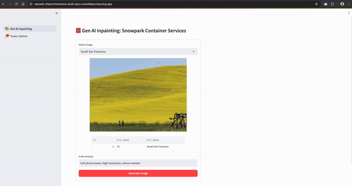

author: Dash Desai
id: build-genai-inpainting-and-hybridtable-app-in-snowpark-container-services
categories: snowflake-site:taxonomy/solution-center/certification/quickstart, snowflake-site:taxonomy/solution-center/certification/community-sourced, snowflake-site:taxonomy/solution-center/includes/architecture, snowflake-site:taxonomy/product/ai
language: en
summary: Build GenAI image inpainting applications with Snowflake Hybrid Tables and Streamlit on Snowpark Container Services for real-time AI image editing.
environments: web
status: Published 
feedback link: https://github.com/Snowflake-Labs/sfguides/issues

# Build GenAI Inpainting and Hybrid Table App in Snowpark Container Services
<!-- ------------------------ -->
## Overview 

By completing this QuickStart guide, you will get to explore [Snowpark Container Services](https://docs.snowflake.com/en/developer-guide/snowpark-container-services/overview) (SPCS) to deploy a Streamlit application showcasing GenAI inpainting using open source libraries as well as use of hybrid table for transactional workload.



### What is Snowpark Container Services?


Snowpark Container Services is a fully managed container offering that allows you to easily deploy, manage, and scale containerized services, jobs, and functions, all within the security and governance boundaries of Snowflake, with no data movement. As a fully managed service, SPCS comes with Snowflake’s native security, RBAC support, and built-in configuration and operational best-practices.

Snowpark Container Services are fully integrated with both Snowflake features and third-party tools, such as Snowflake Virtual Warehouses and Docker, allowing teams to focus on building data applications, and not building or managing infrastructure. This managed service allows you to run and scale your container workloads across regions and clouds without the additional complexity of managing a control plane, worker nodes, and also while having quick and easy access to your Snowflake data.


For more information on these objects, check out [this blog](https://medium.com/snowflake/snowpark-container-services-a-tech-primer-99ff2ca8e741) along with the Snowpark Container Services [documentation](https://docs.snowflake.com/en/developer-guide/snowpark-container-services/overview).

### What are Hybrid Tables?

A hybrid table is a Snowflake table type that is optimized for hybrid transactional and operational workloads that require low latency and high throughput on small random point reads and writes. A hybrid table supports unique and referential integrity constraint enforcement that is critical for transactional workloads. You can use a hybrid table along with other Snowflake tables and features to power [Unistore workloads](/en/data-cloud/workloads/unistore/) that bring transactional and analytical data together in a single platform.

Learn more about [Hybrid Tables](https://docs.snowflake.com/en/user-guide/tables-hybrid).

### What You'll learn 
- The working mechanics of Snowpark Container Services 
- How to build and push a containerized Docker image to SPCS along with code and other files
- How to use open source AI model for image inpainting 
- How to create and work with Hybrid tables
- How to create a Streamlit application

### What You’ll Build 
- A long-running service using Snowflake's managed Snowpark Container Services to deploy a Streamlit application showcasing GenAI inpainting using open source libraries as well as use of hybrid table for transactional workload.

### Prerequisites

- A non-trial Snowflake account in a supported [AWS region](https://docs.snowflake.com/en/developer-guide/snowpark-container-services/overview#available-regions) with access to a role that has the `ACCOUNTADMIN` role. If not, you will need to work with your admin to perform the initial environment setup.
- [Docker Desktop](https://www.docker.com/products/docker-desktop/) installed and running.
- [Git](https://git-scm.com/book/en/v2/Getting-Started-Installing-Git) installed.

<!-- ------------------------ -->
## Setup Environment

**Step 1**. Clone [GitHub repository](https://github.com/Snowflake-Labs/sfguide-build-genai-hybridtable-app-in-snowpark-container-services). If you don't have Git installed, you can also download the repo as a .zip file.

**Step 2**. In Snowsight, [create a SQL Worksheet](https://docs.snowflake.com/en/user-guide/ui-snowsight-worksheets-gs#create-worksheets-from-a-sql-file) using [`setup.sql`](https://github.com/Snowflake-Labs/sfguide-build-genai-hybridtable-app-in-snowpark-container-services/blob/main/setup.sql) and run the commands to create various objects such as database, schema, warehouse, stages, compute pool, image repository, etc. 

#### Useful resources for some of the newly introduced objects created during setup
- The [OAuth security integration](https://docs.snowflake.com/en/user-guide/oauth-custom#create-a-snowflake-oauth-integration) will allow us to login to our UI-based services using our web browser and Snowflake credentials.
- The [compute pool](https://docs.snowflake.com/en/developer-guide/snowpark-container-services/working-with-compute-pool) is the set of compute resources on which our services will run.
- The [image repository](https://docs.snowflake.com/en/developer-guide/snowpark-container-services/working-with-registry-repository) is the location in Snowflake where we will push our Docker images so that our services can use them.

**Step 3**. 

Log into your Snowflake account and use Snowsight to load data into newly created `cell_towers_ca` and `images` tables. For both of the tables, select the following in the UI:

* Header: `Skip first line`
* Field optionally enclosed by: `Double quotes`

<!-- ------------------------ -->
## Code Walkthrough

The code for the Streamlit application is split into two .py files -- and 

1) [app_helper.py](https://github.com/Snowflake-Labs/sfguide-build-genai-hybridtable-app-in-snowpark-container-services/blob/main/app_helper.py)

    * As the name suggests this file contains code to get Session object, configure navigation, initialize open source inpainting model as well as process and save generated image.
    * The one important thing to note and pay attention to is this `pipe = pipe.to("cuda")` -- this is what indicates that the inpainting pipeline is leveraging GPU compute via SPCS 

2) [app_main.py](https://github.com/Snowflake-Labs/sfguide-build-genai-hybridtable-app-in-snowpark-container-services/blob/main/app_main.py)

    * This is the entry point of the application and contains code to specify application wide config, adds navigation, and load data.

<!-- ------------------------ -->
## Build, Tag and Push Docker Image

In the cloned repo, you should see a [Dockerfile](https://github.com/Snowflake-Labs/sfguide-build-genai-hybridtable-app-in-snowpark-container-services/blob/main/Dockerfile) that looks like this:

```python
# Use rapidsai image for GPU compute
FROM rapidsai/rapidsai:23.06-cuda11.8-runtime-ubuntu22.04-py3.10

RUN apt-get update && apt-get install -y --no-install-recommends \
    && rm -rf /var/lib/apt/lists/*

COPY requirements.txt .

RUN pip install --default-timeout=1000 -r requirements.txt
RUN pip install ipython --upgrade

COPY app.css .
COPY *.py ./
ADD pages ./pages
COPY *.ipynb ./
COPY entrypoint.sh .

RUN mkdir .streamlit
COPY .streamlit/config.toml .streamlit

# Expose Jupyter port
EXPOSE 4200
# Expose Streamlit port
EXPOSE 8080

RUN chmod +x ./entrypoint.sh
ENTRYPOINT [ "./entrypoint.sh" ]
```

Things to note:

- Select `rapidsai` for the base image which will enable us to run GPU workloads for deploying GenAI inpainting in SPCS.
- Install packages from [requirements.txt](https://github.com/Snowflake-Labs/sfguide-build-genai-hybridtable-app-in-snowpark-container-services/blob/main/requirements.txt).
- Copy code files into the container
- Expose ports 8080 and 4200
- Start Jupyter Lab and Streamlit application when the container launches via [entrypoint.sh](https://github.com/Snowflake-Labs/sfguide-build-genai-hybridtable-app-in-snowpark-container-services/blob/main/entrypoint.sh).

### Build Image

Let's build the image locally. In a terminal window, browse to your local clone of the repo and run the following command:

```bash
DOCKER_BUILDKIT=0  docker build --platform linux/amd64 -t genai-spcs .
```

### Tag Image

Let's create a new tag of the image that points to the image repository in your Snowflake account. 

Replace ***your-org-name*** and ***your-account-name*** with your organization and account name. If your account name contains an underscore (_), you will need to replace it with a dash (-) for the below command. Otherwise, you may encounter an error similar to `Get "https:/v2/": http: no Host in request URL`.

```bash
docker tag genai-spcs:latest your-org-name-your-account-name.registry.snowflakecomputing.com/dash_db/dash_schema/dash_repo/genai-spcs:latest
```

For example, `docker tag genai-spcs:latest sfsenorthamerica-build-spcs.registry.snowflakecomputing.com/dash_db/dash_schema/dash_repo/genai-spcs:latest`

### Push Image

Next we need to push the image to Snowflake. From the same terminal window, run the following commands:

Replace ***your-org-name*** and ***your-account-name*** with your organization and account name. If your account name contains an underscore (_), you will need to replace it with a dash (-) for the below commands. Otherwise, you may encounter an error similar to `Get "https:/v2/": http: no Host in request URL`.

```bash
docker login your-org-name-your-account-name.registry.snowflakecomputing.com
```

For example, `docker login sfsenorthamerica-build-spcs.registry.snowflakecomputing.com -u dash`

```bash
docker push your-org-name-your-account-name.registry.snowflakecomputing.com/dash_db/dash_schema/dash_repo/llm-spcs:latest
```

For example, `docker push sfsenorthamerica-build-spcs.registry.snowflakecomputing.com/dash_db/dash_schema/dash_repo/genai-spcs:latest`

> 
> NOTE: This may take ~30mins or more depending on your network connection so you may move on to the next step **Upload Spec YAML** while the image is being pushed.

### Upload Spec YAML

Services in SPCS are defined using YAML files. These YAML files configure all of the various parameters needed to run the containers within your Snowflake account. Learn more about [configurable parameters](https://docs.snowflake.com/en/developer-guide/snowpark-container-services/specification-reference) in spec YAML files.

Navigate to your local clone of the repo and you should see [genai-spcs.yaml](https://github.com/Snowflake-Labs/sfguide-build-genai-hybridtable-app-in-snowpark-container-services/blob/main/genai-spcs.yaml) that looks like this:

```yaml
spec:
  container:  
  - name: genai-spcs
    image: /dash_db/dash_schema/dash_repo/genai-spcs
    volumeMounts: 
    - name: llm-workspace
      mountPath: /notebooks/llm-workspace
    env:
      SNOWFLAKE_MOUNTED_STAGE_PATH: /notebooks/llm-workspace
    resources:                         
        requests:
          nvidia.com/gpu: 1
        limits:
          nvidia.com/gpu: 1
  endpoint:
  - name: streamlit
    port: 8080
    public: true
  - name: jupyter
    port: 4200
    public: true
  volume:
  - name: llm-workspace
    source: "@llm_workspace"
    uid: 0
    gid: 0
```

If needed, make edits to the default names of the database, schema, and/or image repository and save the file. Once the spec file is updated, use [Snowsight to upload it to Snowflake Stage `dash_stage`](https://docs.snowflake.com/en/user-guide/data-load-local-file-system-stage-ui#uploading-files-onto-a-stage) so that it can be referenced in the service we will create in the next section.

<!-- ------------------------ -->
## Create Service

Once the `docker push...` command completes in the previous step, verify that the image exists by running the following commands in a SQL worksheet:

```sql
use role DASH_SPCS;
CALL SYSTEM$REGISTRY_LIST_IMAGES('/dash_db/dash_schema/dash_repo');
```

You should see image `genai-spcs` listed.

Once we have successfully pushed the Docker image and uploaded the spec YAML, we have all of the components we need in order to create our service. There are three components required to create the service: 

1) A service name
2) A compute pool the service will run on
3) A spec file that defines the service

Before creating the service, run the following command to check the status of the compute pool DASH_GPU3 and make sure it is in IDLE or ACTIVE state. 

```sql
use role DASH_SPCS;

show compute pools;
```

If the compute pool DASH_GPU3 is **not** in IDLE or ACTIVE state, run the following command and wait a few mins.

```sql
alter compute pool DASH_GPU3 resume;
```

> 
> NOTE: Before proceeding, make sure the compute pool DASH_GPU3 is in IDLE or ACTIVE state.

To create the service, run the following commands in a SQL worksheet:

```sql
create service genai_service
IN COMPUTE POOL DASH_GPU3
FROM @dash_stage
SPECIFICATION_FILE = 'genai-spcs.yaml'
MIN_INSTANCES = 1
MAX_INSTANCES = 1
QUERY_WAREHOUSE = DASH_WH_S
EXTERNAL_ACCESS_INTEGRATIONS = (ALLOW_ALL_ACCESS_INTEGRATION);
```

To check the status of the service, run the following in a SQL worksheet:

```sql
select 
  v.value:containerName::varchar container_name
  ,v.value:status::varchar status  
  ,v.value:message::varchar message
from (select parse_json(system$get_service_status('genai_service'))) t, 
lateral flatten(input => t.$1) v;
```

> 
> NOTE: Before proceeding, make sure the service is in READY state.

<!-- ------------------------ -->
## Run Application

Once the service is in a `READY` state, execute the following command in a SQL worksheet to get the endpoint URL:

```sql
show endpoints in service genai_service;
```

If everything has gone well so far, you should see a service named **streamlit** with **ingress_url** of the application--something similar to `iapioai5-sfsenorthamerica-build-spcs.snowflakecomputing.app`

In a new browser window, copy-paste the **ingress_url** URL from above and you should see the login screen. To launch the application, enter your Snowflake credentials and you should see the application up and running.

> 
> NOTE: To access the app, the user logging in must have `DASH_SPCS` role AND their user default role **cannot** be `ACCOUNTADMIN`, `SECURITYADMIN`, or `ORGADMIN`.

### Gen AI Inpainting

1) On this page, use your mouse to paint the area white where you'd like a cell phone tower to be built.
2) Then click on **Generate Image** button -- this will kickoff a inpainting process using open source Gen AI model. In a few seconds, the generated image will be displayed on the right-hand side of the selected image!

### Tower Uptime

1) On this page, update status of one of the towers in the dataframe on the right. This will kickoff a process to updated the hybrid table and also update the map instantaneously!
2) Run `select * from cell_towers_ca` in a SQL worksheet and you'll see the status of that particular tower updated.

### Demo 


<!-- ------------------------ -->
## Cleanup

To cleanup resources and remove all of the objects you created during this QuickStart, run the following commands in a SQL worksheet. This will ensure that you don't incur any unnecessary costs specifically associated with this QuickStart guide. 

> 
> NOTE: Snowpark Container Services bills credits/second based on the compute pool's uptime, similar to Virtual Warehouse billing.

```sql
USE ROLE ROLE DASH_SPCS;
DROP SERVICE DASH_DB.DASH_SCHEMA.genai_service;

USE ROLE ACCOUNTADMIN;
ALTER COMPUTE POOL DASH_GPU3 STOP ALL;
ALTER COMPUTE POOL DASH_GPU3 SUSPEND;
DROP COMPUTE POOL DASH_GPU3;
DROP SCHEMA DASH_SCHEMA;
DROP DATABASE DASH_DB;
DROP WAREHOUSE DASH_WH_S;
DROP ROLE DASH_SPCS;
```

<!-- ------------------------ -->
## Conclusion and Resources

Congratulations, you have successfully completed this QuickStart! By completing this guide, you were able to create and manage long-running service using Snowflake's managed Snowpark Container Services to deploy a Streamlit application showcasing GenAI inpainting using open source libraries as well as use of hybrid tables for transactional workload.

### What You Learned

- The working mechanics of Snowpark Container Services 
- How to build and push a containerized Docker image to SPCS along with code and other files
- How to use open source AI model for image inpainting 
- How to work with Hybrid tables
- How to create a Streamlit application

### Related Resources

- [QuickStart GitHub Repo](https://github.com/Snowflake-Labs/sfguide-build-genai-hybridtable-app-in-snowpark-container-services)
- [QuickStart Guide: Intro to Snowpark Container Services](/en/developers/guides/intro-to-snowpark-container-services/)
- [Blog: Snowflake Announces Snowpark Container Services](/blog/snowpark-container-services-deploy-genai-full-stack-apps/)
- [Blog: Snowpark Container Services - A Tech Primer](https://medium.com/snowflake/snowpark-container-services-a-tech-primer-99ff2ca8e741)
- [Docs: Snowpark Container Services](https://docs.snowflake.com/en/developer-guide/snowpark-container-services/overview)
- [Docs: Snowpark Container Services SQL Commands](https://docs.snowflake.com/en/sql-reference/commands-snowpark-container-services)
- [Docs: Hybrid Tables](https://docs.snowflake.com/en/user-guide/tables-hybrid)
- [Video: Building Advanced ML with Snowpark Container Services - Summit 2023](https://www.youtube.com/watch?v=DelaJBm0UgI)
- [Video: Snowpark Container Services with NVIDIA](https://www.youtube.com/watch?v=u98YTgCelYg)
- [Watch Demo](https://youtu.be/l8NZSY3C7OU?si=WHphvkTe8b3j1N6m)
- [Download Reference Architecture](/content/dam/snowflake-site/developers/2024/06/Build-AI-Apps-Fast-using-Hybrid-Tables-Native-Apps-and-GenAI.pdf)

