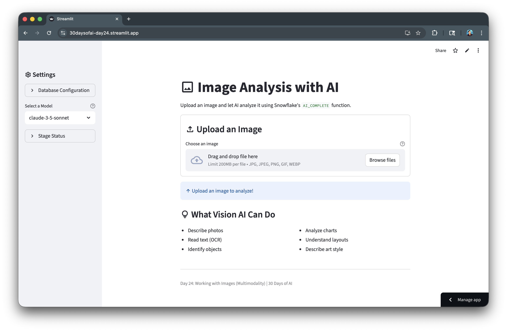
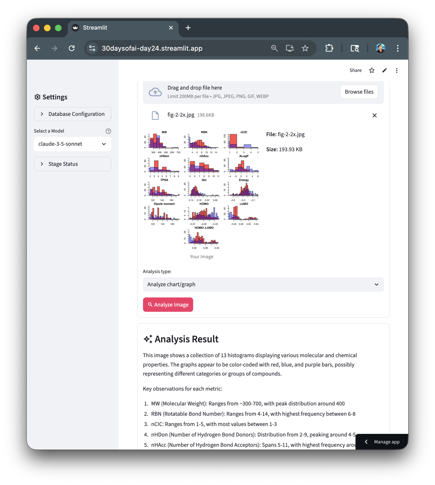

author: Chanin Nantasenamat
id: build-image-analysis-app-with-streamlit-and-snowflake-cortex
summary: Build an image analysis application using Snowflake Cortex AI_COMPLETE with multimodal capabilities to analyze, describe, and extract information from images.
categories: snowflake-site:taxonomy/solution-center/certification/quickstart,snowflake-site:taxonomy/product/ai,snowflake-site:taxonomy/snowflake-feature/cortex-llm-functions,snowflake-site:taxonomy/snowflake-feature/unstructured-data-analysis
language: en
environments: web
status: Published
feedback link: https://github.com/Snowflake-Labs/sfguides/issues
tags: Streamlit, Cortex, Vision AI, Multimodal, Image Analysis

# Build an Image Analysis App with Streamlit and Snowflake Cortex
<!-- ------------------------ -->
## Overview

In this quickstart, you'll build an image analysis application using Snowflake Cortex's multimodal AI capabilities. The `AI_COMPLETE` function supports vision-capable models that can analyze images for descriptions, text extraction (OCR), object identification, and chart analysis.

### What You'll Learn
- How to use Snowflake Cortex with vision-capable models
- How to create stages with proper encryption for image analysis
- How to upload images and analyze them with `AI_COMPLETE`
- How to build different analysis modes (OCR, object detection, etc.)

### What You'll Build
An image analysis application that can describe photos, extract text, identify objects, and analyze charts using Snowflake's multimodal AI capabilities.



### Prerequisites
- Access to a [Snowflake account](https://signup.snowflake.com/?utm_source=snowflake-devrel&utm_medium=developer-guides&utm_cta=developer-guides)
- Basic knowledge of Python and Streamlit
- Access to vision-capable Cortex models (claude-3-5-sonnet, openai-gpt-4.1, pixtral-large)

<!-- ------------------------ -->
## Getting Started

Clone or download the code from the [30daysofai](https://github.com/streamlit/30daysofai) GitHub repository:

```bash
git clone https://github.com/streamlit/30DaysOfAI.git
cd 30DaysOfAI/app
```

The app code for this quickstart:
- [Day 24: Image Analysis](https://github.com/streamlit/30DaysOfAI/blob/main/app/day24.py)

<!-- ------------------------ -->
## Setup Stage for Images

Image analysis requires a stage with server-side encryption.

### Create the Stage

```sql
CREATE DATABASE IF NOT EXISTS RAG_DB;
CREATE SCHEMA IF NOT EXISTS RAG_DB.RAG_SCHEMA;

DROP STAGE IF EXISTS RAG_DB.RAG_SCHEMA.IMAGE_ANALYSIS;
CREATE STAGE RAG_DB.RAG_SCHEMA.IMAGE_ANALYSIS
    DIRECTORY = ( ENABLE = true )
    ENCRYPTION = ( TYPE = 'SNOWFLAKE_SSE' );
```

The `CREATE STAGE` command sets up a storage location for images. `DIRECTORY = ( ENABLE = true )` allows listing files, and `ENCRYPTION = ( TYPE = 'SNOWFLAKE_SSE' )` enables server-side encryption required for `AI_COMPLETE` to access images.

> **Important**: The stage must use `SNOWFLAKE_SSE` encryption for `AI_COMPLETE` to access images.

### Verify Stage

```sql
SHOW STAGES LIKE 'IMAGE_ANALYSIS' IN RAG_DB.RAG_SCHEMA;
```

<!-- ------------------------ -->
## Build the Image Uploader

Create the file upload interface:

### Connection and Setup

```python
import streamlit as st
import io
import time

try:
    from snowflake.snowpark.context import get_active_session
    session = get_active_session()
except:
    from snowflake.snowpark import Session
    session = Session.builder.configs(st.secrets["connections"]["snowflake"]).create()

if "image_database" not in st.session_state:
    st.session_state.image_database = "RAG_DB"
    st.session_state.image_schema = "RAG_SCHEMA"

database = st.session_state.image_database
schema = st.session_state.image_schema
full_stage_name = f"{database}.{schema}.IMAGE_ANALYSIS"
stage_name = f"@{full_stage_name}"
```

The connection pattern uses `try`/`except` to work in both Streamlit in Snowflake (SiS) and local environments. Session state stores database configuration so it persists across reruns. The stage name is prefixed with `@` for SQL commands.

### Sidebar Configuration

```python
with st.sidebar:
    st.header(":material/settings: Settings")
    
    model = st.selectbox(
        "Select a Model",
        ["claude-3-5-sonnet", "openai-gpt-4.1", "openai-o4-mini", "pixtral-large"],
        help="Select a vision-capable model"
    )
    
    with st.expander("Database Configuration", expanded=False):
        database = st.text_input("Database", value=st.session_state.image_database)
        schema = st.text_input("Schema", value=st.session_state.image_schema)
```

The sidebar provides model selection with `st.selectbox()` showing only vision-capable models. The expander contains optional database configuration that users can modify if needed.

<!-- ------------------------ -->
## Upload and Analyze Images

Build the core analysis functionality:

### File Upload Interface

```python
st.title(":material/image: Image Analysis with AI")
st.write("Upload an image and let AI analyze it using Snowflake's `AI_COMPLETE` function.")

with st.container(border=True):
    st.subheader(":material/upload: Upload an Image")
    uploaded_file = st.file_uploader(
        "Choose an image", 
        type=["jpg", "jpeg", "png", "gif", "webp"],
        help="Supported formats: JPG, JPEG, PNG, GIF, WebP (max 10 MB)"
    )
```

The `st.file_uploader()` accepts common image formats with a 10 MB limit. The `type` parameter restricts uploads to supported formats.

```python
if uploaded_file:
    col1, col2 = st.columns(2)
    
    with col1:
        st.image(uploaded_file, caption="Your Image", use_container_width=True)
    
    with col2:
        st.write(f"**File:** {uploaded_file.name}")
        size_bytes = uploaded_file.size
        if size_bytes >= 1_048_576:
            size_display = f"{size_bytes / 1_048_576:.2f} MB"
        else:
            size_display = f"{size_bytes / 1_024:.2f} KB"
        st.write(f"**Size:** {size_display}")
    
    analysis_type = st.selectbox("Analysis type:", [
        "General description",
        "Extract text (OCR)",
        "Identify objects",
        "Analyze chart/graph",
        "Custom prompt"
    ])
    
    custom_prompt = None
    if analysis_type == "Custom prompt":
        custom_prompt = st.text_area(
            "Enter your prompt:",
            placeholder="What would you like to know about this image?"
        )
```

Two columns display the image preview and file metadata side-by-side. The analysis type dropdown offers preset prompts for common tasks, with a custom option for flexibility.

<!-- ------------------------ -->
## Process with AI_COMPLETE

Use the multimodal AI_COMPLETE function:

### Build the Prompt

```python
if st.button(":material/search: Analyze Image", type="primary"):
    if analysis_type == "General description":
        prompt = "Describe this image in detail. What do you see?"
    elif analysis_type == "Extract text (OCR)":
        prompt = "Extract all text visible in this image. Return only the text content."
    elif analysis_type == "Identify objects":
        prompt = "List all objects and items you can identify in this image. Be specific and comprehensive."
    elif analysis_type == "Analyze chart/graph":
        prompt = "Analyze this chart or graph. Describe the data, trends, and key insights."
    elif analysis_type == "Custom prompt" and custom_prompt:
        prompt = custom_prompt
    else:
        st.warning("Please enter a custom prompt.")
        st.stop()
```

Each analysis type maps to a specific prompt optimized for that task. The `if`/`elif` chain selects the appropriate prompt, with `st.stop()` preventing execution if custom prompt is empty.

### Upload and Analyze

```python
    with st.spinner(":material/upload: Uploading image to Snowflake stage..."):
        try:
            timestamp = int(time.time())
            file_extension = uploaded_file.name.split('.')[-1]
            filename = f"image_{timestamp}.{file_extension}"
            
            image_bytes = uploaded_file.getvalue()
            image_stream = io.BytesIO(image_bytes)
            
            session.file.put_stream(
                image_stream,
                f"{stage_name}/{filename}",
                overwrite=True,
                auto_compress=False
            )
        except Exception as e:
            st.error(f"Failed to upload image: {str(e)}")
            st.stop()
    
    with st.spinner(f":material/psychology: Analyzing with {model}..."):
        try:
            sql_query = f"""
            SELECT SNOWFLAKE.CORTEX.AI_COMPLETE(
                '{model}',
                '{prompt.replace("'", "''")}',
                TO_FILE('{stage_name}', '{filename}')
            ) as analysis
            """
            
            result = session.sql(sql_query).collect()
            response = result[0]['ANALYSIS']
            
            st.session_state.analysis_response = response
            st.session_state.analysis_model = model
            st.session_state.analysis_prompt = prompt
            
        except Exception as e:
            st.error(f"Analysis failed: {str(e)}")
            st.stop()
```

The `session.file.put_stream()` uploads the image to the Snowflake stage. The SQL query uses `SNOWFLAKE.CORTEX.AI_COMPLETE()` with `TO_FILE()` to pass the staged image to the vision model. Results are stored in session state for persistence across reruns.

<!-- ------------------------ -->
## Display Results

Show the analysis results:

```python
if "analysis_response" in st.session_state:
    with st.container(border=True):
        st.subheader(":material/auto_awesome: Analysis Result")
        st.markdown(st.session_state.analysis_response)
        
        with st.expander(":material/info: Technical Details"):
            st.write(f"**Model:** {st.session_state.analysis_model}")
            st.write(f"**Prompt:** {st.session_state.analysis_prompt}")

if not uploaded_file:
    st.info(":material/arrow_upward: Upload an image to analyze!")
    
    st.subheader(":material/lightbulb: What Vision AI Can Do")
    col1, col2 = st.columns(2)
    with col1:
        st.markdown("- Describe photos\n- Read text (OCR)\n- Identify objects")
    with col2:
        st.markdown("- Analyze charts\n- Understand layouts\n- Describe art style")
```

The results display uses `st.markdown()` to render the AI response with proper formatting. An expander shows technical details for debugging. When no file is uploaded, helpful guidance shows users what the app can do.

<!-- ------------------------ -->
## Complete Application

```python
import streamlit as st
import io
import time

# Connect to Snowflake
try:
    # Works in Streamlit in Snowflake
    from snowflake.snowpark.context import get_active_session
    session = get_active_session()
except:
    # Works locally and on Streamlit Community Cloud
    from snowflake.snowpark import Session
    session = Session.builder.configs(st.secrets["connections"]["snowflake"]).create()

# Initialize state
if "image_database" not in st.session_state:
    st.session_state.image_database = "RAG_DB"
    st.session_state.image_schema = "RAG_SCHEMA"

# Get stage path from session state
database = st.session_state.image_database
schema = st.session_state.image_schema
full_stage_name = f"{database}.{schema}.IMAGE_ANALYSIS"
stage_name = f"@{full_stage_name}"

# Sidebar
with st.sidebar:
    st.header(":material/settings: Settings")
    
    with st.expander("Database Configuration", expanded=False):
        database = st.text_input("Database", value=st.session_state.image_database, key="img_db_input")
        schema = st.text_input("Schema", value=st.session_state.image_schema, key="img_schema_input")
        
        if database != st.session_state.image_database or schema != st.session_state.image_schema:
            st.session_state.image_database = database
            st.session_state.image_schema = schema
            st.rerun()
    
    # Model selection
    model = st.selectbox(
        "Select a Model",
        ["claude-3-5-sonnet", "openai-gpt-4.1", "openai-o4-mini", "pixtral-large"],
        help="Select a vision-capable model"
    )
    
    # Stage Status
    with st.expander("Stage Status", expanded=False):
        database = st.session_state.image_database
        schema = st.session_state.image_schema
        full_stage_name = f"{database}.{schema}.IMAGE_ANALYSIS"
        stage_name = f"@{full_stage_name}"
        
        try:
            # Check if stage exists
            stage_info = session.sql(f"SHOW STAGES LIKE 'IMAGE_ANALYSIS' IN {database}.{schema}").collect()
            
            if stage_info:
                # Stage exists - drop and recreate to ensure correct encryption
                st.info(f":material/autorenew: Recreating stage with server-side encryption...")
                session.sql(f"DROP STAGE IF EXISTS {full_stage_name}").collect()
            
            # Create stage with server-side encryption (required for AI_COMPLETE with images)
            session.sql(f"""
            CREATE STAGE {full_stage_name}
                DIRECTORY = ( ENABLE = true )
                ENCRYPTION = ( TYPE = 'SNOWFLAKE_SSE' )
            """).collect()
            st.success(f":material/check_box: Image stage ready")
            
        except Exception as e:
            st.error(f":material/cancel: Could not create stage")
            
            with st.expander(":material/build: Manual Fix"):
                st.code(f"""
DROP STAGE IF EXISTS {full_stage_name};
CREATE STAGE {full_stage_name}
    DIRECTORY = ( ENABLE = true )
    ENCRYPTION = ( TYPE = 'SNOWFLAKE_SSE' );
                """, language="sql")

st.title(":material/image: Image Analysis with AI")
st.write("Upload an image and let AI analyze it using Snowflake's `AI_COMPLETE` function.")

# File uploader container
with st.container(border=True):
    st.subheader(":material/upload: Upload an Image")
    uploaded_file = st.file_uploader(
        "Choose an image", 
        type=["jpg", "jpeg", "png", "gif", "webp"],
        help="Supported formats: JPG, JPEG, PNG, GIF, WebP (max 10 MB)"
    )

    if uploaded_file:
        col1, col2 = st.columns(2)
        
        with col1:
            st.image(uploaded_file, caption="Your Image", use_container_width=True)
        
        with col2:
            st.write(f"**File:** {uploaded_file.name}")
            
            # Format file size
            size_bytes = uploaded_file.size
            if size_bytes >= 1_048_576:  # 1 MB = 1,048,576 bytes
                size_display = f"{size_bytes / 1_048_576:.2f} MB"
            elif size_bytes >= 1_024:  # 1 KB = 1,024 bytes
                size_display = f"{size_bytes / 1_024:.2f} KB"
            else:
                size_display = f"{size_bytes} bytes"
            
            st.write(f"**Size:** {size_display}")
        
        # Analysis type selection (above button)
        analysis_type = st.selectbox("Analysis type:", [
            "General description",
            "Extract text (OCR)",
            "Identify objects",
            "Analyze chart/graph",
            "Custom prompt"
        ])
        
        # Custom prompt input if selected
        custom_prompt = None
        if analysis_type == "Custom prompt":
            custom_prompt = st.text_area(
                "Enter your prompt:",
                placeholder="What would you like to know about this image?",
                help="Ask anything about the image content"
            )
        
        if st.button(":material/search: Analyze Image", type="primary"):
            # Build prompt based on analysis type
            if analysis_type == "General description":
                prompt = "Describe this image in detail. What do you see?"
            elif analysis_type == "Extract text (OCR)":
                prompt = "Extract all text visible in this image. Return only the text content."
            elif analysis_type == "Identify objects":
                prompt = "List all objects and items you can identify in this image. Be specific and comprehensive."
            elif analysis_type == "Analyze chart/graph":
                prompt = "Analyze this chart or graph. Describe the data, trends, and key insights."
            elif analysis_type == "Custom prompt" and custom_prompt:
                prompt = custom_prompt
            else:
                st.warning("Please enter a custom prompt.")
                st.stop()
            
            with st.spinner(":material/upload: Uploading image to Snowflake stage..."):
                try:
                    # Create unique filename
                    timestamp = int(time.time())
                    file_extension = uploaded_file.name.split('.')[-1]
                    filename = f"image_{timestamp}.{file_extension}"
                    
                    # Upload to stage
                    image_bytes = uploaded_file.getvalue()
                    image_stream = io.BytesIO(image_bytes)
                    
                    session.file.put_stream(
                        image_stream,
                        f"{stage_name}/{filename}",
                        overwrite=True,
                        auto_compress=False
                    )
                    
                except Exception as e:
                    st.error(f"Failed to upload image: {str(e)}")
                    st.stop()
            
            with st.spinner(f":material/psychology: Analyzing with {model}..."):
                try:
                    # Use AI_COMPLETE with TO_FILE syntax
                    sql_query = f"""
                    SELECT SNOWFLAKE.CORTEX.AI_COMPLETE(
                        '{model}',
                        '{prompt.replace("'", "''")}',
                        TO_FILE('{stage_name}', '{filename}')
                    ) as analysis
                    """
                    
                    result = session.sql(sql_query).collect()
                    response = result[0]['ANALYSIS']
                    
                    # Store results in session state
                    st.session_state.analysis_response = response
                    st.session_state.analysis_model = model
                    st.session_state.analysis_prompt = prompt
                    st.session_state.analysis_stage = stage_name
                    
                    # Note: Staged files remain in the stage (can be managed manually if needed)
                    
                except Exception as e:
                    st.error(f"Analysis failed: {str(e)}")
                    st.info(":material/lightbulb: Make sure your Snowflake account has access to vision-capable models and that the stage has server-side encryption.")
                    st.stop()

# Display results in a separate container
if "analysis_response" in st.session_state:
    with st.container(border=True):
        st.subheader(":material/auto_awesome: Analysis Result")
        st.markdown(st.session_state.analysis_response)
        
        with st.expander(":material/info: Technical Details"):
            st.write(f"**Model:** {st.session_state.analysis_model}")
            st.write(f"**Prompt:** {st.session_state.analysis_prompt}")
            st.write(f"**Stage:** {st.session_state.analysis_stage}")

# Info section when no file is uploaded
if not uploaded_file:
    st.info(":material/arrow_upward: Upload an image to analyze!")
    
    st.subheader(":material/lightbulb: What Vision AI Can Do")
    col1, col2 = st.columns(2)
    with col1:
        st.markdown("- Describe photos\n- Read text (OCR)\n- Identify objects")
    with col2:
        st.markdown("- Analyze charts\n- Understand layouts\n- Describe art style")

st.divider()
st.caption("Day 24: Working with Images (Multimodality) | 30 Days of AI")
```

Here's an example of the app analyzing a scientific chart using the "Analyze chart/graph" option. You can try it yourself with this [example chart image](https://doi.org/10.7717/peerj.1958/fig-2).



### Deploy the App

Save the code above as `streamlit_app.py` and deploy using one of these options:

- **Local**: Run `streamlit run streamlit_app.py` in your terminal
- **Streamlit Community Cloud**: [Deploy your app](https://docs.streamlit.io/deploy/streamlit-community-cloud/deploy-your-app/deploy) from a GitHub repository
- **Streamlit in Snowflake (SiS)**: [Create a Streamlit app](https://docs.snowflake.com/en/developer-guide/streamlit/getting-started/create-streamlit-ui) directly in Snowsight

<!-- ------------------------ -->
## Conclusion And Resources

Congratulations! You've successfully built an image analysis application using Snowflake Cortex's multimodal AI capabilities. You can now analyze images for descriptions, text extraction, object identification, and chart analysis.

### What You Learned
- Using Snowflake Cortex with vision-capable models
- Creating stages with proper encryption for image analysis
- Uploading images and analyzing them with `AI_COMPLETE`
- Building different analysis modes

### Related Resources

Documentation:
- [Snowflake Cortex AI_COMPLETE](https://docs.snowflake.com/en/user-guide/snowflake-cortex/llm-functions)
- [Working with Files in Stages](https://docs.snowflake.com/en/user-guide/data-load-overview)

Additional Reading:
- [Snowflake Cortex Overview](https://docs.snowflake.com/en/user-guide/snowflake-cortex/overview)

### Source Material

This quickstart was adapted from **Day 24** of the 30 Days of AI challenge on Vision AI with multimodal models.

Learn more:
- [30 Days of AI Challenge](https://30daysofai.streamlit.app/)
- [GitHub Repository](https://github.com/streamlit/30daysofai)
