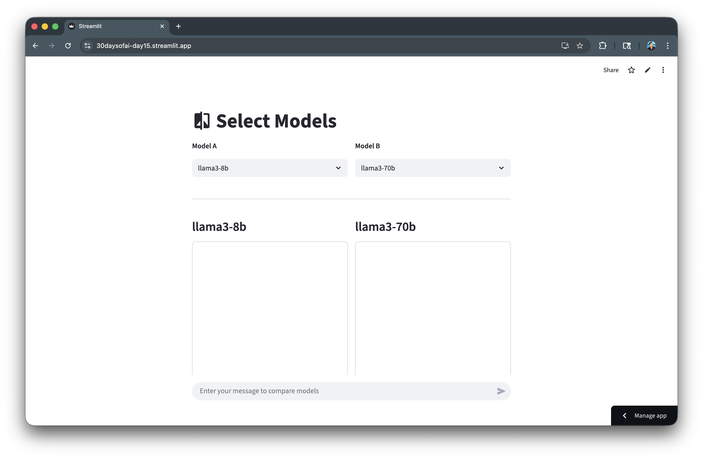
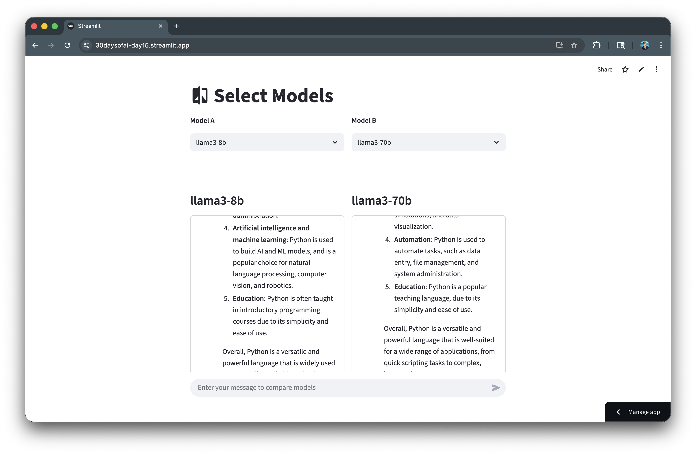
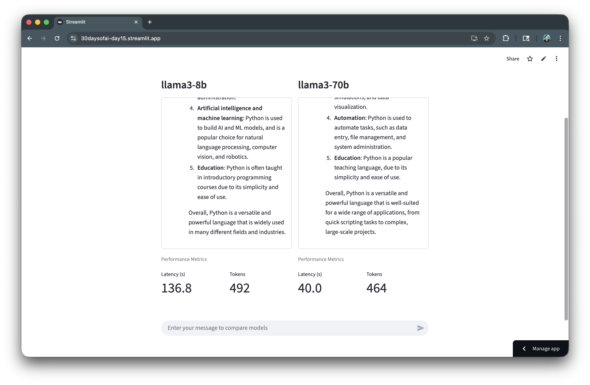

author: Siavash Yasini, Chanin Nantasenamat
id: build-llm-model-comparison-app-with-streamlit-and-snowflake-cortex
summary: Build an LLM model comparison arena to evaluate different Snowflake Cortex models side-by-side with performance metrics like latency and token count.
categories: snowflake-site:taxonomy/solution-center/certification/quickstart,snowflake-site:taxonomy/product/ai
language: en
environments: web
status: Published
feedback link: https://github.com/Snowflake-Labs/sfguides/issues
tags: Streamlit, Cortex, LLM, Model Comparison, AI

# Build an LLM Model Comparison App with Streamlit and Snowflake Cortex
<!-- ------------------------ -->
## Overview

In this quickstart, you'll build an LLM model comparison arena that lets you evaluate different Snowflake Cortex models side-by-side. This tool is invaluable for understanding the trade-offs between model speed, quality, and token efficiency.

### What You'll Learn
- How to compare multiple LLM models in a single interface
- How to collect and display performance metrics (latency, tokens)
- How to use session state to persist comparison results
- How to build a responsive side-by-side comparison UI

### What You'll Build
A model comparison arena that runs the same prompt through two different models simultaneously, displaying responses and performance metrics side-by-side.



### Prerequisites
- Access to a [Snowflake account](https://signup.snowflake.com/?utm_source=snowflake-devrel&utm_medium=developer-guides&utm_cta=developer-guides)
- Basic knowledge of Python and Streamlit
- A Snowflake warehouse with Cortex LLM access

<!-- ------------------------ -->
## Getting Started

Clone or download the code from the [30daysofai](https://github.com/streamlit/30daysofai) GitHub repository:

```bash
git clone https://github.com/streamlit/30DaysOfAI.git
cd 30DaysOfAI/app
```

The app code for this quickstart:
- [Day 15: LLM Arena](https://github.com/streamlit/30DaysOfAI/blob/main/app/day15.py)

<!-- ------------------------ -->
## Setup the Connection

First, establish your Snowflake connection.

> Note: This is repurposed from Day 15 of the [#30DaysOfAI learning challenge](https://30daysofai.streamlit.app/?day=15).

```python
import streamlit as st
import time
import json
from snowflake.snowpark.functions import ai_complete

try:
    from snowflake.snowpark.context import get_active_session
    session = get_active_session()
except:
    from snowflake.snowpark import Session
    session = Session.builder.configs(st.secrets["connections"]["snowflake"]).create()
```

The try/except pattern works in both Streamlit in Snowflake (SiS) and local environments by first attempting to get an active session, then falling back to creating one from secrets.

<!-- ------------------------ -->
## Create the Model Runner

Build a function that runs a model and collects metrics.

> Note: This section is repurposed from Day 15 of the [#30DaysOfAI learning challenge](https://30daysofai.streamlit.app/?day=15).

### Run Model Function

Create a function that executes a model and collects performance metrics:

```python
def run_model(model: str, prompt: str) -> dict:
    """Execute model and collect metrics."""
    start = time.time()

    df = session.range(1).select(
        ai_complete(model=model, prompt=prompt).alias("response")
    )

    rows = df.collect()
    response_raw = rows[0][0]
    response_json = json.loads(response_raw)

    text = response_json.get("choices", [{}])[0].get("messages", "") if isinstance(response_json, dict) else str(response_json)

    latency = time.time() - start
    tokens = int(len(text.split()) * 4/3)  # Estimate tokens

    return {
        "latency": latency,
        "tokens": tokens,
        "response_text": text
    }
```

The function times the LLM call from start to finish, capturing latency. Token count is estimated using a standard ratio. Returning a dictionary makes it easy to display metrics and responses separately.

<!-- ------------------------ -->
## Build the Comparison UI

Create the side-by-side comparison interface.

> Note: This section is repurposed from Day 15 of the [#30DaysOfAI learning challenge](https://30daysofai.streamlit.app/?day=15).

### Model Selection

Set up the model list and create a side-by-side layout for selecting two models to compare:

```python
llm_models = [
    "llama3-8b",
    "llama3-70b",
    "mistral-7b",
    "mixtral-8x7b",
    "claude-3-5-sonnet",
    "claude-haiku-4-5",
    "openai-gpt-5",
    "openai-gpt-5-mini"
]

st.title(":material/compare: Select Models")

col_a, col_b = st.columns(2)

col_a.write("**Model A**")
model_a = col_a.selectbox("Model A", llm_models, key="model_a", label_visibility="collapsed")

col_b.write("**Model B**")
model_b = col_b.selectbox("Model B", llm_models, key="model_b", index=1, label_visibility="collapsed")
```

Two columns create the side-by-side layout. Each selectbox uses a unique key for session state. The `index=1` on Model B defaults to a different model for immediate comparison.

### Display Helper Functions

Define helper functions to display metrics and responses in a consistent format:

```python
def display_metrics(results: dict, model_key: str):
    """Display metrics for a model."""
    latency_col, tokens_col = st.columns(2)
    latency_col.metric("Latency (s)", f"{results[model_key]['latency']:.1f}")
    tokens_col.metric("Tokens", results[model_key]['tokens'])

def display_response(container, results: dict, model_key: str):
    """Display chat messages in container."""
    with container:
        with st.chat_message("user"):
            st.write(results["prompt"])
        with st.chat_message("assistant"):
            st.write(results[model_key]["response_text"])
```

Separating metrics display and response display into functions keeps the code organized. The container approach ensures consistent layout regardless of response length.

### Full Code

Copy the code below to create the model selection and display functions:

```python
llm_models = [
    "llama3-8b",
    "llama3-70b",
    "mistral-7b",
    "mixtral-8x7b",
    "claude-3-5-sonnet",
    "claude-haiku-4-5",
    "openai-gpt-5",
    "openai-gpt-5-mini"
]

st.title(":material/compare: Select Models")

col_a, col_b = st.columns(2)

col_a.write("**Model A**")
model_a = col_a.selectbox("Model A", llm_models, key="model_a", label_visibility="collapsed")

col_b.write("**Model B**")
model_b = col_b.selectbox("Model B", llm_models, key="model_b", index=1, label_visibility="collapsed")

def display_metrics(results: dict, model_key: str):
    """Display metrics for a model."""
    latency_col, tokens_col = st.columns(2)
    latency_col.metric("Latency (s)", f"{results[model_key]['latency']:.1f}")
    tokens_col.metric("Tokens", results[model_key]['tokens'])

def display_response(container, results: dict, model_key: str):
    """Display chat messages in container."""
    with container:
        with st.chat_message("user"):
            st.write(results["prompt"])
        with st.chat_message("assistant"):
            st.write(results[model_key]["response_text"])
```

<!-- ------------------------ -->
## Build the Complete Arena

Now combine all the components into a complete working arena.

> Note: This section is repurposed from Day 15 of the [#30DaysOfAI learning challenge](https://30daysofai.streamlit.app/?day=15).

### Initialize Session State

Initialize session state to store comparison results:

```python
if "latest_results" not in st.session_state:
    st.session_state.latest_results = None
```

Initializing results to None allows the UI to show placeholder values before the first comparison is run.

### Response Containers

Create fixed-height containers for each model's response and metrics:

```python
st.divider()
col_a, col_b = st.columns(2)
results = st.session_state.latest_results

for col, model_name, model_key in [(col_a, model_a, "model_a"), (col_b, model_b, "model_b")]:
    with col:
        st.subheader(model_name)
        container = st.container(height=400, border=True)

        if results:
            display_response(container, results, model_key)

        st.caption("Performance Metrics")
        if results:
            display_metrics(results, model_key)
        else:
            latency_col, tokens_col = st.columns(2)
            latency_col.metric("Latency (s)", "—")
            tokens_col.metric("Tokens", "—")
```

The loop iterates over both columns, creating identical layouts for each model. The fixed-height container (400px) ensures consistent display. Placeholder metrics ("—") show before results are available.

### Chat Input and Execution

Add chat input and execute both models when a prompt is submitted:

```python
st.divider()
if prompt := st.chat_input("Enter your message to compare models"):
    with st.status(f"Running {model_a}..."):
        result_a = run_model(model_a, prompt)
    with st.status(f"Running {model_b}..."):
        result_b = run_model(model_b, prompt)

    st.session_state.latest_results = {
        "prompt": prompt, 
        "model_a": result_a, 
        "model_b": result_b
    }
    st.rerun()
```

`st.status()` shows progress indicators while each model runs. Results are stored in session state as a dictionary containing the prompt and both model responses. `st.rerun()` refreshes the display with new results.

<!-- ------------------------ -->
## Complete Application

Here's the complete LLM comparison arena combining model selection, performance metrics collection, side-by-side display, and session state persistence.

### Full Code

Copy the code below to create your complete LLM Arena app:

```python
import streamlit as st
import time
import json
from snowflake.snowpark.functions import ai_complete

try:
    from snowflake.snowpark.context import get_active_session
    session = get_active_session()
except:
    from snowflake.snowpark import Session
    session = Session.builder.configs(st.secrets["connections"]["snowflake"]).create()

if "latest_results" not in st.session_state:
    st.session_state.latest_results = None

def run_model(model: str, prompt: str) -> dict:
    """Execute model and collect metrics."""
    start = time.time()

    df = session.range(1).select(
        ai_complete(model=model, prompt=prompt).alias("response")
    )

    rows = df.collect()
    response_raw = rows[0][0]
    response_json = json.loads(response_raw)

    text = response_json.get("choices", [{}])[0].get("messages", "") if isinstance(response_json, dict) else str(response_json)

    latency = time.time() - start
    tokens = int(len(text.split()) * 4/3)

    return {
        "latency": latency,
        "tokens": tokens,
        "response_text": text
    }

def display_metrics(results: dict, model_key: str):
    """Display metrics for a model."""
    latency_col, tokens_col = st.columns(2)

    latency_col.metric("Latency (s)", f"{results[model_key]['latency']:.1f}")
    tokens_col.metric("Tokens", results[model_key]['tokens'])

def display_response(container, results: dict, model_key: str):
    """Display chat messages in container."""
    with container:
        with st.chat_message("user"):
            st.write(results["prompt"])
        with st.chat_message("assistant"):
            st.write(results[model_key]["response_text"])

llm_models = [
    "llama3-8b",
    "llama3-70b",
    "mistral-7b",
    "mixtral-8x7b",
    "claude-3-5-sonnet",
    "claude-haiku-4-5",
    "openai-gpt-5",
    "openai-gpt-5-mini"
]
st.title(":material/compare: Select Models")
col_a, col_b = st.columns(2)

col_a.write("**Model A**")
model_a = col_a.selectbox("Model A", llm_models, key="model_a", label_visibility="collapsed")

col_b.write("**Model B**")
model_b = col_b.selectbox("Model B", llm_models, key="model_b", index=1, label_visibility="collapsed")

st.divider()
col_a, col_b = st.columns(2)
results = st.session_state.latest_results

for col, model_name, model_key in [(col_a, model_a, "model_a"), (col_b, model_b, "model_b")]:
    with col:
        st.subheader(model_name)
        container = st.container(height=400, border=True)

        if results:
            display_response(container, results, model_key)

        st.caption("Performance Metrics")
        if results:
            display_metrics(results, model_key)
        else:
            latency_col, tokens_col = st.columns(2)
            latency_col.metric("Latency (s)", "—")
            tokens_col.metric("Tokens", "—")

st.divider()
if prompt := st.chat_input("Enter your message to compare models"):
    with st.status(f"Running {model_a}..."):
        result_a = run_model(model_a, prompt)
    with st.status(f"Running {model_b}..."):
        result_b = run_model(model_b, prompt)

    st.session_state.latest_results = {"prompt": prompt, "model_a": result_a, "model_b": result_b}
    st.rerun()

st.divider()
st.caption("Day 15: Model Comparison Arena | 30 Days of AI")
```

After running the LLM inference, the generated response is shown side-by-side:



Scrolling down, reveals a few metrics display of token count and model latency:



### Challenge: Extend Your Arena

Ready to take your model comparison arena to the next level? Try adding additional metrics to give you deeper insights into model performance:

- **Time to First Token (TTFT)**: Measure how quickly the model starts generating output
- **Tokens per Second**: Calculate the generation speed for streaming responses
- **Cost per Query**: Estimate credit consumption based on token usage
- **Response Quality Score**: Add a thumbs up/down rating system to track subjective quality

What other metrics would help you choose the right model for your use case? Experiment and share your extensions with the community!

## Deploy the App

Save the code above as `streamlit_app.py` and deploy using one of these options:

- **Local**: Run `streamlit run streamlit_app.py` in your terminal
- **Streamlit Community Cloud**: [Deploy your app](https://docs.streamlit.io/deploy/streamlit-community-cloud/deploy-your-app/deploy) from a GitHub repository
- **Streamlit in Snowflake (SiS)**: [Create a Streamlit app](https://docs.snowflake.com/en/developer-guide/streamlit/getting-started/create-streamlit-ui) directly in Snowsight

<!-- ------------------------ -->
## Conclusion And Resources

Congratulations! You've successfully built an LLM model comparison arena that helps you evaluate different Snowflake Cortex models side-by-side with performance metrics.

### What You Learned
- Comparing multiple LLM models in a single interface
- Collecting and displaying performance metrics
- Using session state to persist comparison results
- Building responsive side-by-side comparison UIs

### Related Resources

Documentation:
- [Snowflake Cortex LLM Functions](https://docs.snowflake.com/en/user-guide/snowflake-cortex/llm-functions)

### Source Material

This quickstart was adapted from **Day 15** of the 30 Days of AI challenge:
- Day 15: Model comparison arena

Learn more:
- [30 Days of AI Challenge](https://30daysofai.streamlit.app/)
- [GitHub Repository](https://github.com/streamlit/30daysofai)
