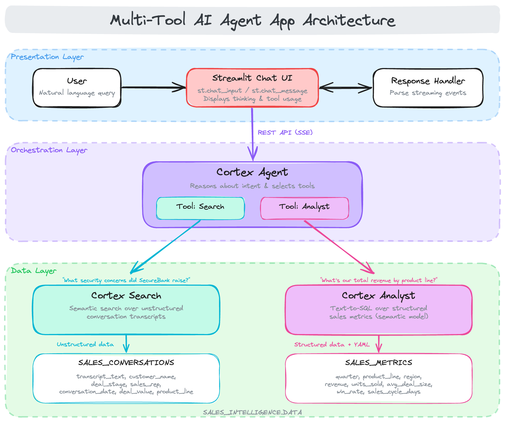
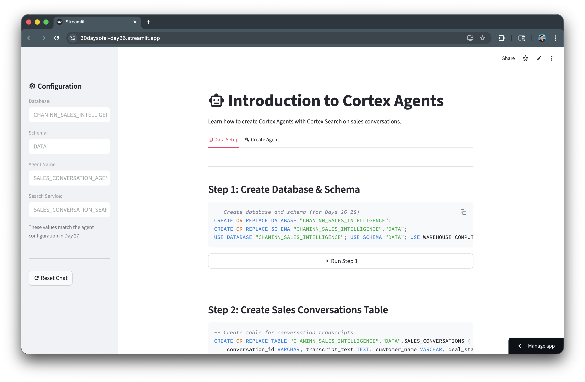
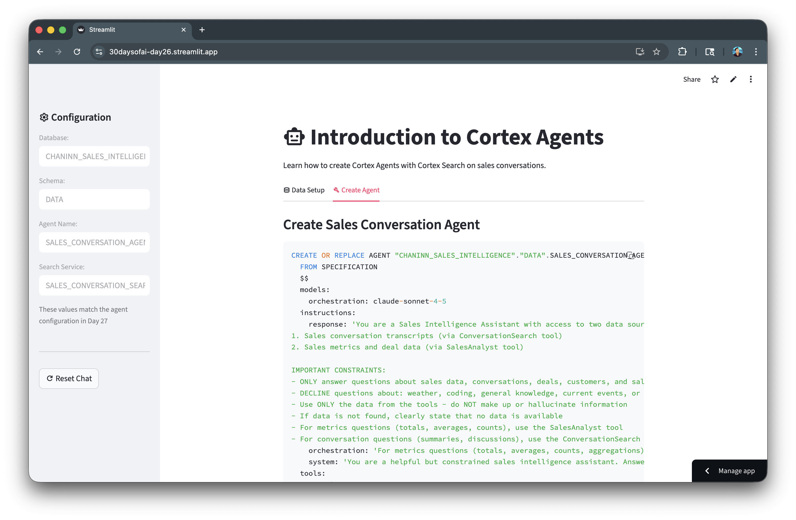
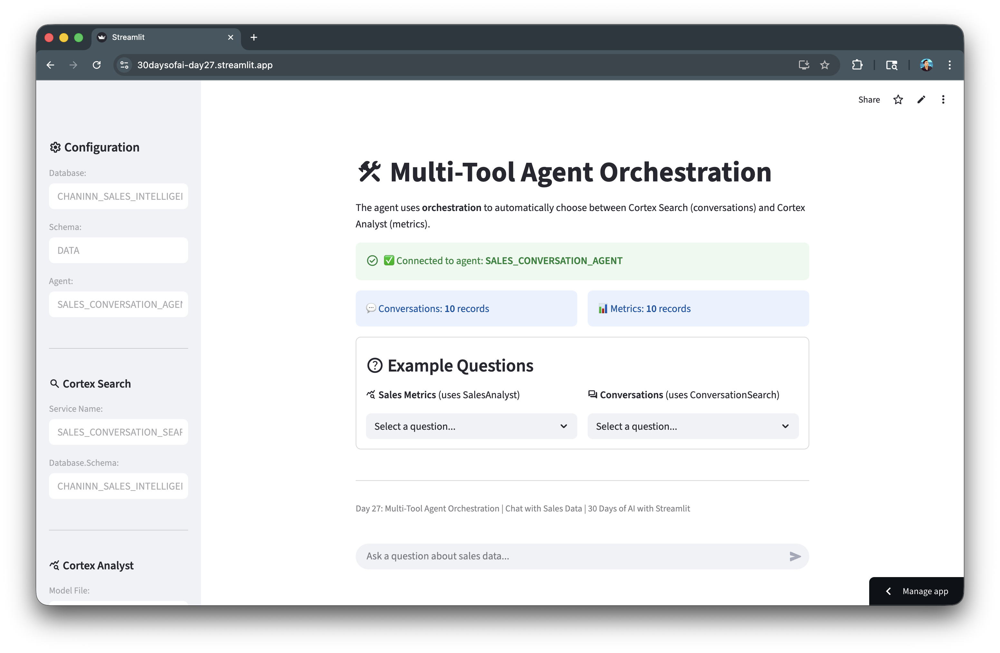

author: Chanin Nantasenamat
id: build-multi-tool-ai-agent-app-with-streamlit-and-snowflake-cortex
summary: Build a multi-tool Cortex Agent that orchestrates between Cortex Search and Cortex Analyst, featuring data preparation, agent creation, and a chat interface.
categories: snowflake-site:taxonomy/solution-center/certification/quickstart,snowflake-site:taxonomy/product/ai
language: en
environments: web
status: Published
feedback link: https://github.com/Snowflake-Labs/sfguides/issues
tags: Streamlit, Cortex Agent, Multi-Tool, Orchestration, AI

# Build a Multi-Tool AI Agent App with Streamlit and Snowflake Cortex
<!-- ------------------------ -->
## Overview

AI agents represent a significant evolution in how we interact with data. Unlike traditional chatbots that simply respond to queries, agents can reason about user intent, select appropriate tools, and orchestrate complex workflows autonomously. This capability is transformative for enterprise applications where users need to access multiple data sources (*e.g.* structured databases, unstructured documents, APIs) through a single conversational interface. By delegating tool selection to the agent, organizations can build intelligent assistants that adapt to diverse questions without requiring users to know which system holds the answer.

In this quickstart, you'll build a multi-tool Cortex Agent that intelligently orchestrates between different data sources. The agent uses Cortex Search for conversation transcripts and Cortex Analyst for structured sales metrics, automatically choosing the right tool based on user questions.

This tutorial is based on the [#30DaysOfAI learning challenge](https://github.com/streamlit/30DaysOfAI), a month-long journey exploring AI capabilities in Streamlit and Snowflake. The content here adapts Days 26-27 of the challenge into a self-contained quickstart guide.

### What You'll Learn

- How to prepare data for Cortex Agents (search service + semantic model) (Day 26)
- How to create a Cortex Agent with multiple tools (Day 26)
- How to build a chat interface that displays agent thinking and tool usage (Day 27)
- How to handle agent API responses and display results (Day 27)

### What You'll Build
A sales intelligence agent that can answer questions about sales conversations (using Cortex Search) and sales metrics (using Cortex Analyst text-to-SQL).



### Prerequisites
- Access to a [Snowflake account](https://signup.snowflake.com/?utm_source=snowflake-devrel&utm_medium=developer-guides&utm_cta=developer-guides)
- Basic knowledge of Python and Streamlit
- Cortex Agents enabled in your account

<!-- ------------------------ -->
## Getting Started

To get started, clone or download the code from the 30 Days of AI GitHub repository. This repository contains all the source code for both Day 26 (agent setup) and Day 27 (chat application).

```bash
git clone https://github.com/streamlit/30DaysOfAI.git
cd 30DaysOfAI/app
```

The app code for this quickstart:
- [Day 26: Agent Setup](https://github.com/streamlit/30DaysOfAI/blob/main/app/day26.py)
- [Day 27: Agent App](https://github.com/streamlit/30DaysOfAI/blob/main/app/day27.py)

<!-- ------------------------ -->
## Prepare the Data

Before creating the Cortex Agent, you need to set up the underlying data infrastructure. This includes creating a database, schema, and two tables: one for unstructured conversation transcripts and another for structured sales metrics.

> Note: This section is repurposed from Day 26 of the [#30DaysOfAI learning challenge](https://30daysofai.streamlit.app/?day=26).

### Create Database and Schema

First, create a dedicated database and schema to organize all the agent's data sources. This keeps your sales intelligence data isolated and easy to manage.

```sql
CREATE OR REPLACE DATABASE SALES_INTELLIGENCE;
CREATE OR REPLACE SCHEMA SALES_INTELLIGENCE.DATA;
USE DATABASE SALES_INTELLIGENCE;
USE SCHEMA DATA;
USE WAREHOUSE COMPUTE_WH;
```

### Create Sales Conversations Table

Next, create a table to store sales conversation transcripts. Each record contains the full transcript text along with metadata like `customer_name`, `deal_stage`, `sales_rep`, and `product_line`. This unstructured text data will be indexed by Cortex Search for semantic retrieval, allowing the agent to find relevant conversations based on meaning rather than exact keyword matches.

```sql
CREATE OR REPLACE TABLE SALES_INTELLIGENCE.DATA.SALES_CONVERSATIONS (
    conversation_id VARCHAR,
    transcript_text TEXT,
    customer_name VARCHAR,
    deal_stage VARCHAR,
    sales_rep VARCHAR,
    conversation_date TIMESTAMP,
    deal_value FLOAT,
    product_line VARCHAR
);

INSERT INTO SALES_INTELLIGENCE.DATA.SALES_CONVERSATIONS 
(conversation_id, transcript_text, customer_name, deal_stage, sales_rep, conversation_date, deal_value, product_line) 
VALUES
('CONV001', 'Initial discovery call with TechCorp Inc''s IT Director and Solutions Architect. Client showed strong interest in our enterprise solution features, particularly the automated workflow capabilities. Main discussion centered around integration timeline and complexity. They currently use Legacy System X for their core operations and expressed concerns about potential disruption during migration. Team asked detailed questions about API compatibility and data migration tools. Action items: 1) Provide detailed integration timeline document 2) Schedule technical deep-dive with their infrastructure team 3) Share case studies of similar Legacy System X migrations. Client mentioned Q2 budget allocation for digital transformation initiatives. Overall positive engagement with clear next steps.', 'TechCorp Inc', 'Discovery', 'Sarah Johnson', '2024-01-15 10:30:00', 75000, 'Enterprise Suite'),
('CONV002', 'Follow-up call with SmallBiz Solutions'' Operations Manager and Finance Director. Primary focus was on pricing structure and ROI timeline. They compared our Basic Package pricing with Competitor Y''s small business offering. Key discussion points included: monthly vs. annual billing options, user license limitations, and potential cost savings from process automation. Client requested detailed ROI analysis focusing on: 1) Time saved in daily operations 2) Resource allocation improvements 3) Projected efficiency gains. Budget constraints were clearly communicated - they have a maximum budget of $30K for this year. Showed interest in starting with basic package with room for potential upgrade in Q4. Need to provide competitive analysis and customized ROI calculator by next week.', 'SmallBiz Solutions', 'Negotiation', 'Mike Chen', '2024-01-16 14:45:00', 25000, 'Basic Package'),
('CONV003', 'Strategy session with SecureBank Ltd''s CISO and Security Operations team. Extremely positive 90-minute deep dive into our Premium Security package. Customer emphasized immediate need for implementation due to recent industry compliance updates. Our advanced security features, especially multi-factor authentication and encryption protocols, were identified as perfect fits for their requirements. Technical team was particularly impressed with our zero-trust architecture approach and real-time threat monitoring capabilities. They''ve already secured budget approval and have executive buy-in. Compliance documentation is ready for review. Action items include: finalizing implementation timeline, scheduling security audit, and preparing necessary documentation for their risk assessment team. Client ready to move forward with contract discussions.', 'SecureBank Ltd', 'Closing', 'Rachel Torres', '2024-01-17 11:20:00', 150000, 'Premium Security'),
('CONV004', 'Comprehensive discovery call with GrowthStart Up''s CTO and Department Heads. Team of 500+ employees across 3 continents discussed current challenges with their existing solution. Major pain points identified: system crashes during peak usage, limited cross-department reporting capabilities, and poor scalability for remote teams. Deep dive into their current workflow revealed bottlenecks in data sharing and collaboration. Technical requirements gathered for each department. Platform demo focused on scalability features and global team management capabilities. Client particularly interested in our API ecosystem and custom reporting engine. Next steps: schedule department-specific workflow analysis and prepare detailed platform migration plan.', 'GrowthStart Up', 'Discovery', 'Sarah Johnson', '2024-01-18 09:15:00', 100000, 'Enterprise Suite'),
('CONV005', 'In-depth demo session with DataDriven Co''s Analytics team and Business Intelligence managers. Showcase focused on advanced analytics capabilities, custom dashboard creation, and real-time data processing features. Team was particularly impressed with our machine learning integration and predictive analytics models. Competitor comparison requested specifically against Market Leader Z and Innovative Start-up X. Price point falls within their allocated budget range, but team expressed interest in multi-year commitment with corresponding discount structure. Technical questions centered around data warehouse integration and custom visualization capabilities. Action items: prepare detailed competitor feature comparison matrix and draft multi-year pricing proposals with various discount scenarios.', 'DataDriven Co', 'Demo', 'James Wilson', '2024-01-19 13:30:00', 85000, 'Analytics Pro'),
('CONV006', 'Extended technical deep dive with HealthTech Solutions'' IT Security team, Compliance Officer, and System Architects. Four-hour session focused on API infrastructure, data security protocols, and compliance requirements. Team raised specific concerns about HIPAA compliance, data encryption standards, and API rate limiting. Detailed discussion of our security architecture, including: end-to-end encryption, audit logging, and disaster recovery protocols. Client requires extensive documentation on compliance certifications, particularly SOC 2 and HITRUST. Security team performed initial architecture review and requested additional information about: database segregation, backup procedures, and incident response protocols. Follow-up session scheduled with their compliance team next week.', 'HealthTech Solutions', 'Technical Review', 'Rachel Torres', '2024-01-20 15:45:00', 120000, 'Premium Security'),
('CONV007', 'Contract review meeting with LegalEase Corp''s General Counsel, Procurement Director, and IT Manager. Detailed analysis of SLA terms, focusing on uptime guarantees and support response times. Legal team requested specific modifications to liability clauses and data handling agreements. Procurement raised questions about payment terms and service credit structure. Key discussion points included: disaster recovery commitments, data retention policies, and exit clause specifications. IT Manager confirmed technical requirements are met pending final security assessment. Agreement reached on most terms, with only SLA modifications remaining for discussion. Legal team to provide revised contract language by end of week. Overall positive session with clear path to closing.', 'LegalEase Corp', 'Negotiation', 'Mike Chen', '2024-01-21 10:00:00', 95000, 'Enterprise Suite'),
('CONV008', 'Quarterly business review with GlobalTrade Inc''s current implementation team and potential expansion stakeholders. Current implementation in Finance department showcasing strong adoption rates and 40% improvement in processing times. Discussion focused on expanding solution to Operations and HR departments. Users highlighted positive experiences with customer support and platform stability. Challenges identified in current usage: need for additional custom reports and increased automation in workflow processes. Expansion requirements gathered from Operations Director: inventory management integration, supplier portal access, and enhanced tracking capabilities. HR team interested in recruitment and onboarding workflow automation. Next steps: prepare department-specific implementation plans and ROI analysis for expansion.', 'GlobalTrade Inc', 'Expansion', 'James Wilson', '2024-01-22 14:20:00', 45000, 'Basic Package'),
('CONV009', 'Emergency planning session with FastTrack Ltd''s Executive team and Project Managers. Critical need for rapid implementation due to current system failure. Team willing to pay premium for expedited deployment and dedicated support team. Detailed discussion of accelerated implementation timeline and resource requirements. Key requirements: minimal disruption to operations, phased data migration, and emergency support protocols. Technical team confident in meeting aggressive timeline with additional resources. Executive sponsor emphasized importance of going live within 30 days. Immediate next steps: finalize expedited implementation plan, assign dedicated support team, and begin emergency onboarding procedures. Team to reconvene daily for progress updates.', 'FastTrack Ltd', 'Closing', 'Sarah Johnson', '2024-01-23 16:30:00', 180000, 'Premium Security'),
('CONV010', 'Quarterly strategic review with UpgradeNow Corp''s Department Heads and Analytics team. Current implementation meeting basic needs but team requiring more sophisticated analytics capabilities. Deep dive into current usage patterns revealed opportunities for workflow optimization and advanced reporting needs. Users expressed strong satisfaction with platform stability and basic features, but requiring enhanced data visualization and predictive analytics capabilities. Analytics team presented specific requirements: custom dashboard creation, advanced data modeling tools, and integrated BI features. Discussion about upgrade path from current package to Analytics Pro tier. ROI analysis presented showing potential 60% improvement in reporting efficiency. Team to present upgrade proposal to executive committee next month.', 'UpgradeNow Corp', 'Expansion', 'Rachel Torres', '2024-01-24 11:45:00', 65000, 'Analytics Pro');
```

### Create Sales Metrics Table

Now create the sales metrics table, which contains structured deal data. Unlike the conversations table, this data is highly structured with specific fields for deal values, close dates, win/loss status, and sales stages. Cortex Analyst will use this table to answer quantitative questions by generating and executing SQL queries based on natural language input.

```sql
CREATE OR REPLACE TABLE SALES_INTELLIGENCE.DATA.SALES_METRICS (
    deal_id VARCHAR,
    customer_name VARCHAR,
    deal_value FLOAT,
    close_date DATE,
    sales_stage VARCHAR,
    win_status BOOLEAN,
    sales_rep VARCHAR,
    product_line VARCHAR
);

INSERT INTO SALES_INTELLIGENCE.DATA.SALES_METRICS VALUES
('DEAL001', 'TechCorp Inc', 75000, '2024-02-15', 'Closed', true, 'Sarah Johnson', 'Enterprise Suite'),
('DEAL002', 'SmallBiz Solutions', 25000, '2024-02-01', 'Lost', false, 'Mike Chen', 'Basic Package'),
('DEAL003', 'SecureBank Ltd', 150000, '2024-01-30', 'Closed', true, 'Rachel Torres', 'Premium Security'),
('DEAL004', 'GrowthStart Up', 100000, '2024-02-10', 'Pending', false, 'Sarah Johnson', 'Enterprise Suite'),
('DEAL005', 'DataDriven Co', 85000, '2024-02-05', 'Closed', true, 'James Wilson', 'Analytics Pro'),
('DEAL006', 'HealthTech Solutions', 120000, '2024-02-20', 'Pending', false, 'Rachel Torres', 'Premium Security'),
('DEAL007', 'LegalEase Corp', 95000, '2024-01-25', 'Closed', true, 'Mike Chen', 'Enterprise Suite'),
('DEAL008', 'GlobalTrade Inc', 45000, '2024-02-08', 'Closed', true, 'James Wilson', 'Basic Package'),
('DEAL009', 'FastTrack Ltd', 180000, '2024-02-12', 'Closed', true, 'Sarah Johnson', 'Premium Security'),
('DEAL010', 'UpgradeNow Corp', 65000, '2024-02-18', 'Pending', false, 'Rachel Torres', 'Analytics Pro');
```

<!-- ------------------------ -->
## Create Cortex Search Service

With the data tables in place, you can now create a Cortex Search service to enable semantic search over the conversation transcripts. This service will index the transcript text and allow the agent to find relevant conversations based on the meaning of user queries.

### Enable Change Tracking

Before creating the search service, you must enable change tracking on the source table. This allows Cortex Search to detect when new records are added or existing records are modified, ensuring the search index stays up to date.

```sql
ALTER TABLE SALES_INTELLIGENCE.DATA.SALES_CONVERSATIONS SET CHANGE_TRACKING = TRUE;
```

### Create the Search Service

Now create the Cortex Search service itself. The `ON` clause specifies which column to index for semantic search (the transcript text). The `ATTRIBUTES` clause defines which additional columns to return with search results. The `TARGET_LAG` parameter controls how frequently the service re-indexes new data—in this case, within one hour of any changes.

```sql
CREATE CORTEX SEARCH SERVICE IF NOT EXISTS SALES_INTELLIGENCE.DATA.SALES_CONVERSATION_SEARCH
    ON transcript_text
    ATTRIBUTES customer_name, deal_stage, sales_rep
    WAREHOUSE = COMPUTE_WH
    TARGET_LAG = '1 hour'
    AS (
        SELECT 
            transcript_text,
            customer_name,
            deal_stage,
            sales_rep,
            conversation_date
        FROM SALES_INTELLIGENCE.DATA.SALES_CONVERSATIONS
        WHERE conversation_date >= '2024-01-01'
    );
```

### Verify the Service

After creating the search service, verify it was set up correctly by listing all Cortex Search services in the schema. The service may take a minute or two to finish indexing the data.

```sql
SHOW CORTEX SEARCH SERVICES IN SCHEMA SALES_INTELLIGENCE.DATA;
```

<!-- ------------------------ -->
## Create Semantic Model

Cortex Analyst requires a semantic model to understand your data schema and generate accurate SQL queries. The semantic model is a YAML file that describes your tables, columns, data types, and provides helpful metadata like descriptions and synonyms.

### Create Stage for Model

First, create a Snowflake stage to store the semantic model YAML file. Stages are storage locations that can hold files for use within Snowflake.

```sql
CREATE STAGE IF NOT EXISTS SALES_INTELLIGENCE.DATA.MODELS;
```

### Semantic Model YAML

Create the semantic model file named `sales_metrics_model.yaml`. This file defines the structure of your SALES_METRICS table including:
- **Dimensions**: Categorical fields like customer name, sales stage, and product line
- **Time dimensions**: Date fields that enable time-based analysis
- **Measures**: Numeric fields like deal value that can be aggregated

Each field includes a description and synonyms to help Cortex Analyst understand user queries that may use different terminology.

```yaml
name: sales_metrics
description: Sales metrics and analytics model
tables:
  - name: SALES_METRICS
    base_table:
      database: SALES_INTELLIGENCE
      schema: DATA
      table: SALES_METRICS
    dimensions:
      - name: DEAL_ID
        expr: DEAL_ID
        data_type: VARCHAR(16777216)
        sample_values: [DEAL001, DEAL002, DEAL003]
        description: Unique identifier for a sales deal, used to track and analyze individual sales agreements.
        synonyms: [Transaction ID, Agreement ID, Contract ID, Sale ID, Order ID, Deal Number]
      - name: CUSTOMER_NAME
        expr: CUSTOMER_NAME
        data_type: VARCHAR(16777216)
        sample_values: [TechCorp Inc, SmallBiz Solutions, SecureBank Ltd]
        description: The name of the customer associated with a particular sale or transaction.
        synonyms: [client, buyer, purchaser, account_name, account_holder]
      - name: SALES_STAGE
        expr: SALES_STAGE
        data_type: VARCHAR(16777216)
        sample_values: [Closed, Lost, Pending]
        description: The current stage of a sales opportunity, indicating whether it has been successfully closed, lost to a competitor, or is still pending a decision.
        synonyms: [deal_status, sales_phase, opportunity_state, pipeline_position]
      - name: WIN_STATUS
        expr: WIN_STATUS
        data_type: BOOLEAN
        sample_values: ['TRUE', 'FALSE']
        description: Indicates whether a sale was won (TRUE) or lost (FALSE).
        synonyms: [won, success, closed, converted, achieved, accomplished]
      - name: SALES_REP
        expr: SALES_REP
        data_type: VARCHAR(16777216)
        sample_values: [Sarah Johnson, Mike Chen, Rachel Torres]
        description: The sales representative responsible for the sale.
        synonyms: [salesperson, account_manager, representative, agent]
      - name: PRODUCT_LINE
        expr: PRODUCT_LINE
        data_type: VARCHAR(16777216)
        sample_values: [Enterprise Suite, Basic Package, Premium Security]
        description: This column categorizes sales by the type of product or service offered, distinguishing between the comprehensive Enterprise Suite, the standard Basic Package, and the advanced Premium Security package.
        synonyms: [product family, item category, merchandise type, goods classification, commodity group]
    time_dimensions:
      - name: CLOSE_DATE
        expr: CLOSE_DATE
        data_type: DATE
        sample_values: ['2024-02-15', '2024-02-01', '2024-01-30']
        description: The date on which a sale was closed or finalized.
        synonyms: [completion date, sale date, deal close date, transaction date, sale completion date]
    measures:
      - name: DEAL_VALUE
        expr: DEAL_VALUE
        data_type: FLOAT
        sample_values: ['75000', '25000', '150000']
        description: The total monetary value of a sales deal or transaction.
        synonyms: [revenue, sale_amount, transaction_value, deal_amount, sale_price]
```

### Upload to Stage

After creating the YAML file locally, upload it to the Snowflake stage using the PUT command. Replace `/path/to/` with the actual path to your local file. The `AUTO_COMPRESS=FALSE` option ensures the file remains readable, and `OVERWRITE=TRUE` replaces any existing version.

```sql
PUT file:///path/to/sales_metrics_model.yaml @SALES_INTELLIGENCE.DATA.MODELS AUTO_COMPRESS=FALSE OVERWRITE=TRUE;
```

<!-- ------------------------ -->
## Create the Cortex Agent

Now you're ready to create the Cortex Agent itself. The agent combines the Cortex Search service and Cortex Analyst with semantic model into a unified interface that can intelligently route user questions to the appropriate tool.

### Agent Creation SQL

The agent is defined using a YAML specification that includes:
- **Model**: The LLM that powers the agent's reasoning (Claude Sonnet 4.5)
- **Instructions**: System prompts that define the agent's behavior and constraints
- **Orchestration**: Rules for when to use each tool
- **Tools**: The Cortex Search and Cortex Analyst services the agent can invoke
- **Tool resources**: Configuration for each tool including data sources and execution settings

The orchestration instruction is particularly important as it tells the agent to use `SalesAnalyst` for quantitative questions (*e.g.* totals, averages, counts) and `ConversationSearch` for qualitative questions (*e.g.* summaries, discussions).

```sql
CREATE OR REPLACE AGENT SALES_INTELLIGENCE.DATA.SALES_CONVERSATION_AGENT
FROM SPECIFICATION
$$
models:
  orchestration: claude-sonnet-4-5
instructions:
  response: 'You are a Sales Intelligence Assistant with access to two data sources:
1. Sales conversation transcripts (via ConversationSearch tool)
2. Sales metrics and deal data (via SalesAnalyst tool)

IMPORTANT CONSTRAINTS:
- ONLY answer questions about sales data, conversations, deals, customers, and sales metrics
- DECLINE questions about: weather, coding, general knowledge, current events, or any non-sales topics
- Use ONLY the data from the tools - do NOT make up or hallucinate information
- If data is not found, clearly state that no data is available
- For metrics questions (totals, averages, counts), use the SalesAnalyst tool
- For conversation questions (summaries, discussions), use the ConversationSearch tool'
  orchestration: 'For metrics questions (totals, averages, counts, aggregations), use SalesAnalyst. For conversation questions (summaries, what was discussed), use ConversationSearch. Decline off-topic questions politely.'
  system: 'You are a helpful but constrained sales intelligence assistant. Answer ONLY from available data.'
tools:
  - tool_spec:
      type: "cortex_search"
      name: "ConversationSearch"
      description: "Searches sales conversation transcripts"
  - tool_spec:
      type: "cortex_analyst_text_to_sql"
      name: "SalesAnalyst"
      description: "Generates and executes SQL queries on sales metrics"
tool_resources:
  ConversationSearch:
    name: "SALES_INTELLIGENCE.DATA.SALES_CONVERSATION_SEARCH"
    max_results: "5"
  SalesAnalyst:
    semantic_model_file: "@SALES_INTELLIGENCE.DATA.MODELS/sales_metrics_model.yaml"
    execution_environment:
      type: "warehouse"
      warehouse: "COMPUTE_WH"
      query_timeout: 60
$$;
```

### Verify Agent

Confirm the agent was created successfully by listing all agents in the schema. You should see SALES_CONVERSATION_AGENT in the results.

```sql
SHOW AGENTS IN SCHEMA SALES_INTELLIGENCE.DATA;
```

### App for Data Preparation and Agent Creation

The complete Streamlit app below integrates all the SQL code blocks from the previous sections into an interactive interface. Rather than running each SQL statement manually in a worksheet, you can execute the entire data preparation and agent creation workflow directly from the app.

Each section of the app corresponds to a step in the setup process: creating the database and tables, setting up the Cortex Search service, uploading the semantic model, and creating the agent. Clicking the action buttons in the app triggers the execution of the corresponding SQL code blocks, allowing you to build the entire infrastructure with just a few clicks while monitoring the status of each step.





```python
import streamlit as st

try:
    from snowflake.snowpark.context import get_active_session
    session = get_active_session()
except:
    from snowflake.snowpark import Session
    session = Session.builder.configs(st.secrets["connections"]["snowflake"]).create()

st.title(":material/smart_toy: Introduction to Cortex Agents")
st.write("Learn how to create Cortex Agents with Cortex Search on sales conversations.")

st.session_state.setdefault("agent_created", False)

with st.sidebar:
    st.header(":material/settings: Configuration")
    db_name, schema_name, agent_name, search_service = "SALES_INTELLIGENCE", "DATA", "SALES_CONVERSATION_AGENT", "SALES_CONVERSATION_SEARCH"
    st.text_input("Database:", db_name, disabled=True)
    st.text_input("Schema:", schema_name, disabled=True)
    st.text_input("Agent Name:", agent_name, disabled=True)
    st.text_input("Search Service:", search_service, disabled=True)
    st.caption("These values match the agent configuration in Day 27")
    st.divider()
    if st.button(":material/refresh: Reset Chat"):
        st.session_state.messages = []
        st.rerun()

tab0, tab1 = st.tabs([":material/database: Data Setup", ":material/build: Create Agent"])

with tab0:
    st.markdown("---\n### Step 1: Create Database & Schema")
    setup_step1 = f"""CREATE OR REPLACE DATABASE "{db_name}";
CREATE OR REPLACE SCHEMA "{db_name}"."{schema_name}";
USE DATABASE "{db_name}"; USE SCHEMA "{schema_name}"; USE WAREHOUSE COMPUTE_WH;"""
    st.code(setup_step1, language="sql")
    
    if st.button(":material/play_arrow: Run Step 1", key="run_step1", use_container_width=True):
        with st.spinner("Creating database and schema..."):
            try:
                for sql in [f'CREATE OR REPLACE DATABASE "{db_name}"', f'CREATE OR REPLACE SCHEMA "{db_name}"."{schema_name}"',
                           f'USE DATABASE "{db_name}"', f'USE SCHEMA "{schema_name}"', "USE WAREHOUSE COMPUTE_WH"]:
                    session.sql(sql).collect()
                st.success("Step 1 complete!")
            except Exception as e:
                st.error(f"Error: {e}")
    
    st.markdown("---\n### Step 2: Create Sales Conversations Table")
    setup_step2 = f"""CREATE OR REPLACE TABLE "{db_name}"."{schema_name}".SALES_CONVERSATIONS (
    conversation_id VARCHAR, transcript_text TEXT, customer_name VARCHAR, deal_stage VARCHAR,
    sales_rep VARCHAR, conversation_date TIMESTAMP, deal_value FLOAT, product_line VARCHAR
);"""
    st.code(setup_step2, language="sql")
    
    if st.button(":material/play_arrow: Run Step 2", key="run_step2", use_container_width=True):
        with st.spinner("Creating table and inserting data..."):
            try:
                session.sql(f"""CREATE OR REPLACE TABLE "{db_name}"."{schema_name}".SALES_CONVERSATIONS (
                    conversation_id VARCHAR, transcript_text TEXT, customer_name VARCHAR, deal_stage VARCHAR,
                    sales_rep VARCHAR, conversation_date TIMESTAMP, deal_value FLOAT, product_line VARCHAR)""").collect()
                
                session.sql(f"""INSERT INTO "{db_name}"."{schema_name}".SALES_CONVERSATIONS 
                (conversation_id, transcript_text, customer_name, deal_stage, sales_rep, conversation_date, deal_value, product_line) VALUES
                ('CONV001', 'Initial discovery call with TechCorp Inc''s IT Director and Solutions Architect. Client showed strong interest in our enterprise solution features, particularly the automated workflow capabilities. Main discussion centered around integration timeline and complexity. They currently use Legacy System X for their core operations and expressed concerns about potential disruption during migration. Team asked detailed questions about API compatibility and data migration tools. Action items: 1) Provide detailed integration timeline document 2) Schedule technical deep-dive with their infrastructure team 3) Share case studies of similar Legacy System X migrations. Client mentioned Q2 budget allocation for digital transformation initiatives. Overall positive engagement with clear next steps.', 'TechCorp Inc', 'Discovery', 'Sarah Johnson', '2024-01-15 10:30:00', 75000, 'Enterprise Suite'),
                ('CONV002', 'Follow-up call with SmallBiz Solutions'' Operations Manager and Finance Director. Primary focus was on pricing structure and ROI timeline. They compared our Basic Package pricing with Competitor Y''s small business offering. Key discussion points included: monthly vs. annual billing options, user license limitations, and potential cost savings from process automation. Client requested detailed ROI analysis focusing on: 1) Time saved in daily operations 2) Resource allocation improvements 3) Projected efficiency gains. Budget constraints were clearly communicated - they have a maximum budget of $30K for this year. Showed interest in starting with basic package with room for potential upgrade in Q4. Need to provide competitive analysis and customized ROI calculator by next week.', 'SmallBiz Solutions', 'Negotiation', 'Mike Chen', '2024-01-16 14:45:00', 25000, 'Basic Package'),
                ('CONV003', 'Strategy session with SecureBank Ltd''s CISO and Security Operations team. Extremely positive 90-minute deep dive into our Premium Security package. Customer emphasized immediate need for implementation due to recent industry compliance updates. Our advanced security features, especially multi-factor authentication and encryption protocols, were identified as perfect fits for their requirements. Technical team was particularly impressed with our zero-trust architecture approach and real-time threat monitoring capabilities. They''ve already secured budget approval and have executive buy-in. Compliance documentation is ready for review. Action items include: finalizing implementation timeline, scheduling security audit, and preparing necessary documentation for their risk assessment team. Client ready to move forward with contract discussions.', 'SecureBank Ltd', 'Closing', 'Rachel Torres', '2024-01-17 11:20:00', 150000, 'Premium Security'),
                ('CONV004', 'Comprehensive discovery call with GrowthStart Up''s CTO and Department Heads. Team of 500+ employees across 3 continents discussed current challenges with their existing solution. Major pain points identified: system crashes during peak usage, limited cross-department reporting capabilities, and poor scalability for remote teams. Deep dive into their current workflow revealed bottlenecks in data sharing and collaboration. Technical requirements gathered for each department. Platform demo focused on scalability features and global team management capabilities. Client particularly interested in our API ecosystem and custom reporting engine. Next steps: schedule department-specific workflow analysis and prepare detailed platform migration plan.', 'GrowthStart Up', 'Discovery', 'Sarah Johnson', '2024-01-18 09:15:00', 100000, 'Enterprise Suite'),
                ('CONV005', 'In-depth demo session with DataDriven Co''s Analytics team and Business Intelligence managers. Showcase focused on advanced analytics capabilities, custom dashboard creation, and real-time data processing features. Team was particularly impressed with our machine learning integration and predictive analytics models. Competitor comparison requested specifically against Market Leader Z and Innovative Start-up X. Price point falls within their allocated budget range, but team expressed interest in multi-year commitment with corresponding discount structure. Technical questions centered around data warehouse integration and custom visualization capabilities. Action items: prepare detailed competitor feature comparison matrix and draft multi-year pricing proposals with various discount scenarios.', 'DataDriven Co', 'Demo', 'James Wilson', '2024-01-19 13:30:00', 85000, 'Analytics Pro'),
                ('CONV006', 'Extended technical deep dive with HealthTech Solutions'' IT Security team, Compliance Officer, and System Architects. Four-hour session focused on API infrastructure, data security protocols, and compliance requirements. Team raised specific concerns about HIPAA compliance, data encryption standards, and API rate limiting. Detailed discussion of our security architecture, including: end-to-end encryption, audit logging, and disaster recovery protocols. Client requires extensive documentation on compliance certifications, particularly SOC 2 and HITRUST. Security team performed initial architecture review and requested additional information about: database segregation, backup procedures, and incident response protocols. Follow-up session scheduled with their compliance team next week.', 'HealthTech Solutions', 'Technical Review', 'Rachel Torres', '2024-01-20 15:45:00', 120000, 'Premium Security'),
                ('CONV007', 'Contract review meeting with LegalEase Corp''s General Counsel, Procurement Director, and IT Manager. Detailed analysis of SLA terms, focusing on uptime guarantees and support response times. Legal team requested specific modifications to liability clauses and data handling agreements. Procurement raised questions about payment terms and service credit structure. Key discussion points included: disaster recovery commitments, data retention policies, and exit clause specifications. IT Manager confirmed technical requirements are met pending final security assessment. Agreement reached on most terms, with only SLA modifications remaining for discussion. Legal team to provide revised contract language by end of week. Overall positive session with clear path to closing.', 'LegalEase Corp', 'Negotiation', 'Mike Chen', '2024-01-21 10:00:00', 95000, 'Enterprise Suite'),
                ('CONV008', 'Quarterly business review with GlobalTrade Inc''s current implementation team and potential expansion stakeholders. Current implementation in Finance department showcasing strong adoption rates and 40% improvement in processing times. Discussion focused on expanding solution to Operations and HR departments. Users highlighted positive experiences with customer support and platform stability. Challenges identified in current usage: need for additional custom reports and increased automation in workflow processes. Expansion requirements gathered from Operations Director: inventory management integration, supplier portal access, and enhanced tracking capabilities. HR team interested in recruitment and onboarding workflow automation. Next steps: prepare department-specific implementation plans and ROI analysis for expansion.', 'GlobalTrade Inc', 'Expansion', 'James Wilson', '2024-01-22 14:20:00', 45000, 'Basic Package'),
                ('CONV009', 'Emergency planning session with FastTrack Ltd''s Executive team and Project Managers. Critical need for rapid implementation due to current system failure. Team willing to pay premium for expedited deployment and dedicated support team. Detailed discussion of accelerated implementation timeline and resource requirements. Key requirements: minimal disruption to operations, phased data migration, and emergency support protocols. Technical team confident in meeting aggressive timeline with additional resources. Executive sponsor emphasized importance of going live within 30 days. Immediate next steps: finalize expedited implementation plan, assign dedicated support team, and begin emergency onboarding procedures. Team to reconvene daily for progress updates.', 'FastTrack Ltd', 'Closing', 'Sarah Johnson', '2024-01-23 16:30:00', 180000, 'Premium Security'),
                ('CONV010', 'Quarterly strategic review with UpgradeNow Corp''s Department Heads and Analytics team. Current implementation meeting basic needs but team requiring more sophisticated analytics capabilities. Deep dive into current usage patterns revealed opportunities for workflow optimization and advanced reporting needs. Users expressed strong satisfaction with platform stability and basic features, but requiring enhanced data visualization and predictive analytics capabilities. Analytics team presented specific requirements: custom dashboard creation, advanced data modeling tools, and integrated BI features. Discussion about upgrade path from current package to Analytics Pro tier. ROI analysis presented showing potential 60% improvement in reporting efficiency. Team to present upgrade proposal to executive committee next month.', 'UpgradeNow Corp', 'Expansion', 'Rachel Torres', '2024-01-24 11:45:00', 65000, 'Analytics Pro')
                """).collect()
                st.success("Step 2 complete! Table created with 10 comprehensive conversation transcripts")
            except Exception as e:
                st.error(f"Error: {e}")
    
    st.markdown("---\n### Step 3: Create Cortex Search Service")
    st.info("**Cortex Search** creates a semantic search index on your text data. This enables the agent to find relevant conversations based on meaning, not just keywords.")
    setup_step3 = f"""ALTER TABLE "{db_name}"."{schema_name}".SALES_CONVERSATIONS SET CHANGE_TRACKING = TRUE;

CREATE CORTEX SEARCH SERVICE IF NOT EXISTS "{db_name}"."{schema_name}".{search_service}
  ON transcript_text ATTRIBUTES customer_name, deal_stage, sales_rep WAREHOUSE = COMPUTE_WH TARGET_LAG = '1 hour'
  AS (SELECT transcript_text, customer_name, deal_stage, sales_rep, conversation_date
      FROM "{db_name}"."{schema_name}".SALES_CONVERSATIONS WHERE conversation_date >= '2024-01-01');"""
    st.code(setup_step3, language="sql")
    
    if st.button(":material/play_arrow: Run Step 3", key="run_step3", use_container_width=True):
        with st.status("Setting up Cortex Search...", expanded=True) as status:
            try:
                st.write(":material/search: Checking for existing search service...")
                try:
                    existing = session.sql(f'SHOW CORTEX SEARCH SERVICES IN SCHEMA "{db_name}"."{schema_name}"').collect()
                    service_exists = any(row['name'] == search_service for row in existing)
                except:
                    service_exists = False
                
                if service_exists:
                    st.write(f":material/check_circle: Search service '{search_service}' already exists")
                    status.update(label="Step 3 complete (service already exists)!", state="complete")
                else:
                    st.write(":material/update: Enabling change tracking on table...")
                    session.sql(f'ALTER TABLE "{db_name}"."{schema_name}".SALES_CONVERSATIONS SET CHANGE_TRACKING = TRUE').collect()
                    
                    st.write(":material/build: Creating Cortex Search service (this takes 30-60 seconds)...")
                    session.sql(f"""CREATE CORTEX SEARCH SERVICE "{db_name}"."{schema_name}".{search_service}
                        ON transcript_text ATTRIBUTES customer_name, deal_stage, sales_rep WAREHOUSE = COMPUTE_WH TARGET_LAG = '1 hour'
                        AS (SELECT transcript_text, customer_name, deal_stage, sales_rep, conversation_date
                            FROM "{db_name}"."{schema_name}".SALES_CONVERSATIONS WHERE conversation_date >= '2024-01-01')""").collect()
                    
                    st.write(":material/check_circle: Search service created successfully")
                    status.update(label="Step 3 complete! Service is indexing in background (1-2 min)", state="complete")
            except Exception as e:
                st.error(f"Error: {e}")
                status.update(label="Failed", state="error")
    
    st.markdown("---\n### Step 4: Create Sales Metrics Table")
    st.info("**Sales Metrics Table** contains structured deal data that Cortex Analyst will query.")
    setup_step4 = f"""CREATE OR REPLACE TABLE "{db_name}"."{schema_name}".SALES_METRICS (
    deal_id VARCHAR, customer_name VARCHAR, deal_value FLOAT, close_date DATE,
    sales_stage VARCHAR, win_status BOOLEAN, sales_rep VARCHAR, product_line VARCHAR);"""
    st.code(setup_step4, language="sql")
    
    if st.button(":material/play_arrow: Run Step 4", key="run_step4", use_container_width=True):
        with st.spinner("Creating sales metrics table..."):
            try:
                session.sql(f"""CREATE OR REPLACE TABLE "{db_name}"."{schema_name}".SALES_METRICS (
                    deal_id VARCHAR, customer_name VARCHAR, deal_value FLOAT, close_date DATE,
                    sales_stage VARCHAR, win_status BOOLEAN, sales_rep VARCHAR, product_line VARCHAR)""").collect()
                session.sql(f"""INSERT INTO "{db_name}"."{schema_name}".SALES_METRICS VALUES
                    ('DEAL001', 'TechCorp Inc', 75000, '2024-02-15', 'Closed', true, 'Sarah Johnson', 'Enterprise Suite'),
                    ('DEAL002', 'SmallBiz Solutions', 25000, '2024-02-01', 'Lost', false, 'Mike Chen', 'Basic Package'),
                    ('DEAL003', 'SecureBank Ltd', 150000, '2024-01-30', 'Closed', true, 'Rachel Torres', 'Premium Security'),
                    ('DEAL004', 'GrowthStart Up', 100000, '2024-02-10', 'Pending', false, 'Sarah Johnson', 'Enterprise Suite'),
                    ('DEAL005', 'DataDriven Co', 85000, '2024-02-05', 'Closed', true, 'James Wilson', 'Analytics Pro'),
                    ('DEAL006', 'HealthTech Solutions', 120000, '2024-02-20', 'Pending', false, 'Rachel Torres', 'Premium Security'),
                    ('DEAL007', 'LegalEase Corp', 95000, '2024-01-25', 'Closed', true, 'Mike Chen', 'Enterprise Suite'),
                    ('DEAL008', 'GlobalTrade Inc', 45000, '2024-02-08', 'Closed', true, 'James Wilson', 'Basic Package'),
                    ('DEAL009', 'FastTrack Ltd', 180000, '2024-02-12', 'Closed', true, 'Sarah Johnson', 'Premium Security'),
                    ('DEAL010', 'UpgradeNow Corp', 65000, '2024-02-18', 'Pending', false, 'Rachel Torres', 'Analytics Pro')""").collect()
                st.success("Step 4 complete! Sales metrics table created with 10 deals")
            except Exception as e:
                st.error(f"Error: {e}")
    
    st.markdown("---\n### Step 5: Upload Semantic Model YAML")
    st.info("**Semantic Model** tells Cortex Analyst how to interpret your database schema. Download the YAML file and upload it to a Snowflake stage.")
    
    semantic_model_yaml = f"""name: sales_metrics
description: Sales metrics and analytics model
tables:
  - name: SALES_METRICS
    base_table:
      database: {db_name}
      schema: {schema_name}
      table: SALES_METRICS
    dimensions:
      - name: DEAL_ID
        expr: DEAL_ID
        data_type: VARCHAR(16777216)
        sample_values: [DEAL001, DEAL002, DEAL003]
        description: Unique identifier for a sales deal.
        synonyms: [Transaction ID, Agreement ID, Contract ID]
      - name: CUSTOMER_NAME
        expr: CUSTOMER_NAME
        data_type: VARCHAR(16777216)
        sample_values: [TechCorp Inc, SmallBiz Solutions, SecureBank Ltd]
        description: The name of the customer associated with a sale.
        synonyms: [client, buyer, account_name]
      - name: SALES_STAGE
        expr: SALES_STAGE
        data_type: VARCHAR(16777216)
        sample_values: [Closed, Lost, Pending]
        description: The current stage of a sales opportunity.
        synonyms: [deal_status, sales_phase, opportunity_state]
      - name: WIN_STATUS
        expr: WIN_STATUS
        data_type: BOOLEAN
        sample_values: ['TRUE', 'FALSE']
        description: Indicates whether a sale was won (TRUE) or lost (FALSE).
        synonyms: [won, success, closed]
      - name: SALES_REP
        expr: SALES_REP
        data_type: VARCHAR(16777216)
        sample_values: [Sarah Johnson, Mike Chen, Rachel Torres]
        description: The sales representative responsible for the sale.
        synonyms: [salesperson, account_manager, representative]
      - name: PRODUCT_LINE
        expr: PRODUCT_LINE
        data_type: VARCHAR(16777216)
        sample_values: [Enterprise Suite, Basic Package, Premium Security]
        description: The type of product or service offered.
        synonyms: [product family, item category]
    time_dimensions:
      - name: CLOSE_DATE
        expr: CLOSE_DATE
        data_type: DATE
        sample_values: ['2024-02-15', '2024-02-01', '2024-01-30']
        description: The date on which a sale was closed.
        synonyms: [completion date, sale date, deal close date]
    measures:
      - name: DEAL_VALUE
        expr: DEAL_VALUE
        data_type: FLOAT
        sample_values: ['75000', '25000', '150000']
        description: The total monetary value of a sales deal.
        synonyms: [revenue, sale_amount, transaction_value]
"""
    
    st.code(semantic_model_yaml, language="yaml")
    
    col1, col2 = st.columns(2)
    with col1:
        st.download_button(":material/download: Download YAML", semantic_model_yaml, "sales_metrics_model.yaml", 
                          "application/x-yaml", use_container_width=True)
    with col2:
        if st.button(":material/cloud_upload: Auto-Upload to Stage", key="run_step5", use_container_width=True, type="primary"):
            with st.spinner("Creating stage and uploading YAML..."):
                try:
                    import tempfile, os
                    session.sql(f'CREATE STAGE IF NOT EXISTS "{db_name}"."{schema_name}".MODELS').collect()
                    
                    try:
                        files = session.sql(f'LIST @"{db_name}"."{schema_name}".MODELS').collect()
                        for row in files:
                            fname = str(row['name']).split('/')[-1]
                            if 'sales_metrics_model' in fname.lower():
                                session.sql(f'REMOVE @"{db_name}"."{schema_name}".MODELS/{fname}').collect()
                    except: pass
                    
                    temp_dir = tempfile.mkdtemp()
                    temp_file_path = os.path.join(temp_dir, 'sales_metrics_model.yaml')
                    try:
                        with open(temp_file_path, 'w', encoding='utf-8') as f:
                            f.write(semantic_model_yaml)
                        session.file.put(temp_file_path, f'@"{db_name}"."{schema_name}".MODELS', auto_compress=False, overwrite=True)
                        
                        files = session.sql(f'LIST @"{db_name}"."{schema_name}".MODELS').collect()
                        uploaded_files = [str(row['name']).split('/')[-1] for row in files]
                        if 'sales_metrics_model.yaml' in uploaded_files:
                            st.success("Step 5 complete! YAML uploaded as `sales_metrics_model.yaml`")
                        else:
                            found_file = next((f for f in uploaded_files if 'sales_metrics_model' in f.lower()), None)
                            if found_file:
                                st.warning(f"File uploaded as `{found_file}` instead of `sales_metrics_model.yaml`")
                            else:
                                st.error("Upload succeeded but file not found in stage listing")
                    finally:
                        try:
                            if os.path.exists(temp_file_path): os.remove(temp_file_path)
                            if os.path.exists(temp_dir): os.rmdir(temp_dir)
                        except: pass
                except Exception as e:
                    st.error(f"Auto-upload failed: {str(e)}")
                    st.info("Use the 'Download YAML' button and upload manually via Snowsight instead")
    
    st.markdown("---\n### Step 6: Verify Complete Setup")
    if st.button(":material/verified: Check if Data is Ready", type="primary", use_container_width=True):
        with st.status("Verifying setup...", expanded=True) as status:
            all_good = True
            checks = [
                (f'USE DATABASE "{db_name}"', "Database exists"),
                (f'SELECT COUNT(*) as cnt FROM "{db_name}"."{schema_name}".SALES_CONVERSATIONS', "Conversations table", True),
                (f'SHOW CORTEX SEARCH SERVICES IN SCHEMA "{db_name}"."{schema_name}"', "Cortex Search service", False, search_service),
                (f'SELECT COUNT(*) as cnt FROM "{db_name}"."{schema_name}".SALES_METRICS', "Sales metrics table", True, None, True),
                (f'SHOW STAGES IN SCHEMA "{db_name}"."{schema_name}"', "MODELS stage", False, "MODELS", True)
            ]
            
            for check in checks:
                sql, name = check[0], check[1]
                try:
                    result = session.sql(sql).collect()
                    if len(check) > 2 and check[2]:
                        st.write(f":material/check_circle: {name} with {result[0]['CNT']} records")
                    elif len(check) > 3 and check[3]:
                        found = any(check[3] in str(r) for r in result)
                        if found:
                            st.write(f":material/check_circle: {name}")
                        else:
                            st.write(f":material/{'warning' if len(check) > 4 else 'cancel'}: {name} not found")
                            if len(check) <= 4: all_good = False
                    else:
                        st.write(f":material/check_circle: {name}")
                except:
                    st.write(f":material/{'warning' if len(check) > 4 else 'cancel'}: {name} not found")
                    if len(check) <= 4: all_good = False
            
            if all_good:
                status.update(label=":material/celebration: Day 27 data ready!", state="complete")
                st.balloons()
            else:
                status.update(label="Complete Steps 1-5 before proceeding", state="error")

with tab1:
    st.markdown("### Create Sales Conversation Agent")
    
    instructions = """You are a Sales Intelligence Assistant with access to two data sources:
1. Sales conversation transcripts (via ConversationSearch tool)
2. Sales metrics and deal data (via SalesAnalyst tool)

IMPORTANT CONSTRAINTS:
- ONLY answer questions about sales data, conversations, deals, customers, and sales metrics
- DECLINE questions about: weather, coding, general knowledge, current events, or any non-sales topics
- Use ONLY the data from the tools - do NOT make up or hallucinate information
- If data is not found, clearly state that no data is available
- For metrics questions (totals, averages, counts), use the SalesAnalyst tool
- For conversation questions (summaries, discussions), use the ConversationSearch tool"""
    
    create_sql = f"""CREATE OR REPLACE AGENT "{db_name}"."{schema_name}".{agent_name}
  FROM SPECIFICATION
  $$
  models:
    orchestration: claude-sonnet-4-5
  instructions:
    response: '{instructions.replace("'", "''")}'
    orchestration: 'For metrics questions (totals, averages, counts, aggregations), use SalesAnalyst. For conversation questions (summaries, what was discussed), use ConversationSearch. Decline off-topic questions politely.'
    system: 'You are a helpful but constrained sales intelligence assistant. Answer ONLY from available data.'
  tools:
    - tool_spec:
        type: "cortex_search"
        name: "ConversationSearch"
        description: "Searches sales conversation transcripts"
    - tool_spec:
        type: "cortex_analyst_text_to_sql"
        name: "SalesAnalyst"
        description: "Generates and executes SQL queries on sales metrics"
  tool_resources:
    ConversationSearch:
      name: "{db_name}.{schema_name}.{search_service}"
      max_results: "5"
    SalesAnalyst:
      semantic_model_file: "@{db_name}.{schema_name}.MODELS/sales_metrics_model.yaml"
      execution_environment:
        type: "warehouse"
        warehouse: "COMPUTE_WH"
        query_timeout: 60
  $$;"""
    
    st.code(create_sql, language="sql")
    
    if st.button(":material/play_arrow: Create Agent", type="primary", use_container_width=True):
        with st.status("Creating agent...") as status:
            try:
                try:
                    session.sql("SHOW AGENTS").collect()
                    st.write(":material/check: Cortex Agents available")
                except Exception as e:
                    if "syntax error" in str(e).lower():
                        st.error(":material/error: Cortex Agents not available in your account")
                        st.info("Contact your Snowflake admin to enable this feature.")
                        st.stop()
                
                st.write(":material/check: Creating agent...")
                session.sql(create_sql).collect()
                st.write(f"Agent created: {db_name}.{schema_name}.{agent_name}")
                st.session_state.agent_created = True
                status.update(label=":material/check_circle: Agent Ready!", state="complete")
                st.balloons()
            except Exception as e:
                st.error(f"Error: {str(e)}")
                status.update(label="Failed", state="error")

st.divider()
st.caption("Day 26: Introduction to Cortex Agents | Create Your First Agent | 30 Days of AI with Streamlit")
```

<!-- ------------------------ -->
## Build the Chat Interface

With the backend infrastructure complete, you can now build a Streamlit application to interact with the agent. The application provides a chat interface where users can ask questions and see the agent's responses, including which tool was used and any generated SQL.

> Note: This section is repurposed from Day 27 of the [#30DaysOfAI learning challenge](https://30daysofai.streamlit.app/?day=27).

### Connection Setup

The first part of the application handles connecting to Snowflake. The code supports two deployment modes: running directly in Streamlit in Snowflake (SiS) where the session is already available, or running locally where you need to establish a connection using credentials from Streamlit secrets. The `IS_SIS` flag tracks which mode is active.

```python
import json
import streamlit as st

IS_SIS = False
try:
    from snowflake.snowpark.context import get_active_session
    import _snowflake
    session = get_active_session()
    IS_SIS = True
except:
    import requests
    from snowflake.snowpark import Session
    session = Session.builder.configs(st.secrets["connections"]["snowflake"]).create()
    conn = session._conn._conn
    HOST, TOKEN = conn.host, conn.rest.token

DB_NAME = "SALES_INTELLIGENCE"
SCHEMA_NAME = "DATA"
AGENT_NAME = "SALES_CONVERSATION_AGENT"
AGENT_ENDPOINT = f"/api/v2/databases/{DB_NAME}/schemas/{SCHEMA_NAME}/agents/{AGENT_NAME}:run"
```

### Call Agent Function

The `call_agent()` function is the core of the application. It sends user queries to the Cortex Agent API and parses the streaming response to extract:
- **Text**: The agent's natural language response
- **Thinking**: The agent's reasoning process (if available)
- **Tool name and type**: Which tool the agent chose to use
- **SQL**: Any SQL query generated by Cortex Analyst
- **Events**: Raw API events for debugging

The function handles both the SiS environment (using `_snowflake.send_snow_api_request`) and local development (using the `requests` library with streaming).

```python
def call_agent(query: str):
    payload = {
        "messages": [{"role": "user", "content": [{"type": "text", "text": query}]}]
    }
    
    result = {
        "text": "",
        "thinking": "",
        "tool_name": None,
        "tool_type": None,
        "sql": None,
        "events": []
    }
    
    try:
        if IS_SIS:
            resp = _snowflake.send_snow_api_request("POST", AGENT_ENDPOINT, {}, {}, payload, None, 60000)
            content = resp.get("content", "") if isinstance(resp, dict) else str(resp)
            
            if resp.get("status", 200) >= 400:
                result["text"] = f"API Error: {content}"
                return result
            
            events = json.loads(content)
            result["events"] = events
            
            for event in events:
                event_type = event.get("event", "")
                data = event.get("data", {})
                
                if event_type == "response" and not result["thinking"]:
                    content_list = data.get("content", [])
                    for content_item in content_list:
                        if "thinking" in content_item:
                            thinking_obj = content_item.get("thinking", {})
                            result["thinking"] = thinking_obj.get("text", "") if isinstance(thinking_obj, dict) else str(thinking_obj)
                            break
                
                elif event_type == "response.text.delta":
                    result["text"] += data.get("text", "")
                
                elif event_type == "response.tool_use":
                    result["tool_name"] = data.get("name")
                    result["tool_type"] = data.get("type")
                    if data.get("type") == "cortex_analyst_text_to_sql":
                        result["sql"] = data.get("input", {}).get("sql")
                
                elif event_type == "response.tool_result":
                    content_list = data.get("content", [])
                    for content_item in content_list:
                        if content_item.get("type") == "json":
                            json_data = content_item.get("json", {})
                            if "sql" in json_data:
                                result["sql"] = json_data["sql"]
        
        else:
            resp = requests.post(
                f"https://{HOST}{AGENT_ENDPOINT}",
                json=payload,
                stream=True,
                headers={
                    "Authorization": f'Snowflake Token="{TOKEN}"',
                    "Content-Type": "application/json"
                }
            )
            
            for line in resp.iter_lines():
                if line and line.decode('utf-8').startswith('data: '):
                    data_str = line.decode('utf-8')[6:]
                    if data_str == '[DONE]':
                        break
                    try:
                        event = json.loads(data_str)
                        result["events"].append(event)
                        
                        event_type = event.get('event', '')
                        data = event.get('data', {})
                        
                        if event_type == "response.text.delta":
                            result["text"] += data.get("text", "")
                        elif event_type == "response.tool_use":
                            result["tool_name"] = data.get("name")
                            result["tool_type"] = data.get("type")
                    except:
                        pass
        
        return result
        
    except Exception as e:
        result["text"] = f"Exception: {str(e)}"
        return result
```

<!-- ------------------------ -->
## Complete Chat Application

The complete Streamlit app below integrates all the code blocks from the previous sections—the connection setup and the `call_agent()` function—into a cohesive chat interface. Rather than calling these functions manually, users interact with the app through example question buttons and a chat input field.

When you select an example question and click the "Ask" button, the app triggers the `call_agent()` function, which sends your query to the Cortex Agent API. The agent orchestrates between the available tools (Cortex Search for conversations or Cortex Analyst for metrics) and returns the response along with metadata about which tool was used and any generated SQL.

The application includes:
- **Sidebar configuration**: Displays the database, schema, and agent settings
- **Connection verification**: Checks that the agent exists before allowing queries
- **Data status**: Shows record counts for both tables
- **Example questions**: Pre-built queries for both metrics and conversations
- **Chat interface**: Full conversation history with tool usage indicators
- **SQL display**: Shows generated SQL queries when Cortex Analyst is used
- **Debug mode**: Optional view of raw API events for troubleshooting

The chat history is maintained in Streamlit's session state, allowing for multi-turn conversations.



```python
import json
import streamlit as st

IS_SIS = False
try:
    from snowflake.snowpark.context import get_active_session
    import _snowflake
    session = get_active_session()
    IS_SIS = True
except:
    import requests
    from snowflake.snowpark import Session
    session = Session.builder.configs(st.secrets["connections"]["snowflake"]).create()
    conn = session._conn._conn
    HOST, TOKEN = conn.host, conn.rest.token

DB_NAME = "SALES_INTELLIGENCE"
SCHEMA_NAME = "DATA"
AGENT_NAME = "SALES_CONVERSATION_AGENT"
AGENT_ENDPOINT = f"/api/v2/databases/{DB_NAME}/schemas/{SCHEMA_NAME}/agents/{AGENT_NAME}:run"

def run_sql(sql):
    """Execute SQL and return dataframe."""
    try:
        return session.sql(sql.replace(';', '')).to_pandas()
    except Exception as e:
        st.error(f"SQL Error: {e}")
        return None

def call_agent(query: str):
    """Call Cortex Agent API and return parsed response."""
    payload = {
        "messages": [{"role": "user", "content": [{"type": "text", "text": query}]}]
    }
    
    result = {
        "text": "",
        "thinking": "",
        "tool_name": None,
        "tool_type": None,
        "sql": None,
        "table_data": None,
        "events": []
    }
    
    try:
        if IS_SIS:
            resp = _snowflake.send_snow_api_request("POST", AGENT_ENDPOINT, {}, {}, payload, None, 60000)
            content = resp.get("content", "") if isinstance(resp, dict) else str(resp)
            
            if resp.get("status", 200) >= 400:
                result["text"] = f":material/error: API Error: {content}"
                return result
            
            events = json.loads(content)
            result["events"] = events
            
            for event in events:
                event_type = event.get("event", "")
                data = event.get("data", {})
                
                if event_type == "response" and not result["thinking"]:
                    content_list = data.get("content", [])
                    for content_item in content_list:
                        if "thinking" in content_item and not result["thinking"]:
                            thinking_obj = content_item.get("thinking", {})
                            if isinstance(thinking_obj, dict):
                                result["thinking"] = thinking_obj.get("text", "")
                            elif isinstance(thinking_obj, str):
                                result["thinking"] = thinking_obj
                            break
                
                if event_type == "response.text.delta":
                    result["text"] += data.get("text", "")
                elif event_type == "response.text":
                    text_obj = data.get("text", {})
                    if isinstance(text_obj, dict):
                        result["text"] = text_obj.get("text", "")
                    else:
                        result["text"] = str(text_obj)
                
                elif event_type == "response.tool_use":
                    result["tool_name"] = data.get("name")
                    result["tool_type"] = data.get("type")
                    if data.get("type") == "cortex_analyst_text_to_sql":
                        tool_input = data.get("input", {})
                        result["sql"] = tool_input.get("sql")
                
                elif event_type == "response.tool_result":
                    content_list = data.get("content", [])
                    for content_item in content_list:
                        if content_item.get("type") == "json":
                            json_data = content_item.get("json", {})
                            if "sql" in json_data:
                                result["sql"] = json_data["sql"]
                            if "result_set" in json_data:
                                result["table_data"] = json_data["result_set"]
                
                elif event_type == "response.table":
                    result_set = data.get("result_set", {})
                    if result_set and result_set.get("data"):
                        result["table_data"] = result_set
                
                elif event_type == "error":
                    error_details = data.get("error", {})
                    result["text"] += f"\n\n:material/error: Error: {error_details.get('message', 'Unknown error')}"
        
        else:
            resp = requests.post(
                f"https://{HOST}{AGENT_ENDPOINT}",
                json=payload,
                stream=True,
                headers={
                    "Authorization": f'Snowflake Token="{TOKEN}"',
                    "Content-Type": "application/json"
                }
            )
            
            if resp.status_code >= 400:
                result["text"] = f":material/error: API Error: {resp.text}"
                return result
            
            for line in resp.iter_lines():
                if line and line.decode('utf-8').startswith('data: '):
                    data_str = line.decode('utf-8')[6:]
                    if data_str == '[DONE]':
                        break
                    try:
                        event = json.loads(data_str)
                        result["events"].append(event)
                        
                        event_type = event.get('event', '')
                        data = event.get('data', {})
                        
                        if event_type == "response" and not result["thinking"]:
                            content_list = data.get("content", [])
                            for content_item in content_list:
                                if "thinking" in content_item and not result["thinking"]:
                                    thinking_obj = content_item.get("thinking", {})
                                    if isinstance(thinking_obj, dict):
                                        result["thinking"] = thinking_obj.get("text", "")
                                    elif isinstance(thinking_obj, str):
                                        result["thinking"] = thinking_obj
                                    break
                        
                        if event_type == "response.text.delta":
                            result["text"] += data.get("text", "")
                        elif event_type == "response.tool_use":
                            result["tool_name"] = data.get("name")
                            result["tool_type"] = data.get("type")
                            if data.get("type") == "cortex_analyst_text_to_sql":
                                result["sql"] = data.get("input", {}).get("sql")
                        elif event_type == "response.tool_result":
                            content_list = data.get("content", [])
                            for content_item in content_list:
                                if content_item.get("type") == "json":
                                    json_data = content_item.get("json", {})
                                    if "sql" in json_data:
                                        result["sql"] = json_data["sql"]
                                    if "result_set" in json_data:
                                        result["table_data"] = json_data["result_set"]
                        elif event_type == "response.table":
                            result_set = data.get("result_set", {})
                            if result_set and result_set.get("data"):
                                result["table_data"] = result_set
                    except:
                        pass
        
        return result
    
    except Exception as e:
        import traceback
        result["text"] = f":material/error: Exception: {str(e)}"
        result["events"].append({"error": str(e), "traceback": traceback.format_exc()})
        return result

METRICS_QS = ["What was the total sales volume?", "What is the average deal value?",
              "How many deals were closed?", "Which sales rep has the most closed deals?",
              "Show me deals by product line", "What is the win rate?"]
CONVO_QS = ["Summarize the call with TechCorp Inc", "What concerns did TechCorp Inc raise?",
            "Tell me about the SmallBiz Solutions conversation", "What was discussed with DataDriven Co?",
            "Summarize the LegalEase Corp discussion"]

with st.sidebar:
    st.header(":material/settings: Configuration")
    st.text_input("Database:", DB_NAME, disabled=True)
    st.text_input("Schema:", SCHEMA_NAME, disabled=True)
    st.text_input("Agent:", AGENT_NAME, disabled=True)
    
    st.divider()
    
    st.subheader(":material/search: Cortex Search")
    st.text_input("Service Name:", "SALES_CONVERSATION_SEARCH", disabled=True, key="search_service")
    st.text_input("Database.Schema:", f"{DB_NAME}.{SCHEMA_NAME}", disabled=True, key="search_db")
    
    st.divider()
    
    st.subheader(":material/query_stats: Cortex Analyst")
    st.text_input("Model File:", "sales_metrics_model.yaml", disabled=True, key="analyst_model")
    st.text_input("Stage:", "MODELS", disabled=True, key="analyst_stage")
    st.text_input("Database.Schema:", f"{DB_NAME}.{SCHEMA_NAME}", disabled=True, key="analyst_db")
    
    st.divider()
    debug_mode = st.checkbox("Debug Mode (show API events)", value=False)
    
    if st.button(":material/refresh: Reset Chat"):
        st.session_state.messages = []
        st.rerun()
    
    st.divider()
    st.caption("Day 27: Multi-Tool Agent Orchestration")

st.title(":material/construction: Multi-Tool Agent Orchestration")
st.write("The agent uses **orchestration** to automatically choose between Cortex Search (conversations) and Cortex Analyst (metrics).")

try:
    agents = session.sql(f'SHOW AGENTS IN SCHEMA "{DB_NAME}"."{SCHEMA_NAME}"').collect()
    agent_names = [row['name'] for row in agents]
    
    if AGENT_NAME in agent_names:
        st.success(f"Connected to agent: **{AGENT_NAME}**", icon=":material/check_circle:")
    else:
        st.error(f"Agent '{AGENT_NAME}' not found!", icon=":material/error:")
        st.warning("Go to Day 26 and create the agent first.")
        st.stop()
except Exception as e:
    st.error(f"Cannot verify agent: {e}")
    st.stop()

try:
    convo_count = session.sql(f'SELECT COUNT(*) as cnt FROM "{DB_NAME}"."{SCHEMA_NAME}".SALES_CONVERSATIONS').collect()[0]['CNT']
    metrics_count = session.sql(f'SELECT COUNT(*) as cnt FROM "{DB_NAME}"."{SCHEMA_NAME}".SALES_METRICS').collect()[0]['CNT']
    
    col1, col2 = st.columns(2)
    with col1:
        st.info(f"Conversations: **{convo_count}** records" if convo_count > 0 else "No conversation data")
    with col2:
        if metrics_count > 0:
            st.info(f"Metrics: **{metrics_count}** records")
        else:
            st.error("SALES_METRICS is empty! Run Step 4 in Day 26")
except:
    pass

st.session_state.setdefault("messages", [])

with st.container(border=True):
    st.markdown("### :material/help: Example Questions")
    col1, col2 = st.columns(2)
    with col1:
        st.markdown("**:material/query_stats: Sales Metrics** (uses SalesAnalyst)")
        if (q := st.selectbox("", ["Select a question..."] + METRICS_QS, key="m", label_visibility="collapsed")) != "Select a question...":
            if st.button(":material/send: Ask", key="am", use_container_width=True):
                st.session_state.pending = q
                st.rerun()
    with col2:
        st.markdown("**:material/forum: Conversations** (uses ConversationSearch)")
        if (q := st.selectbox("", ["Select a question..."] + CONVO_QS, key="c", label_visibility="collapsed")) != "Select a question...":
            if st.button(":material/send: Ask", key="ac", use_container_width=True):
                st.session_state.pending = q
                st.rerun()

for i, msg in enumerate(st.session_state.messages):
    with st.chat_message(msg['role']):
        if msg['role'] == 'assistant':
            if msg.get('tool_name') and msg.get('tool_type'):
                st.caption(f":material/build: Tool: **{msg['tool_name']}** (`{msg['tool_type']}`)")
        
        if msg.get('thinking'):
            with st.expander("Agent Thinking Process", expanded=False):
                st.warning(msg['thinking'])
        
        if not msg.get('sql'):
            st.markdown(msg['content'])
        
        if msg.get('sql'):
            with st.expander(":material/query_stats: Generated SQL", expanded=True):
                st.code(msg['sql'], language="sql")
        
        if msg.get('sql'):
            try:
                df = session.sql(msg['sql']).to_pandas()
                st.dataframe(df, use_container_width=True)
            except Exception as e:
                st.error(f"SQL Error: {e}")
        
        if debug_mode and msg.get('events'):
            with st.expander(f"Debug: {len(msg['events'])} API Events"):
                for idx, evt in enumerate(msg['events'], 1):
                    st.write(f"**Event #{idx}:** `{evt.get('event', 'unknown')}`")
                    st.json(evt)

user_input = st.session_state.pop('pending', None) or st.chat_input("Ask a question about sales data...")

if user_input:
    with st.chat_message("user"):
        st.markdown(user_input)
    st.session_state.messages.append({"role": "user", "content": user_input})
    
    with st.chat_message("assistant"):
        with st.spinner("Processing..."):
            result = call_agent(user_input)
        
        msg = {
            "role": "assistant",
            "content": result["text"],
            "thinking": result["thinking"],
            "tool_name": result["tool_name"],
            "tool_type": result["tool_type"],
            "sql": result["sql"],
            "table_data": result["table_data"],
            "events": result["events"] if debug_mode else []
        }
        
        if result["tool_name"] and result["tool_type"]:
            st.caption(f":material/build: Tool: **{result['tool_name']}** (`{result['tool_type']}`)")
        
        if result["thinking"]:
            with st.expander("Agent Thinking Process", expanded=True):
                st.warning(result["thinking"])
        
        if not result["sql"]:
            st.markdown(result["text"])
        
        if result["sql"]:
            with st.expander(":material/query_stats: Generated SQL", expanded=True):
                st.code(result["sql"], language="sql")
        
        if result["sql"]:
            try:
                df = session.sql(result["sql"]).to_pandas()
                st.dataframe(df, use_container_width=True)
            except Exception as e:
                st.error(f"SQL Error: {e}")
        
        if debug_mode and result["events"]:
            with st.expander(f"Debug: {len(result['events'])} API Events"):
                for idx, evt in enumerate(result["events"], 1):
                    st.write(f"**Event #{idx}:** `{evt.get('event', 'unknown')}`")
                    st.json(evt)
        
        st.session_state.messages.append(msg)

st.divider()
st.caption("Day 27: Multi-Tool Agent Orchestration | Chat with Sales Data | 30 Days of AI with Streamlit")
```

## Deploy the App

Once you've created the application file, you have several options for deployment depending on your needs:

- **Local**: Run `streamlit run streamlit_app.py` in your terminal for quick testing and development
- **Streamlit Community Cloud**: [Deploy your app](https://docs.streamlit.io/deploy/streamlit-community-cloud/deploy-your-app/deploy) from a GitHub repository for public access
- **Streamlit in Snowflake (SiS)**: [Create a Streamlit app](https://docs.snowflake.com/en/developer-guide/streamlit/getting-started/create-streamlit-ui) directly in Snowsight for secure, governed access within your organization

<!-- ------------------------ -->
## Conclusion And Resources

Congratulations! You've successfully built a multi-tool Cortex Agent that intelligently orchestrates between Cortex Search and Cortex Analyst. The agent can answer questions about both unstructured conversation data and structured sales metrics.

### What You Learned
- Preparing data for Cortex Agents (search service + semantic model) (Day 26)
- Creating a Cortex Agent with multiple tools (Day 26)
- Building a chat interface that displays agent thinking and tool usage (Day 27)
- Handling agent API responses and displaying results (Day 27)

### Related Resources

Documentation:
- [Cortex Agents](https://docs.snowflake.com/en/user-guide/snowflake-cortex/cortex-agents)
- [Cortex Analyst](https://docs.snowflake.com/en/user-guide/snowflake-cortex/cortex-analyst)
- [Cortex Search](https://docs.snowflake.com/en/user-guide/snowflake-cortex/cortex-search/cortex-search-overview)

### Source Material

This quickstart was adapted from **Days 26-27** of the 30 Days of AI challenge:
- [Day 26: Cortex Agents introduction](https://github.com/streamlit/30DaysOfAI/blob/main/app/day26.py)
- [Day 27: Multi-tool agent orchestration](https://github.com/streamlit/30DaysOfAI/blob/main/app/day27.py)

Learn more:
- [30 Days of AI Challenge](https://30daysofai.streamlit.app/)
- [GitHub Repository](https://github.com/streamlit/30daysofai)
